# Saga Pattern — In-Depth Explanation

## 1. The problem Saga solves

Imagine an e-commerce system:

- `Order Service`
- `Payment Service`
- `Inventory Service`
- `Shipping Service`

A customer places an order.

Conceptually:

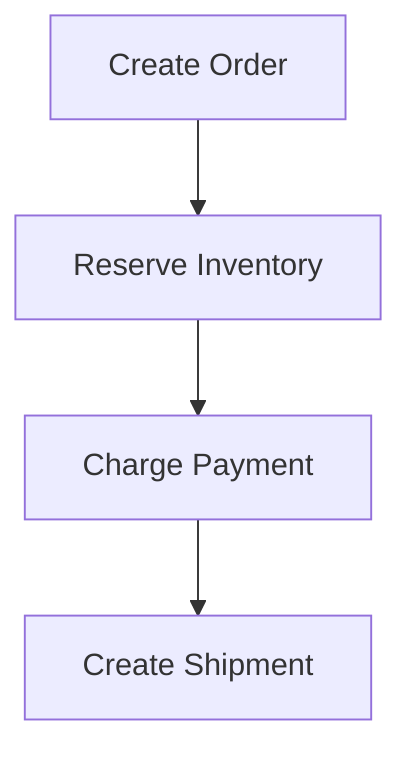

In a monolithic application with one database, you might use a normal database transaction:

```text
BEGIN TRANSACTION

create order
reserve inventory
charge payment
create shipment

COMMIT
```

If anything fails:

```text
ROLLBACK
```

Everything goes back to the original state.

In a microservices architecture, however, these operations may involve different databases and external systems:

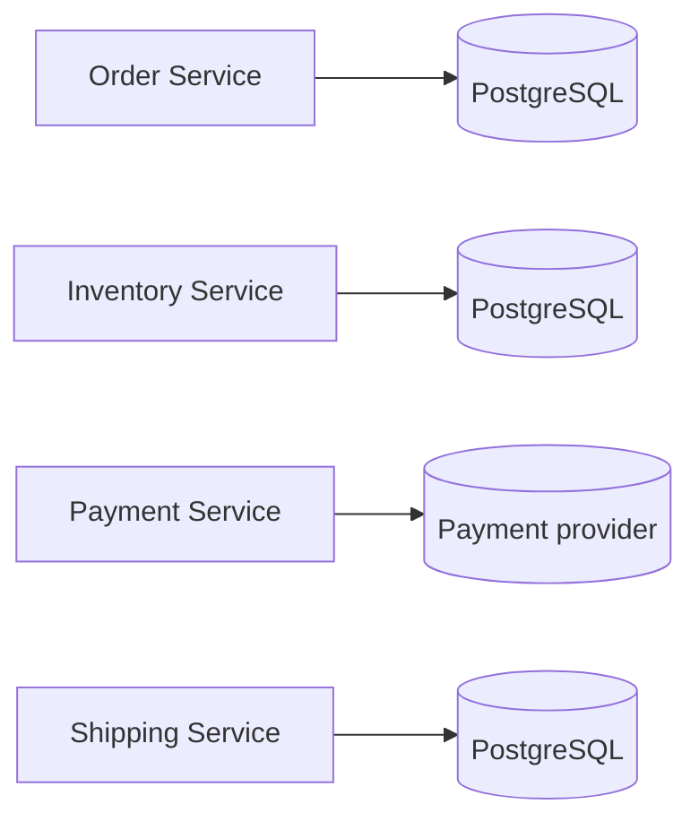

There is no simple local database transaction that atomically covers all of them.

This is where the Saga Pattern comes in.

---

## 2. What is a Saga?

A **Saga** is a sequence of local transactions, where each transaction updates one service's data and then triggers the next step.

For example:

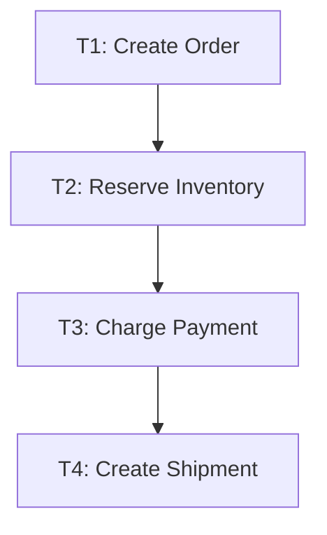

Each transaction commits independently.

If something later fails, the Saga executes **compensating transactions** to undo the business effects of previous steps.

For example:

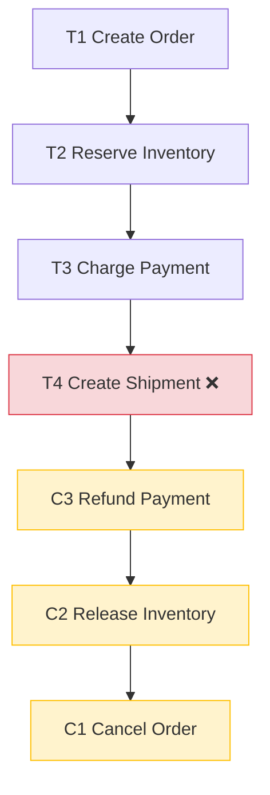

The key idea is:

> A Saga does not provide a traditional database rollback. It provides business-level compensation.

---

## 3. Database transaction vs Saga

Consider a normal database transaction:

```text
BEGIN

UPDATE accounts
SET balance = balance - 100
WHERE id = 1;

UPDATE accounts
SET balance = balance + 100
WHERE id = 2;

COMMIT
```

If the second operation fails:

```text
ROLLBACK
```

The database restores the original state.

With a Saga, things are different.

Suppose:

```text
Charge credit card
```

succeeds.

Later:

```text
Create shipment
```

fails.

You cannot necessarily "rollback" the credit-card charge.

Instead, you perform another business operation:

```text
Refund credit card
```

So:

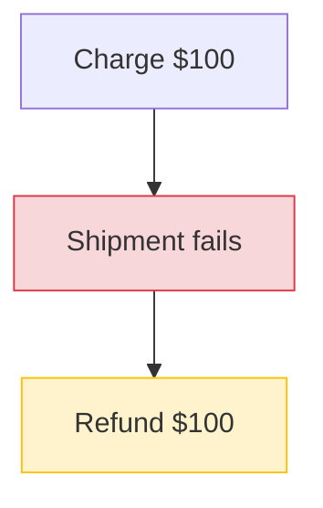

The refund is a **compensating transaction**.

---

## 4. Key terminology

### Local transaction

A transaction performed by one service.

Example:

```text
Inventory Service:

BEGIN
UPDATE inventory
SET available = available - 1
WHERE product_id = 123;
COMMIT
```

### Saga step

One business operation in the overall Saga.

Example:

```text
1. Create Order
2. Reserve Inventory
3. Charge Payment
4. Create Shipment
```

### Compensating transaction

An operation that semantically reverses a previous operation.

Examples:

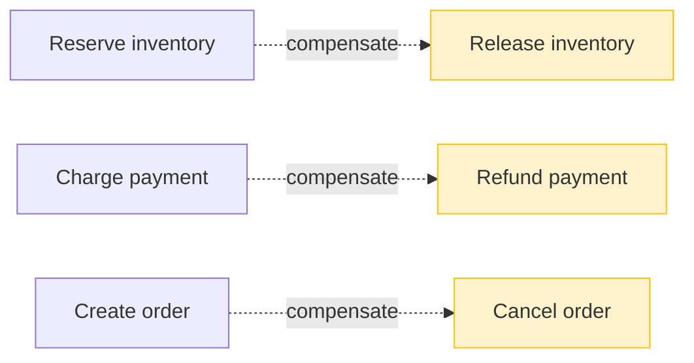

---

## 5. Concrete e-commerce example

Suppose a customer purchases a MacBook for $2,000.

The Saga might be:

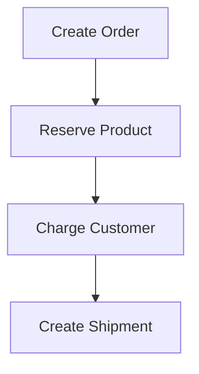

If everything succeeds:

```text
Order = CONFIRMED
Inventory = RESERVED
Payment = PAID
Shipment = CREATED
```

Now imagine shipment creation fails:

```text
Order = CREATED
Inventory = RESERVED
Payment = PAID
Shipment = FAILED
```

The Saga compensates:

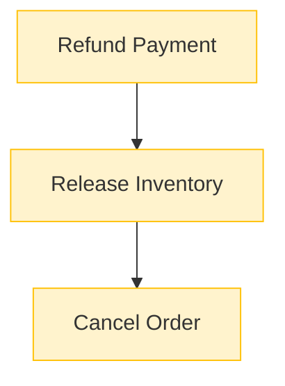

Final state:

```text
Order = CANCELLED
Inventory = AVAILABLE
Payment = REFUNDED
Shipment = NOT_CREATED
```

This is the Saga's eventual consistent state.

---

## 6. Why eventual consistency?

During execution, the system can temporarily be inconsistent.

For example:

```text
Order = CREATED
Inventory = RESERVED
Payment = PAID
Shipment = FAILED
```

This isn't necessarily the final state.

The Saga is still running.

After compensation:

```text
Order = CANCELLED
Inventory = AVAILABLE
Payment = REFUNDED
Shipment = FAILED
```

The system has reached the intended business state.

Therefore:

> A Saga usually provides eventual consistency rather than immediate global consistency.

---

# 7. Two major Saga implementations

There are two common approaches:

1. **Choreography**
2. **Orchestration**

They solve the same fundamental problem but coordinate the workflow differently.

---

# 8. Saga choreography

In choreography, there is **no central coordinator**.

Services communicate through events.

For example:

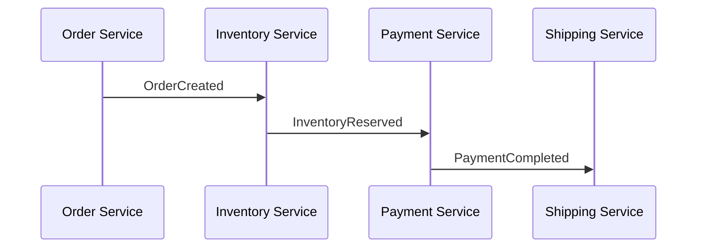

Each service listens for events and decides what to do next.

### Example

Order Service:

```typescript
await orderRepository.create(order);

await eventBus.publish({
  type: "OrderCreated",
  orderId: order.id,
});
```

Inventory Service:

```typescript
on("OrderCreated", async (event) => {
  await inventory.reserve(event.orderId);

  await eventBus.publish({
    type: "InventoryReserved",
    orderId: event.orderId,
  });
});
```

Payment Service:

```typescript
on("InventoryReserved", async (event) => {
  await payment.charge(event.orderId);

  await eventBus.publish({
    type: "PaymentCompleted",
    orderId: event.orderId,
  });
});
```

Shipping Service:

```typescript
on("PaymentCompleted", async (event) => {
  await shipping.create(event.orderId);
});
```

The workflow emerges from the events.

---

# 9. Choreography failure

Suppose payment fails:

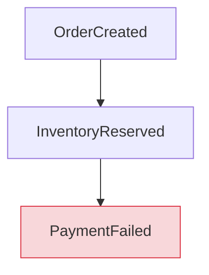

Payment might publish:

```text
PaymentFailed
```

Inventory listens:

```typescript
on("PaymentFailed", async (event) => {
  await inventory.release(event.orderId);
});
```

Order Service could also listen:

```typescript
on("PaymentFailed", async (event) => {
  await orders.cancel(event.orderId);
});
```

So:

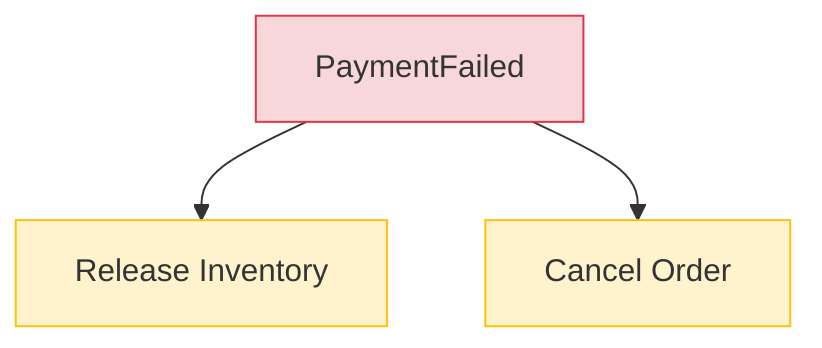

---

# 10. Advantages of choreography

Choreography can be elegant.

There is no giant central workflow service.

Services simply react to events:

```text
OrderCreated
InventoryReserved
PaymentCompleted
ShipmentCreated
```

This can work particularly well when the workflow is relatively simple.

---

# 11. Problems with choreography

As the system becomes more complex, event relationships can become difficult to understand.

Imagine:

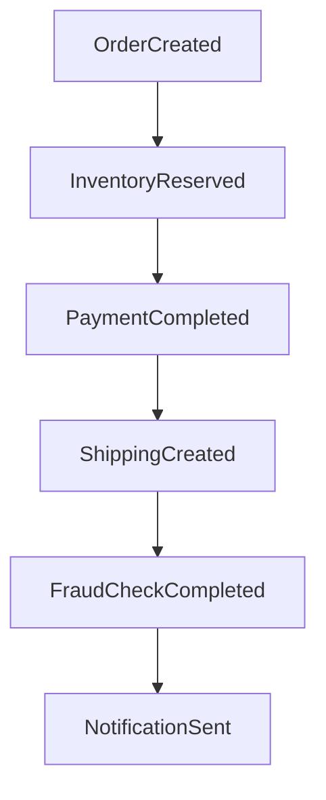

Then add failures:

```text
PaymentFailed
InventoryReservationFailed
FraudCheckFailed
ShipmentFailed
PaymentRefunded
InventoryReleased
OrderCancelled
...
```

Eventually, the workflow can become difficult to reason about.

A common question becomes:

> What exactly happens when step 5 fails?

This is one reason orchestration exists.

---

# 12. Saga orchestration

With orchestration, you introduce a **Saga Orchestrator**.

Instead of services deciding what happens next, a central component coordinates the workflow.

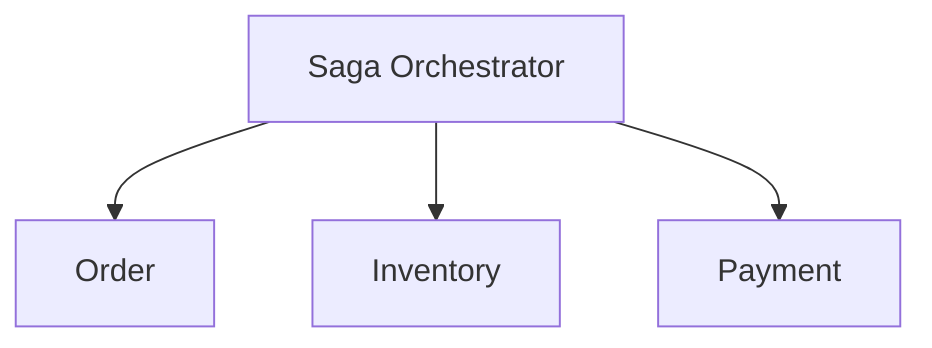

The orchestrator knows the workflow:

```text
1. Create Order
2. Reserve Inventory
3. Charge Payment
4. Create Shipment
```

If step 4 fails:

```text
1. Create Order       ✓
2. Reserve Inventory  ✓
3. Charge Payment     ✓
4. Create Shipment    ✗
```

The orchestrator can execute:


---

# 13. Orchestration example

A simplified implementation might look like:

```typescript
class OrderSaga {
  async execute(orderId: string) {
    await orderService.create(orderId);

    try {
      await inventoryService.reserve(orderId);
      await paymentService.charge(orderId);
      await shippingService.create(orderId);

      await orderService.confirm(orderId);
    } catch (error) {
      await this.compensate(orderId);
      throw error;
    }
  }

  async compensate(orderId: string) {
    await paymentService.refund(orderId);
    await inventoryService.release(orderId);
    await orderService.cancel(orderId);
  }
}
```

This is only a conceptual example.

A production implementation cannot rely on an in-memory `try/catch`, because the orchestrator itself can crash.

That leads to the next important concept.

---

# 14. The orchestrator must be durable

Suppose:

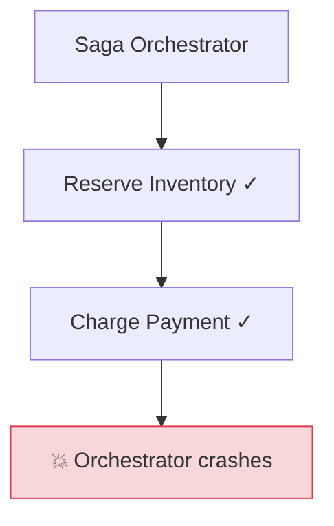

When it restarts, it needs to know where it was.

You might persist:

```text
saga_id: abc123
order_id: 987
state: PAYMENT_COMPLETED
```

When the orchestrator restarts:

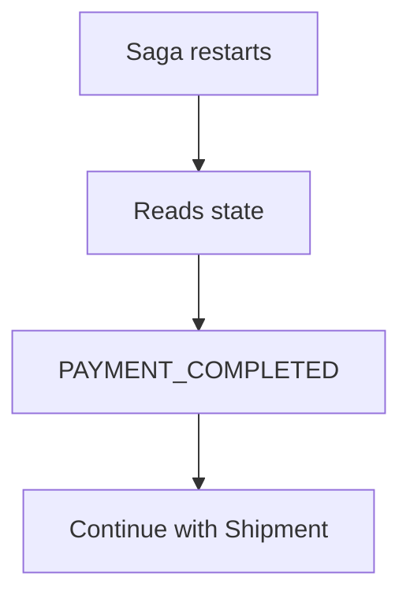

A Saga orchestrator is therefore often implemented as a **durable state machine**.

---

# 15. Saga as a state machine

This is one of the best mental models.

Success path:

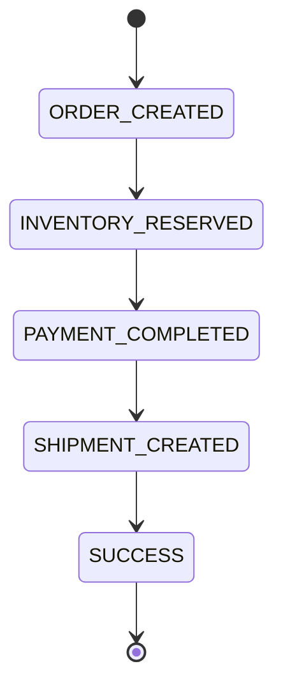

Failure path:

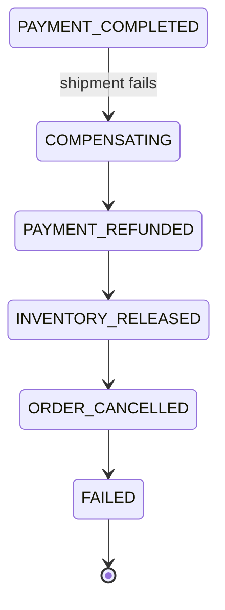

Thinking about the Saga as a state machine makes workflow behavior much easier to design and reason about.

---

# 16. Node.js / TypeScript architecture

A typical architecture could look like:

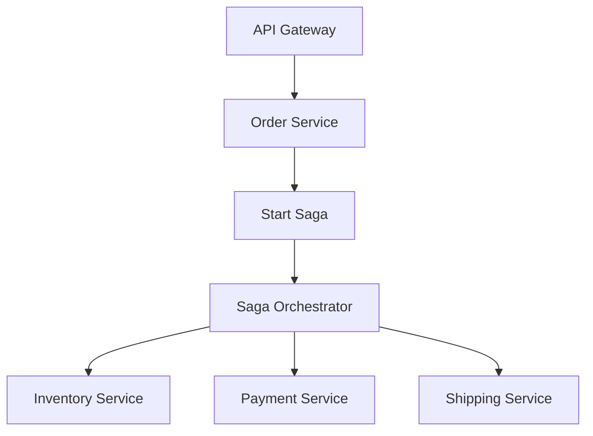

Communication could happen through:

- Kafka
- RabbitMQ
- AWS SQS/SNS
- NATS
- Azure Service Bus
- another message broker

---

# 17. Why not just use HTTP?

You could technically have:

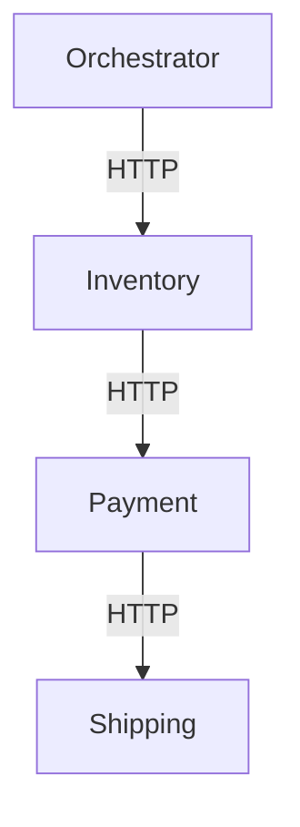

But distributed systems introduce failures:

- service crashes
- network timeouts
- slow responses
- lost responses
- duplicate requests
- partial failures

Messaging systems can provide durable communication and decouple services.

That said, HTTP is not inherently wrong. The important part is that the Saga's state and failure handling are durable and correctly designed.

---

# 18. Retries and the duplicate-request problem

Imagine the orchestrator sends:

```text
ReserveInventory(order123)
```

Inventory processes it:

```text
Inventory = RESERVED
```

But the response is lost.

The orchestrator sees:

```text
TIMEOUT
```

It doesn't know whether inventory was actually reserved.

So it retries:

```text
ReserveInventory(order123)
```

Inventory receives the same request again.

If the operation isn't idempotent, you could reserve two units.

This is why **idempotency is essential** in distributed workflows.

---

# 19. Idempotency

An operation is idempotent if performing it multiple times produces the same effective result as performing it once.

For example, a service can associate a unique command ID with each operation:

```text
commandId = cmd_123
```

The service stores processed commands:

```text
processed_commands
------------------
command_id
order_id
operation
```

On receiving a command:

```typescript
if (await commandRepository.exists(commandId)) {
  return;
}

await performOperation();

await commandRepository.record(commandId);
```

The behavior becomes:

```mermaid
flowchart TD
    A[First request] --> B[Process] --> C[Store commandId]
    D[Second request] --> E[commandId already exists] --> F[Ignore / return previous result]
```

This is critical when messages can be delivered more than once.

---

# 20. Transactional Outbox Pattern

Saga is frequently combined with the **Transactional Outbox Pattern**.

Consider:

```typescript
await db.transaction(async tx => {
  await tx.orders.create(order);

  await tx.events.create({
    type: "OrderCreated",
    payload: order
  });
});
```

Both operations happen in the same local database transaction.

Either:

```text
Order created
Event stored
```

or:

```text
Neither happens
```

A background worker then publishes the outbox event:

```mermaid
flowchart TD
    DB[(Database)] --> O[orders]
    DB --> OE[outbox_events]
    OE --> EP[Event Publisher] --> K[Kafka]
```

---

# 21. The dual-write problem

Without an Outbox, you might do:

```typescript
await db.orders.create(order);

await kafka.publish("OrderCreated", order);
```

What if:

```text
db.orders.create() ✓

kafka.publish() 💥
```

Now the order exists but the event was never published.

The system is inconsistent.

The Outbox Pattern addresses this by putting the database write and event record into one local transaction.

---

# 22. Saga + Outbox

A robust architecture can look like:

```mermaid
flowchart TD
    SO[Saga Orchestrator] -->|command/message| OS[Order Service]
    OS --> TX{DB transaction}
    TX --> Orders[Orders]
    TX --> Outbox[Outbox]
    Orders --> EP[Event Publisher]
    Outbox --> EP
    EP --> Kafka[(Kafka)]
    Kafka --> Inv[Inventory]
    Kafka --> Pay[Payment]
    Kafka --> Ship[Shipping]
```

The combination of:

```text
Saga
+
Transactional Outbox
+
Durable messaging
+
Idempotent consumers
```

is a common foundation for reliable distributed workflows.

---

# 23. Compensation isn't always possible

This is a subtle but important issue.

Suppose:

```text
Payment charged
```

You may be able to compensate with:

```text
Refund
```

But imagine:

```text
Email sent
```

You cannot literally undo the email.

Likewise:

```text
Shipment delivered
```

is not trivially reversible.

Therefore, when designing a Saga, ask:

> What happens if every step after this operation fails?

For each step, determine whether a compensating action exists.

---

# 24. Compensation is not necessarily reversal

Suppose:

```text
Reserve inventory
```

compensates with:

```text
Release inventory
```

That's straightforward.

But:

```text
Send customer notification
```

might compensate with:

```text
Send correction notification
```

rather than "undoing" the original notification.

So compensation is better understood as:

> Returning the business process to an acceptable business state, not necessarily restoring every byte to its previous value.

---

# 25. Saga vs. Two-Phase Commit (2PC)

You may also encounter **Two-Phase Commit (2PC)**.

2PC attempts to coordinate multiple systems in a distributed transaction.

Conceptually:

```mermaid
flowchart TD
    C[Coordinator] -->|Prepare| A[(DB A)]
    C -->|Prepare| B[(DB B)]
    C -->|Prepare| D[(DB C)]
    A --> Y{All YES?}
    B --> Y
    D --> Y
    Y -->|Yes| Commit[Commit]
```

2PC can provide stronger transactional semantics, but it has significant drawbacks:

- coordination overhead
- resource retention/locking
- failure complexity
- reduced availability in some failure scenarios
- scalability concerns
- tighter coupling between participants

Saga takes a different approach:

```mermaid
flowchart TD
    A[Local transaction] --> B[Local transaction] --> C[Local transaction] --> D[Compensate if necessary]

    classDef compensate fill:#fff3cd,stroke:#ffc107
    class D compensate
```

The trade-off is that you give up traditional global atomicity in exchange for service autonomy and better scalability.

---

# 26. When should you use Saga?

Saga is useful when:

- multiple services participate in one business workflow
- each service owns its own database
- the operation requires failure recovery
- distributed transactions aren't practical
- eventual consistency is acceptable

Examples include:

### E-commerce

```text
Create Order
Reserve Inventory
Charge Payment
Create Shipment
```

### Travel booking

```text
Reserve Flight
Reserve Hotel
Reserve Car
```

If hotel reservation fails:

```text
Cancel Flight
Cancel Car
```

### Subscription system

```text
Create Subscription
Charge Payment
Provision Account
Enable Features
```

### Financial workflows

```text
Create Transfer
Debit Account A
Credit Account B
Notify User
```

---

# 27. When Saga may be a bad idea

Don't automatically use Saga just because you're using microservices.

If an operation can live comfortably inside one database transaction, a normal transaction is often much simpler.

For example:

```text
Create user
+
Create user profile
+
Create user settings
```

If all three belong to the same service/database:

```text
BEGIN
...
COMMIT
```

is usually preferable.

Saga introduces substantial complexity.

---

# 28. Choreography vs. orchestration

| | Choreography | Orchestration |
|---|---|---|
| Coordinator | No | Yes |
| Communication | Events | Commands/events |
| Central workflow | No | Yes |
| Simple workflows | Excellent | Good |
| Complex workflows | Can become difficult | Usually better |
| Visibility | Harder | Easier |
| Workflow logic | Distributed | Centralized |
| Debugging | Can be difficult | Usually easier |

A rough guideline:

```mermaid
flowchart TD
    A[Simple workflow] --> B[Choreography may work well]
    C[Complex workflow] --> D[Orchestration is often easier]
```

This is not an absolute rule.

---

# 29. A practical Saga abstraction in TypeScript

You might model a Saga step like:

```typescript
interface SagaStep {
  name: string;

  execute(context: SagaContext): Promise<void>;

  compensate(context: SagaContext): Promise<void>;
}
```

Example:

```typescript
class CreateOrderStep implements SagaStep {
  name = "CreateOrder";

  async execute(ctx: SagaContext) {
    await orderService.create(ctx.orderId);
  }

  async compensate(ctx: SagaContext) {
    await orderService.cancel(ctx.orderId);
  }
}
```

Inventory:

```typescript
class ReserveInventoryStep implements SagaStep {
  name = "ReserveInventory";

  async execute(ctx: SagaContext) {
    await inventoryService.reserve(
      ctx.orderId,
      ctx.items
    );
  }

  async compensate(ctx: SagaContext) {
    await inventoryService.release(
      ctx.orderId
    );
  }
}
```

Payment:

```typescript
class ChargePaymentStep implements SagaStep {
  name = "ChargePayment";

  async execute(ctx: SagaContext) {
    const payment = await paymentService.charge(
      ctx.orderId,
      ctx.amount
    );

    ctx.paymentId = payment.id;
  }

  async compensate(ctx: SagaContext) {
    await paymentService.refund(
      ctx.paymentId
    );
  }
}
```

A simplified coordinator:

```typescript
class OrderSaga {
  constructor(
    private readonly steps: SagaStep[]
  ) {}

  async execute(ctx: SagaContext) {
    const completed: SagaStep[] = [];

    try {
      for (const step of this.steps) {
        await step.execute(ctx);
        completed.push(step);
      }
    } catch (error) {
      for (const step of completed.reverse()) {
        await step.compensate(ctx);
      }

      throw error;
    }
  }
}
```

Again, this is an educational model. A production implementation needs persistence, retries, idempotency, timeouts, durable messaging, and careful handling of compensation failures.

---

# 30. Production Saga state

You might maintain a table such as:

```text
sagas
------------------------------------------------
id
type
aggregate_id
state
current_step
created_at
updated_at
version
```

Example:

```json
{
  "id": "saga_123",
  "type": "OrderCreation",
  "aggregateId": "order_456",
  "state": "WAITING_FOR_PAYMENT",
  "currentStep": "CHARGE_PAYMENT",
  "version": 7
}
```

This allows the Saga to resume after crashes.

---

# 31. State transitions

A good implementation explicitly models states.

Success:

```mermaid
stateDiagram-v2
    [*] --> STARTED
    STARTED --> ORDER_CREATED
    ORDER_CREATED --> INVENTORY_RESERVED
    INVENTORY_RESERVED --> PAYMENT_COMPLETED
    PAYMENT_COMPLETED --> SHIPMENT_CREATED
    SHIPMENT_CREATED --> COMPLETED
    COMPLETED --> [*]
```

Failure:

```mermaid
stateDiagram-v2
    PAYMENT_COMPLETED --> SHIPMENT_FAILED
    SHIPMENT_FAILED --> COMPENSATING
    COMPENSATING --> PAYMENT_REFUNDED
    PAYMENT_REFUNDED --> INVENTORY_RELEASED
    INVENTORY_RELEASED --> ORDER_CANCELLED
    ORDER_CANCELLED --> FAILED
    FAILED --> [*]
```

Explicit state transitions are much safer than having implicit workflow logic scattered throughout services.

---

# 32. Important production concerns

A production Saga needs to consider:

### Idempotency

Messages can be delivered multiple times.

### Retries

Transient failures should generally be retried with exponential backoff:

```text
1s
2s
4s
8s
...
```

### Dead-letter queues

Repeatedly failing messages can eventually move to a DLQ:

```mermaid
flowchart TD
    Q[Queue] --> C[Consumer] --> F[Failure] --> R1[Retry] --> R2[Retry] --> R3[Retry] --> DLQ[DLQ]

    classDef failed fill:#f8d7da,stroke:#dc3545
    class F,DLQ failed
```

### Timeouts

Never let a Saga wait indefinitely.

For example:

```text
WAITING_FOR_PAYMENT
```

might have a 30-minute timeout.

Then:

```text
PaymentTimeout
     ↓
Compensation
```

### Concurrency

Two operations might modify the same order simultaneously.

Potential tools include:

- optimistic locking
- version numbers
- unique constraints
- serialized processing
- explicit state-transition validation

### Observability

Use a correlation ID:

```text
correlationId = saga_123
```

and include it in logs:

```text
sagaId
orderId
correlationId
step
event
```

You should be able to trace:

```text
Saga 123

OrderCreated
InventoryReserved
PaymentStarted
PaymentCompleted
ShipmentFailed
RefundStarted
RefundCompleted
InventoryReleased
OrderCancelled
```

---

# 33. The most important mental model

Don't think of Saga as:

> "A transaction spanning multiple databases."

Think of it as:

> **A durable business process composed of multiple independent local transactions, with explicit recovery and compensation logic.**

Traditional transaction:

```mermaid
flowchart TD
    A["A + B + C"] --> B[COMMIT] --> C[all succeed]
```

Saga:

```mermaid
flowchart TD
    A[A] --> AC[commit] --> B[B] --> BC[commit] --> C[C] --> CC[commit] --> D["D fails"]
    D --> CompC[compensate C] --> CompB[compensate B] --> CompA[compensate A]

    classDef failed fill:#f8d7da,stroke:#dc3545
    classDef compensate fill:#fff3cd,stroke:#ffc107
    class D failed
    class CompC,CompB,CompA compensate
```

---

# 34. A practical Node.js microservice architecture

For a reasonably complex system:

```mermaid
flowchart TD
    API[API] --> OS[Order Service] --> SO[Saga Orchestrator]
    SO -->|Commands/Events| Inv[Inventory]
    SO -->|Commands/Events| Pay[Payment]
    SO -->|Commands/Events| Ship[Shipping]
    Inv --> DB1[(DB)]
    Pay --> Prov[(Provider)]
    Ship --> DB2[(DB)]
```

A robust technology combination could be:

```text
PostgreSQL
    +
Transactional Outbox
    +
Kafka / RabbitMQ / SQS
    +
Persistent Saga Orchestrator
    +
Idempotent Consumers
    +
Retries + DLQ
    +
OpenTelemetry / distributed tracing
```

---

# 35. Summary

The seven most important points to remember are:

1. **Saga solves distributed business transactions.**
2. **A Saga consists of local transactions.**
3. **There is no global rollback.**
4. **Failures are handled with compensating transactions.**
5. **Choreography uses events; orchestration uses a coordinator.**
6. **Idempotency, retries, persistence, and observability are essential in production.**
7. **Saga provides eventual consistency rather than the same atomicity as a single database transaction.**

The canonical example is:

```mermaid
flowchart TD
    subgraph Success Path
        A1[Create Order] --> A2[Reserve Inventory] --> A3[Charge Payment] --> A4[Create Shipment] --> A5[Order Confirmed]
    end
    subgraph Failure Path
        B1["Create Order ✓"] --> B2["Reserve Inventory ✓"] --> B3["Charge Payment ✓"] --> B4["Create Shipment ✗"]
        B4 --> B5[Refund Payment] --> B6[Release Inventory] --> B7[Cancel Order]
    end

    classDef failed fill:#f8d7da,stroke:#dc3545
    classDef compensate fill:#fff3cd,stroke:#ffc107
    class B4 failed
    class B5,B6,B7 compensate
```

## Final mental model

Think of a Saga as:

```mermaid
flowchart TD
    A[A durable workflow] --> B1[local transaction]
    A --> B2[local transaction]
    A --> B3[local transaction]
    A --> C{failure?}
    C --> D[compensate previous work]
    A --> E[eventually reach a valid business state]

    classDef compensate fill:#fff3cd,stroke:#ffc107
    class D compensate
```

For a Node.js/TypeScript microservice system, the next practical step is to implement this with a message broker such as Kafka or RabbitMQ, PostgreSQL, a Transactional Outbox, and a persistent Saga Orchestrator, while handling service crashes, duplicate messages, lost responses, retries, and compensation failures.
