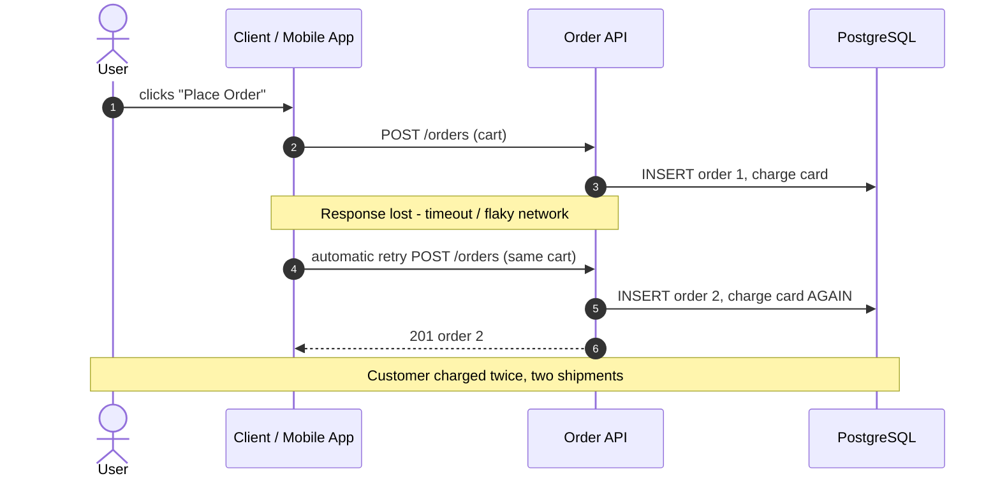
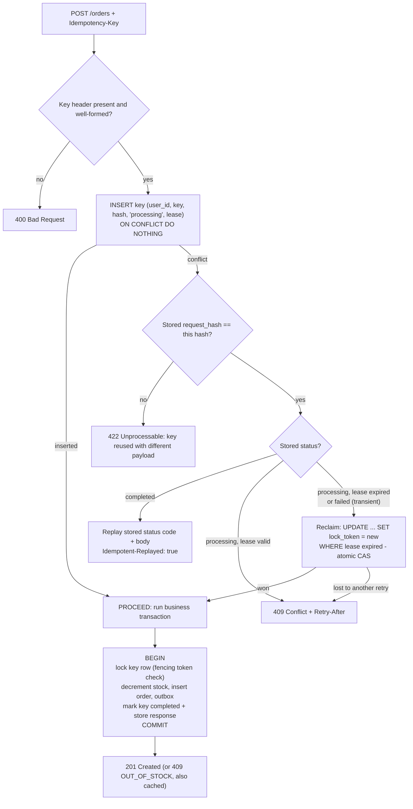
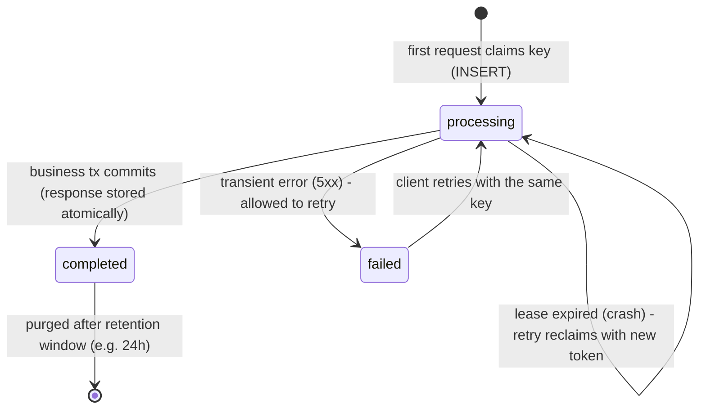
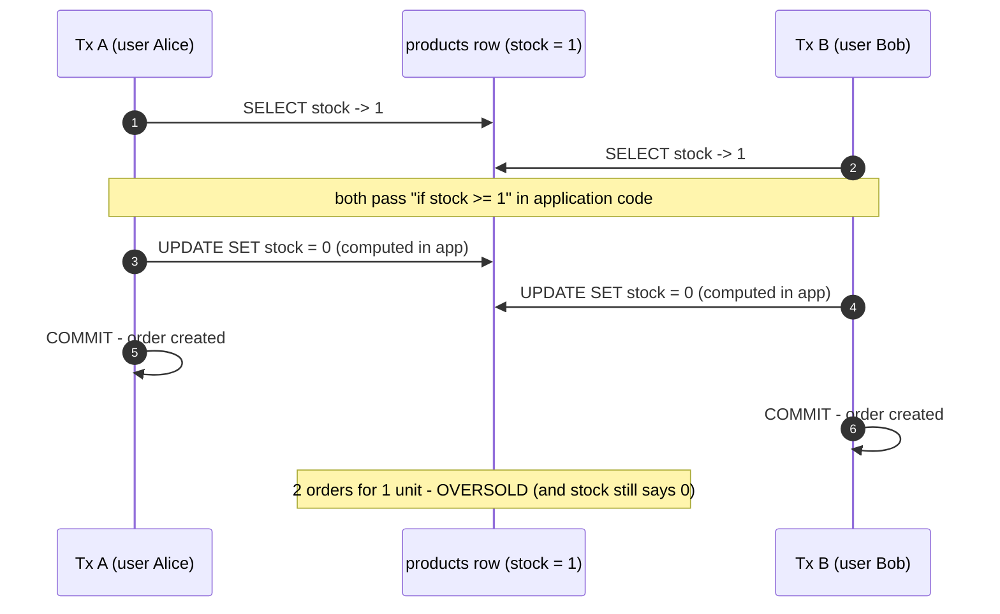
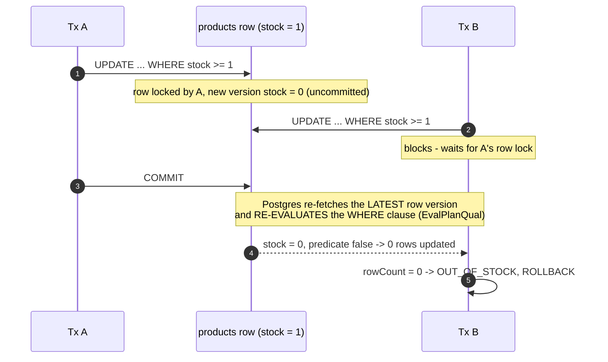
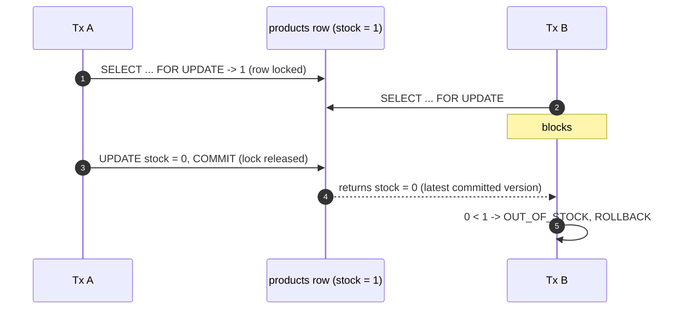
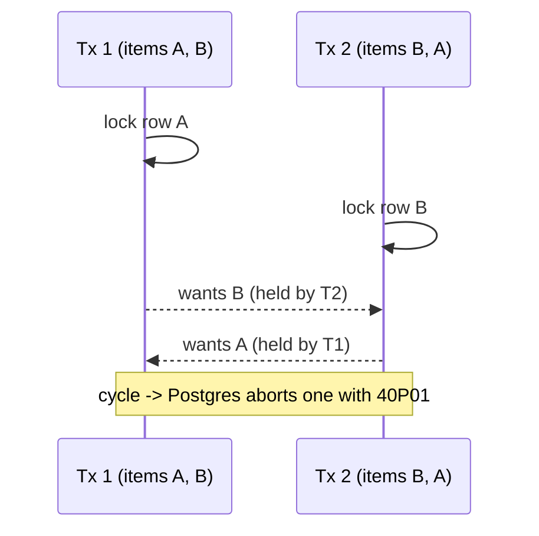
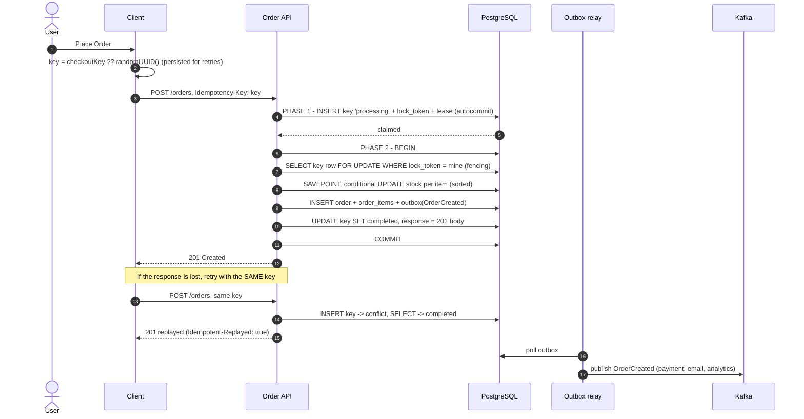
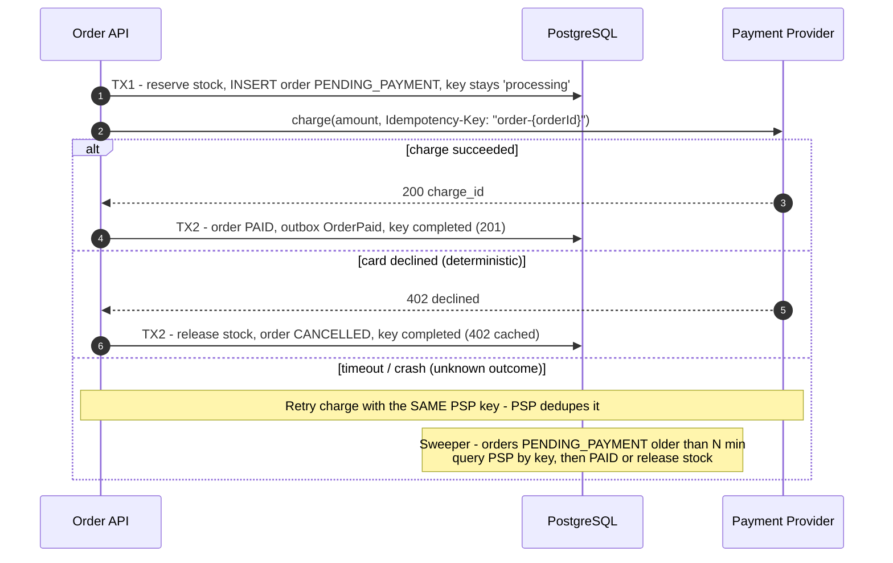

# Order Placement: Idempotency & Inventory Concurrency (Node.js + PostgreSQL)

> **Two problems that look alike but need different tools:**
> 1. **Duplicate submission.** The *same* logical request arrives more than once (double-click, mobile retry, gateway timeout, at-least-once queue). → **Idempotency keys**
> 2. **Contention.** *Different* requests compete for the *same* scarce resource (the last unit in stock). → **Atomic stock check-and-decrement / locking**
>
> An idempotency key does **nothing** for problem 2, and row locking does **nothing** for problem 1. Production order endpoints need both, **in the same transaction**.
>
> Related: [04 – Race conditions, deadlocks & locks](04-race_conditions_deadlocks_database_locks.md) · [02 – Saga pattern](02-saga-pattern-in-depth.md) · [10 – Change tracking](10-change-tracking-audit-log.md)

---

## 0. TL;DR (the 60-second interview answer)

1. The **client** generates an `Idempotency-Key` **once per checkout attempt** and reuses it on every retry.
2. The **server** scopes the key to the user, fingerprints the request body, and claims the key with `INSERT … ON CONFLICT DO NOTHING`:
   - Key is new → process the request.
   - Key is completed → replay the stored response.
   - Key is in flight → `409` + `Retry-After`.
   - Same key with a different body → `422`.
3. Stock is decremented with a **conditional atomic update**: `UPDATE … SET stock = stock - $q WHERE id = $id AND stock >= $q`. `rowCount = 0` means out of stock. A `CHECK (stock >= 0)` constraint backs it up.
4. **One DB transaction** does the stock decrement, the order insert, the outbox event, and marking the key `completed` with its response. So "order exists" ⇔ "key completed".
5. Multi-item orders lock rows in **sorted product-id order** to avoid deadlocks.
6. At flash-sale scale, a single hot row serializes all buyers. Escalate to a Redis gate, sharded inventory rows, or a per-SKU queue.
7. **Payment** (an external side effect) can't be inside a DB transaction. Use reserve → charge (forwarding an idempotency key to the payment provider) → confirm or compensate. This is a saga.

---

## 1. Problem 1: Duplicate submissions

### 1.1 What goes wrong without protection



The key insight is that **a timeout is ambiguous**. The client cannot know whether the request failed before or after the side effect. The only safe way to retry is to make the retry recognizable as the same request.

### 1.2 Sources of duplicates (not just double-clicks)

| Source | Example |
|---|---|
| UI | Double-click, button not disabled, page refresh on the POST result |
| Client retry | Mobile SDK / `axios-retry` retries on timeout |
| Infrastructure | Load balancer or API gateway retries an upstream that timed out |
| Messaging | At-least-once delivery (Kafka/SQS) redelivers the `PlaceOrder` command |

Disabling the button fixes only the first row. The **server** must be idempotent.

### 1.3 Idempotency key: the contract

- Client sends `Idempotency-Key: <uuid>` on non-idempotent requests (`POST`). This matches the IETF *httpapi* "Idempotency-Key" header draft and Stripe's API.
- Server guarantees: **the first request with a given key executes once. Any repeat with the same key and payload gets the same response.**
- The key identifies the *attempt*, not the cart. After the user edits the cart, the client generates a new key.

⚠️ **Most common real-world bug:** generating a fresh UUID *per click / per HTTP call*. Every retry then looks brand new, and the whole scheme silently does nothing.

### 1.4 Decision flow on the server



### 1.5 Key lifecycle



**What to cache as `completed`:** only **deterministic outcomes**: `201 Created`, and business rejections like `409 OUT_OF_STOCK`. The key's answer is now final, and the user needs a new attempt (new key) to try again. **Do not cache** transient failures (5xx, DB timeout, deadlock). Mark them `failed` so a retry re-executes.

---

## 2. Problem 2: Inventory race conditions (overselling)

### 2.1 The naive read-check-write race (a *lost update*)



Idempotency keys don't help: Alice and Bob send **different** keys. The check (`SELECT`) and the act (`UPDATE`) must be **one atomic step**, or the row must be locked between them.

Even `SET stock = stock - 1` *without* a `WHERE stock >= 1` guard is wrong. It never loses an update, but it happily drives stock to `-1`.

### 2.2 Option A: Conditional atomic update (recommended default)

```sql
UPDATE products
   SET stock_quantity = stock_quantity - $2
 WHERE id = $1 AND stock_quantity >= $2
RETURNING stock_quantity;
-- rowCount = 1 → reserved;  rowCount = 0 → out of stock (or unknown product)
```

The original guide calls this "optimistic style". **It is not optimistic locking.** An `UPDATE` always takes a row-level exclusive lock. What makes it correct is how Postgres handles the waiter under `READ COMMITTED`:



- Under **`READ COMMITTED`** (the Postgres default), B waits, re-checks, and gets `rowCount = 0`. There are no retries or errors.
- Under **`REPEATABLE READ` / `SERIALIZABLE`**, B instead fails with `40001 could not serialize access due to concurrent update`, and the application **must retry**.
- One round-trip, the lock is held only until commit, and there's no read-then-write gap.

### 2.3 Option B: Pessimistic lock (`SELECT … FOR UPDATE`)

```sql
BEGIN;
SELECT stock_quantity, max_per_customer FROM products WHERE id = $1 FOR UPDATE; -- B blocks here
-- arbitrary application logic with the row frozen (limits, pricing rules, fraud checks…)
UPDATE products SET stock_quantity = stock_quantity - $2 WHERE id = $1;
COMMIT;
```



Use it when the decision needs **application logic that SQL can't express**, or several reads that must be consistent. Its costs:
- The lock is held for the whole round-trip time between statements. **Never** make an HTTP call while holding it.
- Variants: `FOR UPDATE NOWAIT` fails immediately with `55P03` so you can return a fast 409. `FOR UPDATE SKIP LOCKED` ignores locked rows, which is useful for job queues and inventory buckets (§4).

### 2.4 Option C: True optimistic concurrency (version column / CAS)

No lock is held while the application "thinks". Conflicts are detected at write time, and the loser retries.

```javascript
async function decrementOptimistic(pool, productId, qty, maxAttempts = 5) {
  for (let attempt = 0; attempt < maxAttempts; attempt++) {
    const { rows: [p] } = await pool.query(
      'SELECT stock_quantity, version FROM products WHERE id = $1', [productId]);
    if (!p || p.stock_quantity < qty) return false;

    // ...application logic here (no lock held)...

    const { rowCount } = await pool.query(
      `UPDATE products SET stock_quantity = $2, version = version + 1
        WHERE id = $1 AND version = $3`,               // compare-and-swap on version
      [productId, p.stock_quantity - qty, p.version]);
    if (rowCount === 1) return true;                    // our snapshot was still current
    await new Promise((r) => setTimeout(r, 2 ** attempt * 5 + Math.random() * 10)); // backoff + jitter
  }
  throw new Error('CONTENTION: too many concurrent updates, try again');
}
```

This is great for **low-contention** records edited by humans (a product description, a user profile), and is how ORMs implement `@Version`. It is **bad for a hot inventory row**: under contention most attempts lose and retry, which wastes work and can starve.

### 2.5 Option D: `SERIALIZABLE` isolation

Write the naive read-check-write code, run it under `SERIALIZABLE`, and retry on `40001`. Postgres SSI detects the dangerous pattern. It's correct and simple to reason about, but needs a retry wrapper everywhere and aborts more often under load. It's a reasonable choice when invariants span many rows or tables and are hard to express as one conditional update.

### 2.6 Comparison

| | Conditional UPDATE | `FOR UPDATE` | Optimistic (version) | `SERIALIZABLE` |
|---|---|---|---|---|
| Round-trips | 1 | 2+ | 2+ (× retries) | 2+ (× retries) |
| Lock held during app logic | No | **Yes** | No | No (SSI tracking) |
| Loser behaviour | Waits, then `rowCount=0` | Waits, then reads new value | Retries | Error `40001`, retries |
| Complex app-side checks | ❌ (only what fits in SQL) | ✅ | ✅ | ✅ |
| High contention (hot SKU) | ✅ best | ⚠️ OK if short | ❌ retry storms | ❌ abort storms |
| **Use for** | **Stock decrement** | Multi-read decisions | Low-contention edits | Complex cross-row invariants |

**Defense in depth:** add `CHECK (stock_quantity >= 0)`. If any code path forgets the guard, the DB rejects it with `23514` instead of overselling.

### 2.7 Multi-item orders: deadlocks

Order 1 = [A, B], Order 2 = [B, A]. Tx 1 locks A, Tx 2 locks B, then each waits on the other. That's a **deadlock**: Postgres kills one after `deadlock_timeout` with error `40P01`.



**Fix:** always lock rows in the same global order. Merge duplicate lines, **sort by product id**, then decrement in that order. Keep a retry-on-`40P01` wrapper anyway as a safety net.

---

## 3. Combined solution: one endpoint, both problems

### 3.1 End-to-end flow



### 3.2 Why two phases (and why the original single-transaction design misleads)

**The original design** runs `INSERT key 'pending'`, then the order, then `UPDATE key 'completed'`, all in **one** transaction. What actually happens in Postgres:

- The `'pending'` row is **uncommitted, so it is invisible** to other sessions. A concurrent duplicate's `INSERT` **blocks on the unique index** until the first transaction ends. It then gets `23505` and reads `'completed'` (or succeeds if the first rolled back).
- Consequences:
  - The `409 "in progress"` branch is **dead code**.
  - Every duplicate **holds a pooled connection while blocked**, so a retry storm can exhaust the pool.
  - The design can't cover **external side effects** (payment), because those can't live inside one DB transaction.
- It is still *correct* for pure-DB work: the unique index acts as a lock. That's worth saying in the interview. The two-phase design is needed once a request outlives a single transaction.

**The two-phase design:**
- **Phase 1** (autocommit, milliseconds): claim the key so it's **visible** to others. This enables fast `409` responses and survives across external calls.
- **Phase 2** (one transaction): business effects **plus** key completion, committed atomically.
- **Lease + fencing token:** if the process crashes after phase 1, the lease expires and a retry reclaims the key with a **new token**. The first thing phase 2 does is `SELECT … FOR UPDATE WHERE lock_token = mine`. That blocks reclaimers while we're alive in the transaction, and makes a zombie holding an old token abort instead of creating a second order.

### 3.3 Schema

```sql
CREATE TABLE products (
  id             uuid PRIMARY KEY,
  name           text    NOT NULL,
  price_cents    integer NOT NULL CHECK (price_cents >= 0),
  stock_quantity integer NOT NULL CHECK (stock_quantity >= 0),   -- invariant enforced by the DB
  version        integer NOT NULL DEFAULT 0                      -- only for optimistic flows (§2.4)
);

CREATE TABLE idempotency_keys (
  user_id       uuid        NOT NULL,
  key           text        NOT NULL,
  request_hash  text        NOT NULL,          -- sha256(method + path + canonical body)
  status        text        NOT NULL CHECK (status IN ('processing', 'completed', 'failed')),
  lock_token    uuid,                          -- fencing token of the current owner
  locked_until  timestamptz,                   -- lease; expired = owner presumed dead
  response_code integer,
  response_body jsonb,
  created_at    timestamptz NOT NULL DEFAULT now(),
  updated_at    timestamptz NOT NULL DEFAULT now(),
  PRIMARY KEY (user_id, key)                   -- scoped per user: no cross-user collisions/leaks
);
CREATE INDEX ON idempotency_keys (created_at); -- for the retention purge

CREATE TABLE orders (
  id              uuid PRIMARY KEY DEFAULT gen_random_uuid(),
  user_id         uuid    NOT NULL,
  idempotency_key text    NOT NULL,
  status          text    NOT NULL,
  total_cents     integer NOT NULL,
  created_at      timestamptz NOT NULL DEFAULT now(),
  UNIQUE (user_id, idempotency_key)            -- belt and braces: DB refuses a 2nd order per key
);

CREATE TABLE order_items (
  order_id         uuid    NOT NULL REFERENCES orders(id),
  product_id       uuid    NOT NULL REFERENCES products(id),
  quantity         integer NOT NULL CHECK (quantity > 0),
  unit_price_cents integer NOT NULL,
  PRIMARY KEY (order_id, product_id)
);

CREATE TABLE outbox (
  id           bigserial PRIMARY KEY,
  aggregate_id uuid        NOT NULL,
  type         text        NOT NULL,
  payload      jsonb       NOT NULL,
  created_at   timestamptz NOT NULL DEFAULT now(),
  published_at timestamptz
);
```

### 3.4 `idempotency.js`

```javascript
import { createHash, randomUUID } from 'node:crypto';

const LEASE_SECONDS = 30;
export const KEY_PATTERN = /^[A-Za-z0-9_-]{16,128}$/;

export class LostLeaseError extends Error {}

/** Stable JSON: {a,b} and {b,a} must hash identically. */
function canonicalJson(value) {
  if (Array.isArray(value)) return `[${value.map(canonicalJson).join(',')}]`;
  if (value && typeof value === 'object') {
    return `{${Object.keys(value).sort()
      .map((k) => `${JSON.stringify(k)}:${canonicalJson(value[k])}`).join(',')}}`;
  }
  return JSON.stringify(value);
}

export const fingerprint = (req) =>
  createHash('sha256').update(`${req.method} ${req.path}\n${canonicalJson(req.body)}`).digest('hex');

/**
 * PHASE 1: short autocommit statements (no long transaction).
 * Returns { action: 'proceed', token } | { action: 'replay' | 'reject', code, body, retryAfter? }
 */
export async function claimKey(pool, { userId, key, hash }) {
  const token = randomUUID();

  // 1) Brand-new key: we own it. The row is committed immediately, so duplicates SEE it.
  const inserted = await pool.query(
    `INSERT INTO idempotency_keys (user_id, key, request_hash, status, lock_token, locked_until)
     VALUES ($1, $2, $3, 'processing', $4, now() + $5 * interval '1 second')
     ON CONFLICT (user_id, key) DO NOTHING`,
    [userId, key, hash, token, LEASE_SECONDS]);
  if (inserted.rowCount === 1) return { action: 'proceed', token };

  // 2) Existing key: take it over ONLY if the previous owner died (lease expired) or failed transiently.
  //    A single UPDATE is an atomic compare-and-swap: two racing retries can't both win.
  const reclaimed = await pool.query(
    `UPDATE idempotency_keys
        SET status = 'processing', lock_token = $4,
            locked_until = now() + $5 * interval '1 second', updated_at = now()
      WHERE user_id = $1 AND key = $2 AND request_hash = $3
        AND (status = 'failed' OR (status = 'processing' AND locked_until < now()))`,
    [userId, key, hash, token, LEASE_SECONDS]);
  if (reclaimed.rowCount === 1) return { action: 'proceed', token };

  // 3) Someone else owns it, it's finished, or the payload differs.
  const { rows: [row] } = await pool.query(
    `SELECT request_hash, status, response_code, response_body
       FROM idempotency_keys WHERE user_id = $1 AND key = $2`,
    [userId, key]);

  if (row && row.request_hash !== hash) {
    return { action: 'reject', code: 422,
      body: { error: 'IDEMPOTENCY_KEY_REUSED', message: 'Key was used with a different request body' } };
  }
  if (row?.status === 'completed') {
    return { action: 'replay', code: row.response_code, body: row.response_body };
  }
  return { action: 'reject', code: 409, retryAfter: 1,
    body: { error: 'IDEMPOTENCY_IN_PROGRESS', message: 'A request with this key is being processed' } };
}

/** PHASE 2, first statement: lock our key row and prove we still own it (fencing). */
export async function lockOwnedKey(client, { userId, key, token }) {
  const { rowCount } = await client.query(
    `SELECT 1 FROM idempotency_keys
      WHERE user_id = $1 AND key = $2 AND lock_token = $3 AND status = 'processing'
      FOR UPDATE`,
    [userId, key, token]);
  if (rowCount !== 1) throw new LostLeaseError('Idempotency key was reclaimed by another attempt');
}

/** PHASE 2, last statement: store the final response in the SAME tx as the business writes. */
export async function completeKey(client, { userId, key, code, body }) {
  await client.query(
    `UPDATE idempotency_keys
        SET status = 'completed', response_code = $3, response_body = $4,
            lock_token = NULL, locked_until = NULL, updated_at = now()
      WHERE user_id = $1 AND key = $2`,
    [userId, key, code, JSON.stringify(body)]);
}

/** Transient failure: release the key so a retry re-executes (don't cache 5xx). */
export async function failKey(pool, { userId, key, token }) {
  await pool.query(
    `UPDATE idempotency_keys
        SET status = 'failed', lock_token = NULL, locked_until = NULL, updated_at = now()
      WHERE user_id = $1 AND key = $2 AND lock_token = $3`,
    [userId, key, token]);
}
```

### 3.5 `order.service.js`: stock + order in one transaction

```javascript
export class OutOfStockError extends Error {
  constructor(productId) {
    super(`Insufficient stock (or unknown product): ${productId}`);
    this.productId = productId;
  }
}

/** Must be called inside an open transaction on `client`. */
export async function placeOrder(client, { userId, idempotencyKey, items }) {
  // Merge duplicate lines, then SORT: every tx locks product rows in the same order → no deadlocks.
  const merged = new Map();
  for (const { productId, quantity } of items) merged.set(productId, (merged.get(productId) ?? 0) + quantity);
  const lines = [...merged].sort(([a], [b]) => (a < b ? -1 : a > b ? 1 : 0));

  const priced = [];
  for (const [productId, quantity] of lines) {
    // Atomic check-and-decrement. Price comes from the DB, never from the client.
    const { rows: [p] } = await client.query(
      `UPDATE products SET stock_quantity = stock_quantity - $2
        WHERE id = $1 AND stock_quantity >= $2
        RETURNING price_cents`,
      [productId, quantity]);
    if (!p) throw new OutOfStockError(productId);
    priced.push({ productId, quantity, unitPriceCents: p.price_cents });
  }
  const totalCents = priced.reduce((sum, l) => sum + l.unitPriceCents * l.quantity, 0);

  const { rows: [order] } = await client.query(
    `INSERT INTO orders (user_id, idempotency_key, status, total_cents)
     VALUES ($1, $2, 'created', $3) RETURNING id, status, total_cents`,
    [userId, idempotencyKey, totalCents]);

  await client.query(
    `INSERT INTO order_items (order_id, product_id, quantity, unit_price_cents)
     SELECT $1::uuid, * FROM unnest($2::uuid[], $3::int[], $4::int[])`,
    [order.id, priced.map((l) => l.productId), priced.map((l) => l.quantity), priced.map((l) => l.unitPriceCents)]);

  await client.query(
    `INSERT INTO outbox (aggregate_id, type, payload) VALUES ($1, 'OrderCreated', $2)`,
    [order.id, JSON.stringify({ orderId: order.id, userId, totalCents, items: priced })]);

  return order;
}
```

### 3.6 `routes/orders.js`: wiring it together

```javascript
import express from 'express';
import { pool } from '../db.js';
import { authenticate } from '../auth.js';
import { KEY_PATTERN, LostLeaseError, fingerprint, claimKey, lockOwnedKey, completeKey, failKey }
  from '../idempotency.js';
import { placeOrder, OutOfStockError } from '../order.service.js';

export const router = express.Router();

router.post('/orders', authenticate, async (req, res, next) => {
  const key = req.get('Idempotency-Key');
  if (!key || !KEY_PATTERN.test(key)) {
    return res.status(400).json({ error: 'Idempotency-Key header (16-128 url-safe chars) is required' });
  }
  const userId = req.user.id; // from the verified token, NOT req.body

  let claim;
  try {
    claim = await claimKey(pool, { userId, key, hash: fingerprint(req) });
  } catch (err) {
    return next(err);
  }

  if (claim.action === 'replay') {
    return res.set('Idempotent-Replayed', 'true').status(claim.code).json(claim.body);
  }
  if (claim.action === 'reject') {
    if (claim.retryAfter) res.set('Retry-After', String(claim.retryAfter));
    return res.status(claim.code).json(claim.body);
  }

  const client = await pool.connect();
  try {
    await client.query('BEGIN');
    await lockOwnedKey(client, { userId, key, token: claim.token });

    let code, body;
    await client.query('SAVEPOINT place_order');
    try {
      const order = await placeOrder(client, { userId, idempotencyKey: key, items: req.body.items });
      [code, body] = [201, { orderId: order.id, status: order.status, totalCents: order.total_cents }];
    } catch (err) {
      if (!(err instanceof OutOfStockError)) throw err;
      // Undo partial decrements of earlier items, but KEEP the key lock and cache this outcome.
      await client.query('ROLLBACK TO SAVEPOINT place_order');
      [code, body] = [409, { error: 'OUT_OF_STOCK', productId: err.productId }];
    }

    await completeKey(client, { userId, key, code, body });
    await client.query('COMMIT'); // order + stock + outbox + cached response: all or nothing
    return res.status(code).json(body);
  } catch (err) {
    await client.query('ROLLBACK').catch(() => {});
    if (!(err instanceof LostLeaseError)) {
      await failKey(pool, { userId, key, token: claim.token }).catch(() => {});
    }
    return next(err); // 5xx: NOT cached, client may retry with the same key
  } finally {
    client.release();
  }
});
```

### 3.7 Client side: generate once, retry with the same key

```javascript
const sleep = (ms) => new Promise((r) => setTimeout(r, ms));

export async function submitOrder(checkout) {
  // One key per checkout attempt; survives retries (persist it in state/sessionStorage for reloads).
  checkout.idempotencyKey ??= crypto.randomUUID();

  for (let attempt = 0; attempt < 5; attempt++) {
    try {
      const res = await fetch('/api/orders', {
        method: 'POST',
        headers: { 'Content-Type': 'application/json', 'Idempotency-Key': checkout.idempotencyKey },
        body: JSON.stringify({ items: checkout.items }),
      });
      const retryable = res.status >= 500 ||
        (res.status === 409 && (await res.clone().json()).error === 'IDEMPOTENCY_IN_PROGRESS');
      if (!retryable) return res;                     // 201, replayed 201, OUT_OF_STOCK, 422…
      const retryAfter = Number(res.headers.get('Retry-After')) * 1000;
      await sleep(retryAfter || 2 ** attempt * 200);
    } catch {
      // Network error: the order MAY have been created. Retrying with the SAME key is safe.
      await sleep(2 ** attempt * 200 + Math.random() * 100);
    }
  }
  throw new Error('Could not confirm order. Check order history before retrying');
}
// When the user edits the cart: checkout.idempotencyKey = undefined  → next submit = new attempt.
```

### 3.8 Housekeeping

```sql
-- Retention must be LONGER than the longest client retry window (e.g. 24h). Purge in batches.
DELETE FROM idempotency_keys
 WHERE ctid IN (SELECT ctid FROM idempotency_keys
                 WHERE created_at < now() - interval '24 hours' LIMIT 5000);
```

---

## 4. Scaling: the hot-row problem (flash sales)

Every buyer of SKU X updates **the same row**. Row locks serialize them:

> **max throughput per SKU ≈ 1 / (row-lock hold time)**
> 5 ms of lock hold → ~200 orders/s for that SKU, no matter how many app servers you add.

Mitigations, in order of escalation:

1. **Shorten the hold time.** Commit fast, make no network calls inside the transaction, and move the hot `UPDATE` as **late** in the transaction as possible (insert the order rows first, decrement last, then commit).
2. **Redis gate in front of the DB.** An atomic Lua decrement rejects the 99% who will lose, before they touch Postgres:

   ```javascript
   const RESERVE = `
     local stock = tonumber(redis.call('GET', KEYS[1]) or '0')
     local qty   = tonumber(ARGV[1])
     if stock >= qty then return redis.call('DECRBY', KEYS[1], qty) end
     return -1`;

   const left = await redis.eval(RESERVE, 1, `stock:${sku}`, qty);
   if (left < 0) return res.status(409).json({ error: 'OUT_OF_STOCK' });
   try {
     await placeOrderInPostgres(...);               // still uses the conditional UPDATE: DB stays source of truth
   } catch (err) {
     await redis.incrby(`stock:${sku}`, qty);       // compensate the gate
     throw err;
   }
   ```
   Redis is a **filter, not the truth**. Crashes between the two steps cause drift, so run a periodic reconciliation that recomputes Redis from Postgres.

3. **Sharded inventory (bucketing).** Split the stock of one SKU across N rows. Each buyer grabs a random *unlocked* bucket:

   ```sql
   UPDATE inventory_buckets b SET qty = b.qty - 1
    WHERE (b.sku, b.bucket) = (
          SELECT sku, bucket FROM inventory_buckets
           WHERE sku = $1 AND qty >= 1
           ORDER BY random() LIMIT 1
           FOR UPDATE SKIP LOCKED)          -- skip buckets other buyers hold right now
   RETURNING b.bucket;
   -- 0 rows ≠ sold out necessarily (all buckets may be momentarily locked) → retry / check SUM(qty)
   ```
   This gives roughly N× the throughput. The cost is that "stock remaining" becomes a `SUM`, and the last few units get fiddly.

4. **Queue per SKU.** Accept the request (`202 Accepted` + order id to poll), and publish to Kafka with **partition key = SKU**. A single consumer per partition processes that SKU's orders sequentially, so there's no lock contention at all. Throughput is then bounded by consumer speed, and the UX becomes asynchronous ("we'll confirm in a moment").

5. **Reservations with TTL** (carts / checkout holds). Decrement on "reserve" and write `reservations(order_id, sku, qty, expires_at)`. A sweeper returns expired holds:

   ```sql
   WITH expired AS (
     DELETE FROM reservations
      WHERE id IN (SELECT id FROM reservations WHERE expires_at < now()
                    ORDER BY id LIMIT 500 FOR UPDATE SKIP LOCKED)   -- safe with many sweeper instances
     RETURNING sku, qty)
   UPDATE products p SET stock_quantity = p.stock_quantity + e.qty
     FROM (SELECT sku, SUM(qty) AS qty FROM expired GROUP BY sku) e
    WHERE p.id = e.sku;
   ```

---

## 5. Adding payment: external side effects → saga

Charging a card is a call to Stripe/Adyen. It **cannot** be rolled back by `ROLLBACK`, and it must **never** run while holding DB locks.



Key points:
- **Forward idempotency downstream.** Derive the payment provider's key deterministically from the order (`order-{orderId}`), so any retry of the charge is deduplicated *by the provider*.
- Each step is a local transaction with a **compensation** (release stock, cancel order). This is a saga; see [02 – Saga pattern](02-saga-pattern-in-depth.md).
- The lease of the idempotency key must cover the payment call, or be extended (heartbeat). This is where the two-phase key design (§3.2) is required rather than optional.
- Stripe's engineering write-up on idempotency keys in Postgres (Brandur Leach, "Implementing Stripe-like Idempotency Keys in Postgres") formalizes this as **recovery points** stored on the key row.

---

## 6. Alternative idempotency implementations

| Approach | How | Pros | Cons |
|---|---|---|---|
| **DB key table (this doc)** | Unique `(user_id, key)` + stored response | Atomic with business data, replayable | Extra table, extra writes |
| **Natural idempotency** | Client generates the **order id** (UUID). `INSERT … ON CONFLICT (id) DO NOTHING` | Simplest possible, no extra table | Only for "create" endpoints. Replaying the response requires reading the order back |
| **Unique business constraint** | e.g. `UNIQUE (cart_id)` on orders: one order per cart | Zero extra infrastructure | Needs a natural key. Can't distinguish "retry" from "legit second order" |
| **Redis `SET key NX PX 86400000`** | Claim in Redis, store response in Redis | Very fast, TTL built in | **Not atomic with the DB**: a crash between the Redis claim and the DB commit, or eviction/failover, breaks the guarantee. OK as a front cache, not as the authority |
| **Advisory lock** | `pg_advisory_xact_lock(hashtext(user_id \|\| key))` | Serializes duplicates without a table | Doesn't remember results, so no replay. Only prevents *concurrent* duplicates |
| **Consumer dedupe (messaging)** | `processed_messages(message_id PK)` inserted in the same tx as the effect | Standard for at-least-once consumers | Same pattern, different trigger |

---

## 7. Review of the original guide: issues & fixes

| # | Issue in the original | Consequence | Fix (section) |
|---|---|---|---|
| 1 | Key insert, business logic and completion in **one** transaction | `'pending'` is never visible to other sessions, so the **409 branch is dead code**. Duplicates block on the unique index, each holding a pool connection. Can't span payment calls | Two-phase claim + fenced completion (§3.2) |
| 2 | Error path runs `UPDATE … 'failed'` **after** `ROLLBACK` | The key row was rolled back too, so the update hits **0 rows** (harmless, but misleading dead code) | `failKey` only in the two-phase design, where the key row is committed |
| 3 | `PRIMARY KEY (key)` only | User B sending A's key gets **A's order response** (data leak), and keys collide across users | `PRIMARY KEY (user_id, key)` |
| 4 | No request fingerprint | Same key + different cart silently returns the first order | Store `request_hash`, return `422` on mismatch |
| 5 | `userId` taken from `req.body` | Anyone can place orders or read replays as another user | From the authenticated principal |
| 6 | No recovery for stuck `pending` | Process crash after claiming = key blocked forever | Lease (`locked_until`) + reclaim with a fencing token |
| 7 | Intends to cache `500` as the final answer | Transient errors become permanent for that key | Cache only deterministic outcomes, mark 5xx `failed` |
| 8 | `created_at` index but no cleanup | Table grows forever | Batched retention purge (§3.8) |
| 9 | Part 1's order endpoint never touches inventory. The two parts are never combined | The hard part (both guarantees in one transaction) is skipped | Combined flow (§3) |
| 10 | `stockResult.rows[0].stock_quantity` | Unknown product → `TypeError` → 500 | Conditional `UPDATE … RETURNING`, 0 rows handled |
| 11 | Single-item examples only | Multi-item orders can **deadlock** (`40P01`) | Merge + sort product ids (§2.7) |
| 12 | Conditional update labelled "optimistic" | Wrong mental model: it takes a row lock and relies on predicate re-evaluation | §2.2 vs. real optimistic CAS in §2.4 |
| 13 | No DB-level invariant | One buggy code path can oversell | `CHECK (stock_quantity >= 0)` |
| 14 | `throw err` inside an Express 4 async handler | Unhandled rejection, request hangs | `next(err)` |
| 15 | Client-side key generation not discussed | New UUID per click = no protection at all | §1.3, §3.7 |
| 16 | "Maliciously submits the same request" | Idempotency keys don't stop malicious duplicates: an attacker just sends new keys | Rate limiting, per-user limits, fraud checks |
| 17 | No hot-row / flash-sale or payment discussion | These are the usual interviewer follow-ups | §4, §5 |

---

## 8. Proving it works (demo / integration test)

```javascript
// Run against a real Postgres (e.g. docker run -p 5432:5432 -e POSTGRES_PASSWORD=pw postgres:17)
import { randomUUID } from 'node:crypto';
import assert from 'node:assert/strict';

const post = (userToken, key, items) =>
  fetch('http://localhost:3000/api/orders', {
    method: 'POST',
    headers: { 'Content-Type': 'application/json', Authorization: `Bearer ${userToken}`, 'Idempotency-Key': key },
    body: JSON.stringify({ items }),
  });

// 1) Overselling: 50 different users race for 10 units.
await pool.query('UPDATE products SET stock_quantity = 10 WHERE id = $1', [PID]);
const race = await Promise.all(tokens.slice(0, 50).map((t) => post(t, randomUUID(), [{ productId: PID, quantity: 1 }])));
assert.equal(race.filter((r) => r.status === 201).length, 10);
assert.equal(race.filter((r) => r.status === 409).length, 40);
assert.equal((await pool.query('SELECT stock_quantity FROM products WHERE id = $1', [PID])).rows[0].stock_quantity, 0);

// 2) Duplicates: the same user fires the same key 20x concurrently.
const key = randomUUID();
const dup = await Promise.all(Array.from({ length: 20 }, () => post(tokens[0], key, [{ productId: PID2, quantity: 1 }])));
const { rows } = await pool.query('SELECT count(*)::int AS n FROM orders WHERE idempotency_key = $1', [key]);
assert.equal(rows[0].n, 1);                                               // exactly ONE order
assert.ok(dup.every((r) => r.status === 201 || r.status === 409));        // winner/replays + in-progress
const ids = new Set(await Promise.all(dup.filter((r) => r.status === 201).map(async (r) => (await r.json()).orderId)));
assert.equal(ids.size, 1);                                                // every 201 has the same order id

// 3) Same key, different body → 422.
assert.equal((await post(tokens[0], key, [{ productId: PID2, quantity: 2 }])).status, 422);
```

---

## 9. Interview Q&A bank

**Q: Why not just disable the button?**
It only covers one of the four duplicate sources (§1.2). Mobile retries, gateway retries and queue redelivery never touch the button.

**Q: Where should the key be generated, client or server?**
The client. Only the client knows that two HTTP calls are *the same attempt*. A server-generated key requires an extra round-trip to "start checkout", which is also a valid design (e.g. a checkout-session id), but the idea is the same.

**Q: Idempotency key vs. unique constraint on the order?**
A unique constraint prevents the *duplicate row*. The key also gives you **response replay** (the retry gets the same `201` body), payload-mismatch detection, and it works for non-create operations (charges, transfers). Use both: the key for the API contract, and the constraint as a safety net.

**Q: What if two duplicate requests arrive at exactly the same instant?**
The `INSERT … ON CONFLICT` on the primary key is atomic: exactly one inserts. The other sees the conflict, finds a live lease, and returns `409 + Retry-After`. Its retry then gets the replayed response.

**Q: What if the server crashes mid-request?**
- If it crashed before phase 2 committed: nothing happened. The lease expires and a retry reclaims the key.
- If it crashed after the commit: the key is `completed`, and the retry replays the response.
- There is no in-between state, because phase 2 is atomic. A stale process that wakes up later fails the fencing check.

**Q: Conditional update vs. `SELECT FOR UPDATE`?**
Use the conditional update when the rule fits in a `WHERE` clause (stock ≥ qty): it's one round-trip, the shortest lock, and has no read-write gap. Use `FOR UPDATE` when the decision needs application logic over several reads. Either way, keep transactions short and free of network calls.

**Q: Why not `SERIALIZABLE` everywhere?**
It's correct, but every code path needs retry logic, and under contention abort rates spike. Targeted, explicit concurrency control is cheaper and easier to reason about for a known hot path.

**Q: How do you scale selling 10,000 units in 60 seconds?**
Remove the single-hot-row bottleneck: Redis gate, bucketed inventory with `SKIP LOCKED`, or a per-SKU queue. Keep Postgres as the source of truth with the conditional update and the `CHECK` constraint (§4).

**Q: The user paid but the stock was gone. How do you prevent that?**
Reserve stock **before** charging, and charge only if the reservation succeeded. If the charge fails, release the reservation. If the outcome is unknown, reconcile via the payment provider's idempotency key (§5).

**Q: How long do you keep keys?**
Longer than any client's retry window. Stripe uses 24h. After purging, a very late retry with an old key would be treated as a new request. The permanent `UNIQUE (user_id, idempotency_key)` on `orders` makes it fail with `23505` instead of creating a second order. Map that error to a lookup of the existing order if you want a friendly response.
