# Redis for Node.js: Technical Interview Deep-Dive

> **Scope:** mental model, expiration internals, atomicity (single commands → `MULTI`/`WATCH` → Lua), caching and stampede protection with production-grade code, distributed locks (and why they're hard), rate limiting, Pub/Sub vs. Streams vs. RabbitMQ vs. Kafka, persistence, replication, Cluster, eviction, hot/big keys, connection management and failure modes.
>
> **Client used:** the official [`redis`](https://www.npmjs.com/package/redis) package (node-redis v4/v5 API). `ioredis` notes are given where the API differs.
>
> Related: [08 – Kafka partitioning](08-kafka_partitioning_summary.md) · [11 – Order idempotency & inventory](11-order-concurrency-idempotency.md) (Redis gate for flash sales) · [01 – Interview concepts](01-interview-concepts-deep-dive.md) (Kafka vs. RabbitMQ)

---

## 0. TL;DR (the 60-second interview answer)

1. Redis is an **in-memory data-structure server**. Commands execute **one at a time on a single main thread**, so **each command is atomic**, but a *sequence* of commands is not.
2. To make multi-step logic atomic, use a **single command** (`INCR`, `SET NX`), a **Lua script** (the usual answer), or `MULTI`/`EXEC` with `WATCH` (optimistic).
3. **Caching** = cache-aside + TTL + jitter. For hot keys add **coalescing**, a **rebuild lock**, **stale-while-revalidate** and **probabilistic early refresh**. Invalidate with **delete-after-write**, and know the race it leaves (§6.3).
4. **Locks** use `SET key token NX PX` with a **token-checked release** (Lua). A Redis lock is fine for *efficiency* (avoid duplicate work) but is **not a correctness guarantee** without **fencing tokens** (§7).
5. **Pub/Sub** is fire-and-forget (at-most-once). **Streams** are durable, with consumer groups and acks. **RabbitMQ** is for routing and work queues. **Kafka** is a replayable, partitioned log at high throughput.
6. Replication is **asynchronous**: acknowledged writes can be lost on failover. Treat Redis as a **cache/coordination layer**, not the system of record, unless you've designed for that.
7. Operational must-knows: `maxmemory-policy`, `SCAN` not `KEYS`, `UNLINK` for big keys, hash tags in Cluster, dedicated connections for blocking and subscribe, and fail-open behaviour when Redis is down.

---

## 1. Mental model

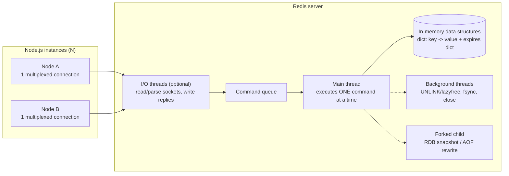

- **Why so fast:** RAM access, no locks on data (single executor), efficient encodings (listpack, intset), an event loop with `epoll`, and pipelining.
- **What "single-threaded" really means:** *command execution* is on one main thread. Since Redis 6, **I/O threads** can parallelize socket reads and writes. Background threads handle lazy frees and `fsync`. `BGSAVE`/`BGREWRITEAOF` **fork** a child process. From the client's point of view, each command is still executed atomically.
- **Consequence:** one slow command (`KEYS *`, `HGETALL` on a 2M-field hash, a long Lua script) **blocks every client**. That's the dark side of single-threaded atomicity.
- **Ecosystem note:** after Redis's 2024 licence change, the Linux Foundation forked it as **Valkey**. It's protocol-compatible, and AWS/GCP offer it as a managed service. Everything in this doc applies to both.

### Key naming

```text
<entity>:<id>[:<sub-resource>]     user:123   user:123:profile   cart:987
<purpose>:<scope>:<id>             lock:product:123   rl:user:123:1717430400
{<hash-tag>}:...                   {user:123}:cart  {user:123}:profile   ← same Cluster slot (§12)
```

Keep keys short but readable (they cost memory × millions). Prefix per service or environment (`checkout:prod:…`) if instances are shared.

---

## 2. Local setup & client lifecycle

Start a throwaway Redis in Docker so you can try every example in this doc, and open `redis-cli` to run commands by hand:

```bash
docker run --name redis-dev -p 6379:6379 -d redis:8
docker exec -it redis-dev redis-cli
```

**Why this code exists**
- **Goal:** create the *one* Redis connection the whole Node process shares, and decide in advance how it behaves when Redis is slow or unreachable. The defaults are tuned for "never lose a command". For a cache, that means requests quietly hang or pile up in memory while Redis is down, which is worse than having no cache.
- **How it helps:**
  - The client reconnects automatically, with a backoff we control.
  - `connectTimeout` stops a dead host from hanging startup.
  - `disableOfflineQueue: true` makes commands **fail immediately** while disconnected, so the app can fall back to the database instead of waiting.
- **Drawbacks:**
  - With the offline queue disabled, *every* command fails during even a short network blip. That's right for a cache, but wrong if Redis holds data you must not drop (queues, sessions). For those, keep the queue and bound it with timeouts.
  - Forgetting the `'error'` listener turns any Redis hiccup into a process crash.

```ts
// redis.ts
import { createClient } from 'redis';

export const redis = createClient({
  url: process.env.REDIS_URL ?? 'redis://localhost:6379',
  socket: {
    connectTimeout: 2_000,
    // Exponential backoff with cap; return an Error to stop retrying.
    reconnectStrategy: (retries) => Math.min(50 * 2 ** retries, 2_000),
  },
  // Cache use-case: fail fast while disconnected instead of queueing commands in memory (§14).
  disableOfflineQueue: true,
});

redis.on('error', (err) => console.error('[redis]', err.message)); // REQUIRED, or errors crash the process
redis.on('reconnecting', () => console.warn('[redis] reconnecting'));

await redis.connect();

// Graceful shutdown: flush pending replies, then close.
process.on('SIGTERM', async () => {
  await redis.quit(); // node-redis v5: redis.close()
  process.exit(0);
});
```

**One client per process is normally right.** node-redis **multiplexes and pipelines** all concurrent commands over one TCP connection, so no pool is needed. The exceptions need **dedicated connections** (`redis.duplicate()`):

| Needs its own connection | Why |
|---|---|
| `SUBSCRIBE` / `PSUBSCRIBE` | A connection in subscriber mode (RESP2) can only run subscribe-family commands |
| Blocking reads: `BLPOP`, `BLMOVE`, `XREAD(GROUP) BLOCK` | They occupy the connection until data arrives, stalling every other command queued behind them |
| `WATCH` … `MULTI`/`EXEC` | `WATCH` is **per-connection** state. On a shared connection, unrelated requests interleave (§4.3) |

---

## 3. Data types: what to reach for

| Type | Typical use | Key commands | Complexity trap |
|---|---|---|---|
| **String** | JSON blobs, counters, flags, tokens, locks | `SET … EX/PX/NX/XX/KEEPTTL/GET`, `INCR(BY)`, `MGET` | Values up to 512 MB (don't) |
| **Hash** | Objects with partial updates, per-field counters | `HSET`, `HGET`, `HINCRBY`, `HMGET` | `HGETALL` on huge hashes → use `HSCAN` |
| **List** | Simple queues, recent-N items | `LPUSH`, `BLMOVE`, `LTRIM`, `LRANGE` | `LINDEX`/`LRANGE` mid-list is O(N) |
| **Set** | Membership, tags, dedup | `SADD`, `SISMEMBER`, `SINTER` | `SMEMBERS` on huge sets → `SSCAN` |
| **Sorted Set** | Leaderboards, time indexes, sliding-window rate limits, delayed jobs | `ZADD`, `ZRANGE … BYSCORE`, `ZINCRBY`, `ZREMRANGEBYSCORE` | O(log N) writes, fine at millions |
| **Stream** | Durable event log with consumer groups | `XADD`, `XREADGROUP`, `XACK`, `XAUTOCLAIM` | Unbounded growth → trim with `MAXLEN ~` |
| **HyperLogLog** | Approximate unique counts (0.81% error, 12 KB) | `PFADD`, `PFCOUNT` | Approximate only |
| **Bitmap / Bitfield** | Daily-active flags per user id, feature bits | `SETBIT`, `BITCOUNT` | Sparse high ids waste memory |
| **Geo** | Nearby search | `GEOADD`, `GEOSEARCH` | Built on a sorted set |

**String JSON vs. Hash:** use a string for read-whole/write-whole (simple, one round-trip, supports `GET`+`SET` with TTL). Use a hash when you update individual fields atomically (`HINCRBY cart:9 qty 1`). Note that per-field TTL (`HEXPIRE`) only exists in recent versions (Redis 7.4+).

### A reliable queue with lists (the original's `LPUSH`/`RPOP` loses jobs)

`RPOP` removes the job **before** it's processed. If the worker crashes, the job is gone. Use `BLMOVE` to atomically move it into a per-worker *processing* list, and remove it only after success.

**Why this code exists**
- **Goal:** hand background jobs (send an email, resize an image) from the API to worker processes, so that **no job is lost** if a worker crashes halfway through.
- **How Redis helps:**
  - `BLMOVE` takes the job off the `jobs` list and puts it on this worker's `processing` list **in one atomic step**. At every moment the job exists in exactly one of the two lists, never in neither.
  - The "B" means *blocking*: the worker sleeps inside Redis until a job arrives, so there's no busy polling.
  - Removing the job from the processing list (`LREM`) after success acts as the "done" acknowledgement.
- **Drawbacks:**
  - You must write a "reaper" that finds jobs stuck in a processing list (a worker died) and puts them back. Deciding how long counts as "stuck" is guesswork.
  - A job may run **twice**: the worker finished it but crashed before `LREM`. Handlers must be idempotent.
  - There are no retry counters, delays or dead-letter queue. This is why Streams or BullMQ are usually better.

```ts
const worker = redis.duplicate(); await worker.connect(); // blocking → dedicated connection

while (running) {
  const job = await worker.blMove('jobs', 'jobs:processing:w1', 'RIGHT', 'LEFT', 5); // 5s timeout
  if (!job) continue;
  await handle(JSON.parse(job));
  await redis.lRem('jobs:processing:w1', 1, job);  // ack
}
// A reaper moves stale items from processing lists back to 'jobs' (at-least-once → handlers must be idempotent).
```

In practice, prefer **Streams** (§9) or a library like **BullMQ**, which is built on Redis and handles retries, delays and stalled-job detection.

---

## 4. Atomicity: from one command to many

### 4.1 Single commands are atomic

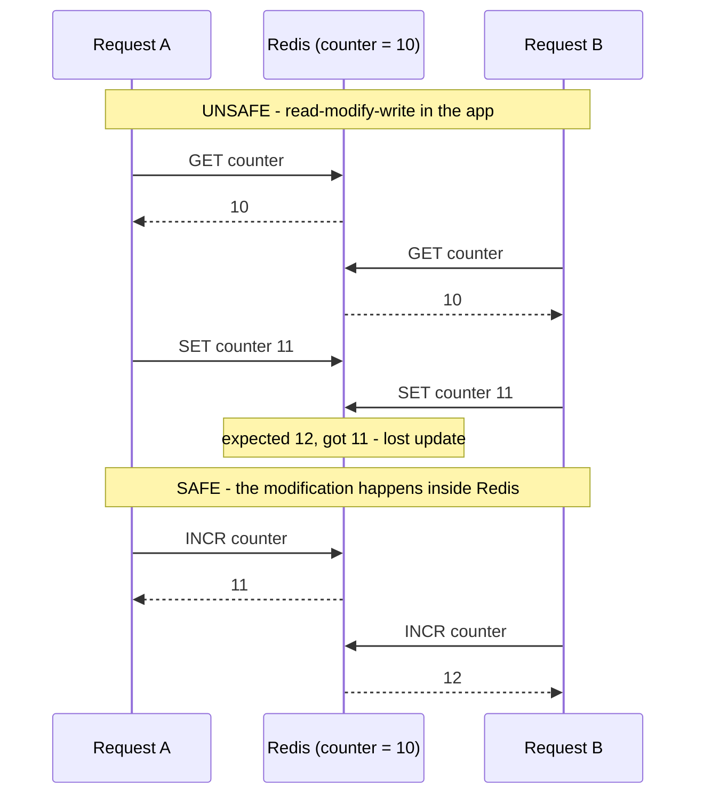

### 4.2 `MULTI` / `EXEC`: batched, isolated, **no rollback**

**Why this code exists**
- **Goal:** run a few write commands as one unit, so no other client can slip a command in between them. The example counts a request **and** makes sure the counter will expire. Sent separately, a crash between the two could leave a counter that never expires.
- **How Redis helps:** after `MULTI`, Redis *queues* the commands instead of running them. On `EXEC` it runs them back-to-back with nothing interleaved, and returns all replies together. It's also one network round-trip instead of two.
- **Drawbacks:**
  - You **can't read a value and decide** what to write inside the transaction, because the results only arrive at the end.
  - If one command fails at runtime, the others are **not undone**.

```ts
const [count] = await redis.multi()
  .incr('rl:user:42:1717430400')
  .expire('rl:user:42:1717430400', 60)
  .exec();
```

- The commands are **queued** and then executed back-to-back. No other client's command runs in between (**isolation**).
- **No rollback:** if command 2 fails at runtime (e.g. `WRONGTYPE`), command 1 stays applied. Only *syntax* errors at queue time abort the whole transaction.
- **You can't branch on intermediate results.** All replies arrive together at `EXEC`. For "read, decide, write", use `WATCH` or Lua.

### 4.3 `WATCH`: optimistic concurrency (CAS)

`WATCH key` makes the next `EXEC` **fail (return null)** if the key was modified in between. The client then retries. This is the same idea as the version-column optimistic lock in SQL.

**Why this code exists**
- **Goal:** move points from Alice to Bob, **only if Alice has enough**. That's a "read → check → write" operation. Without protection, two transfers running at the same time could both read `balance = 50`, both decide 30 is affordable, and leave Alice at `-10`.
- **How Redis helps:** `WATCH` asks Redis to keep an eye on Alice's key. If *anyone* changes it between our read and our `EXEC`, Redis **refuses** the transaction. That tells us our read was stale, and we simply retry with the fresh value. No lock is held while we think. Conflicts are only detected at the end, which is why it's called *optimistic*.
- **How the code works:**
  1. `WATCH` the balance.
  2. Read it.
  3. If it's insufficient, stop.
  4. Otherwise queue decrement + increment in `MULTI`/`EXEC`.
  5. If `EXEC` fails with `WatchError`, loop again (max 5 times).
- **Drawbacks:**
  - It needs a **dedicated connection**. `WATCH` is remembered per connection, and node-redis normally shares one connection between all concurrent requests, so another request's commands could "touch" the watch.
  - Under heavy contention, most attempts fail and retry, which wastes work.
  - It takes three round-trips. The Lua version below is usually better.

```ts
// node-redis v4: executeIsolated gives a dedicated connection (WATCH state is per-connection).
// node-redis v5: use a client pool / redis.duplicate() for this.
async function transferPoints(from: string, to: string, amount: number) {
  for (let attempt = 0; attempt < 5; attempt++) {
    const ok = await redis.executeIsolated(async (conn) => {
      await conn.watch(from);
      const balance = Number(await conn.get(from) ?? 0);
      if (balance < amount) { await conn.unwatch(); throw new Error('INSUFFICIENT'); }
      try {
        await conn.multi().decrBy(from, amount).incrBy(to, amount).exec();
        return true;
      } catch (e) {
        if ((e as Error).name === 'WatchError') return false; // someone changed `from` → retry
        throw e;
      }
    });
    if (ok) return;
  }
  throw new Error('CONTENTION');
}
```

### 4.4 Lua scripts: the usual right answer

A script runs **atomically** (nothing else executes meanwhile), can **branch**, and saves round-trips.

**Why this code exists**
- **Goal:** the same "transfer only if Alice has enough" as §4.3, but simpler and faster, with no retry loop.
- **How Redis helps:** Redis runs the whole Lua script as **one uninterruptible step**. The read, the check and both writes happen with no other client's command running in between, so the race in §4.3 simply cannot occur. It's one network round-trip, and it never has to retry. The script returns `-1` for "not enough" or the new balance.
- **Drawbacks:**
  - While the script runs, **every other client waits**, so scripts must be tiny and fast.
  - Business logic now lives in Lua strings, which are harder to unit-test and debug.
  - In Cluster, all keys must be on the same slot.
  - If the script errors halfway, the writes already made stay.

```ts
const DECR_IF_ENOUGH = `
  local balance = tonumber(redis.call('GET', KEYS[1]) or '0')
  local amount  = tonumber(ARGV[1])
  if balance < amount then return -1 end
  redis.call('DECRBY', KEYS[1], amount)
  redis.call('INCRBY', KEYS[2], amount)
  return balance - amount`;

const left = await redis.eval(DECR_IF_ENOUGH, { keys: ['pts:alice', 'pts:bob'], arguments: ['30'] });
// ioredis: redis.eval(script, 2, 'pts:alice', 'pts:bob', '30')
```

Rules:
- Pass **all keys via `KEYS[]`**. Cluster routing depends on it, and all keys must hash to the **same slot** (§12).
- Keep scripts **short**. A long script blocks the server (after `busy-reply-threshold`, formerly `lua-time-limit`, 5 s by default, Redis answers other clients with `BUSY` and only `SCRIPT KILL`/`SHUTDOWN NOSAVE` work).
- The client caches scripts by SHA (`EVALSHA`) to avoid resending the source. Redis 7 **Functions** (`FUNCTION LOAD`, `FCALL`) are the persistent, named version.
- The script is atomic but **not transactional**: if it errors halfway, the writes before the error remain.

| Need | Use |
|---|---|
| Single counter/flag op | Single command (`INCR`, `SET NX`, `HINCRBY`, `GETDEL`) |
| Batch of writes, no branching | `MULTI`/`EXEC` or a pipeline |
| Read → decide → write | **Lua** (or `WATCH` if you need app-side logic in the middle) |

---

## 5. Expiration internals

```text
SET session:123 "…" EX 3600   →   main dict: session:123 → value
                                 expires dict: session:123 → 1717434000000 (absolute unix ms)
```

- **Passive (lazy):** on every access, Redis checks the expires dict. If the key has expired, it's deleted and treated as missing.
- **Active:** `serverCron` (10×/s by default, `hz`) runs an adaptive cycle. It samples ~20 keys with a TTL, deletes the expired ones, and **repeats while more than ~25% of the sample was expired**, within a CPU time budget. So expired-but-unread keys are reclaimed *eventually*, not instantly, and memory can briefly hold many dead keys.
- **Replicas don't expire keys themselves.** The primary sends `DEL`/`UNLINK` through the replication stream. Replicas *hide* logically expired keys on read, so they never serve expired data.
- `TTL` returns `-2` (no key) or `-1` (no expiry). `PTTL` gives milliseconds. `EXPIRETIME` gives the absolute time (Redis 7).

### TTL gotchas that bite in production

| Gotcha | Example | Fix |
|---|---|---|
| **`SET` clears the TTL** | `SET k v EX 60`, then later `SET k v2` → `k` now lives **forever** | `SET k v2 KEEPTTL`, or always pass `EX` |
| **`INCR` then `EXPIRE` is two steps** | Crash between them → counter without TTL → a rate limit that never resets | `MULTI`, Lua, or `EXPIRE k 60 NX` (Redis 7: only sets if there's no TTL) |
| **`EXPIRE` refreshes on every call** | Rate-limit window slides forever if you `EXPIRE` on every hit | `EXPIRE … NX` |
| **Renaming** | `RENAME` carries the TTL. `PERSIST` removes it | Be explicit |
| **Clock** | Expiry is absolute wall-clock. Big clock jumps on the primary affect expiry | NTP. Avoid relying on sub-second precision |

### TTL jitter

**Why this code exists**
- **Goal:** when thousands of keys are written at the same moment (a warm-up job after a deploy, a nightly import), a fixed TTL makes them all **expire in the same second**. The next second, all those requests miss and hit the database together.
- **How it helps:** each key gets a slightly different lifetime (here up to +10%), so expirations spread over a window instead of a spike. Redis just stores whatever TTL we pass. The randomness is ours.
- **Drawbacks:**
  - Some keys live a bit longer, so data can be slightly staler.
  - It does **nothing** for a single very popular key, because that key still expires at one moment.

```ts
const withJitter = (baseSec: number, spreadRatio = 0.1) =>
  Math.round(baseSec * (1 + Math.random() * spreadRatio)); // 300s → 300–330s
```

Jitter **de-synchronizes many keys** created together (warm-up after deploy, batch imports). It does **not** help a single hot key. That's what §6.4 is for.

---

## 6. Caching

### 6.1 Strategies

| Strategy | Read path | Write path | Consistency | Notes |
|---|---|---|---|---|
| **Cache-aside (lazy)** | App reads cache → on miss reads DB and populates | App writes DB, then **deletes** the cache key | Eventual. Race in §6.3 | Default choice |
| **Read-through** | Cache library loads from DB on miss | Same as above | Same | Cache-aside hidden in a library/proxy |
| **Write-through** | Always cache | Write DB **and** cache synchronously | Stronger | Write latency, caches never-read data |
| **Write-behind** | Always cache | Write cache, flush to DB async | **Risk of data loss** | Counters, analytics. Rarely for money |
| **Refresh-ahead** | Always cache | Background job refreshes before expiry | Bounded staleness | Known hot set (§6.4) |

### 6.2 Cache-aside flow

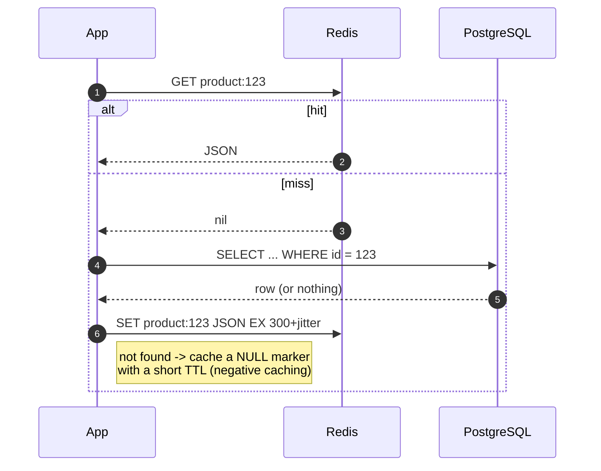

**Negative caching** stops **cache penetration**: requests for ids that don't exist (bots, enumeration attacks) would otherwise always hit the DB. Store a sentinel with a short TTL. For huge key spaces, add a **Bloom filter** of valid ids in front.

### 6.3 The invalidation race (and why "delete, don't set")

On writes, **delete** the key rather than setting it. Two concurrent writers doing `SET` can apply out of order and leave the older value cached. But delete-after-write still has a subtle race with a concurrent reader:

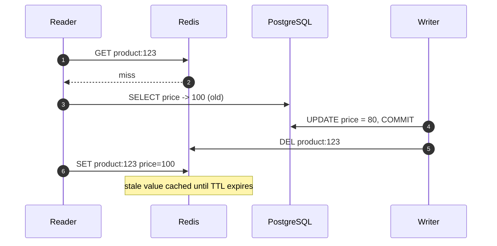

It's rare (the reader's DB read must straddle the whole write), but real. Mitigations, from cheapest up:
1. **Always have a TTL.** It bounds the staleness. This is the pragmatic default.
2. **Delayed double delete:** `DEL` now, and `DEL` again after ~(p99 read latency), for example via a delayed job.
3. **Versioned values:** store `{version, data}` and only `SET` if the version is newer (a Lua CAS), with `version` coming from the DB row (`updated_at` / `xmin` / counter).
4. **CDC-driven invalidation:** Debezium streams row changes → a consumer deletes keys. It's decoupled from app code and catches writes from every service.
5. **Don't cache it** if it must be strongly consistent (balances, stock at checkout). Read from the DB.

Also: **delete *after* the DB commit**, not before and not inside the transaction. Deleting before commit lets a reader re-cache the old value. If the delete fails, the TTL is your safety net. Use the outbox pattern for guaranteed invalidation.

### 6.4 Cache stampede (thundering herd / dogpile)

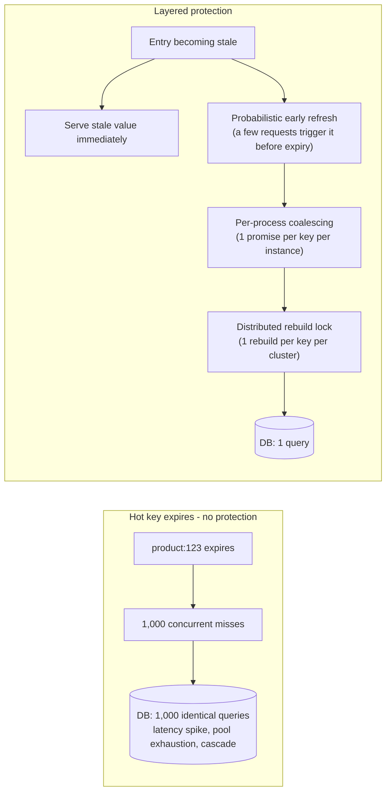

| Technique | Solves | Scope | Cost |
|---|---|---|---|
| TTL jitter | Many keys expiring together | Global | Trivial |
| **In-process coalescing** | N concurrent misses in one Node process → 1 load | Per instance | Trivial. Always do it |
| **Distributed lock** | N instances → 1 load | Cluster-wide | Lock handling, waiters must wait or poll |
| **Stale-while-revalidate** | Latency on expiry. Nobody waits | Global | Serves stale data for a bounded window |
| **Probabilistic early refresh (XFetch)** | Refresh happens *before* expiry, spread randomly | Global | Tiny extra refreshes |
| **Background refresh** | Known hot set never expires | Global | A worker to operate |

### 6.5 Production-grade `cached()` combining all of the above

**Why this code exists**
- **Goal:** give business code a one-line helper, `cached(key, loader)`, that serves popular data from Redis and handles expiry well:
  - When an entry expires, the **database gets one query instead of a thousand**.
  - Users almost **never wait** for a rebuild.
  - If Redis is down, the app still works.
- **How Redis helps:**
  - It's the **shared memory of all Node instances**: one rebuild on server A benefits servers B and C.
  - `SET … NX` is an atomic "only one winner" operation, which gives us a cluster-wide rebuild lock for free.
  - TTLs clean up old entries, and locks left behind by crashed processes, without any extra code.

**How the code works, in plain words**

Every cache value is stored as an envelope: `{ v: data, freshUntil: timestamp, delta: how long the rebuild took }`. When `cached()` is called:

| Situation | What happens | Who waits? |
|---|---|---|
| **Fresh** entry | Return it | Nobody |
| **Almost expired** | Return it. XFetch *randomly* decides to refresh it early in the background (more likely the closer to expiry and the slower the rebuild), so it's usually refreshed **before** it ever goes stale | Nobody |
| **Stale** (past `freshUntil`, but still inside the extra `staleSec` window Redis keeps it) | Return the old value immediately, and start **one** background refresh (*stale-while-revalidate*) | Nobody |
| **Missing** (never cached, or evicted) | Must load it:<br>• Within one Node process, all concurrent callers share **one promise** (`coalesce`), so 500 requests become 1 load.<br>• Across processes, only the one that wins the Redis lock queries the DB. The others poll Redis every ~50–100 ms for up to ~2 s for the winner's result, then give up and query the DB themselves | Only the first callers |
| **Redis down / erroring** | Every read counts as a miss, so load from the DB (fail-open) | Normal DB latency |
| **Item doesn't exist in the DB** | Cache `null` for a short time (`negativeSec`) so bots asking for fake ids don't hammer the DB | Nobody |

- **Drawbacks:**
  - Users can receive data up to `staleSec` old. That's **not** acceptable for prices at checkout, balances or stock.
  - There are many moving parts to test (timers, randomness, locks).
  - On a cold miss, the losers of the lock race can wait up to ~2 s.
  - If Redis dies, *all* traffic goes to the DB, which must survive that (§14).
  - JSON serialization drops `Date`/`BigInt` types.
  - Entries live longer (fresh + stale window), so they use more memory.
- **When not to use it:** for low-traffic keys, plain cache-aside (§6.2) is enough. This machinery pays off for hot, expensive keys.

```ts
// cache.ts
import { randomUUID } from 'node:crypto';
import { redis } from './redis.js';

type Entry<T> = { v: T | null; freshUntil: number; delta: number }; // delta = rebuild time (ms)
type Opts = { freshSec: number; staleSec: number; negativeSec?: number; beta?: number };

const inFlight = new Map<string, Promise<unknown>>();

const RELEASE = `if redis.call('GET', KEYS[1]) == ARGV[1] then return redis.call('DEL', KEYS[1]) end return 0`;

/** XFetch (Vattani et al.): refresh early with probability rising as expiry approaches and with rebuild cost. */
const shouldRefreshEarly = (e: Entry<unknown>, beta = 1) =>
  Date.now() - e.delta * beta * Math.log(Math.random()) >= e.freshUntil;

/** Per-process coalescing: concurrent callers for the same key share ONE promise. */
function coalesce<T>(key: string, fn: () => Promise<T>): Promise<T> {
  const existing = inFlight.get(key);
  if (existing) return existing as Promise<T>;
  const p = fn().finally(() => inFlight.delete(key)); // ALWAYS clean up, including on rejection
  inFlight.set(key, p);
  return p;
}

async function safeGet(key: string): Promise<string | null> {
  try { return await redis.get(key); } catch { return null; } // Redis down → behave like a miss (fail-open)
}

async function write<T>(key: string, value: T | null, delta: number, o: Opts) {
  const fresh = value === null ? (o.negativeSec ?? 30) : o.freshSec;
  const entry: Entry<T> = { v: value, freshUntil: Date.now() + fresh * 1000, delta };
  const ttl = Math.round((fresh + o.staleSec) * (1 + Math.random() * 0.1)); // physical TTL = fresh + stale window + jitter
  await redis.set(key, JSON.stringify(entry), { EX: ttl }).catch(() => {});
}

/** Rebuild guarded by a cluster-wide lock. Returns null if another instance holds the lock. */
async function rebuild<T>(key: string, loader: () => Promise<T | null>, o: Opts): Promise<T | null | undefined> {
  const lockKey = `lock:rebuild:${key}`;
  const token = randomUUID();
  const got = await redis.set(lockKey, token, { NX: true, PX: 10_000 }).catch(() => 'OK'); // Redis down → just load
  if (got !== 'OK') return undefined; // someone else is rebuilding
  try {
    const started = Date.now();
    const value = await loader();
    await write(key, value, Date.now() - started, o);
    return value;
  } finally {
    await redis.eval(RELEASE, { keys: [lockKey], arguments: [token] }).catch(() => {});
  }
}

export async function cached<T>(key: string, loader: () => Promise<T | null>, o: Opts): Promise<T | null> {
  const raw = await safeGet(key);

  if (raw) {
    const entry = JSON.parse(raw) as Entry<T>;
    const stale = Date.now() >= entry.freshUntil;
    if (stale || shouldRefreshEarly(entry, o.beta)) {
      // Stale-while-revalidate: answer now, refresh in the background (coalesced + locked).
      void coalesce(`bg:${key}`, () => rebuild(key, loader, o)).catch(() => {});
    }
    return entry.v;
  }

  // Hard miss: nothing to serve. One loader per process, and one per cluster.
  return coalesce(key, async () => {
    const built = await rebuild(key, loader, o);
    if (built !== undefined) return built;

    // Lost the lock race: poll briefly for the winner's result, then fall back to loading ourselves.
    for (let i = 0; i < 20; i++) {
      await new Promise((r) => setTimeout(r, 50 + Math.random() * 50));
      const again = await safeGet(key);
      if (again) return (JSON.parse(again) as Entry<T>).v;
    }
    return loader(); // bounded degradation: better than failing the request
  });
}

// Usage: the business code stays one line
// const product = await cached(`product:${id}`, () => db.product.findUnique({ where: { id } }),
//                              { freshSec: 300, staleSec: 60, negativeSec: 30 });
```

**Design notes to state out loud:**
- The **logical** expiry (`freshUntil`) is shorter than the **physical** TTL. The gap is the stale-while-revalidate window.
- `delta` (how long the rebuild took) makes XFetch refresh **expensive** keys earlier.
- **Fail-open:** if Redis is down, everything degrades to "load from DB". Make sure the DB survives that (§14).
- JSON loses `Date`, `BigInt` and `Map` types. Use a reviver or `superjson` if needed.
- The lock `PX` (10 s) must exceed the p99 loader time, or two rebuilds can overlap. That only wastes work here, since the cache write is idempotent. See §7.

### 6.6 Multi-level caching (hot keys)

For extremely hot keys (the home-page config, a viral product), even Redis becomes the bottleneck: a single key lives on a **single shard/thread**. Add an **L1 in-process cache** (an LRU with a 1–5 s TTL) in front of Redis (L2). Invalidate L1 across instances with a Pub/Sub message (§9.1), where losing a message is acceptable because the L1 TTL is tiny.

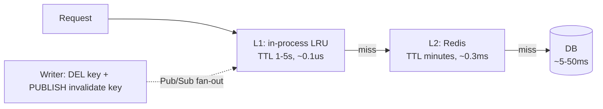

---

## 7. Distributed locks: correctly, and their limits

### 7.1 Minimal correct single-instance lock

**Why this code exists**
- **Goal:** make sure that **only one process across all servers** runs a task at a time. For example, a nightly report cron that is deployed on 5 replicas but must run once, or an expensive cache rebuild.
- **How Redis helps:**
  - `SET lock:x <token> NX PX 30000` is atomic. If 5 servers run it at the same instant, **exactly one** creates the key and gets `OK`. The rest get `null`.
  - `PX` makes the lock **expire by itself**, so a process that crashes while holding it can't block everyone forever.
- **How the code works:**
  1. **Acquire:** generate a random token and `SET NX PX`. If that fails, someone else holds the lock, so throw `LOCKED`. The caller decides whether to skip or retry later.
  2. **Watchdog:** every `ttl/3`, a Lua script extends the expiry, *but only if the key still contains our token*. If the extension fails, we've lost the lock (it expired, or Redis failed over). We then fire an `AbortSignal` so the task can stop what it's doing.
  3. **Release:** a Lua script deletes the key *only if it still contains our token*. This check and the delete must be one atomic step. Otherwise, if our lock expired and someone else took it, a plain `DEL` would delete **their** lock.
- **Drawbacks:**
  - It is **not** an absolute guarantee (see §7.2).
  - The task must actually listen to the `signal` for the abort to mean anything.
  - The watchdog adds a small, steady stream of Redis traffic.
  - A lock held in Redis is lost if Redis loses data (failover, restart without persistence).

```ts
import { randomUUID } from 'node:crypto';

const RELEASE = `if redis.call('GET', KEYS[1]) == ARGV[1] then return redis.call('DEL', KEYS[1]) end return 0`;
const EXTEND  = `if redis.call('GET', KEYS[1]) == ARGV[1] then return redis.call('PEXPIRE', KEYS[1], ARGV[2]) end return 0`;

export async function withLock<T>(resource: string, ttlMs: number, fn: (signal: AbortSignal) => Promise<T>) {
  const key = `lock:${resource}`;
  const token = randomUUID();                                   // proves ownership
  if ((await redis.set(key, token, { NX: true, PX: ttlMs })) !== 'OK') {
    throw new Error(`LOCKED: ${resource}`);
  }

  const ac = new AbortController();
  const watchdog = setInterval(async () => {                    // keep extending while we're alive
    const ok = await redis.eval(EXTEND, { keys: [key], arguments: [token, String(ttlMs)] }).catch(() => 0);
    if (ok !== 1) { ac.abort(); clearInterval(watchdog); }      // lost the lock → tell fn to stop
  }, ttlMs / 3);

  try {
    return await fn(ac.signal);
  } finally {
    clearInterval(watchdog);
    await redis.eval(RELEASE, { keys: [key], arguments: [token] }).catch(() => {}); // only delete OUR lock
  }
}
```

Why each piece matters:
- **`NX`**: acquire only if free. **`PX`**: a crashed holder can't block forever.
- **Random token + Lua release:** without it, A's lock expires, B acquires, and A's `DEL` deletes **B's** lock.
- **Watchdog:** extends the lease for long jobs and detects loss of the lock.

### 7.2 Why a Redis lock is *not* a correctness guarantee

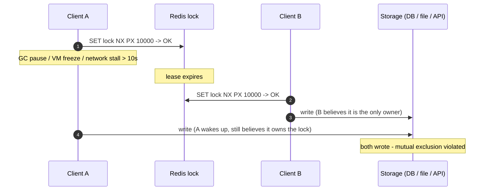

No lease-based lock can prevent this, because the holder cannot know it has been paused. There are more failure modes: **asynchronous replication** (the lock is written to the primary, which fails before replicating; the promoted replica has no lock, so a second client acquires it) and **clock jumps**.

**Fix: fencing tokens.** Each acquisition gets a monotonically increasing number, and the **storage rejects** writes with a token older than one it has already seen.

**Why this code exists**
- **Goal:** accept that two clients may *both* believe they hold the lock (the paused client A above), and make the **protected resource itself** reject the stale one. Only the newest lock holder's writes succeed.
- **How Redis helps:** `INCR fence:<resource>` hands out a strictly increasing number (33, 34, 35…) on each acquisition, atomically, even under concurrency. Client A gets 33, and B (who acquired later) gets 34. The database row stores the highest token it has accepted. The `UPDATE … WHERE fence < $2` only succeeds if our token is newer. So when A wakes up with 33 after B wrote with 34, A's write matches 0 rows and A knows it was superseded.
- **Drawbacks:**
  - The storage must support **conditional writes**. A database can, but an external email or payment API usually can't.
  - It needs an extra column and a check on every protected write.
  - In real code, acquiring the lock and issuing the token should happen in one Lua script, so they can't get out of sync.

```ts
const fence = await redis.incr(`fence:${resource}`);   // issued together with the lock
// …
await db.query(
  `UPDATE documents SET body = $1, fence = $2 WHERE id = $3 AND fence < $2`, // storage enforces ordering
  [body, fence, id]);                                                         // 0 rows → we were superseded
```

**Redlock** (acquire on a majority of N independent primaries) addresses single-node failover, but not pauses. That's the core of the well-known Kleppmann vs. antirez debate.

**Interview framing:**
- **Efficiency locks** (avoid duplicate cache rebuilds or duplicate cron runs; a rare double execution is harmless): a single-instance Redis lock is fine.
- **Correctness locks** (money, inventory, exactly-once side effects): use a DB constraint or transaction, fencing tokens, or a consensus system (etcd/ZooKeeper leases with revision numbers). Don't rely on a Redis lock alone.

---

## 8. Rate limiting with Redis

| Algorithm | Redis structure | Accuracy | Memory per key | Burst behaviour |
|---|---|---|---|---|
| Fixed window | String counter `INCR` + `EXPIRE NX` | Up to 2× limit at window edges | O(1) | Bursty at boundaries |
| Sliding window log | Sorted set of timestamps | Exact | O(limit) | Smooth |
| Sliding window counter | 2 counters, weighted | Approximate (good) | O(1) | Smooth |
| **Token bucket** | Hash `{tokens, ts}` + Lua | Exact, allows controlled bursts | O(1) | Configurable burst |

**Fixed window** (simple, fine for most APIs):

**Why this code exists**
- **Goal:** limit each user to N requests per time window (e.g. 100 per minute), and have the limit hold **across all API servers**, not per server.
- **How Redis helps:**
  - Every server increments the same counter `rl:<user>:<window-number>` in Redis. `INCR` is atomic, so 50 simultaneous requests produce exactly 50 counts.
  - `EXPIRE … NX` sets an expiry only when the key is new. The counter deletes itself after the window, and later hits don't keep pushing that deadline out.
  - `MULTI` sends both commands in one round-trip.
- **Drawbacks:**
  - **Boundary burst:** a user can send 100 requests at 12:00:59 and 100 more at 12:01:00, which is 200 in two seconds.
  - Rejected requests are counted too.
  - `EXPIRE … NX` needs Redis 7+. On older versions, use Lua.

```ts
async function fixedWindow(userId: string, limit: number, windowSec: number) {
  const window = Math.floor(Date.now() / 1000 / windowSec);
  const key = `rl:${userId}:${window}`;
  const [count] = await redis.multi().incr(key).expire(key, windowSec, 'NX').exec();
  return Number(count) <= limit;
}
```

**Token bucket** (Lua, atomic, uses Redis's clock so app-server clock skew doesn't matter):

**Why this code exists**
- **Goal:** a smoother limit than fixed windows that still allows short bursts. Picture each user holding a bucket of up to 20 tokens that refills at 5 tokens per second. Each request spends one token, and an empty bucket means "429, try later". A user can burst 20 requests at once, but averages at most 5/s.
- **How Redis helps:** the bucket's state (`tokens` left + `ts` of the last update) lives in a Redis hash that all servers share. The Lua script does "refill based on elapsed time → check → spend → save" as **one atomic step**, so two servers can never both take the last token.
- **How the code works:**
  1. Read Redis's own clock (`TIME`), so servers with slightly different clocks don't matter.
  2. Load the bucket. A new user starts with a full bucket.
  3. Add the tokens earned since the last request, capped at capacity.
  4. If there are enough tokens, subtract the cost and allow.
  5. Save the state, and set an expiry so buckets of inactive users disappear.
  6. Return allowed/denied and the tokens remaining (as a string, because Redis would truncate a Lua decimal to an integer).
- **Drawbacks:**
  - A Lua script runs on every request. It's cheap, but it uses Redis's single main thread.
  - It's more complex to reason about and test than a counter.
  - One very active user's bucket is a single hot key.

```ts
const TOKEN_BUCKET = `
  local capacity = tonumber(ARGV[1])
  local rate     = tonumber(ARGV[2])          -- tokens per second
  local cost     = tonumber(ARGV[3])
  local t        = redis.call('TIME')
  local now      = t[1] * 1000 + math.floor(t[2] / 1000)

  local b      = redis.call('HMGET', KEYS[1], 'tokens', 'ts')
  local tokens = tonumber(b[1]) or capacity
  local ts     = tonumber(b[2]) or now
  tokens = math.min(capacity, tokens + (now - ts) / 1000 * rate)

  local allowed = 0
  if tokens >= cost then tokens = tokens - cost; allowed = 1 end

  redis.call('HSET', KEYS[1], 'tokens', tokens, 'ts', now)
  redis.call('PEXPIRE', KEYS[1], math.ceil(capacity / rate * 1000))  -- idle buckets disappear
  return { allowed, tostring(tokens) }                              -- floats are truncated unless stringified`;

export async function allow(userId: string, capacity = 20, ratePerSec = 5, cost = 1) {
  const [allowed, remaining] = (await redis.eval(TOKEN_BUCKET, {
    keys: [`tb:${userId}`], arguments: [String(capacity), String(ratePerSec), String(cost)],
  })) as [number, string];
  return { allowed: allowed === 1, remaining: Math.floor(Number(remaining)) };
}
```

Return `429 Too Many Requests` with `Retry-After`. Decide **fail-open vs. fail-closed** when Redis is down. The usual choice is fail-open for API rate limits and fail-closed for login or brute-force protection.

---

## 9. Messaging inside Redis: Pub/Sub vs. Streams

### 9.1 Pub/Sub

**Why this code exists**
- **Goal:** instantly tell **every running Node instance** that something happened. For example:
  - Push "order created" to browsers whose WebSockets are connected to *different* servers.
  - Tell all servers to drop an entry from their in-process cache.
- **How Redis helps:** a publisher sends a message to a named channel. Redis immediately forwards it to every connection currently subscribed to that channel, then forgets it. There's no setup beyond a channel name, and latency is sub-millisecond.
- **Drawbacks:**
  - If a subscriber is down, reconnecting or too slow at that moment, the message is **lost forever**. There's no storage, acknowledgement or retry.
  - The subscriber needs its **own connection**, because a subscribed connection can't run normal commands.
  - In Cluster, every message is copied to every node.

```ts
// Publisher: any connection
await redis.publish('orders', JSON.stringify({ orderId: 123, event: 'created' }));

// Subscriber: MUST be a dedicated connection (the original example reused the command client)
const sub = redis.duplicate();
sub.on('error', console.error);
await sub.connect();
await sub.subscribe('orders', (message, channel) => {
  const evt = JSON.parse(message);
  // push to WebSocket clients, invalidate L1 cache, ...
});
await sub.pSubscribe('orders:*', (message, channel) => { /* pattern subscription */ });
```

Delivery semantics you must be able to state:
- **At-most-once, fire-and-forget.** There's no storage, no ack, and no replay. A subscriber that's offline, reconnecting or slow **misses** messages.
- **Slow subscribers get disconnected.** Redis buffers outgoing messages per client up to `client-output-buffer-limit pubsub 32mb 8mb 60`, then drops the connection, and those messages are lost.
- **Cluster:** classic `PUBLISH` is broadcast to **every node** in the cluster, which doesn't scale. Redis 7 **sharded Pub/Sub** (`SPUBLISH`/`SSUBSCRIBE`) routes by channel slot.
- **Good for:** WebSocket fan-out across Node instances (the Socket.IO Redis adapter), L1 cache invalidation, live dashboards, and "notify if listening". In short, anything where losing a message is acceptable or self-heals.

### 9.2 Streams + consumer groups

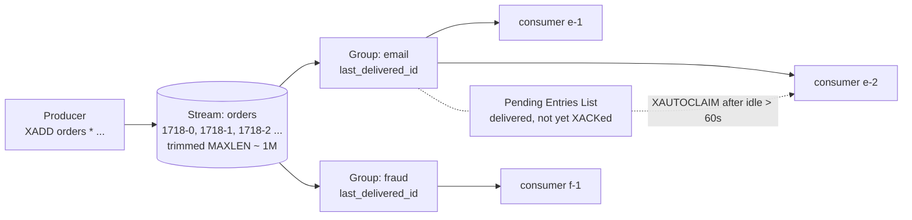

- **Across groups:** each group gets **every** message (fan-out, like Kafka consumer groups).
- **Within a group:** each message goes to **one** consumer (competing consumers, like a RabbitMQ queue).
- Delivered-but-unacked messages sit in the **PEL**. If a consumer dies, a peer **claims** them after an idle timeout. The result is **at-least-once** delivery, so handlers must be idempotent.

**Why this code exists**
- **Goal:** deliver every `OrderCreated` event **reliably** to the email service, and independently to the fraud service:
  - Even if a worker crashes mid-message, or the service is offline for a while.
  - With several email workers **sharing** the load instead of each sending every email.
- **How Redis helps:**
  - `XADD` appends the event to a stream (an append-only list with IDs) that stays in Redis after it's read, unlike Pub/Sub.
  - A **consumer group** remembers which messages it has handed out, and gives each message to **one** worker in the group.
  - A handed-out message stays **pending** until the worker confirms it with `XACK`.
  - If a worker dies, its pending messages can be taken over by another worker with `XAUTOCLAIM`.
- **How the code works:**
  1. **Producer:** `XADD` the event. `MAXLEN ~ 1,000,000` keeps roughly the newest million events so the stream doesn't grow forever.
  2. **Setup:** create the group once. The `BUSYGROUP` error just means it already exists.
  3. **Consumer loop:**
     - First, adopt messages that other workers left pending for over 60 s (they probably crashed).
     - Then wait up to 5 s for new messages (`>`).
  4. **Handle:** do the work, *then* `XACK`. If the work throws, don't ack. The message stays pending and will be retried later via step 3.
- **Drawbacks:**
  - A message can be processed **more than once** (a crash after the work but before `XACK`), so handlers must be idempotent.
  - There's no built-in retry limit, dead-letter queue or delayed retry. You build these from the delivery count in `XPENDING`.
  - Everything lives in RAM. Aggressive trimming can delete messages a slow consumer hasn't read yet.
  - A failover can lose the last few messages (async replication).
  - It needs a dedicated connection for the blocking read.

```ts
const STREAM = 'orders';
const GROUP = 'email';
const CONSUMER = `email-${process.pid}`;

// Producer: cap the stream length (approximate trimming is much cheaper)
await redis.xAdd(STREAM, '*', { type: 'OrderCreated', orderId: '123' },
  { TRIM: { strategy: 'MAXLEN', strategyModifier: '~', threshold: 1_000_000 } });

// One-time setup ('$' = only new messages; '0' = from the beginning)
await redis.xGroupCreate(STREAM, GROUP, '$', { MKSTREAM: true }).catch((e) => {
  if (!String(e.message).includes('BUSYGROUP')) throw e; // group already exists
});

// Consumer loop: dedicated connection because of BLOCK
const reader = redis.duplicate(); await reader.connect();

async function consume() {
  while (running) {
    // 1) Recover messages abandoned by dead consumers (idle > 60s)
    const claimed = await redis.xAutoClaim(STREAM, GROUP, CONSUMER, 60_000, '0-0', { COUNT: 50 });
    for (const m of claimed.messages) if (m) await handle(m.id, m.message);

    // 2) Read new messages ('>' = never delivered to this group)
    const res = await reader.xReadGroup(GROUP, CONSUMER, { key: STREAM, id: '>' }, { COUNT: 50, BLOCK: 5_000 });
    for (const { messages } of res ?? []) {
      for (const m of messages) await handle(m.id, m.message);
    }
  }
}

async function handle(id: string, msg: Record<string, string>) {
  try {
    await sendEmail(msg);                       // must be idempotent: redelivery is possible
    await redis.xAck(STREAM, GROUP, id);
  } catch (err) {
    // leave it pending → retried via XAUTOCLAIM. Track delivery count (XPENDING) and dead-letter after N tries.
  }
}
```

Stream caveats: it's memory-bound (trim it), persistence depends on RDB/AOF, async replication can lose recent entries on failover, and there's no built-in DLQ, delayed delivery or per-message routing.

---

## 10. Redis Pub/Sub vs. Streams vs. RabbitMQ vs. Kafka

| Property | Redis Pub/Sub | Redis Streams | RabbitMQ | Kafka |
|---|---|---|---|---|
| Model | Live broadcast | Append-only log in RAM | Broker: exchanges → queues | Partitioned, replicated log on disk |
| Durability | None | RDB/AOF (async repl.) | Durable queues + publisher confirms, quorum queues (Raft) | Replicated to ISR, `acks=all` |
| Delivery | At-most-once | At-least-once (PEL + XACK) | At-least-once (acks), redelivery | At-least-once (exactly-once within Kafka via transactions) |
| Replay | ❌ | ✅ by ID range | ❌ classic queues. ✅ RabbitMQ **Streams** (3.9+) | ✅ by offset / timestamp |
| Fan-out | All subscribers | Consumer groups | Fanout/topic exchanges | Consumer groups |
| Competing consumers | ❌ | ✅ within a group | ✅ native | ✅ ≤ 1 consumer per partition per group |
| Ordering | Per channel, live only | Per stream | Per queue (weakened by redelivery and multiple consumers) | **Per partition** |
| Routing | Channel / pattern | Stream name | **Rich** (topic, headers, DLX, TTL, priority) | Topic + partition key |
| Retries / DLQ / delay | ❌ | Manual | ✅ built in (DLX, TTL, delayed plugin) | Manual (retry topics). Share groups (KIP-932) are newer |
| Throughput | Very high, in RAM | High, in RAM | Tens of thousands/s per queue | Millions/s per cluster |
| Retention bound | None | Memory | Until consumed | Time / size, days to forever |
| Ops complexity | Minimal (already have Redis) | Low | Moderate | Highest |
| Mental model | "Tell whoever's listening" | "Lightweight durable-ish log" | "Deliver this job to a worker" | "Record this fact, many readers, replay" |

The original listed Kafka as a "strong fit" for job processing. That needs nuance: Kafka acks by **offset per partition**, not per message. One poison or slow message blocks its partition (head-of-line blocking), and parallelism is capped by the partition count. For job queues with per-message retry, delay and DLQ, RabbitMQ (or BullMQ/SQS) is usually the better fit.

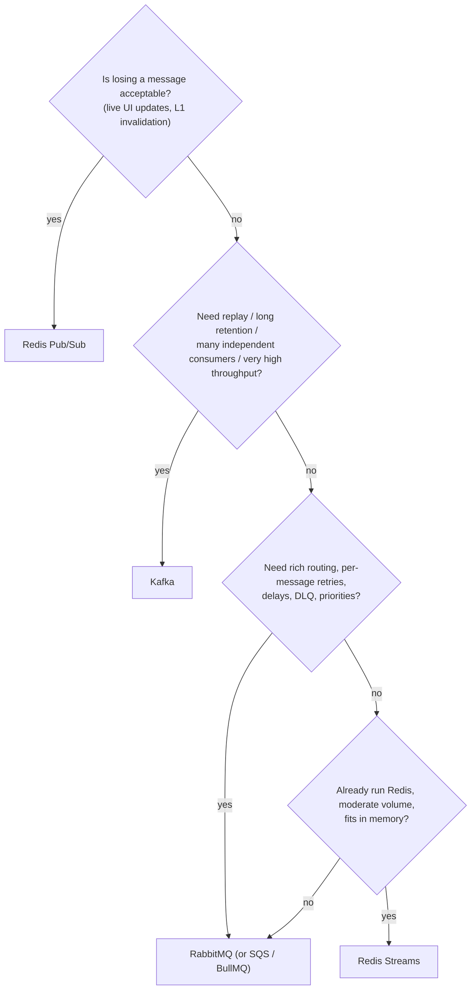

### Same `ORDER_CREATED` event, four systems

| | What happens when Fraud is offline for 10 minutes? |
|---|---|
| Redis Pub/Sub | Fraud **never sees** those orders |
| Redis Streams | Messages wait in the stream. Fraud's group resumes from its `last_delivered_id` (if not trimmed) |
| RabbitMQ | Messages accumulate in the `fraud` queue (bound to a fanout/topic exchange) and are delivered when it reconnects |
| Kafka | Fraud's group resumes from its committed offset (within retention). You can also replay yesterday's orders into a new fraud model |

And the **dual-write problem** applies to all four: "commit order, then publish" can lose the event if the process dies in between. Use the **transactional outbox** (see [11 – Order idempotency](11-order-concurrency-idempotency.md)).

---

## 11. Persistence & replication

### 11.1 RDB vs. AOF

| | RDB (snapshot) | AOF (append-only file) |
|---|---|---|
| How | `fork()`. The child writes a point-in-time snapshot using copy-on-write | Every write command is appended. Periodic rewrite compacts it |
| Data loss on crash | Everything since the last snapshot (minutes) | `appendfsync everysec` → ≤ ~1 s. `always` → ~0 (slow) |
| Restart speed | Fast (load binary) | Slower (replay). Mitigated by the RDB preamble in the AOF |
| Cost | Fork latency and **COW memory**: up to 2× memory if writes are heavy during the snapshot | Disk I/O, `fsync` |
| Typical | Backups, pure caches | Anything you don't want to lose. Often **both** |

Pure cache? Persistence can be off, but then a restart = **cold cache** = stampede on the DB. Plan for warm-up or use RDB.

### 11.2 Replication is asynchronous

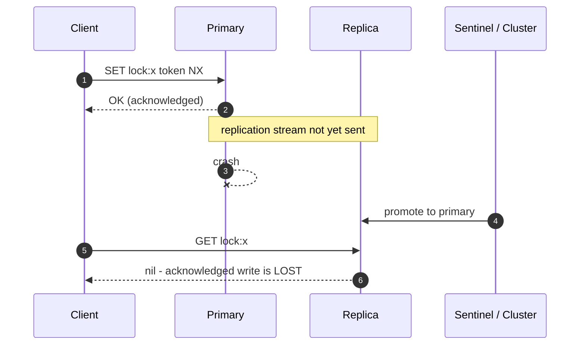

- `WAIT numreplicas timeout` blocks until N replicas acknowledge. It **reduces** the window but is **not** strong consistency (a failover can still pick a replica that missed it).
- **Sentinel:** monitors the primary, runs failover election among sentinels (quorum), and tells clients the new primary. It fits non-sharded HA.
- `min-replicas-to-write` / `min-replicas-max-lag`: the primary refuses writes if it's isolated from its replicas, which limits split-brain loss.
- **Reading from replicas** scales reads but gives **stale reads** (replication lag). That's fine for cache, not for "read your own write".

---

## 12. Redis Cluster: sharding

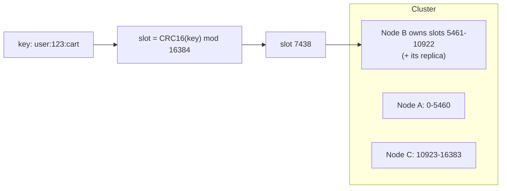

- 16,384 hash slots spread over the primaries. The client caches the slot map. A wrong node replies **`MOVED`** (the slot moved permanently, so refresh the map) or **`ASK`** (a migration is in progress, so a one-time redirect).
- **Multi-key operations** (`MGET`, `MULTI`, Lua, `SINTER`, `RENAME`) require **all keys in the same slot**, or you get a `CROSSSLOT` error.
- **Hash tags** fix this: only the part inside `{…}` is hashed, so `{user:123}:cart` and `{user:123}:profile` land in the same slot.
- ⚠️ Overusing one tag (`{global}:…`) puts everything on one shard, which defeats sharding.
- No `SELECT db` (only db 0). `KEYS`/`SCAN` are per node. Classic Pub/Sub broadcasts cluster-wide (use sharded Pub/Sub).

**Why this code exists**
- **Goal:** connect to a sharded Redis (data spread over several nodes), and atomically update two keys belonging to the same user: write their cart and set its expiry together.
- **How Redis helps:**
  - The cluster client downloads the "which node owns which slot" map and sends each command straight to the right node, following `MOVED` redirects when the map changes.
  - The **hash tag** `{user:123}` makes Redis hash only that part of the key, so every `{user:123}:…` key lands on the same node. That's what allows `MULTI`/Lua across them.
- **Drawbacks:**
  - Key names must be designed up front around what needs to be atomic together.
  - A tag used by too many keys creates one overloaded node.
  - Atomic operations across *different* users (different slots) are impossible.

```ts
import { createCluster } from 'redis';
const cluster = createCluster({ rootNodes: [{ url: 'redis://10.0.0.1:6379' }, { url: 'redis://10.0.0.2:6379' }] });
await cluster.connect();
await cluster.multi().set('{user:123}:cart', '…').expire('{user:123}:cart', 3600).exec(); // same slot → OK
```

---

## 13. Memory, eviction, hot keys & big keys

### 13.1 `maxmemory-policy`

| Policy | Evicts | Use when |
|---|---|---|
| `noeviction` (default) | Nothing. **Writes fail** with `OOM` | Redis holds data that must not disappear (queues, locks, streams, sessions as the source of truth) |
| `allkeys-lru` | Least recently used, any key | **Pure cache** (common default choice) |
| `allkeys-lfu` | Least frequently used | Cache with a stable hot set (resists one-off scans polluting it) |
| `volatile-lru` / `volatile-lfu` / `volatile-ttl` / `volatile-random` | Only keys **with a TTL** | Mixed instance: cache keys have a TTL, "real" data doesn't. Fragile: if nothing evictable is left, you get OOM errors |
| `allkeys-random` | Random | Uniform access patterns |

LRU/LFU are **approximated** by sampling (`maxmemory-samples`, 5 by default). **Best practice:** don't mix cache and must-keep data in one instance. Run a cache instance (`allkeys-lfu`) and a separate coordination/queue instance (`noeviction`). Keep 30–50% memory headroom for fork COW, fragmentation and replication buffers.

### 13.2 Hot keys

A single key → a single shard → a single thread. Detect them with `redis-cli --hotkeys` (needs an LFU policy), `MONITOR` sampling (expensive, briefly), or client-side metrics. Mitigate with:
- **L1 in-process cache** (§6.6). This is the most effective fix.
- **Key splitting for reads:** write N copies `product:123#0..N-1`, and each reader picks a random copy.
- **Counter sharding for writes:** `INCR views:123:{shard}` on a random shard, and `SUM` on read.
- Read replicas (with the lag trade-off).

### 13.3 Big keys

Big keys (a hash with millions of fields, a 50 MB string, a list without trimming) cause:
- **Blocking commands:** `HGETALL`, `SMEMBERS`, `LRANGE 0 -1`, and `DEL` of a large key are O(N) on the main thread.
- **Network spikes**, uneven cluster shards, and slow migrations or failovers.

Detect them with `redis-cli --bigkeys` / `--memkeys` and `MEMORY USAGE key`. Fix them by splitting (`user:123:events:2026-09`), iterating with `HSCAN`/`SSCAN`/`ZSCAN`, deleting with **`UNLINK`** (reclaims in a background thread) or `lazyfree-lazy-user-del yes`, and capping collections (`LTRIM`, `XADD MAXLEN ~`).

**Never run `KEYS *` in production.** It's O(total keys) and blocks everything. Use `SCAN` with a cursor.

**Why this code exists**
- **Goal:** find all keys matching a pattern (for example, all `session:*` keys during a migration or cleanup) **without freezing Redis** for every other client.
- **How Redis helps:** `SCAN` walks the keyspace in small batches (about `COUNT` keys examined per call) and returns a cursor to continue from. Other clients' commands run between batches, so no single call blocks for long. `scanIterator` hides the cursor loop behind `for await`.
- **Drawbacks:**
  - It's slower overall than one `KEYS` call.
  - The same key can be returned **more than once**, and keys created or deleted during the scan may or may not appear.
  - `MATCH` filters *after* fetching, so a batch can come back empty.
  - In Cluster, you must scan each node separately.

```ts
for await (const keys of redis.scanIterator({ MATCH: 'session:*', COUNT: 1000 })) {
  // node-redis v5 yields arrays of keys, v4 yields single keys
}
```

---

## 14. Failure modes (what happens when Redis is unavailable)

| Failure | Symptom | Mitigation |
|---|---|---|
| **Redis down** | Every cache call errors or hangs | Short command timeouts, `disableOfflineQueue: true`, **fail-open to the DB**, circuit breaker |
| **"Cache is load-bearing"** | Fail-open sends 100% of traffic to a DB sized for 5% → the DB dies too | Load shedding, per-endpoint degradation (serve defaults), keep L1 caches, capacity-plan the DB for partial cache loss |
| **Cold start / flush** | Cache empty after a restart or deploy → stampede | RDB persistence, warm-up job, coalescing + locks, jitter |
| **Slow Redis** (big key, `KEYS`, long Lua, fork) | p99 latency spike for **all** clients | `SLOWLOG GET`, `LATENCY DOCTOR`, avoid O(N) commands, `UNLINK` |
| **Failover** | Seconds of errors, recent writes lost | Retries with backoff, idempotent writes, don't store non-reproducible data only in Redis |
| **Memory full** | `OOM command not allowed` (noeviction) or silent eviction of keys you needed | Correct policy per instance, alerts on `used_memory`/`evicted_keys` |
| **Offline queue growth** | node-redis buffers commands while disconnected → memory growth, then a burst of stale commands on reconnect | `disableOfflineQueue` for caches. Bounded queues elsewhere |
| **Split brain / partition** | Two primaries accept writes, one side is later discarded | `min-replicas-to-write`, and accept that Redis is AP-ish |

**Why this code exists**
- **Goal:** make sure a **slow** Redis (overloaded, failing over, blocked by a big command) never makes user requests slower than skipping the cache and going straight to the database. A cache exists to make things faster. If it's slow, it's doing harm.
- **How it helps:** it races the Redis call against a 50 ms timer. If the timer wins, we treat the result as a cache miss and take the normal DB path, so request latency is capped at about 50 ms + the DB time.
- **Drawbacks:**
  - The Redis command is **not cancelled**. It still runs and still loads Redis, and we just stop waiting for it.
  - A timeout that's too tight turns normal jitter into false misses and extra DB load.
  - When Redis is clearly down, pair this with a **circuit breaker** that stops calling Redis for a few seconds, instead of paying the 50 ms on every request.

```ts
// Hard timeout around cache calls: a slow cache must never be slower than no cache.
const withTimeout = <T>(p: Promise<T>, ms: number) =>
  Promise.race([p, new Promise<never>((_, rej) => setTimeout(() => rej(new Error('REDIS_TIMEOUT')), ms))]);

const raw = await withTimeout(redis.get(key), 50).catch(() => null); // miss on timeout → DB path
```

---

## 15. Review of the original guide: issues & fixes

| # | Original | Problem | Fix (section) |
|---|---|---|---|
| 1 | Pub/Sub subscriber uses the **same** client as normal commands | A subscribed connection can't run regular commands (RESP2). node-redis requires `duplicate()` | Dedicated subscriber connection (§9.1) |
| 2 | Local coalescing `Map<string, Promise>` | No cleanup: a **rejected promise stays cached forever**, and the map grows without bound | `.finally(() => inFlight.delete(key))` (§6.5) |
| 3 | Lock example `SET lock 1 NX EX 10` | Constant value → unsafe release. No guidance for waiters or for loaders slower than the TTL | Token + Lua release + watchdog. Waiters poll with a fallback (§6.5, §7.1) |
| 4 | "Distributed lock can coordinate across processes" | Presented as a guarantee. Pauses and failover break mutual exclusion | Efficiency vs. correctness locks, fencing tokens (§7.2) |
| 5 | Cache-aside with no write path | No invalidation strategy. Misses the delete-after-write race and negative caching | §6.2, §6.3 |
| 6 | "`SET` replaces the previous value" | It also **clears the TTL**, a common production bug | `KEEPTTL` (§5) |
| 7 | Lists: `LPUSH` + `RPOP` as a queue | Job lost if the worker crashes after the pop | `BLMOVE` reliable queue or Streams (§3) |
| 8 | "Probabilistic early expiration: implementation-specific" | Hand-wavy | XFetch formula + code (§6.5) |
| 9 | Pub/Sub properties | Missing: at-most-once, slow-subscriber disconnection, cluster-wide broadcast cost, sharded Pub/Sub | §9.1 |
| 10 | Streams described, no code | Consumer groups, PEL, `XAUTOCLAIM` and trimming are exactly what gets asked | §9.2 |
| 11 | Kafka "Job processing: strong fit" | Per-partition offsets → head-of-line blocking, no per-message retry/delay | Nuance in §10 |
| 12 | RabbitMQ "Replay: not its primary model" | RabbitMQ **Streams** (3.9+) support replay | §10 table |
| 13 | "Modern Redis uses threads for some background work" | Vague | I/O threads, lazyfree, fsync, fork (§1) |
| 14 | `redis.on('error')` shown, no timeouts, reconnect or offline-queue discussion | Default behaviour can buffer unboundedly or hang requests | §2, §14 |
| 15 | "What you should learn next" list | Items listed but not covered | Covered: §4 (MULTI/WATCH/Lua), §7, §8, §9.2, §11–§14 |

---

## 16. Interview Q&A bank

**Q: Why is `INCR` atomic but `GET` + `SET` isn't?**
`INCR` is one command, run to completion on the main thread. Between two separate commands, other clients' commands can run. To group them: a Lua script (branching), `MULTI`/`EXEC` (no branching), or `WATCH` (optimistic retry).

**Q: Does `MULTI`/`EXEC` roll back on error?**
No. Commands are isolated (not interleaved), but runtime errors don't undo earlier commands. Only queue-time syntax errors abort the whole transaction.

**Q: Lua vs. `WATCH`?**
Lua runs atomically server-side in one round-trip and never retries. `WATCH` is optimistic: it's needed when app-side logic must run between the read and the write, and it retries under contention. Prefer Lua for hot paths.

**Q: Does Redis create a timer per key?**
No. It stores an absolute expiry timestamp. Expiry is lazy (on access) plus an adaptive active sampling cycle. Replicas wait for the primary's `DEL` but hide expired keys on reads.

**Q: Does TTL jitter fix a hot-key stampede?**
No. It de-synchronizes *many* keys. For one hot key, use coalescing, a rebuild lock, stale-while-revalidate, or XFetch early refresh.

**Q: How do you keep cache and DB consistent?**
Update the DB, then **delete** the key (after commit), and always set a TTL. Know the reader/writer race (§6.3). Tighten with delayed double-delete, versioned `SET`, or CDC-driven invalidation. Don't cache strongly consistent data.

**Q: Is a Redis lock safe?**
It's safe for efficiency (preventing duplicate work) with a token, a TTL and a Lua release. It's not safe for correctness on its own: process pauses and async-replication failover can yield two holders. Use fencing tokens enforced by the storage, or a consensus store.

**Q: What happens when Redis goes down?**
With timeouts and fail-open, requests fall back to the DB. The real risk is the DB not coping with the full load. Plan load shedding, L1 caches and warm-up. Locks and rate limits need an explicit fail-open or fail-closed decision.

**Q: Pub/Sub vs. Streams?**
Pub/Sub is live, at-most-once, and has no storage. Streams are persisted in memory (and on disk via RDB/AOF), with IDs, consumer groups, per-message acks, a PEL, and claiming of abandoned messages, which gives at-least-once delivery.

**Q: Redis Streams vs. Kafka?**
They're conceptually similar (a log plus consumer groups). Streams live in RAM on one shard per stream (bounded by memory, async replication), and are simple if you already run Redis. Kafka is disk-based and partitioned for horizontal scale, with replicated durability (`acks=all`), long retention and a rich ecosystem (Connect, Streams, Debezium).

**Q: How does Redis Cluster decide where a key lives, and how do you do multi-key ops?**
`CRC16(key) mod 16384` → slot → node. Multi-key commands, transactions and scripts need all keys in one slot. Use hash tags `{…}`, and avoid a single tag for everything.

**Q: Which eviction policy for a cache?**
`allkeys-lru` or `allkeys-lfu`. `noeviction` is for instances holding data that must not disappear. Keep those roles on separate instances.

**Q: Why is `KEYS *` dangerous, and what else blocks Redis?**
It's O(N) on the single command thread, so every client stalls. Other offenders: `HGETALL`/`SMEMBERS` on huge collections, `DEL` of a big key (use `UNLINK`), long Lua scripts, and fork on huge datasets with no memory headroom.

**Q: One connection or a pool in Node?**
One multiplexed, pipelined connection per process for normal commands. Use dedicated connections for Pub/Sub subscribers, blocking reads, and `WATCH`-based transactions.

---

## 17. Compact mental model

```text
Redis
├── Execution: single main thread (+ I/O threads, lazyfree, fork) → each command atomic, slow command blocks all
├── Atomic composition: single cmd → MULTI/EXEC (no rollback) → WATCH (optimistic) → Lua (atomic + branching)
├── Expiration: absolute timestamp, lazy + adaptive active, SET clears TTL, jitter
├── Caching: cache-aside, delete-after-commit, negative caching, L1+L2
│   └── Stampede: coalescing (process), lock (cluster), SWR, XFetch, background refresh
├── Locks: NX+PX+token+Lua release+watchdog. Efficiency only, correctness needs fencing
├── Rate limiting: fixed window, sliding log (ZSET), token bucket (Lua + TIME)
├── Messaging: Pub/Sub (at-most-once) | Streams (groups, PEL, XACK, XAUTOCLAIM, trim)
├── Durability: RDB (fork/COW) | AOF (everysec) | async replication → acknowledged writes can be lost
├── Scale: Sentinel (HA) | Cluster (16384 slots, MOVED/ASK, hash tags, CROSSSLOT)
└── Ops: maxmemory-policy per role, hot keys (L1, split), big keys (SCAN, UNLINK), timeouts, fail-open
```
