# Database Indexing — Technical Interview Notes

## 1. What is a database index?

A database index is a **separate data structure maintained by the database engine** that allows it to locate rows efficiently without scanning the entire table.

Example table:

```sql
CREATE TABLE people (
    id         BIGINT PRIMARY KEY,
    name       VARCHAR(100),
    age        INT,
    salary     DECIMAL(10,2),
    department VARCHAR(100),
    email      VARCHAR(255),
    created_at TIMESTAMP
);
```

Without an index on `age`, a query such as:

```sql
SELECT *
FROM people
WHERE age = 35;
```

may require a full/sequential table scan:


With:

```sql
CREATE INDEX idx_people_age
ON people(age);
```

the database has an additional structure organized around `age`, allowing it to locate matching entries much more efficiently.

### Core interview definition

> An index is a persistent, auxiliary data structure that maintains searchable information about one or more table columns so the database can find qualifying rows more efficiently than scanning the entire table.

---

# 2. Where is an index stored?

An index is generally stored as **persistent database data on disk**, separately from the logical table data, although the exact physical implementation depends on the database engine.

Frequently accessed portions of both table and index data are cached in memory.

Conceptually:

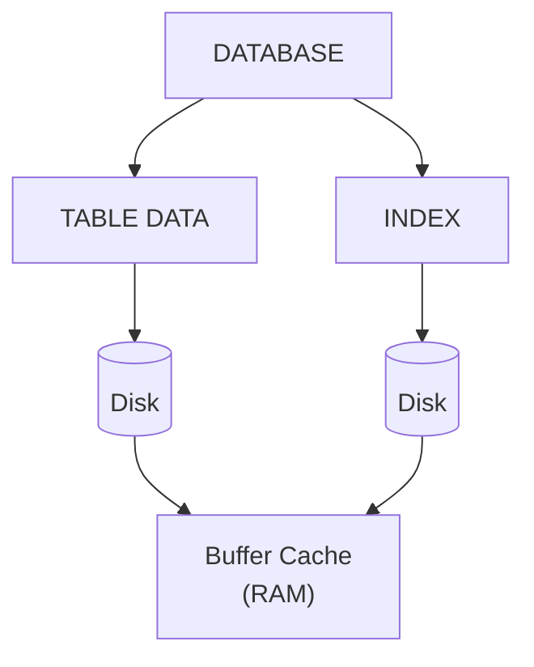

Important distinction:

> An index is not simply an in-memory hash map.

It is persistent database storage, normally organized into pages/blocks, with frequently used pages cached in RAM.

The exact storage mechanism varies by database.

---

# 3. Why does an index make queries faster?

Assume:

```text
10,000,000 rows
```

A full table scan may inspect a very large portion of those rows:

```text
row 1
row 2
row 3
...
row 10,000,000
```

This is approximately:

```text
O(N)
```

for a table of N rows.

A B-tree-style index can navigate a tree rather than checking every entry:

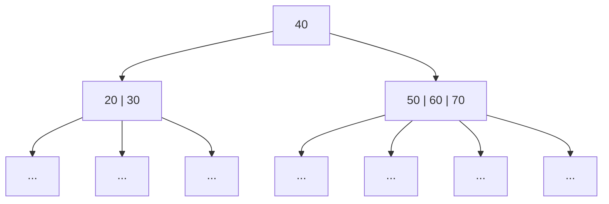

Lookup is approximately:

```text
O(log N)
```

for a typical B-tree search.

The exact execution cost is more complicated because the database also considers I/O, caching, number of matching rows, table lookups, statistics, and other factors.

---

# 4. What does an index contain?

For a simple index:

```sql
CREATE INDEX idx_people_age
ON people(age);
```

conceptually, the index contains something like:

```text
age     -> row location / row identifier
-----------------------------------------
18      -> row X
19      -> row Y
20      -> row Z
...
35      -> row A
35      -> row B
35      -> row C
36      -> row D
...
```

The exact row-reference mechanism depends on the database.

In a traditional heap-table architecture, the index can point toward the corresponding table row.

Conceptually:

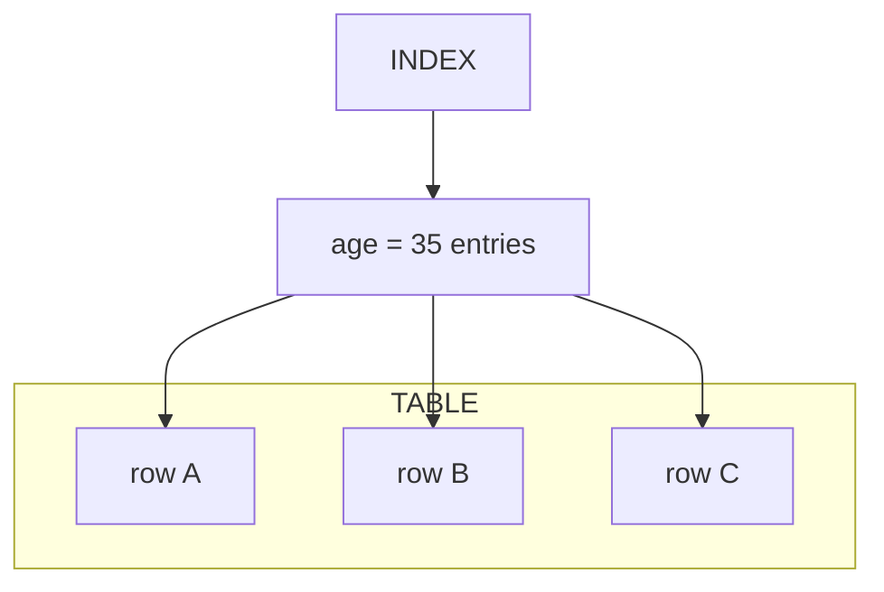

This means an index lookup can be a two-stage operation:

1. Find matching index entries.
2. Fetch the corresponding table rows.

---

# 5. B-tree vs B+ tree

This distinction is important for technical interviews.

## B-tree

A **B-tree** is a balanced multi-way search tree designed to minimize disk I/O.

Unlike a binary search tree, a B-tree node can contain many keys and children.

Conceptually:

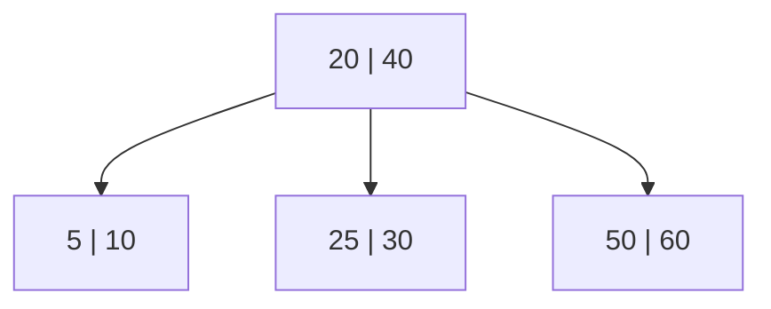

Important characteristics:

- Balanced tree.
- Each node can contain multiple keys.
- Nodes can have multiple children.
- Height remains relatively small.
- Searching is approximately `O(log N)`.
- Designed to work well with block/page-based storage.
- Can store data/record references in internal nodes as well as leaf nodes.

## B+ tree

A **B+ tree** is a closely related tree structure commonly used for database indexes.

The key structural difference is:

> In a B+ tree, internal nodes primarily contain keys used for navigation, while the actual record pointers/data references are stored in the leaf level.

Conceptually:

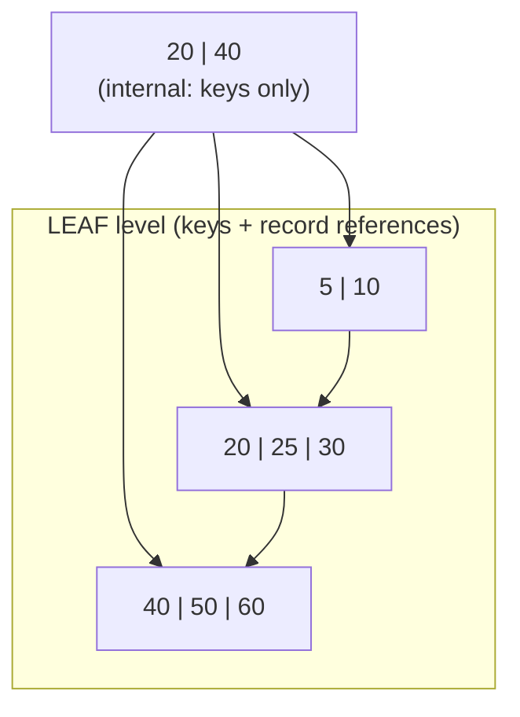

The leaves are typically linked:


### Why are linked leaves useful?

They make ordered/range operations efficient.

For:

```sql
SELECT *
FROM people
WHERE age BETWEEN 30 AND 40;
```

the database can:

1. Navigate the tree to the first relevant leaf.
2. Find `30`.
3. Walk through adjacent leaf pages.
4. Stop after `40`.

This is one of the major reasons B+ trees are very suitable for database indexes.

---

## B-tree vs B+ tree comparison

| Characteristic | B-tree | B+ tree |
|---|---|---|
| Internal nodes | Can contain keys + record/data references | Primarily keys for navigation |
| Leaf nodes | Store keys and potentially data/references | Store keys + record/data references |
| All records at leaf level | Not necessarily | Yes |
| Linked leaves | Not a defining requirement | Typically yes |
| Range scans | Good | Excellent |
| Sequential traversal | Good | Especially efficient |
| Fan-out | Generally lower if internal nodes store records | Often higher because internal nodes store mostly keys |
| Tree height | Low | Often very low |
| Common database index structure | Depends on engine | Very common conceptually/commonly implemented |

### Important interview nuance

Do not say:

> "Every database uses B+ trees."

That is too absolute.

Database engines differ. Some implement B-tree indexes that are technically variants of B-trees/B+ trees, and other index types exist.

A good interview answer is:

> "B-tree and B+ tree structures are balanced multi-way search trees designed for storage systems. B+ trees are particularly suitable for database indexes because internal nodes can have high fan-out and the leaf level can be linked, making ordered and range scans efficient."

---

# 6. Why tree-based indexes work well on disks

Databases usually read/write storage in **pages or blocks**, not one individual key at a time.

A tree with many keys per node has high **fan-out**.

For example:

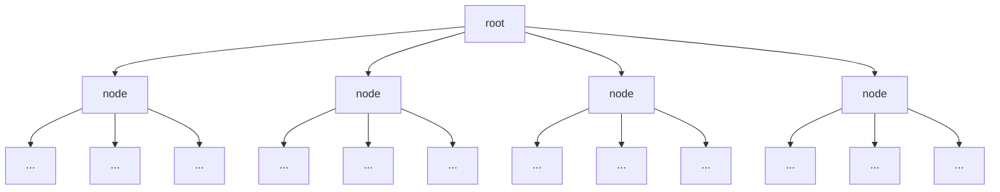

High fan-out means fewer levels are needed.

Fewer levels generally means fewer page accesses to reach a target key.

That is a central reason B-tree/B+ tree structures work well for databases.

---

# 7. What happens when querying an indexed column?

Suppose:

```sql
SELECT *
FROM people
WHERE age = 35;
```

and there is:

```sql
CREATE INDEX idx_people_age
ON people(age);
```

A simplified execution path is:

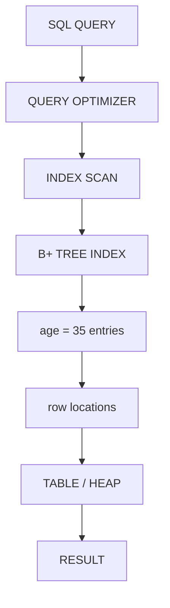

The exact plan can differ.

The key point:

> The index helps locate candidate rows; the database may still need to access the table to retrieve columns not present in the index.

---

# 8. Should `age` be indexed?

There is no universal answer.

If the application frequently executes:

```sql
SELECT *
FROM people
WHERE age = 35;
```

an index on `age` might help.

But `age` may have relatively low cardinality:

```text
0 - 120
```

If there are 10 million people, perhaps hundreds of thousands match:

```text
age = 35
```

An index lookup followed by hundreds of thousands of table accesses may not be cheaper than a sequential scan.

### Why? The database reads pages, not rows

Databases read and write storage in **pages** (e.g. 8 KB in PostgreSQL, 16 KB in InnoDB). Each page holds many rows.

Assume:

```text
10,000,000 rows
~100 rows per page
→ ~100,000 table pages
```

and `age = 35` matches about **1.5%** of the table:

```text
~150,000 matching rows
```

#### Option 1: Sequential scan

Read every page, from start to finish, and check `age` on every row.

```text
~100,000 page reads
all sequential
```

Sequential reads are cheap:

- Neighboring pages are physically close together on storage.
- The OS and database can **read ahead**/prefetch large chunks.
- Each page is read **once**.

#### Option 2: Index scan

1. Traverse the B+ tree to the first `age = 35` entry (a few page reads).
2. Walk the matching leaf entries (a few hundred leaf pages).
3. For **each** matching entry, follow its row reference into the table.

The problem is step 3. The rows with `age = 35` are **scattered** throughout the table — they were inserted in arbitrary order, not grouped by age:

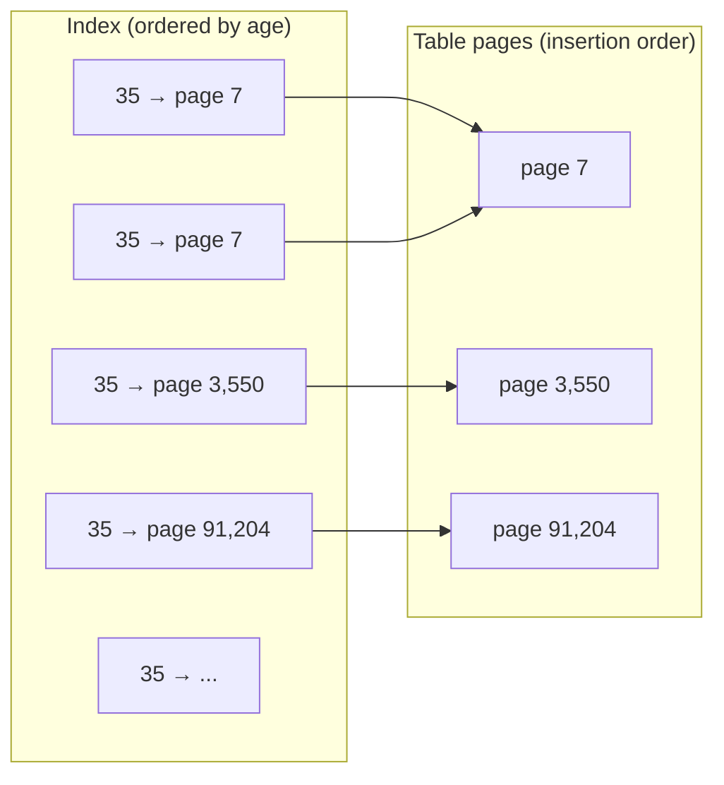

That means:

```text
~150,000 row fetches
each one potentially a separate RANDOM page read
```

Random reads are much more expensive than sequential reads:

- No useful read-ahead — the next page needed is somewhere else.
- On HDDs, every random read can mean a disk seek.
- Even on SSDs, random I/O has more overhead per page than large sequential reads.
- The same page can be fetched **multiple times** (page 7 above) if it was evicted from the cache in between.

#### Comparing the two

```text
Sequential scan:  ~100,000 pages, read sequentially, each once
Index scan:       ~150,000 random page fetches (+ index pages)
```

The index scan touches **more** pages than the entire table contains, and it touches them in the most expensive access pattern.

The index was supposed to help us *avoid* reading the table, but when enough rows match, we end up reading almost every table page anyway — just in random order.

### The tipping point

Roughly:

```text
Few matching rows   → index scan wins   (read a handful of pages)
Many matching rows  → sequential scan wins (read everything once, efficiently)
```

The exact threshold depends on the database, the hardware, row size, caching, and configuration (PostgreSQL, for example, models this with `seq_page_cost` vs `random_page_cost`). It is often cited as somewhere around a **few percent** of the table, but it can be much lower or higher — it is not a fixed rule.

### Factors that move the tipping point

- **Physical correlation/clustering:** if matching rows happen to be stored close together (e.g. `created_at` on an append-only table), index fetches become nearly sequential and the index stays useful for larger result sets.
- **Caching:** if the whole table is already in RAM, random access is much cheaper.
- **Bitmap scans:** some databases (e.g. PostgreSQL) can collect all matching row locations from the index first, sort them by page, and then read each needed page once in physical order — a middle ground between index scan and sequential scan.
- **Covering indexes:** if the index contains every column the query needs, there are no table fetches at all (see section 19).
- **`LIMIT`:** `WHERE age = 35 LIMIT 10` only needs 10 rows, so the index becomes attractive again.

### Interview phrasing

> "An index makes *finding* the matching entries cheap, but each match may still require a random table page read. When a predicate matches a large fraction of the table, those random reads can add up to more I/O than simply reading the whole table sequentially once, so the optimizer prefers a sequential scan."

The optimizer may therefore choose:

```text
Sequential/Table Scan
```

instead of:

```text
Index Scan
```

### Key interview rule

Do not say:

> "If a column is used in WHERE, index it."

Say:

> "Columns frequently used in filtering are candidates for indexing, but the decision depends on selectivity/cardinality, data distribution, workload, query shape, existing indexes, and the optimizer's cost estimates."

---

# 9. Selectivity and cardinality

These concepts are related but not identical.

### Cardinality

Cardinality generally refers to the number of distinct values in a column.

Example:

```text
gender:
M
F
```

Very low cardinality.

```text
email:
alice@example.com
bob@example.com
...
```

Potentially very high cardinality.

### Selectivity

Selectivity describes how much a predicate reduces the result set.

For example:

```sql
WHERE email = 'alice@example.com'
```

might return one row out of 10 million.

Very selective.

While:

```sql
WHERE gender = 'F'
```

might return 5 million rows out of 10 million.

Not very selective.

### Important nuance

Low cardinality does not automatically mean "never index."

Example:

```text
active = false
```

If only 0.1% of rows are inactive, that predicate may be highly selective despite being a boolean column.

Also, composite indexes can make low-cardinality columns useful in combination with other columns.

---

# 10. Why not index every column?

Because indexes have costs.

## Storage cost

Every index consumes disk space.

A table might be:

```text
2 GB
```

while several indexes add:

```text
500 MB
700 MB
300 MB
...
```

## INSERT cost

When a row is inserted, relevant indexes must also be updated.

Conceptually:

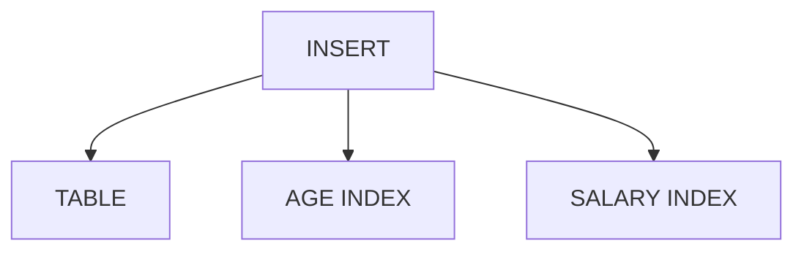

More indexes generally mean more index-maintenance work.

## UPDATE cost

If an indexed column changes:

```sql
UPDATE people
SET age = 36
WHERE id = 123;
```

the index must be updated to reflect the new value.

## DELETE cost

Deleting a row also requires the corresponding index entries to be maintained.

### Core tradeoff

> Indexes generally trade additional storage and write/maintenance cost for faster reads.

---

# 11. Primary keys and indexes

For:

```sql
CREATE TABLE people (
    id BIGINT PRIMARY KEY,
    ...
);
```

the database generally creates or uses an index to enforce the primary key constraint.

Therefore:

```sql
SELECT *
FROM people
WHERE id = 123;
```

can usually use a highly selective primary-key lookup.

Do not confuse the logical constraint with the physical implementation, though:

> The primary key is a constraint; the database typically uses an index to enforce it efficiently.

---

# 12. Unique indexes

Suppose email must be unique:

```sql
CREATE UNIQUE INDEX idx_people_email
ON people(email);
```

This serves two purposes:

1. Efficient lookup.
2. Enforces uniqueness.

Example:

```sql
SELECT *
FROM people
WHERE email = 'john@example.com';
```

A unique index is highly selective when values are unique.

Note that exact NULL behavior for unique constraints/indexes varies by database.

---

# 13. Indexing `name`

Potentially useful:

```sql
CREATE INDEX idx_people_name
ON people(name);
```

For:

```sql
WHERE name = 'John'
```

it can help.

For prefix searches such as:

```sql
WHERE name LIKE 'John%'
```

a normal ordered index can often be useful, subject to database, collation, and query-planner details.

But:

```sql
WHERE name LIKE '%John%'
```

is generally not efficiently handled by a normal B-tree index because the leading wildcard prevents a straightforward ordered prefix lookup.

Specialized text/search indexes may be appropriate for substring/full-text search.

---

# 14. Indexing `salary`

For:

```sql
SELECT *
FROM people
WHERE salary > 100000;
```

a B-tree index can be useful because values are ordered:

```text
50k
55k
60k
...
99k
100k
101k
102k
...
```

The database can locate approximately where `100k` begins and scan forward.

This is a major advantage of ordered tree indexes.

---

# 15. Indexes and `ORDER BY`

Consider:

```sql
SELECT *
FROM people
ORDER BY salary;
```

An index on:

```sql
CREATE INDEX idx_people_salary
ON people(salary);
```

already maintains the indexed values in order.

Depending on the query, index definition, database engine, and optimizer, the database may exploit that ordering and avoid an explicit sort.

Indexes can therefore help with:

- `WHERE`
- `JOIN`
- `ORDER BY`
- sometimes `GROUP BY`
- uniqueness constraints

---

# 16. Composite indexes

A composite index contains multiple columns:

```sql
CREATE INDEX idx_people_department_age
ON people(department, age);
```

Conceptually it is ordered first by `department`, then by `age` within each department:

```text
department       age
----------------------
Engineering      20
Engineering      21
Engineering      22
...
Engineering      30
Engineering      31
...
Sales            20
Sales            21
...
```

This can be very useful for:

```sql
WHERE department = 'Engineering'
```

and:

```sql
WHERE department = 'Engineering'
AND age = 30
```

---

# 17. Composite index column order matters

This is one of the most important interview topics.

Consider:

```sql
CREATE INDEX idx_people_department_age
ON people(department, age);
```

The index is primarily ordered by:

```text
department
```

and then by:

```text
age
```

Therefore, it naturally supports:

```text
(department)
(department, age)
```

much better than:

```text
(age)
```

This is commonly described as the **leftmost-prefix principle**.

Think of a phone book sorted by:

```text
Last name -> First name
```

Finding:

```text
Smith, John
```

is easy.

Finding every person named:

```text
John
```

without knowing their last name is not directly supported by the ordering.

### Interview answer

> "For a composite B-tree index, column order matters because the tree is ordered according to the index key sequence. The leftmost-prefix principle means an index on `(A, B, C)` can generally be used most naturally for predicates involving `A`, then `A+B`, then `A+B+C`, subject to optimizer and predicate details."

---

# 18. Example: choosing a composite index

Suppose the application frequently executes:

```sql
SELECT *
FROM people
WHERE department = ?
AND age = ?
ORDER BY salary;
```

A candidate index might be:

```sql
CREATE INDEX idx_people_department_age_salary
ON people(department, age, salary);
```

But do not blindly create it.

A production-quality decision considers:

- Query frequency.
- Selectivity.
- Cardinality.
- Data distribution.
- Existing indexes.
- Whether `ORDER BY` can actually be exploited.
- Whether the query returns many rows.
- Write overhead.
- Index size.
- Actual execution plan.

The mature interview answer is:

> "I would propose the index based on the workload, then validate it using `EXPLAIN`/`EXPLAIN ANALYZE` and representative data."

---

# 19. Covering indexes and index-only scans

Suppose:

```sql
SELECT age, salary
FROM people
WHERE age = 35;
```

With only:

```sql
INDEX(age)
```

the index can find matching rows, but the database may need table access to retrieve `salary`.

A broader index:

```sql
INDEX(age, salary)
```

may contain all columns needed by the query.

Then the database may be able to answer the query directly from the index.

This is often called a:

> **Covering index**

and can result in an:

> **Index-only scan**

depending on the database.

Conceptually:


instead of:


This can significantly reduce table/heap access.

---

# 20. Why an index can make a query slower

An index is not automatically faster.

Suppose:

```sql
SELECT *
FROM people;
```

The query needs essentially every row.

An index would add unnecessary work.

A sequential scan can be more efficient:

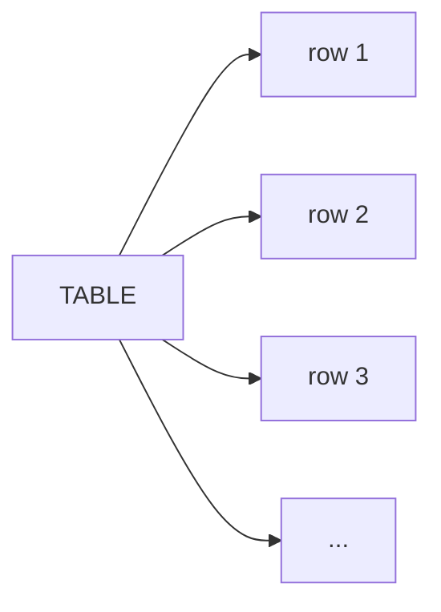

rather than:

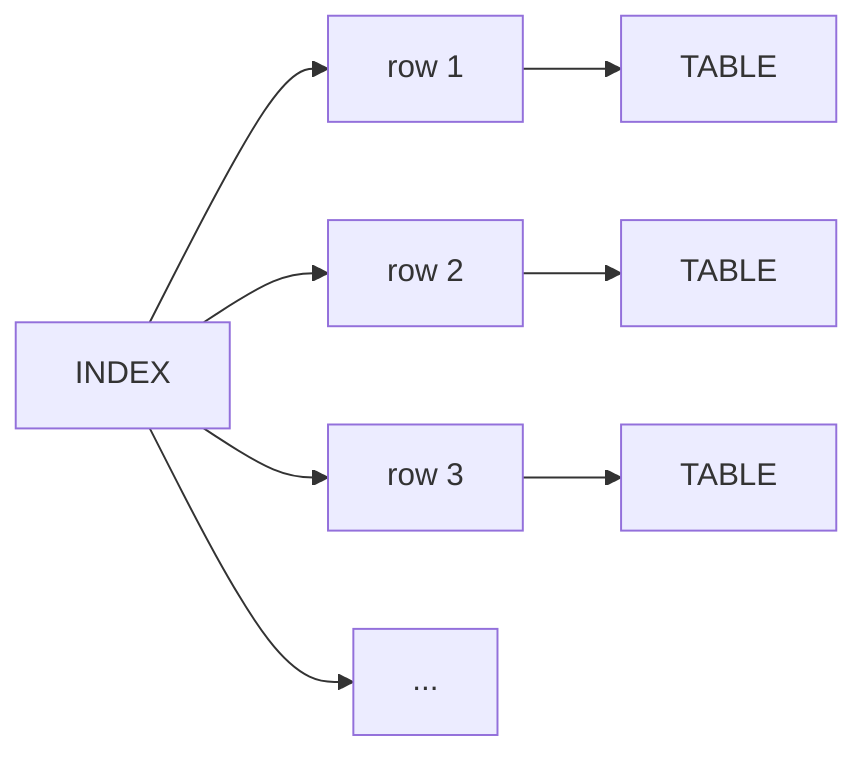

The second approach can involve many random/indirect accesses.

Therefore:

> The existence of an index does not mean the database should use it.

---

# 21. Query optimizer / planner

When executing:

```sql
SELECT *
FROM people
WHERE age = 35;
```

the database's optimizer considers possible execution plans.

Conceptually:

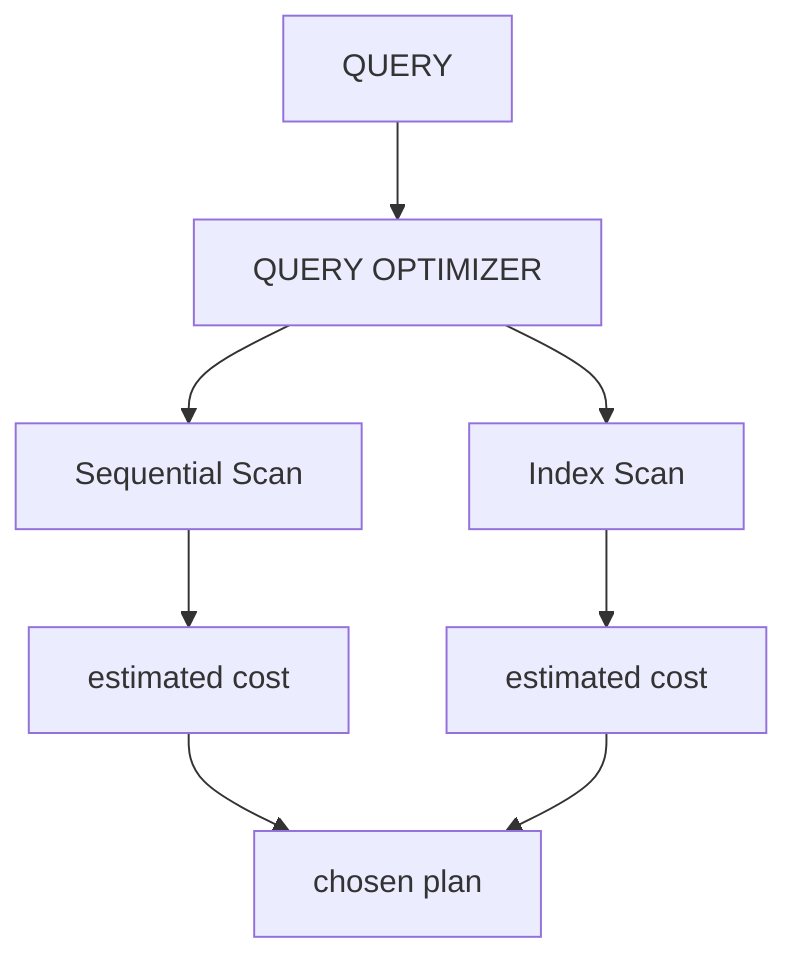

The optimizer may consider:

- Available indexes.
- Table statistics.
- Estimated row counts.
- Selectivity.
- Data distribution.
- Cost of scanning the table.
- Cost of traversing the index.
- Cost of fetching table rows.
- Sorting costs.
- Join algorithms.
- Memory/cache effects.
- Predicate conditions.

The exact optimizer behavior depends on the database engine.

---

# 22. `EXPLAIN`

Use:

```sql
EXPLAIN
SELECT *
FROM people
WHERE age = 35;
```

And in systems such as PostgreSQL:

```sql
EXPLAIN ANALYZE
SELECT *
FROM people
WHERE age = 35;
```

You may see something conceptually like:

```text
Index Scan using idx_people_age
```

or:

```text
Seq Scan on people
```

### Difference

`Index Scan`:

> The optimizer chose to access rows through an index.

`Seq Scan`:

> The optimizer chose to scan the table sequentially.

`EXPLAIN ANALYZE` can additionally execute the query and report actual runtime/row information in databases that support it.

This is one of the most important tools for diagnosing query performance.

---

# 23. Why `SELECT *` matters

Suppose:

```sql
SELECT *
FROM people
WHERE age = 35;
```

Even if `age` is indexed, the index may contain only:

```text
age -> row reference
```

while the table contains:

```text
name
salary
department
email
created_at
...
```

Therefore, the database may have to fetch many table rows.

If a large fraction of the table matches `age = 35`, the optimizer may conclude:

> A sequential scan is cheaper than using the index and fetching a huge number of table rows.

This is a central explanation for why an index sometimes isn't used.

---

# 24. Index maintenance and B-tree page splits

Indexes are dynamic structures.

Suppose an index page is full:

```text
[10 | 20 | 30 | 40 | 50]
```

and a new value must be inserted:

```text
35
```

The page may need to split:

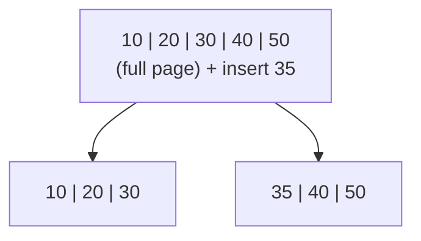

The tree structure may then need to be updated.

This is called a **page split**.

Index maintenance can therefore involve:

- Page reads/writes.
- Page splits.
- Updating parent nodes.
- Concurrency/locking effects.
- Additional storage.
- Maintenance/vacuum/cleanup considerations depending on the DB engine.

This is one reason indexes increase write cost.

---

# 25. What happens during INSERT?

For:

```sql
INSERT INTO people
(id, name, age, salary)
VALUES
(100, 'John', 35, 90000);
```

the database must maintain:


If there are more relevant indexes, more index structures may need to be updated.

This means:

> More indexes can improve read performance while increasing write amplification.

---

# 26. What happens during UPDATE?

Suppose:

```sql
UPDATE people
SET age = 40
WHERE id = 123;
```

If `age` is indexed, the index must be updated to reflect the changed key.

Conceptually:

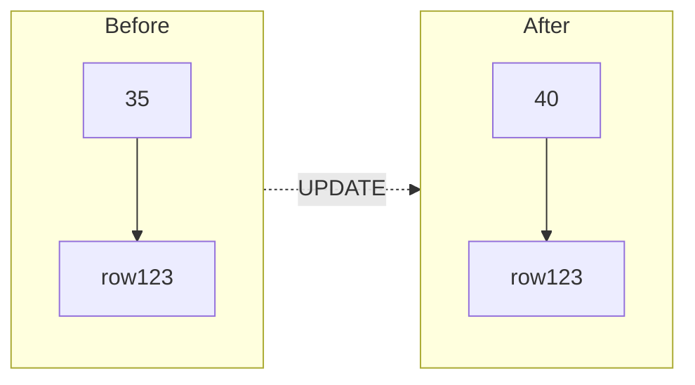

The exact internal mechanics depend on the database and storage engine.

---

# 27. What happens during DELETE?

For:

```sql
DELETE FROM people
WHERE id = 123;
```

the table row is removed/marked according to the DB's storage model, and the database must maintain the relevant index structures.

Therefore indexes increase the cost of deletes as well.

---

# 28. Foreign keys and joins

Indexes are particularly important for joins.

Example:

```sql
SELECT *
FROM orders o
JOIN people p
  ON o.person_id = p.id;
```

The primary key:

```text
people.id
```

is generally indexed.

The foreign key:

```text
orders.person_id
```

is often a strong candidate for an index, especially when:

- Joining frequently.
- Filtering by `person_id`.
- Deleting/updating parent rows.
- Enforcing referential integrity.

Whether the database automatically creates a foreign-key index varies by database.

Do not assume all databases automatically create one.

---

# 29. Indexing strategy for the `people` table

Given:

```sql
CREATE TABLE people (
    id BIGINT PRIMARY KEY,
    name VARCHAR(100),
    age INT,
    salary DECIMAL(10,2),
    department VARCHAR(100),
    email VARCHAR(255),
    created_at TIMESTAMP
);
```

Possible candidates depend on actual queries.

### `id`

Primary key.

Usually already indexed.

```text
Good for:
WHERE id = ?
JOIN ... ON people.id = ...
```

### `email`

If unique and frequently queried:

```sql
CREATE UNIQUE INDEX idx_people_email
ON people(email);
```

### `department`

Potential candidate if frequently filtered:

```sql
CREATE INDEX idx_people_department
ON people(department);
```

But low cardinality and result size must be considered.

### `age`

Potential candidate if frequently queried:

```sql
CREATE INDEX idx_people_age
ON people(age);
```

But age may have relatively low cardinality, so the query plan and data distribution matter.

### `salary`

Potential candidate for:

```sql
WHERE salary > ?
ORDER BY salary
```

### `created_at`

Often useful for:

```sql
WHERE created_at >= ?
ORDER BY created_at DESC
```

especially for time-based retrieval.

### Composite indexes

If queries commonly filter on multiple columns:

```sql
CREATE INDEX idx_people_department_age
ON people(department, age);
```

may be better than two unrelated indexes, depending on the workload.

---

# 30. Do not blindly create both single-column and composite indexes

Suppose you have:

```sql
INDEX(department, age)
```

You may not also need:

```sql
INDEX(department)
```

because the composite index starts with `department` and may already support queries filtering by `department`.

However, whether the composite index is an adequate replacement depends on the workload, index size, ordering requirements, and database optimizer.

Avoid redundant indexes.

---

# 31. Common interview traps

## Trap 1: "Indexes always make queries faster."

False.

They can make some reads faster but can be slower than a sequential scan for queries returning many rows.

---

## Trap 2: "Index every column used in WHERE."

Too simplistic.

Consider:

- Selectivity.
- Frequency.
- Data distribution.
- Composite indexes.
- Write cost.
- Storage.
- Actual execution plans.

---

## Trap 3: "Never index low-cardinality columns."

False.

Low-cardinality indexes can still be useful when a predicate is selective due to data distribution or when the column participates in a useful composite index.

---

## Trap 4: "The database always uses an index if one exists."

False.

The optimizer chooses the execution plan.

---

## Trap 5: "A composite index on `(A, B)` is the same as two indexes."

False.

```text
INDEX(A, B)
```

and:

```text
INDEX(A)
INDEX(B)
```

are not equivalent.

The composite index has a specific ordering and can support combinations differently.

---

## Trap 6: "Column order in composite indexes doesn't matter."

False.

It matters significantly.

```text
INDEX(department, age)
```

is not equivalent to:

```text
INDEX(age, department)
```

---

## Trap 7: "Indexes are stored only in RAM."

False.

Indexes are persistent database structures stored on disk/storage and cached in memory as needed.

---

## Trap 8: "B-tree and B+ tree are identical."

Not exactly.

A B+ tree places the actual record references/data entries at the leaf level and typically links leaf nodes, while B-tree variants can store record references/data in internal nodes as well.

Database terminology and exact implementations vary.

---

# 32. Important complexity caveat

It is useful to say:

> "A B-tree lookup is approximately O(log N)."

But don't imply that query runtime is simply O(log N).

For:

```sql
SELECT *
FROM people
WHERE age = 35;
```

the actual work may include:

```text
tree traversal
+
reading index pages
+
fetching table/heap pages
+
processing all matching rows
```

If 40% of the table matches, the number of matching rows dominates the cost.

A better mental model is:

```text
Query cost
≈
index traversal
+
matching index entries
+
table/heap fetches
+
additional operations
```

The database optimizer estimates this cost.

---

# 33. Range queries are a major strength of B-tree/B+ tree indexes

Examples:

```sql
WHERE salary > 100000
```

```sql
WHERE age BETWEEN 30 AND 40
```

```sql
WHERE created_at >= '2026-01-01'
```

The ordered structure allows the database to:

1. Find the beginning of the range.
2. Traverse the ordered entries.
3. Stop when the range ends.

This is fundamentally different from a pure equality-oriented lookup structure.

---

# 34. Hash indexes vs B-tree indexes

A hash structure conceptually maps:

```text
hash(key) -> bucket
```

It is naturally suited to equality:

```sql
WHERE email = 'john@example.com'
```

A B-tree/B+ tree provides ordering and therefore naturally supports:

```sql
=
<
>
<=
>=
BETWEEN
ORDER BY
```

subject to database-specific behavior and index definitions.

### Interview summary

> B-tree-style indexes are general-purpose because they support both equality and ordered/range operations. Hash indexes are primarily designed around equality lookups.

Do not make absolute claims about every database engine.

---

# 35. A strong interview answer: "How would you index a table?"

Suppose an interviewer gives you:

```sql
CREATE TABLE people (
    id BIGINT PRIMARY KEY,
    name VARCHAR(100),
    age INT,
    salary INT,
    department VARCHAR(100),
    email VARCHAR(255),
    created_at TIMESTAMP
);
```

and asks:

> "What indexes would you create?"

A strong answer:

> "I wouldn't index every column automatically. I'd first inspect the query workload and identify frequent filtering, join, ordering, grouping, and uniqueness requirements. I'd evaluate selectivity and cardinality, consider composite indexes for common multi-column predicates, pay attention to column order, and account for index storage and write-maintenance costs. Then I'd validate the proposed indexes with EXPLAIN/EXPLAIN ANALYZE against representative data."

Then give examples:

```sql
CREATE UNIQUE INDEX idx_people_email
ON people(email);

CREATE INDEX idx_people_department_age
ON people(department, age);

CREATE INDEX idx_people_created_at
ON people(created_at);
```

But explicitly say:

> "These are candidates, not automatic requirements. I'd validate them against real query patterns and execution plans."

That distinction demonstrates senior-level thinking.

---

# 36. The complete mental model

Keep this picture in your head:

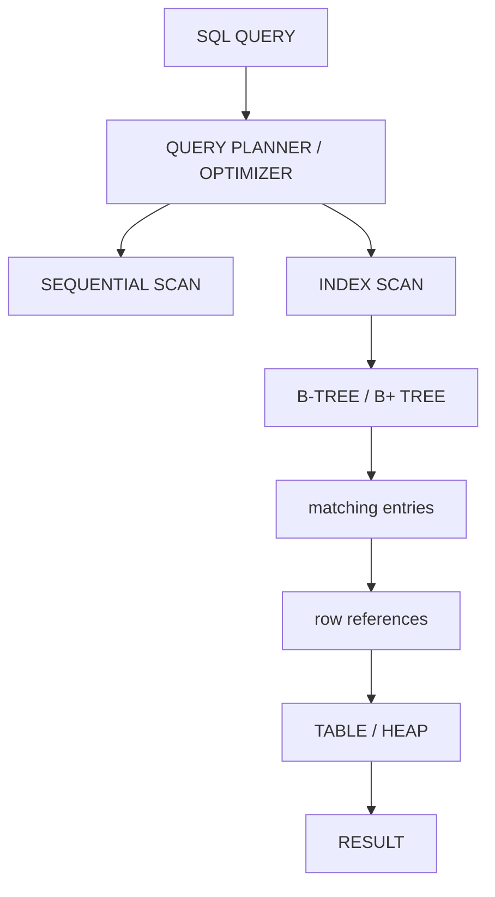

The index is an **additional access path** to the same logical table data.

---

# 37. The fundamental tradeoff

```mermaid
flowchart TD
    I[INDEX] --> R[READS]
    I --> W[WRITES]
    R --> RF[faster]
    W --> WS[slower]
    RF --> S["STORAGE COST<br/>increases"]
    WS --> S
```

Indexes can improve:

- `SELECT`
- `WHERE`
- `JOIN`
- `ORDER BY`
- some `GROUP BY`
- uniqueness enforcement

Indexes can increase:

- `INSERT` cost
- `UPDATE` cost
- `DELETE` cost
- storage usage
- maintenance overhead

---

# 38. 15 interview statements worth memorizing

1. **An index is an auxiliary persistent data structure that provides an additional access path to table data.**

2. **B-tree/B+ tree indexes are commonly used because they provide efficient lookup and ordered traversal.**

3. **A typical B-tree lookup is approximately O(log N), but total query cost also depends on the number of matching rows and table/heap access.**

4. **Indexes are persisted on disk/storage and frequently accessed pages can be cached in memory.**

5. **Indexes consume storage.**

6. **Indexes generally increase INSERT, UPDATE, and DELETE cost because index structures must be maintained.**

7. **The best indexes are chosen from workload and query patterns, not simply from column existence.**

8. **Selectivity and cardinality are important when deciding whether an index will be useful.**

9. **Low cardinality does not automatically mean an index is useless.**

10. **Composite index column order matters.**

11. **The leftmost-prefix principle is important for composite B-tree indexes.**

12. **The optimizer can choose a sequential scan even when an appropriate index exists.**

13. **EXPLAIN/EXPLAIN ANALYZE is used to inspect and validate query execution plans.**

14. **Covering indexes can allow a query to be answered from the index without fetching all table columns.**

15. **B+ trees are particularly useful for range scans because their leaf nodes are typically linked and contain the record references.**

---

# 39. Interview questions you should be able to answer

### Fundamentals

- What is a database index?
- Why does an index improve query performance?
- Where is an index stored?
- Is an index stored in RAM?
- What data structure is commonly used for indexes?
- What is the complexity of an index lookup?

### B-tree / B+ tree

- What is a B-tree?
- What is a B+ tree?
- What is the difference between B-tree and B+ tree?
- Why are B+ trees useful for databases?
- Why does high fan-out matter?
- Why are linked leaves useful?
- Why are B+ trees good for range queries?

### Index design

- Should you index every column?
- Should `age` be indexed?
- What is cardinality?
- What is selectivity?
- Are low-cardinality columns useless to index?
- What columns should generally be considered for indexing?
- Should foreign keys be indexed?
- What is a composite index?
- Why does composite index order matter?
- What is the leftmost-prefix principle?

### Query execution

- Does the DB always use an index if one exists?
- Why might the optimizer choose a sequential scan?
- What is an index scan?
- What is a table/heap fetch?
- What is a covering index?
- What is an index-only scan?
- How do you investigate a slow query?

### Tradeoffs

- What are the disadvantages of indexes?
- How do indexes affect INSERT?
- How do indexes affect UPDATE?
- How do indexes affect DELETE?
- What is a B-tree page split?
- Why can too many indexes hurt performance?

---

# 40. Final interview cheat sheet

If asked:

### "What is an index?"

> An index is a persistent auxiliary data structure that provides an efficient access path to rows, allowing the database to avoid scanning the entire table for many queries.

### "How is it stored?"

> It is stored persistently as database pages/blocks, generally on disk or other durable storage, with frequently accessed pages cached in memory.

### "Why is it faster?"

> A B-tree/B+ tree can locate a key in approximately O(log N), while a full table scan is generally O(N). However, the total query cost also includes fetching matching rows.

### "Should I index age?"

> Only if the workload benefits from it. I would consider query frequency, selectivity, cardinality, data distribution, number of matching rows, write cost, and the execution plan. An age index can be useful, but because age often has relatively low cardinality, the optimizer may sometimes prefer a sequential scan.

### "What else should I index?"

> Frequently filtered columns, join keys, columns used for ordering, some grouping patterns, unique columns, and combinations of columns used together in common queries. I would design indexes around the workload rather than automatically indexing every column.

### "What is the difference between B-tree and B+ tree?"

> Both are balanced multi-way search trees. In a B+ tree, internal nodes primarily contain separator keys while record references are stored at the leaf level, and leaf nodes are typically linked. This makes B+ trees particularly efficient for ordered traversal and range scans.

### "What is the downside?"

> Indexes consume storage and increase write cost because INSERT, UPDATE, and DELETE operations must maintain the index structures.

### "How do you know whether your index helps?"

> I inspect the execution plan using EXPLAIN or EXPLAIN ANALYZE, compare estimated versus actual behavior where supported, and validate against representative data and workload.

---

# 41. One-sentence mental model

> **An index is a separately maintained, persistent, ordered/searchable access path that lets the database find a subset of table rows cheaply, at the cost of additional storage and write maintenance.**
