# Garbage Collection — Technical Interview Notes

## 1. Core idea: reachability

A garbage collector determines whether an object is **reachable from GC roots**.

It does **not** generally ask whether an object has zero incoming references.

### GC roots

GC roots are runtime-managed references from which the collector starts tracing. Examples include:

- Global/runtime objects
- Active execution contexts
- References held by the VM/runtime
- Other implementation-specific root structures

The mental model is:

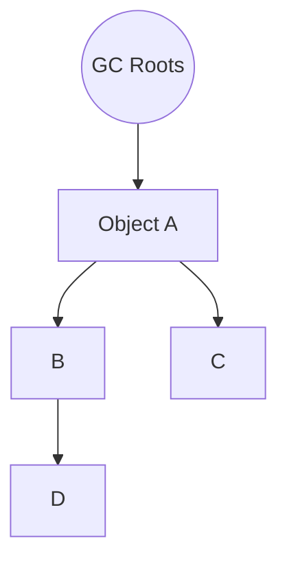

If an object can be reached from a root, it is considered **live**.

If there is no path from any root to an object, it is **unreachable** and eligible for collection.

---

## 2. Mark-and-sweep

A basic tracing collector can be understood as two main phases.

### Mark

1. Start from all GC roots.
2. Traverse object references.
3. Mark every reachable object.
4. Stop when there are no new objects to visit.

Conceptually:

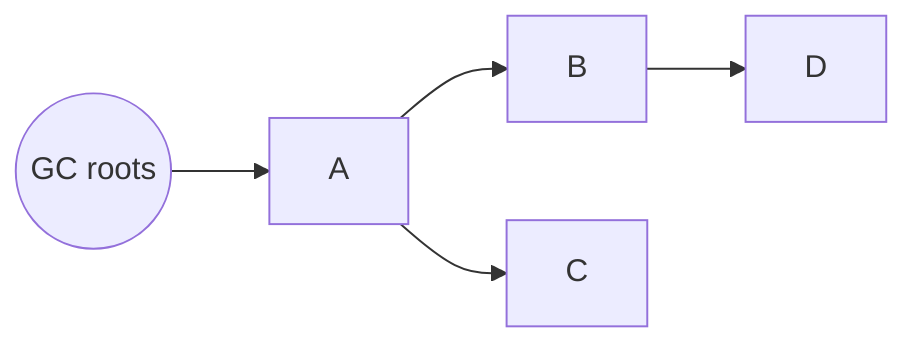

After marking:

```text
A B C D = marked/live
```

### Sweep

Scan the heap and reclaim objects that were not marked.

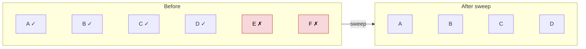

Important: "reclaimed" does not necessarily mean the bytes instantly disappear. The runtime may make the memory available for reuse, compact objects, move objects, or perform collection work incrementally/concurrently.

---

## 3. Circular references

Consider:

```js
let a = {};
let b = {};

a.b = b;
b.a = a;

a = null;
b = null;
```

The objects form a cycle:

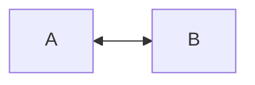

There is no reference from the program's roots to either object.

A tracing collector therefore sees:

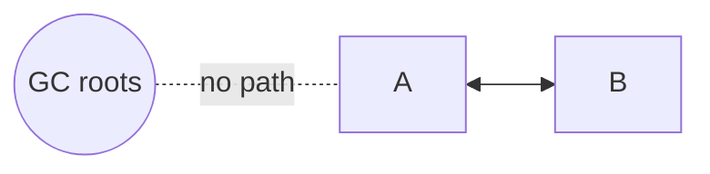

Both are unreachable and can be collected.

### Why cycles are not a problem

The key question is:

> Can I reach this object from a GC root?

Not:

> Does this object have another object pointing to it?

This is why tracing GC handles cycles naturally.

A pure reference-counting system can have trouble with cycles because each object may keep the other's reference count above zero.

---

## 4. Tiny mark-and-sweep collector

A simplified heap:

```js
const heap = {
  A: { references: ["B", "C"] },
  B: { references: ["D"] },
  C: { references: [] },
  D: { references: ["B"] },

  E: { references: ["F"] },
  F: { references: ["E"] }
};

const roots = ["A"];
```

Graph:

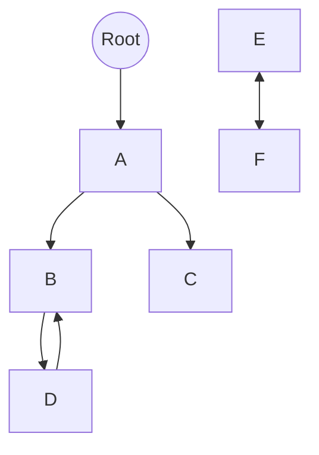

### Mark

```js
function markFromRoots(roots) {
  const marked = new Set();
  const worklist = [...roots];

  while (worklist.length > 0) {
    const objectId = worklist.pop();

    if (marked.has(objectId)) {
      continue;
    }

    marked.add(objectId);

    for (const reference of heap[objectId].references) {
      worklist.push(reference);
    }
  }

  return marked;
}
```

### Sweep

```js
function sweep(marked) {
  for (const objectId of Object.keys(heap)) {
    if (!marked.has(objectId)) {
      delete heap[objectId];
    }
  }
}
```

### Complete algorithm

```js
function garbageCollect() {
  const marked = markFromRoots(roots);
  sweep(marked);
}
```

The important algorithm is:

```text
1. Find GC roots
2. Traverse references
3. Mark reachable objects
4. Scan the heap
5. Unmarked objects are garbage
6. Reclaim/reuse their memory
```

---

## 5. Why not scan the entire heap every time?

Imagine a heap of 10 GB:

```text
Young generation:   200 MB
Old generation:    9.8 GB
```

Applications frequently create temporary objects:

```js
function processRequest(request) {
  const result = {
    id: request.id,
    transformed: transform(request)
  };

  return result;
}
```

Many such objects die quickly.

Scanning the entire 10 GB heap for every collection would be expensive.

This leads to the **generational hypothesis**:

> Most newly created objects die young.

---

## 6. Generational garbage collection

The heap is conceptually divided into age-based regions:

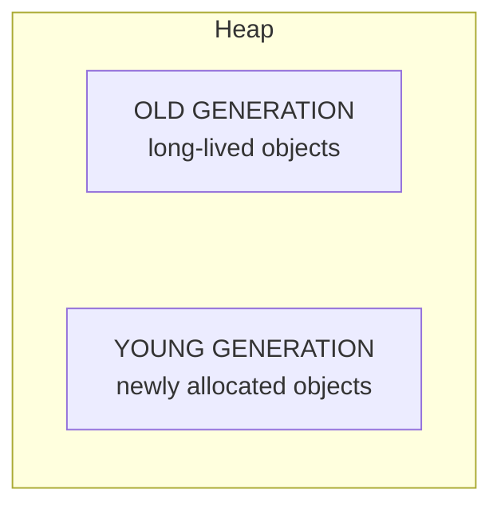

New objects generally start in the young generation.

If they survive collections, they may eventually be promoted to the old generation.

### Minor/young-generation collection

Instead of scanning the whole heap:

```text
10 GB
```

the collector can often focus on:

```text
young generation
```

For example:

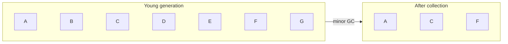

If most young objects are dead, this can reclaim a lot of memory cheaply.

---

## 7. The cross-generation problem

Consider:

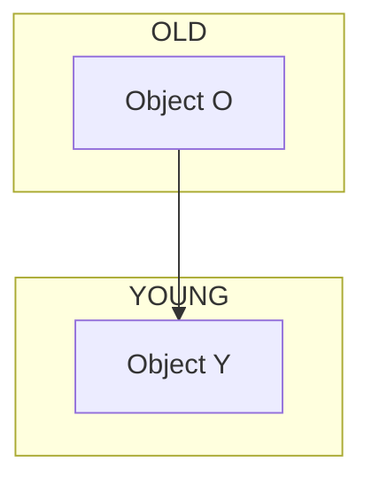

Suppose V8 wants to collect the young generation.

It must know that `Y` is reachable because an old object points to it.

But scanning the entire old generation just to find references into the young generation would defeat much of the benefit.

This is where **write barriers** and **remembered sets** come in.

---

## 8. Write barriers

Suppose:

```js
oldObject.child = newObject;
```

where:

```text
oldObject = old generation
newObject = young generation
```

A write barrier allows the runtime/GC to notice this cross-generation reference.

Conceptually:

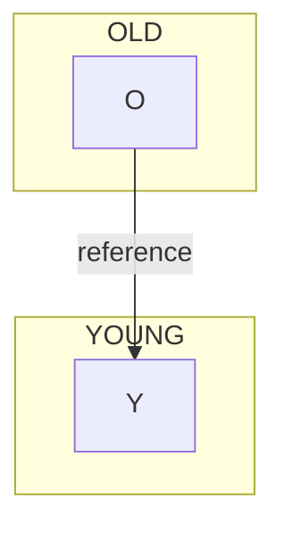

The runtime records enough information to remember that an old object may reference a young object.

---

## 9. Remembered sets

Instead of scanning millions of old objects:

```text
Old:
O1
O2
O3
...
O10,000,000
```

the collector can use remembered information such as:

```text
Remembered set:

O42   -> young object
O891  -> young object
O9012 -> young object
```

Then a young-generation collection can consider:

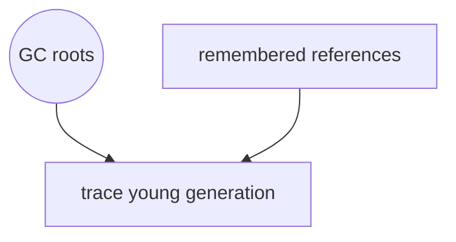

The exact implementation is more sophisticated, but this is the correct interview mental model.

---

## 10. Promotion

Suppose an object survives multiple young-generation collections:

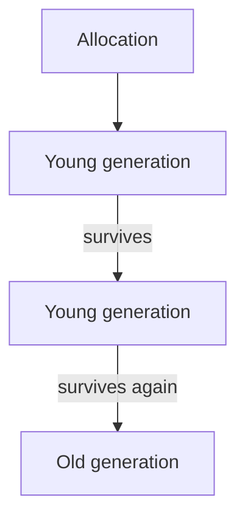

The runtime can promote long-lived objects to the old generation.

This is useful because repeatedly processing long-lived objects as part of the young generation would waste work.

---

## 11. Why old-generation collection is more expensive

Young-generation collection:

```text
Focus on:
Young generation
+ relevant cross-generation references
```

Old-generation collection may need to process much more of the heap.

Conceptually:

```text
Minor GC
  -> mostly young objects
  -> frequent
  -> relatively cheap

Major/old-space GC
  -> old objects
  -> more expensive
```

Modern V8 also uses techniques such as:

- Incremental marking
- Concurrent marking
- Concurrent sweeping
- Compaction
- Write barriers
- Remembered sets

These techniques reduce pause times and distribute GC work.

---

# 12. Interview-ready explanation

If asked:

> "Why doesn't V8 scan the entire heap every time?"

A strong answer is:

> V8 uses generational garbage collection because most objects die young. Newly allocated objects are placed in the young generation, so frequent collections can focus on a relatively small region instead of scanning the entire heap. Objects that survive can be promoted to the old generation. Because old objects can reference young objects, write barriers and remembered sets track those cross-generation references, allowing young-generation collections to find relevant references without scanning the entire old generation.

---

# 13. Key distinctions to remember

### Reachability vs. reference count

```text
Tracing GC:
Is there a path from a GC root?

Reference counting:
How many references point to this object?
```

### Cycle


A cycle is collectible if nothing reachable from the roots points to it.

### Unreachable vs. immediately deleted

An unreachable object is **eligible for reclamation**.

The runtime decides when and how memory is reclaimed.

### Young vs. old

```text
Young:
Many objects
Most die quickly
Frequent collections

Old:
Long-lived objects
More expensive collections
```

### Write barrier

A mechanism that lets the runtime notice important pointer/reference writes, especially references crossing generations.

### Remembered set

Data maintained by the collector to remember relevant references, such as old-to-young references, so it does not need to rescan the entire old generation during every young collection.

---

# 14. The mental model

Keep this picture in your head:

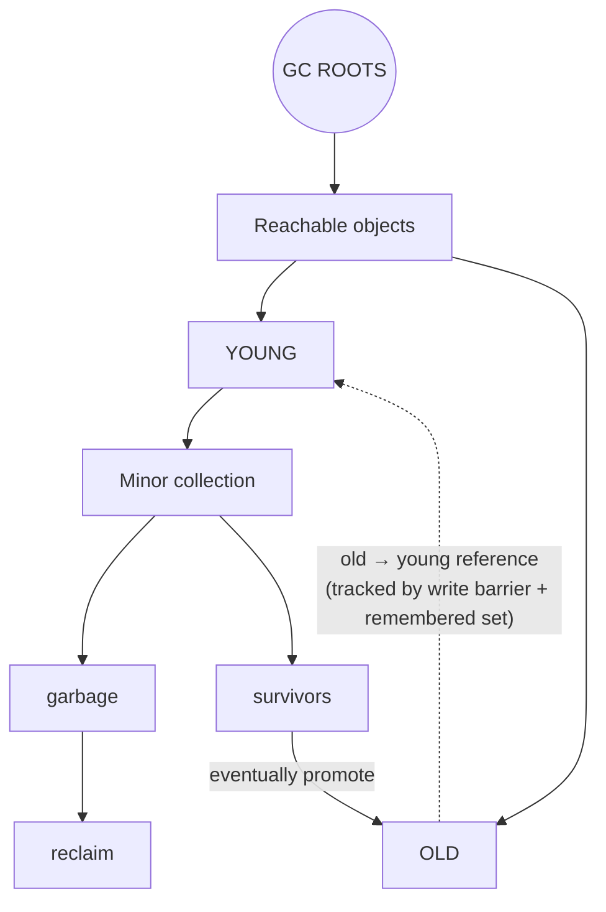

The progression to remember is:

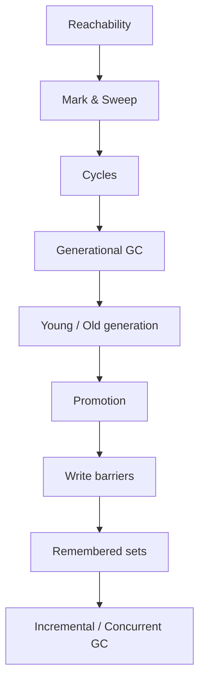

This sequence gives you a strong foundation for explaining garbage collection in a technical interview.
