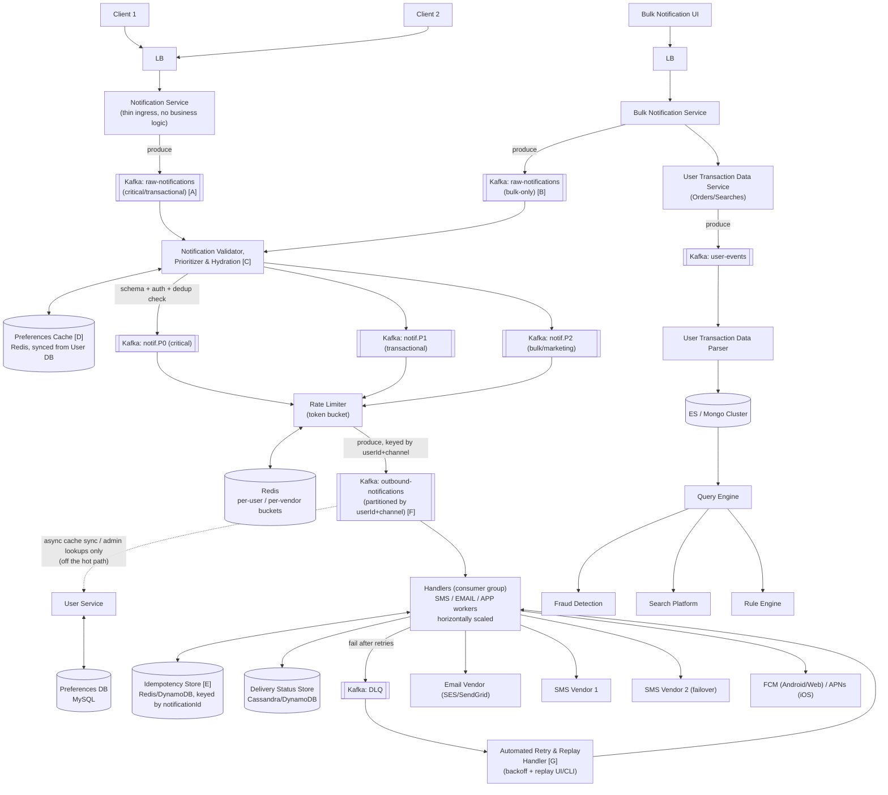

# Notification System Design

> Source: slide 2 of `System Design and Architecture.pptx` ("Notification System Design"). Diagram rebuilt in Mermaid, corrected, and extended below.
>
> **v2 update:** a design review of the v1 diagram in §2 surfaced 4 further structural weaknesses (outbound partitioning mismatch, synchronous preference lookups on the hot path, unbounded bulk fanout, missing pre-vendor idempotency). The diagram, component table, and scaling notes below have been updated to the v2 design that fixes them; see §5b for the finding-by-finding rationale.

## 1. Requirements

**Functional**
- Send a notification to a user through one or more channels: **Email, SMS, Push (mobile/web)**.
- Support **bulk notifications** (e.g., marketing campaigns) in addition to single, transactional notifications (e.g., OTP, order shipped).
- Respect **per-user preferences** (channel opt-in/opt-out, subject/category opt-in/opt-out).
- Provide **analytics** on notification volume and delivery outcomes.

**Non-functional**
- **Low latency** for transactional/high-priority notifications (e.g., OTP must arrive in < 5s).
- **High availability** — a vendor outage or traffic spike must not take down the whole pipeline.
- **Horizontally scalable** — must absorb bursty bulk-campaign load without starving transactional traffic.
- **At-least-once delivery** with **idempotency** (never silently drop a notification; duplicates must be safe).

## 2. High-Level Architecture

**Labels [A]–[G]** mirror the reviewed diagram, so each fix below can be pointed at exactly the node it changes:

- **[A]/[B] — split raw-notifications topics.** Critical/transactional traffic and bulk/marketing traffic no longer share an ingest topic, so a marketing blast can't create backpressure in front of a P0 OTP before prioritization even happens.
- **[C] — Hydration added to the Validator/Prioritizer stage.** It now hydrates the payload with preference/channel data from the cache in the same pass it validates and prioritizes, instead of leaving that lookup for a handler downstream of Kafka.
- **[D] — Preferences Cache (Redis).** Populated by an async sync process off the User DB; this is the thing the Handler used to query synchronously per message.
- **[E] — Idempotency Store.** Checked/set by the Handler immediately before any vendor call, independent of and in addition to the Rate Limiter.
- **[F] — Outbound Kafka repartitioned.** Key is now `userId+channel` (not channel alone), so per-user ordering is guaranteed and a single channel's traffic spans many partitions instead of one.
- **[G] — Automated Retry & Replay Handler.** Consumes the DLQ, applies exponential backoff, and exposes a replay path (UI/CLI) for notifications that need manual re-drive after unrecoverable vendor failures.

## 3. Why each component exists

| Component | Purpose | Why this tech |
|---|---|---|
| **LB** | Terminates client connections, distributes load across stateless Notification Service instances, absorbs regional traffic. | Any L7 LB (ALB/NGINX/Envoy). Cheap, well understood, not the bottleneck. |
| **Notification Service** | Thin ingress: validates the request shape, auths the caller, writes a "raw" event to Kafka, returns `202 Accepted` immediately. | Keeping it "dumb" means the client is never blocked on downstream vendor latency — this is the single most important idea in the whole design. |
| **Kafka (raw → prioritized topics)** | Durable buffer that decouples ingestion from processing; lets every downstream stage scale independently and replay on failure. | Kafka over SQS/RabbitMQ because: (a) we need **multiple independent consumer groups** to read the same stream (validator, analytics, fraud), (b) partition-ordered, replayable log is a better fit than a queue that deletes on ack, (c) throughput at this scale (millions/day, bursty) is Kafka's home turf. |
| **Kafka: raw-notifications (bulk-only) [B]** | Isolates bulk/marketing audience expansion from critical/transactional ingest so a million-user blast never sits in front of a P0 OTP. | **Added in v2** — the original single `raw-notifications` topic mixed both; see §5b finding 3. |
| **Notification Validator, Prioritizer & Hydration [C]** | Schema validation, auth/quota/dedup check, **routes into a topic per priority** (P0 critical/OTP, P1 transactional, P2 bulk), and now also **hydrates the payload with preference/channel data from the cache** in the same pass. | Priority topics alone don't guarantee priority *service* — see §4 (starvation fix). Hydration moved here (v2) so downstream stages never need a synchronous DB round-trip — see §5b finding 2. |
| **Preferences Cache [D] (Redis, synced from User DB)** | Serves the opt-in/opt-out + channel preference lookup the Validator/Hydration stage needs, at cache speed instead of a per-message MySQL query. | **Added in v2.** Populated by an async sync job off the Preferences DB; eliminates the synchronous `User Service`/MySQL call that used to sit on the hot path — see §5b finding 2. |
| **Rate Limiter (Redis)** | Protects downstream vendors (SMS/Email APIs have hard rate limits and $-per-message cost) and protects users from notification spam. | Redis `INCR` + `EXPIRE` (or a sorted-set sliding window) gives atomic, sub-millisecond counters shared across all handler instances — a local in-process counter would not work once you have >1 handler replica. |
| **User Service / Preferences DB (MySQL)** | Source of truth for preferences; still exists, but is now off the hot path — reached only for async cache sync and admin/support lookups. | **Role changed in v2.** Previously queried synchronously per outbound message by the Handler (risk: thread exhaustion + hammering MySQL during bulk fanout); now the Preferences Cache [D] is the only thing on the send path — see §5b finding 2. |
| **Kafka (outbound-notifications, keyed by userId+channel, partitioned by userId+channel) [F]** | Fans out to channel-specific worker pools without coupling them, and gives per-user ordering (two notifications to the same user shouldn't race), while spreading any single channel's traffic across many partitions. | **Repartitioning key fixed in v2.** The diagram previously said "keyed by userId" but "partitioned by channel" — a mismatch that neither guaranteed per-user ordering nor prevented one viral campaign saturating a single channel partition. Keying and partitioning by `userId+channel` fixes both — see §5b finding 1. |
| **Handlers (SMS/EMAIL/APP) — consumer group** | Actually calls the third-party vendor API, after checking the Idempotency Store. | Consumer-group pattern is correct: add more pods → more partitions consumed → linear scale. |
| **Idempotency Store [E] (Redis/DynamoDB)** | Handler checks/sets a `notificationId`/dedup-hash here immediately before every vendor call, independent of the Rate Limiter. | **Added in v2.** Rate limiting alone doesn't prevent double-sends on network retries/reprocessed offsets — see §5b finding 4. |
| **Delivery Status Store** | Records sent/delivered/failed/read per notification+channel, needed for support, analytics, and (together with the Idempotency Store) idempotency. | Added relative to the original slide — see §5. |
| **DLQ** | Notifications that fail after N retries (vendor down, invalid phone number) go here instead of being dropped or retried forever. | Added relative to the original slide — see §5. |
| **Automated Retry & Replay Handler [G]** | Consumes the DLQ, retries with exponential backoff, and exposes a replay path (UI/CLI) for notifications that need manual re-drive after unrecoverable vendor failures. | **Added in v2** — a DLQ with nothing reading from it is just a notification graveyard; see §5b finding 5. |

## 4. Handling scale & concurrency

- **Ingress is stateless and horizontally scaled** behind the LB — scale by adding pods, no coordination needed.
- **Kafka partitions = unit of parallelism.** Pick partition count for the outbound topic based on target throughput ÷ per-partition throughput (see capacity math below), not arbitrarily. Consumer group size should equal partition count for max parallelism — more consumers than partitions just sit idle.
- **Priority is enforced by a weighted consumer strategy, not by topic existence alone.** A naive "3 topics, 3 separate consumer groups" setup still needs the handler layer to poll P0 more aggressively than P2, otherwise a bulk campaign backlog delays a P0 OTP that was produced *after* it if consumers are shared. Two correct patterns:
  1. **Dedicated consumer pools per priority** (simplest): P0 has its own small, always-warm pool with spare capacity; P2 has a large, elastic pool. No cross-priority contention possible.
  2. **Weighted polling** in a shared pool: poll P0 topic every cycle, P1 every 3rd cycle, P2 only when P0/P1 are empty.
  We recommend **(1)** for this design — it's simpler to reason about and to alert on ("P0 consumer lag > 5s is a page").
- **Outbound partition key is `userId+channel`, not `channel` alone (v2 fix).** Partitioning by channel alone means every SMS in the system funnels through however many partitions the SMS side owns — a single viral campaign saturates them regardless of total partition count, and it doesn't even buy per-user ordering unless `userId` is also in the key. Compounding `userId+channel` into the partition key gives both: strict per-user-per-channel ordering, and even spread across a high partition count so one hot channel can't monopolize capacity.
- **Billions of users does not break `userId+channel` partitioning — it's actually why the key works.** Kafka partition count `N` is a fixed number you choose (sized off target throughput ÷ per-partition throughput, §6) — it is *not* one partition per key value. Every message routes via `hash(key) % N`, so billions of distinct `userId+channel` values hashing into, say, 500 partitions spreads load close to evenly (high key cardinality relative to `N` is exactly what minimizes skew). This is the opposite failure mode from the original `channel`-only key, which only had ~4 distinct values and could never fill more than ~4 partitions no matter how many were configured. The real limits: (a) `N` is capped by cluster/broker overhead (metadata, replication, open file handles), not by user count — practically low-hundreds to low-thousands per topic; (b) ordering is only guaranteed *per key* (per `userId+channel`), not globally, which is what we want anyway; (c) a single abnormally hot key (one account somehow generating a disproportionate burst on one channel) still lands on one partition regardless of `N` — that residual risk is what the per-user Rate Limiter guards against, not something more partitions fixes; (d) growing `N` later reshuffles the hash mapping and resets ordering guarantees across that boundary, so pick `N` with headroom up front rather than resizing casually.
- **Vendor concurrency limits**: real SMS/Email vendors cap requests/sec per account. The Rate Limiter must be **per-vendor-account**, not just per-user, or a bulk campaign will get the whole account throttled/banned mid-send.
- **Idempotency is now two layers (v2), not one.** The Rate Limiter (token bucket) only shapes *volume*; it does nothing to stop a genuine duplicate. Kafka gives *at-least-once* delivery by default (consumer can crash after processing but before committing offset), so the Handler must additionally check the Idempotency Store: derive a deterministic `notificationId` (e.g., hash of `userId+templateId+dedupWindow`) and check/set it in Redis/DynamoDB **immediately before calling the vendor** — not just before writing to the Delivery Status Store — so a re-processed message or a network-level retry never double-sends an SMS the user pays attention to (or double-charges the vendor bill).
- **Backpressure for bulk campaigns is structural now, not just behavioral (v2).** Bulk audience expansion produces onto its own `raw-notifications-bulk` topic [B], physically separate from the critical/transactional topic [A], so a bulk backlog can never queue in front of a P0 OTP even before prioritization runs. The Bulk Notification Service should still paginate audience expansion and push at a controlled rate (or let the Rate Limiter's 429-style backoff naturally throttle it) — the topic split bounds *where* the pressure can build, it doesn't remove the need to bound *how fast* it builds.

## 5. Bugs / gaps in the original slide and the fixes applied

1. **No delivery-status tracking.** The original diagram ends at "Handlers → Vendor" with no record of outcome. *Fix:* added a Delivery Status Store (Cassandra/DynamoDB — high write volume, simple key `notificationId`, no complex queries needed) so support/analytics/idempotency all have a source of truth.
2. **No retry/DLQ strategy.** A transient vendor 500 would otherwise silently lose the notification. *Fix:* added a DLQ topic + a small reaper job that retries with exponential backoff and pages on-call after N failures.
3. **"Topic per priority" without a consumption strategy** starves high-priority traffic under load — see §4. *Fix:* dedicated consumer pools per priority.
4. **Rate Limiter scope was ambiguous** (per-user only). *Fix:* explicitly per-user **and** per-vendor-account limiting.
5. **No caching layer in front of Preferences DB**, yet preferences are read on *every single send*. *Fix:* cache-aside Redis in front of MySQL with a short TTL + write-through invalidation on preference update.
6. **"Firebase, Pusher" as push vendors is muddled.** Firebase Cloud Messaging (FCM) is the correct choice for Android + Web push, and APNs for iOS; Pusher is a hosted pub/sub product, not typically how large-scale native push is done. *Fix:* replaced with FCM/APNs, which is what production mobile notification systems actually use.

## 5b. Second review round — structural weaknesses found in the v1 diagram, and the v2 fixes

The v1 diagram in §2 (as it stood before this update) was itself reviewed, surfacing four further structural issues plus a follow-up on the DLQ added in §5. All are now reflected in the §2 diagram and §3 table.

1. **Partitioning mismatch on the outbound Kafka topic.** v1 said `outbound-notifications` was "keyed by userId" but "partitioned by channel." Those two claims are inconsistent: partitioning by channel alone doesn't guarantee per-user ordering (that requires `userId` to be part of the partition key), and it means a single viral campaign on one channel saturates that channel's partition(s) regardless of overall partition count. *Fix:* key **and** partition `outbound-notifications` [F] by `userId+channel`, on a higher partition count, so per-user-per-channel ordering is strict and load spreads evenly (§4).
2. **Synchronous preference/service lookups on the hot path.** v1 had the Notification Handler query User Service → Preferences DB (MySQL) per message, downstream of Kafka. Under bulk fanout this means thousands of concurrent MySQL point-queries, risking connection/thread exhaustion and added per-message latency on the delivery path. *Fix:* introduced a **Preferences Cache** [D] (Redis, async-synced from the User DB) and moved hydration **upstream**, into the Validator/Prioritizer stage [C] — the payload arrives at the Handler already carrying channel/opt-in data, and MySQL is no longer touched per send.
3. **Bulk fanout pressure on shared ingest.** v1 expanded bulk audience segments directly into the same `raw-notifications` topic used by transactional/critical traffic, so a large campaign could create backpressure in front of P0 OTPs before the priority split even ran. *Fix:* added a dedicated **`raw-notifications` (bulk-only)** topic [B], physically isolating bulk ingest from critical/transactional ingest [A]; both feed the same Validator/Prioritizer/Hydration stage [C], which is still what actually assigns P0/P1/P2.
4. **No idempotency check ahead of the third-party vendor call.** v1 relied on the Rate Limiter (token bucket) alone, which shapes throughput but does not detect a genuine duplicate — a network-level retry or a re-processed Kafka offset could reach SendGrid/Twilio/APNs twice. *Fix:* added an **Idempotency Store** [E] (Redis/DynamoDB) that the Handler checks/sets by `notificationId`/dedup-hash immediately before every vendor call, independent of and in addition to rate limiting.
5. **DLQ had no replay path.** §5's DLQ addition stopped notifications from being silently dropped, but nothing consumed it — failures just accumulated. *Fix:* added an **Automated Retry & Replay Handler** [G] that consumes the DLQ, retries with exponential backoff, and exposes a replay UI/CLI for the subset of failures (e.g. permanently invalid phone number) that need a human decision rather than an automatic retry.

## 6. Capacity / bandwidth estimate (example numbers — replace with real product data)

Assume 50M users, average 4 notifications/user/day → **200M notifications/day ≈ 2,315/s average**, with a **10x peak multiplier** for campaign bursts → **~23K/s peak**.

- Average message payload (template id + params + userId): ~500 bytes → raw ingest bandwidth at peak ≈ 23,000 × 500 B ≈ **11.5 MB/s**, trivial for Kafka.
- Using ~10–50 MB/s safe sustained throughput per Kafka partition (modern Kafka benchmarks, conservative planning constant), even a single partition could theoretically absorb this — but you still want **≥ (peak QPS ÷ target per-partition msg/s)** partitions so that *consumer* parallelism (handler pool size) can scale, e.g. 24 partitions → up to 24 parallel handler pods per channel.
- Vendor egress is the real bottleneck: SMS vendors commonly cap at 10–100 req/s per account — this is *why* the per-vendor Rate Limiter and multiple SMS vendor accounts (Vendor 1/2) exist; at 23K/s peak SMS demand you need dozens of vendor accounts/numbers in parallel, or you must shed load (SMS is usually P1/P2, not P0, precisely to allow this).
- Delivery Status Store at 200M writes/day (~1 row per notification) is a small, well-understood Cassandra workload (single-partition-key writes, no cross-partition transactions).
- **Partition count doesn't scale with user count.** Even scaling the 50M-user example up to billions of users, the `outbound-notifications` partition count [F] is still sized off the throughput/parallelism math above (target ≥ peak QPS ÷ per-partition throughput), *not* off the number of distinct `userId+channel` values — Kafka hashes an unbounded key space down onto a fixed `N`, so a bigger user base just improves the evenness of that hash spread. What *would* force `N` up is more peak QPS or wanting more parallel consumer pods, not more users.

## 7. Likely interviewer questions

- *"How do you guarantee an OTP arrives fast even during a huge marketing blast?"* → two layers: bulk traffic never even shares an ingest topic with critical traffic (`raw-notifications-bulk` [B] vs [A], §5b finding 3), and a dedicated P0 consumer pool with reserved capacity isolated from P2 backlog once past prioritization (§4).
- *"What happens if the SMS vendor is down?"* → Rate Limiter/circuit breaker trips, retries with backoff, eventually DLQ + failover to Vendor 2; the Automated Retry & Replay Handler [G] keeps retrying with backoff and offers manual replay for anything unrecoverable; user-facing status reflects `failed`, not silently dropped.
- *"How do you avoid sending the same notification twice?"* → deterministic `notificationId`/dedup-hash checked against the **Idempotency Store** [E] immediately before every vendor call — not the Rate Limiter, which only shapes volume — plus the Delivery Status Store as the durable record of outcome (Kafka is at-least-once, so this is mandatory, not optional; §5b finding 4).
- *"Why was 'partitioned by channel, keyed by userId' wrong?"* → the two claims contradict each other: per-user ordering needs `userId` in the partition key, and partitioning by channel alone lets one channel's traffic (and one viral campaign) saturate that channel's partitions no matter how many partitions exist overall. Fix: key and partition by `userId+channel` together (§5b finding 1).
- *"With billions of users, doesn't partitioning by `userId+channel` fall apart?"* → no — it's the opposite. Kafka doesn't allocate one partition per key value; it hashes an effectively unbounded key space onto a fixed, chosen partition count `N`. High key cardinality relative to `N` is what makes the hash spread even; `N` itself is sized off target throughput/consumer parallelism (§6), not user count. The one thing more users doesn't fix is a single abnormally hot key — that's what the per-user Rate Limiter is for.
- *"Why Kafka and not a plain queue (SQS)?"* → need for multiple independent consumer groups over the same event (validator, fraud/analytics, delivery), replay, and partition-ordered per-user delivery.
- *"How would you scale to 10x traffic?"* → add Kafka partitions + proportionally more handler pods (stateless, horizontally scalable); rate limiter and vendor account pool are the real ceiling, not compute.
- *"How do you respect user preferences under load without adding latency?"* → preferences are hydrated into the payload **upstream**, at the Validator/Prioritizer/Hydration stage [C], from a Preferences Cache [D] (Redis, async-synced from MySQL) — so nothing downstream of Kafka ever queries the Preferences DB synchronously (§5b finding 2).
