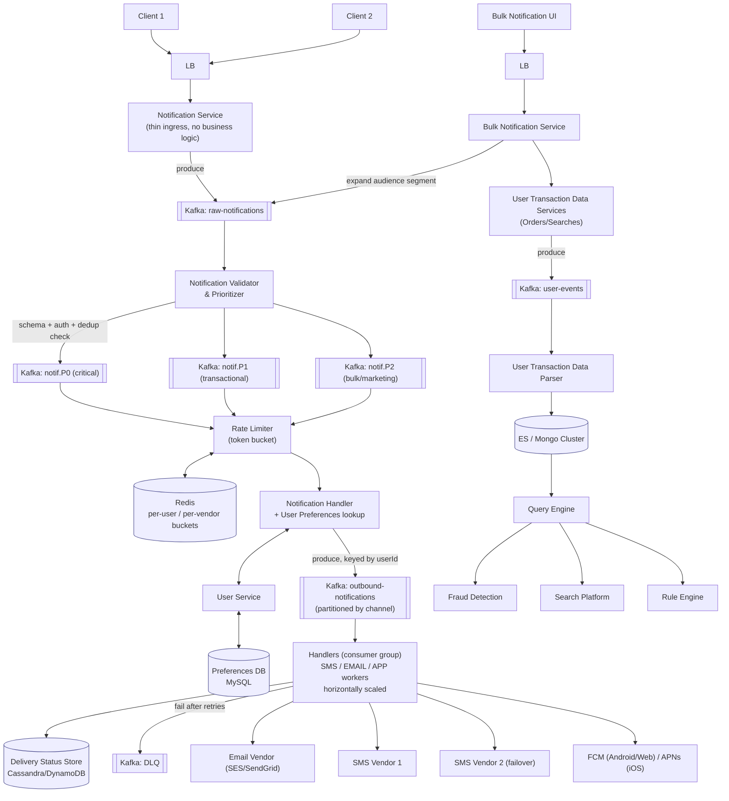

# Notification System Design

> Source: slide 2 of `System Design and Architecture.pptx` ("Notification System Design"). Diagram rebuilt in Mermaid, corrected, and extended below.

## 1. Requirements

**Functional**
- Send a notification to a user through one or more channels: **Email, SMS, Push (mobile/web)**.
- Support **bulk notifications** (e.g., marketing campaigns) in addition to single, transactional notifications (e.g., OTP, order shipped).
- Respect **per-user preferences** (channel opt-in/opt-out, subject/category opt-in/opt-out).
- Provide **analytics** on notification volume and delivery outcomes.

**Non-functional**
- **Low latency** for transactional/high-priority notifications (e.g., OTP must arrive in < 5s).
- **High availability** — a vendor outage or traffic spike must not take down the whole pipeline.
- **Horizontally scalable** — must absorb bursty bulk-campaign load without starving transactional traffic.
- **At-least-once delivery** with **idempotency** (never silently drop a notification; duplicates must be safe).

## 2. High-Level Architecture

## 3. Why each component exists

| Component | Purpose | Why this tech |
|---|---|---|
| **LB** | Terminates client connections, distributes load across stateless Notification Service instances, absorbs regional traffic. | Any L7 LB (ALB/NGINX/Envoy). Cheap, well understood, not the bottleneck. |
| **Notification Service** | Thin ingress: validates the request shape, auths the caller, writes a "raw" event to Kafka, returns `202 Accepted` immediately. | Keeping it "dumb" means the client is never blocked on downstream vendor latency — this is the single most important idea in the whole design. |
| **Kafka (raw → prioritized topics)** | Durable buffer that decouples ingestion from processing; lets every downstream stage scale independently and replay on failure. | Kafka over SQS/RabbitMQ because: (a) we need **multiple independent consumer groups** to read the same stream (validator, analytics, fraud), (b) partition-ordered, replayable log is a better fit than a queue that deletes on ack, (c) throughput at this scale (millions/day, bursty) is Kafka's home turf. |
| **Notification Validator & Prioritizer** | Schema validation, auth/quota check, and — critically — **routes into a topic per priority** (P0 critical/OTP, P1 transactional, P2 bulk). | **Original slide only said "there is a topic per priority" without explaining consumption.** Priority topics alone don't guarantee priority *service* — see §5 (starvation fix). |
| **Rate Limiter (Redis)** | Protects downstream vendors (SMS/Email APIs have hard rate limits and $-per-message cost) and protects users from notification spam. | Redis `INCR` + `EXPIRE` (or a sorted-set sliding window) gives atomic, sub-millisecond counters shared across all handler instances — a local in-process counter would not work once you have >1 handler replica. |
| **Notification Handler + User Service** | Resolves *who* should get this and *how* (channel opt-in, quiet hours, language) before spending money sending it. | Preferences change rarely and are read on every send → cache-aside with Redis in front of MySQL is implied and should be made explicit (see §6). |
| **Preferences DB (MySQL)** | Preferences are structured, low-write-volume, and benefit from relational integrity (user_id → channel → category). | Correct choice in the original; no change needed. |
| **Kafka (outbound, keyed by userId, partitioned by channel)** | Fans out to channel-specific worker pools without coupling them, and gives per-user ordering (important: two notifications to the same user shouldn't race). | Keying by `userId` (not random) preserves per-user delivery order within a partition. |
| **Handlers (SMS/EMAIL/APP) — consumer group** | Actually calls the third-party vendor API. | Consumer-group pattern is correct: add more pods → more partitions consumed → linear scale. |
| **Delivery Status Store** | Records sent/delivered/failed/read per notification+channel, needed for support, analytics, and idempotency. | **Missing entirely from the original diagram** — added, see §5. |
| **DLQ** | Notifications that fail after N retries (vendor down, invalid phone number) go here instead of being dropped or retried forever. | **Missing from the original** — added, see §5. |

## 4. Handling scale & concurrency

- **Ingress is stateless and horizontally scaled** behind the LB — scale by adding pods, no coordination needed.
- **Kafka partitions = unit of parallelism.** Pick partition count for the outbound topic based on target throughput ÷ per-partition throughput (see capacity math below), not arbitrarily. Consumer group size should equal partition count for max parallelism — more consumers than partitions just sit idle.
- **Priority is enforced by a weighted consumer strategy, not by topic existence alone.** A naive "3 topics, 3 separate consumer groups" setup still needs the handler layer to poll P0 more aggressively than P2, otherwise a bulk campaign backlog delays a P0 OTP that was produced *after* it if consumers are shared. Two correct patterns:
  1. **Dedicated consumer pools per priority** (simplest): P0 has its own small, always-warm pool with spare capacity; P2 has a large, elastic pool. No cross-priority contention possible.
  2. **Weighted polling** in a shared pool: poll P0 topic every cycle, P1 every 3rd cycle, P2 only when P0/P1 are empty.
  We recommend **(1)** for this design — it's simpler to reason about and to alert on ("P0 consumer lag > 5s is a page").
- **Vendor concurrency limits**: real SMS/Email vendors cap requests/sec per account. The Rate Limiter must be **per-vendor-account**, not just per-user, or a bulk campaign will get the whole account throttled/banned mid-send.
- **Idempotency**: Kafka gives *at-least-once* delivery by default (consumer can crash after processing but before committing offset). The Handler must be idempotent: derive a deterministic `notificationId` (e.g., hash of `userId+templateId+dedupWindow`) and check the Delivery Status Store before calling the vendor, so a re-processed message doesn't double-send an SMS the user pays attention to (or double-charges the vendor bill).
- **Backpressure for bulk campaigns**: Bulk Notification Service should not blast millions of `raw-notification` events at once. It should paginate audience expansion and push at a controlled rate (or let the Rate Limiter's 429-style backoff naturally throttle it) so a marketing blast never starves P0/P1 traffic on shared infrastructure (reinforces why priority topics + dedicated pools matter).

## 5. Bugs / gaps in the original slide and the fixes applied

1. **No delivery-status tracking.** The original diagram ends at "Handlers → Vendor" with no record of outcome. *Fix:* added a Delivery Status Store (Cassandra/DynamoDB — high write volume, simple key `notificationId`, no complex queries needed) so support/analytics/idempotency all have a source of truth.
2. **No retry/DLQ strategy.** A transient vendor 500 would otherwise silently lose the notification. *Fix:* added a DLQ topic + a small reaper job that retries with exponential backoff and pages on-call after N failures.
3. **"Topic per priority" without a consumption strategy** starves high-priority traffic under load — see §4. *Fix:* dedicated consumer pools per priority.
4. **Rate Limiter scope was ambiguous** (per-user only). *Fix:* explicitly per-user **and** per-vendor-account limiting.
5. **No caching layer in front of Preferences DB**, yet preferences are read on *every single send*. *Fix:* cache-aside Redis in front of MySQL with a short TTL + write-through invalidation on preference update.
6. **"Firebase, Pusher" as push vendors is muddled.** Firebase Cloud Messaging (FCM) is the correct choice for Android + Web push, and APNs for iOS; Pusher is a hosted pub/sub product, not typically how large-scale native push is done. *Fix:* replaced with FCM/APNs, which is what production mobile notification systems actually use.

## 6. Capacity / bandwidth estimate (example numbers — replace with real product data)

Assume 50M users, average 4 notifications/user/day → **200M notifications/day ≈ 2,315/s average**, with a **10x peak multiplier** for campaign bursts → **~23K/s peak**.

- Average message payload (template id + params + userId): ~500 bytes → raw ingest bandwidth at peak ≈ 23,000 × 500 B ≈ **11.5 MB/s**, trivial for Kafka.
- Using ~10–50 MB/s safe sustained throughput per Kafka partition (modern Kafka benchmarks, conservative planning constant), even a single partition could theoretically absorb this — but you still want **≥ (peak QPS ÷ target per-partition msg/s)** partitions so that *consumer* parallelism (handler pool size) can scale, e.g. 24 partitions → up to 24 parallel handler pods per channel.
- Vendor egress is the real bottleneck: SMS vendors commonly cap at 10–100 req/s per account — this is *why* the per-vendor Rate Limiter and multiple SMS vendor accounts (Vendor 1/2) exist; at 23K/s peak SMS demand you need dozens of vendor accounts/numbers in parallel, or you must shed load (SMS is usually P1/P2, not P0, precisely to allow this).
- Delivery Status Store at 200M writes/day (~1 row per notification) is a small, well-understood Cassandra workload (single-partition-key writes, no cross-partition transactions).

## 7. Likely interviewer questions

- *"How do you guarantee an OTP arrives fast even during a huge marketing blast?"* → dedicated P0 consumer pool with reserved capacity, isolated from P2 backlog (§4).
- *"What happens if the SMS vendor is down?"* → Rate Limiter/circuit breaker trips, retries with backoff, eventually DLQ + failover to Vendor 2; user-facing status reflects `failed`, not silently dropped.
- *"How do you avoid sending the same notification twice?"* → deterministic `notificationId` + idempotency check against the Delivery Status Store before every vendor call (Kafka is at-least-once, so this is mandatory, not optional).
- *"Why Kafka and not a plain queue (SQS)?"* → need for multiple independent consumer groups over the same event (validator, fraud/analytics, delivery), replay, and partition-ordered per-user delivery.
- *"How would you scale to 10x traffic?"* → add Kafka partitions + proportionally more handler pods (stateless, horizontally scalable); rate limiter and vendor account pool are the real ceiling, not compute.
- *"How do you respect user preferences under load without adding latency?"* → cache-aside Redis in front of MySQL, TTL + explicit invalidation on preference change.
