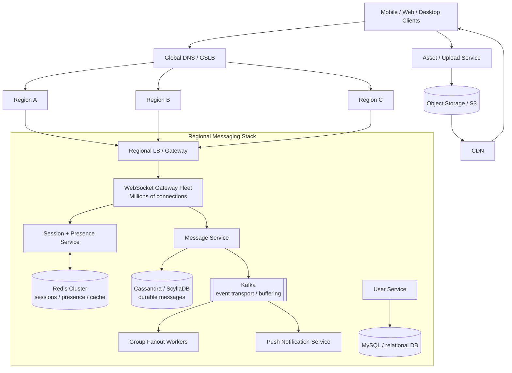

# WhatsApp / Real-Time Chat System Design

> **Goal:** Design a WhatsApp-like messaging system that supports sending and receiving text messages and files for billions of users, with very low delivery latency and strong durability.
>
> **Source basis:** This document preserves and extends the original uploaded design. The original design's terminology and useful interview points are retained, while the recommended improvements from the review are incorporated. Where the original design made a claim that should be refined for an interview, the refinement is explicitly called out rather than silently replacing the original reasoning.

---

# 1. Requirements

## Functional

- 1:1 messaging
- Group messaging
- Multi-device sessions
- Message states: sent / delivered / read
- Online / last-seen presence
- Typing indicators
- Image / video / file messages
- Offline message synchronization
- Message retry and deduplication
- Message ordering within a conversation
- Push notifications when appropriate
- Media upload and download through object storage/CDN

## Non-functional

- Very low p99 message delivery latency
- High availability
- Horizontally scalable to billions of users
- Durable messages
- At-least-once delivery with idempotent processing
- No loss of messages acknowledged as persisted
- Multi-region failure tolerance
- Graceful degradation under overload

### Important delivery guarantee

Do **not** promise "the network can never lose a message."

A better contract is:

> **Messages acknowledged as persisted are never lost by the messaging system. Delivery is at-least-once, and clients/server-side processing use message IDs for deduplication and idempotency.**

Exactly-once network delivery is not required.

---

# 2. High-Level Architecture



## Core architectural principle

> **Connection state is ephemeral; message state is durable.**

WebSocket gateways may restart, Redis may lose ephemeral session state, Kafka consumers may restart, and clients may disconnect/reconnect. None of those events should destroy a message that has already been durably persisted.

---

# 3. The Five Main Planes

A useful way to explain the architecture is to separate it into five logical planes.

## 3.1 Connection plane

Responsible for:

- WebSocket connections
- connection registration
- session routing
- heartbeats
- presence

Components:

- Global traffic routing
- Load balancers
- WebSocket gateway fleet
- Session Service
- Redis

## 3.2 Message plane

Responsible for:

- accepting messages
- validating/authenticating them
- assigning ordering information
- durable persistence
- delivery events

Components:

- Message Service
- Cassandra / ScyllaDB
- Kafka

## 3.3 Group plane

Responsible for:

- group membership
- group message fan-out
- large-group backpressure

Components:

- Group Service
- Kafka
- Fan-out workers
- Group metadata DB

## 3.4 Media plane

Responsible for:

- upload authorization
- resumable/multipart upload
- object storage
- CDN delivery

Components:

- Asset Service
- S3/object storage
- CDN

## 3.5 Control / data plane

Responsible for:

- user/account data
- group metadata
- configuration
- observability
- analytics

---

# 4. Why Each Component Exists

| Component | Purpose | Why this technology / pattern |
|---|---|---|
| **WebSocket gateways** | Hold persistent bidirectional client connections and push messages. | WebSocket avoids polling overhead and provides true server push. Gateways remain stateless with respect to durable message content. |
| **Session + Presence Service** | Maps users/devices to currently connected gateway sessions. | Connection state is high-churn and ephemeral. |
| **Redis Cluster** | Stores session routing, presence and hot cache data. | Very low-latency key/value operations and TTL support. Redis is not the message source of truth. |
| **Message Service** | Validates, persists, sequences and distributes messages. | Keeps messaging semantics separate from connection management. |
| **Cassandra / ScyllaDB** | Durable message history. | Append-heavy, partitionable workload with horizontal scaling. Cassandra is a reasonable starting point; ScyllaDB is an alternative when tail latency and GC characteristics become important at extreme scale. |
| **Kafka** | Event transport, buffering and asynchronous fan-out. | Decouples message ingestion from group fan-out and other asynchronous work. Kafka is not the permanent chat database. |
| **Group Fanout Workers** | Deliver group messages asynchronously. | Prevents a large group from blocking the WebSocket hot path. |
| **Object Storage** | Stores large binary media. | Better suited than WebSocket/message infrastructure for large files. |
| **CDN** | Serves media close to users. | Reduces origin load and download latency. |
| **User Service + MySQL** | Account/profile/relational data. | Relational integrity and relatively lower write volume. |
| **Presence Service** | Online state, last seen, typing. | These have different durability requirements from actual messages. |

---

# 5. End-to-End 1:1 Message Flow

The critical ordering is:

```text
Client A
   |
   | 1. SEND(message_id, conversation_id, payload)
   v
WebSocket Gateway
   |
   | 2. authenticate / validate
   v
Message Service
   |
   | 3. durable write
   v
Cassandra / ScyllaDB
   |
   | 4. persistence ACK
   v
Message Service
   |
   | 5. ACK sender
   v
WebSocket Gateway
   |
   | 6. lookup recipient sessions
   v
Session Service / Redis
   |
   | 7. live delivery attempt
   v
Recipient WebSocket Gateway
   |
   | 8. deliver
   v
Recipient Client
```

### Critical rule

> **Persist first, route second.**

Never make the correctness of the system depend on:

```text
check recipient online
        ↓
persist message
```

Instead:

```text
persist message
        ↓
attempt live delivery
```

This eliminates the reconnect race discussed in the original design.

---

# 6. The Original Race Condition and the Fix

The original design identified this race:

```text
U1 sends to U3
       |
       v
Session Manager checks U3
       |
       | U3 appears offline
       v
U3 connects
       |
       v
U3 fetches pending messages
       |
       | message is not there yet
       v
U3 gets nothing

Meanwhile:
U1's message finally gets persisted
```

The periodic-polling fix in the original design is useful as a liveness safety net, but it should not be the correctness mechanism.

## Correct fix

```text
U1
 |
 | send
 v
Message Service
 |
 | persist
 v
Durable Store
 |
 | ACK
 v
Message Service
 |
 | route
 v
U3's current session
```

If U3 connects before the live push:

```text
U3 reconnects
    |
    v
sync from last acknowledged sequence
    |
    v
Durable Store
    |
    v
message returned
```

Therefore the message is not lost.

### Interview answer

> "The race is eliminated by making durable persistence happen before live routing. A reconnecting client always synchronizes from durable state, so live connection timing cannot determine whether a message exists."

Periodic sync can still exist as a **liveness/self-healing mechanism**, but it is no longer load-bearing for correctness.

---

# 7. Multi-Device Sessions

A user is not mapped to exactly one WebSocket server.

Example:

```text
Alice
 ├── iPhone   → WS-17
 ├── Mac      → WS-81
 └── Web      → WS-102
```

The session model should therefore be:

```text
user_id
   |
   +-- device/session A → gateway + region + connection_id
   |
   +-- device/session B → gateway + region + connection_id
   |
   +-- device/session C → gateway + region + connection_id
```

Redis can conceptually hold:

```text
user:{userId}:sessions

deviceA -> {
    connectionId,
    gatewayId,
    region,
    lastHeartbeat
}

deviceB -> {
    connectionId,
    gatewayId,
    region,
    lastHeartbeat
}
```

## Session lifecycle

```text
connect
  ↓
authenticate
  ↓
register session
  ↓
heartbeat / TTL refresh
  ↓
disconnect
```

Use TTLs/leases so a dead gateway does not leave stale routing entries forever.

---

# 8. WebSocket Capacity: Correcting the 64K Myth

The common claim:

> "A machine has 64K ports, therefore it can only have 64K WebSocket connections."

is incorrect.

The TCP port field is 16 bits, but inbound clients can connect to the same listening port because the full TCP connection is distinguished by the connection tuple, including the remote address/port.

The practical limits are:

- memory per connection
- file descriptor limits
- kernel networking configuration
- TCP buffers
- TLS overhead
- CPU
- runtime/application memory
- network bandwidth
- connection churn

The correct capacity-planning model is closer to:

```text
safe_connections_per_gateway
    ≈
available_resources
/
per_connection_footprint
```

Historical WhatsApp engineering demonstrated that millions of concurrent connections per machine are possible with a highly optimized runtime. Treat that as evidence of what is possible, **not** as the capacity number for our own implementation.

### Interview answer

> "There is no 64K inbound-client limit caused by TCP port numbering. We benchmark our actual gateway implementation and determine a safe connection target based on memory, FD limits, CPU, TLS and NIC bandwidth, with headroom."

---

# 9. Message IDs and Idempotency

Delivery is naturally at-least-once because networks fail and retries happen.

Suppose:

```text
message_id = abc123
```

The recipient may see:

```text
abc123
abc123
```

Therefore every message should have a stable unique ID.

Example:

```json
{
  "message_id": "abc123",
  "conversation_id": "conversation-42",
  "sender_id": "user-1",
  "client_timestamp": 1788000000,
  "payload": "hello"
}
```

The client can generate the message ID, or the server can establish an idempotency key.

The important property is:

```text
same logical message ID
        ↓
same logical message
```

A retry must not create a second message.

## Interview answer

> "We use at-least-once delivery rather than exactly-once network delivery. Message IDs provide idempotency, and clients deduplicate repeated deliveries."

---

# 10. Message Ordering

The system should define ordering explicitly.

A useful contract is:

> **Messages within a conversation receive a server-assigned monotonically increasing sequence number.**

Example:

```text
conversation 123

seq 1001 → A
seq 1002 → B
seq 1003 → C
```

## How do we generate the sequence?

Do not increment a counter independently on every WebSocket server.

Instead, partition message processing by:

```text
hash(conversation_id)
        ↓
Kafka partition / logical sequencer
        ↓
ordered processing
```

This means messages for the same conversation are handled by the same ordered stream.

### Important distinction

We do not promise that client wall-clock timestamps define ordering.

We promise a server-side conversation order.

---

# 11. Cassandra / ScyllaDB Data Model

A simple logical model is:

```text
conversation_id
bucket
sequence
message_id
sender_id
payload / encrypted payload
created_at
```

Avoid making an entire conversation an unbounded Cassandra partition.

Instead use a bucket:

```text
partition key = (conversation_id, bucket)
clustering key = sequence
```

The bucket can be time-based or sequence-based.

Example:

```text
conversation 123
    bucket 0 → seq 0..9999
    bucket 1 → seq 10000..19999
    bucket 2 → seq 20000..29999
```

This keeps partitions bounded and prevents very active conversations from becoming pathological.

---

# 12. Database Consistency

A useful starting point for a replicated Cassandra-style system is:

```text
RF = 3
```

and stronger local consistency for important operations, for example:

```text
LOCAL_QUORUM write
LOCAL_QUORUM read
```

when stronger visibility is required.

However:

> **Consistency should be selected per operation rather than treating one consistency level as universally correct.**

For example:

| Operation | Possible consistency strategy |
|---|---|
| Persist message | Stronger local quorum |
| Recent message reads | Stronger consistency where needed |
| Presence | Eventual |
| Typing | Ephemeral / best effort |
| Analytics | Eventual |

The key interview point is that Cassandra can return stale data at weaker read consistency levels, so the consistency choice must match the operation.

---

# 13. Offline Synchronization

The client should maintain a durable local cursor such as:

```text
last_received_sequence
last_acknowledged_sequence
```

On reconnect:

```text
Client
  |
  | sync after seq = 10023
  v
Message Service
  |
  v
Durable Store
  |
  v
messages > 10023
```

Then the client acknowledges progress.

This provides a recovery mechanism after:

- mobile network changes
- app restarts
- WebSocket disconnects
- gateway crashes
- temporary server failures

---

# 14. Group Messaging

The original design correctly identifies that large group fan-out must not happen synchronously on the WebSocket server.

Bad:

```text
WS Server
   |
   +--> member 1
   +--> member 2
   +--> ...
   +--> member 10,000
```

Instead:

```text
Group Message
      |
      v
Kafka
      |
      v
Fanout Worker Pool
      |
      +--> recipient sessions
      +--> recipient sessions
      +--> ...
```

Kafka provides:

- buffering
- retryability
- independent scaling
- backpressure
- separation from the low-latency WebSocket path

---

# 15. Small Groups vs. Huge Groups

One fan-out strategy does not have to work for every group size.

## Normal groups: fan-out-on-write

For a group of 10–100 members:

```text
one message
   ↓
fan-out to members
```

This gives excellent read latency.

## Extremely large groups: hybrid / fan-out-on-read

For very large groups, creating one durable recipient copy per member can create enormous write amplification.

Instead store one group message:

```text
group message
    ↓
sequence = 10023
```

and track member/group offsets:

```text
member A → last read = 10020
member B → last read = 10023
```

When a user reconnects:

```text
give messages after member's last acknowledged sequence
```

### Interview answer

> "For normal groups I'd use fan-out-on-write because it gives low read latency. For extremely large groups I'd use a hybrid/fan-out-on-read model so one message doesn't require materializing an enormous number of recipient copies."

---

# 16. Group Delivery and Read Receipts

Receipt traffic can itself become a huge scaling problem.

A 50,000-member group can theoretically generate:

```text
50,000 delivered events
50,000 read events
```

per message.

For large groups, avoid storing an independent full receipt row for every message/member when possible.

Instead track offsets:

```text
member_id → last_delivered_sequence
member_id → last_read_sequence
```

Then:

```text
read through sequence 10023
```

implicitly means all messages up to 10023 are read.

This drastically reduces write amplification.

---

# 17. Media / File Upload Flow

Do not send large binary data through the WebSocket messaging path.

Instead:

```text
Client
  |
  | 1. request upload
  v
Asset Service
  |
  | 2. signed upload URL
  v
Client
  |
  | 3. direct upload
  v
Object Storage
  |
  v
CDN
```

Then send a small chat message containing metadata:

```json
{
  "message_id": "msg-123",
  "type": "image",
  "asset_id": "asset-456",
  "size": 1234567,
  "mime_type": "image/jpeg"
}
```

The messaging system handles metadata; object storage handles the large payload.

---

# 18. Resumable / Multipart Uploads

Large media uploads should be resumable.

For a large file:

```text
file
 ├── chunk 1
 ├── chunk 2
 ├── chunk 3
 ├── ...
 └── chunk N
```

If the network dies after chunk N-1, the client resumes with the missing chunks rather than restarting the entire upload.

The system should validate:

- authorization
- file size
- MIME type
- checksum
- upload completion

---

# 19. Media Deduplication

Client-side content hashes are a useful optimization, but the server should remain authoritative.

Flow:

```text
Client calculates SHA-256
        |
        v
Asset Service
        |
        | does object already exist?
        |
   +----+----+
   |         |
  yes       no
   |         |
return      issue upload URL
existing
asset
```

After upload, the server should verify the checksum.

This avoids relying solely on an untrusted client claim.

---

# 20. Presence, Last Seen and Typing

These have different durability requirements from messages.

## Online presence

```text
Client heartbeat
      ↓
Presence Service
      ↓
Redis
```

Use TTLs.

## Last seen

Last seen is a mutable value:

```text
user → timestamp
```

It does not need a historical write for every heartbeat.

A practical architecture is:

```text
hot state:
Redis

durable state:
periodic asynchronous flush
```

A Redis failure may make the last few seconds of freshness unavailable, but it does not destroy chat history.

## Typing indicators

Typing should be:

- ephemeral
- best effort
- TTL-based
- not persisted to Cassandra
- acceptable to lose

Example:

```text
Alice → Bob
TYPING_START
TYPING_STOP
```

Do not send every typing event through the durable message pipeline.

---

# 21. Redis Must Not Be the Source of Truth

Redis contains:

```text
connection routing
presence
hot cache
```

It should not contain authoritative message history.

If Redis disappears:

```text
Redis failure
    ↓
sessions temporarily unavailable
    ↓
clients reconnect
    ↓
sessions re-register
```

The durable message database remains intact.

This separation is one of the most important resilience properties of the design.

---

# 22. Kafka Must Not Be the Message Database

Kafka should be treated as:

- event transport
- buffering layer
- asynchronous processing mechanism
- fan-out pipeline

The durable message database remains the source of truth.

Conceptually:

```text
                 ┌──► Durable Message Store
Message Service ─┤
                 └──► Kafka
```

Kafka can retain/replay events, but the chat database owns message history and the client-facing message state.

---

# 23. Multi-Region Architecture

At billions of users, a single region is not sufficient.

Use:

```text
                 Global Routing
                      |
          +-----------+-----------+
          |           |           |
          v           v           v
       Region A    Region B    Region C
          |           |           |
       WS + DB      WS + DB     WS + DB
```

Users should be routed to a nearby healthy region.

A user can have a home region, but their active WebSocket session can exist in another region.

Example:

```text
Alice home region = US East
Alice currently connected = EU West
```

The session system records the current location.

## Cross-region message example

```text
Alice
  |
  v
US-East Gateway
  |
  v
Message Service
  |
  v
Durable message state
  |
  v
Route to Bob's current region
  |
  v
EU-West Gateway
  |
  v
Bob
```

The WebSocket location must never determine whether the message is durable.

---

# 24. Regional Failure

If an entire region fails:

```text
Region A
   X
   |
   v
Global traffic routing
   |
   v
Region B
   |
   v
clients reconnect
   |
   v
sessions re-register
   |
   v
sync from durable message state
```

The design therefore requires appropriate cross-region replication/failover for the durable data layer.

The exact replication topology is a product/SLO decision:

- active-active
- active-passive
- regional ownership with replicated backups
- other database-specific replication strategies

The important invariant is:

> A regional outage must not make acknowledged messages disappear.

---

# 25. Backpressure and Overload Protection

At this scale, every downstream service can become slower than its caller.

The architecture should use:

- bounded queues
- request timeouts
- circuit breakers
- retries with exponential backoff
- load shedding
- Kafka buffering where appropriate
- per-feature priorities

Example priority:

```text
message persistence     HIGH
message delivery        HIGH
delivery/read receipt   MEDIUM
typing indicator        LOW
analytics               VERY LOW
```

If Cassandra becomes slow, do not allow unbounded work to accumulate in every WebSocket gateway.

Similarly, a huge group should not consume all fan-out capacity and starve 1:1 messages.

---

# 26. Failure Scenarios

## A. Recipient offline

```text
A
 |
 v
Message Service
 |
 v
Durable Store
 |
 X B offline

B reconnects
 |
 v
sync from last acknowledged sequence
 |
 v
message delivered
```

No message is lost.

## B. Recipient connects while a message is being sent

Because persistence happens before routing:

```text
persist
  ↓
route
```

there is no correctness race.

## C. WebSocket server crashes

```text
WS-17 crashes
    ↓
connections drop
    ↓
clients reconnect
    ↓
new gateway
    ↓
session registration
    ↓
sync from cursor
```

No durable message is lost.

## D. Redis crashes

```text
Redis unavailable
    ↓
session/presence lookups temporarily affected
    ↓
clients reconnect/re-register
```

Message history remains safe.

## E. Kafka consumer crashes

Kafka retains the event and another consumer can resume processing from the appropriate offset.

## F. Duplicate delivery

```text
message_id = abc123

recipient receives:
abc123
abc123
```

Client/server idempotency prevents duplicate logical messages.

## G. Cassandra / Scylla becomes slow

Use:

```text
timeouts
backpressure
bounded queues
retries
load shedding
```

and protect the WebSocket layer.

## H. Entire region fails

Global traffic routing moves users toward healthy regions. Clients reconnect and synchronize from durable state.

---

# 27. End-to-End Delivery Latency

"Low latency" should become an explicit measurable SLO.

Measure:

```text
client_send
    ↓
server_receive
    ↓
durable_persist
    ↓
recipient_gateway
    ↓
recipient_client
```

Track:

- p50
- p95
- p99
- p99.9

Useful component metrics include:

```text
message_accept_latency
message_persist_latency
message_delivery_latency
message_ack_latency

active_connections
connections_per_gateway
connection_churn
disconnect_rate
send_queue_depth

Kafka consumer lag
Kafka processing latency
partition skew

database p50/p95/p99
database timeouts
hot partitions
```

The most important product metric is:

> **End-to-end message delivery latency.**

---

# 28. Capacity Planning

Use the original example:

```text
500M DAU
×
50 messages/user/day
=
25B messages/day
```

Average:

```text
25B / 86,400
≈ 289K messages/sec
```

If peak is approximately 5× average:

```text
≈ 1.4M messages/sec peak
```

This is an example workload assumption, not a claim about actual WhatsApp traffic.

## Text storage

Assuming:

```text
150 bytes/message
```

payload-only:

```text
1.4M × 150B
≈ 210 MB/sec peak write payload
```

With:

```text
25B messages/day
×
150B
×
3x replication
```

we get approximately:

```text
11 TB/day
```

before accounting for:

- row/column metadata
- storage engine overhead
- encryption overhead
- indexes
- compaction
- compression effects
- additional message metadata

Therefore this is a rough sizing estimate rather than a final storage requirement.

---

# 29. Fan-Out Capacity Is Different From Ingestion Capacity

This is a critical scaling distinction.

```text
message ingestion rate
        ≠
message delivery rate
```

For 1:1 messaging:

```text
1 incoming
≈
1 outgoing
```

For groups:

```text
1 incoming
→
N outgoing deliveries
```

Example:

```text
1.4M incoming messages/sec

20% group messages
280K group messages/sec

average group size = 20

280K × 20
=
5.6M group deliveries/sec
```

Plus 1:1 deliveries:

```text
1.12M
+
5.6M
≈
6.7M deliveries/sec
```

This delivery rate is what drives:

- WebSocket gateway capacity
- NIC bandwidth
- fan-out worker capacity
- Redis/session lookup traffic

The exact result depends heavily on the real traffic distribution and group-size distribution.

---

# 30. WebSocket Network Capacity

For WebSocket gateways, CPU is not necessarily the first bottleneck.

Potential bottlenecks include:

- network egress
- per-connection memory
- TLS
- kernel socket buffers
- file descriptors
- connection churn
- application send queues

Therefore capacity testing should model both:

```text
concurrent connections
```

and:

```text
messages/sec × average payload × fan-out
```

A gateway fleet sized for 5M idle connections may still be unable to handle a sudden large message burst if its egress capacity is insufficient.

---

# 31. User / Group Data

## User Service

Use a relational database for:

- account identity
- profile metadata
- authorization-related relational data
- configuration requiring relational integrity

Use Redis as a cache where useful.

## Group Service

Group metadata can include:

```text
group_id
owner/admins
members
membership version
permissions
created_at
```

The actual message payload should remain in the message storage path.

---

# 32. E2E Encryption

For a WhatsApp-like architecture, message content should ideally be encrypted on the client side.

Conceptually:

```text
Client A
   |
   | encrypt locally
   v
ciphertext
   |
   v
Messaging backend
   |
   | stores/routes ciphertext
   v
Client B
   |
   | decrypt locally
   v
plaintext
```

The backend can route and persist ciphertext without requiring plaintext message access.

This introduces a separate key-management/protocol design, which should be discussed at a high level rather than trying to invent cryptography during the system-design interview.

Important distinction:

> Message confidentiality does not eliminate the need for server-side metadata such as routing information, IDs, timestamps, delivery state, and sizes, depending on the protocol.

---

# 33. Real-World Database Choice

Cassandra is a reasonable starting point for the message workload because the access pattern is:

- write-heavy
- append-oriented
- partitionable
- horizontally scalable
- primarily keyed by conversation and sequence

At extreme scale, ScyllaDB is an alternative worth knowing because it is Cassandra-compatible and designed around lower-level performance characteristics.

The correct interview position is not:

> "Cassandra is wrong."

It is:

> "Cassandra is a reasonable starting choice. At extreme scale, we should benchmark tail latency and operational characteristics, and ScyllaDB or another distributed store may become preferable."

---

# 34. Improvements From the Original Design

The original design already contained several strong decisions. The following changes make it more robust.

## 1. Race condition

**Original issue:** recipient-online check could happen before message persistence.

**Fix:** persist before route.

Periodic polling becomes a liveness safety net rather than the correctness mechanism.

## 2. 64K connections misconception

**Original issue:** 64K was presented as a server connection limit.

**Fix:** explain TCP 4-tuples and identify the real bottlenecks: memory, FDs, kernel configuration, CPU, TLS and NIC.

## 3. Last Seen

**Original issue:** treating every last-seen update as a durable database write is unnecessarily expensive.

**Fix:** Redis for hot state + asynchronous durable flush.

## 4. Ordering / idempotency

**Original issue:** no explicit guarantee.

**Fix:** stable message IDs, at-least-once delivery, deduplication, and conversation-level sequence numbers.

## 5. Multi-device sessions

**New:** user → multiple device sessions rather than user → one WS server.

## 6. Session TTL / heartbeat

**New:** stale connection mappings expire automatically.

## 7. Conversation bucketing

**New:** prevent unbounded Cassandra partitions using `(conversation_id, bucket)`.

## 8. Multi-region

**New:** global routing, regional gateways/services and durable cross-region failure strategy.

## 9. Large-group strategy

**New:** fan-out-on-write for normal groups; hybrid/fan-out-on-read for very large groups.

## 10. Receipt scalability

**New:** sequence/offset-based delivery and read state for large groups.

## 11. Media upload architecture

**New:** direct resumable upload to object storage using signed URLs; only metadata goes through the message path.

## 12. Backpressure

**New:** bounded queues, circuit breakers, retries, load shedding and workload isolation.

## 13. Observability

**New:** explicit end-to-end latency SLOs and p99 monitoring.

## 14. Encryption

**New:** client-side/E2E encryption as a first-class requirement for a WhatsApp-like product.

---

# 35. Likely Interview Questions and Strong Answers

## "Walk me through what happens when U3 comes online right as U1 sends them a message."

> "The message is durably persisted before we attempt live delivery. Therefore the connection race cannot cause loss. If U3 connects before or after the push, U3 synchronizes from its last acknowledged sequence and sees the persisted message."

## "Why not just say a server supports 64K connections?"

> "64K is the size of the TCP port-number field, not an inbound connection limit for a listening server. The practical limits are memory, file descriptors, kernel configuration, TLS, CPU, runtime overhead and NIC bandwidth."

## "How do you handle multiple devices?"

> "A user maps to a set of sessions, not a single WebSocket server. Each device/session has its own gateway and connection ID, with TTL-based registration in the session store."

## "How do you prevent duplicate messages?"

> "Delivery is at-least-once. Every message has a stable ID, and processing is idempotent. The client deduplicates repeated message IDs."

## "How do you guarantee ordering?"

> "Messages for a conversation are processed through a conversation-partitioned ordered stream and receive monotonically increasing server sequence numbers."

## "Why Cassandra/Scylla?"

> "The message workload is append-heavy and naturally partitioned by conversation. We need horizontal scaling and predictable distributed writes rather than relational joins."

## "Why Redis?"

> "Session and presence state is ephemeral, high-churn and latency-sensitive. Redis is appropriate for that. It is not the source of truth for messages."

## "What happens if Redis goes down?"

> "Sessions and presence temporarily become unavailable or stale, but clients reconnect and re-register. Message history remains safe because Redis does not contain authoritative messages."

## "What happens if a WebSocket server crashes with hundreds of thousands of connections?"

> "Clients reconnect through the load balancer, register new sessions and synchronize from their last acknowledged durable sequence. The gateway does not own message durability."

## "How do you send a message to a 50,000-member group?"

> "We don't synchronously send to 50,000 users from one WebSocket server. The message enters Kafka, fan-out workers process it asynchronously, and large groups can use hybrid/fan-out-on-read semantics to avoid massive write amplification."

## "What happens if Cassandra is slow?"

> "Use bounded queues, timeouts, backpressure, retries with exponential backoff and load shedding. We isolate low-priority traffic such as typing and analytics from critical message persistence."

## "How do you handle media?"

> "The client requests a signed upload URL, uploads directly to object storage using resumable/multipart upload, and then sends a small message containing the asset metadata. Downloads go through a CDN."

## "How does it work globally?"

> "Global routing sends users to a healthy nearby region. Their active session is registered with the region they are actually connected to, while durable message state is replicated according to the cross-region availability requirements."

## "Can the system guarantee exactly-once delivery?"

> "Not at the network layer. We use at-least-once delivery plus idempotency and message IDs, which gives exactly-once logical processing where required."

---

# 36. Final Architecture Summary

The strongest way to summarize the design is:

```text
                  ┌───────────────────────┐
                  │    Global Routing     │
                  └───────────┬───────────┘
                              │
             ┌────────────────┼────────────────┐
             ▼                ▼                ▼
          Region A         Region B         Region C
             │                │                │
             ▼                ▼                ▼
       ┌────────────────────────────────────────────┐
       │           WebSocket Gateway Fleet          │
       │       millions of persistent sessions      │
       └───────────────────┬────────────────────────┘
                           │
                    Session / Presence
                           │
                         Redis
                           │
                           │
                 ┌─────────▼─────────┐
                 │  Message Service  │
                 └─────────┬─────────┘
                           │
                ┌──────────┴──────────┐
                ▼                     ▼
        Durable Message DB          Kafka
        Cassandra / Scylla            │
                │             ┌───────┼────────┐
                │             ▼       ▼        ▼
                │          Groups   Push    Async jobs
                │          Fanout
                │
                ▼
        Offline Synchronization


        Media:
        Client → Asset Service → Object Storage → CDN
```

The core invariants are:

1. **Persist before route.**
2. **Durable message state never lives only in a WebSocket server or Redis.**
3. **Delivery is at-least-once; message IDs provide idempotency/deduplication.**
4. **Conversation ordering is explicit.**
5. **Sessions support multiple devices and expire through TTL/heartbeats.**
6. **Group fan-out is asynchronous and isolated from the 1:1 hot path.**
7. **Huge groups use a hybrid strategy when fan-out-on-write becomes too expensive.**
8. **Large files bypass the messaging path and use resumable object-storage uploads.**
9. **Presence/typing are ephemeral and separated from durable messaging.**
10. **The system is designed for regional failure, not just individual-server failure.**
11. **Backpressure prevents one overloaded dependency or huge group from taking down the messaging path.**
12. **End-to-end delivery latency is measured as an explicit SLO.**

---

# 37. The One-Minute Interview Explanation

If the interviewer says "Give me the architecture in one minute":

> "Clients maintain persistent WebSocket connections to a horizontally scaled regional gateway fleet. Gateways are intentionally stateless with respect to message content. Session and presence state is stored in a sharded Redis layer with per-device sessions and TTLs.
>
> When a message arrives, we validate it and persist it durably before attempting delivery. That's important because it eliminates the classic reconnect race where a recipient connects between an online check and persistence. After persistence, we route the message to all relevant active sessions. If the recipient is offline or delivery fails, the client reconnects and synchronizes from its last acknowledged conversation sequence.
>
> Messages are stored in Cassandra or ScyllaDB using conversation plus bounded buckets, with server-assigned sequence numbers for ordering. Delivery is at-least-once, so message IDs provide idempotency and clients deduplicate retries.
>
> Group messages go through Kafka and asynchronous fan-out workers so a large group doesn't block the WebSocket hot path. Normal groups use fan-out-on-write; extremely large groups can use a hybrid/fan-out-on-read model.
>
> Files don't go through WebSockets. The client gets a signed upload URL, uploads directly and resumably to object storage, and sends only asset metadata as the chat message. Downloads are served through a CDN.
>
> Finally, the whole stack is deployed across multiple regions with global routing and durable cross-region replication, and we monitor end-to-end p99 delivery latency, connection health, Kafka lag and database tail latency."
