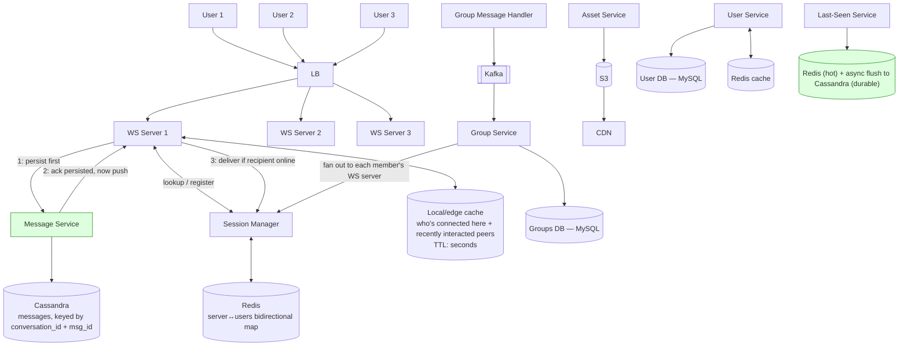

# WhatsApp / Real-Time Chat System Design

> Source: slide 3 of `System Design and Architecture.pptx` ("WhatsApp System Design"). The original diagram contained a real, explicitly-noted race condition — it is fixed below (§5), not just documented.

## 1. Requirements

**Functional**: 1:1 messaging, group messaging, message state (sent/delivered/read), last-seen, media (image/video) upload.

**Non-functional**: low latency, high availability, no message loss ("lag free"), massive horizontal scale (billions of messages/day).

## 2. High-Level Architecture

## 3. Why each component exists

| Component | Purpose | Why this tech |
|---|---|---|
| **WebSocket servers** | Hold a persistent, bidirectional connection per online client so the server can push messages without polling. | WebSocket over HTTP long-polling: lower per-message overhead, true server push, standard for chat. Servers are kept **stateless regarding message content** — they only route; message durability lives in Cassandra. |
| **Session Manager + Redis** | Maps `user → which WS server they're connected to` (and the inverse), so any WS server that receives a message for a user can find where to route it. | Redis: this is a small, latency-critical, high-churn key-value lookup (connect/disconnect on every app open/close) — exactly Redis's sweet spot. Not a candidate for a relational DB. |
| **Message Service + Cassandra** | Source of truth for message content and delivery state (sent/delivered/read). | Cassandra over a relational DB because: write-heavy (every message is a write, at global WhatsApp scale that's hundreds of thousands of writes/sec), naturally partitions by `conversation_id`, and doesn't need cross-row transactions or joins — a chat log is an append-mostly, partition-key-read workload, Cassandra's ideal case. |
| **Group Service + Kafka** | Group sends fan out to N members; doing that inline on the WS server (a low-latency, high-connection-count process) would let one big-group send blow up p99 latency for everyone else on that server. | Kafka decouples "someone sent a group message" from "deliver it to 500 members," and lets group fan-out scale independently (and be retried) without touching the hot WS path. |
| **Asset Service + S3 + CDN** | Media (images/video) is large; you don't send binary blobs through the messaging path. | Upload once to S3, send a *link* as the actual chat message, serve reads via CDN so repeat views (e.g., a photo forwarded to a group) don't re-hit S3/origin. Client-side content-hash dedup (mentioned in the source slide) avoids re-uploading a file that's already stored — correct and worth keeping. |
| **User Service + MySQL** | Account data — relational, low write volume, needs integrity. | Correct as-is. |
| **Last-Seen Service** | Extremely high write volume (every user, every few seconds while app is foregrounded), but each write only needs to overwrite the previous value — no history required. | See §5 — this is one of the two things the original design got wrong. |

## 4. WebSocket capacity: correcting a common interview myth

The source slide states *"each machine can have 64K ports, so 64K users can be connected to a single WS server."* **This is a widely repeated but incorrect simplification**, and an interviewer who has done this before *will* push back on it:

- The 65,536 (2¹⁶) limit is the size of the **16-bit TCP port number field**. It bounds the number of **distinct (localIP, localPort, remoteIP, remotePort) tuples for outbound/ephemeral connections from one IP**, not the number of inbound connections a listening server can accept.
- A server listening on a **single port** (e.g., 443) can accept many *different* client IPs each connecting to that same local `(serverIP:443)` — the tuple that must be unique is the *4-tuple*, and `remoteIP` varies per client. So one listening socket is not capped at 65K clients by port math at all.
- The real ceiling is **memory per connection** (TCP buffers + per-socket application state) and **file descriptor limits** (`ulimit -n`, plus OS-level connection tracking tuning).
- **Real-world data point**: WhatsApp famously tuned FreeBSD + Erlang to hold **~2–3 million concurrent connections on a single machine** ("1 million is so 2011," WhatsApp engineering blog). That is the number to cite in an interview, not 64K.

**Correct framing for capacity planning**: `max_connections_per_server ≈ available_RAM / per_connection_memory_footprint` (Erlang processes are famously cheap, ~a few KB each; a naive thread-per-connection server in a heavier runtime will hit far lower numbers, e.g., tens of thousands, which is where "64K-ish" folklore numbers actually come from — but it's a runtime/OS-tuning ceiling, not a TCP port-number ceiling).

## 5. The race condition in the original design — root cause and fix

The original slide's own notes describe this bug (kept verbatim as it's a great interview talking point):

> *U1 tries to send a message to U3 who is currently offline. Session manager says U3 isn't connected, so the message isn't delivered live. Meanwhile U3 connects and fetches pending messages from the Message Service — but gets nothing, because U1's message hasn't been written to Cassandra yet. Immediately after, U1's message is finally persisted. U3 has now missed it until the next fetch.*

The slide's own "fix" was **periodic polling** ("poll the server once in a while... in bulk"), which is a band-aid: it bounds the *maximum* delay before the bug self-heals, but doesn't remove the race and adds needless load/latency to every client, all the time.

**Root cause**: the design checks "is the recipient online?" *before* the message is durably persisted. There is a window between "checked session state" and "wrote to Cassandra" during which a reconnecting client can slip through.

**Fix — reorder to persist-before-route (applied in the diagram in §2, steps 1–3):**
1. WS server sends the incoming message to the **Message Service first**; it is written to Cassandra and acknowledged. This is the durability point — once acked, the message exists in the system of record no matter what happens next.
2. **Only after** the durable write is acknowledged does the WS server query the Session Manager and attempt live delivery.
3. Because step 1 always happens first, there is no window where "recipient just came online" can race ahead of "message exists in storage." A reconnecting client's bulk fetch-on-connect will always see the message, because it cannot connect-and-fetch *before* the message that was sent to it milliseconds earlier has been persisted — persistence now strictly precedes the delivery attempt, not the other way around.
4. Periodic polling can still be kept as a **liveness/self-healing safety net** for genuinely dropped pushes (e.g., a push got sent but the ack was lost on a flaky mobile network) — but it is no longer load-bearing for correctness, so its interval can be relaxed (minutes, not seconds), reducing load.

This is the standard "write-ahead, then notify" pattern used by essentially every reliable messaging system (it's also how Kafka-backed group messages in this same design already work — the fix simply applies the same discipline to the 1:1 path).

## 6. Handling scale & concurrency

- **WS servers are horizontally scaled and stateless w.r.t. message content** — a server dying only drops currently-connected users, who reconnect (via LB) to a different server and re-register with the Session Manager. No data is lost because messages live in Cassandra, not on the WS server.
- **Cassandra tunable consistency**: writes at `QUORUM`, reads at `ONE` is a common pattern for chat — favor write durability, accept slightly stale reads (acceptable since a client also gets live pushes).
- **Consistent hashing / rendezvous hashing** should route a given `conversation_id`'s frequent participants toward Session-Manager shards predictably to keep the Redis lookup cache-friendly at billions of lookups/day.
- **Group fan-out backpressure**: a group with 10,000 members must not let one send synchronously hit 10,000 WS servers inline — Kafka + a fan-out worker pool absorbs this, and large-group fan-out can be rate-limited separately from 1:1 messages so it never starves them.

## 7. Bugs / gaps found and fixed (summary)

1. **Race condition** causing missed messages on reconnect — fixed by persist-before-route ordering (§5), replacing the band-aid "poll to avoid races" with an actual fix; periodic polling demoted to a liveness safety net only.
2. **"64K connections per server" is factually wrong** — corrected with the real bottleneck (memory/FD limits) and a real benchmark (WhatsApp: ~2M/server) (§4).
3. **Last-Seen Service on Cassandra alone is over-engineered for the access pattern.** Last-seen is a single mutable field per user, overwritten every few seconds, read occasionally; it needs no history and no multi-writer durability semantics beyond "latest write wins." *Fix:* keep it hot in **Redis** (cheap, sub-ms writes at massive frequency) and asynchronously batch-flush to Cassandra/a durable store every N seconds/on logout, so a Redis restart doesn't lose more than a few seconds of freshness and you're not paying Cassandra write-durability cost for every single heartbeat.
4. **No explicit message-ordering/idempotency guarantee was stated.** Since delivery is inherently at-least-once (network retries, reconnect-and-poll can double-deliver), the client must dedup by `message_id` and order by a monotonically increasing `(conversation_id, sequence)` — added as an implicit requirement of the fixed design.

## 8. Capacity / bandwidth estimate (example numbers)

Assume 500M daily active users, 50 messages/user/day → **25B messages/day ≈ 289K messages/s average**, ~5x peak → **~1.4M msgs/s peak**.

- Average text message ≈ 150 bytes (payload + metadata). Peak write bandwidth into Cassandra ≈ 1.4M × 150B ≈ **~210 MB/s** — spread across a Cassandra ring of many nodes with the conversation_id as partition key, this is routine at this DB's design scale.
- WS fan-out bandwidth for *delivering* those messages is roughly the same order (each message pushed once per online recipient), so provision WS-server egress accordingly — this, not CPU, is usually the first thing to saturate a WS server's NIC.
- Storage: 25B messages/day × 150 bytes × 3x replication ≈ **~11 TB/day** raw before compression — this is why chat systems archive/compact old conversations and why Cassandra (which compresses well and scales storage horizontally) is the right pick over a single relational instance.
- Session Manager: 500M possible connections, each mapping entry ~50–100 bytes → **tens of GB** in Redis, easily shardable by `user_id` hash if a single Redis instance/cluster node isn't enough.

## 9. Real-world comparison (for extra interview credit)

Discord — a comparable high-write chat workload — started on Cassandra and, at *trillions* of stored messages, migrated to **ScyllaDB** (a Cassandra-API-compatible, C++, shard-per-core rewrite) because p99 read latency degraded (40–125ms on Cassandra vs ~15ms on ScyllaDB) and JVM garbage-collection pauses became a tail-latency problem at that scale. It's reasonable to say in an interview: *"Cassandra is the right starting point; at Discord/WhatsApp-scale, teams have moved to ScyllaDB for the same data model with lower tail latency and no GC pauses."* This shows awareness that the *initial* choice and the *at-extreme-scale* choice can differ, without claiming Cassandra was wrong.

## 10. Likely interviewer questions

- *"Walk me through what happens when U3 comes online right as U1 sends them a message — is there a race?"* → explain the original bug and the persist-before-route fix (§5). This is very likely to come up if the interviewer has seen this exact diagram pattern before.
- *"Why not just say a server holds 64K connections?"* → explain the port-tuple vs. listening-socket distinction and cite WhatsApp's ~2M/server (§4).
- *"Why Cassandra for messages but Redis for last-seen?"* → access-pattern argument: append-heavy + durable history vs. single-mutable-field + ephemeral freshness (§3, §7.3).
- *"How do you deliver a message to a 50,000-member group without melting a WS server?"* → Kafka-based async fan-out worker pool, isolated from the 1:1 hot path (§6).
- *"How do you handle a WS server crashing with 500K connections on it?"* → clients reconnect via LB to a healthy server and re-register with Session Manager; no message loss because Cassandra is the source of truth, not the WS server's memory.
