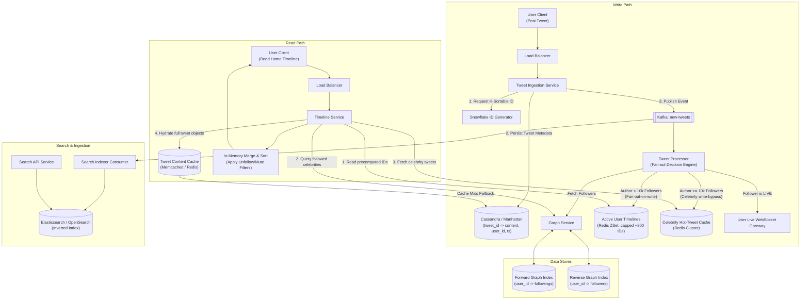

# Twitter / X Timeline System Design (Enhanced & Production-Ready)

> **Overview**: This document presents a robust, scalable system design for a Twitter/X-scale timeline system. It incorporates hybrid fan-out architecture, Twitter Snowflake ID generation, celebrity read-path hot-caching, dual-index graph storage, and cursor-based pagination to address high concurrency, write amplification, and thundering herd scenarios.

---

## 1. Motivation & Design Philosophy

Before enumerating requirements, it's worth understanding *why* this design looks the way it does.

### The Core Problem
A home timeline is fundamentally a **join**: for each user, gather the most recent tweets from everyone they follow and merge them into one chronological stream. That join is trivial at small scale and computationally hostile at Twitter/X scale, because:
- A single user may follow thousands of accounts.
- A single account may have hundreds of millions of followers.
- The read:write ratio is roughly **50:1** (~300K reads/sec vs. ~5,800 writes/sec, see §6.1) — whatever work happens on every *read* is repeated far more often than whatever happens on every *write*, so the two paths need very different cost models.

### Two Naive Extremes, and Why Both Fail

| Strategy | How it works | Where it breaks |
|---|---|---|
| **Pure Fan-Out-on-Read** (pull everything at read time) | On every timeline request, query all followed accounts' recent tweets live, then merge and sort. | At ~300K reads/sec, re-running that join on *every single request* — even for a user following 2,000 accounts — is prohibitively slow, and the same expensive computation is repeated many times a day for data that barely changed between requests. |
| **Pure Fan-Out-on-Write** (push everything at write time) | On every tweet, immediately write the `tweet_id` into every follower's precomputed timeline, so reads become a single cheap key lookup. | Breaks catastrophically for high-follower accounts: a celebrity with 50M followers turns *one* tweet into 50M writes. That write storm saturates the fan-out infrastructure and delays delivery for millions of users at once — a "thundering herd" on the write path. |

### The Resolution — Hybrid Fan-Out
**Push** is the right model for the common case: the overwhelming majority of accounts have small follower counts (§3), so pushing makes the 300K QPS read path a cheap O(1) lookup. **Pull** is the right model for the rare case: celebrities are few, but skipping the push for them caps a viral tweet's write cost at O(1) instead of O(followers) — the merge cost is deferred to read time, and only for the small population of users who follow at least one celebrity.

Every subsequent architectural decision in this document exists to make that hybrid split work at scale without introducing new bottlenecks of its own:
- The **Snowflake ID scheme** (§5.3) gives every timeline a free, storage-free sort order.
- The **dual forward/reverse graph index** (§5.7) answers "who do I follow" and "who follows me" without scanning a shared table from both directions.
- The **Hot-Tweet Cache** (§5.8) is what makes the celebrity read-path affordable instead of hammering the primary datastore.
- The **Timeline Service's merge step** (§5.9) is the one place that reassembles the two paths into a single coherent feed.

### Clarifying the Read Path in Practice
A few mechanics worth spelling out explicitly, since they're easy to miss from the component list alone:

**Does a client login / timeline read ever hit Cassandra?** Not in the common case. `TLSvc` reads the user's own timeline from `PushTL` (Redis), the followed celebrities' tweets from `HotCache` (Redis), and hydrates full tweet bodies from `TweetCache` (Redis/Memcached) — Cassandra (`TweetDB`) is touched only as a fallback, on a `TweetCache` miss for an individual tweet. The one case where a login *does* fall back to Cassandra wholesale is a **Passive** user (§3) whose `PushTL` entry was evicted after 7+ days of inactivity — the Timeline Service rebuilds the timeline from scratch via the Graph Service + `TweetDB`, then writes the result back into `PushTL` as a lazy "read-repair," before serving the response.

**Who populates `PushTL` and `HotCache`?** In steady state, the **Tweet Processor** (§5.6) does — it's the write side of fan-out, pushing into follower ZSets for regular accounts and writing once into `HotCache` for celebrities, driven by the `new-tweets` Kafka event. The one exception is the cold-start rebuild above, where the **Timeline Service** populates `PushTL` lazily on a read instead.

**What exactly is `PushTL`?** It's not an abstract "materialized timeline" — concretely, it's one Redis **Sorted Set (ZSET)** per user (e.g. key `timeline:{user_id}`), where the member is a `tweet_id` and the score is that same `tweet_id`. Because Snowflake IDs (§5.3) are k-sortable, the numeric ID doubles as chronological order, so no separate timestamp field is needed. Writes are `ZADD` (from the Tweet Processor) followed by a `ZREMRANGEBYRANK` trim to enforce the 800-entry cap; reads are a single `ZREVRANGE timeline:{user_id} 0 N` to fetch the N most recent IDs — an O(log N) operation, which is what keeps the read path cheap. It holds only `tweet_id` references, never full content (§5.10 handles hydration) and never celebrity tweets (those live in `HotCache` and are merged in at read time, §5.9).

---

## 2. Requirements & Core Principles

### Functional Requirements
- **Post Tweet**: Users can post new tweets (text + media references).
- **Retweet & Quote Tweet**: Users can retweet or quote existing tweets.
- **Follow / Unfollow**: Users can follow/unfollow other accounts.
- **Home Timeline**: Users can fetch a personalized chronologically ranked feed of tweets from accounts they follow.
- **Search**: Users can search tweets by text content in near-real-time.

### Non-Functional Requirements
- **High Availability & Low Latency**: Read operations (Home Timeline) must return in $< 100\text{ms}$ at 300K+ QPS.
- **High Scalability**: Support 150M+ Daily Active Users (DAU) and peak firehoses of 40K+ tweets/sec.
- **Eventual Consistency**: Brief delays ($< 1\text{-}2\text{ seconds}$) in timeline delivery are acceptable; system durability and write availability are paramount.

### Guiding Design Principle
> *"Whenever we design a read-heavy system, we should consider pre-computing and caching."*  
> — **Hybrid Fan-Out Strategy**: Use **Fan-Out-On-Write** for regular accounts to minimize read-time aggregation overhead, and **Fan-Out-On-Read** with **Hot-Tweet Caching** for high-follower accounts ("celebrities") to avoid write amplification and read-stampede bottlenecks.

---

## 3. User & Account Classification

| Class | Definition | Strategy & Handling |
|---|---|---|
| **Passive** | Rarely opens the app ($> 7\text{ days}$ inactive) | Skip pre-computation entirely. Timeline is generated on-demand at read time and evicted quickly from cache. |
| **Active** | Opens app regularly, follows standard accounts ($< 10\text{K}$ followers) | **Fan-Out-On-Write**: Upon tweeting, asynchronously push `tweet_id` into the Redis materialized timelines of all active followers. |
| **Live** | App currently open / active WebSocket | **Instant Push**: In addition to Redis timeline updates, deliver new tweet notifications directly via active WebSocket connections. |
| **Famous (Celebrity)** | High follower count ($\ge 10\text{K}$ followers) | **Fan-Out-On-Read**: Do **NOT** push to follower timelines. Store the tweet once in a **Celebrity Hot-Tweet Cache**. Merge into follower timelines dynamically at read time. |

---

## 4. Architecture Diagram



---

## 5. Deep-Dive Component Design

Each subsection below maps to one node (or tightly coupled group of nodes) in the architecture diagram, walking the write path, the read path, and search in the order data actually flows.

### 5.1 Client Entry & Load Balancing (`LB1` / `LB2`)
- **Purpose**: Decouple client traffic from any specific service instance; terminate TLS and route requests to a stateless service pool for both the write path (`LB1`) and read path (`LB2`).
- **Why two separate load balancers instead of one shared entry point**: write and read traffic have very different volumes and latency SLAs (~5,800/s vs. ~300,000/s, §6.1). Isolating them lets each path scale, deploy, and absorb a traffic spike independently — a surge of read traffic can't starve the write path of capacity, or vice versa.
- **Design**: L7 load balancers (e.g., Envoy / ALB) using least-connections or round-robin routing, with health checks that evict unhealthy instances automatically.

### 5.2 Tweet Ingestion Service (`TIS`)
- **Purpose**: The single stateless entry point for all write operations (post, retweet, quote). Owns the write request's lifecycle end-to-end: ID assignment, durable persistence, and event emission.
- **Why a dedicated service rather than writing to Cassandra and Kafka directly from the client**: centralizes validation (auth, rate limiting, spam/moderation hooks) and guarantees a strict ordering — request an ID, persist, *then* publish — so nothing downstream ever observes a tweet event before that tweet is durably stored. It also gives a single place to implement idempotency (via client-supplied request tokens) so retried requests don't create duplicate tweets.
- **Write sequence**: request a Snowflake ID → persist to `TweetDB` → publish to the `new-tweets` Kafka topic. The API only returns success once the Kafka publish is acknowledged, guaranteeing the fan-out pipeline will eventually process every tweet that was accepted.

### 5.3 ID Generation Engine (Twitter Snowflake) (`SF`)
Every tweet requires a unique, monotonically increasing (k-sortable) 64-bit ID.
- **Structure**:
  - `1 bit`: Unused (sign bit).
  - `41 bits`: Millisecond timestamp epoch (provides ~69 years of sequence).
  - `10 bits`: Worker/Machine ID (supports up to 1,024 cluster nodes).
  - `12 bits`: Sequence number (up to 4,096 IDs per millisecond per worker).
- **Key Advantage**: Timelines can be ordered chronologically directly by `tweet_id` without performing secondary sorting on timestamp fields or querying an external metadata layer. This is what makes cursor-based pagination (§7) possible without an extra lookup.

### 5.4 Primary Tweet Store (Cassandra / Manhattan) (`TweetDB`)
- **Access Pattern**: Read-heavy for hydration, ultra-high write volume. Keyed by `tweet_id`.
- **Storage Choice**: Distributed Wide-Column / NoSQL KV Store (Cassandra, HBase, or proprietary Manhattan). Chosen over a relational store because the access pattern is pure key-value (fetch by `tweet_id`) with no need for cross-row transactions, and wide-column stores scale write throughput horizontally by simply adding nodes.
- **Schema**:
  ```sql
  CREATE TABLE tweets (
      tweet_id bigint,
      user_id bigint,
      text text,
      media_ids list<uuid>,
      created_at timestamp,
      retweet_count counter,
      like_count counter,
      PRIMARY KEY (tweet_id)
  );
  ```

### 5.5 Event Bus (Kafka: `new-tweets`) (`KT`)
- **Purpose**: Decouples the synchronous write path (must respond to the user fast) from the asynchronous fan-out path (may be slow, bursty, and needs retries).
- **Why not fan out synchronously inside the Tweet Ingestion Service**: a celebrity tweet with 50M+ followers would block the API response for seconds or minutes if fan-out happened inline before returning to the client. Kafka absorbs that burst, lets the Tweet Processor consume at a sustainable rate, and provides replay semantics if a downstream consumer crashes mid-fan-out.
- **Partitioning**: Partitioned by `user_id` (the author) to preserve per-author event ordering while still allowing many Tweet Processor workers to consume in parallel across partitions.

### 5.6 Tweet Processor — Fan-out Decision Engine (`TP`)
- **Purpose**: Consumes `new-tweets` events and decides, per tweet, which fan-out strategy applies based on the author's classification (§3).
- **Decision Logic**:
  ```
  followers = GraphSvc.getFollowerCount(author_id)
  if followers >= CELEBRITY_THRESHOLD:
      write_once(HotCache, tweet_id)           # O(1) write
  else:
      for follower_id in GraphSvc.getFollowers(author_id):
          push(PushTL[follower_id], tweet_id)   # O(followers) writes
  if author.hasLiveFollowers():
      publish(LiveWS, tweet_id)
  ```
- **Why this branch, and not one fixed rule for everyone**: this is the component that actually implements the hybrid split motivated in §1 — pure fan-out-on-write is O(followers) per tweet (untenable for celebrities), pure fan-out-on-read is O(followings) per read (untenable at 300K QPS). Branching per-author keeps both the common case (small accounts) and the rare case (celebrities) on their respective cheap path.

### 5.7 Graph Service & Adjacency Storage (`GraphSvc`)
To avoid hot-shard bottlenecks, the Graph Service decouples relationship queries into two distinct index structures:
1. **Forward Graph (`user_id -> following_ids`)**:
   - Primary owner: Sharded by `user_id`.
   - Used by **Timeline Service** at read time: *"Which celebrities does User A follow?"*
2. **Reverse Graph (`user_id -> follower_ids`)**:
   - Primary owner: Sharded by `user_id`.
   - Used by **Tweet Processor** at write time: *"Who follows User B that needs fan-out?"*
- **Why maintain two separate indexes instead of one bidirectional table**: the write path and read path query in opposite directions (followers-of vs. following-of), and each is a hot path in its own right. A single shared table sharded one way would force one of the two access patterns into an expensive scatter-gather across shards; maintaining both directions as independently sharded indexes keeps each query a single-shard lookup, at the cost of writing follow/unfollow events to both indexes.

### 5.8 Hot-Tweet Cache & Thundering Herd Prevention (`HotCache`)
- **Celebrity Read Bottleneck**: If 50M active users follow a celebrity who tweets, naive read-path designs would query Cassandra 50M times.
- **Mitigation**: Celebrity tweets are cached in a dedicated multi-node **Celebrity Hot-Tweet Cache** (Redis/Memcached), populated once by the Tweet Processor (§5.6) instead of on first read — this avoids a cache-stampede where the first N simultaneous readers all miss and hammer `TweetDB` at once.
- **Read-Path Merge Flow** (detailed further in §5.9):
  1. Timeline Service fetches the user's fanned-out `tweet_ids` from their Redis ZSet.
  2. Queries Forward Graph to find followed celebrity accounts.
  3. Fetches recent tweets for those celebrities from the **Hot-Tweet Cache**.
  4. Merges, deduplicates, and sorts the combined array in memory in $O(N \log K)$ time.

### 5.9 Timeline Service & Read-Time Assembly (`TLSvc`)
- **Purpose**: The single read-path orchestrator; assembles a user's home timeline by combining precomputed (pushed) data with on-demand (pulled) celebrity data into one response.
- **Why this reconciliation is unavoidable**: because celebrity tweets are deliberately *not* pushed to `PushTL` (§5.6), the read path must reconstruct completeness by merging both sources at request time. This is the read-side cost the hybrid model deliberately accepts, in exchange for never letting a celebrity tweet trigger millions of writes.
- **Flow**: read `PushTL[user_id]` → look up followed celebrities via `ForwardGraph` → fetch their recent tweets from `HotCache` → hydrate full tweet objects (§5.10) → merge, sort, and filter (§5.11) → return to client.

### 5.10 Tweet Content Cache & Hydration (`TweetCache`)
- **Purpose**: `PushTL` and `HotCache` only store lightweight `tweet_id` references, not full tweet bodies, to keep those hot, high-fan-out structures small. The Tweet Content Cache resolves IDs into full tweet objects (text, media refs, counts) right before the response is returned to the client.
- **Why hydrate at read time instead of storing full tweet payloads inside each timeline**: storing the full tweet body redundantly in every follower's timeline would multiply storage cost by the average fan-out factor (~200x, §6.1). A single shared content cache keyed by `tweet_id` means each tweet's body is cached exactly once, no matter how many timelines reference it.
- **Cache-aside pattern**: on a cache miss, fall back to `TweetDB` and repopulate the cache.

### 5.11 In-Memory Merge, Sort & Filter (`Merge`)
- **Purpose**: The final step of the read path — combines the pushed timeline IDs and pulled celebrity IDs into one deduplicated, chronologically sorted list, then applies user-specific filters (unfollowed/blocked/muted accounts, §7) before returning results.
- **Why this stays in-memory at the Timeline Service** rather than being precomputed and stored: the inputs (two ID lists) are already small (capped at 800 IDs, §6.2) by the time they reach this step, so an $O(N \log K)$ in-memory merge is cheap — cheaper than maintaining a third, fully-merged materialized structure that would need to be kept in sync with unfollow/mute state.

### 5.12 Live WebSocket Gateway (`LiveWS`)
- **Purpose**: Bypasses the poll-based Redis timeline entirely for users with an open app session, pushing new tweets to them in real time instead of waiting for their next timeline fetch.
- **Why this exists alongside the Redis push model**: fanning a `tweet_id` out to `PushTL` optimizes the *next* read, not immediate delivery — a user actively looking at their feed shouldn't need to refresh to see a new tweet appear. The gateway maintains a registry of `user_id -> active connection` and is fed directly by the Tweet Processor for any follower who is currently online (§3, "Live" classification).

### 5.13 Search Indexing Pipeline (`SearchIndexer` / `ES` / `SearchApp`)
- **Purpose**: Serves the "search tweets by text" functional requirement (§2), which the timeline data structures (ID-ordered lists) cannot answer — full-text search needs an inverted index, not a chronological list.
- **Why a separate consumer off the same Kafka topic**, rather than writing to Elasticsearch directly from the Tweet Ingestion Service: it keeps search-indexing latency and failures fully isolated from the write-path SLA. Search can lag by a few seconds without affecting tweet durability or timeline delivery, and a spike in indexing load never threatens the ingestion path's response time.
- **Flow**: `SearchIndexer` consumes `new-tweets` → tokenizes and writes into Elasticsearch/OpenSearch → `Search API Service` queries the inverted index completely independently of the timeline read path.

### 5.14 Media Handling & Uploads
- Media (images, videos) **never** pass through the primary Tweet Ingestion Service.
- **Why bypass `TIS` for media**: binary payloads are large and slow relative to a tweet's text metadata; routing them through the same service that owns ID generation and the write-path SLA would tie timeline-critical latency to unrelated upload/storage latency.
- **Workflow**:
  1. Client requests a pre-signed upload URL from a Media Service.
  2. Client uploads binary payload directly to Object Storage (S3 / Cloudflare R2).
  3. Object Storage returns a `media_id` / static URL.
  4. Client passes `media_id` metadata inside the tweet creation request payload.

---

## 6. Capacity Estimation & Memory Math

### 6.1 Volume & Throughput
- **Daily Active Users (DAU)**: 150 Million.
- **Average Read QPS**: ~300,000 QPS.
- **Average Tweets Published**: ~500 Million / day ($\approx 5,800$ tweets/sec average; peak event firehose $\approx 44,000$ tweets/sec).
- **Fan-Out Write Amplification**: Average 200 followers per non-celebrity user.  
  $$5,800 \text{ tweets/sec} \times 200 \text{ followers} \approx 1.16 \text{ Million Redis writes/sec}$$

### 6.2 Redis Materialized Timeline Memory Footprint
- **Cap Size**: 800 `tweet_ids` per active user.
- **Size per Tweet Entry**: `tweet_id` (8 bytes) + Redis ZSet node metadata overhead $\approx 16 \text{ bytes}$.
- **Storage per User**: $800 \times 16 \text{ bytes} \approx 12.8 \text{ KB}$.
- **Active User Cache Footprint (100M active timeline cache)**:
  $$100\text{M users} \times 12.8 \text{ KB} \approx 1.28 \text{ TB RAM}$$
- **Eviction Policy**: Users inactive for $> 7\text{ days}$ have their timeline dropped from Redis (LRU). Rebuilt on-demand upon next login.

---

## 7. Interviewer Edge Cases & Strategy Cheat-Sheet

| Scenario / Edge Case | Production Strategy |
|---|---|
| **Unfollows & Block List** | Do **not** synchronously purge historical tweets from the 800-item Redis timeline upon unfollow/block. Filter out unfollowed/blocked author IDs during the Timeline Service in-memory merge step against a lightweight user `unfollow_set`. |
| **Pagination Strategy** | Use **Cursor-based Pagination** via `Snowflake ID` (`GET /timeline?max_id=1740928104812`). Never use `LIMIT/OFFSET`, which causes duplicate/skipped items when new tweets arrive. |
| **Retweets & Quote Tweets** | A Retweet is a lightweight pointer containing (`tweet_id`, `original_tweet_id`, `user_id`). Processed through the identical hybrid fan-out pipeline as standard tweets. |
| **Redis Node Failure** | Timelines are ephemeral caches. If a Redis node fails, rebuild affected user timelines on the fly by querying the Graph Service for followings and pulling recent tweets from `TweetDB` ($< 50\text{ms}$ degradation). |
| **Celebrity Threshold Dynamic Adjustment** | The $\ge 10\text{K}$ threshold is a dynamic variable evaluated periodically by an asynchronous batch job. Highly active accounts near the boundary transition smoothly between write-fanout and read-merge pipelines. |
