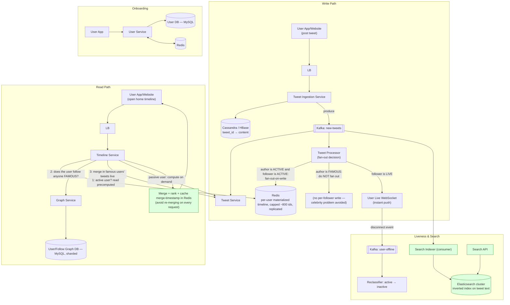

# Twitter / X Timeline System Design

> Source: slide 4 of `System Design and Architecture.pptx` ("Twitter System Design"). The original design's core idea — treat users differently by follower-count class and hybrid-fanout the timeline — is directionally correct and matches how Twitter/X actually built this. Gaps (search, capacity numbers, terminology) are called out and filled in below.

## 1. Requirements

**Functional**: tweet, re-tweet, follow, search.

**Non-functional**: read-heavy (home timeline must render fast for millions of daily reads), fast tweet write, scale to hundreds of millions of users.

**Key design insight carried over from the source material**: *"Whenever we design a read-heavy system, we should consider pre-computing and caching."* This single sentence is the reason the whole architecture below exists — it's worth saying explicitly to an interviewer as your guiding principle before you draw a single box.

## 2. User classification (from the original design, kept — it's the crux of the whole problem)

| Class | Definition | Why it needs special handling |
|---|---|---|
| **Passive** | Rarely opens the app | Don't pre-compute their timeline — wasted work; compute on-demand at read time. |
| **Active** | Opens frequently, follows normal (non-famous) accounts | Pre-compute (fan-out-on-write) — cheap because their follow-graph is small. |
| **Live** | Currently has an open WebSocket / app in foreground | Track via a lightweight liveness signal (see §7 correction). |
| **Famous** | Millions of followers | Fan-out-on-write here would mean **one tweet → tens of millions of writes** — this is the industry-famous **"celebrity problem."** Must use fan-out-on-read/merge instead. |
| **Inactive** | Dormant/churned | Skip pre-computation entirely. |

This maps directly onto the real, publicly documented approach used at Twitter/X: **hybrid fan-out** — fan-out-on-write for regular accounts (< ~10K followers is a commonly cited threshold), fan-out-on-read (merge at request time) for celebrity accounts, precisely to avoid a single celebrity tweet generating tens of millions of synchronous writes.

## 3. High-Level Architecture

## 4. Why each component exists

| Component | Purpose | Why this tech |
|---|---|---|
| **Tweet Ingestion Service + Cassandra/HBase** | Durable store of tweet content, keyed by `tweet_id`. | Write-heavy, no joins needed to read a tweet by id, natural horizontal partitioning by id — same reasoning as the chat message store in the WhatsApp design. Real Twitter built a custom system for this (**Manhattan**, a sharded distributed KV store) for the same access-pattern reasons; Cassandra/HBase is the right *off-the-shelf* analogue to cite. |
| **Kafka (new-tweets)** | Decouples "a tweet was written" from "who needs to know about it" — the Tweet Processor, the search indexer, and the live-push path all consume the same event independently. | Same argument as the notification design: multiple independent consumer groups over one durable stream. |
| **Tweet Processor** | The fan-out *decision* engine — this is where the celebrity problem is solved by *not* writing to Redis for famous authors. | Business logic, not a DB — kept as a dedicated service so the fan-out policy (thresholds, exceptions) can change without touching ingestion. |
| **Redis (materialized timeline)** | Pre-computed "list of tweet ids to show" per active user — turns an expensive multi-source read into an O(1) list fetch. | Redis List/Sorted-Set, capped at a fixed size (e.g. ~800 entries — nobody scrolls further than that in one session) so memory is bounded regardless of how many people a user follows; replicated (e.g., 3x) so a single node loss doesn't blank out live users' timelines. |
| **Graph Service + sharded MySQL** | Follow relationships (`userId, followerId, timestamp`). Read-mostly, huge dataset. | Relational is fine for the schema, but the *volume* forces sharding (by `userId` hash) — the original slide correctly flags this ("doesn't update frequently but contains a lot of data, so consider sharding"). |
| **Timeline Service** | Assembles the final home timeline: precomputed feed (active users) **merged with** any famous-followee's tweets fetched live, cached with a "last merged at" timestamp in Redis so repeated requests within the same window don't redo the merge. | This merge step *is* the fan-out-on-read half of the hybrid strategy — necessary because famous users were deliberately excluded from fan-out-on-write. |
| **Search Indexer + Elasticsearch** | **Missing from the original diagram entirely**, despite "search" being a stated functional requirement. | Kafka already carries every new tweet — a consumer that writes into an inverted-index store (Elasticsearch/OpenSearch) is the standard way to get near-real-time full-text tweet search without touching the write-path latency of the primary store. |

## 5. Handling scale & concurrency

- **Write path never blocks on fan-out.** Ingestion durably stores the tweet and returns; fan-out happens asynchronously off Kafka. A user who tweets never waits for millions of follower-timeline writes.
- **The celebrity threshold is a tunable, not a hard line.** In practice this is graded (e.g., >10K followers skip write-fanout), and re-evaluated periodically as an account's follower count changes — not a one-time classification.
- **Redis timeline cap bounds memory deterministically**: `max_memory ≈ num_active_users × 800 × sizeof(tweet_id)`, independent of how many people each user follows — critical, because without a cap a single very-followed active user (contradiction in terms, but: an active user who follows 10,000 accounts) could otherwise blow up their own timeline list size.
- **Graph DB sharding** by `userId` keeps "who does X follow" and "who follows X" queries local to a shard; a global secondary index (or a separate inverse-adjacency table) is needed for the reverse lookup ("who follows this famous user," used by nobody at write time now, but needed by the merge step... actually the merge step only needs "does *this reader* follow *this famous author*," which is the *forward* edge and stays shard-local — worth stating explicitly in an interview since it's a subtle but important reason the celebrity-avoidance strategy doesn't reintroduce a hot shard).
- **Consumer-group parallelism** on the Kafka `new-tweets` topic lets the Tweet Processor, Search Indexer, and any future consumer (e.g., trending-topics aggregator) scale independently of each other and of ingestion throughput.

## 6. Bugs / gaps in the original slide and fixes applied

1. **Search — a stated functional requirement — had no component in the diagram at all.** *Fix:* added a Kafka-driven Elasticsearch indexer + Search API (§3, §4).
2. **Terminology was informal** ("pre-computation," "route for active users only") without naming the actual industry pattern. *Fix:* explicitly named **fan-out-on-write / fan-out-on-read / hybrid fan-out** and the **celebrity problem**, which is what an interviewer will expect you to say verbatim.
3. **Live-status tracking via a dedicated WebSocket is expensive for a signal that's really just "is this user active right now."** A full bidirectional socket is justified if you're also using it to *push* tweets to live users (which the design does — reasonable), but if push weren't needed, a lightweight heartbeat/ping (as used for "last-seen" in the WhatsApp design) would be far cheaper than holding a WS connection per live user purely for classification. *Fix noted as a trade-off*, not changed, since this design does reuse the socket for live delivery too (§3, Liveness section) — worth explicitly justifying this in an interview rather than leaving it implicit.
4. **No re-merge caching detail was in the original** ("we can store the timestamp... in Redis in order not to perform this computation again" was mentioned only for the famous-user branch). *Fix:* generalized this into the Timeline Service's merge step for consistency.

## 7. Capacity / bandwidth estimate (grounded in Twitter's own publicly cited numbers)

Twitter has publicly discussed operating at roughly **150M daily active users, ~300K read QPS, and a ~22 MB/s tweet "firehose"** at scale (HighScalability's writeup of Twitter's architecture). Use these as anchor numbers:

- **Write side**: even at a generous 1% of DAU tweeting per day, that's ~1.5M tweets/day (~17/s average, bursty around events — spikes are the real design driver, not the average). Each tweet write triggers **zero** to **tens of thousands** of Redis fan-out writes depending on author class — this variance is exactly why the celebrity threshold exists; without it, tail-case write amplification would dwarf the average by orders of magnitude.
- **Read side**: 300K QPS reading a Redis list capped at 800 ids is a solved caching problem — this is *why* the architecture leans so heavily on precomputation; hitting the tweet-content store or graph DB for every timeline read at this QPS would not be viable.
- **Fan-out write amplification** (regular user, avg 200 followers, tweets once/day): 1.5M tweets/day × 200 ≈ 300M Redis writes/day ≈ 3,500 writes/s average — cheap for Redis, and this number is *exactly* what stays bounded by excluding celebrities.
- **Bandwidth**: tweet payload ≈ 280 chars + metadata ≈ 500 bytes. At the cited ~22 MB/s firehose, that's roughly 44K tweets/s at absolute peak-of-peak (e.g., major global live events) — Kafka partition count for `new-tweets` should be sized against this peak, not the daily average, using the standard `partitions ≥ peak_throughput / safe_per_partition_throughput` formula (e.g., peak 44K tweets/s × 500B ≈ 22 MB/s ÷ ~10–50 MB/s safe per-partition constant ⇒ a handful to a few dozen partitions is plenty; the real constraint in practice is usually consumer parallelism headroom, so provision generously, e.g. 50+ partitions, to allow the Tweet Processor and Search Indexer consumer groups to scale independently without a repartition).

## 8. Likely interviewer questions

- *"A user has 100M followers and tweets. Walk me through what happens."* → **not** fanned out to Redis; stored once; readers who follow this account get it merged in live at read time by the Timeline Service via the Graph Service check (§3, §6.2) — this is the answer that shows you understand the celebrity problem.
- *"How do you keep the merge step from being expensive if it runs on every single read?"* → cache the last-merged timestamp/result per user in Redis, short TTL, so repeated requests in a burst reuse it (§4, §6.4).
- *"Why not just fan out to everyone, always?"* → write amplification math in §7 — a celebrity's fan-out would dominate total system write volume by orders of magnitude.
- *"Where does search fit in?"* → Kafka-driven async indexer into Elasticsearch, decoupled from the write-path latency of posting a tweet (§4) — flag that this was a gap in the original design you're expected to have noticed.
- *"How would you reduce the 800-tweet Redis cap's memory footprint further at 10x users?"* → shard Redis by `userId` hash, and/or lower the cap for users who are provably inactive/passive (they don't need a warm precomputed timeline at all — compute on read instead, per the original classification).
