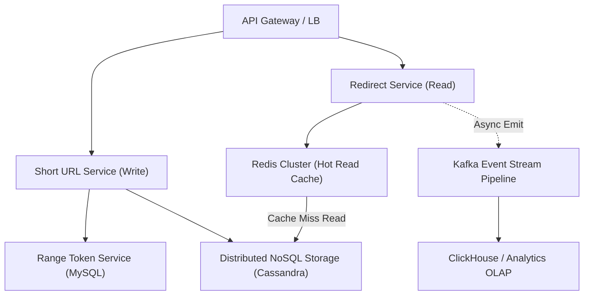

# TinyURL / URL Shortener System Design & Interview Architecture Guide

> **Production System Design & Technical Interview Deep-Dive**  
> *Target Architecture: High-Throughput (100K+ QPS), Low-Latency (<10ms), Globally Distributed URL Shortening & Redirect Service*

---

## Executive Summary & System Requirements

A high-scale URL shortener must handle two fundamentally asymmetric access patterns: a relatively low-frequency write path (URL shortening) and a massive, high-throughput read path (URL redirection). To excel in a technical interview, the architecture must demonstrate clear separation of concerns, concrete capacity planning, robust ID generation strategy, explicit caching/redirect semantics, and async analytics streaming.

### 1. Functional Requirements
* **Core Shortening**: Convert any valid long URL into a unique, compact base-62 short link.
* **Redirection**: Seamlessly redirect incoming short URL requests to the corresponding long URL with low latency (<10ms p99 for cached reads).
* **Custom Aliases**: Allow users to specify custom short links (e.g., `tiny.url/my-custom-link`), subject to availability and strict validation.
* **Expiration / TTL**: Support optional, configurable expiration times per URL, alongside default system TTLs.
* **Analytics**: Track aggregate and real-time click metrics (click count, geographical distribution, HTTP referrers, device/user-agent specs) without delaying the redirection latency path.

### 2. Non-Functional Requirements
* **High Availability & Fault Tolerance**: $99.999\%$ availability for reads (Redirect path must virtually never fail).
* **Massive Read-Heavy Asymmetry**: Read-to-write ratio is estimated at $100:1$ to $1000:1$.
* **Low Latency**: Redirect lookup must take $<10\text{ ms}$ (p99). Shortening can take $<100\text{ ms}$.
* **Uniqueness & Non-Predictability**: Guaranteed zero key collisions. Short codes should not be easily enumerable to prevent malicious scraping/harvesting of sensitive target URLs.
* **Durability**: Retention guarantee for active links up to 10 years (capable of scaling to hundreds of billions of records).

---

## 2. Quantitative Capacity Planning & Estimation

Understanding the mathematical constraints allows us to size the database, cache memory, network egress, and choose the optimal short-code encoding strategy.

### 2.1 Core Mathematical Derivation
Assuming a baseline write traffic of **1,000 new short URLs created per second** ($1\text{k RPS}$) and a retention window of **10 years**:

$$\text{Total URLs stored } (Y) = 1,000 \text{ ops/sec} \times 60 \text{ sec/min} \times 60 \text{ min/hr} \times 24 \text{ hrs/day} \times 365.25 \text{ days/yr} \times 10 \text{ yrs}$$

$$Y = 1,000 \times 315,576,000 = 3.15576 \times 10^{11} \approx 315.6 \text{ billion URLs}$$

#### Character Set & Encoding Length
We utilize a Base62 alphabet containing `[a-z]`, `[A-Z]`, `[0-9]` ($26 + 26 + 10 = 62$ distinct alphanumeric characters).

To support $3.156 \times 10^{11}$ unique keys, we calculate the required string length $L$:

$$62^L \ge Y$$
$$L = \lceil \log_{62}(3.15576 \times 10^{11}) 
\rceil = \lceil 6.42 
\rceil = 7 \text{ characters}$$

* **Total 7-character capacity**: $62^7 = 3,521,614,606,208 \approx 3.52 \text{ trillion URLs}$.
* **Capacity Margin**: 7 characters provide $> 11\times$ the required capacity for 10 years at 1,000 creates/sec, accommodating unexpected traffic spikes.

---

### 2.2 Storage, Memory, & Bandwidth Projections

#### Record Schema Sizing
| Field | Data Type | Bytes |
| :--- | :--- | :--- |
| `short_code` | `VARCHAR(7)` / Primary Key | 7 B |
| `long_url` | `VARCHAR(2048)` (avg ~100 B) | 100 B |
| `owner_id` | `UUID` / `BIGINT` | 16 B |
| `created_at` | `TIMESTAMP` (8 B) | 8 B |
| `expires_at` | `TIMESTAMP` (8 B, nullable) | 8 B |
| `is_custom` | `BOOLEAN` | 1 B |
| **Total Record Size** | | **~140 Bytes** |

#### Storage Sizing
* **Raw Database Storage (10 Years)**:  
  $$315.6 \text{ billion records} \times 140 \text{ bytes/record} \approx 44.18 \text{ TB}$$
* **Replication Factor (RF = 3)**:  
  $$44.18 \text{ TB} \times 3 \approx 132.54 \text{ TB}$$

#### Throughput & Bandwidth Sizing
* **Write Path**: $1,000 \text{ writes/sec} \times 140 \text{ bytes} \approx 140 \text{ KB/sec}$ ingress (Ingress bandwidth is negligible; write *throughput* capability is the true system constraint).
* **Read Path (100:1 Ratio)**:  
  $$\text{Read QPS} = 1,000 \text{ writes/sec} \times 100 = 100,000 \text{ redirects/sec (Peak: 200k QPS)}$$
* **Egress Bandwidth**:  
  $$\text{HTTP 302 Response Size} \approx 300 \text{ bytes (Headers + Location)}$$
  $$\text{Egress Bandwidth} = 100,000 \text{ QPS} \times 300 \text{ bytes} = 30 \text{ MB/sec} \ (240 \text{ Mbps})$$

#### In-Memory Caching Sizing (Pareto Principle: 80/20 Rule)
Assuming $20\%$ of hot URLs generate $80\%$ of daily redirect traffic:
* **Daily Redirect Volume**: $100,000 \text{ QPS} \times 86,400 \text{ sec/day} = 8.64 \text{ billion requests/day}$.
* **Unique Daily URLs Visited**: $\approx 20\% \times 8.64 \text{ billion} = 1.728 \text{ billion unique daily URLs}$.
* **Hot Set Cache Storage**:  
  $$\text{Cache Memory} = 20\% \times 1.728 \text{ billion URLs} \times 140 \text{ bytes} \approx 48.38 \text{ GB}$$
* *Result*: A small cluster of Redis instances (e.g., 3 nodes of 32 GB RAM each with replication) easily holds the hot set in memory, achieving $>95\%$ cache hit ratios.

---

## 3. High-Level & Detailed Architecture



### Component Design & Responsibility Matrix

| Component | Architecture & Tech Stack | Core Responsibility & Rationale |
| :--- | :--- | :--- |
| **API Gateway / Load Balancer** | NGINX / Envoy / HAProxy | Handles TLS termination, geo-routing, rate limiting, and distributes traffic between Read and Write services. |
| **Short URL Service (Write)** | Go / Java (Stateless horizontal cluster) | Mints base-62 codes from allocated ID ranges, enforces validation/custom alias rules, updates Cassandra, and populates Redis cache. |
| **Redirect Service (Read)** | Go / Rust (Stateless, high-concurrency) | Hot-path service optimized for sub-10ms response times. Serves HTTP 302/301 redirects directly from Redis or performs read-through to Cassandra. |
| **Range Token Service** | MySQL / PostgreSQL (HA Pair, single-threaded coordinator) | Dispenses discrete numerical ranges (e.g., `1,000,001` to `2,000,000`) to Short URL Service nodes on startup or range exhaustion. |
| **System of Record (Storage)** | Apache Cassandra / AWS Keyspaces | Partitioned NoSQL key-value store (`PK: short_code`). Provides linear horizontal write scalability, high write throughput, and built-in row TTL support. |
| **In-Memory Cache** | Redis Enterprise Cluster | Cache-aside and write-through cache holding active `short_code -> long_url` mappings to shield Cassandra from 100k+ read QPS. |
| **Analytics Pipeline** | Apache Kafka -> ClickHouse / Snowflake | Asynchronous event streaming to capture metadata (timestamp, geo, IP, User-Agent) without blocking hot redirect response paths. |

---

## 4. Deep-Dive Strategy Evaluation: Globally Unique ID Generation

Generating globally unique 64-bit integer IDs without lock contention or cross-node synchronization is the fundamental distributed systems challenge of this design.

```
                           ID GENERATION STRATEGY COMPARISON

  [ Flickr Ticket Servers ]         [ Twitter Snowflake ]          [ Range-Based Token Service ]
  +-----------------------+     +---------------------------+     +---------------------------+
  |  Central DB Cluster   |     |   Local Node Computation  |     |  Central Range Allocator  |
  |  Auto-increment step  |     |  41-bit TS | Node | Seq   |     |  Hands out chunks of IDs  |
  +-----------+-----------+     +-------------+-------------+     +-------------+-------------+
              |                               |                               |
              v                               v                               v
    Synchronous DB RPC             Zero Coordination             Zero In-Flight Overhead
   (High contention risk)        (Clock Drift Sensitivity)       (Fault-tolerant range buffer)
```

### Strategy A: Flickr-Style Ticket Servers
* **Mechanism**: Dedicated MySQL instances using `REPLACE INTO` and `LAST_INSERT_ID()` with modulo increments (e.g., Server 1 issues even IDs `2, 4, 6...`, Server 2 issues odd IDs `1, 3, 5...`).
* **Pros**: Simple, monotonic, guaranteed uniqueness.
* **Cons**: Synchronous network round-trip on *every single shortening request*. High database lock contention under load; prone to failure if $N-1$ servers go down during partition splits.

### Strategy B: Twitter Snowflake
* **Mechanism**: 64-bit self-contained integer generation split into:
  * `1 bit`: Unused (Sign bit).
  * `41 bits`: Epoch Timestamp (milliseconds elapsed since custom epoch, providing ~69 years).
  * `10 bits`: Datacenter / Worker Machine ID (supports 1,024 worker nodes).
  * `12 bits`: Sequence Number (supports 4,096 unique IDs per millisecond per worker).
* **Pros**: Zero cross-node communication; k-sortable by creation time; high throughput (up to 4.096 million IDs/sec/node).
* **Cons**: Highly sensitive to System Clock Drift (NTP synchronization issues can halt generation or cause duplicate IDs if fallback isn't configured properly). Base62 encoded string length varies over time.

### Strategy C: Range-Based Token Service (Recommended Architecture)
* **Mechanism**: A centralized, lightweight Token Service manages token ranges stored in a relational database table:

```sql
CREATE TABLE id_ranges (
    service_id VARCHAR(64) PRIMARY KEY,
    current_max_id BIGINT NOT NULL,
    step_size BIGINT NOT NULL DEFAULT 1000000
);
```

1. On startup or when its local buffer is depleted, a **Short URL Service instance** requests a range from the Token Service.
2. The Token Service executes an atomic transaction:
   ```sql
   UPDATE id_ranges 
   SET current_max_id = current_max_id + step_size 
   WHERE service_id = 'tinyurl_global';
   ```
3. The instance receives a range (e.g., `[5,000,001 to 6,000,000]`) and stores it in local memory (`AtomicLong`).
4. The instance mints $1,000,000$ unique IDs sequentially in memory with **zero network RPCs** during user shortening requests.

#### Comparative Decision Matrix
| Evaluation Metric | Flickr Ticket Server | Twitter Snowflake | Range-Based Token Service |
| :--- | :--- | :--- | :--- |
| **Network Overhead** | High (1 RPC per creation) | Zero | Extremely Low (1 RPC per 1M creates) |
| **Coordination Bottleneck**| Centralized DB bound | None | Centralized bound ONLY on range refresh |
| **Clock Dependence** | None | Critical (NTP sensitive) | None |
| **ID Space Efficiency** | $100\%$ dense | Sparse (Time-gap waste) | $99.9\%+$ dense (minimal loss on restart) |
| **Complexity** | Low | Medium | Low |
| **Recommendation** | Not Recommended | Alternative for Multi-Region | **PRIMARY RECOMMENDATION** |

---

## 5. Architectural Deep-Dives for Interview Success

### 5.1 HTTP Redirect Semantics: 301 vs. 302 vs. 307 vs. 308

An interviewer will explicitly test your understanding of HTTP redirection standards and caching impacts.

```
                  HTTP REDIRECT SEMANTICS & ANALYTICS TRADE-OFF

 [ User Request ] ----> ( GET /aB7x9 )
                            |
                            +---> [ 301 Permanent Redirect ]
                            |     * Browser caches mapping locally forever / long TTL.
                            |     * Subsequent clicks BYPASS Redirect Service completely.
                            |     * Result: Minimal server load, ZERO click analytics.
                            |
                            +---> [ 302 / 307 Temporary Redirect ]
                                  * Browser MUST request /aB7x9 from Redirect Service every time.
                                  * Redirect Service logs click event to Kafka pipeline.
                                  * Result: Perfect analytics tracking, slight network load increase.
```

* **301 Moved Permanently**:
  * The browser and edge CDNs aggressively cache the response `Location` header.
  * *Advantage*: Reduces load on your infrastructure down to 0 for returning users.
  * *Disadvantage*: **Destroys Click Analytics**. You cannot track repeat clicks from the same client. Additionally, if the long URL is updated or revoked, cached clients will continue navigating to the old target.
* **302 Found (Temporary Redirect)**:
  * Forces the browser to send every single request back to the Redirect Service server.
  * *Advantage*: Guarantees $100\%$ accuracy for click analytics, referrer tracking, and immediate revocation/expiration enforcement.
  * *Disadvantage*: Slightly higher server ingress/egress and processing load.
* **307 Temporary Redirect**:
  * Prevents the HTTP Method from changing (e.g., preserving `POST` requests).
* **Recommendation**: Use **HTTP 302 Found** by default. Reserve HTTP 301 strictly for enterprise customers explicitly requesting static links who do not require real-time telemetry.

---

### 5.2 Data Storage Layer: Cassandra vs. Relational vs. Document DB

#### Apache Cassandra Table Schema
```sql
CREATE KEYSPACE tinyurl WITH replication = {
    'class': 'NetworkTopologyStrategy', 
    'us-east-1': 3, 
    'eu-central-1': 3
};

CREATE TABLE tinyurl.url_mappings (
    short_code text,
    long_url text,
    owner_id uuid,
    created_at timestamp,
    expires_at timestamp,
    is_custom boolean,
    PRIMARY KEY (short_code)
) WITH comment = 'Primary key-value lookups for URL redirection';
```

#### Why Cassandra is Superior to Relational DBs for this Workload:
1. **Key-Value Lookup Pattern**: The operational query pattern is strictly single-key lookups (`WHERE short_code = ?`). No relational joins or complex ACID transactions across multiple tables are required.
2. **Linear Horizontal Scalability**: Cassandra nodes can be added seamlessly with zero downtime. Writes are append-only to CommitLogs and Memtables (SSTables), providing massive write throughput.
3. **Native Row Expiry (TTL)**: Cassandra natively supports setting per-cell or per-row TTLs (`INSERT INTO ... USING TTL 86400`). Deletion is handled automatically during compaction without expensive SQL sweep queries.

---

### 5.3 Custom Aliases & Concurrency Race Conditions

When a user requests a custom alias (e.g., `tiny.url/tech-conference-2026`), the system cannot use sequential ID ranges.

#### The Race Condition Problem
Two users attempt to claim the exact same custom alias `tech-conference-2026` simultaneously across two different Application Service instances.

```
User A --(Request: 'tech-conf')--> Service Node 1 --+
                                                    |---> [ Concurrent Insert Race ]
User B --(Request: 'tech-conf')--> Service Node 2 --+
```

#### The Solution: Lightweight Transactions (LWT) / Atomic Conditional Writes
In Cassandra, we execute an atomic `INSERT ... IF NOT EXISTS` query powered by Paxos consensus behind the scenes:

```sql
INSERT INTO tinyurl.url_mappings (short_code, long_url, owner_id, created_at)
VALUES ('tech-conference-2026', 'https://example.com/events/2026', e7b...3f, toTimestamp(now()))
IF NOT EXISTS;
```

* **Execution Flow**:
  1. The Cassandra coordinator uses Paxos to achieve consensus across replica nodes for the key `'tech-conference-2026'`.
  2. If the key exists, the database returns `[applied]: False`, and the system prompts the user with an *"Alias unavailable"* error.
  3. If successful, `[applied]: True` is returned, and the custom mapping is immediately written to Redis and Cassandra.

---

### 5.4 Cache Invalidation, Eviction, & Warm-Up Protocols

To maintain sub-10ms redirect responses under 100,000 QPS:

* **Caching Strategy**: Cache-Aside with Write-Through Hybrid.
  * **On Creation**: When a URL is shortened, write it immediately to Cassandra, then proactively populate Redis (`SET short_code long_url EX <TTL>`).
  * **On Read**: Check Redis first. On cache miss, read from Cassandra, populate Redis, and return the HTTP 302.
* **Cache Eviction Policy**: **LRU (Least Recently Used)** with volatile TTL.
  * Unused URLs naturally drop out of memory, preserving space for high-traffic "viral" URLs.
* **Preventing Cache Stampede (Dog-piling)**:
  * If a viral short link expires from the cache, thousands of concurrent requests might simultaneously hit Cassandra.
  * *Fix*: Implement **Distributed Locking (Redlock)** or **Singleflight Mutex** at the service layer to ensure only ONE instance queries Cassandra on cache miss while other requests wait for the cache to re-warm.

---

### 5.5 Analytics Pipeline (Asynchronous Event Streaming)

Analytics logging MUST NOT block the hot redirect path.

```
                         ASYNC ANALYTICS PIPELINE ARCHITECTURE

 [ Client Request ] ---> [ Redirect Service ] ---(HTTP 302)---> [ Client Browser ]
                               |
                   (Non-blocking Async Emit)
                               |
                               v
                     [ Kafka Topic: 'click-events' ]
                               |
                +--------------+--------------+
                |                             |
                v                             v
     [ Real-Time Consumer ]        [ Batch Sink Consumer ]
                |                             |
                v                             v
     [ Redis HyperLogLog ]         [ ClickHouse OLAP DB ]
     (Unique Visitor Count)        (Complex Telemetry / BI)
```

1. Upon serving a 302 redirect, the Redirect Service asynchronously emits an event payload to an **Apache Kafka** topic (`url-click-events`):
   ```json
   {
     "short_code": "aB7x9",
     "timestamp": 1788002069,
     "user_agent": "Mozilla/5.0 (iPhone; CPU iPhone OS 17_4...)",
     "ip_address": "198.51.100.42",
     "referrer": "https://t.co/"
   }
   ```
2. **Kafka Consumer Groups**:
   * **Real-time Engine**: Reads events and increments Redis HyperLogLog structures for fast unique-visitor calculations.
   * **OLAP Analytics Store**: Batches writes into **ClickHouse** or **Snowflake** columnar databases, enabling sub-second analytical queries over billions of click records (e.g., *"Top traffic channels for link X in Europe"*).

---

## 6. Edge Cases, Failure Modes, & Mitigation Strategies

| Scenario / Threat | Failure Impact | Architectural Mitigation Strategy |
| :--- | :--- | :--- |
| **Token Service Outage** | Token Service MySQL master crashes or suffers a network partition. | Short URL Instances store large local ID range buffers ($1\text{M}$ IDs each). The write path operates smoothly for hours/days without calling the Token Service. Master fails over via Raft/Orchestrator. |
| **Cache Stampede (Thundering Herd)** | Viral link evicted; 50,000 requests hit Cassandra simultaneously. | Use `singleflight` concurrency suppression in Go or Redlock distributed locks. Only 1 request hits Cassandra; remaining 49,999 wait for local cache fill. |
| **Malicious URL Enumeration / Scraping** | Attackers sequentially scan `aB7x0`, `aB7x1`, `aB7x2` to discover hidden links. | Cryptographically shuffle/permute the Base62 ID space using a Feistel Cipher or Skip32 algorithm so sequential integer IDs map to completely pseudo-random Base62 strings. |
| **URL Abuse & Malware / Phishing** | Users shorten URLs hosting malware, damaging service reputation. | Intercept URL creation via an async Google Safe Browsing / Web Risk API pipeline. Flag malicious domain matches in Redis/Cassandra and redirect to a warning landing page. |
| **Hot Key Partitioning Bottleneck** | A single viral link receives 500,000 QPS, overwhelming a single Redis shard. | Implement **Local In-Memory LRU Cache** inside the Redirect Service node instances (`go-cache` / `Caffeine`), serving hot keys directly from app instance RAM without reaching Redis. |

---

## 7. Comprehensive Interview Defense Strategy

When defending this design in a system design interview, emphasize the following core architectural decisions:

1. **Why Base62 and 7 Characters?**
   * *Defense*: Prove mathematically that $62^7 \approx 3.52 \text{ trillion}$ key space easily accommodates $315 \text{ billion}$ records over 10 years with a $11\times$ buffer, keeping keys small enough to fit comfortably in RAM.
2. **Why Range-Based Token Allocation Over Snowflake or Hashing?**
   * *Defense*: MD5/SHA256 truncation requires collision checking ($O(1)$ read-before-write overhead or retry loops). Snowflake introduces NTP clock drift risk. Range allocation provides absolute zero-coordination local ID minting with maximum efficiency.
3. **Why 302 Redirects Instead of 301?**
   * *Defense*: Explain that 301s allow browsers to cache the destination, entirely bypassing our servers on future clicks. 302s ensure every single click hits our backend, which is mandatory for reliable telemetry, custom analytics, and link expiration.
4. **How Does the Read Path Scale Independently of the Write Path?**
   * *Defense*: Highlight the microservices boundary: the Redirect Service is isolated from the Short URL Service. It relies on a Redis Cluster backed by Cassandra. $95\%+$ of reads never touch the persistent database tier.
5. **How Do You Handle Custom Aliases Without Lock Contention?**
   * *Defense*: Differentiate the sequential range pipeline from custom strings. Custom strings utilize Cassandra's Paxos-backed Lightweight Transactions (`INSERT ... IF NOT EXISTS`), confining lock overhead exclusively to custom user requests.

---

## 8. Summary of Performance Metrics & Architecture Targets

* **Target P99 Read Latency**: $< 10 \text{ ms}$
* **Target P99 Write Latency**: $< 50 \text{ ms}$
* **Max Read QPS Capacity**: $100,000+ \text{ QPS}$ (Horizontally scalable)
* **Max Write QPS Capacity**: $1,000+ \text{ QPS}$
* **Cache Hit Rate Goal**: $> 95\%$
* **Data Availability Target**: $99.999\%$ for Redirects
