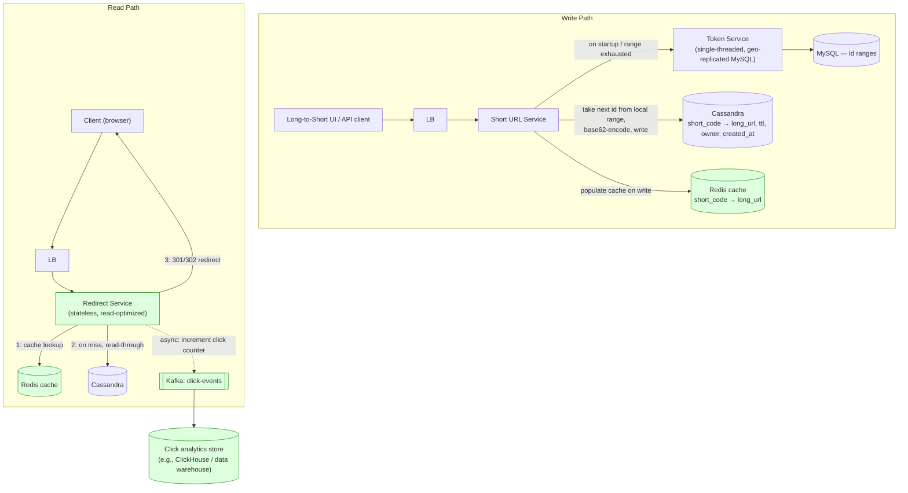

# TinyURL / URL Shortener System Design

> Source: slide 5 of `System Design and Architecture.pptx` ("Tiny URL System Design"). The original slide already contains a genuinely good capacity-planning derivation and a real comparison of two production ID-generation strategies (Flickr Ticket Servers, Twitter Snowflake) — that math is kept and made concrete with worked numbers below. Two significant gaps (redirect semantics, read path/caching) are filled in.

## 1. Requirements

**Functional**: shorten a long URL, redirect a short URL to its original, optional custom alias, optional expiration.

**Non-functional**: URLs must be *unique* and (per the original slide's framing) durable for a defined retention period (assume 10 years); the system is **overwhelmingly read-heavy** (a short link is created once, clicked many times) — this last point is implicit in the problem but was never stated or designed for in the original slides, and it materially changes the architecture (§5).

## 2. Core math (kept from the source, made concrete)

The original slide poses the problem symbolically. Worked with an example assumption of **1,000 new short URLs created per second**, preserved for **10 years**:

```
Y = X * 60 * 60 * 24 * 365 * 10
Y = 1,000 * 315,360,000
Y ≈ 3.15 × 10¹¹  (315 billion URLs to plan capacity for)

Alphabet: a–z, A–Z, 0–9 → 62 symbols
Length = ⌈ log₆₂(Y) ⌉ = ⌈ 6.42 ⌉ = 7 characters

Check: 62⁷ ≈ 3.52 × 10¹² (3.5 trillion) ≫ 3.15 × 10¹¹ → 7 characters is comfortably sufficient.
```

This confirms the slide's stated conclusion (62⁷ ≈ 3.5 trillion, 7 chars suffice) with an actual worked example an interviewer can follow.

**The real problem, correctly identified by the original slide**: *how do you assign a globally unique base-10 ID to each shortening request in a distributed system*, which you then base-62-encode? Two production-proven answers, both from the original slide, both worth keeping:

### Strategy A — Flickr-style Ticket Servers
A dedicated DB with `auto_increment` hands out unique IDs. **Single point of failure** if there's only one. Flickr's real fix: **two ticket servers**, one issuing only even IDs, one only odd, so either can fail without halting ID issuance and without a coordination protocol between them.

### Strategy B — Twitter Snowflake
Self-contained ID generation, no central server on the hot path at all — each node computes its own IDs from local state:

Snowflake's 64-bit ID layout (MSB → LSB):

| unused | timestamp | datacenter/machine ID | sequence |
|:---:|:---:|:---:|:---:|
| 1 bit | 41 bits (ms since custom epoch) | 10 bits (up to 1,024 nodes) | 12 bits (up to 4,096 ids/ms/node) |

- 41-bit timestamp → ~69 years of range from a custom epoch.
- 10-bit machine/datacenter id → up to 1,024 nodes without collision.
- 12-bit per-millisecond sequence → up to 4,096 IDs/ms/node before the node must wait.
- IDs are **k-sortable** by time (timestamp occupies the high bits), which is a nice free side-effect (roughly chronological ordering) not called out in the original slide but worth mentioning.

### Strategy C — Range-based token service (also in the original slide, via "CodeKarle")
A lightweight single-threaded token service hands out **ranges** (e.g., `100,001–200,000`) to each short-URL service instance on startup/exhaustion. Each instance then generates IDs from its local range with zero coordination until it runs out. Correctly noted in the source: this token service can be a plain, geo-replicated MySQL instance, because it's called *rarely* (only on startup or range exhaustion) — widening the range size directly lowers call frequency, trading a little "wasted ID space on crash" for lower coordination overhead.

**Recommendation for this design**: Strategy C (range/token service) or Strategy B (Snowflake) over Strategy A — both avoid a synchronous round-trip to a shared server on every single shortening request, which matters once you're doing 1,000+ writes/sec across many app instances.

## 3. High-Level Architecture (extended — read path was entirely missing from the original)



## 4. Why each component exists

| Component | Purpose | Why this tech |
|---|---|---|
| **Token Service** | Hands out ID ranges so app servers generate IDs locally, with no per-request coordination. | Deliberately simple/boring (single-threaded MySQL) because it's called *rarely* — over-engineering this component wastes effort; the original slide's insight here is correct and worth defending explicitly if an interviewer pushes toward a fancier design. |
| **Short URL Service** | Base-62-encodes the next local id, persists the mapping, seeds the cache. | Kept from the source. |
| **Cassandra (mapping store)** | System of record for `short_code → long_url` (+ owner, TTL, creation time). | Simple key-based reads/writes at very high read volume with no relational structure needed (no joins) — exactly Cassandra's sweet spot, same reasoning as the WhatsApp message store. A relational DB would work functionally but doesn't buy anything and scales worse horizontally for this access pattern. |
| **Redis cache (read path)** | Serve the overwhelming majority of redirects without touching Cassandra at all. | **This entire read path was missing from the original design**, despite the workload being read->write ratio of roughly 100:1 or higher for URL shorteners in practice — a request that just says "read Cassandra" for every single redirect click is the single biggest missed optimization in the source material. Cache-aside: write-time population from the Short URL Service, read-through-and-populate on cache miss. |
| **Redirect Service** | Dedicated, separately-scaled service for the hot read path — decoupled from the (much lower-QPS) write/shortening path so each can be capacity-planned and scaled independently. | Also missing from the original — the source only drew the *creation* flow, not the *redirect* flow, even though redirects are the dominant traffic by 1–2 orders of magnitude. |
| **Click analytics (Kafka → ClickHouse/warehouse)** | Track click counts/referrers without slowing down the redirect itself. | Fire-and-forget async event, same "don't block the hot path" principle used throughout this whole document set (notification, chat, timeline designs). |

## 5. A missing but interview-critical nuance: 301 vs. 302 redirect

The original slides never specify the HTTP redirect status code — this is one of the most commonly probed details in a real URL-shortener interview:

- **301 (Permanent Redirect)**: browsers and intermediate proxies/CDNs **cache it**. Second and later clicks by the same user may never hit your server again — great for reducing load, **bad if you need per-click analytics**, and functionally risky if a mapping could ever need to change or expire (a cached 301 can outlive the mapping).
- **302 (Temporary Redirect)**: not cached by the browser; every click hits your Redirect Service, giving you accurate click analytics and safe support for expiring/mutable links — at the cost of more backend load.
- **Recommendation**: use **302** by default (accurate analytics, safe expiry), and reserve 301 only for links explicitly marked immutable/non-expiring where the owner doesn't need per-click counts — state this trade-off explicitly if asked, since "just use 301, it's faster" is the naive answer an interviewer is testing for.

## 6. Handling scale & concurrency

- **Write path has no shared mutable state on the hot path** once a range is checked out — each Short URL Service instance mints IDs locally, so write throughput scales linearly by adding instances, bounded only by Cassandra's write capacity.
- **Read path is trivially horizontally scalable** — the Redirect Service is stateless, and Redis absorbs the vast majority of traffic; Cassandra only sees cache misses (first click on a link, or cache eviction).
- **Collision-free by construction**: because IDs come from a partitioned range/Snowflake node-id space rather than from a hash, there's no need for a collision-retry loop on write — a meaningful simplification over the common (and inferior) "hash the URL, truncate, retry on collision" approach some designs mistakenly reach for. Worth stating why the ID-based approach was chosen *over* the hash-based one if asked.
- **Custom aliases**, if supported, *do* need a uniqueness check against Cassandra at write time (since they're user-chosen, not sequentially generated) — this is the one write-path operation that can't avoid a lookup, and should be rate-limited per-user to prevent alias-squatting abuse.
- **Rate limiting URL creation** (missing from the original) prevents spam/abuse consuming ID-space and storage — a simple per-API-key or per-IP token bucket (same Redis-based pattern as the Notification design's rate limiter) in front of the Short URL Service.

## 7. Capacity / bandwidth estimate

Using the same assumptions as §2 (1,000 creates/sec, 10-year retention, 315B total records):

- **Storage per record**: `short_code` (7 bytes) + `long_url` (avg ~100 bytes) + owner/created_at/expiry/click-count metadata (~32 bytes) ≈ **~140 bytes**.
- **Total raw storage**: 315.36 × 10⁹ records × 140 bytes ≈ **~44 TB** before replication; ×3 replication (typical Cassandra RF) ≈ **~132 TB** — large but entirely normal for a distributed KV store, and why Cassandra (horizontally scalable storage) rather than a single relational server is the right call at this retention window.
- **Write bandwidth**: 1,000/s × 140 bytes ≈ **140 KB/s** — trivially small; write *throughput* (ops/sec), not bandwidth, is the actual constraint, and Cassandra handles 1,000 writes/s per cluster easily.
- **Read QPS**: assuming a conservative 100:1 read:write ratio → **~100,000 redirects/sec** at peak. This is the number that justifies the Redis-fronted read path in §4/§5 — serving 100K QPS of tiny (~200-byte response) redirects directly from Cassandra would require a materially larger and more expensive cluster than serving it from Redis with Cassandra only absorbing cache-miss traffic.
- **Redirect response bandwidth**: an HTTP redirect response is ~200–300 bytes (headers + `Location`). At 100K QPS: ≈ **20–30 MB/s** egress — modest, but still sized into the LB/Redirect Service tier's NIC capacity planning.

## 8. Likely interviewer questions

- *"How do you generate unique IDs across many machines without a central bottleneck?"* → range/token service or Snowflake, both avoid a synchronous shared counter on every request (§2).
- *"301 or 302, and why?"* → 302 by default for accurate analytics and safe mutability; 301 trades that away for less server load on permanent links (§5) — a strong signal you understand the trade-off, not just the mechanism.
- *"This system is overwhelmingly read-heavy — how does your design reflect that?"* → dedicated, independently-scaled Redirect Service + Redis cache-aside in front of Cassandra, so ~99%+ of traffic never reaches the database (§3, §4, §7).
- *"How would you support custom aliases without racing two users to the same alias?"* → conditional write / uniqueness check at write time on Cassandra (`INSERT ... IF NOT EXISTS`-style lightweight transaction), which is the one place this design can't stay lock-free — call this out as a deliberate, isolated exception.
- *"What happens if the token service goes down?"* → already-checked-out ranges keep every running Short URL Service instance operating with zero downtime; only new range checkouts (rare, on startup/exhaustion) are affected — and it should be geo-replicated/backed-up precisely because of this (as the source material notes).
- *"How would you delete/expire a link?"* → TTL column in Cassandra (native TTL support) or a scheduled sweep; must also actively invalidate the Redis cache entry on expiry/delete, not just rely on Cassandra TTL, or a stale mapping keeps serving from cache after logical deletion.
