# Web Crawler System Design — Interview Review & Improvements

# 0. Motivation & How the System Works (Plain-English Overview)

## Why build this?

A web crawler is the component that turns the open, unstructured web into something a downstream system can use — a search index, a price-monitoring feed, an archive, a dataset for training or analysis. Nobody hands you a clean list of "all the pages that exist." You have to go find them, one link at a time, starting from a handful of seed URLs and following the web's own link structure outward.

That sounds simple as a single-machine script: fetch a page, extract its links, fetch those, repeat. It stops being simple the moment you need it to run continuously, at scale, against a web that is enormous, constantly changing, and not particularly cooperative:

- No one entity controls the web, so pages disappear, redirect, loop back on themselves, or are deliberately structured to trap naive crawlers (infinite calendars, faceted navigation, session-ID URLs).
- Every website is effectively a shared resource. Hitting one too hard can knock it over or get the crawler blocked — so the crawler has to behave politely, and that politeness has to hold even when hundreds of machines are crawling the same host pool.
- Machines crash, networks partition, and disks fill up. A crawler that loses its place on failure re-does years of work or silently drops pages forever.
- Freshness matters. A news homepage that changes every few minutes and a static "About us" page that hasn't changed in years shouldn't be recrawled on the same schedule.
- The web is an untrusted input source: malicious pages, oversized responses, decompression bombs, and SSRF attempts targeting internal infrastructure are all things a production crawler will eventually see.

This document exists to work through those problems and turn a basic "frontier → fetch → parse → store" sketch into a design that would hold up under interview scrutiny and, more importantly, under real production load.

## How the system works, in words

At the center of the design is the **URL Frontier** — think of it as the crawler's to-do list, but one that also knows which host each URL belongs to, how urgently it should be crawled, and when that host was last contacted. Everything else in the system exists to feed the frontier, drain the frontier, or keep the frontier itself durable and consistent.

The flow looks like this end to end:

1. **Seeding and intake.** The crawler starts from a set of seed URLs. Every new URL — whether a seed or one discovered later — is normalized (lowercased scheme/host, resolved relative paths, stripped tracking parameters) so that trivially different-looking URLs pointing at the same resource are recognized as the same thing.
2. **Deduplication.** Before a URL is allowed into the frontier, the system checks whether it has been seen before — cheaply, using a Bloom filter, backed by an authoritative exact-match store for when correctness actually matters.
3. **Scheduling and politeness.** New URLs land in the frontier, which decides two separate things: which URLs are important enough to crawl soon (priority scheduling), and, independently, how many requests any single host may receive per second (politeness). Hosts are partitioned across crawler machines — typically via consistent hashing — so that exactly one machine is ever responsible for a given host's politeness state at a time. This is what stops five different machines from each independently deciding it's safe to hit `example.com` right now.
4. **Fetching.** A crawler node that owns a batch of hosts pulls work from its queues, checks `robots.txt` and DNS (both cached), and fetches the page over HTTP — subject to timeouts, response-size caps, redirect limits, and rate limits. Most pages are fetched as plain HTTP; only pages that actually need JavaScript execution are routed to a separate, sandboxed browser-rendering pool, because rendering is far more expensive than a normal fetch.
5. **Parsing and fan-out.** A successful fetch is parsed and split two ways: the page's outbound links are extracted, normalized, and fed back into the frontier as newly discovered URLs (closing the loop), while the page's content goes through change-detection (content hashing, and near-duplicate detection for pages that are only cosmetically different) before being written to storage — content in bulk/object storage, metadata in a separate metadata store.
6. **Recrawling.** Once a page has been crawled at least once, it stops being a "new discovery" problem and becomes a "when do we look at it again" problem. A recrawl scheduler estimates each page's `nextCrawlAt` based on how often it has historically changed, and feeds that back into the frontier alongside newly discovered URLs.
7. **Staying alive under failure.** Because the frontier is the source of truth for pending work, it's kept durable rather than purely in-memory. Work that's actively being fetched is leased to a specific worker with an expiry; if that worker dies, the lease lapses and another worker picks the URL back up. Ownership of a host is similarly leased with an epoch/fencing token, so a machine that was temporarily partitioned off can't come back and clobber work that has since moved to another owner.

The rest of this document works outward from that picture — first tightening the requirements, then going deep on each moving part (the frontier, host ownership, the URL state machine, deduplication, freshness, security, capacity planning) and finally packaging it into an interview-ready narrative.

---

## 1. Executive Summary

The original design has a strong foundation around the **URL Frontier → per-host queues → fetchers → parser → storage** pipeline.

The most important improvements for a production-grade distributed crawler are:

1. Make the URL Frontier durable and distributed.
2. Treat politeness as a **global invariant**, not just a per-machine property.
3. Use host partitioning/consistent hashing plus ownership leases.
4. Replace literal "one thread per host" with asynchronous scheduling lanes.
5. Add explicit retry, timeout, lease, and failure-recovery semantics.
6. Separate discovery from recrawling.
7. Use HTTP conditional requests (`ETag`, `Last-Modified`, `304`) to reduce bandwidth.
8. Treat Bloom filters as an optimization, with an authoritative exact store.
9. Separate normal HTTP fetching from expensive browser rendering.
10. Add crawler-trap defenses, SSRF protection, sandboxing, and resource limits.
11. Add backpressure and strong observability.
12. Explicitly choose **at-least-once processing + idempotent downstream operations** rather than expensive exactly-once semantics.

---

# 2. Requirements

## Functional Requirements

- Given seed URLs, crawl the web.
- Discover new URLs from fetched pages.
- Fetch HTML pages.
- Respect `robots.txt`.
- Enforce per-host politeness/rate limits.
- Avoid unnecessarily re-crawling unchanged URLs.
- Detect duplicate and near-duplicate content.
- Prioritize important/fresh URLs.
- Store crawled content and metadata.
- Re-crawl pages according to freshness/change behavior.

## Non-Functional Requirements

- Scale to billions of URLs/pages.
- Horizontally scalable.
- Highly available.
- Resilient to crawler-worker failures.
- No single website should be overwhelmed.
- Tolerate malformed or malicious pages.
- Defend against crawler traps/spider traps.
- Handle slow and unreliable websites.
- Apply backpressure when downstream systems are overloaded.
- Provide strong monitoring and debugging capabilities.

---

# 3. High-Level Architecture

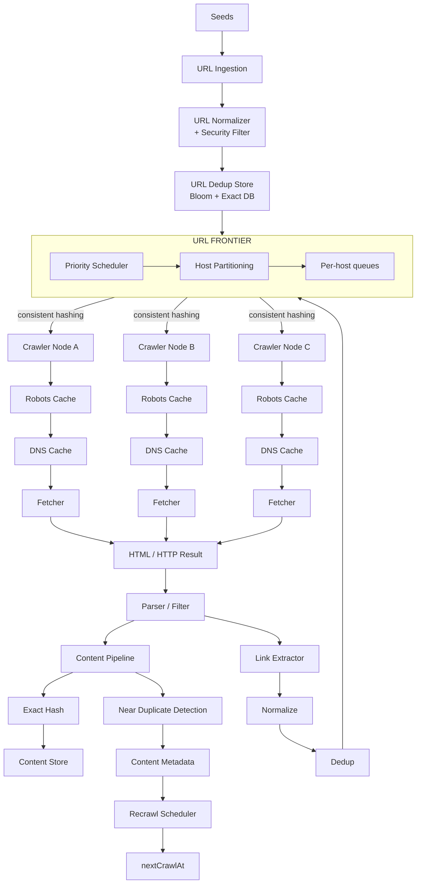

The central idea is that the **URL Frontier is the brain of the crawler**.

---

# 4. URL Frontier

The URL Frontier solves several different problems:

- Which URL should be crawled next?
- Which host should be crawled next?
- How frequently may we contact a host?
- Which failed URLs should be retried?
- When should a URL be re-crawled?
- How do we prioritize important pages?

## Front Queue vs Back Queue

### Front Queue

Answers:

> Which host/page should we crawl next?

### Back Queue

Answers:

> Which URL belonging to this host should we crawl next?

Example:

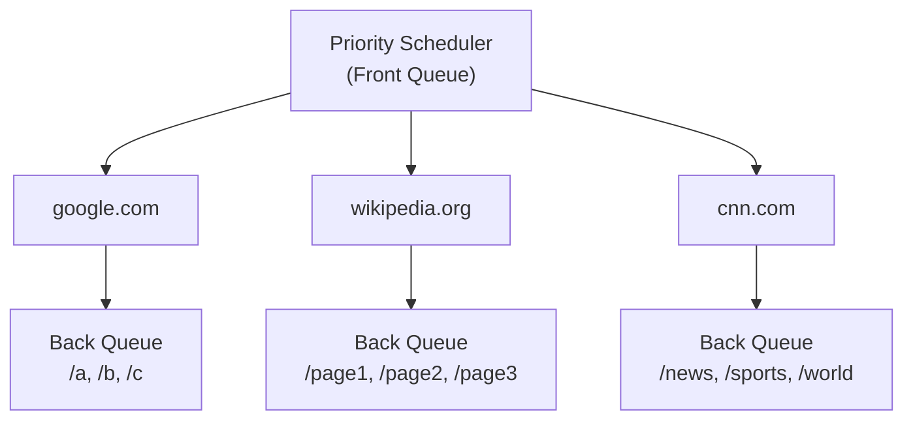

This separation is critical because global prioritization and per-host politeness are different concerns.

---

# 5. Distributed Host Ownership

A single-machine design can ensure that one host has one local queue.

At fleet scale, this is insufficient.

Suppose:

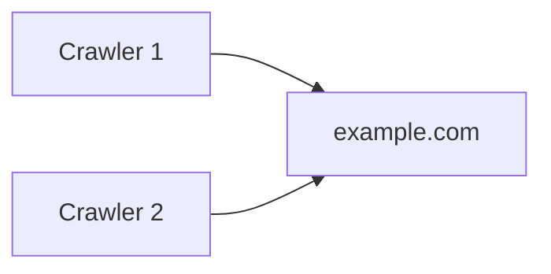

Each crawler may independently believe it is respecting the rate limit, while together they overload the website.

## Solution

Partition hosts across crawler nodes:

```text
hash(hostname) -> crawler partition
```

or use consistent hashing.

For example:

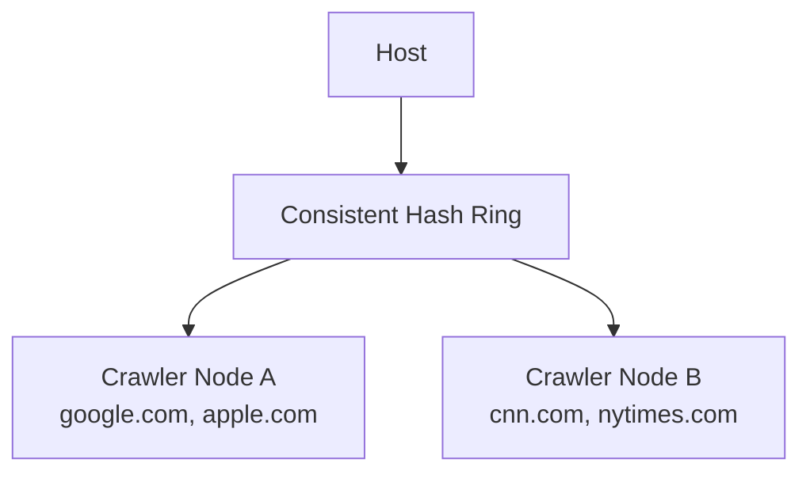

All URLs for a host should map to the same ownership partition.

### Important invariant

> At any point in time, there should be one scheduling authority for a host's politeness state.

---

# 6. Host Ownership and Failure Recovery

Host ownership must survive worker failure.

Use:

- durable partition metadata
- leases
- ownership epochs/fencing tokens

Example:

```text
Host: example.com
Owner: crawler-17
Epoch: 42
Lease: valid until T
```

If crawler-17 dies:

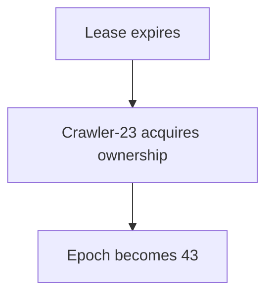

If crawler-17 later wakes up and tries to continue using epoch 42, the system rejects its stale operations.

This prevents split-brain crawling.

---

# 7. Do Not Literally Use One OS Thread per Host

The conceptual model can be:

```text
1 host = 1 serialized scheduling lane
```

but the implementation should not necessarily be:

```text
1 host = 1 OS thread
```

At large scale that would be wasteful.

Instead use:

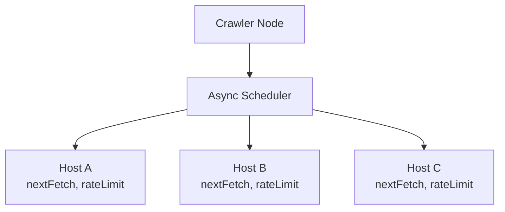

Network crawling is heavily I/O bound, so asynchronous I/O and a bounded worker pool are more appropriate.

---

# 8. Durable URL Frontier

An in-memory queue is an optimization, not the source of truth.

Bad:

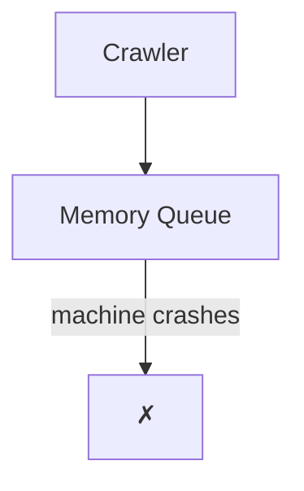

Potentially millions of URLs disappear.

Better:

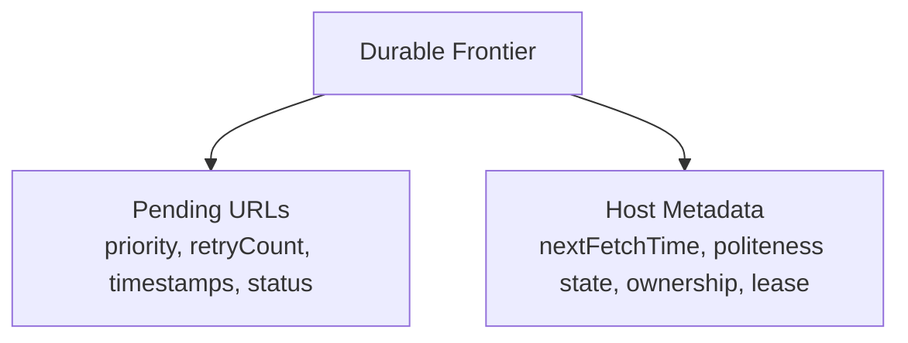

The crawler can keep hot queue state in memory, but pending work must be recoverable.

---

# 9. URL State Machine

Explicit URL states make failure handling easier.

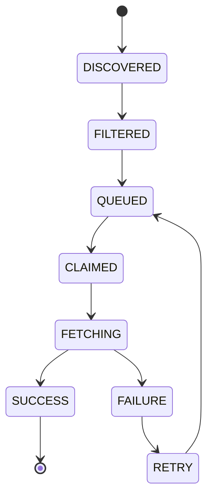

An in-flight URL should have a lease.

Example:

```text
URL = https://example.com/a

status = FETCHING
owner = crawler-17
attempt = 3
leaseExpiry = ...
```

If the worker disappears, another worker can reclaim the URL after the lease expires.

---

# 10. Robots.txt

A production crawler should honor `robots.txt`.

Architecture:

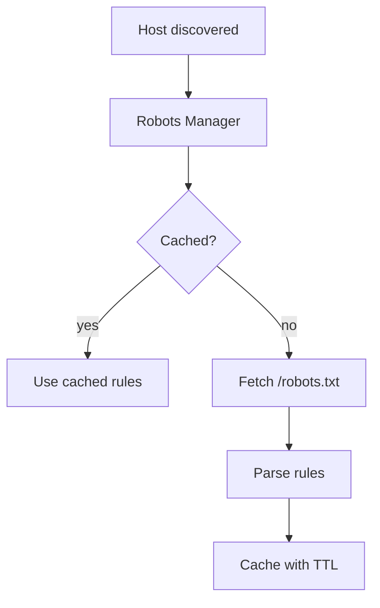

The crawler should evaluate robots policy before fetching the target page.

### Interview phrasing

Avoid making an absolute statement such as:

> "robots.txt compliance is legally mandatory everywhere."

Prefer:

> "`robots.txt` is the standard mechanism for website operators to communicate crawling preferences. A production crawler should honor it for responsible crawling and to reduce operational and legal risk."

Also be precise about `Crawl-delay`: support depends on the crawler/site ecosystem and should be treated as an explicitly supported policy rather than a universally standardized directive.

---

# 11. URL Normalization

URL normalization should happen before deduplication.

Pipeline:

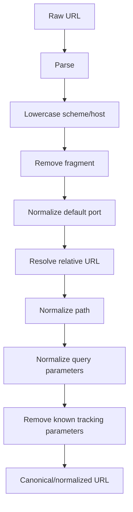

Be careful with query parameters.

For example:

```text
/product?color=red&size=10
/product?size=10&color=red
```

may be equivalent.

But:

```text
/article?sort=latest
/article?sort=oldest
```

are not equivalent.

Therefore query normalization should be based on known semantics rather than blindly sorting/removing everything.

Also consider `<link rel="canonical">` as a signal during content processing, but don't blindly replace every URL with its canonical target.

---

# 12. URL Deduplication

Use:

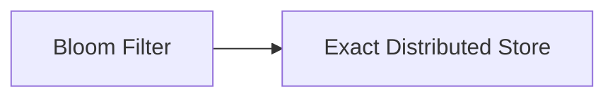

The Bloom filter is an optimization.

Example:

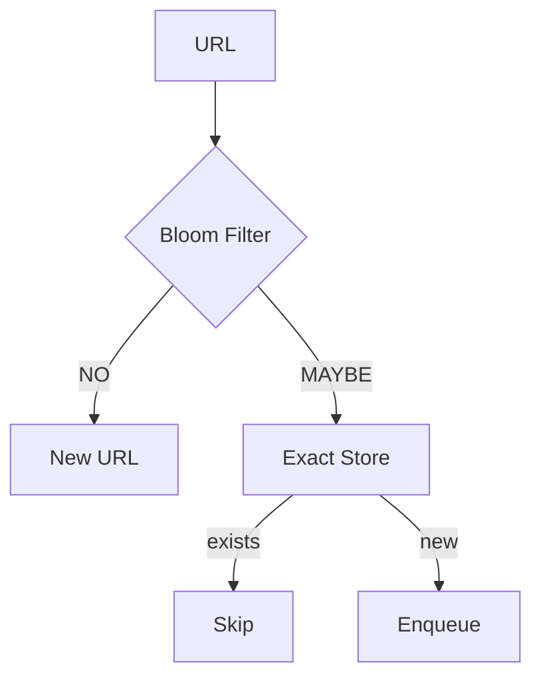

## Why Bloom filter?

A Bloom filter provides compact approximate membership testing.

At massive URL volumes, storing every complete URL in RAM is expensive.

## Important property

The exact store remains authoritative if correctness matters.

---

# 13. URL Metadata

A distributed metadata store can contain:

```text
URL hash
normalized URL
firstSeen
lastFetched
nextCrawlAt
status
priority
retryCount
ETag
Last-Modified
contentHash
contentVersion
host
```

The complete URL does not necessarily need to be the primary key; a strong URL hash can be used as the lookup key, with collision handling appropriate to the correctness requirements.

---

# 14. Re-Crawling and Freshness

Discovery and recrawling are two different problems.

### Discovery

> "I just discovered this URL."

### Recrawling

> "I crawled this URL before. When should I crawl it again?"

Model them separately:

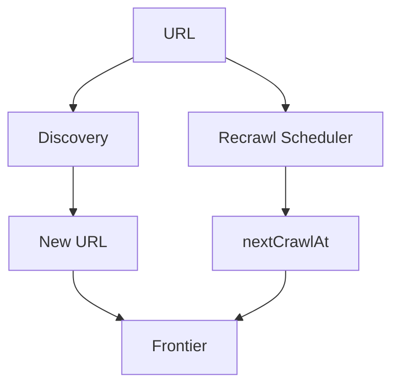

The recrawl interval should adapt based on historical change frequency.

For example:

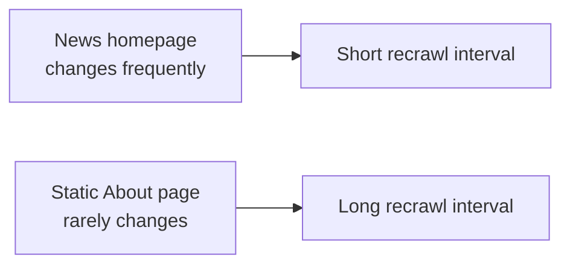

## Where the recrawl signal actually comes from: the Content Pipeline

The recrawl scheduler doesn't guess at change frequency from nothing — it's fed by the **Content Pipeline** branch of the main architecture (see [§3 High-Level Architecture](System_Design/designs/05-web-crawler-v2.md)). It's worth walking through that branch in detail here, because "adapt based on historical change frequency" is meaningless without it.

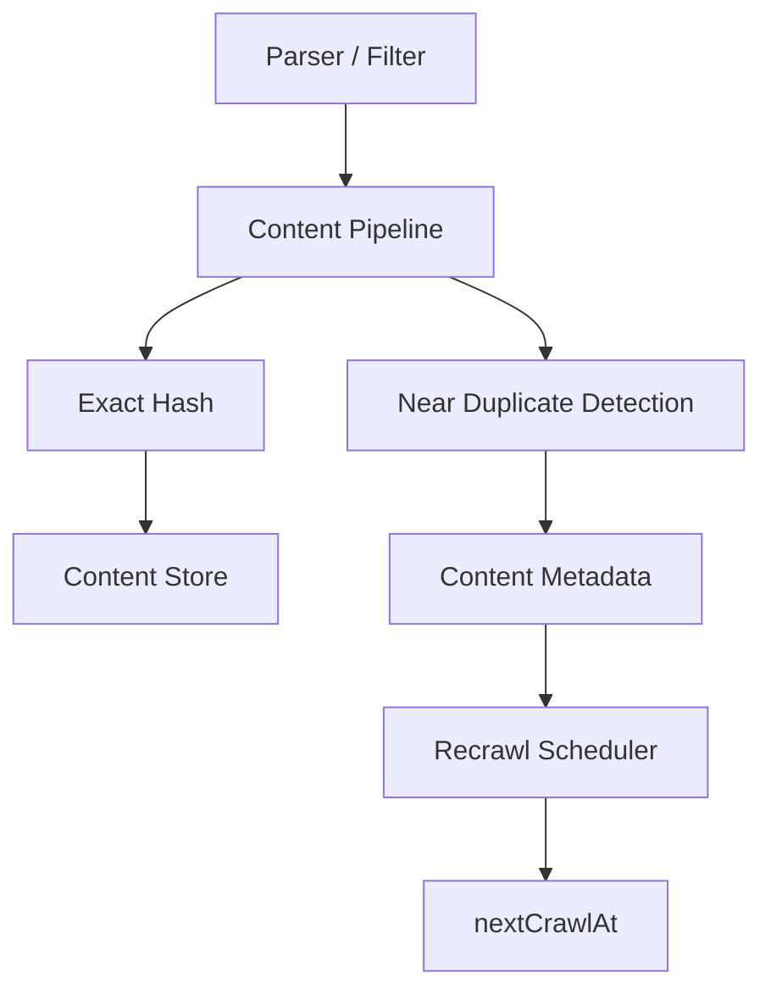

After a page is fetched, the parser splits its output two ways: the **Link Extractor** feeds newly discovered URLs back into the frontier (the *Discovery* half of this section), while the **Content Pipeline** feeds the *Recrawling* half — it is the thing that actually observes whether the page changed, and that observation is what the recrawl scheduler acts on.

1. **Exact Hash.** The fetched HTML is run through SHA-256 to produce a `contentHash`. If this hash matches the `contentHash` stored from the previous crawl, the bytes are provably identical — the page did not change at all, byte for byte (see [§16 Content Change Detection](System_Design/designs/05-web-crawler-v2.md)).
2. **Near Duplicate Detection.** In parallel, techniques like MinHash or SimHash check whether the page is *substantively* the same even if the bytes differ slightly — e.g. only an ad slot, a "last updated" timestamp, or a view counter changed. Without this step, cosmetic churn would look identical to a real content change and would push every such page toward ever-shorter recrawl intervals for no good reason.
3. **Two destinations for two purposes:**
   - The **Exact Hash** result determines what gets written to the **Content Store** — the actual page bytes, kept as versioned/content-addressed storage (see [§17 Content Versioning](System_Design/designs/05-web-crawler-v2.md)), only when the content has genuinely changed.
   - The **Near Duplicate Detection** result (along with the exact-hash outcome) updates **Content Metadata** — a lightweight record per URL tracking `contentHash`, `lastFetched`, and effectively a rolling history of "did this page change on this visit?" (see [§18 Storage Architecture](System_Design/designs/05-web-crawler-v2.md)).
4. **Content Metadata → Recrawl Scheduler.** The recrawl scheduler reads that change history — not a single fetch, but the pattern across many past fetches — to estimate how often this specific URL actually changes, and computes `nextCrawlAt` from that estimate. A page that has come back byte-identical for the last ten crawls earns a longer interval; a page that changes on nearly every visit earns a short one.
5. **`nextCrawlAt` → Frontier.** That computed timestamp is what re-enters the frontier alongside newly-discovered URLs, closing the loop shown in the diagram above.

The practical implication: recrawl scheduling is only as good as the change-detection signal underneath it. Exact hashing alone would treat harmless cosmetic diffs as "changed" and over-crawl; near-duplicate detection alone would risk missing real content changes that happen to be textually similar. Using both, and letting the recrawl scheduler learn from the resulting history rather than a single fetch, is what makes the interval genuinely adaptive instead of a fixed guess.

---

# 15. HTTP Conditional Requests

This is one of the most valuable bandwidth optimizations.

Store:

```text
ETag
Last-Modified
```

from previous responses.

On the next crawl:

```http
If-None-Match: "abc123"
If-Modified-Since: ...
```

The server may return:

```http
304 Not Modified
```

Then the crawler doesn't need to download and process the full document again.

Pipeline:

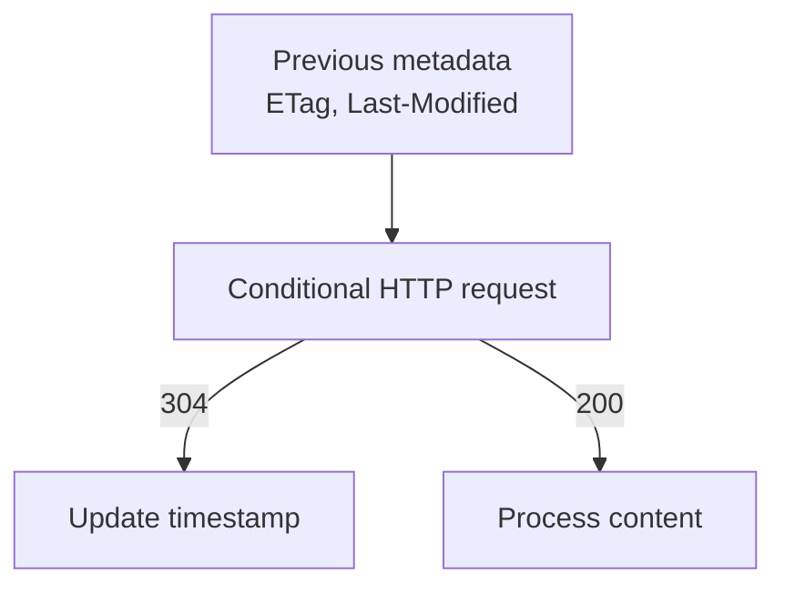

This can be more valuable for bandwidth reduction than relying only on content hashing.

---

# 16. Content Change Detection

Use different techniques for different purposes.

## Exact Hash

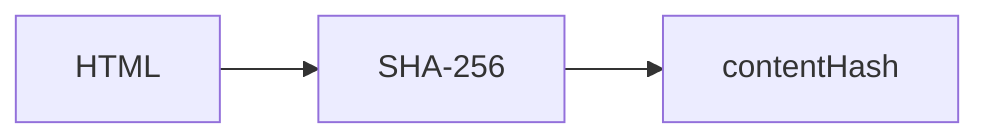

If the new hash equals the old hash, the bytes are identical.

## Near-Duplicate Detection

For pages that differ only slightly, use techniques such as:

- MinHash
- SimHash
- LSH-based approaches

Example:

```text
Page A:
Apple releases a new product today...

Page B:
Apple releases a new product today.
Advertisement...
Timestamp: 12:01
```

The bytes differ, but the useful textual content may be nearly identical.

### Important distinction

- Exact hash → byte-level equality/change.
- MinHash → approximate Jaccard similarity over shingle sets.
- SimHash → approximate similarity/fingerprint technique.

They should not be treated as interchangeable.

---

# 17. Content Versioning

Instead of storing only:

```text
URL -> latest content
```

consider:

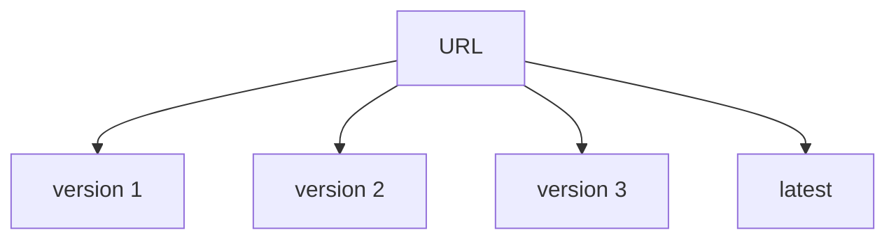

Metadata:

```text
URL
lastFetched
nextCrawlAt
ETag
Last-Modified
contentHash
latestVersion
```

Content can be content-addressed:

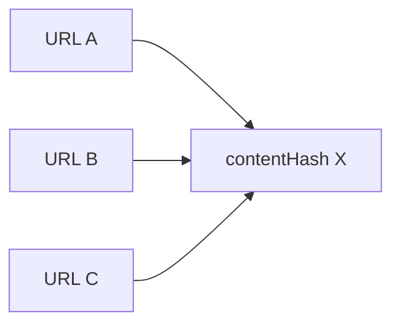

This avoids storing identical content multiple times.

## What actually gets written where, per fetch

It's worth being precise about which store receives a write on a given crawl, since it's easy to assume every fetch writes both content and metadata. In practice the two are decoupled, and the exact hash from §14/§16 is what decides:

1. Compute the new `contentHash` from the freshly fetched HTML.
2. **Read** the previously stored `contentHash` for that URL from the metadata store.
3. **Compare** the two:
   - **Match** → nothing changed. Only `lastFetched` is updated in the metadata store. No write to the content store at all — this is the cheap, common case for stable pages.
   - **Mismatch** → content changed. The new HTML bytes are written to the **content store**, addressed by the new hash (or, if that exact hash already exists there from some other URL, the write is skipped entirely and the URL is simply pointed at the existing blob — the content-addressing case above). The metadata store is then updated with the new `contentHash` and `latestVersion`.

So `contentHash` itself is always persisted to the metadata store on every fetch — it's a small, cheap write. The raw bytes only get written to the (much larger, more expensive) content store when the hash has actually changed. This is what makes content-addressed storage and cheap unchanged-page detection work together: the metadata store's `contentHash` field is the thing being compared, and the content store is only ever touched when that comparison fails.

---

# 18. Storage Architecture

Separate metadata from large content.

```mermaid
flowchart TD
    CR[Crawler] --> MS[Metadata Store]
    CR --> OS["Object/Data Lake Storage"]
```

### Metadata Store

Contains:

- URL state
- timestamps
- crawl scheduling
- retry state
- HTTP metadata
- content hash
- priority

### Content Store

Contains:

- raw HTML
- compressed HTML
- historical versions
- potentially WARC/data-lake representations

HDFS or object storage can be used depending on the environment.

### Cache

Redis can be used for hot data, but it should be a cache rather than the source of truth.

---

# 19. Rendering

Do not send every page through a browser.

Normal path:

```mermaid
flowchart LR
    HF[HTTP Fetch] --> HP[HTML Parser]
```

Selective rendering:

```mermaid
flowchart TD
    HF[HTTP Fetch] --> HP[HTML Parser]
    HP --> JS{JS required?}
    JS -->|no| DONE[Done]
    JS -->|yes| RQ[Render Queue]
    RQ --> BW[Browser Workers]
```

Browser rendering is much more expensive in CPU, memory and latency.

Use a separate browser-worker pool.

---

# 20. Browser Worker Security

Rendering executes arbitrary JavaScript from arbitrary websites.

Use:

- sandboxing
- isolated processes/containers
- CPU limits
- memory limits
- execution-time limits
- network restrictions
- browser version management

A malicious page must not be able to compromise the whole crawler fleet.

---

# 21. Crawler Traps

URL deduplication alone does not stop crawler traps.

Common examples:

## Calendar traps

```text
/calendar/2026/01/01
/calendar/2026/01/02
/calendar/2026/01/03
...
```

## Faceted navigation

```text
/products?color=red
/products?color=red&size=M
/products?color=red&size=M&brand=X
...
```

## Session IDs

```text
/page?session=A
/page?session=B
/page?session=C
```

## Infinite paths

```text
/a/b/c/d/e/f/g/...
```

Defenses:

```text
host-level URL budget
+
depth limit
+
parameter filtering
+
URL-pattern detection
+
query complexity limits
+
response similarity
+
crawl-rate limits
```

The key insight:

> Exact URL deduplication cannot detect structurally different URLs that all represent the same infinite URL space.

---

# 22. Fetcher Responsibilities

The fetcher should enforce:

- connection timeout
- read timeout
- total request deadline
- maximum response size
- maximum redirects
- per-host rate limits
- global rate limits
- content-type restrictions
- TLS validation
- retry policy

Example:

```mermaid
flowchart LR
    HR[HTTP Request] --> CT[connect timeout]
    HR --> RT[read timeout]
    HR --> RSL[response size limit]
    HR --> RL[redirect limit]
    HR --> TD[total deadline]
```

---

# 23. Retry Strategy

Not every error should be retried.

| Response | Typical action |
|---|---|
| 200 | Process |
| 301/302 | Follow redirect subject to limits |
| 304 | Update crawl metadata |
| 404 | Usually don't retry aggressively |
| 403 | Respect blocking/policy |
| 429 | Back off strongly |
| 500 | Retry |
| 502/503 | Retry |
| Timeout | Retry |
| DNS failure | Retry with bounded backoff |

Use exponential backoff with jitter:

```text
retry 1 -> 1 sec
retry 2 -> 2 sec
retry 3 -> 4 sec
retry 4 -> 8 sec
...
```

Avoid retry storms.

---

# 24. Backpressure

Suppose storage slows down:

```mermaid
flowchart LR
    F[Fetcher] --> P[Parser] --> S[Storage]
```

Without backpressure:

```mermaid
flowchart TD
    SS[Storage slows] --> QG[Queues grow]
    QG --> MG[Memory grows]
    MG --> OOM["✗ OOM"]
```

Instead:

```mermaid
flowchart TD
    SS[Storage slows] --> QD[Queue depth increases]
    QD --> TR[Threshold reached]
    TR --> RFR[Reduce fetch rate]
```

Backpressure should propagate upstream.

---

# 25. Failure Handling

## Worker crashes

Use durable frontier + leases.

```mermaid
flowchart TD
    A["Worker A owns URL"] -->|crash| X["✗"]
    X --> LE[Lease expires]
    LE --> B[Worker B reclaims URL]
```

## Frontier failure

Use replicated/durable frontier storage.

## Website unavailable

Use exponential backoff.

## HTTP 429

Back off aggressively.

## Parser failure

Isolate parsing so one malformed page doesn't kill the crawler.

## Browser failure

Isolate browser workers and enforce resource limits.

---

# 26. Exactly-Once vs At-Least-Once

Choose **at-least-once processing**.

Exactly-once processing is expensive and unnecessary for many crawler workloads.

Instead:

```mermaid
flowchart TD
    F["At-least-once fetch"] --> IP[Idempotent processing]
    IP --> UID[URL ID]
    IP --> CH[content hash]
    IP --> V[version]
```

If the same page is fetched twice, downstream processing should safely recognize the duplicate.

Interview answer:

> "We don't need exactly-once network fetching. We need idempotent effects."

---

# 27. Security

The web is an untrusted input source.

## SSRF

A URL may attempt to access:

```text
127.0.0.1
localhost
169.254.169.254
10.0.0.0/8
172.16.0.0/12
192.168.0.0/16
```

The crawler should block internal/private destinations unless explicitly allowed.

## DNS Rebinding

Don't assume hostname validation alone is sufficient.

Validate the actual destination IP used for the connection.

## Resource Exhaustion

Protect against:

- huge responses
- infinite streams
- decompression bombs
- enormous DOMs
- slow connections

## Untrusted Parsers

Isolate parser processes where appropriate.

---

# 28. URL Prioritization

Potential signals:

```text
priority =
    importance
  * freshness
  * historical_change_frequency
  * link_score
  * business_priority
  * crawl_cost_factor
```

Examples:

### News homepage

```text
importance = high
freshness = high
change frequency = high

=> crawl frequently
```

### Static About page

```text
importance = medium
change frequency = low

=> crawl infrequently
```

Newly discovered URLs may initially have uncertain importance, so an exploration score can be used.

---

# 29. Capacity Planning

Suppose:

```text
1 billion pages/month
```

Then:

```text
1B / (30 * 24 * 3600)
≈ 386 pages/sec
```

This is average throughput.

Provision for several times peak throughput depending on workload and recrawl campaigns.

For example, at 5x:

```text
386 * 5 ≈ 1,930 pages/sec
```

If average HTML is 100 KB:

```text
1,930 * 100 KB
≈ 193 MB/sec
≈ 1.54 Gbps
```

This excludes overhead such as:

- retries
- redirects
- TLS
- DNS
- protocol overhead
- browser rendering
- replication
- operational headroom

---

# 30. Storage Estimation

At:

```text
1B pages/month
100 KB average HTML
```

Raw storage:

```text
1B * 100 KB
≈ 100 TB/month
```

With 3x replication:

```text
≈ 300 TB/month
```

This is why distributed bulk/object storage is preferable to a traditional relational database for raw content.

---

# 31. Important Capacity-Planning Caveat

Do not treat:

```text
pages/sec * one universal politeness delay
```

as a universal thread-count formula.

Hosts have different policies:

```text
Host A -> 1 request/sec
Host B -> 1 request/10 sec
Host C -> 5 requests/sec
```

Therefore the number of active scheduling states depends on the distribution of hosts, latency, rate limits, and workload.

The simple formula is useful for intuition, not as the final sizing model.

---

# 32. Observability

Monitor four major areas.

## Throughput

```text
pages/sec
bytes/sec
URLs discovered/sec
URLs crawled/sec
```

## Frontier

```text
queue depth
queue age
priority distribution
per-host queue depth
oldest pending URL
```

## Fetching

```text
DNS latency
HTTP latency
timeout rate
HTTP status distribution
retry rate
429 rate
```

## Crawl Quality

```text
duplicate rate
near-duplicate rate
robots rejection rate
crawler-trap rate
parse failure rate
freshness SLA
```

A particularly valuable metric is:

> What percentage of high-priority URLs were crawled within their freshness SLA?

Pages/sec alone does not measure crawl quality.

---

# 33. Interview Q&A

## Q1. Why do we need a URL Frontier?

Because crawling isn't simply a queue of URLs.

The frontier must handle:

- priority
- politeness
- delayed scheduling
- retries
- recrawling
- host-level concurrency

---

## Q2. Why can't we just use Kafka?

Kafka can provide durable event transport, but the crawler needs additional semantics:

- priority
- delayed delivery
- per-host ordering
- rate limiting
- retry scheduling
- host ownership

Kafka could be part of the implementation, but it is not by itself the complete URL Frontier abstraction.

---

## Q3. How do you prevent two crawler machines from hitting the same host?

Partition hosts using consistent hashing or another partitioning mechanism.

All URLs for a host map to one scheduling partition.

Ownership is protected by leases/epochs.

---

## Q4. What happens if the crawler node owning a host crashes?

Host ownership is leased.

After the lease expires, another node can take ownership.

Pending URLs remain in durable storage.

---

## Q5. Why not use exactly-once?

At-least-once is sufficient.

Failures make exactly-once expensive.

Use idempotent processing based on URL IDs, content hashes, and versions.

---

## Q6. How do you avoid crawling the same URL twice?

Normalize the URL first.

Then use:

```text
Bloom filter
+
authoritative exact store
```

---

## Q7. Why not use only a Bloom filter?

Bloom filters have false positives.

A false positive can incorrectly classify a new URL as already seen.

Therefore the Bloom filter should be treated as an optimization when correctness matters.

---

## Q8. How do you know whether a page changed?

Use multiple levels:

1. HTTP conditional requests using `ETag` and `Last-Modified`.
2. Exact content hash for byte-level equality.
3. MinHash/SimHash for approximate similarity where needed.

---

## Q9. Why not render every webpage?

Browser rendering is much more expensive than normal HTTP fetching.

Use normal fetching by default and send JS-heavy pages to a separate rendering queue.

---

## Q10. How do you detect crawler traps?

Use a combination of:

- depth limits
- per-host URL budgets
- parameter filtering
- URL-pattern detection
- query complexity limits
- response similarity
- rate limits

---

## Q11. What happens when a site is very slow?

Use asynchronous I/O, connection/read timeouts, and bounded concurrency.

A slow host should not consume unlimited crawler capacity.

---

## Q12. What if a site returns HTTP 429?

Back off and respect server signals where applicable.

Do not immediately retry.

---

## Q13. How do you prioritize URLs?

Use signals such as:

- importance/PageRank
- freshness
- historical change frequency
- link authority
- business priority
- crawl cost

---

## Q14. How do you determine recrawl frequency?

Learn from historical change behavior.

Frequently changing pages receive shorter intervals.

Stable pages receive longer intervals.

---

## Q15. What if storage becomes slow?

Use backpressure.

Reduce fetching when downstream queue depth exceeds thresholds.

Do not allow unlimited in-memory buffering.

---

## Q16. How do you prevent SSRF?

Resolve the hostname, validate the destination IP, and block private/internal destinations unless explicitly permitted.

Also account for DNS rebinding.

---

## Q17. What if a page is 100 GB?

Enforce maximum response-size and streaming limits.

Never allow arbitrary pages to consume unlimited resources.

---

## Q18. What if parsing crashes?

Isolate parser processes/workers so malformed content cannot crash the entire crawler.

---

## Q19. How do you monitor the crawler?

Track:

- throughput
- queue depth/age
- fetch latency
- errors
- retries
- duplicate rates
- robots rejections
- trap detection
- storage health
- freshness SLA

---

## Q20. What is the biggest bottleneck?

It depends on workload.

Possible bottlenecks include:

- network bandwidth
- DNS
- per-host politeness
- fetcher CPU
- HTML parsing
- browser rendering
- frontier operations
- storage

Each stage should be independently scalable and observable.

---

# 34. Senior-Level Follow-Up Questions

Prepare for these deeper questions.

### "What if one host has one billion URLs?"

Discuss:

- host-level URL budgets
- durable queueing
- politeness limits
- bounded memory
- spill-to-disk/durable storage

### "What if the crawler fleet has a network partition?"

Discuss:

- leases
- epochs
- fencing
- durable frontier
- duplicate processing
- idempotency

### "How do you guarantee freshness?"

Discuss:

```text
priority
+
recrawl scheduler
+
historical change frequency
+
HTTP conditional requests
+
freshness SLA monitoring
```

### "How do you crawl billions of URLs without putting everything in RAM?"

Discuss:

```text
Bloom filters
+
distributed exact store
+
durable frontier
+
URL hashes
```

---

# 35. Recommended Interview Presentation Flow

For a 30–40 minute interview, present in this order:

## Step 1 — Requirements

Spend ~3 minutes.

Clarify:

- scale
- HTML vs assets
- freshness
- robots/politeness
- storage requirements

## Step 2 — High-Level Architecture

Spend ~5 minutes.

Draw:

```mermaid
flowchart TD
    Seeds --> Frontier
    Frontier --> Fetchers
    Fetchers --> Parser
    Parser --> Storage
    Parser --> Discovered["Discovered URLs"]
    Discovered --> Frontier
```

## Step 3 — Deep Dive: URL Frontier

Spend ~8 minutes.

Explain:

- priority queue
- host queues
- host partitioning
- distributed politeness
- durable queue
- leases

This is the most important section.

## Step 4 — Fetching

Spend ~5 minutes.

Discuss:

- DNS
- robots
- rate limits
- HTTP
- retries
- timeouts
- 429
- conditional requests

## Step 5 — Deduplication / Content

Spend ~5 minutes.

Discuss:

- URL normalization
- Bloom filter
- exact store
- content hashes
- near-duplicate detection
- content versioning

## Step 6 — Failure/Security

Spend ~5 minutes.

Discuss:

- worker failure
- retry
- backpressure
- SSRF
- crawler traps
- malicious pages
- browser sandboxing

## Step 7 — Scale / Tradeoffs

Spend ~5 minutes.

Discuss:

- throughput
- bandwidth
- storage
- horizontal scaling
- bottlenecks

---

# 36. Five Things to Emphasize

If time is limited, emphasize these:

## 1. URL Frontier

> "The frontier is the brain of the crawler."

It handles priority, scheduling, retries, and host-level queues.

## 2. Distributed Politeness

> "Politeness is a global invariant."

Consistent hashing gives each host a single scheduling authority.

## 3. Durable Processing

> "The crawler must tolerate worker failures without losing URLs."

Use durable queues, leases, retries, and idempotency.

## 4. Crawl Efficiency

> "The goal isn't to fetch as much as possible; it's to fetch the most useful content within bandwidth and politeness constraints."

Use:

```text
priority
+
recrawl scheduling
+
ETag/Last-Modified
+
deduplication
```

## 5. The Web Is Untrusted

Mention:

```text
crawler traps
SSRF
malicious HTML
huge responses
slow servers
DNS attacks
browser sandboxing
```

---

# 37. Final Assessment

The original design is a strong foundation.

Its core architecture is sound:

```mermaid
flowchart TD
    UF[URL Frontier] --> PHQ[per-host queues]
    PHQ --> F[fetchers]
    F --> P[parser]
    P --> DC["dedup/content storage"]
    DC --> NU[new URLs]
    NU --> UF
```

The biggest improvements needed to make it production-grade are:

```text
Durable distributed frontier
        +
Host ownership / leases
        +
Async fetching
        +
Retry / failure recovery
        +
Recrawl scheduling
        +
HTTP conditional requests
        +
Security / isolation
        +
Crawler-trap defense
        +
Backpressure
        +
Observability
```

The strongest interview framing is:

> **A web crawler is fundamentally a distributed scheduling system operating against an unreliable, adversarial, and constantly changing external system.**

Once you frame it this way, the major design decisions—URL frontier, host ownership, politeness, retries, leases, prioritization, recrawling, backpressure, and idempotency—follow naturally.
