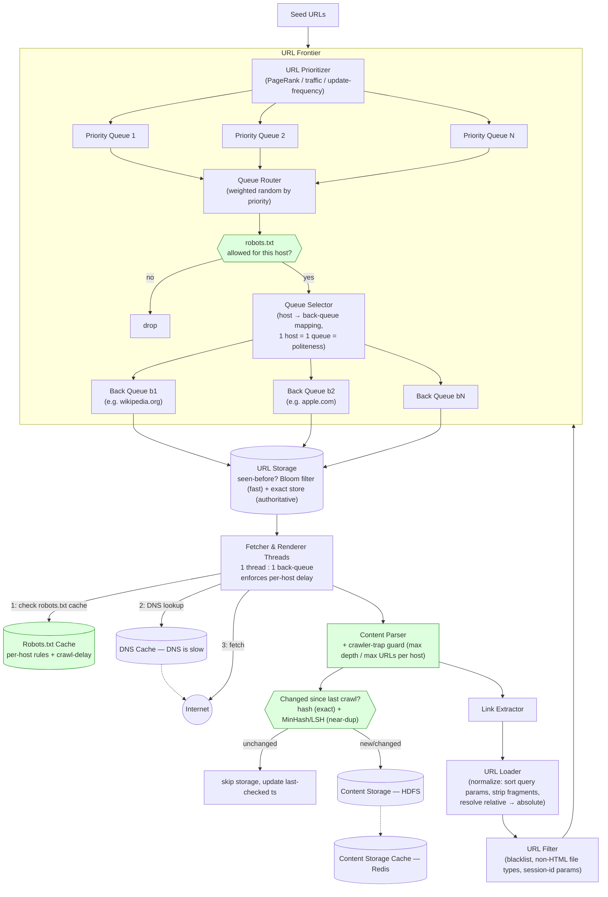

# Web Crawler System Design

> Source: slide 6 of `System Design and Architecture.pptx` ("Web Crawler Design"). The original diagram closely follows the well-known URL-Frontier pattern (as popularized by Alex Xu's *System Design Interview* book) and is architecturally sound. The most important gap — **`robots.txt` / politeness compliance is legally and ethically mandatory and was entirely absent** — is fixed below, along with distributed politeness, near-duplicate detection, and crawler-trap defenses.

## 1. Requirements

**Functional**: given seed URLs, crawl the web, extract links, store page content, avoid re-crawling unchanged pages unnecessarily.

**Non-functional**: crawl at massive scale (billions of pages), be **polite** (never hammer one host), prioritize important/fresh content over arbitrary pages, be resilient to malformed/malicious pages and infinite link structures ("spider traps").

## 2. High-Level Architecture

## 3. Why each component exists

| Component | Purpose | Why this design |
|---|---|---|
| **URL Prioritizer** | Decides *what to crawl next* — not all pages are equally worth crawling first. | Score by PageRank/traffic/update-frequency (kept from source) — puts a high-priority queue's URLs in front of the router with higher selection probability. |
| **Queue Router → per-host Back Queues** | Guarantees **politeness**: one host maps to exactly one back-queue, and one fetcher thread is dedicated to that queue, so requests to that host are inherently serialized with a controllable delay between them. | This FIFO-per-host structure is *the* standard answer to "how do you avoid hammering one server" — correctly present in the original. |
| **`robots.txt` gate + cache** | **Missing from the original design entirely.** Before enqueuing *or* fetching any URL, the crawler must check that host's `robots.txt` `Disallow` rules and honor any `Crawl-delay` directive. | This isn't just an optimization — ignoring `robots.txt` is a violation of the de facto web crawling standard, can get your crawler's IP range blocked, and in some jurisdictions/contexts has legal exposure (e.g., CFAA-adjacent arguments in the US have turned on `robots.txt` compliance in real litigation). Any interviewer grading a crawler design **will** dock heavily for omitting this — it is not optional polish. |
| **Bloom Filter + exact store (URL Storage)** | Fast "have we seen this URL before?" check that must run per-extracted-link at enormous scale. | Bloom filter first because it's ~10–14 bits/URL vs. ~64+ bits for an exact hash — e.g. at 10B tracked URLs, a Bloom filter costs single-digit GB vs ~80GB+ for exact hashes, fits in RAM across a small fleet. False positives (saying "seen" when it's actually new) just mean occasionally skipping a genuinely new URL — acceptable. False *negatives* are impossible by construction with a Bloom filter, so nothing gets wrongly treated as new; but to be safe against Bloom-filter false positives silently losing real content over years of crawling, back it with a smaller/cheaper exact store for verification on the (rare) filter-says-maybe-seen path — this refinement was implicit but not spelled out in the source. |
| **DNS Cache** | DNS resolution is slow (network round-trip per unique hostname) and would otherwise dominate per-request latency at crawl scale. | Correctly identified in the original. |
| **Fetcher & Renderer Threads** | Actually retrieves the page; "Renderer" implies JS execution (headless browser) for JS-heavy sites — a real and non-trivial cost multiplier worth calling out explicitly if asked (rendering is 10-100x more expensive than a plain HTTP fetch; most crawlers only render a subset of pages, e.g. those that return near-empty HTML without a JS engine). | Thread-per-host-queue model (from source) correctly ties parallelism to the number of back-queues, not an arbitrary thread pool size. |
| **Content Parser + change detection** | Extract text/links, and decide whether the page actually changed since last crawl (no point re-storing/re-indexing identical content). | Exact hash catches byte-identical re-crawls cheaply; **MinHash/LSH** (mentioned only in passing in the original — "special hash algorithms like minhash are designed to detect how massive the change was") is the right tool for **near-duplicate** detection — e.g., a page with only its ad slot or timestamp changed shouldn't be treated as a fully new version. Worth being able to explain *why* MinHash works: it estimates Jaccard similarity between shingle-sets cheaply, so "95% similar" pages get a similarity score instead of a binary match/no-match. |
| **Crawler-trap guard** | **Missing from the original.** Some sites generate infinite URLs (calendar pages, session-id-in-URL, faceted search with combinatorial filters) that would otherwise trap a crawler in an unbounded loop on one host. | Bound by max crawl depth per host, max URLs enqueued per host per time window, and detecting suspiciously repetitive URL *patterns* (not just exact dedup, which doesn't catch `?session=A` vs `?session=B` variants of the same page). |
| **URL Loader / normalization** | Correctly noted in the original: sort query parameters so `?a=1&b=2` and `?b=2&a=1` dedup to the same URL. | Also should strip URL fragments (`#section`), resolve relative→absolute links, and lowercase the host — standard canonicalization steps worth naming explicitly. |
| **URL Filter** | Blacklist + non-crawlable file types (binaries, etc.). | Correct as-is; extend with the crawler-trap pattern detection above. |
| **Content Storage — HDFS** | Bulk, append-friendly, horizontally scalable storage for raw page content at petabyte scale. | Right call for this workload: huge volume, batch-processed downstream (indexing, ML), sequential write pattern — exactly HDFS's design point. A Redis cache in front (as in the source) speeds up hot re-reads (e.g., re-parsing recently fetched content) without hitting HDFS. |

## 4. Handling scale & concurrency

- **Politeness at single-machine scale** is solved by the source design's 1-host-per-queue, 1-queue-per-thread model. **At fleet scale (many crawler machines), this must be extended with consistent hashing of `host → crawler node`**, so that all URLs for a given host always land on the *same* machine's queue — otherwise two different machines could unknowingly hit the same host simultaneously, silently breaking politeness across the fleet even though each machine individually respects it. This is the single biggest scale-out gap in the original single-node-flavored diagram, worth raising proactively.
- **Total thread count = total back-queue count** (source's own stated invariant) — scale crawl throughput by adding more back-queues (i.e., discovering/tracking more distinct hosts), not by adding threads to existing per-host queues (which would break politeness by definition).
- **When a fetcher's linked back-queue runs dry**, the Queue Selector reassigns that queue slot to a new, not-yet-crawled host (source's own design) — this keeps thread utilization high even though the number of live hosts being crawled at once is much smaller than the total host universe.
- **Bloom filter sharding**: at truly massive scale (tens of billions of URLs), shard the Bloom filter itself across nodes (e.g., by URL hash) so no single machine needs the entire filter in RAM.
- **Backpressure from Content Storage**: if HDFS write throughput becomes the bottleneck, fetchers must throttle rather than buffer unboundedly in memory — a queue depth limit per fetcher with the URL Frontier re-enqueuing on backpressure (not dropping) keeps the system stable.

## 5. Bugs / gaps in the original and fixes applied

1. **No `robots.txt` compliance anywhere in the design** — the single most important omission; fixed with an explicit gate + cache before both enqueue and fetch (§2, §3).
2. **No crawler-trap defense** — fixed with per-host depth/rate bounds and pattern-based (not just exact) duplicate detection (§3).
3. **Politeness was only solved for a single machine**, implicitly assuming one node's queue structure is the whole system — fixed by adding consistent hashing of hosts to crawler nodes for fleet-wide politeness (§4).
4. **"Renderer" threads were mentioned without cost context** — added the note that headless-browser rendering is materially more expensive than a plain fetch and should be applied selectively, not universally (§3).
5. **Bloom filter false-positive risk over a long-running crawl** wasn't addressed — added the recommendation to back it with a smaller authoritative exact-match store for the "maybe seen" path.

## 6. Capacity / bandwidth estimate

Assume the goal is to crawl **1 billion pages/month**, average page size **500 KB** (modern pages with images/scripts, though raw HTML alone is much smaller — call out that this number should really be split into "HTML only" vs "HTML + assets," and most crawlers designed for indexing only fetch HTML, not embedded assets, to control cost):

- **Pages/sec (sustained)**: 1B ÷ (30 × 24 × 3600) ≈ **~386 pages/sec** average; provision for a multi-x burst factor for re-crawl campaigns.
- **Bandwidth (HTML-only, ~100KB avg page)**: 386 × 100 KB ≈ **~38.6 MB/s** sustained ingest.
- **Bandwidth (with embedded assets, ~500KB avg)**: 386 × 500 KB ≈ **~193 MB/s** — this is why most large-scale crawlers built for search-indexing purposes fetch HTML only and let a separate, much more selective pipeline fetch images/video for specific use cases (e.g., image search), rather than downloading every asset on every page.
- **URL storage (seen-set)**: at 50B URLs ever seen (many pages link to many more URLs than get crawled), a Bloom filter at ~14 bits/element for a low false-positive rate costs ≈ 50 × 10⁹ × 14 bits ÷ 8 ≈ **~87 GB** — fits across a handful of machines' RAM, vs. ~400GB+ for exact 64-bit hashes of the same set.
- **Content storage**: 1B pages/month × 100KB avg (HTML only) ≈ **~100 TB/month** raw before compression; HDFS's block replication (typically 3x) triples this to **~300 TB/month** — this scale is exactly why HDFS (cheap, horizontally scalable, commodity-hardware storage) rather than a traditional database was the right call in the original design.
- **Back-queue / thread count**: if targeting politeness of "1 request per host every 1–2 seconds" and wanting to sustain ~386 pages/sec, you need roughly `386 × 1.5s ≈ 580` concurrently-active back-queues/fetcher-threads at any given moment — a useful sizing formula: `concurrent_threads ≈ target_pages_per_sec × politeness_delay_per_host_seconds`.

## 7. Likely interviewer questions

- *"Your design doesn't mention `robots.txt` — is that a problem?"* → yes, it's a required gate before both enqueue and fetch, not an optional nicety; explain the risk of not honoring it (§3).
- *"How do you avoid hammering a single popular domain when you have 1,000 crawler machines?"* → consistent hashing of host → crawler node so all of that host's URLs are owned by exactly one machine's queue fleet-wide, not just per-machine politeness (§4).
- *"How do you detect a page hasn't meaningfully changed since last crawl?"* → exact hash for byte-identical, MinHash/LSH for near-duplicate/partial change detection, explain Jaccard similarity via shingling at a high level (§3).
- *"What stops the crawler from getting stuck on an infinite calendar-widget URL space?"* → per-host depth/URL-count bounds and pattern-based trap detection, not just exact-URL dedup (§3, §5).
- *"Why Bloom filter instead of just a hash set?"* → memory: ~10–14 bits/element vs. 64+ bits for exact hashes, at tens of billions of URLs that's the difference between fitting in RAM across a few machines vs. needing far more (§3, §6).
- *"How would you prioritize re-crawling a news homepage vs. a static about-us page?"* → the URL Prioritizer's update-frequency signal — pages that change often get a higher priority score and are re-enqueued sooner (§3).
