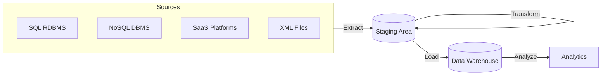
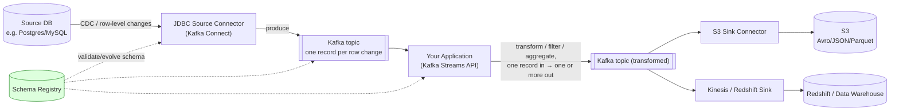

# Data Pipeline Design: ETL vs. ELT, and Streaming ETL with Kafka

> Source: slides 7–8 of `System Design and Architecture.pptx` ("ETL vs ELT" and "ETL With Streaming"). These slides are reference/comparison material rather than a single system design, so this document is organized as a decision framework plus one concrete streaming-ETL architecture, with the original image-based diagrams rebuilt in Mermaid.

## 1. What problem this solves

Almost every "design X" interview (notifications, timelines, price feeds — see the other documents in this set) eventually needs an answer to: **"how does data get from your operational systems into a place where it can be queried for analytics/ML/reporting without hurting the operational systems?"** This document is the reusable answer.

## 2. ETL vs. ELT — decision framework (rebuilt from the source comparison table)

| Parameter | **ETL** (Extract → Transform → Load) | **ELT** (Extract → Load → Transform) |
|---|---|---|
| Data movement | Slower — data is transformed before it moves into the target | Faster — raw data lands in the target immediately |
| Loading | Longer process (transform happens in a separate staging step first) | Quicker, simpler load — no staging transform step blocking it |
| Where transformation happens | In a dedicated staging area, before the warehouse | Inside the target data system itself (using the warehouse's own compute) |
| Time-to-analysis | Fast once loaded (already clean) | Raw data is queryable immediately, but consumer-facing analysis waits on the transform step |
| Security/compliance | Easier to enforce PII scrubbing/HIPAA/GDPR *before* data ever lands in the warehouse | Riskier by default — raw (possibly sensitive) data sits in the warehouse until transformed; needs extra access controls |
| Maintenance | Higher — pipeline logic must be maintained outside the warehouse | Lower — transforms live as SQL/queries inside the warehouse, versioned alongside the schema |
| Tooling maturity | Very mature, 20+ years of tooling and specialists | Newer pattern (enabled by cheap cloud warehouse compute), fewer specialists, tools like dbt now dominant |

**Modern industry context the original slide doesn't mention**: ELT became the *default* choice for new pipelines once cloud warehouses (Snowflake, BigQuery, Redshift) made "just load it raw and transform with SQL/dbt" cheaper than maintaining a separate transform tier — **dbt (data build tool)** is now the de facto standard for the "T" in ELT, running transformations as version-controlled SQL directly against the warehouse. If asked "which would you pick today," the honest, current answer is: **ELT by default, unless you have a hard pre-load compliance requirement (e.g., PII must never land in the warehouse unmasked) that forces ETL.**

*(ETL: transform happens before load, in the staging area — rebuilt from the original circular diagram.)*

## 3. Streaming ETL with Kafka — concrete architecture (rebuilt from the source diagrams)

This is the pattern to reach for when the source system changes continuously (order tables, clickstreams, IoT) and batch ETL's "run every N hours" latency is unacceptable.

**Flow, step by step (matches the original slide's own explanation, kept because it's accurate):**
1. **Extract into Kafka** — a source connector (e.g., JDBC Source Connector, or better: a true CDC connector like Debezium reading the DB's write-ahead log — see §4 correction) turns each row/change into a Kafka message. Downstream consumers get a real-time stream instead of polling the source table.
2. **Pull from Kafka** — the ETL application (or Kafka Streams app) consumes the raw-change topic.
3. **Transform in KStream objects** — the Kafka Streams API processes one record at a time (filter, map, aggregate across a window), producing to an output topic.
4. **Load to target systems** — sink connectors (S3 Sink Connector, Kinesis, Redshift) carry the transformed stream into its final destination(s), possibly multiple in parallel.

## 4. Why each component exists (and one correction to the original)

| Component | Purpose | Why this tech |
|---|---|---|
| **Source Connector** | Turns "a row changed" into "a Kafka message," decoupling the source DB from every downstream consumer. | Kafka Connect is the standard framework for this — pluggable connectors instead of bespoke extraction code per source. |
| **Schema Registry** | Enforces/evolves a shared schema (Avro/Protobuf) between producers and consumers so a source schema change doesn't silently break downstream consumers. | **Correctly present in the original diagram** but not explained — worth stating explicitly: without it, adding a column upstream can silently corrupt or crash a consumer expecting the old shape; the registry enforces compatibility rules (backward/forward) at write time. |
| **Kafka cluster** | Durable, replayable buffer decoupling extraction rate from transform/load rate; supports multiple independent downstream consumers of the same change stream (e.g., S3 archive *and* Redshift *and* a real-time dashboard, all reading the same topic). | Same core argument used throughout this document set — Kafka's value is always "durable multi-consumer decoupling," not just "a queue." |
| **Kafka Streams (KStream transforms)** | In-flight transform without standing up a separate batch-processing cluster. | Appropriate for row-level/streaming transforms (filter, enrich, windowed aggregate); for large historical backfills or complex multi-source joins, a batch engine (Spark) is usually still a better fit — worth noting this isn't a universal replacement for batch ETL. |
| **S3 Sink Connector** | Lands the stream into cheap, durable object storage in Avro/JSON/**Parquet**. | Correctly noted in the original: Parquet (columnar) is the format to use once this data is meant for analytical (OLAP) querying — see §5. |
| **⚠ Correction: JDBC Source Connector for "extraction" vs. true CDC.** | The original slide uses a **JDBC Source Connector**, which typically works by *polling* the source table (e.g., on an incrementing column or timestamp) — this is **not** true real-time change-data-capture, and it can miss deletes and can add load to the source DB proportional to poll frequency. | **Fix**: for true low-latency, low-source-impact streaming extraction, use a **log-based CDC connector** (e.g., **Debezium**) that reads the database's write-ahead log (WAL/binlog) directly — it captures inserts, updates, *and* deletes, doesn't poll the table, and has near-zero impact on source DB load. This is the single most important technical correction to make on this slide, since "JDBC polling" and "streaming CDC" are frequently and incorrectly used interchangeably. |

## 5. Why columnar (Parquet/ClickHouse) storage for the analytical side

The original slide's own note is correct and worth being able to defend with the underlying reason:

> *"Column-oriented databases are ~100x faster for most analytical queries because the system avoids reading unnecessary columns... and same-column values compress better than row-oriented storage."*

- **Why it's faster**: an analytical query like `SELECT AVG(price) FROM trades WHERE ticker='AAPL'` in a row store must read every column of every matching row off disk even though only 2 columns are needed; a column store reads only the `price` and `ticker` columns across all rows — I/O scales with *columns touched*, not *row width*.
- **Why it compresses better**: a single column has low cardinality/high redundancy compared to a whole row (e.g., a `country` column repeats a small set of values millions of times) — run-length/dictionary encoding on a column achieves far better ratios than compressing heterogeneous row bytes together.
- **Reading Parquet directly**: the original slide correctly names **ClickHouse** as a query engine that can read Parquet files directly (in addition to its native format) — useful when you want OLAP-speed queries without a separate ingest/copy step from your S3-based data lake.

## 6. Time-series data (from the original slide, kept + contextualized)

**InfluxDB** and **Prometheus** are named as the two most common purpose-built time-series stores. Context worth adding: they diverge in intent — **Prometheus** is built around *pull-based metrics scraping* for infrastructure/application monitoring with a limited retention model (often paired with long-term remote-write storage like Thanos/Mimir), while **InfluxDB** is a general-purpose time-series database suited to business/IoT/financial time-series (see the Real-Time Price Feed design in this set, which needs exactly this: minute/5-minute/hour/day OHLC bucket tables — an almost textbook time-series workload).

**Bigtable** (mentioned in the source) is included here for completeness since it's the canonical example of the underlying storage engine pattern that many time-series/analytical systems use: table sharded into **tablets** (contiguous row ranges) stored as immutable **SSTables** on a distributed filesystem (Colossus at Google; HDFS/S3 in open-source analogues like HBase), with a write-ahead log for durability before the SSTable is flushed — the same "sharded, immutable, log-then-flush" pattern recurs across Cassandra, HBase, and BigTable-alikes for a reason: it's the standard way to get high write throughput with strong durability at scale.

## 7. Handling scale & concurrency

- **Kafka partition count on the CDC topic** should be driven by the source table's change rate, using the same `partitions ≥ target_throughput / safe_per_partition_throughput` formula used elsewhere in this document set (e.g., ~10–50 MB/s safe sustained per partition on modern Kafka).
- **Schema evolution discipline**: enforce backward-compatible-only changes (new optional fields, no renames/type changes) via the Schema Registry's compatibility mode, or every sink (S3, Redshift, any downstream consumer) becomes a coordinated-deploy problem instead of an independent one.
- **Sink parallelism**: each sink connector (S3, Redshift/Kinesis) is its own consumer group, so a slow warehouse load never backpressures the S3 archival path or vice versa — this is the concrete payoff of Kafka's multi-consumer-group model in this design.
- **Backfills**: a streaming pipeline alone can't cheaply reprocess years of history — pair it with a periodic batch job (or replay from Kafka's retention window, if long enough / tiered storage is enabled) for backfills and reprocessing after a transform bug fix.

## 8. Bugs / gaps in the original and fixes applied

1. **JDBC Source Connector presented as "the" extraction method, without distinguishing polling from true CDC.** *Fix:* recommend Debezium/log-based CDC for real-time, low-impact, delete-capturing extraction (§4).
2. **Schema Registry drawn but not explained.** *Fix:* explained its actual failure-prevention role (§4).
3. **No mention of the now-standard ELT tool (dbt) or why ELT became the default for new pipelines.** *Fix:* added modern context in §2.
4. **No discussion of backfills/reprocessing**, which every real streaming-ETL system eventually needs. *Fix:* added in §7.

## 9. Likely interviewer questions

- *"What's the actual difference between ETL and ELT, and when would you pick each?"* → §2's table plus the modern default-to-ELT-unless-compliance-forces-ETL framing.
- *"Your diagram uses a JDBC connector for extraction — is that real-time?"* → no, it's typically poll-based; true CDC needs a WAL/binlog-reading connector like Debezium (§4) — this is a great "gotcha" to preempt.
- *"Why store the analytical copy in Parquet/columnar format instead of just copying the row-oriented source schema?"* → I/O scales with columns touched, not row width; better compression from column homogeneity (§5).
- *"How do you avoid a downstream consumer breaking when someone adds a column upstream?"* → Schema Registry with backward-compatible evolution rules (§4, §7).
- *"How would you backfill 2 years of history through a Kafka-based pipeline that only retains 7 days?"* → separate batch backfill job reading directly from the source (or its warehouse replica), reusing the same transform logic where possible, rather than relying on Kafka retention (§7).
