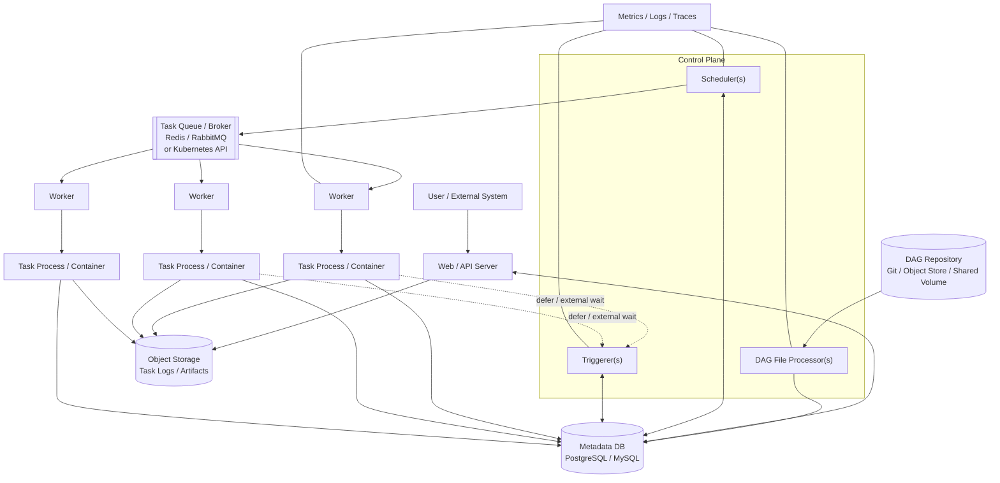
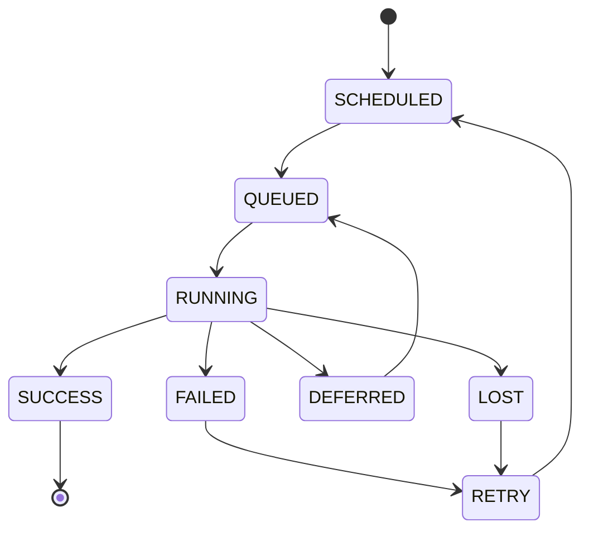

# Distributed Task Scheduler — Robust System Design & Interview Guide

> **Goal:** Design a production-grade distributed task scheduler that can execute DAG-based workflows reliably at scale, while being resilient to crashes, duplicate scheduling, worker failures, slow tasks, and changing workload sizes.
>
> **Source basis:** This document starts from the supplied Airflow architecture and preserves its terminology and core design. The original design identifies DAGs, a Scheduler, Metadata DB, Message Queue, Workers, and distributed executors; the version below strengthens the design around the gaps identified in the source, including DAG parsing isolation, Triggerer/deferrable tasks, executor trade-offs, scheduler HA, parsing scale, backpressure, retries, leases, idempotency, and observability.

---

# 0. Read this first: the flow in plain words

Skip the jargon for a moment. Here's what each piece actually does, and how they hand work to each other.

## The cast of characters

| Component | What it actually does, in one sentence |
|---|---|
| **DAG Repository** | Just a folder/git repo of workflow definition files (Python code describing tasks and their order). |
| **DAG File Processor** | Reads those files and turns them into rows in the database: "this workflow exists, it has these tasks, in this order." It does not run anything. |
| **Metadata DB** | The single source of truth. Every workflow, every run, every task's current state lives here as rows in tables. If it's not in the DB, it didn't happen. |
| **Web/API Server** | The front door. Lets a person or system trigger a run, check status, or view logs by reading/writing the DB. It doesn't make scheduling decisions itself. |
| **Scheduler** | The brain. Continuously asks the DB "what's ready to run?", claims those tasks, and hands them off to the Queue. It never executes task code itself. |
| **Queue/Broker** | A waiting room between the Scheduler (which decides *what* should run) and the Workers (which have to actually be free to run it). Smooths out bursts. |
| **Worker** | The hands. Pulls a task off the Queue, actually executes the task's code, and reports success/failure back to the DB. |
| **Triggerer** | A specialist for "wait for something" tasks (e.g. wait up to 6 hours for a file to appear). Waits efficiently instead of tying up a Worker the whole time. |
| **Object Storage** | Where large stuff goes — logs, files, task outputs. The DB stores a *pointer* to it, not the content itself. |

## A concrete example: "download and process a file"

Say you define a workflow with four tasks, each depending on the one before it:

```text
1. wait_for_file    - wait (up to 6 hours) for a file to land in S3
2. download_file    - download it
3. process_file     - transform it
4. notify_slack     - post a message when done
```

Here's what actually happens, end to end:

```text
 1. You commit the DAG's Python file to the DAG Repository.

 2. DAG File Processor reads it and writes to the Metadata DB:
    "this workflow exists, it has 4 tasks, in this order."
    (Nothing has run yet — this just registers the workflow.)

 3. A schedule fires (or you click "Trigger" in the API server).
    API Server writes one row: "start a new run of this workflow, now."

 4. Scheduler's loop notices the new run. It checks task 1
    (wait_for_file) and sees it has no upstream dependencies, so
    it's runnable. Scheduler claims it in the DB and puts it on
    the Queue.

 5. A Worker picks it up — but since this task just waits, the
    Worker hands it off to the Triggerer instead of blocking
    for hours. Task 1's state becomes "deferred." The Worker is
    now free to do other work.

 6. Triggerer polls S3 in the background (cheaply, alongside many
    other waiting tasks). Eventually the file shows up.

 7. Triggerer tells the Scheduler the wait is over. Task 1 goes
    back on the Queue, a Worker picks it up, marks it running,
    finishes instantly (the file's already there), reports success.

 8. Scheduler's loop re-checks dependencies: task 2 (download_file)
    depends on task 1 = success, so it's now runnable. Scheduler
    claims it and queues it.

 9. A Worker (possibly a different one) runs task 2: downloads the
    file and writes it to Object Storage (not the DB — it's too
    big). Reports success.

10. Same pattern for task 3 (process_file): a Worker reads the file
    from Object Storage, transforms it, writes the result back to
    Object Storage, reports success.

11. Task 4 (notify_slack) becomes runnable, a Worker runs it, it
    calls the Slack API, reports success.

12. Scheduler sees all 4 tasks succeeded and marks the whole run
    "success" in the Metadata DB.
```

The whole time, you can check progress through the **Web/API Server**, which just reads the current state out of the **Metadata DB** — it was never involved in actually deciding or doing the work.

And if a Worker had crashed midway through task 3? Its heartbeat would stop, its lease would expire, the Scheduler would notice and mark the attempt lost, and — depending on retry policy — queue a fresh attempt on another Worker. No component needs to "know" the first Worker died; the lease timing out is how the system finds out.

## Where to read more

Each component gets its own deep dive later in this document: DAG File Processor (Section 4), Scheduler (Section 5), Metadata DB (Section 6), Queue/Broker (Section 8), Workers (Section 10), heartbeats/leases (Section 11), and Triggerer (Section 19–20).

---

## 1. Start with the requirements

A strong interview answer begins with requirements before drawing boxes.

### Functional requirements

The scheduler should support:

1. **DAG workflows**
   - A workflow is a directed acyclic graph of tasks.
   - A task can depend on one or more upstream tasks.
   - A task becomes runnable only when its dependencies are satisfied.

2. **Scheduling**
   - Cron/time-based schedules.
   - Manual triggers.
   - Event-driven triggers where appropriate.
   - Backfills and reruns.

3. **Task lifecycle**
   - `scheduled`
   - `queued`
   - `running`
   - `success`
   - `failed`
   - `retry`
   - `deferred`
   - `cancelled`

4. **Reliability**
   - Retries with configurable policies.
   - Recovery after scheduler/worker crashes.
   - No permanently lost task state.
   - Avoid accidental duplicate execution.

5. **Execution**
   - Distributed workers.
   - Different execution models depending on workload requirements.

6. **Observability**
   - Task status.
   - Logs.
   - Metrics.
   - Scheduler/worker health.
   - Queue latency.

The supplied design correctly emphasizes DAG dependencies, scheduling, retries, status visibility, scalability, isolation, and observability.

### Non-functional requirements

Important properties:

- **Durability:** scheduler state survives process/node failures.
- **High availability:** no single scheduler process should be a permanent single point of failure.
- **Scalability:** independently scale schedulers, DAG processors, workers, and triggerers.
- **Fault isolation:** one broken DAG or task should not take down the control plane.
- **Backpressure:** overload should delay work rather than lose it.
- **Auditability:** every task attempt and state transition should be explainable.
- **Security/isolation:** tasks should not automatically share credentials, filesystem, or runtime dependencies.
- **Operational simplicity:** use strong primitives rather than inventing distributed coordination unnecessarily.

### A critical interview clarification: exactly-once

Be careful saying:

> "The scheduler guarantees exactly-once task execution."

In a distributed system, **exactly-once execution is generally difficult to guarantee** when a worker can finish a task but crash before reporting success.

For example:

1. Worker executes task.
2. Task succeeds externally.
3. Worker crashes before recording `success`.
4. Scheduler sees the task as abandoned.
5. Scheduler retries it.

The task may execute twice.

A more defensible contract is:

> **Exactly-once scheduling/claiming where possible, at-least-once execution with idempotent task semantics.**

For externally visible side effects, use idempotency keys, transactional writes, deduplication, or an atomic sink-side operation.

---

# 2. High-level architecture



The supplied architecture already identifies the key control-plane components and the Scheduler → queue → workers execution path.

The important improvement is to make the boundaries explicit:

- **DAG processors** parse user-defined workflow code.
- **Schedulers** make durable scheduling decisions.
- **Triggerers** handle long asynchronous waits.
- **Workers** execute tasks.
- **Metadata DB** is the durable source of truth.
- **Queue/broker** decouples scheduling from execution.
- **Object storage** handles logs/artifacts rather than pushing large payloads through the metadata database.

---

# 3. What each component does

## 3.1 Web/API server

Responsibilities:

- Trigger DAG runs.
- Inspect DAG/task state.
- Pause/unpause workflows.
- Retry/cancel tasks.
- Display logs.
- Expose operational APIs.

### Why stateless?

Do not keep authoritative scheduler state in the web server.

Multiple API servers can sit behind a load balancer:

```text
Client
  |
Load Balancer
  |
+---------+---------+
| API #1  | API #2  |
+---------+---------+
      |
  Metadata DB
```

If API #1 dies, API #2 can continue serving requests.

---

# 4. DAG File Processor

The supplied design makes an important correction to the classic architecture: DAG parsing should be separated from the Scheduler.

### Why?

DAG definitions may contain executable application code.

A badly written DAG can:

- Perform expensive imports.
- Make network calls.
- Generate thousands of tasks.
- Consume excessive memory.
- Hang during import.
- Contain an infinite loop.

If parsing happens inside the Scheduler's critical scheduling loop, one bad DAG can delay scheduling for unrelated workflows.

Therefore:

```text
DAG Repository
      |
      v
DAG Processor
      |
      v
Parsed DAG metadata
      |
      v
Metadata DB
      |
      v
Scheduler
```

### Scaling

With thousands of DAG files:

- Run multiple parser processes.
- Partition files across processors.
- Avoid reparsing unchanged files.
- Track file modification/version information.
- Apply timeouts and resource limits around parsing.

The supplied design explicitly identifies parser scale as a concern once DAG counts become large.

### Interview question

**Q: Why not let every Scheduler parse every DAG?**

**A:** It duplicates CPU/IO work and makes scheduling latency dependent on user DAG code. Separating parsing makes the Scheduler's critical loop more predictable and allows parsing to scale independently.

---

# 5. Scheduler

The Scheduler is the core control-plane component.

Its job is not to execute tasks.

Its job is to determine:

> **Which task instances are ready, when should they run, and where should they be submitted?**

A simplified loop:

```text
while running:
    read newly created DAG runs
    identify scheduled task instances
    evaluate dependencies
    find runnable tasks
    enforce concurrency limits
    claim runnable tasks transactionally
    enqueue/submit claimed tasks
    monitor stale/running tasks
    process retries
```

The key design principle from the supplied architecture is that scheduling decisions should be based on durable Metadata DB state rather than scheduler-only memory.

---

# 6. Metadata DB — why PostgreSQL/MySQL?

A relational database is a strong fit because the scheduler has highly structured relationships:

```text
DAG
 |
 +-- DAG Run
      |
      +-- Task Instance
              |
              +-- Task Attempt
```

Typical entities:

```text
dag
dag_run
task
task_instance
task_attempt
scheduler_job
worker_heartbeat
```

### Why relational?

We need:

- Transactions.
- Row-level locking.
- Constraints.
- Consistent state transitions.
- Queries across related entities.
- Durable history.

The supplied design specifically calls out transactional guarantees and row-level locking as the mechanism that prevents competing schedulers from simultaneously claiming the same task instance.

### Example claim

Conceptually:

```sql
BEGIN;

SELECT *
FROM task_instance
WHERE id = ?
  AND state = 'scheduled'
FOR UPDATE;

-- verify it is still runnable

UPDATE task_instance
SET state = 'queued',
    scheduler_id = ?
WHERE id = ?;

COMMIT;
```

Only one scheduler can successfully claim the row.

### Important nuance

Do **not** hold a DB transaction open while waiting for a queue or worker.

The transaction should be short:

```text
BEGIN
  claim task
  change durable state
COMMIT

publish task
```

This leads to an important distributed-systems problem.

---

# 7. The dual-write problem: DB + queue

Suppose the scheduler does:

```text
1. DB: state = queued
2. Queue: publish task
```

What if:

```text
DB update succeeds
Queue publish fails
```

Now the task says `queued` but nobody has received it.

The reverse ordering has a different problem:

```text
1. Queue publish succeeds
2. Scheduler crashes
3. DB update never commits
```

Now the queue contains work that the DB may not know about.

### Better design

Use an **outbox pattern** when the architecture requires strong DB-to-broker consistency:

```text
Transaction
    |
    +--> task_instance = QUEUED
    |
    +--> outbox_event = TASK_READY
    |
   COMMIT
       |
       v
Outbox Publisher
       |
       v
Message Broker
```

The publisher retries until the message is delivered.

Consumers should still be idempotent because message delivery can be duplicated.

### Interview answer

If asked:

> "How do you make database state and queue state consistent?"

Answer:

> "I would use a transactional outbox or an equivalent durable submission mechanism. The scheduler commits the task state and an outbox event in one DB transaction. A separate publisher reliably sends the event to the broker. The worker side remains idempotent because distributed messaging is normally at-least-once."

---

# 8. Message Queue / Broker

The queue separates:

```text
Scheduler = producer
Worker    = consumer
```

This prevents the Scheduler from having to wait for a worker to become available.

The supplied architecture describes the queue as the communication layer between Scheduler and Workers and distinguishes Celery's broker-based model from Kubernetes' API-driven execution model.

### Why a queue?

It provides:

- Buffering.
- Backpressure.
- Decoupling.
- Horizontal consumer scaling.
- Retry/re-delivery capabilities.
- Smoother handling of bursts.

Example:

```text
10,000 tasks become ready
        |
        v
   Scheduler
        |
        v
   Queue: 10,000
        |
   +----+----+----+
   |    |    |    |
  W1   W2   W3   W4
```

Workers consume at their available rate.

The queue depth grows temporarily instead of forcing the scheduler to synchronously manage execution.

---

# 9. Executors: Sequential vs Local vs Celery vs Kubernetes

This is one of the most important interview trade-offs.

The supplied design explicitly expands the original "Distributed Executors" category into distinct execution models.

| Executor | Isolation | Scaling | Best use |
|---|---|---|---|
| Sequential | Minimal | None | Development |
| Local | Process-level on one machine | One host | Small deployments |
| Celery | Shared worker runtime | Add workers | High-throughput, relatively homogeneous workloads |
| Kubernetes | Pod-level isolation | Cluster autoscaling | Heterogeneous, bursty, or stronger-isolation workloads |

## Celery

```text
Scheduler
    |
    v
Broker
    |
+---+---+---+
|   |   |   |
W1  W2  W3
```

Advantages:

- Low task startup overhead.
- High throughput.
- Simple worker-pool model.
- Easy horizontal scale-out.

Disadvantages:

- Tasks share worker environments.
- Resource isolation is weaker.
- Worker machines must have compatible dependencies.
- Noisy tasks can affect neighboring tasks.

## Kubernetes

```text
Scheduler
    |
    v
Kubernetes API
    |
+-------+-------+-------+
| Pod A | Pod B | Pod C |
+-------+-------+-------+
```

Advantages:

- Stronger isolation.
- Per-task CPU/memory limits.
- Different images/dependencies per task.
- Natural elastic scaling.

Disadvantages:

- Pod startup/scheduling overhead.
- More operational complexity.
- Kubernetes control-plane dependency.
- Higher cost for extremely small tasks.

The core trade-off is:

> **Celery optimizes for worker reuse and throughput; Kubernetes optimizes for isolation and workload flexibility.**

---

# 10. Worker design

A worker should be treated as an unreliable distributed process.

It can:

- Crash.
- Be killed by OOM.
- Lose network connectivity.
- Become slow.
- Become partitioned from the DB.
- Finish work and die before reporting completion.

Therefore, the Scheduler cannot simply trust:

```text
"worker says I'm running"
```

It needs heartbeats/leases and timeout policies.

### Worker lifecycle

```text
QUEUED
  |
  v
RUNNING
  |
  +------> SUCCESS
  |
  +------> FAILED
  |
  +------> RETRY
  |
  +------> LOST / TIMEOUT
```

---

# 11. Heartbeats and leases

A common robust mechanism is a lease.

When a worker claims a task:

```text
lease_expires_at = now + 60 seconds
```

The worker periodically renews it:

```text
heartbeat every 20 seconds
```

If heartbeats stop:

```text
now > lease_expires_at
```

the Scheduler can consider the worker/task unhealthy.

### Why a lease?

A boolean such as:

```text
worker_alive = true
```

is not enough.

If the worker dies, nobody may update it to false.

A lease expires automatically.

### Interview question

**Q: What happens if the worker crashes halfway through a task?**

**A:**

1. Worker stops heartbeating.
2. Lease expires.
3. Scheduler detects stale execution.
4. Task is marked failed/lost.
5. Retry policy determines whether it should run again.
6. A new worker executes the retry.

This is a form of failure detection using timeouts rather than perfect knowledge.

---

# 12. Scheduler high availability

A single Scheduler is a single point of failure.

Use multiple Scheduler replicas:

```text
             +-------------+
             | Metadata DB |
             +------+------+
                    |
          +---------+---------+
          |                   |
    Scheduler #1        Scheduler #2
          |                   |
          +---------+---------+
                    |
                  Queue
```

Both can run concurrently.

The DB provides coordination using transactional claims/row locks. The supplied design explicitly identifies multi-scheduler support and row-level locking as the HA mechanism.

### Why not use leader election?

Leader election is possible, but it is not always necessary.

If scheduler work can be safely claimed transactionally, multiple schedulers can operate concurrently.

This can improve availability and throughput.

If a design instead chooses a single active leader, it must explain:

- How leadership is acquired.
- Lease duration.
- Leader renewal.
- Split-brain prevention.
- Failover time.

---

# 13. Preventing duplicate scheduling

Imagine two schedulers execute:

```text
Scheduler A: task X is ready
Scheduler B: task X is ready
```

Without coordination:

```text
A -> enqueue X
B -> enqueue X
```

The task may execute twice.

### Solution

Atomically claim the task:

```text
state = SCHEDULED

Scheduler A:
    lock row
    state -> QUEUED
    commit

Scheduler B:
    tries lock
    sees state != SCHEDULED
    does not enqueue
```

This is exactly the class of problem the supplied architecture solves with transactional task-instance claiming.

---

# 14. But database locking does NOT guarantee no duplicate execution

This is a very important interviewer trap.

Suppose:

```text
Scheduler
   |
   v
Queue
   |
   v
Worker
```

The scheduler successfully enqueues once.

Then:

1. Worker receives task.
2. Worker executes successfully.
3. Worker crashes before acknowledging completion.
4. Broker redelivers.
5. Another worker executes it again.

So:

> **Exactly-once scheduling claim != exactly-once execution.**

For correctness, tasks should ideally be idempotent.

### Example

Bad:

```text
charge_customer()
```

If called twice, customer may be charged twice.

Better:

```text
charge_customer(
    idempotency_key = dag_run_id + task_id
)
```

The downstream service stores the key and ignores duplicates.

---

# 15. DAG dependency evaluation

Suppose:

```text
A ---> C
B ---> C
```

C is runnable only when:

```text
A == SUCCESS
AND
B == SUCCESS
```

For:

```text
A ---> B ---> C
      |
      +----> D
```

the Scheduler evaluates each task's dependency state.

### Optimization

Do not scan every task in every DAG on every Scheduler loop.

Possible approaches:

- Index runnable task instances.
- Track changed task instances.
- Maintain dependency-related counters.
- Use database indexes on state/schedule fields.
- Batch scheduling queries.

For example:

```sql
CREATE INDEX idx_task_instance_sched
ON task_instance(state, scheduled_time);
```

The exact schema depends on workload and DB characteristics.

---

# 16. Concurrency controls

A robust scheduler should support limits at several levels.

### Global

```text
max_running_tasks = 10,000
```

### Per DAG

```text
max_active_tasks_per_dag = 100
```

### Per task

```text
max_concurrent = 5
```

### Per queue/resource pool

```text
GPU pool = 20
API-rate-limited pool = 50
```

This prevents one workflow from consuming the entire cluster.

### Interview question

**Q: What prevents one DAG with 100,000 ready tasks from starving everything else?**

**A:**

Use hierarchical concurrency limits and fair scheduling:

```text
global capacity
    |
    +-- DAG A limit
    +-- DAG B limit
    +-- DAG C limit
```

The scheduler should not simply enqueue everything that is technically runnable.

---

# 17. Backpressure

Suppose:

```text
Task arrival = 10,000/sec
Worker capacity = 2,000/sec
```

The queue grows.

That is not automatically a failure.

The system should apply backpressure:

```text
Ready tasks
    |
    v
Queue
    |
    |  <-- growing backlog
    v
Workers
```

Metrics should expose:

- Queue depth.
- Oldest queued task age.
- Scheduling latency.
- Worker utilization.
- Task execution latency.

The supplied design explicitly describes queued tasks as a natural backpressure mechanism: excess ready work waits rather than being lost.

---

# 18. Retries

A failed task should not always immediately retry.

Use:

```text
retry_count
max_retries
backoff
```

Example:

```text
Attempt 1 -> fail
wait 10 sec
Attempt 2 -> fail
wait 30 sec
Attempt 3 -> fail
wait 90 sec
Attempt 4 -> success
```

Use exponential backoff with jitter to prevent a large number of tasks from retrying simultaneously.

### Important distinction

Retry **transient** failures:

- Temporary network error.
- Database unavailable.
- Rate limit.
- Worker crash.

Do not blindly retry permanent failures:

- Invalid SQL.
- Invalid configuration.
- Missing required input.
- Programming error.

---

# 19. Triggerer and deferrable tasks

The supplied design adds a Triggerer specifically to address long waits.

Consider:

> "Wait up to 6 hours for a file to appear."

Bad approach:

```text
Worker
  |
  | poll every 30 sec
  |
  | ... 6 hours ...
```

The worker is occupied while doing almost no useful computation.

Better:

```text
Worker
  |
  v
register trigger
  |
  v
Triggerer
  |
  | async wait
  |
  v
condition satisfied
  |
  v
Queue
  |
  v
Worker
```

The Triggerer can efficiently multiplex many I/O waits using asynchronous execution.

### Interview question

**Q: Why not simply increase the number of workers?**

**A:** Because waiting tasks can consume large amounts of worker capacity without consuming CPU. Increasing workers solves the symptom at higher infrastructure cost. Deferral separates compute capacity from waiting capacity.

---

# 20. Triggerer high availability

A Triggerer is itself infrastructure.

If one Triggerer dies:

```text
Deferred tasks
       |
       X
 Triggerer dead
```

Deferred tasks may stop progressing.

Therefore:

- Run multiple Triggerer replicas where supported.
- Persist enough state to reconstruct triggers.
- Ensure trigger registration is recoverable.

The supplied design explicitly notes the need for multiple Triggerer replicas for availability.

---

# 21. Scheduling fairness

Suppose DAG A continuously generates tasks:

```text
A: A A A A A A A A A ...
B: B
C: C
```

A naïve FIFO scheduler may starve B and C.

Possible strategies:

- Per-DAG queues.
- Weighted fair scheduling.
- Round-robin scheduling.
- Per-tenant quotas.
- Priority queues.

For example:

```text
Tenant A -> 40%
Tenant B -> 30%
Tenant C -> 30%
```

The exact policy depends on product requirements.

---

# 22. Time scheduling and clock correctness

Time-based schedulers have subtle edge cases:

- Scheduler clock differs from worker clock.
- Daylight-saving changes.
- Missed schedules during downtime.
- Backfills.
- Duplicate schedule generation.

Use:

- UTC internally.
- Explicit schedule/timezone semantics.
- Durable run identifiers.
- Deterministic schedule calculation.

Avoid making correctness depend on local machine time.

---

# 23. Scheduler crash recovery

Consider:

```text
Scheduler
   |
   +--> task A queued
   |
   X CRASH
```

If state was only in memory, the scheduler would forget what happened.

With durable state:

```text
Scheduler DB
    |
    +--> task A = QUEUED
```

A replacement Scheduler reads the DB and continues.

The supplied design explicitly identifies this as the reason scheduler state must live in the Metadata DB rather than only in memory.

### Important nuance

Crash recovery still requires reconciliation.

For example:

```text
DB says RUNNING
worker is actually dead
```

Heartbeats/leases allow the Scheduler to detect and recover stale tasks.

---

# 24. Large-scale metadata database concerns

The Metadata DB can eventually become the bottleneck.

Why?

Every task generates state transitions:

```text
scheduled
queued
running
success
```

A million tasks can mean millions of writes.

### Techniques

1. Proper indexes.
2. Batch operations.
3. Partition large history tables.
4. Archive old task history.
5. Keep large logs/artifacts outside the DB.
6. Avoid excessive polling.
7. Use connection pooling.
8. Monitor lock contention.
9. Keep transactions short.
10. Consider read replicas for read-heavy UI/API workloads where consistency requirements allow.

### Do not put logs in the metadata DB

Use object storage:

```text
Worker
   |
   v
Object Storage
   |
   +--> task logs
   +--> artifacts
```

The DB stores references/metadata.

---

# 25. Why not use Kafka as the task queue?

This is a useful interview discussion.

Kafka is excellent for durable event streaming and high-throughput ordered partitions.

But a task scheduler's queue semantics can be different:

- Work should generally be consumed by one worker.
- Tasks may need delayed retries.
- Visibility/acknowledgement semantics matter.
- Routing by task/resource type may matter.
- Task lifecycle is already tracked durably in the Metadata DB.

Kafka can be used, but it adds design complexity.

For a Celery-style architecture, a broker such as Redis/RabbitMQ is a natural fit. For Kubernetes execution, the Kubernetes API can act as the submission/control mechanism rather than a traditional broker. This distinction is already highlighted in the supplied design.

---

# 26. Why PostgreSQL instead of Redis as the source of truth?

Redis is excellent for:

- Caching.
- Fast ephemeral coordination.
- Queues.
- Short-lived state.

But the scheduler needs:

- Durable task history.
- Relationships.
- Transactions.
- Complex queries.
- Strong consistency for state transitions.
- Auditing.

Therefore:

> **Use a relational DB as the source of truth and Redis/RabbitMQ as execution infrastructure when appropriate.**

Do not make the queue the authoritative task database.

---

# 27. Failure scenarios

A good interview answer should proactively walk through failures.

## Scenario A — Scheduler crashes

```text
Scheduler A
   X
   |
Metadata DB remains
   |
Scheduler B starts
   |
reconciles state
```

No authoritative state is lost.

## Scenario B — Worker crashes

```text
Worker
   X
   |
lease expires
   |
Scheduler detects
   |
retry
```

## Scenario C — Queue temporarily unavailable

The scheduler should:

- Keep durable task state.
- Retry publishing.
- Use an outbox/submission mechanism if required.
- Avoid marking work permanently complete before successful submission.

## Scenario D — DB becomes unavailable

The control plane cannot safely make durable scheduling decisions.

The scheduler should:

- Fail closed rather than invent state.
- Retry DB connection.
- Avoid unsafe duplicate scheduling.
- Alert operators.

## Scenario E — One DAG parser hangs

Only that parser/process should be affected.

The Scheduler continues operating for already-known DAG metadata and other parser processes.

## Scenario F — One task runs for 12 hours

If legitimate, it remains running.

If it exceeds a configured execution timeout:

```text
RUNNING
   |
timeout
   |
FAILED / TERMINATED
   |
RETRY or terminal failure
```

## Scenario G — Network partition

This is the hard case.

A worker may be alive but unable to communicate with the Scheduler/DB.

The scheduler cannot know immediately whether:

```text
worker is dead
```

or:

```text
worker is alive but disconnected
```

This is why distributed systems use leases/timeouts and accept that failure detection is imperfect.

---

# 28. Idempotency strategy

For production correctness, every retryable task should ideally have an idempotency strategy.

### Database example

Use a unique business key:

```text
UNIQUE(order_id, operation_id)
```

A retry then becomes a harmless duplicate attempt.

### API example

Send:

```text
Idempotency-Key: <dag_run_id>:<task_id>
```

The downstream service stores the result associated with the key.

### Object storage

Write to deterministic paths:

```text
s3://bucket/<dag_id>/<run_id>/<task_id>/output
```

or use conditional writes.

---

# 29. Security

A production scheduler must assume task code is potentially dangerous.

Important controls:

- Authentication.
- Authorization/RBAC.
- Secret management.
- Per-task credentials.
- Network policies.
- Container isolation.
- Resource limits.
- Audit logs.
- Encryption in transit.
- Encryption at rest.

Kubernetes execution is particularly attractive when tasks need stronger runtime isolation because each task can run in its own pod with explicit resource/security policies.

The supplied design identifies Kubernetes' per-task isolation as a major advantage over shared Celery worker environments.

---

# 30. Observability

Metrics should answer:

### Scheduler health

- Scheduler heartbeat.
- Scheduling loop duration.
- DB query latency.
- Number of scheduling decisions/sec.

### Queue

- Queue depth.
- Oldest queued task.
- Enqueue latency.
- Consumer throughput.

### Workers

- Worker heartbeat.
- CPU/memory.
- Active tasks.
- Failed tasks.

### Task

- Task duration.
- Retry count.
- Failure rate.
- Queue wait time.
- Execution latency.

### DAG parsing

- Parse duration.
- Parse failures.
- Number of DAGs processed.
- Last successful parse time.

### Triggerer

- Deferred task count.
- Trigger evaluation latency.
- Triggerer heartbeat.

A particularly useful SLO is:

> **Scheduling latency = time a task becomes runnable → time execution is actually started.**

This separates scheduler/queue capacity problems from slow task execution.

---

# 31. End-to-end task lifecycle

A complete execution can look like this:

```text
1. DAG definition exists
        |
2. DAG Processor parses it
        |
3. Metadata DB stores DAG/task metadata
        |
4. Scheduler creates/observes DAG run
        |
5. Scheduler evaluates dependencies
        |
6. Task becomes READY
        |
7. Scheduler atomically claims task
        |
8. Task becomes QUEUED
        |
9. Task submission/outbox publishes work
        |
10. Worker claims task
        |
11. Task becomes RUNNING
        |
12. Worker heartbeats
        |
13. Task executes
        |
14. Worker records SUCCESS
        |
15. Logs/artifacts stored externally
```

For a deferrable task:

```text
RUNNING
   |
DEFERRED
   |
Triggerer waits
   |
condition satisfied
   |
QUEUED
   |
RUNNING
   |
SUCCESS
```

---

# 32. Suggested state machine



A production implementation should define which transitions are legal and enforce them.

For example:

```text
SUCCESS -> RUNNING
```

should not happen accidentally.

---

# 33. Data model

A simplified model:

```text
DAG
---
dag_id
version
schedule
paused

DAG_RUN
-------
run_id
dag_id
logical_time
state
created_at

TASK
----
task_id
dag_id
dependencies
pool
priority

TASK_INSTANCE
-------------
run_id
task_id
state
try_number
queued_at
started_at
finished_at
worker_id
lease_expires_at

TASK_ATTEMPT
------------
task_instance_id
attempt
worker_id
started_at
finished_at
exit_code
error
```

Keep immutable attempt/history information separate from the current task state where useful.

---

# 34. Scaling model

The major components should scale independently.

```text
                    +-------------+
                    | Metadata DB |
                    +-------------+
                       /    |    \
                      /     |     \
               +-----+   +--+--+   +------+
               | Parser|  |Sched|   |API   |
               +-----+   +-----+   +------+
                              |
                           Queue/API
                              |
                    +---------+---------+
                    |         |         |
                   W1        W2        WN
```

### If DAG parsing is slow

Scale parsers.

### If scheduling is slow

Scale schedulers / optimize DB scheduling queries.

### If queue is growing

Scale workers.

### If external waits are huge

Scale Triggerers.

### If UI/API is overloaded

Scale API servers.

This independent scaling is a major benefit of separating responsibilities.

---

# 35. Bottleneck analysis

Interviewers often ask:

> "What becomes the bottleneck first?"

There is no universal answer.

It depends on workload.

### CPU-heavy DAG parsing

Parser CPU becomes the bottleneck.

### Millions of task instances

Metadata DB writes/indexes become a major bottleneck.

### Huge task throughput

Broker and worker capacity become bottlenecks.

### Very high DAG scheduling rate

Scheduler + DB query/locking throughput becomes the bottleneck.

### Many long waits

Triggerer capacity becomes relevant.

Therefore monitor each layer rather than assuming workers are always the bottleneck.

---

# 36. Technology stack — why these choices?

## PostgreSQL / MySQL

**Purpose:** authoritative metadata/state.

Why:

- Transactions.
- Row-level locking.
- Relational task/dependency model.
- Durable history.
- Mature operational ecosystem.

**Default interview choice:** PostgreSQL.

---

## Redis / RabbitMQ

**Purpose:** broker for Celery-style execution.

Why:

- Decouple producers/consumers.
- Buffer bursts.
- Support distributed workers.
- Enable retry/re-delivery patterns.

If choosing between them, explain the exact delivery, durability, routing, and operational requirements instead of claiming one is universally better.

---

## Kubernetes

**Purpose:** isolated, elastic execution environment.

Why:

- Per-task pods.
- Resource limits.
- Independent dependency images.
- Horizontal cluster scaling.
- Stronger fault/resource isolation.

Trade-off:

- More startup and control-plane overhead.

---

## Object storage

**Purpose:** logs, artifacts, large task outputs.

Why:

- Cheap durable storage.
- Avoids putting large blobs in the relational DB.
- Scales independently.

---

## REST API

**Purpose:** external control/UI integration.

Why:

- Simple interoperability.
- Easy integration with CI/CD, internal services, and UIs.

---

# 37. What I would choose for a production design

If asked to make one concrete choice:

### Moderate scale, trusted homogeneous workloads

```text
PostgreSQL
+
Celery
+
Redis/RabbitMQ
+
multiple Scheduler replicas
+
multiple DAG processors
+
multiple Triggerers
+
object storage
```

Why?

- Straightforward operational model.
- Good task throughput.
- Shared worker pools.
- Mature distributed execution pattern.

### Heterogeneous / security-sensitive / bursty workloads

```text
PostgreSQL
+
Kubernetes Executor
+
multiple Scheduler replicas
+
multiple DAG processors
+
multiple Triggerers
+
object storage
```

Why?

- Strong per-task isolation.
- Different container images.
- Resource limits.
- Elastic infrastructure.

This mirrors the central Celery-vs-Kubernetes trade-off identified in the supplied design.

---

# 38. Interview questions and strong answers

## Q1. Why do you need a Scheduler at all?

**Answer:** Workers should execute work, not decide global workflow dependencies. The Scheduler maintains the control-plane responsibility of determining which tasks are runnable and enforcing scheduling/concurrency policies.

## Q2. What if two schedulers schedule the same task?

**Answer:** Atomically claim the task-instance row using a transaction and row-level locking. Only the scheduler that successfully changes `SCHEDULED → QUEUED` may submit the task.

## Q3. Does this give exactly-once execution?

**Answer:** No. It prevents duplicate scheduling claims, but worker crashes can still cause duplicate execution. Use idempotent task semantics and downstream deduplication for externally visible side effects.

## Q4. What if the Scheduler crashes?

**Answer:** Durable state remains in the Metadata DB. Another scheduler can resume from that state. Running tasks are reconciled through heartbeats/leases.

## Q5. What if a worker crashes?

**Answer:** Its lease/heartbeat expires. The scheduler marks the attempt lost/failed and applies the retry policy.

## Q6. What if a task waits for hours?

**Answer:** Use a deferrable task and Triggerer rather than occupying a worker slot.

## Q7. Why not just use more workers?

**Answer:** Workers are expensive compute capacity. Long waits consume worker slots without consuming meaningful compute. Deferral separates waiting from execution.

## Q8. Why split DAG parsing from scheduling?

**Answer:** DAG parsing executes user code and can be slow or hang. Isolating it protects the Scheduler's critical loop.

## Q9. Why SQL instead of NoSQL?

**Answer:** The scheduler needs transactional state transitions, row-level coordination, relationships, and durable history. SQL is a natural fit.

## Q10. Why not put everything in Redis?

**Answer:** Redis is excellent infrastructure for fast ephemeral state/queues, but a relational DB is better suited as the durable source of truth for task history and transactional workflow state.

## Q11. Why use Kubernetes?

**Answer:** Strong per-task isolation, resource limits, dependency isolation, and elastic execution.

## Q12. Why use Celery?

**Answer:** Lower per-task startup overhead and high throughput when tasks can share a worker runtime.

## Q13. How do you handle 1 million ready tasks?

**Answer:** Do not enqueue everything blindly. Use batching, concurrency quotas, priority/fairness, queue backpressure, DB indexes, and horizontally scaled workers.

## Q14. What is the biggest bottleneck?

**Answer:** It depends on workload. At high task counts the metadata DB and scheduling queries can become bottlenecks; for high execution throughput workers/broker capacity may dominate.

## Q15. What if the DB is down?

**Answer:** The scheduler should fail closed: it cannot safely make authoritative state transitions without the source of truth. Retry and alert rather than invent state.

## Q16. What if queue publication fails after the DB says QUEUED?

**Answer:** This is the DB/queue dual-write problem. Use a transactional outbox or equivalent durable submission mechanism.

## Q17. What if queue publication succeeds but the scheduler crashes before recording it?

**Answer:** Make consumers idempotent and reconcile state. Duplicate delivery should be safe.

## Q18. How do you prevent starvation?

**Answer:** Priority plus fairness: per-DAG/tenant quotas, weighted scheduling, pools/resource classes, and bounded concurrency.

## Q19. How do you handle retries?

**Answer:** Exponential backoff with jitter, maximum attempts, and classification of transient vs permanent errors.

## Q20. How do you monitor the system?

**Answer:** Scheduler heartbeat/loop latency, queue depth and age, task wait/execution latency, worker heartbeats, failure/retry rates, DB latency/locks, DAG parse duration, and Triggerer health.

---

# 39. Common mistakes to avoid in an interview

### Mistake 1 — Saying "exactly once" casually

Instead say:

> "Exactly-once scheduling claim, at-least-once execution, idempotent tasks."

### Mistake 2 — Treating the queue as the source of truth

The DB should own durable workflow/task state.

### Mistake 3 — Ignoring scheduler HA

A single scheduler is a control-plane SPOF.

### Mistake 4 — Ignoring the worker failure window

Always discuss:

```text
task succeeds
worker crashes
result not recorded
retry happens
```

### Mistake 5 — Saying "Kubernetes is always better"

It is not. It trades startup overhead and operational complexity for stronger isolation and elasticity.

### Mistake 6 — Forgetting backpressure

A scheduler must not create unbounded work faster than workers can consume it.

### Mistake 7 — Ignoring DAG parser failures

User-defined DAG code is part of the control-plane risk surface.

### Mistake 8 — Putting logs in the DB

Large logs belong in object storage; the DB stores metadata/references.

### Mistake 9 — Holding DB transactions while calling external systems

Keep transactions short. Avoid:

```text
BEGIN
DB lock
publish to broker
wait
COMMIT
```

This increases lock contention and failure complexity.

---

# 40. The 2-minute interview explanation

If the interviewer says:

> "Design a distributed task scheduler."

A strong concise answer is:

> "I'd separate the system into a control plane and execution plane. The control plane has stateless API servers, DAG processors, multiple Scheduler replicas, and Triggerers. DAG processors parse workflow definitions independently so bad or expensive user code cannot block scheduling. The Scheduler reads durable state from a relational Metadata DB, evaluates dependencies and scheduling policies, atomically claims runnable task instances using DB transactions/row locks, and submits work to an execution layer.
>
> For execution, I'd use a durable broker with a Celery-style worker pool when workloads are homogeneous and throughput is the priority. If tasks need stronger isolation, different dependencies, or elastic per-task resources, I'd use Kubernetes and create a pod per task.
>
> The Metadata DB is the source of truth; the queue is transport/execution infrastructure. I'd use heartbeats or leases to detect lost workers, retries with exponential backoff and jitter, and idempotent task semantics because exactly-once execution is difficult in the presence of worker crashes.
>
> For long-running external waits, I'd use deferrable tasks handled by an asynchronous Triggerer so workers aren't occupied for hours. I'd also use concurrency quotas, priority/fair scheduling, queue backpressure, object storage for logs/artifacts, and metrics around scheduler latency, queue age, task latency, worker health, DB contention, and DAG parsing.
>
> The main correctness challenges are duplicate scheduling, DB/queue dual writes, worker failure after successful side effects, and scheduler recovery. I'd address those with transactional task claiming, an outbox or durable submission mechanism, idempotency keys, and durable DB state."

---

# 41. Architecture summary

The robust design can be remembered as:

```text
                 CONTROL PLANE
+--------------------------------------------------+
|                                                  |
|  API       DAG Processors    Schedulers          |
|   |              |                |              |
|   +--------------+----------------+              |
|                  |                               |
|             Metadata DB                          |
|                  |                               |
|             Triggerers                           |
|                                                  |
+------------------+-------------------------------+
                   |
                   v
             EXECUTION PLANE
                   |
          +--------+--------+
          |                 |
       Broker           Kubernetes
          |                 |
      Workers            Pods
          |                 |
          +--------+--------+
                   |
             Task Execution
                   |
                   v
             Object Storage
              logs/artifacts
```

The key design principles are:

1. **Durable state over in-memory state.**
2. **Transactional task claiming.**
3. **Multiple schedulers for HA.**
4. **DAG parsing isolated from scheduling.**
5. **Workers treated as unreliable.**
6. **Leases/heartbeats for failure detection.**
7. **At-least-once execution + idempotency rather than casually promising exactly-once.**
8. **Backpressure and concurrency limits.**
9. **Deferral for long waits.**
10. **Separate execution choices based on isolation vs throughput.**
11. **Object storage for large logs/artifacts.**
12. **Observability as a first-class design requirement.**

---

# 42. Final mental model

When an interviewer changes the requirement, map it to the component affected:

| Interview change | Design response |
|---|---|
| More DAGs | Scale DAG processors |
| More scheduling throughput | Scale schedulers + optimize DB |
| More tasks | Scale workers |
| Long external waits | Triggerer/deferrable tasks |
| Stronger isolation | Kubernetes |
| Lower task startup latency | Celery/shared workers |
| Scheduler failure | Multiple schedulers + durable DB |
| Worker failure | Heartbeats/leases + retries |
| Duplicate execution | Idempotency/deduplication |
| DB/queue inconsistency | Transactional outbox |
| Queue overload | Backpressure/concurrency limits |
| Tenant starvation | Fair scheduling/quotas |
| Huge logs | Object storage |
| DB contention | Indexing, batching, partitioning, short transactions |
| Security requirements | Per-task credentials + isolation/RBAC |

The strongest interview answers do not focus on drawing many components. They focus on **state ownership, failure modes, concurrency, recovery, and explicit trade-offs**.
