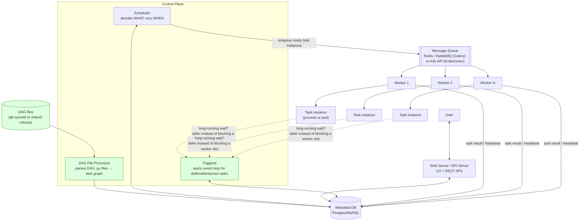

# Task Scheduler Architecture (Apache Airflow)

> Source: slide 9 of `System Design and Architecture.pptx` ("Airflow – A Task Scheduler Architecture"). This is a great generic answer to "design a distributed job scheduler" interview questions, not just an Airflow explainer. The original diagram is accurate for Airflow's *classic* (pre-2.3) architecture; several components that are now core to how Airflow (and any well-built scheduler) actually works in production were missing and are added below.

## 1. Requirements (generalizing beyond just "Airflow")

**Functional**: define jobs as a DAG (directed acyclic graph) of tasks with dependencies, run them on a schedule or trigger, retry failures, expose status/logs to users.

**Non-functional**: no missed or duplicated runs (a task must run *exactly the number of times intended* even across scheduler restarts), horizontally scalable execution, isolation between tasks (one task's crash/resource hog shouldn't take down others), observability.

## 2. High-Level Architecture (extended)

## 3. Why each component exists

| Component | Purpose | Why this design |
|---|---|---|
| **DAG File Processor** | Continuously parses the DAG `.py` files into an in-memory task-dependency graph and syncs it into the Metadata DB. | **Split out from the Scheduler as its own process/component — missing from the original diagram, which had the Scheduler doing this directly.** This separation matters: DAG parsing is CPU/IO-bound Python execution (import user code, evaluate `for` loops that dynamically generate tasks, etc.) and can be **slow or even hang** on a poorly written DAG file; if that work runs inside the Scheduler's own loop, a single bad DAG file can stall scheduling for *every other DAG in the system*. Isolating it protects the Scheduler's core loop. |
| **Scheduler** | The heart of the system: continuously checks which task instances have all dependencies satisfied and are due to run, and enqueues them. | Correctly identified as "critical" in the original. Key point worth stating explicitly: the Scheduler makes decisions based on the Metadata DB's state, not in-memory-only state — this is what makes it safely restartable (crash-recovery reads the same durable state back). |
| **Triggerer** | An async event loop that holds **deferrable** tasks (e.g., "wait until a file appears in S3," "poll an external job for completion") without occupying a full worker slot for the entire wait. | **Entirely missing from the original diagram** — this is one of the most important architectural additions in modern Airflow (2.2+) and directly answers a very common scheduler-design interview question: *"how do you avoid a worker sitting idle for an hour waiting on an external event?"* Instead of a worker process blocking on a poll loop, the task registers an async trigger with the Triggerer (a single process can hold thousands of these cheaply via `asyncio`) and only re-enters the worker queue once the condition is actually met. |
| **Metadata DB** | Single source of truth for DAG definitions, task instance state, and history — what makes the whole system crash-recoverable and auditable. | Postgres/MySQL: relational because task state has real structural relationships (DAG → task → task instance → try number) and needs transactional guarantees (a task must not be picked up by two workers at once — enforced via row-level locking/`SELECT ... FOR UPDATE` on task-instance rows). |
| **Message Queue** | Communication channel between Scheduler and Workers — decouples "task is ready to run" from "a worker is free to run it." | For the **Celery Executor**: Redis/RabbitMQ as the broker, a real-life instance of the same "durable queue decouples producer from consumer" pattern used throughout this document set. For the **Kubernetes Executor**: the "queue" is effectively the Kubernetes API itself — the scheduler directly creates a Pod per task instance instead of publishing to a broker (see §4 for why this distinction matters). |
| **Web Server / API Server** | UI + REST API for humans and external systems to trigger runs, inspect status, view logs. | Reads/writes the Metadata DB; stateless, horizontally scalable behind a LB like any other web tier. |

## 4. Executors — the original's biggest oversimplification, corrected

The source slide names only two: **Sequential** (single-node, dev only) and, generically, "**Distributed Executors**" (Celery/Kubernetes) — without explaining that these two distributed options make **fundamentally different isolation/scaling trade-offs**, which is exactly what an interviewer wants you to articulate:

| Executor | Isolation model | Scaling model | Best for |
|---|---|---|---|
| **Sequential** | None — one task at a time, one process | N/A | Local dev/debugging only |
| **Local** | Multiple tasks as sibling processes on **one machine** | Limited to that machine's CPU/RAM | Small deployments |
| **Celery** | Tasks share long-lived **worker processes** (a worker can run many tasks over its lifetime) | Add more worker *processes/machines*; a fixed worker pool pulls from the shared queue | High task *throughput*, when tasks are broadly similar in resource needs and trusted (they share a runtime/environment) |
| **Kubernetes** | **Every task instance gets its own Pod** — full process, filesystem, and resource-limit isolation, torn down after | Add more K8s cluster capacity; no persistent worker pool to size ahead of time | Heterogeneous or untrusted task workloads, tasks with wildly different dependency/resource needs, or where a noisy/crashing task must never affect any other task's environment |

**The trade-off worth stating explicitly**: Celery is cheaper and faster per-task (no pod startup latency, ~seconds vs. Kubernetes' pod-scheduling overhead) but weaker isolation (all tasks on a worker share its Python environment/dependencies); Kubernetes is stronger isolation and elastic-by-default scaling but pays a per-task startup cost. **This is the same fundamental trade-off** as "thread pool" vs. "process-per-request" in any concurrent system design — recognizing that pattern and naming it is what separates a strong answer from a rote one.

## 5. Handling scale & concurrency

- **Scheduler high availability**: modern Airflow supports running **multiple Scheduler replicas** concurrently, using the Metadata DB's row-level locking to ensure no two schedulers double-schedule the same task instance — this is the answer to "what if your single Scheduler process dies," a near-certain follow-up question given the original diagram only draws one.
- **DAG parsing at scale**: with thousands of DAG files, a single DAG File Processor becomes the bottleneck for *detecting new/changed DAGs quickly* (not for running tasks — that's the Scheduler/Executor's job). Fix: multiple parsing processes, each responsible for a subset of DAG files, and skip re-parsing files whose modification time hasn't changed.
- **Worker scaling**: Celery workers scale horizontally by adding machines that consume from the same broker queue — this is a textbook consumer-group scale-out, identical in shape to Kafka consumer groups used across every other design in this set. Kubernetes Executor scales by cluster autoscaling — new pods simply schedule onto new nodes as capacity is added.
- **Deferrable tasks and the Triggerer's own scale limit**: a single Triggerer process can hold many thousands of deferred tasks cheaply (async I/O, not one OS thread each) — but it should itself be deployed with more than one replica for availability, since if the Triggerer is down, no deferred task can resume even if its condition is met.
- **Backpressure**: if the queue backs up (more ready tasks than worker capacity), tasks simply wait in `queued` state in the Metadata DB — no data loss, just delayed execution, and the Scheduler's own metrics (queue depth, task latency) are the standard alerting signal for "add more workers."

## 6. Bugs / gaps in the original and fixes applied

1. **DAG parsing conflated with the Scheduler's core loop** — split out as a dedicated DAG File Processor to prevent one bad DAG file from stalling the whole system (§3).
2. **Triggerer entirely absent** — added, since it's the standard answer to "how do you not waste a worker slot on a task that's just waiting" (§3).
3. **"Distributed Executors" treated as one undifferentiated category** — replaced with an explicit comparison of Celery vs. Kubernetes executor isolation/scaling trade-offs (§4), since conflating them misses the actual design decision an interviewer is probing for.
4. **No mention of Scheduler high availability / multi-scheduler safety**, despite the original explicitly calling the Scheduler "critical" (single point of failure risk unaddressed) — fixed in §5.
5. **No treatment of DAG-parsing scale as files grow into the thousands** — added in §5.

## 7. Likely interviewer questions

- *"What happens if the Scheduler process crashes mid-run?"* → all state lives in the Metadata DB, not in the Scheduler's memory; on restart (or via a second concurrent scheduler replica) it reads durable state and resumes — no in-flight task's completion is lost, though a task that was mid-execution on a worker at crash time needs its own separate retry/heartbeat-timeout handling on the worker side (§5).
- *"How would you avoid one buggy DAG file (e.g., an infinite loop at import time) from breaking scheduling for every other pipeline?"* → isolate DAG parsing into its own process/pool, separate from the Scheduler's scheduling loop (§3).
- *"A task needs to wait up to 6 hours for an external file to land in S3 — how do you not tie up a worker the whole time?"* → defer the task to the Triggerer's async event loop instead of blocking a worker; the task only re-queues once the trigger condition fires (§3).
- *"Celery or Kubernetes executor, and why?"* → isolation vs. per-task startup-cost trade-off (§4) — a homogeneous, trusted, high-throughput workload favors Celery; heterogeneous/untrusted/bursty workloads favor Kubernetes' per-pod isolation and elastic scaling.
- *"How do you guarantee a task doesn't run twice if two scheduler replicas both see it as 'ready' at the same instant?"* → row-level locking (`SELECT ... FOR UPDATE`-style claim) on the task-instance row in the Metadata DB, so only one scheduler successfully claims and enqueues it (§5).
