# Stock Price Provider — Revised Robust Architecture

## 1. Core Architectural Decision

The system has two independent routing problems:

1. **Market-data routing**
   - `ticker → Kafka partition → distribution worker`

2. **Client connection routing**
   - `client → load balancer → WebSocket gateway`

These must remain independent.

> **A client should normally maintain one WebSocket connection, regardless of how many symbols it subscribes to or how many Kafka partitions contain those symbols.**

The client never needs to know which Kafka partition or worker owns a symbol.

---

## 2. High-Level Architecture

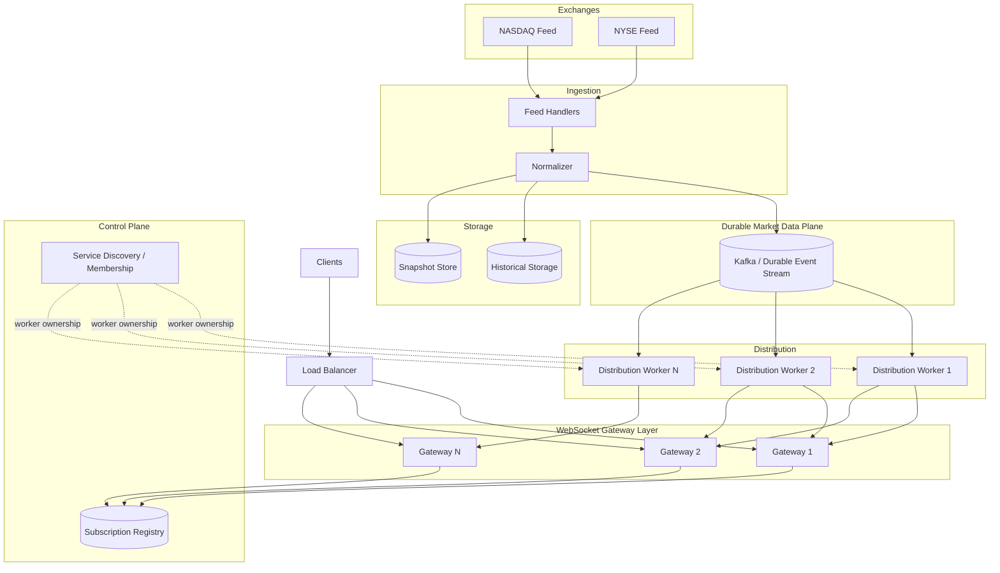

The important point is that the arrows from workers to gateways are **not fixed ownership relationships**. Any gateway can receive data for symbols owned by any worker.

---

# 3. Client Perspective

The client sees a very simple API.

The client connects:

```text
Client
   |
   | WebSocket
   v
Load Balancer
   |
   v
Gateway 4
```

Then sends:

```json
{
  "type": "subscribe",
  "symbols": ["AAPL", "MSFT", "TSLA"]
}
```

The client does **not** need to know:

```text
AAPL -> Kafka partition 3 -> Worker A
MSFT -> Kafka partition 7 -> Worker B
TSLA -> Kafka partition 12 -> Worker C
```

The client simply receives:

```text
AAPL 227.31
MSFT 512.40
TSLA 338.20
AAPL 227.32
TSLA 338.18
```

over the same WebSocket connection.

---

# 4. One WebSocket Per Client

The recommended model is:

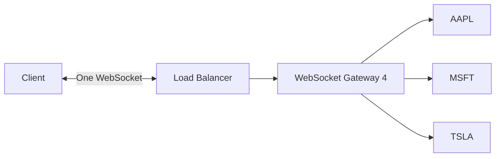

Do **not** make the client open one WebSocket per Kafka worker.

Bad:

```text
Client
 ├── WebSocket → Gateway A
 ├── WebSocket → Gateway B
 ├── WebSocket → Gateway C
 └── WebSocket → Gateway D
```

This would couple the client to internal infrastructure.

It also becomes problematic when:

- Kafka partitions rebalance.
- Workers fail.
- Workers are added.
- Symbols move between workers.
- The number of workers changes.
- A client subscribes to hundreds of symbols.

Preferred:

```text
Client
   |
   | one WebSocket
   v
Gateway 4
   |
   +-- AAPL
   +-- MSFT
   +-- TSLA
   +-- NVDA
   +-- META
```

---

# 5. Two Independent Routing Problems

## Market-data routing

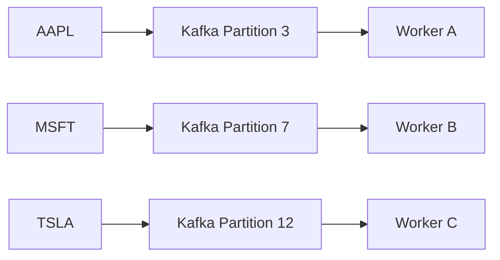

This determines **where market data is processed**.

## Client routing

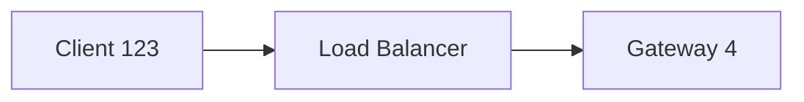

This determines **where the client's WebSocket lives**.

These two mappings should never be treated as the same thing.

---

# 6. How Gateway 4 Gets Data From Multiple Workers

Suppose:

```text
AAPL → Partition 3 → Worker A
MSFT → Partition 7 → Worker B
TSLA → Partition 12 → Worker C
```

while:

```text
Client 123 → Gateway 4
```

The subscription registry records:

```text
AAPL → Gateway 4
MSFT → Gateway 4
TSLA → Gateway 4
```

The workers process their Kafka partitions independently.

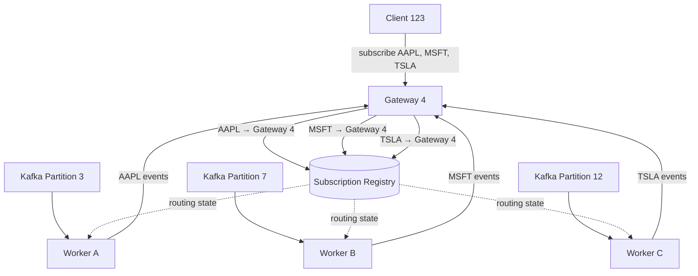

The gateway acts as the client's aggregation point.

The client remains unaware of the internal topology.

---

# 7. Subscription Registry

The subscription registry is a control-plane component.

Conceptually:

```text
AAPL → Gateway 4, Gateway 8
MSFT → Gateway 4
TSLA → Gateway 2, Gateway 9
NVDA → Gateway 4, Gateway 7
```

It answers:

> Which gateways currently have clients interested in this ticker?

Redis is a reasonable implementation for this kind of ephemeral routing state.

However:

> Redis must not be the source of truth for market events.

Redis may contain:

```text
ticker → interested gateways
gateway → subscribed tickers
gateway → heartbeat
```

But not the authoritative tick history.

---

# 8. Worker-to-Gateway Communication

A worker must be able to deliver events to **any gateway that currently has a subscriber for the worker's ticker**.

For example:

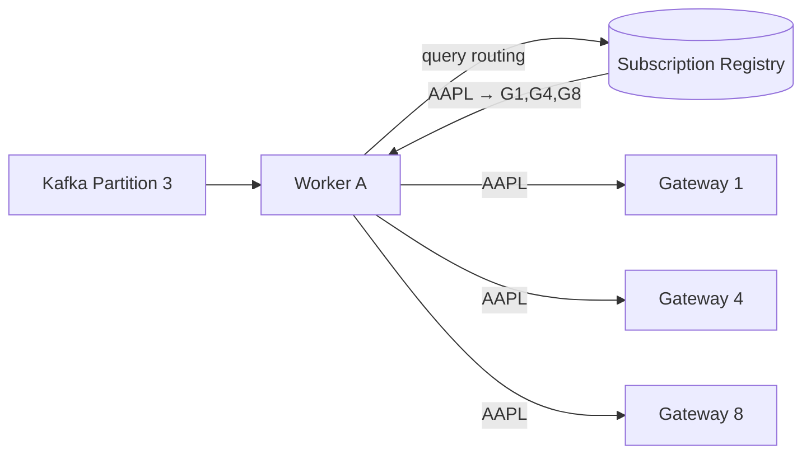

The worker does not own the gateways.

It owns the **Kafka partition**.

The subscription registry determines which gateways need its events.

---

# 9. Avoid a Fixed Worker → Gateway Topology

Do not build this:

```text
Worker A → Gateway A
Worker B → Gateway B
Worker C → Gateway C
```

because it creates artificial coupling.

Instead:

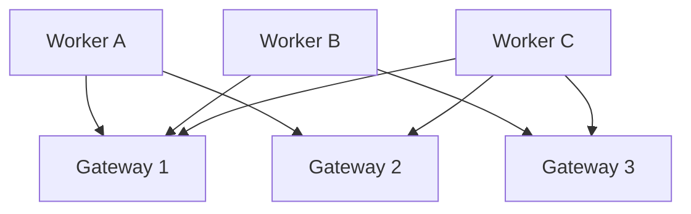

Any worker can deliver to any gateway.

In a large deployment, this should be implemented through an efficient routing/fanout mechanism rather than uncontrolled direct connections between every worker and every gateway.

---

# 10. Rebalancing

Suppose initially:

```text
AAPL → Partition 3 → Worker A
```

Gateway 4 has a subscriber:

```text
Gateway 4 → AAPL
```

Now Worker A dies.

Kafka rebalances:

```text
AAPL → Partition 3 → Worker C
```

The client does not reconnect.

The routing state still says:

```text
AAPL → Gateway 4
```

Only the Kafka consumer ownership changed.

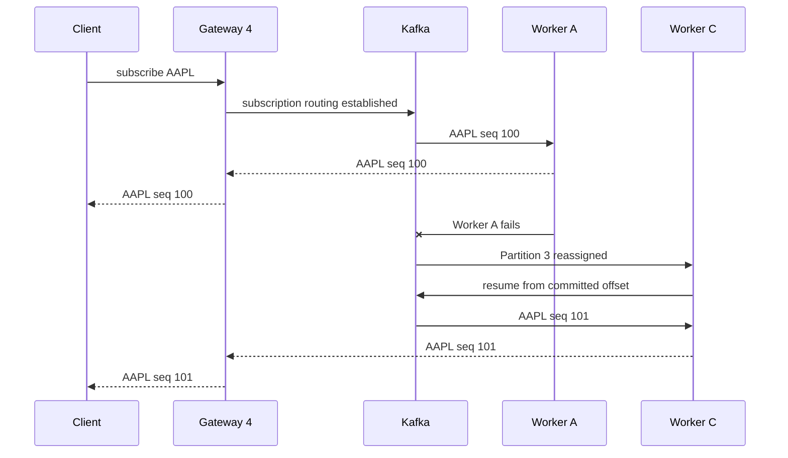

From the client's perspective:

```text
AAPL 100
AAPL 101
```

There is no concept of "Worker A" in the client protocol.

---

# 11. Gateway Failure

The same principle works in reverse.

Initially:

```text
Client 123 → Gateway 4
```

and:

```text
AAPL → Gateway 4
MSFT → Gateway 4
```

Gateway 4 crashes.

The load balancer sends the reconnect to Gateway 9:

```text
Client 123 → Gateway 9
```

The client resends:

```json
{
  "type": "subscribe",
  "symbols": ["AAPL", "MSFT"]
}
```

The registry becomes:

```text
AAPL → Gateway 9
MSFT → Gateway 9
```

Kafka ownership does not need to change.

---

# 12. Recommended Connection Lifecycle

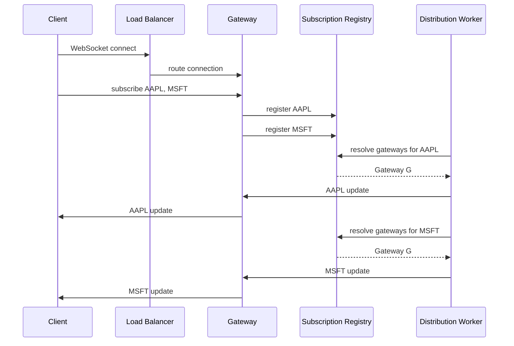

---

# 13. Scaling the Gateway Layer

Suppose there are:

```text
10 million clients
```

The system might have:

```text
1000 WebSocket gateways
```

Each client is assigned to one gateway.

For example:

```text
Client 1     → Gateway 1
Client 2     → Gateway 1
Client 3     → Gateway 2
...
Client N     → Gateway 817
```

The gateway is responsible for maintaining its connected clients.

The market-data workers do not need to know individual client connections.

They only need to know:

```text
AAPL → Gateway 1, Gateway 12, Gateway 817
```

This greatly reduces routing state.

---

# 14. Gateway-Level Subscription Aggregation

A useful optimization is to aggregate subscriptions at the gateway.

Suppose Gateway 4 has:

```text
Client 1 → AAPL
Client 2 → AAPL
Client 3 → AAPL
Client 4 → MSFT
Client 5 → MSFT
```

The gateway should register:

```text
Gateway 4 → AAPL
Gateway 4 → MSFT
```

not five separate upstream subscriptions.

Then when Worker A sends:

```text
AAPL seq 100
```

Gateway 4 fans it out locally:

```text
AAPL seq 100
    |
    +→ Client 1
    +→ Client 2
    +→ Client 3
```

This is an important scalability optimization.

---

# 15. Final Recommended Topology

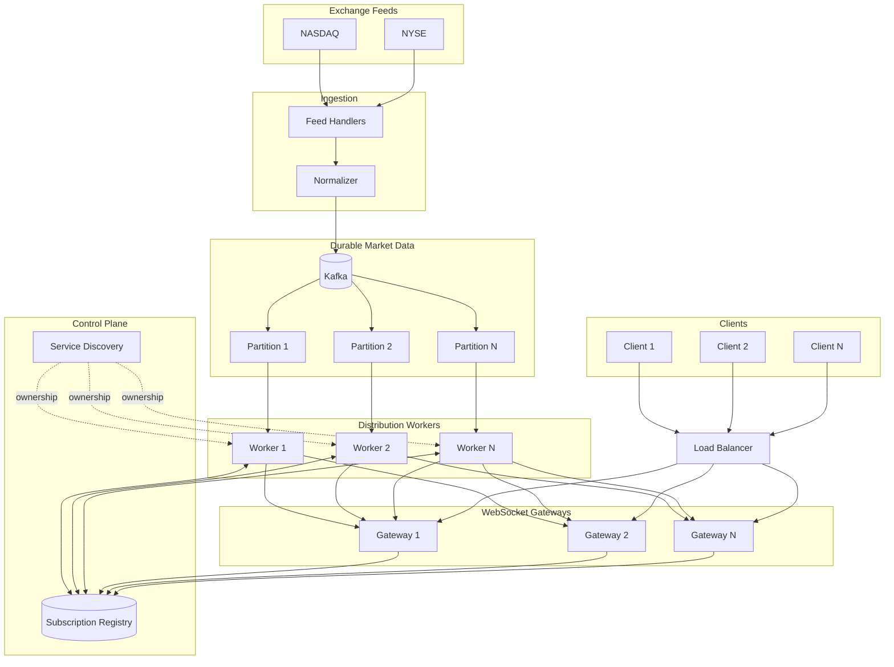

---

# 16. Important Scaling Caveat

The conceptual model above has:

```text
Worker → Gateway
```

but at very large scale, implementing arbitrary direct connections between every worker and every gateway can create an expensive mesh.

For example:

```text
1000 workers × 1000 gateways
= potentially 1,000,000 relationships
```

Therefore, at large scale, introduce an explicit **realtime routing/fanout layer**.

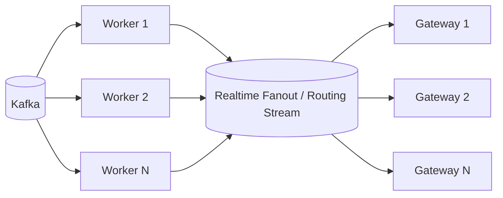

The exact implementation can vary.

The important architectural property is:

> **Workers own market-data partitions; gateways own client connections; a routing layer bridges the two.**

---

# 17. Event Schema

Every event should carry sequence information.

```json
{
  "ticker": "AAPL",
  "exchange": "NASDAQ",
  "sequence": 183928123,
  "exchange_timestamp": "2026-08-24T05:49:03.123Z",
  "receive_timestamp": "2026-08-24T05:49:03.125Z",
  "price": 227.13,
  "size": 100
}
```

Use:

> At-least-once delivery + idempotency/deduplication.

Do not make the entire distributed pipeline exactly-once.

---

# 18. Snapshot + Incremental Updates

A new subscription should receive a current snapshot followed by incremental events.

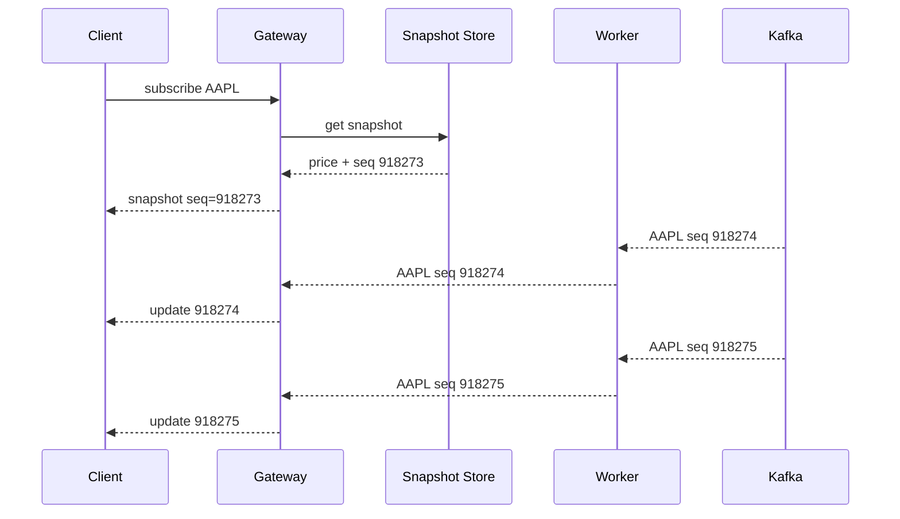

This allows a client to recover cleanly after reconnecting.

---

# 19. Backpressure

A gateway must protect itself from slow clients.

For a latest-price use case:

```text
227.10
227.11
227.12
227.13
227.14
```

can potentially be coalesced for a slow client into:

```text
227.14
```

For a full tick stream, events cannot silently be dropped.

The protocol should define whether a subscription is:

- Latest-state.
- Full event stream.
- Order-book snapshot + delta stream.

These have different delivery guarantees.

---

# 20. Historical Storage

Keep historical storage separate from realtime delivery.

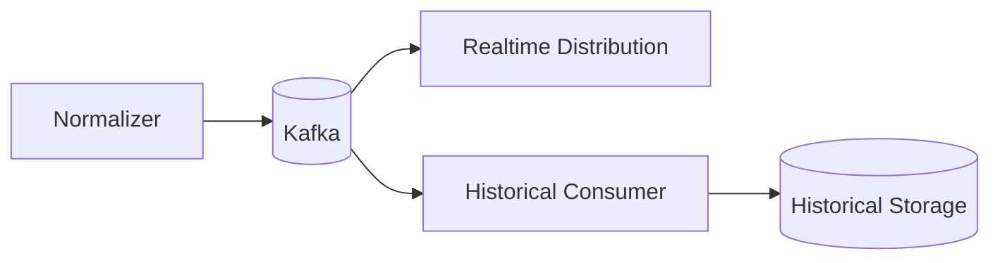

Kafka is the durable realtime event backbone.

Historical storage is optimized independently for large append-heavy/time-series workloads.

---

# 21. Failure Boundaries

A robust system should behave approximately like this:

| Failure | Expected behavior |
|---|---|
| Exchange connection fails | Feed handler reconnects/replays |
| Feed handler fails | Another handler takes over |
| Kafka broker fails | Kafka replication preserves stream |
| Worker fails | Consumer group rebalances |
| Redis/subscription registry fails | Market ingestion continues |
| Worker ↔ gateway route fails | Routing is recreated |
| Gateway fails | Client reconnects to another gateway |
| Client is slow | Backpressure/coalescing/disconnect policy |
| Client misses events | Sequence gap detection + replay |
| Historical DB fails | Realtime distribution continues |

The critical principle is:

> A failure in the client delivery plane should not cause loss of the underlying market data.

---

# 22. Final Mental Model

Think of the architecture as three independent planes.

### 1. Market Data Plane

```text
Exchange
   ↓
Feed Handler
   ↓
Normalizer
   ↓
Kafka
   ↓
Partition
   ↓
Worker
```

### 2. Client Connection Plane

```text
Client
   ↓
Load Balancer
   ↓
WebSocket Gateway
```

### 3. Routing / Control Plane

```text
Subscriptions
      ↓
Subscription Registry
      ↓
Which gateway needs which ticker?
      ↓
Routing / Fanout
```

Together:

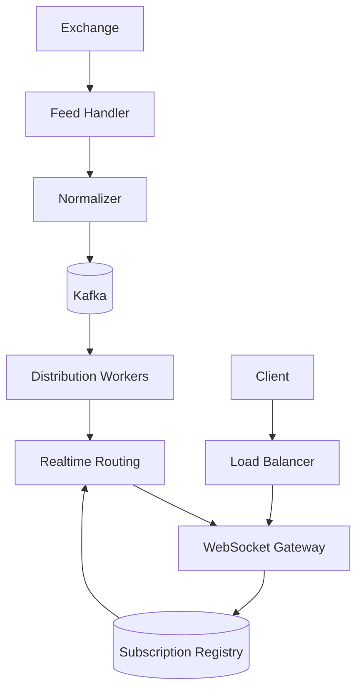

The client sees only:

```text
Client
   |
   | One WebSocket
   |
Gateway
   |
   +-- AAPL
   +-- MSFT
   +-- TSLA
```

Everything below the gateway is an internal implementation detail.

---

# 23. Implementation Reference: Node.js & Socket.IO Gateway

The gateway-level subscription aggregation described in Section 14 can be implemented concretely using Node.js and Socket.IO. This section shows one way to do it.

## 23.1 Socket.IO Rooms as Ticker Subscriptions

Instead of maintaining a manual mapping of sockets to tickers, the gateway leverages **Socket.IO Rooms**, treating each ticker symbol as a room (e.g., room `"AAPL"`, room `"TSLA"`).

- **Subscribe:** the client's socket joins the corresponding room via `socket.join(symbol)`.
- **Unsubscribe:** the socket leaves the room via `socket.leave(symbol)`, or leaves automatically on disconnect.
- **Local fanout:** when a tick arrives at the gateway, it is broadcast to everyone in that room with `io.to(symbol).emit("tick", data)`.

## 23.2 Aggregation State Flow

```text
Client 1 ──(Sub AAPL)──┐
Client 2 ──(Sub AAPL)──┼──> Node.js Gateway 4 ──(First AAPL Sub?)──> Subscription Registry
Client 3 ──(Sub AAPL)──┘          │ (Join Room)                             (AAPL -> Gateway 4)
                                  ▼
                        Socket.IO Room "AAPL"
```

The gateway only talks to the central Subscription Registry when a ticker transitions from **0 → 1** local subscribers (register interest) or **1 → 0** local subscribers (deregister interest). Every subscriber in between is handled purely by the local room.

## 23.3 Managing Subscriptions and Registry Updates

```javascript
// Node.js / Socket.IO Gateway Implementation Example
io.on("connection", (socket) => {
  socket.on("subscribe", async (symbols) => {
    for (const symbol of symbols) {
      // 1. Join the Socket.IO room locally
      socket.join(symbol);

      // 2. Register with Subscription Registry only if this is the FIRST client on this Gateway
      const room = io.sockets.adapter.rooms.get(symbol);
      if (room && room.size === 1) {
        await redisRegistry.sadd(`ticker:${symbol}:gateways`, GATEWAY_ID);
      }
    }
  });

  socket.on("disconnecting", async () => {
    // Clean up empty rooms when a client disconnects
    for (const symbol of socket.rooms) {
      if (symbol === socket.id) continue; // Skip socket's private room

      const room = io.sockets.adapter.rooms.get(symbol);
      // Deregister from Subscription Registry if this was the last client on this Gateway
      if (room && room.size === 1) {
        await redisRegistry.srem(`ticker:${symbol}:gateways`, GATEWAY_ID);
      }
    }
  });
});
```

## 23.4 Receiving and Fanning Out Ticks

Distribution Workers query the Subscription Registry to determine which gateways require updates for a given ticker. Upon receiving data from a worker (via Redis Pub/Sub, NATS, gRPC, or direct TCP), the gateway fans it out locally:

```javascript
// Handling incoming updates from Distribution Workers / Real-Time Fanout Layer
onMarketDataReceived((tick) => {
  // Payload: { ticker: "AAPL", price: 227.13, sequence: 183928123, ... }

  // Instant local fanout to all clients in the corresponding room
  io.to(tick.ticker).emit("tick", tick);
});
```

## 23.5 Key Architectural Advantages

1. **Efficient local fanout** — Socket.IO handles room lookups in O(1) within the Node.js event loop, so workers never need knowledge of individual client connections.
2. **Control-plane load reduction** — even if 10,000 clients on Gateway 4 watch AAPL, the central registry only records `AAPL → Gateway 4` once.
3. **Resilience to infrastructure failures** — internal Kafka partition rebalancing or distribution worker failures leave Socket.IO rooms on the gateway untouched, so end users see zero disconnects or interruptions.

---

# 24. Key Conclusions

1. **One client should normally use one WebSocket.**
2. The client must never need to know Kafka partitions or workers.
3. **Ticker ownership and connection ownership are separate.**
4. Kafka workers own partitions, not clients.
5. Gateways own WebSocket connections, not Kafka partitions.
6. A subscription registry maps active ticker subscriptions to gateways.
7. A gateway aggregates subscriptions from many clients.
8. Workers deliver events to whichever gateways currently need them.
9. Kafka rebalancing must be invisible to clients.
10. Gateway failure should cause client reconnect, not Kafka reconfiguration.
11. At large scale, use a dedicated realtime routing/fanout layer to avoid a worker×gateway mesh.
12. Sequence numbers, replay, snapshots, and backpressure are required for robust realtime delivery.

> **The client-facing abstraction should be "one WebSocket, many symbol subscriptions." The Kafka partitioning and worker topology should remain completely hidden behind the gateway layer.**
