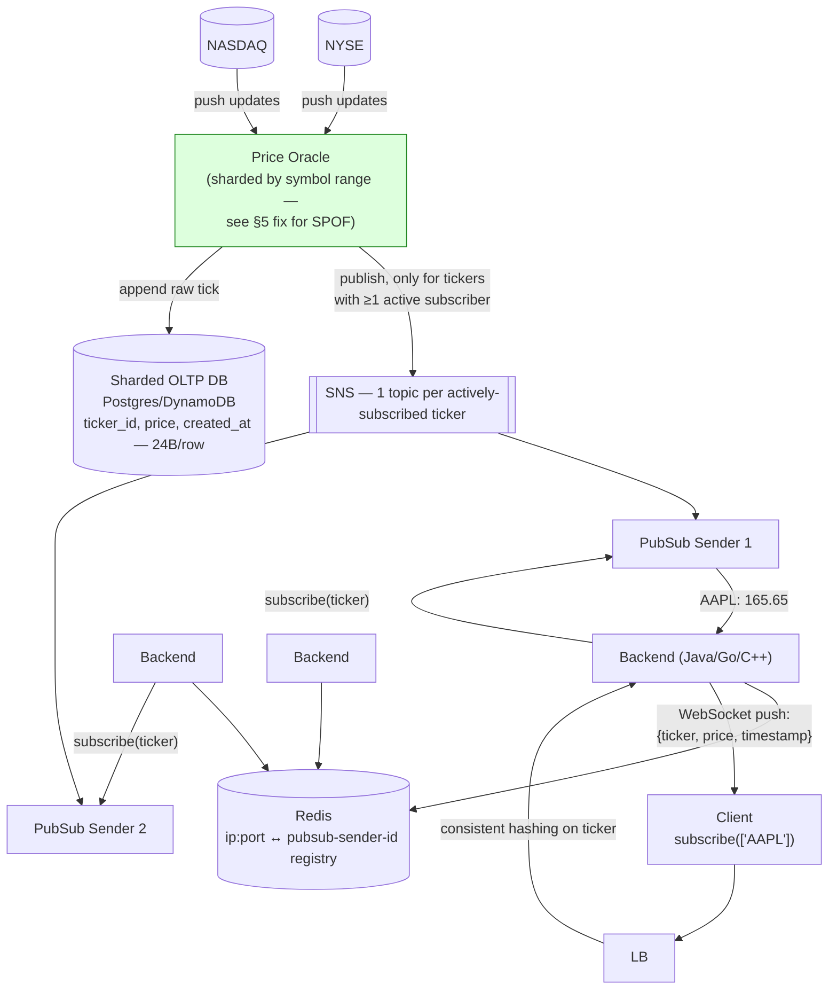
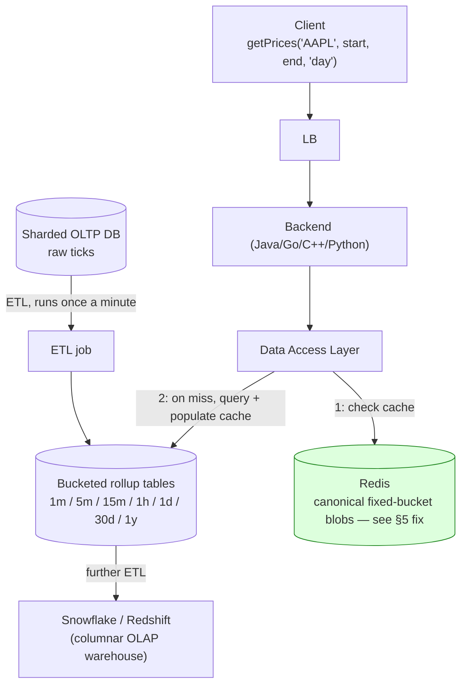

# Real-Time Stock/Crypto Price Feed (Online Brokerage) System Design

> Source: slide 10 of `System Design and Architecture.pptx` ("Online Price Feed"). This was the densest hand-drawn diagram in the deck (a single whiteboard-style image covering both a live streaming path and a historical-data API), rebuilt below as two Mermaid flowcharts. The core architecture is sound and matches real-world market-data distribution patterns; a genuine data-modeling bug (missing OHLC fields) and a cache-design flaw are fixed in §5.

## 1. Requirements (as stated on the original slide)

**Functional**: (a) feed live prices in real time to a list of subscribed consumers; (b) provide a historical price data API at configurable granularity (1m, 5m, 15m, 1h, 1d, 30d, 1y).

**Non-functional**: real-time path needs low latency (a stale quote is a wrong quote); must scale to many concurrent subscribers per ticker and many tickers; horizontal scaling must be the default growth strategy (explicitly called out in the source: *"Horizontal Scaling — scales with number of hosts; Vertical Scaling — scales with resources per host"*).

## 2. Real-time streaming path



### Why each component exists

| Component | Purpose | Why this tech |
|---|---|---|
| **Price Oracle** | Single ingestion point for exchange feeds (NYSE/NASDAQ), normalizes them into one internal event shape. | Exchange feeds are their own specialized, extremely high-throughput protocols in reality (multicast SIP/CQS/CTS feeds) — the Price Oracle is the boundary that translates "exchange-native format" into "our internal price-update event," so nothing downstream needs to know exchange wire formats. |
| **SNS, one topic per *actively-subscribed* ticker (not every ticker)** | Fan-out mechanism from "a price changed" to "every backend node that has a subscriber for it." | The clever, non-obvious optimization already present in the original design: with ~8,000+ US-listed tickers but typically far fewer with live subscribers at any moment, **lazily creating a topic only when the first client subscribes** keeps SNS topic/throughput usage proportional to actual demand, not market size — this is what makes SNS viable here instead of drowning it in whole-market tick volume (see §6 for why *not* doing this would be a problem). |
| **PubSub Senders (10K subscriptions/host)** | Intermediary that turns "an SNS message arrived" into "push it to whichever backend node(s) actually hold sockets for subscribers of this ticker." | Kept from the source with its own stated capacity formula: `hosts_needed = total_subscriptions / 10,000`. |
| **Consistent hashing (ticker → backend node)** | Co-locates all WebSocket clients subscribed to the same ticker onto (as much as possible) the same backend node(s). | This is *why* the fan-out is cheap: a price update for AAPL only needs to reach the specific backend nodes actually holding AAPL subscribers, not be broadcast to the entire backend fleet — the same "route by key so only the relevant shard does work" principle used by the Twitter Graph Service and the Web Crawler's host-based queue routing elsewhere in this document set. |
| **Redis (sender registry)** | Maps `client → which pubsub sender/backend is serving them`, exactly analogous to the Session Manager in the WhatsApp design. | Same justification as that design: high-churn, latency-critical key-value lookup, wrong fit for a relational store. |
| **Sharded OLTP DB (Postgres/DynamoDB)** | Durable record of every raw tick, source for the rollup ETL described in §3. | Sharded by ticker (implied by "Sharded DB" in the source) so write load for any single hot symbol (e.g., a meme-stock spike) doesn't bottleneck the whole feed on one shard. |

## 3. Historical price API & rollup path



### Why each component exists

| Component | Purpose | Why this tech |
|---|---|---|
| **ETL, once a minute, into granularity-specific bucket tables** | Pre-aggregates raw ticks into OHLCV-style rollups at each granularity so the read API never has to scan/aggregate raw ticks on the fly. | Same "pre-compute for a read-heavy path" principle used in the Twitter Timeline design — a chart query for "1 year of daily bars" should read ~365 pre-aggregated rows, not aggregate millions of raw ticks per request. |
| **Snowflake/Redshift (columnar OLAP)** | Long-horizon historical/analytical queries (e.g., backtesting, reporting) over the rolled-up data. | Columnar storage — see the companion [ETL vs. ELT design](06-etl-elt-data-pipeline.md) for the full justification (I/O scales with columns touched, better compression); this design is a direct real-world application of that document's "why columnar for analytics" argument. |
| **Data Access Layer + Redis cache-aside** | Serve repeat queries (e.g., many users loading the same popular ticker's daily chart) without re-hitting the bucket tables every time. | Cache-aside is correct in principle — but the original key scheme has a real flaw, fixed in §5. |

## 4. Client-facing protocols (from the original slide, kept — they're correct)

**Streaming subscribe** (WebSocket):
```
→ subscribe(['AAPL'])
← [update] { "ticker": "AAPL", "price": 165.65, "timestamp": 1717000000 }
```
A keep-alive connection is maintained; the server pushes an `[update]` frame whenever the subscribed ticker's price changes — correct real-time push model, no client polling.

**Historical query** (REST):
```
getPrices(ticker_id: str, start_time: timestamp, end_time: timestamp, granularity: enum) → [{day 1 bar}, {day 2 bar}, ...]
```

## 5. Bugs / gaps in the original and fixes applied

1. **Missing High/Low in the rollup schema — a real data-modeling bug, not just a nice-to-have.** The original bucket-table schema (`start_id_of_events, end_id_of_events, ticker_id, start_price, end_price, volume, created_at`, 46 bytes/row) only captures **open** (`start_price`) and **close** (`end_price`). Standard financial charting (candlesticks) requires **OHLC — Open, High, Low, Close** plus Volume. **You cannot reconstruct the High/Low of a time bucket after the fact without re-scanning every raw tick in that window** — the whole point of the rollup is to avoid ever doing that scan again. *Fix:* add `high_price DECIMAL(10)` and `low_price DECIMAL(10)` to the bucket schema (46 → 66 bytes/row), computed once during the minute-ETL pass while raw ticks are still cheaply available, exactly like the other aggregates. This must be caught **at ETL design time** — it's not something you can patch later without a costly raw-data backfill/replay.
2. **Historical cache keys embed the arbitrary client-requested range** (`ticker:granularity:start:end`) directly. This means two users asking for slightly different (but overlapping) date ranges of the *same* ticker/granularity **never share a cache hit**, and the key space grows unboundedly with every distinct query ever made — a real cache-design flaw, not a stylistic nitpick. *Fix:* cache at **canonical fixed buckets** independent of the request (e.g., one blob per calendar day for `minute` granularity, one per month for `day` granularity), and have the Data Access Layer assemble the client's requested range by fetching and concatenating/trimming the relevant canonical buckets. This turns "every unique query is a fresh cache slot" into "every calendar day is one reusable cache slot," which is what makes the cache-hit-rate math in §6 actually work.
3. **Price Oracle is drawn as a single logical box ingesting the entire market feed — an unaddressed single point of failure and throughput bottleneck.** *Fix:* shard Price Oracle instances by symbol range (the same consistent-hashing idea already used for backend/pubsub routing), so no single instance must absorb whole-market tick volume, and a crashed shard only affects its symbol range, not the whole feed.
4. **No slow-consumer / backpressure handling stated for the WebSocket fan-out.** A client with a slow network connection can't drain updates as fast as a hot ticker ticks — without a bound, its per-connection send buffer grows unboundedly. *Fix:* bound each connection's outbound buffer and apply a **coalescing policy** on overflow (drop-and-replace-with-latest, since a stale intermediate price is worthless once a newer one exists — unlike a chat message, you never need to deliver *every* historical tick to a live subscriber, only the current price) rather than either blocking the publisher or unbounded buffering.

## 6. Handling scale & concurrency

- **Lazy SNS topic creation (only for actively-subscribed tickers)** is the single biggest scale lever in the streaming path — without it, publishing whole-market tick volume (thousands of symbols × several updates/sec each) into SNS would likely exceed AWS SNS's per-account/per-topic throughput quotas; scoping topics to actual demand keeps this tractable.
- **Consistent hashing of tickers to backend/pubsub nodes** bounds fan-out cost per update to "the handful of nodes actually serving this ticker's subscribers," not the whole fleet — this is what makes horizontal scaling (stated as the goal in the source slide) actually linear: add backend nodes, and each new node only needs to know about the ticker shard(s) hashed to it.
- **Backend WebSocket capacity is capped at a conservative 50K connections/host in the source material — deliberately lower than the ~2M/host figure cited for WhatsApp in [the chat system design](02-whatsapp-chat-system.md), and that's *correct*, not a contradiction:** WhatsApp's number is for mostly-idle sockets waiting for occasional messages; here, *every* open connection can receive frequent price updates (a hot ticker might tick many times per second), so **per-connection CPU (JSON serialization) and outbound bandwidth**, not just idle memory/FD count, become the binding constraint much sooner. State this distinction explicitly if an interviewer asks "why is this number so much lower than X" — it shows you understand *why* a capacity ceiling exists, not just that one was stated.
- **Sharded OLTP DB by ticker** means a single trending/meme-stock symbol's write volume is isolated to its shard, protecting the rest of the market's ingestion latency — call out the risk of *shard hotspotting* on an unusually active single symbol as the residual scaling risk this doesn't fully solve (may need sub-sharding or dedicated capacity for known high-volume symbols like index ETFs).
- **Minute-granularity ETL cadence** bounds staleness of rollup tables to ~1 minute — acceptable for charting, not for the live feed (which bypasses rollups entirely via the streaming path) — worth stating explicitly that these are two deliberately different latency tiers serving two different use cases (live trading UI vs. historical charting).

## 7. Capacity / bandwidth estimate

Assume **8,000 actively traded US-listed tickers**, with an average of **500 concurrently-subscribed clients per actively-watched ticker** during market hours, and average tick rate of **2 updates/sec per actively-traded ticker** during normal trading (spiking far higher at open/close — provision for that peak, not the average):

- **Fan-out volume**: 8,000 tickers × 2 updates/sec × 500 subscribers ≈ **8M WebSocket pushes/sec** at peak across the whole fleet. At ~50K connections/host and assuming pushes are spread proportionally to connections held, this requires on the order of `total_subscribers ÷ 50,000` backend hosts just for connection capacity — but the *push-volume* number above is what actually sizes CPU/NIC per host, reinforcing why 50K/host (not a much higher number) is the right conservative planning constant here (§6).
- **Per-update payload**: `{"ticker":"AAPL","price":165.65,"timestamp":1717000000}` ≈ **~60 bytes** JSON. At 8M pushes/sec peak ≈ **~480 MB/s** aggregate egress bandwidth across the backend fleet — a large number, and the concrete reason the design fans updates out to *only* nodes holding relevant subscribers rather than broadcasting every tick to every node.
- **Raw tick storage**: 8,000 tickers × 2 ticks/sec × 24 bytes/row (source's own stated row size) × 6.5 trading hours/day × 3600s ≈ **8,000 × 2 × 24 × 23,400 ≈ ~9 GB/day** raw tick storage — modest, and easily handled by the sharded OLTP tier.
- **Rollup storage (with the OHLC fix, 66 bytes/row)**: for the 1-minute table alone: 8,000 tickers × 390 trading-minutes/day × 66 bytes ≈ **~206 MB/day** — trivial; the coarser tables (5m, 15m, 1h, 1d, ...) are each proportionally smaller, confirming that pre-aggregation, not raw-tick storage, is what keeps this system's storage footprint small relative to its query load.
- **Redis historical cache hit-rate payoff**: with the canonical-bucket fix (§5.2), a single popular ticker's "1 day of minute bars" blob is computed and cached **once**, then reused by every subsequent request for that day/ticker/granularity combination — versus the original design's effectively 0%-reuse arbitrary-range keys, this is the difference between the cache doing meaningful work and the cache being close to useless in practice.

## 8. Likely interviewer questions

- *"Why does the streaming path use SNS instead of Kafka, when other designs in this set use Kafka everywhere?"* → SNS's push-based pub/sub model with per-topic subscriber fan-out matches this use case (many independent subscribers per key, lazily created), and the design deliberately scopes topic creation to *actively subscribed* tickers to stay within reasonable throughput — but flag that at true whole-market scale (not just actively-watched symbols), a partitioned Kafka topic keyed by ticker would be a defensible/likely-better alternative, worth naming as a trade-off rather than a fixed answer (§2, §6).
- *"Your historical bar data only has open/close — what's missing, and why does it matter?"* → High and Low, and it matters because you cannot backfill them later without re-scanning raw ticks — this must be caught at rollup design time (§5.1). This is a strong "did you actually understand the data model, not just draw boxes" question.
- *"Two users request slightly different but overlapping date ranges — does your cache help the second one?"* → not with range-embedded keys (original flaw); yes with canonical fixed-bucket keys that the Data Access Layer assembles from (§5.2).
- *"What happens to a client with a slow network connection during a fast-moving market?"* → bounded per-connection buffer with drop-and-replace-with-latest coalescing, since only the current price matters to a live subscriber, unlike a chat message that must never be dropped (§5.4) — good contrast to draw with the WhatsApp design's very different "never drop a message" requirement.
- *"How is 'ticker → node' routing decided, and why does it matter for scale?"* → consistent hashing, so a price update's fan-out cost is bounded to the handful of nodes actually serving that ticker's subscribers rather than broadcast to the whole fleet — the same pattern as host-routing in the Web Crawler design and follow-graph sharding in the Twitter design (§2, §6).
- *"Why is the connection-per-host number so much lower here (50K) than in the WhatsApp design (millions)?"* → per-connection CPU/bandwidth cost from frequent pushes dominates before raw connection-slot memory does, unlike a mostly-idle chat socket (§6) — a good opportunity to cross-reference and contrast the two designs.
