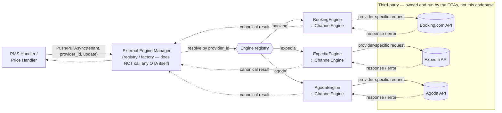
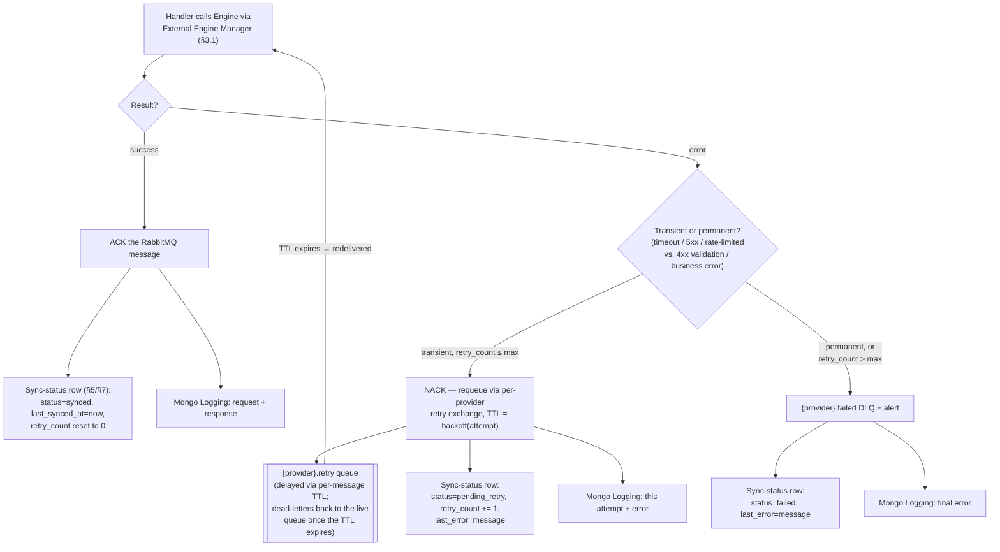

# Optima — Hotel Channel Manager / OTA Distribution System

> An architecture reference for the system: what each component does, why each technology was chosen, how multi-tenancy and data isolation work, how to add support for a new 3rd-party OTA provider, and how data/sync state is tracked — plus a set of concrete improvements worth adopting (§9).

## 1. What this system does

This is a **hotel Channel Manager**: it sits between a property's own management systems (PMS, CRM, Finance) and the external booking channels (**Booking.com, Expedia, Agoda**), keeping room availability, rates, and reservations in sync in both directions — pushing rate/availability updates *out* to each OTA, and pulling new reservations/cancellations *in* from them. This is a well-established category of hospitality software; the design below reflects the standard shape of that problem (multi-provider fan-out with per-provider adapters), not anything specific to a particular vendor.

## 2. Architecture

```mermaid
flowchart TD
    subgraph Clients["Client channels"]
    WebBrowser["Web Browser"]
    Phone["Phone / mobile app"]
    ApiUser["API USER<br/>(trusted partner / system-to-system)"]
    end

    WebBrowser & Phone --> LB["LB"]
    LB --> WebApp["Web App<br/>(frontend)"]
    LB --> Core

    subgraph Core["Core API service (C#/.NET)"]
    direction TB
    subgraph CrmMod["CRM module"]
    ApiCrm["API CRM<br/>(internal impl. — free to change)"]
    ExtCrm{{"EXT<br/>stable public contract"}}
    ApiCrm --- ExtCrm
    end
    subgraph PmsMod["PMS module"]
    ApiPms["API PMS<br/>(internal impl. — free to change)"]
    ExtPms{{"EXT<br/>stable public contract"}}
    ApiPms --- ExtPms
    end
    subgraph FinMod["Finance module"]
    ApiFinance["API FINANCE<br/>(internal impl. — free to change)"]
    ExtFinance{{"EXT<br/>stable public contract"}}
    ApiFinance --- ExtFinance
    end
    ExtCrm <-->|"cross-module calls go<br/>through EXT only"| ExtPms
    ExtPms <-->|"e.g. reservation → folio"| ExtFinance
    ExtCrm <--> ExtFinance
    end

    ApiUser -->|"external callers also only<br/>ever see EXT, never internals"| ExtFinance

    Core -->|"Events: reservation/rate/guest changed"| RMQ[["RabbitMQ"]]
    Core --> SqlDB[("SQL DB<br/>system of record")]
    Core --> MongoLog[("Mongo Logging<br/>audit / integration trail")]

    RMQ --> Handlers

    subgraph Handlers["Distribution handlers"]
    direction TB
    PmsHandler["PMS HANDLER<br/>availability / reservations"]
    PriceHandler["PRICE HANDLER<br/>rates (higher frequency)"]
    end

    Handlers -->|"delegate provider-specific formatting"| EngineMgr["External Engine Manager<br/>(adapter registry)"]
    EngineMgr <--> OTACloud

    subgraph DMZ["DMZ — only zone with a network path to/from the OTAs"]
    direction TB
    Gateway["Gateway<br/>outbound auth, per-provider rate limit, circuit breaker"]
    InboundSync["Inbound Sync Service<br/>writes SQL DB directly, publishes fan-out<br/>task to RabbitMQ (excludes originating provider)"]
    Gateway -->|"inbound webhook<br/>(reservation, cancellation, ack...)"| InboundSync
    end

    Gateway <--> OTACloud
    InboundSync --> SqlDB
    InboundSync -->|"fan-out task, tagged<br/>exclude_provider = caller"| RMQ

    subgraph OTACloud["External OTA providers — third-party, not part of this codebase"]
    Booking["Booking.com"]
    Expedia["Expedia"]
    Agoda["Agoda"]
    end
```



**DMZ boundary**: `Gateway` and `Inbound Sync Service` are the only two components with a network path to the external OTAs — Core API, Handlers, `SQL DB`, and `RabbitMQ` all live inside the internal network and are never directly reachable from the DMZ. An inbound webhook from an OTA (new reservation, cancellation, rate-push ack) lands on `Gateway` and is handed to `Inbound Sync Service` — the one DMZ component trusted to write into `SQL DB` and publish onto `RabbitMQ`. See §3 for why it's split out as its own component, and §7/§8 for the dual-write risk this second writer introduces.

## 3. Component-by-component: what it does and why that technology

| Component | What it does | Why this tech |
|---|---|---|
| **LB** | Terminates client traffic, routes to the Web App or the Core API cluster. | Standard L7 load balancer; not the interesting decision in this system — skip past it in a design review and spend the time budget on the pieces below. |
| **Web App** | The property-management UI staff actually use (rates, reservations, guest profiles). | — |
| **Core API (CRM / PMS / Finance)** | Owns the property's canonical data — guest/CRM records, room/rate/availability state (PMS), and billing/invoicing (Finance) — and is the **only** component writing to `SQL DB`. | Implemented as a single deployable **"modular monolith"** rather than three independent microservices — the three domains share one `SQL DB`, and the `C# to Typescript / Models` generation step is much simpler with one backend project than with three independently-versioned services. This is a *reasonable and defensible* choice at this system's scale: CRM/PMS/Finance are tightly coupled (a reservation touches all three — guest identity, room/rate, and the resulting invoice), so keeping them in one transactional boundary avoids distributed-transaction complexity for what are fundamentally one business transaction's several facets. Split them into separate services later only if one of them needs to scale, deploy, or be owned by a team independently of the others — don't do it preemptively. Even living in one deployable unit, the three modules don't reach into each other's internals — see the `EXT` row below, which is what makes that eventual split *possible* later without a rewrite. |
| **`EXT` — per-module public contract** | Each module (CRM/PMS/Finance) exposes its own `EXT` interface, and it is the *only* surface any other module — or any external caller (`API USER`) — is allowed to call. A module's internal implementation (its own `API CRM`/`API PMS`/`API FINANCE` logic, data access, etc.) is never called directly by another module. | This is a textbook instance of a well-known pattern, worth naming explicitly because it gives you vocabulary for design reviews: it's a **module-level facade**, equivalent to Domain-Driven Design's **Open Host Service** (a module publishes one deliberately-designed, stable interface for other bounded contexts to integrate against, instead of every context poking at its internals) — the same idea as "public API vs. private implementation" applied at the module boundary instead of the class boundary. **Why it's worth the extra layer**: it converts "can I refactor PMS's internals" from a whole-system question (did anything anywhere call into PMS's internals directly, in which case: maybe not) into a local one (did I change `EXT`'s contract? if not, refactor freely) — this is precisely why the internal implementation can move fast while `EXT` has to be the thing that's versioned and reviewed carefully. **The concrete practice this implies**: treat each module's `EXT` interface like you'd treat a public API contract (e.g., back it with a documented schema/OpenAPI-per-module, run contract tests between modules so a breaking `EXT` change fails CI rather than being discovered in production, and require an explicit versioning/deprecation step for breaking changes) — while internal classes behind it get none of that ceremony. This is also *why* `API USER` (an external partner) connects straight to `EXT` and nowhere else: external callers get exactly the same stable-contract treatment as sibling modules, not privileged access to internals. |
| **RabbitMQ** | Carries domain events (`reservation.created`, `rate.changed`, `availability.changed`, etc.) from the Core API to the distribution handlers, decoupling "something changed" from "sync it to every OTA." | **This is the specific question you asked — why RabbitMQ and not, say, Kafka (which every other document in this repo defaults to). The honest answer is: this is the case where Kafka would be the wrong choice, and RabbitMQ is a better fit, for several concrete reasons:**<br>1. **Throughput profile doesn't need Kafka.** A channel manager's event volume (rate/availability/reservation changes across some number of properties) is orders of magnitude below the "millions of events/sec" workloads (chat, tweet firehose, tick data) elsewhere in this repo where Kafka's log-partitioning earns its complexity. RabbitMQ comfortably handles tens of thousands of msgs/sec, which is very unlikely to be the ceiling here.<br>2. **Per-provider differentiated retry/backoff is a first-class RabbitMQ feature, and it's exactly what this problem needs.** Booking.com, Expedia, and Agoda each have their own rate limits, outage patterns, and API quirks — you want *independent* queues per provider (or per handler) with **dead-letter exchanges, per-message TTL, and delayed-retry** for each, without one slow/down provider's backlog affecting another's. This is RabbitMQ's core competency (flexible exchange/queue/binding topology); doing the equivalent in Kafka means either separate topics per provider *and* careful consumer-group/partition management to get comparable isolation, or building the retry/backoff/DLQ logic yourself on top of a log that wasn't designed for it.<br>3. **This is fundamentally a "reliably deliver this work item" problem, not a "replay this log" problem.** Nothing in this design needs to replay history (re-derive today's rates by reprocessing a week of events) — it needs "make sure Booking.com eventually gets told about this rate change, with retries." That's a task-queue/work-item semantic, which is RabbitMQ's design center; Kafka's value (durable replayable log, multiple independent consumer groups re-reading the same stream) isn't being used here.<br>4. **Ecosystem fit.** The stack is clearly C#/.NET (the `C# to Typescript` note). RabbitMQ has excellent, mature .NET tooling (`RabbitMQ.Client`, and especially **MassTransit**, which gives you saga/outbox/retry patterns almost for free on top of RabbitMQ) — this materially lowers the engineering cost of getting the retry/DLQ semantics in point 2 right, compared to rolling the same guarantees on a Kafka client.<br>5. **Operational simplicity.** No ZooKeeper/KRaft, partition rebalancing, or consumer-group tuning to operate — a smaller team running a system at this scale benefits from that.<br><br>**When this recommendation would flip**: if the property count grows into the thousands-to-tens-of-thousands range, or a requirement emerges to replay/reprocess historical pricing events (e.g., for analytics or audit reconstruction), Kafka's durable log becomes attractive for that specific need — worth treating as a "graduate to Kafka" trigger to watch for, not something to pre-build now. |
| **PMS Handler / Price Handler** | Consume events from RabbitMQ and drive the actual sync work to OTAs. | **Split into two services because rate/price changes happen at a materially higher frequency than reservation/availability changes** (a hotel might reprice dozens of times a day across rate plans and date ranges, while reservations are comparatively low-volume) — separating them means Price Handler can be scaled and tuned (queue depth, consumer count, provider-specific throttling) independently of PMS Handler, and a burst of pricing updates can't starve reservation-sync latency or vice versa. Same principle as the priority-isolation argument in the [Notification System design](01-notification-system.md) in this repo. |
| **Gateway** | Mediates outbound calls to the OTA cloud, and receives inbound webhooks *from* them (new reservations, cancellations, rate-push acknowledgements) — the natural place for per-provider auth, per-(tenant, provider) rate limiting, and circuit breaking. Forwards every inbound webhook to **Inbound Sync Service**; it never calls PMS Handler / Price Handler directly. | Centralizing outbound auth/throttling here means adding a new provider's rules is a Gateway-config change, not code scattered across handlers (§6). Handing inbound traffic to a dedicated downstream service, rather than reaching into the Handlers itself, keeps Gateway's job to *authenticate and hand off* — the component with the most external exposure stays as thin as possible. |
| **Inbound Sync Service** | Lives in the DMZ next to Gateway. Takes the webhook payload Gateway forwards, writes the resulting state change straight to `SQL DB`, then publishes a fan-out task to `RabbitMQ` tagged with the originating `provider_id` (`source_provider` in the event envelope, §5) so Handlers sync the change to every *other* active provider for that tenant — never back to the one that just sent it. | Two reasons this is its own component instead of folding into Gateway or Core API: **(1) DMZ isolation** — exactly one narrowly-scoped, hardened component is trusted to write from the DMZ into internal `SQL DB`/`RabbitMQ`, instead of exposing Core API or the Handlers to DMZ-originated traffic. **(2) No echo loop** — without stripping out `source_provider`, a reservation Booking.com just told us about would get dutifully pushed straight back to Booking.com as an "availability changed" event: wasteful at best, a feedback loop at worst. |
| **External Engine Manager** | The **dispatcher**, not the caller — it resolves which `IChannelEngine` implementation handles a given provider and delegates to it; it does not itself talk to any OTA's API. Each concrete engine (`BookingEngine`, `ExpediaEngine`, `AgodaEngine`, one class per provider, all implementing `IChannelEngine`) is what actually makes the outbound call to that provider's real API and translates its response back to the canonical shape. See §3.1 for the full call chain. | This is the standard **Adapter + Registry pattern** for multi-channel distribution, and it's the direct answer to "how do we support a new provider" — see §6. |
| **SQL DB** | System of record for guest, PMS, and finance data. | Relational is the right call: reservations, rate plans, room inventory, and invoices are highly relational (a reservation references a room type, a rate plan, a guest, and produces a folio/invoice line) and need transactional integrity — a rate/availability write and its resulting event should not be able to disagree (see the Outbox recommendation in §7). |
| **Mongo Logging** | Audit/integration trail. | The right tool for this specific job: every OTA integration call has a **different, provider-specific request/response shape** (Booking.com's payload looks nothing like Agoda's), and you don't want to force heterogeneous, evolving third-party payloads into a rigid relational schema just to log them. MongoDB's schema flexibility plus a TTL index for automatic log expiry (you don't need OTA sync logs forever) is the correct, low-friction choice here — much better suited than trying to normalize every provider's raw payload into SQL tables. |
| **`C# to Typescript / Models`** | Generates TypeScript interfaces from the C# backend's DTOs so the Web App's frontend and the Core API's backend can't silently drift out of sync. | A genuinely good practice worth keeping — if not already using it, tools like **NSwag** (generates a TS client + interfaces from the API's OpenAPI/Swagger spec) are the standard way to do this without hand-maintained duplicate type definitions; if there's a custom generator today, an OpenAPI-spec-driven one is worth considering as it also documents the API as a side effect. |

## 3.1 How the External Engine Manager actually dispatches to a provider

A point worth making explicit, since "External Engine Manager" as a name could suggest it talks to OTAs directly — **it doesn't**. It's a registry/factory that resolves a `provider_id` to the matching `IChannelEngine` implementation and delegates to it; each *implementation* is where the real outbound call to that provider's API happens. `BookingCloud`/`ExpediaCloud`/`AgodaCloud` themselves are the OTAs' own servers — third-party, external, not part of this codebase (see §1) — the only code this system owns in that chain is the Manager and the per-provider engine classes.



The interface each engine implements, and the mechanics of registering a new one, are in §6 — this diagram is the "what actually happens at runtime" companion to that interface definition.

## 3.2 What happens when an engine returns an error — retry, backoff, and tracking

The dashed `response / error` edges in §3.1's diagram are doing a lot of work — this is what happens on the error branch.

**Who owns the RabbitMQ interaction — and it isn't the Engine Manager.** External Engine Manager and the concrete engines (`BookingEngine`/`ExpediaEngine`/`AgodaEngine`) never open a channel to RabbitMQ; §3.1 is explicit that the Manager is a registry/factory, and the call chain `Handler → Mgr → Engine → OTA API → (result or error)` is a synchronous, in-process call, not a message hop. **PMS Handler / Price Handler are the only components consuming from RabbitMQ here** — they own the channel for the provider's main queue, and they're the ones that ACK on success or NACK on failure. So yes, there is a special per-provider retry queue, but it's part of the *Handler's* consumer topology (bound to `{provider}` / `{provider}.retry` / `{provider}.failed`, §3), not something the Engine Manager creates, knows about, or touches — its job stays exactly "resolve `provider_id` → call the right engine → return success or throw," full stop.



**Retry — mechanics:**
- **Classify the error first**; don't retry everything the same way. A timeout, 5xx, or "rate limited" response is transient — worth retrying. A 4xx like "invalid rate plan" or "room type not mapped" is a business/validation error — retrying the identical request will fail identically every time, so send it straight to the DLQ instead of burning through a backoff schedule for nothing.
- **Backoff lives in RabbitMQ itself**, not a `while` loop in the Handler — this is the exact "per-provider differentiated retry/backoff" capability called out as the reason for choosing RabbitMQ in §3. A failed transient attempt gets NACK'd and republished to a `{provider}.retry` queue whose per-message TTL encodes the backoff (e.g. 30s → 2m → 10m → 1h, capped); when the TTL expires the message dead-letters back onto the live `{provider}` queue and gets attempted again. Each provider's retry queue is independent, so a struggling Expedia doesn't add latency to Booking.com's queue.
- **Cap the attempts.** After some max (e.g. 5), stop retrying and dead-letter to `{provider}.failed` instead — an unbounded retry loop just hides an outage as "still working" while the underlying rate/availability data silently drifts further from what the OTA actually shows a guest.
- **Circuit breaker, applied at the engine-call level.** Gateway's row in §3 names circuit breaking as one of its jobs — concretely, that means wrapping each `IChannelEngine` call in a per-`(tenant, provider)` circuit breaker (e.g. Polly in .NET). When it's open, skip the real HTTP call entirely and fail fast straight into the transient-retry path above — this is what stops every queued message for a provider that's already down from individually waiting out a timeout before backing off.
- **Retries are safe here without extra idempotency machinery**, unlike a "create" operation — `PushRatesAsync`/`PushAvailabilityAsync` are "set this rate/availability to X," so a duplicate delivery just re-applies the same state (last-write-wins), which is harmless. This is different from, say, `PullReservationsAsync` results being double-processed — that path still needs the `event_id` idempotency check from §5.

**Tracking — where "is this actually synced" lives:**
- **Sync-status table** (§5/§7, `(tenant_id, provider, entity_type, entity_id)` → `last_synced_at`, `last_status`, `retry_count`, `last_error`) is the answer to *"what's the current state right now"* — updated on every attempt, so "is hotel 123's rate live on Expedia" is one query, and "why not" is `last_error` on the same row, without needing to reconstruct anything from logs.
- **Mongo Logging** is the answer to *"show me everything that happened"* — every attempt (success, retry, or final failure), tagged with `correlation_id`, gives the full per-attempt request/response/error history for one sync, which the single current-state row above deliberately doesn't keep.
- **The DLQ alert** is what turns "still retrying" into "someone should look at this" — the same pattern as the outbox-relay monitoring in §7.1: a message sitting in `{provider}.failed` is a concrete, queryable fact to page on, rather than a rate change that silently never reached an OTA.

## 4. Multi-tenant data isolation

A channel manager serving more than one property *is* a multi-tenant system by definition (each hotel/property is a tenant), and this shapes almost every component above. Recommended approach:

- **Tenant identity**: every request carries a `tenant_id` (property ID) from authentication (JWT claim for Web Browser/Phone/Web App sessions; API key → tenant mapping for `API USER` partner integrations). This must be threaded through **every layer**, not just the API boundary:
  - **SQL DB**: default to **shared schema, `tenant_id` column on every tenant-scoped table**, with a composite index/partition key starting with `tenant_id` — cheapest to operate and scales to a large number of small-to-medium tenants. Reserve **schema-per-tenant or DB-per-tenant** as an escape hatch for a small number of very large enterprise chains that need contractual data isolation or have outsized load that would otherwise create noisy-neighbor problems for everyone sharing the DB.
  - **RabbitMQ**: include `tenant_id` in the message headers/payload of every event, and consider routing keys shaped like `pms.events.{tenant_id}.{event_type}` on a topic exchange — this lets you bind a dedicated queue (with its own scaling/priority) for a specific high-volume tenant without changing the publisher, while smaller tenants share a common queue by default.
  - **Provider credentials**: each OTA integration is authenticated *per property* (a hotel has its own Booking.com/Expedia/Agoda account), so the External Engine Manager and Gateway need a **per-`(tenant_id, provider)` credential store** (a secrets vault, not a config file) — see §6.1 for the config table that tracks *which* `(tenant_id, provider)` pairs even exist, of which the credential is one attribute. The Gateway's rate limiting must be keyed by `(tenant_id, provider)`, **not global** — OTAs enforce quotas per hotel account, so a global rate limiter would either under-utilize quota for well-behaved tenants or (worse) let one noisy tenant exhaust a shared budget and throttle everyone else.
  - **Mongo Logging**: tag every log document with `tenant_id` so support/debugging can filter to one property's integration history without scanning everything.
- **Isolation failure mode to explicitly guard against**: a bug that omits a `tenant_id` filter on a query is the single most common way multi-tenant systems leak data across customers — this is worth a standing code-review checklist item and, where the DB supports it (e.g., Postgres row-level security), a defense-in-depth enforcement at the database layer, not just application code discipline.

## 5. Canonical data shapes

To support N different OTA APIs without N different internal data models, the Core API and Handlers should speak one **canonical internal schema**, and only the External Engine Manager's provider-specific adapters translate to/from each OTA's native format. Example shapes (illustrative, not the actual system's schema):

**Domain event envelope** (published to RabbitMQ by the Core API):
```json
{
  "event_id": "uuid",
  "event_type": "rate.changed",
  "tenant_id": "hotel_123",
  "occurred_at": "2026-08-17T10:00:00Z",
  "correlation_id": "uuid",
  "schema_version": 1,
  "source_provider": null,
  "payload": {
    "room_type_id": "DBL-STD",
    "rate_plan_id": "BAR",
    "date_range": { "start": "2026-09-01", "end": "2026-09-07" },
    "price": { "amount": 189.00, "currency": "USD" }
  }
}
```
- `event_id` + idempotency check downstream → safe replay/retry without double-applying (RabbitMQ, like any broker, is at-least-once — the consumer must be idempotent).
- `correlation_id` ties an event back to the originating request/user action, and should also be attached to every downstream OTA API call and its Mongo Logging entry — this is what makes "why did Booking.com show the wrong rate at 10:03am" answerable by tracing one ID through Core API → RabbitMQ → Price Handler → External Engine Manager → Mongo Logging, instead of grepping logs by timestamp.
- `schema_version` → lets the event shape evolve without breaking consumers mid-rollout (see the [ETL/streaming design](06-etl-elt-data-pipeline.md)'s Schema Registry discussion for the same principle applied to a different transport).
- `source_provider` → `null` for events originating internally (a hotelier edits a rate in the Web App via Core API); set to the provider id (e.g. `"booking"`) when Inbound Sync Service published this event off an inbound webhook. Handlers / External Engine Manager must skip this provider when fanning the update out — this is the field that prevents echoing a change straight back to the OTA that just reported it.

**Canonical availability/rate update** (what Price/PMS Handler hands to the External Engine Manager — provider-agnostic):
```json
{
  "tenant_id": "hotel_123",
  "room_type_id": "DBL-STD",
  "rate_plan_id": "BAR",
  "date": "2026-09-01",
  "available_rooms": 4,
  "price": { "amount": 189.00, "currency": "USD" },
  "restrictions": { "min_stay": 1, "closed_to_arrival": false }
}
```
Each provider engine (Booking/Expedia/Agoda) maps this one shape into its own wire format — this is the crux of the extensibility mechanism in §6.

**Provider sync status** (recommended addition — see §7): a row per `(tenant_id, provider, entity_type, entity_id)` tracking `last_synced_at`, `last_status`, `retry_count`, and `last_error` — this is what should back a "sync health" dashboard and is the difference between "we can tell a hotelier exactly which rates failed to reach Expedia and why" and finding out only when a guest books a stale rate.

## 6. Adding support for a new 3rd-party provider

This is the concrete payoff of the External Engine Manager's adapter pattern, and the main thing to get right architecturally so it stays cheap over time:

1. Define a common interface every provider engine implements, e.g. (C#/.NET, matching the stack):
   ```csharp
   public interface IChannelEngine
   {
       string ProviderId { get; }                 // "booking", "expedia", "agoda", ...
       ChannelCapabilities Capabilities { get; }   // which operations this provider actually supports
       Task PushRatesAsync(TenantId tenant, CanonicalRateUpdate update);
       Task PushAvailabilityAsync(TenantId tenant, CanonicalAvailabilityUpdate update);
       Task<IReadOnlyList<CanonicalReservation>> PullReservationsAsync(TenantId tenant, SyncCursor since);
   }
   ```
2. **`Capabilities`** matters because real OTAs don't all support the same operations the same way — some support real-time push, others only nightly batch or polling; some support restrictions (min-stay, closed-to-arrival), others don't. Modeling this explicitly (rather than assuming every provider does everything) prevents "why didn't Agoda get the min-stay restriction" surprises.
3. **Register, don't hard-wire.** The External Engine Manager should resolve `IChannelEngine` by `provider_id` from a registry/factory (DI container registration in .NET) rather than a hard-coded `switch` on provider name — adding **Airbnb** or **Hotels.com** later means implementing one new class and registering it; nothing in the Handlers, Gateway, or event pipeline needs to change. This is the Open/Closed Principle applied concretely, and it's the single most important structural property to preserve as this system grows.
4. **Per-tenant provider enablement**: not every property sells on every channel — store which `(tenant_id, provider)` pairs are active, and have the Handlers/Engine Manager skip inactive ones rather than the engines themselves needing to know about tenant configuration. This needs an actual config store, not just a principle — see §6.1.
5. **Credentials and rate limits are provider *and* tenant scoped** (§4) — a new provider's onboarding checklist should always include "how is this provider's per-property credential stored" and "what's this provider's rate limit, wired into the Gateway's per-(tenant, provider) throttle."
6. **Pull-based providers need a scheduler, not just an event-driven path** — if a new provider only supports polling (no webhooks), that's a job for a scheduled poller (see the [Airflow-style scheduler design](07-airflow-task-scheduler.md) in this repo for the general pattern) feeding the same canonical event pipeline, not a special case bolted onto the RabbitMQ-driven path.

## 6.1 Tracking which providers a tenant has actually registered

Point 4 above is easy to state and easy to get wrong in practice if it's left as "the Handlers just know somehow." A hotel that never signed up with Booking.com must never get an outbound `PushRatesAsync` call to `BookingEngine` — not because the call would fail, but because it's a data problem: pushing rates to a channel the property never registered is either a no-op (if Booking rejects it) or, worse, silently succeeds against a stale/wrong account mapping. This needs a real config table, enforced at two separate points:

**The table** — `tenant_provider_channel(tenant_id, provider_id, enabled, credentials_ref, updated_at)`, one row per registered `(tenant_id, provider)` pair. Lives in `SQL DB`, owned and written by Core API's PMS module (this is property configuration, same trust level as room types or rate plans), and surfaced in the Web App as a "channels" settings screen — a hotelier registers with Agoda but not Booking.com by toggling a row here, not by a developer editing a config file. `credentials_ref` is a pointer into the secrets vault from §4, not the credential itself; `enabled` lets a property temporarily pause a channel (e.g., during a renovation) without deleting the registration and its history.

**Enforcement point 1 — outbound fan-out.** Before PMS Handler / Price Handler call the External Engine Manager for a given tenant's event, they resolve the tenant's *active* provider set from this table (`SELECT provider_id FROM tenant_provider_channel WHERE tenant_id = ? AND enabled = true`), intersect it with the excluded `source_provider` from §5/§7 (skip the OTA that originated an inbound-triggered event), and only call `PushRatesAsync`/`PushAvailabilityAsync` for what's left. A tenant registered only with Agoda simply never generates a `BookingEngine` or `ExpediaEngine` call — no per-provider "is this tenant even on this channel" branching needed inside the engines themselves, matching point 4 above: engines shouldn't need to know about tenant configuration.

**Enforcement point 2 — inbound validation, and it's a security check, not just a data-quality one.** Inbound Sync Service (§3, §7.1) should reject a webhook whose `(tenant_id, provider_id)` isn't an `enabled` row here, rather than writing it to `SQL DB` — a call claiming to be from Agoda for a tenant that never registered Agoda has no legitimate reason to exist, and DMZ-originated traffic is exactly the traffic worth being suspicious of by default. Reject-and-alert here, don't silently drop; an unexpected `(tenant_id, provider_id)` combination is worth someone looking at.

**Caching**: Price Handler's higher event frequency (§3) means a naive per-event `SELECT` against this table on every fan-out adds avoidable load — cache the enabled-provider set per tenant with a short TTL (or invalidate on write, since registrations change rarely relative to rate events) rather than hitting `SQL DB` on every message.

## 7. How data/sync state is tracked — and one real gap worth fixing

`Mongo Logging` captures the integration trail (what was sent/received per OTA call), and `SQL DB` holds current state. This is a reasonable foundation, but the Core API writes to `SQL DB` and publishes to RabbitMQ as two separate operations — which is a classic **dual-write problem**: if the DB commit succeeds but the RabbitMQ publish fails (process crash, network blip) between the two, the rate change is saved but **never reaches Price Handler**, and no OTA ever hears about it — silently, with nothing in the logs to say so, because from the Mongo Logging's perspective, nothing ever arrived to log.

**Recommended fix — Transactional Outbox pattern**: write the event to an `outbox` table **in the same DB transaction** as the actual state change (rate/availability/reservation write), then have a separate relay (a lightweight poller, or CDC via a tool like Debezium reading the DB's write-ahead log — see the [ETL/streaming design](06-etl-elt-data-pipeline.md) for the same technique applied elsewhere) publish outbox rows to RabbitMQ and mark them sent. This guarantees the event is published **if and only if** the DB write committed, closing the exact gap above, and is a well-worn, low-risk pattern to retrofit onto an existing system like this one.

**Also recommended**: the per-`(tenant, provider, entity)` sync-status table from §5, so "is hotel 123's rate for Sept 1st actually live on Expedia right now" is a direct query, not a Mongo log-archaeology exercise.

**The same gap exists a second time, in Inbound Sync Service.** It writes to `SQL DB` and publishes to `RabbitMQ` as two separate steps too — if it crashes or the broker is unreachable between the write and the publish, an OTA-originated reservation is saved but never fanned out to the other channels, and (same failure signature as above) nothing logs the miss because nothing tried. Apply the identical Transactional Outbox fix here: Inbound Sync Service writes its `outbox` row in the same DB transaction as the state change, and the same relay that drains Core API's outbox drains this one too.

### 7.1 Concretely: how you recover from "DB write succeeded, RabbitMQ publish failed"

The short answer is **you don't need a special recovery procedure** — the outbox row *is* the recovery mechanism, because the write that's allowed to fail (the publish) never had to succeed for the data to be safe. Walking through it:

1. **Nothing is lost, by construction.** The state change and the `outbox` row land in the same DB transaction (same commit, same atomicity guarantee the DB already gives you). If the process crashes right after commit, the row committed with it — there's no window where the DB has the state change but not the corresponding outbox row. So "publish failed" can only ever mean "the row is sitting in `outbox` unpublished," never "the row is missing."
2. **The relay just keeps polling.** `SELECT * FROM outbox WHERE published_at IS NULL ORDER BY created_at LIMIT N` (or the CDC/Debezium equivalent tailing the WAL) on an interval — a few hundred ms to a couple seconds is typical. A failed publish attempt (RabbitMQ unreachable, timeout) simply leaves `published_at` null; the row gets picked up again on the next poll. No alerting, no manual intervention, no special-cased "recovery mode" — it's the same code path as a row that hasn't been attempted yet, just retried.
3. **Mark-as-sent can itself fail — and that's fine, not a new gap.** If the relay publishes successfully but crashes before it can `UPDATE outbox SET published_at = now()`, the row still looks unpublished and gets republished on the next poll → RabbitMQ delivers the same `event_id` twice. This is not a bug to design around; it's exactly the at-least-once delivery §5 already assumes ("`event_id` + idempotency check downstream → safe replay/retry without double-applying"). The outbox relay being at-least-once on top of a broker that's already at-least-once doesn't add a new failure mode — the existing downstream dedupe absorbs it.
4. **Backoff, not infinite tight-loop retry.** If RabbitMQ is down for an extended stretch, the relay should back off (e.g., exponential up to a cap) per row or per batch rather than hammering a broker that's already unhealthy — standard producer-retry hygiene, nothing channel-manager-specific.
5. **What turns "still retrying" into "something's actually wrong" — and it's directly queryable.** This is the real advantage over the pre-outbox world (§7's opening problem: *"nothing logs the miss because nothing tried"*). Now there's a durable row to page on: alert when `SELECT count(*) FROM outbox WHERE published_at IS NULL AND created_at < now() - interval '5 minutes'` is non-zero. That threshold is a real signal — RabbitMQ has been unreachable for materially longer than a normal retry cycle — versus before, where the same underlying failure produced no artifact to alert on at all.
6. **Retention.** Published rows aren't useful forever — delete them (or move to cold storage) past a short retention window once `published_at` is set, the same TTL instinct already applied to `Mongo Logging` (§3) for the same reason: no need to keep them once their one job (surviving a crash between write and publish) is done.

## 8. Scale & concurrency

- **Core API and Inbound Sync Service are the only two writers to `SQL DB`** — deliberately kept to just these two, rather than letting Handlers or the Engine Manager acquire their own write paths, so "what does hotel 123's rate actually say right now" traces back to one of two known writers instead of five uncoordinated ones. Inbound Sync Service earns the exception because it's the DMZ ingestion point for OTA-originated changes and has to persist state before the inbound webhook can be considered handled — see §7 for the dual-write risk this second writer carries, and why it needs the same Outbox treatment as Core API.
- **RabbitMQ consumer scaling**: PMS Handler and Price Handler should each be independently horizontally scalable consumer groups (add more instances → more parallel consumption), exactly like every Kafka-consumer-group example elsewhere in this repo, just with RabbitMQ's competing-consumers-per-queue model instead of partitions.
- **Provider isolation under load**: because Booking/Expedia/Agoda each get their own queue/binding (§3, RabbitMQ), one provider being slow or down degrades only that provider's sync latency — Gateway-level circuit breaking should trip per-provider, not globally, so an Expedia outage never blocks Booking.com or Agoda traffic.
- **Hot-tenant isolation**: a single very active property (frequent repricing, high reservation volume) shouldn't be able to starve smaller tenants sharing the same RabbitMQ queues — the per-tenant routing-key scheme in §4 is the lever to pull if/when this becomes a real problem; don't build the dedicated-queue-per-tenant machinery before you have a tenant that actually needs it.

## 9. Summary of recommended changes (if this were a real design-review)

1. **Back the `EXT` contracts with something enforceable, if not already in place** — since `EXT` is explicitly the module boundary everything (sibling modules and `API USER`) depends on, a change to it should be caught by CI (contract tests between modules, or an OpenAPI/schema diff check), not discovered when another module breaks in production. The internal implementation behind each `EXT` needs none of this ceremony — that asymmetry is the whole point of the pattern (§3).
2. **Add a Transactional Outbox** between the `SQL DB` write and the RabbitMQ publish, **in both Core API and Inbound Sync Service** — closes a real dual-write gap that exists in each of the two writers (§7).
3. **Add a per-`(tenant_id, provider, entity)` sync-status table** — turns "is this rate live on Expedia" into a direct query instead of log spelunking (§5, §7).
4. **Make Gateway rate limiting explicitly `(tenant_id, provider)`-scoped**, not global — matches how OTAs actually enforce quotas, and prevents one noisy tenant from throttling everyone else (§4).
5. **Formalize the `IChannelEngine` interface + registry** in the External Engine Manager if not already structured this way — it's what keeps "add a new OTA" a one-class change instead of a cross-cutting one (§6).
6. **Consider row-level security (or equivalent) on `SQL DB`** as defense-in-depth against a missing-`tenant_id`-filter bug leaking data across properties (§4) — the most common real-world multi-tenant data leak, and cheap insurance against it.
7. **Add the `tenant_provider_channel` table** and enforce it at both the outbound fan-out (Handlers skip providers a tenant never registered) and inbound validation (Inbound Sync Service rejects a webhook from a provider the tenant isn't registered with) — without it, "not all clients registered every OTA" is only true by convention, not by anything the system actually checks (§6.1).
