# Interview Concept Deep-Dives

> Standalone explanations of recurring system-design interview topics — expanded from a real interview's question list (atomicity, CQRS, Command vs. Strategy pattern, whether TCP/IP is stateful) plus Kafka and RabbitMQ internals, gRPC, and a set of adjacent patterns worth knowing cold (outbox, adapter, saga, circuit breaker, CAP theorem, consistent hashing, rate limiting, delivery semantics). Each section ends with a quick-fire Q&A bank you can use to drill yourself.

## Table of contents

1. [Atomicity (and ACID)](#1-atomicity-and-acid)
2. [CQRS](#2-cqrs-command-query-responsibility-segregation)
3. [Command Pattern vs. Strategy Pattern](#3-command-pattern-vs-strategy-pattern)
4. [TCP/IP: Stateless or Stateful?](#4-tcpip-stateless-or-stateful)
5. [Apache Kafka — Internals](#5-apache-kafka--internals)
6. [RabbitMQ — Internals](#6-rabbitmq--internals)
7. [Kafka vs. RabbitMQ](#7-kafka-vs-rabbitmq)
8. [Outbox Pattern](#8-outbox-pattern)
9. [Adapter Pattern](#9-adapter-pattern)
10. [Bonus patterns worth knowing](#10-bonus-patterns-worth-knowing)
11. [gRPC](#11-grpc)
12. [Consolidated quick-fire question bank](#12-consolidated-quick-fire-question-bank)

---

## 1. Atomicity (and ACID)

### 1.1 What "atomic" means

**Atomicity** = an operation is **indivisible**: it either completes *entirely*, or it has *no effect at all* — there is no observable state where it is "half done." The classic example is a bank transfer: debit account A, credit account B. If the process crashes after the debit but before the credit, atomicity is what guarantees the whole operation rolls back rather than leaving money vanished.

This shows up at every layer of a system, not just databases:

| Layer | What "atomic" means there | Mechanism |
|---|---|---|
| **CPU / hardware** | A read-modify-write on a memory location can't be interleaved with another core's access to the same location. | Atomic CPU instructions (`compare-and-swap`, `fetch-and-add`), memory barriers. |
| **Single-DB transaction** | A multi-statement transaction (e.g., `UPDATE accounts ... ; UPDATE accounts ...`) commits or rolls back as one unit. | The DB's transaction log / write-ahead log (WAL) + `COMMIT`/`ROLLBACK`. |
| **Single write + single message publish** | "Save the order AND publish `order.created`" either both happen or neither does. | **Outbox pattern** — [§8](#8-outbox-pattern). |
| **Multi-service / multi-DB transaction** | Steps across independently-owned services either all succeed or are all undone. | **Two-Phase Commit (2PC)** or, more commonly today, **Saga pattern** — [§10.2](#102-saga-pattern). |

### 1.2 ACID in one table

Atomicity is usually taught as one quarter of **ACID**, the guarantees a relational transaction gives you:

| Letter | Guarantee | Plain-English version |
|---|---|---|
| **A**tomicity | All-or-nothing. | The transfer either fully happens or leaves zero trace. |
| **C**onsistency | The DB moves from one valid state to another, respecting constraints (FKs, uniqueness, application invariants). | You can't end up with a negative balance if a `CHECK` constraint forbids it. |
| **I**solation | Concurrent transactions don't see each other's uncommitted intermediate state. | Two transfers running at once don't corrupt each other's math — governed by isolation levels (`READ COMMITTED`, `REPEATABLE READ`, `SERIALIZABLE`); the tighter the isolation, the more correctness you get at the cost of concurrency/throughput. |
| **D**urability | Once committed, it survives a crash. | The WAL is flushed to disk before `COMMIT` returns. |

**Common interview trap**: Atomicity and Isolation are not the same thing. Atomicity is about the transaction's own steps being all-or-nothing; Isolation is about *other* transactions not observing a half-finished one. You can have atomicity without strong isolation (e.g., `READ UNCOMMITTED` still rolls back atomically on failure, but lets other transactions see its uncommitted writes while it's in flight).

### 1.3 Atomicity beyond a single DB — Two-Phase Commit

When a "transaction" spans two independent resources (two databases, or a DB and a message broker), one resource's local commit can't guarantee the other's. **Two-Phase Commit (2PC)** is the classical protocol to make this atomic anyway:

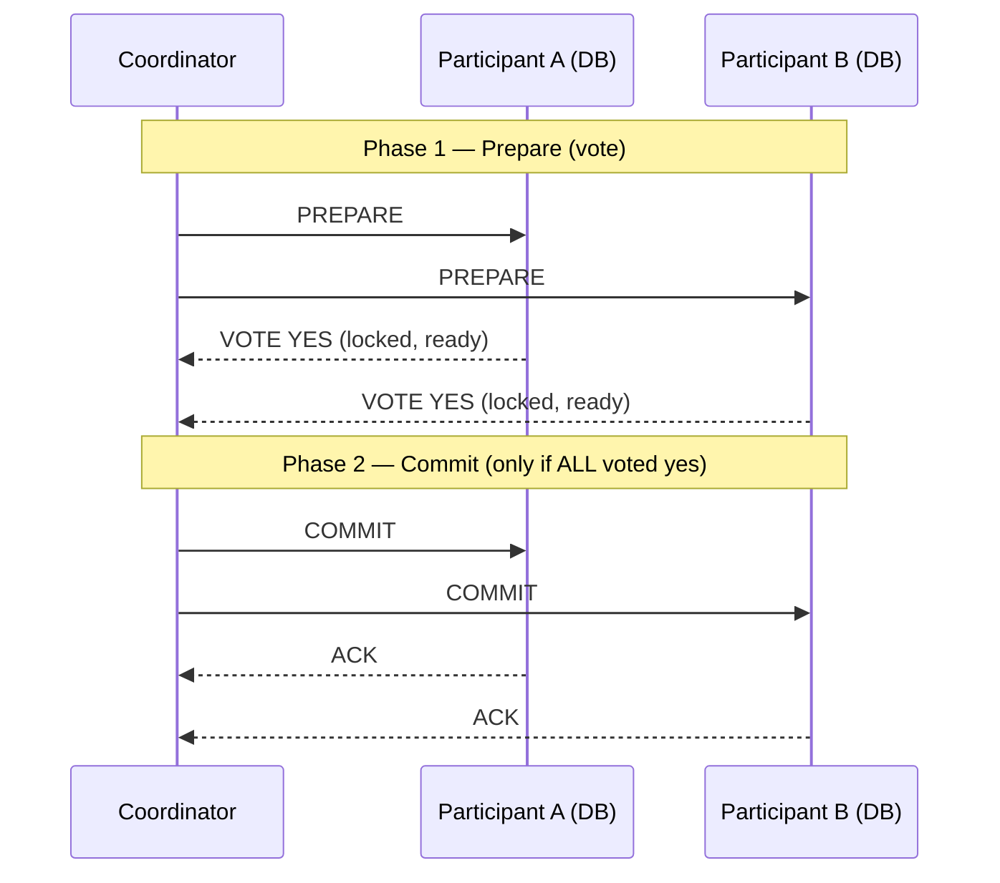

If *any* participant votes **NO** (or times out) in phase 1, the coordinator sends `ABORT` to everyone instead.

**Why 2PC is usually avoided in modern distributed systems** (a very common interview follow-up):
- **Blocking**: participants hold locks from `PREPARE` until they hear back from the coordinator — if the coordinator crashes after phase 1, participants are stuck holding locks indefinitely (the "in-doubt transaction" problem).
- **The coordinator is a single point of failure** for the whole transaction.
- **It doesn't scale** across service/network boundaries the way microservices need — it assumes all participants are reliably reachable for the whole protocol duration, which is a poor fit for the internet/cloud failure model (partitions, slow networks).

**What replaced it in practice**: instead of trying to make a distributed operation atomic, accept that it will be *eventually* consistent and design for it — the **Outbox pattern** ([§8](#8-outbox-pattern)) for the single-write-plus-publish case, and the **Saga pattern** ([§10.2](#102-saga-pattern)) for multi-step, multi-service business transactions with compensating actions instead of rollback.

### Q&A — Atomicity

- **"Is atomicity the same as consistency?"** No — atomicity is about the transaction's own steps being all-or-nothing; consistency is about the DB's invariants/constraints holding before and after. A transaction can be atomic (fully applied) and still violate a business invariant if that invariant isn't encoded as a DB constraint.
- **"How do you get atomicity across two microservices' databases?"** You generally don't, via a shared transaction — you use the Outbox pattern for the write+publish case, or a Saga with compensating transactions for a multi-step business process, and design every step to be idempotent so retries are safe.
- **"Why not just use 2PC across microservices?"** Blocking failure mode, coordinator SPOF, and it's a poor fit for the partition-prone, loosely-coupled nature of microservices — see §1.3.

---

## 2. CQRS (Command Query Responsibility Segregation)

### 2.1 The core idea

**CQRS** splits an application's data model into two: a **write model** (handles **commands** — "do this," mutates state) and a **read model** (handles **queries** — "give me this," returns data). Instead of one model/schema trying to serve both, each side gets a model shaped for what it actually needs to do.

This matters because writes and reads often have fundamentally different shapes:
- Writes care about **business rules and invariants** (can this order be placed? does this violate a constraint?) — normalized schema, strong consistency.
- Reads care about **fast, denormalized retrieval** shaped exactly like the UI/API that consumes them (e.g., "order summary with customer name and item count pre-joined") — can be eventually consistent, can live in a completely different datastore (a search index, a cache, a document store) optimized purely for query speed.

### 2.2 Diagram

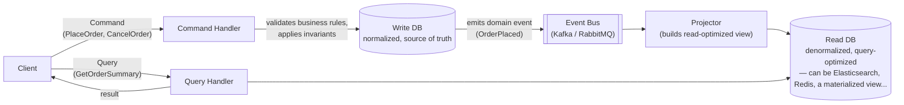

The write side and read side are updated **asynchronously** — the projector consumes the event stream and rebuilds/updates the read model after the fact. This is the core trade-off: **the read model is eventually consistent** with the write model, typically by milliseconds-to-seconds, not instantly.

### 2.3 CQRS + Event Sourcing

CQRS is frequently paired with **Event Sourcing** (though the two are independent — you can do either without the other):
- Instead of storing *current state* in the write DB, you store the **sequence of events** that led to it (`OrderPlaced`, `ItemAdded`, `OrderShipped`...) as the source of truth.
- Current state is derived by replaying events (or from periodic snapshots + replay of events since).
- The read model(s) are just **projections** — one or more materialized views built by folding the event stream, and you can rebuild a new projection at any time by replaying history, or run several different projections off the same event log for different query needs.

This combination is powerful for audit-heavy domains (finance, e-commerce order history) because the event log *is* the audit trail, but it adds real complexity — don't reach for it by default.

### 2.4 When to use it / when not to

| Use CQRS when... | Skip CQRS when... |
|---|---|
| Read and write workloads have very different scale/shape (e.g., reads are 100x writes, or need full-text search / complex aggregation the write schema can't serve efficiently). | It's a standard CRUD app where the same schema comfortably serves both reads and writes. |
| The domain has complex business logic on writes that shouldn't leak into (or be constrained by) the query side. | Eventual consistency between read and write isn't acceptable for the use case (e.g., "show my balance immediately after I deposit" in a naive implementation). |
| You need to scale reads and writes independently (different DB technology, different infrastructure). | The team/system isn't ready for the added operational complexity — two models, a sync mechanism, and eventual-consistency bugs are a real cost. |

### Q&A — CQRS

- **"Doesn't CQRS mean the user might not see their own write immediately?"** Yes — that's the central trade-off. Mitigations: read-your-writes tricks (route a user's own reads to the write DB for a short window, or return the just-written data directly from the command response instead of re-querying), or accept a spinner/optimistic UI update.
- **"Is CQRS the same as microservices?"** No — CQRS is a pattern for splitting a *model*, orthogonal to service boundaries. You can apply it inside a single service.
- **"What's the failure mode if the projector falls behind or crashes?"** The read model goes stale (or stalls) while the write model keeps advancing — this is why the projector's consumer lag and error-handling (dead-letter queue, retry, alerting) matters as much as the happy path; see the Kafka consumer-group discussion in [§5.4](#54-how-consumers-track--store-their-read-position).

---

## 3. Command Pattern vs. Strategy Pattern

These two GoF patterns are commonly confused because they look structurally similar (an interface, a context/invoker holding a reference to it, concrete implementations behind it) — but they solve different problems.

### 3.1 Command Pattern

**Intent**: encapsulate a **request/action** as an object, so you can parameterize callers with different requests, queue them, log them, and support undo.

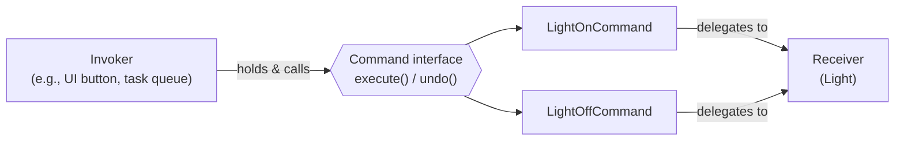

```typescript
interface Command {
  execute(): void;
  undo(): void;
}

class LightOnCommand implements Command {
  constructor(private light: Light) {}
  execute() { this.light.on(); }
  undo() { this.light.off(); }
}

class RemoteControl {
  private history: Command[] = [];
  press(cmd: Command) { cmd.execute(); this.history.push(cmd); }
  pressUndo() { this.history.pop()?.undo(); }
}
```

Key properties: the **invoker** (`RemoteControl`) doesn't know what concrete action it's triggering — it just calls `execute()`. This decoupling is what lets you queue commands (task queues), log them (audit trail / event sourcing — see [§2.3](#23-cqrs--event-sourcing)), and undo them.

### 3.2 Strategy Pattern

**Intent**: encapsulate a family of **interchangeable algorithms** behind a common interface, and let the algorithm be swapped at runtime by the context that uses it.

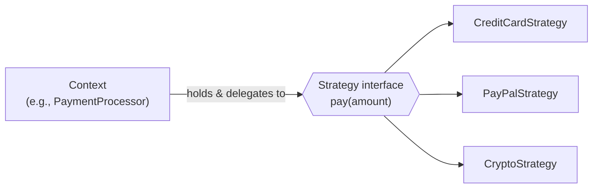

```typescript
interface PaymentStrategy {
  pay(amount: number): void;
}

class CreditCardStrategy implements PaymentStrategy {
  pay(amount: number) { /* charge card */ }
}

class PaymentProcessor {
  constructor(private strategy: PaymentStrategy) {}
  setStrategy(strategy: PaymentStrategy) { this.strategy = strategy; }
  checkout(amount: number) { this.strategy.pay(amount); }
}
```

### 3.3 Side-by-side

| | Command | Strategy |
|---|---|---|
| **Represents** | A *request/action* ("do X") — a verb, often a specific user intent or task. | An *algorithm/policy* ("how to do the fixed operation Y") — a swappable implementation of one conceptual operation. |
| **Typical method** | `execute()`, often paired with `undo()`. | One method matching the operation being varied (`pay()`, `sort()`, `compress()`). |
| **Supports undo/redo** | Yes — a core use case. | No — not a concern of the pattern. |
| **Supports queuing/logging/scheduling** | Yes — commands are naturally serializable, queueable work items (this is *why* task queues, job systems, and event-sourced systems lean on this shape). | Not a goal — a strategy runs synchronously as part of the context's operation. |
| **Decouples** | The *invoker* from the *receiver* that actually performs the action — the invoker doesn't even need to know what the command does. | The *context* from the *algorithm variant* — the context knows it needs "a payment method," just not which one. |
| **Cardinality per use** | An invoker typically fires many different commands over time (different button presses, different queued jobs). | A context typically holds **one** strategy at a time for a given operation, chosen once (at construction or configuration time) or swapped occasionally. |
| **Real-world example** | Redo/undo in an editor; a job/task queue where each job is a `Command` object; the outbox pattern's stored "events to publish." | Choosing a sort algorithm, compression algorithm, or payment provider based on config/context; validation rule selection. |

### Q&A — Command vs. Strategy

- **"Structurally these look identical — how do you actually tell them apart in a design?"** Ask what varies and why: if you're varying *which action happens* and need to treat that action as a first-class, storable/queueable/undoable thing, it's Command. If you're varying *how a fixed operation is carried out* and just need to plug in a different algorithm, it's Strategy.
- **"Can a system use both?"** Yes, commonly together — e.g., a job queue (Command pattern: each job is a command object) where each job internally picks a processing algorithm based on job type (Strategy pattern).
- **"Is Strategy just dependency injection?"** They overlap in spirit (both favor composition + an interface over a hardcoded implementation), but Strategy specifically implies the algorithm can be **swapped at runtime by the context itself**, not just wired once at startup by a DI container — though in practice constructor-injected strategies are extremely common and blur this line.

---

## 4. TCP/IP: Stateless or Stateful?

**Short answer for the interview**: **TCP is stateful. IP (and UDP) is stateless.** "Is TCP/IP stateful" is really two questions glued together — answer them separately, that's the trick to not getting tripped up.

### 4.1 Layer by layer

| Layer | Stateful or stateless? | Why |
|---|---|---|
| **IP** (network layer) | **Stateless.** | Every packet is routed independently based only on its header (destination IP) — routers keep no memory of previous packets belonging to the "same" communication. This is what makes IP simple and horizontally scalable to route, and it's also why IP alone gives you no delivery guarantee, ordering, or retransmission. |
| **UDP** (transport layer) | **Stateless.** | No handshake, no connection concept, no tracking of what's been sent/received — "fire and forget." Each datagram is independent, same philosophy as IP one layer down. |
| **TCP** (transport layer) | **Stateful.** | A TCP connection is a negotiated, tracked conversation between two endpoints. Each side maintains real state for the connection's lifetime: sequence numbers, acknowledgment numbers, the receive window size, congestion-window state, and the connection's state-machine phase (`SYN_SENT`, `ESTABLISHED`, `FIN_WAIT`, etc.). This state is *why* TCP can guarantee ordered, reliable, in-sequence delivery and retransmit lost segments — it knows exactly what's been sent and acknowledged. |
| **HTTP** (application layer, runs over TCP) | **Stateless by design** (as a *protocol*) — see §4.3. | Each HTTP request is processed independently of any other; the protocol itself defines no built-in memory of prior requests. |

### 4.2 The TCP handshake and connection state

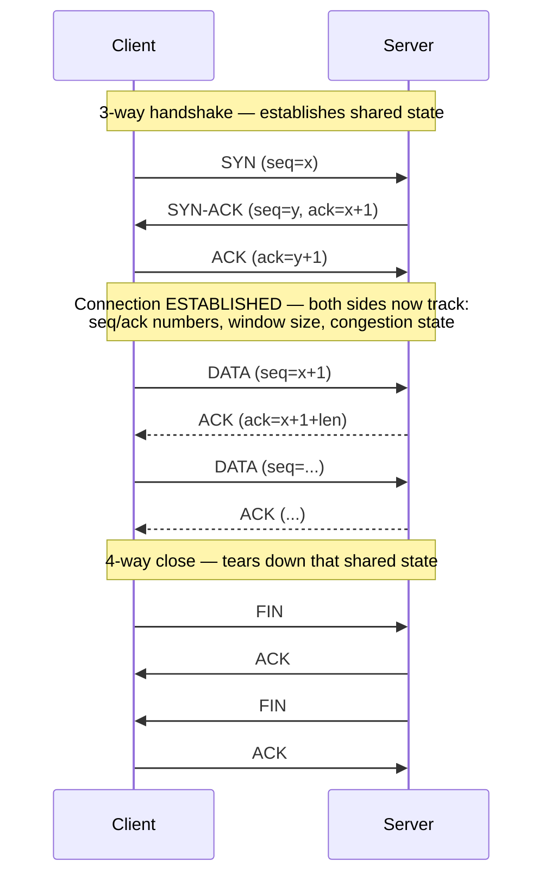

Everything after the handshake (retransmission of a lost segment, reordering out-of-order segments, flow control via the receive window, congestion control backing off after packet loss) is only possible **because** both endpoints are tracking connection state. That's the concrete meaning of "TCP is stateful."

### 4.3 Where HTTP fits — the classic interview trap

This is the part interviewers actually probe: **HTTP runs on top of stateful TCP, but HTTP itself is a stateless protocol.** These are two different layers and it's easy to conflate them:

- **Transport-layer state (TCP)**: exists for the life of one TCP connection — sequence numbers, ack numbers, etc. Irrelevant to the *application's* notion of a "session."
- **Application-layer state (HTTP "session")**: HTTP defines no concept of "this request belongs to the same user as that earlier request." A server handling request #2 has zero built-in memory of request #1, even if both flowed over the *same* TCP connection (which itself is common with keep-alive/HTTP-2 multiplexing) — statelessness here is a protocol design choice (each request must carry everything needed to understand it), not a transport limitation.
- **How "sessions" are bolted on**: cookies (a session ID the client resends every request), JWTs/bearer tokens (self-contained state the client resends every request), or server-side session stores keyed by something the client resends every request. In all cases, **the server isn't remembering you — you're reminding it every time**, which is exactly what "stateless protocol" means, and it's *why* stateless HTTP APIs scale horizontally so easily (any server behind the load balancer can handle any request, since no server needs to have "remembered" you from before).

**One-sentence answer if asked directly**: "IP and UDP are stateless — no per-packet memory; TCP is stateful — it tracks per-connection sequencing/ack/window state to give reliable ordered delivery; HTTP, which rides on top of TCP, is itself designed to be a stateless protocol, and any 'session' behavior on top of it is an application-layer addition (cookies/tokens), not something TCP or HTTP provide natively."

### Q&A — TCP/IP statefulness

- **"If TCP is stateful, why do people call REST APIs 'stateless'?"** Different layer — REST/HTTP statelessness means the *server* doesn't need to retain per-client context between requests to interpret a request; it says nothing about whether the underlying TCP connection carrying those requests has connection state (it does).
- **"What has to happen for a load balancer to route stateless HTTP requests to any backend?"** Nothing beyond routing — since no server holds session state, any instance can serve any request. The moment you introduce server-side session affinity ("sticky sessions"), you've reintroduced application-level statefulness and constrained your load balancing.
- **"Why does UDP being stateless matter for anything real?"** It's exactly why UDP is chosen for latency-sensitive, loss-tolerant use cases (video/voice streaming, gaming, DNS queries) — no handshake overhead, no connection state to maintain per client, cheaper to scale to huge numbers of clients, at the cost of the app having to handle loss/ordering itself if it cares.

---

## 5. Apache Kafka — Internals

### 5.1 Core vocabulary

| Term | What it is |
|---|---|
| **Topic** | A named, logical stream/category of messages (e.g., `order.created`). It's a *logical* concept — physically, a topic is split into partitions. |
| **Partition** | An **ordered, append-only, immutable log** — the actual unit of storage and parallelism. A topic with 6 partitions has 6 independent logs, each living on disk on some broker. Order is only guaranteed **within** a partition, never across partitions of the same topic. |
| **Offset** | A monotonically increasing integer identifying a message's position within its partition. Kafka uses this instead of a message ID — "give me everything from offset 4102" is how consumers resume. |
| **Broker** | One Kafka server; a cluster is a set of brokers. Each broker hosts some subset of partitions (as leader or follower — see §5.5). |
| **Producer** | Writes messages to a topic; picks a partition per message (by key hash by default, or round-robin if no key). |
| **Consumer / Consumer Group** | Reads messages by pulling from partitions; consumers in the same **consumer group** split the partitions between them (see §5.4). |

**So what actually *is* a topic?** — worth being precise about this, since "topic" is the word people reach for loosely and it hides a few things worth naming explicitly:

- **It's a name, not a container of bytes.** A topic itself doesn't store anything — it's the label under which a set of partitions are grouped (e.g., topic `orders` might be backed by 6 partitions; on disk each is its own append-only log file, physically stored as something like `orders-0`, `orders-1`, ... `orders-5`, scattered across whichever brokers own each partition). "Publish to topic `orders`" really means "the producer picks one of those 6 partitions (by key hash, or round-robin if no key) and appends to *that* partition's log." There is no single physical log called `orders` — the topic is the umbrella name over several independent, unrelated-in-ordering logs (this is exactly why ordering is only guaranteed *within* a partition, never across the topic as a whole — see the Partition row above).
- **It's a category/stream of related events, chosen by the producer's design, not enforced by Kafka.** Kafka doesn't require messages on a topic to share a schema or structure — that discipline (e.g., "every message on `order.created` is an `OrderCreatedEvent` with this shape") is a convention the producing/consuming teams agree on, optionally enforced by an external **schema registry**. A topic is best thought of as "one conceptually-cohesive stream of facts a producer wants to publish and any number of independent consumers might want to subscribe to" — e.g., a single e-commerce platform would typically have separate topics like `order.created`, `order.shipped`, `payment.processed`, `inventory.updated`, each its own independently-scalable, independently-retained stream, rather than one giant `events` topic mixing everything together.
- **A reasonable (imperfect) analogy: a topic is like a database table, if that table were append-only and read by scanning forward from a bookmark instead of by arbitrary `WHERE` queries.** It groups similar records the way a table groups similar rows, but you can't query it by arbitrary predicate — the only access pattern is "give me messages starting at offset N," sequentially, per partition.
- **A topic doesn't "forget" a message once someone's read it** — unlike a queue, reading is non-destructive. What eventually removes a message is the topic's own **retention policy**, configured independently of any consumer: time-based (`retention.ms`, e.g., keep 7 days), size-based (`retention.bytes`), or, for topics representing "latest state per key" rather than a pure event history (like Kafka's own internal `__consumer_offsets`, §5.4), **log compaction** (`cleanup.policy=compact` — keep only the newest message per key, discard older ones with the same key). This is precisely what allows many independent consumer groups to each read the same topic on their own schedule from their own position (§5.2) without stepping on each other or on the data.
- **Per-topic configuration is where a lot of the real design decisions live**: partition count (the hard ceiling on how parallel any one consumer group can get, §5.4), replication factor (durability, §5.5), retention settings, and `min.insync.replicas` are all set **per topic**, not globally — so "how many partitions should this topic have" and "how long should this topic retain data" are genuine, consequential design questions in a Kafka-based system, not implementation details.

**So what actually *is* a partition, concretely?** — this is where a topic stops being an abstract name and becomes real bytes on a real disk:

- **It's the actual physical log file (well, set of files — see segments below).** If topic `orders` has 6 partitions, there are 6 completely separate append-only log files, each living on whichever broker was assigned to hold it, each with its own independent sequence of offsets starting at 0. Partition 3 having offset 500 says nothing about partition 0 — they're unrelated counters. This is *the* unit Kafka actually stores, replicates, and moves — "topic" is just the name tying a set of these together (§5.1 above).
- **It's the unit of ordering.** Kafka only promises "message A was written before message B" for messages **in the same partition**. Two messages in different partitions have no defined relative order, even if they were produced at nearly the same instant. This is why **partition key choice matters enormously**: if you need all events for a given entity to be strictly ordered (e.g., every event for `user_42` must be processed in the order it happened), they all have to land in the *same* partition — which is exactly what keyed publishing gives you, since Kafka partitions by `hash(key) % partition_count` by default, so the same key deterministically always maps to the same partition.
- **It's the unit of parallelism, on both ends.** On the write side, different partitions can be written to concurrently (potentially by different producers, definitely handled independently by the brokers that lead each one). On the read side, this is the mechanic behind §5.4's rule that a consumer group can have at most one active consumer per partition — partition count is quite literally *the number of independent, parallel lanes* a topic offers; you cannot get more read parallelism out of one consumer group than there are partitions, no matter how many consumer instances you add.
- **It's the unit of replication and failover.** Each partition — not each topic — has its own leader broker and its own set of follower replicas (§5.5); "partition 3's leader" and "partition 4's leader" can be, and usually are, different brokers. Losing a broker means losing leadership of *whichever partitions it led*, not the whole topic — the other partitions of the same topic, led elsewhere, are entirely unaffected.
- **Physically, a partition isn't one giant file — it's a sequence of *segments*.** Kafka rolls the active segment over into a new one once it hits a size or time threshold, closing the old one; each closed segment gets a companion sparse **offset index** file (and a time index) so "seek to offset 4102" or "seek to this timestamp" doesn't mean scanning from byte 0 — it's a fast index lookup followed by a short linear scan within one segment. This segment structure is also what makes retention/compaction (§5.1) cheap: expiring old data is mostly just **deleting whole old segment files**, not rewriting a monolithic log.
- **Partition count is a one-way door, mostly.** You can *increase* a topic's partition count later, but doing so changes the `hash(key) % partition_count` mapping — the same key can now land in a different partition than it used to, silently breaking the "all of this entity's events are in one partition, in order" guarantee for any key whose target partition shifted. In practice this means partition count should be sized upfront for expected future parallelism needs, not treated as a casually-tunable knob.

### 5.2 Architecture diagram

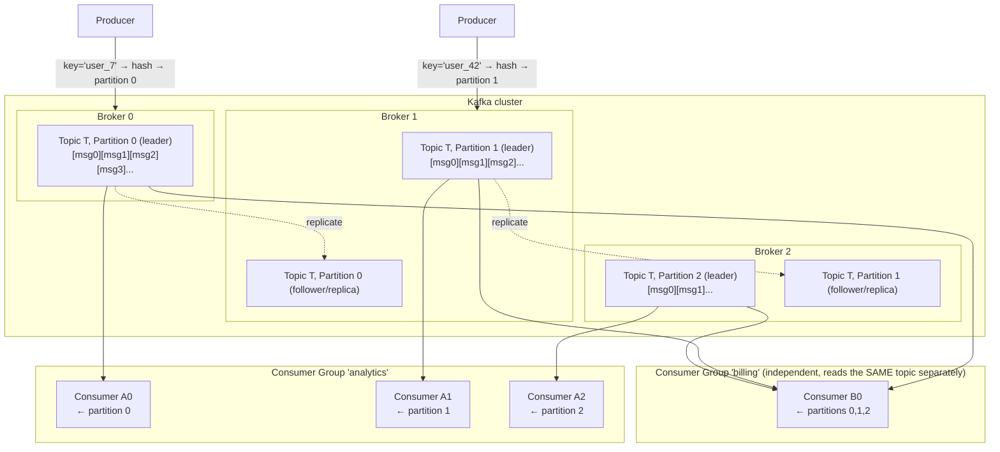

Two consumer groups reading the same topic get **completely independent** copies of the stream, each tracking its own offsets — this is the mechanism that makes Kafka a durable, replayable *log* rather than a queue that deletes on consumption (contrast with RabbitMQ, [§7](#7-kafka-vs-rabbitmq)).

### 5.3 How Kafka handles massive throughput

This is usually the actual question behind "how does Kafka handle many, many requests" — the answer is a combination of several deliberate design choices, not one trick:

| Technique | What it buys |
|---|---|
| **Partitioning** | The unit of parallelism. More partitions → more consumers can read in parallel, more brokers can share the write/read load. Throughput scales roughly linearly by adding partitions + brokers (up to a point). |
| **Sequential disk I/O** | Each partition is an **append-only** log — writes are always sequential appends, never random-access updates. Sequential I/O on both spinning disks and SSDs is dramatically faster than random I/O, and Kafka is explicitly designed to lean on this rather than fight it. |
| **OS page cache, not app-level caching** | Kafka writes rely on the OS page cache rather than maintaining an in-JVM cache of recently-written data — recently-written data is very likely still in the page cache when a consumer reads it moments later, turning many "disk reads" into memory reads for free, without GC pressure from a large JVM heap cache. |
| **Zero-copy transfer** | When serving a partition read to a consumer, the broker uses the `sendfile` syscall to transfer bytes straight from the page cache to the network socket, skipping the usual copy into user-space application memory — fewer copies, fewer context switches, per message sent. |
| **Batching + compression** | Producers batch multiple messages destined for the same partition into one request (configurable via `linger.ms`/`batch.size`), and compress the batch (e.g., `lz4`, `zstd`) before sending — far fewer, larger network round-trips instead of one round-trip per message, and less bytes over the wire. |
| **Horizontal scale-out** | Adding brokers lets you add more partition capacity (both storage and parallel throughput) without touching application code — partitions can be reassigned across the larger broker set. |

The unifying theme: Kafka is architected around what disks and networks are naturally fast at (sequential writes, batched large transfers) and avoids what they're slow at (random I/O, many tiny round-trips) — this is the crux of "why is Kafka fast" as an interview answer.

### 5.4 How consumers track & store their read position

This is the other half of "how does Kafka handle huge volumes of data for consumers" — the trick is that Kafka **doesn't** track per-consumer read state on the broker in some bespoke way; it stores it **as just another Kafka topic**:

- Every consumer group periodically **commits its offset** (its "I've processed up through here" position) per partition it's assigned.
- These commits are written to an internal, Kafka-managed topic called **`__consumer_offsets`** — a normal partitioned, replicated Kafka topic, just reserved for this purpose, keyed by `(group.id, topic, partition)` and **log-compacted** (Kafka keeps only the latest offset per key instead of the full history, so this topic stays small relative to the data topics it's tracking).
- This means offset storage inherits everything Kafka already does well: it's replicated (durable, survives broker failure), horizontally scalable, and requires no separate storage system.
- On consumer (re)start or after a crash, the consumer just asks: "what's the last committed offset for `(my-group, topic, partition)`?" and resumes from there (or from `earliest`/`latest` if there's no prior commit).

**Consumer groups and partition assignment** — how "many, many requests" get spread across many consumers:
- Kafka guarantees **at most one consumer per partition within a given group** at any time — this is the whole parallelism mechanism. A group with 3 consumers and a topic with 3 partitions → each consumer gets exactly 1 partition. Add a 4th consumer → it sits idle (you can't have more active consumers than partitions in one group; this is a very common gotcha and interview question — **partition count is the hard ceiling on a single group's consumer parallelism**).
- If a consumer dies, a **rebalance** reassigns its partition(s) to the surviving consumers in the group — coordinated by a broker acting as **group coordinator**, using a heartbeat/session-timeout mechanism to detect failure.
- Modern Kafka favors **cooperative sticky** assignment (incremental rebalancing that only moves the partitions that need to move) over the older "stop-the-world, revoke everything, reassign everything" eager rebalance, to minimize the pause in consumption during a rebalance.

#### 5.4.1 Directly answering: does each group member read a different partition, and different data?

**Yes to both, within a single group** — and it's worth being precise about *why*, since this is the mechanic that makes a consumer group behave like a distributed worker pool rather than N independent copies of the same subscriber:

- **Different partition**: the group coordinator assigns each partition to exactly one member of the group. If there are as many partitions as consumers, it's a clean 1:1 mapping. If there are fewer consumers than partitions, some consumers own **more than one** partition (still true that no two consumers share a partition — ownership just isn't 1:1). If there are more consumers than partitions, the extra consumers get **zero** partitions and sit idle.
- **Different data**: because partitions are disjoint (a message lives in exactly one partition), and each partition is owned by exactly one consumer in the group, **no message is ever delivered to two different members of the same group**. Each consumer sees a distinct, non-overlapping slice of the topic — collectively, the group's members cover the *entire* topic between them exactly once, but individually each one only ever sees "their" partitions' messages. This is Kafka's version of the "competing consumers" pattern (conceptually similar to multiple RabbitMQ consumers splitting one queue, §6.1 — except Kafka splits by whole partition, not per-message round-robin).

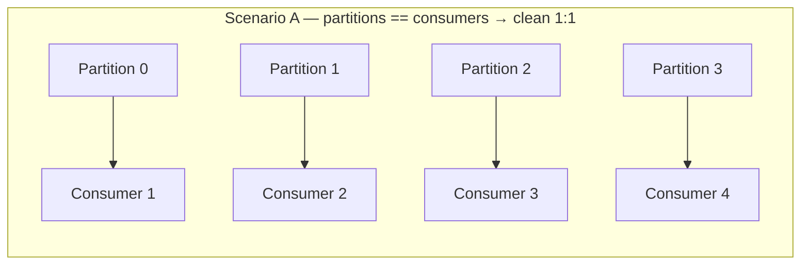
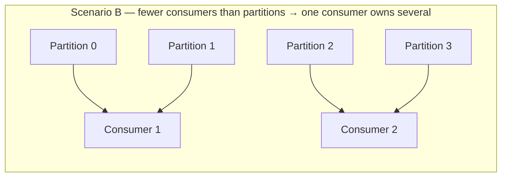
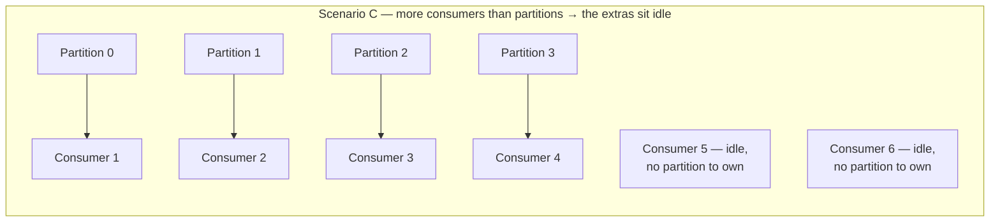

**The part that trips people up**: this "different partition, different data" rule is **scoped to one group**. Go back to the diagram in [§5.2](#52-architecture-diagram) — group `analytics` and group `billing` reading the *same* topic are two entirely separate groups, so that rule doesn't apply *between* them. Each group gets its own full, independent copy of the topic, tracked by its own offsets in `__consumer_offsets`. So the complete picture has two different sharing rules stacked on top of each other:
- **Across groups**: full duplication — every group independently sees every message on the topic (this is Kafka's pub/sub fan-out).
- **Within a group**: partitioning — the group's members split the topic's messages between them with zero overlap (this is Kafka's competing-consumers load-sharing).

### 5.5 Replication & durability

- Each partition has one **leader** replica (handles all reads/writes for that partition) and **N follower** replicas on other brokers, purely for durability/failover — followers don't serve client traffic directly.
- The **ISR (In-Sync Replica) set** is the subset of replicas that are fully caught up with the leader. If the leader dies, a new leader is elected from the ISR — this is why staying "in sync" matters: a follower that's fallen too far behind gets dropped from the ISR and can't be safely promoted.
- acks (acknowledgments) parameter configures how many broker confirmations a producer must wait for before considering a message write successful. It controls the trade-off between write speed (throughput) and data safety (durability).

| Setting | Behavior | Pros | Cons |
|---|---|---|---|
| **acks=0** (No Wait) | The producer sends a message and assumes it is delivered immediately, without waiting for any response from the broker. | Highest throughput and lowest latency. | Zero delivery guarantees; if the network drops or the broker crashes, the data is lost permanently. |
| **acks=1** (Leader Wait) | The producer waits until the partition's leader broker writes the message to its local log. | Decent speed with basic reliability. | If the leader crashes right after writing the message — before follower replicas copy it — the message is lost. |
| **acks=all** / **acks=-1** (All Replicas Wait) | The producer waits until all current In-Sync Replicas (ISRs) acknowledge the record. | Strongest durability; data survives individual broker crashes as long as at least one replica is active. | Higher latency because it requires network round-trips to multiple servers. |

### 5.6 Delivery semantics / exactly-once

- Kafka is **at-least-once** by default (a producer retry after an ambiguous failure can duplicate a message; a consumer that crashes after processing but before committing its offset will re-read on restart) — consumers should be **idempotent** to handle this safely (compare to the idempotency discussion in [§10.4](#104-idempotency--message-delivery-semantics)).
- **Idempotent producer** (`enable.idempotence=true`): the producer tags each message with a producer ID + sequence number, and the broker dedupes retries of the *same* message within a partition — solves accidental duplication from producer-side retries.
- **Transactions**: let a producer write to multiple partitions/topics atomically and have consumers (with `isolation.level=read_committed`) only see the writes if the transaction committed — this is what gets you true **exactly-once** semantics for Kafka-to-Kafka pipelines (e.g., Kafka Streams). It does not extend exactly-once to an external side effect (e.g., an HTTP call) — that still needs idempotency or the outbox pattern.

#### 5.6.1 Producer retries & ambiguous failures

When a producer pushes a message to a broker, it waits for an **ack** (see [§5.5](#55-replication--durability)) to confirm the write. An *ambiguous failure* happens when a network glitch or broker crash interrupts that handshake **after** the broker has durably written the message but **before** the ack makes it back to the producer:

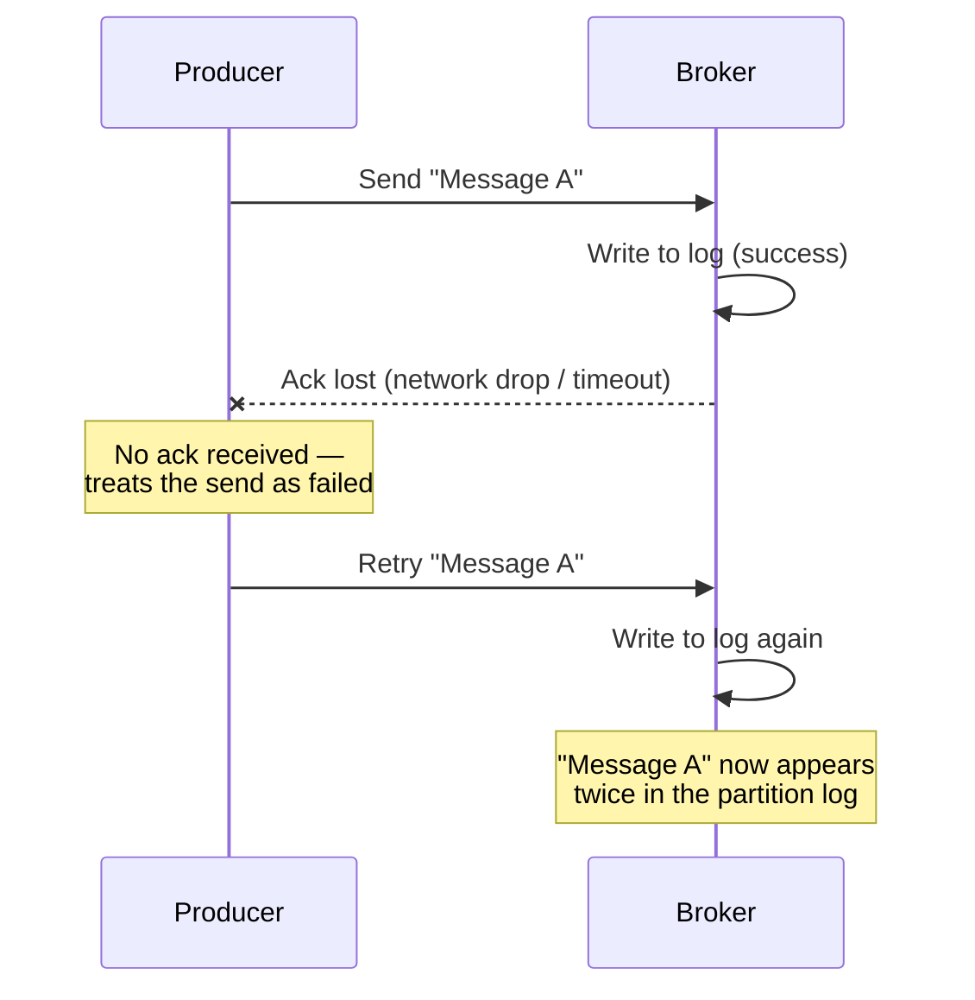

The producer can't distinguish "my message never arrived" from "my message arrived but the ack didn't" — so the default, safe assumption is to retry, which is what makes duplication possible on the write path.

#### 5.6.2 Consumer commits & crash scenarios

Kafka doesn't track which individual messages a consumer has read; it tracks an **offset** — the sequential ID of the next message to read — per group, in the internal `__consumer_offsets` topic. In an at-least-once setup, a consumer reads a message, processes it, and only then commits the new offset back to Kafka:

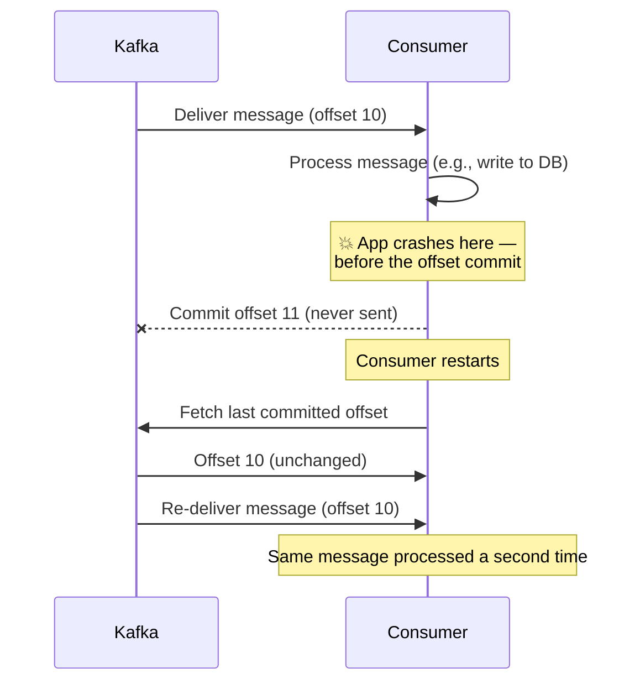

Because Kafka still believes the consumer is sitting at offset 10, a restart re-delivers a message that was already fully processed.

#### 5.6.3 The defense: idempotent consumers

Since duplicates can originate on either side — producer retries ([§5.6.1](#561-producer-retries--ambiguous-failures)) or consumer re-reads ([§5.6.2](#562-consumer-commits--crash-scenarios)) — the reliable fix is to make the consumer's processing **idempotent**: applying it N times has the same effect as applying it once (see also the idempotency discussion in [§10.4](#104-idempotency--message-delivery-semantics)). Common patterns:

- **Unique database constraints**: a primary key or unique index on a business ID carried in the message (e.g., `order_id`). A duplicate write is safely rejected by the constraint instead of double-applied.
- **Idempotency keys (deduplication layer)**: track recently processed message IDs in a fast store (e.g., Redis). Check before processing; if the ID's already there, skip it.
- **Upserts (natural idempotence)**: model changes as state overwrites rather than increments — `SET status = 'COMPLETED'` gives the same result no matter how many times it runs, whereas `balance += 100` corrupts the ledger on a replay.

### 5.7 Practical example — a sensor-readings pipeline, end to end

**First, the piece that comes before all of this: how does a reading from a physical sensor actually become a message in the `sensor.readings` topic?** Every example so far has started from "a message arrives at the consumer" — worth closing the loop on where it came from.

**The sensor itself is (almost) never the Kafka producer.** Kafka's client protocol is a stateful, TCP-based binary protocol — it expects a persistent connection, awareness of cluster/partition metadata, retry and batching logic, and a non-trivial client library. That's a reasonable ask of a backend service; it's a poor fit for a battery-powered, intermittently-connected, resource-constrained IoT device. The standard real-world shape instead puts a **lightweight edge protocol** between the device and Kafka, with a small bridge component doing the actual producing:

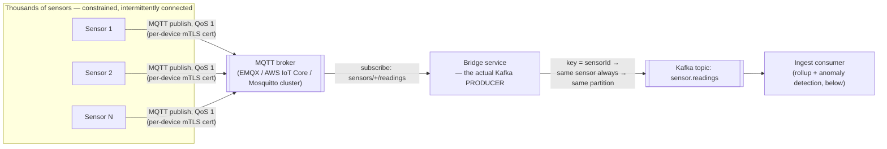

Why this extra hop, rather than pointing devices straight at Kafka:

| Concern | Why the edge layer (MQTT broker + bridge) handles it better than the device itself |
|---|---|
| **Protocol weight** | MQTT is designed for exactly this class of device — tiny client footprint, works over flaky links, built-in QoS levels for at-least-once delivery from device to broker. A full Kafka producer client is much heavier to run on constrained hardware. |
| **Fleet-scale credential management** | Terminating auth (per-device mTLS certs or tokens) at the MQTT broker means only a handful of trusted bridge services ever hold real Kafka credentials — not every device in a fleet that could number in the thousands or millions. Fewer, tightly-controlled systems touching the Kafka cluster directly is a much smaller attack surface to secure and rotate credentials for. |
| **Offline buffering** | Devices on unreliable networks need to survive a dropped connection without losing readings. MQTT's persistent sessions + QoS 1/2 (and, at the broker, standard store-and-forward) give you this without reimplementing Kafka's own producer retry/idempotence machinery on constrained hardware. |
| **Efficient batching** | Thousands of low-throughput devices each opening their own Kafka producer connection is wasteful; funneling them through one bridge service lets that bridge do proper producer-side batching (`linger.ms`/`batch.size`, §5.3) across many sensors' worth of traffic instead of one tiny request per device per reading. |

(Less constrained devices — an edge gateway aggregating many sensors on a factory floor, say, rather than the sensor itself — can reasonably skip the MQTT hop and run a real Kafka producer client directly; the MQTT bridge is the right default for genuinely small/battery-powered end devices, not a universal requirement.)

**The bridge — the actual Kafka producer (TypeScript / `kafkajs` + `mqtt`):**

```typescript
const mqttClient = mqtt.connect("mqtts://iot-broker:8883", { ca, cert, key }); // per-device mTLS terminates HERE, not at Kafka
const producer = kafka.producer();
await producer.connect();

mqttClient.subscribe("sensors/+/readings", { qos: 1 }); // MQTT's own at-least-once, device → broker

mqttClient.on("message", async (mqttTopic, payload) => {
  const sensorId = mqttTopic.split("/")[1]; // "sensors/{sensorId}/readings"
  const reading = JSON.parse(payload.toString());

  await producer.send({
    topic: "sensor.readings",
    messages: [{
      key: sensorId, // same key → same partition, every time (§5.1) → per-sensor ordering, which the anomaly detector (§5.7.1) depends on
      value: JSON.stringify(reading),
    }],
    acks: 1, // leader-ack is enough for routine telemetry; bump to acks=-1/all (§5.5) if a lost reading is unacceptable
  });
});
```

The `key: sensorId` choice isn't incidental — it's what guarantees every reading from one sensor lands in the same partition in the order it was produced, which both the rollup buckets and the rolling z-score anomaly detector (§5.7.1) silently depend on (per-sensor state that assumes it's seeing that sensor's readings in order, on one partition, never interleaved with a redelivered-out-of-order copy from elsewhere).

Three separate things can "bloat" in this picture, and it's worth untangling them before looking at the fix, since only one of them is actually about the database:

1. **The topic itself** — this is bounded by Kafka's own retention policy (§5.1), **not** by how fast consumers read it. A slow consumer doesn't make the topic grow; it risks the opposite problem — if a consumer falls behind by more than the retention window, the broker deletes messages it hasn't read yet, and they're gone (a race between **consumer lag** and **retention**, worth monitoring explicitly via lag metrics).
2. **The consumer's own memory** — bloats if it pulls unbounded batches or queues messages faster than it can process them, with nothing capping how much sits in memory at once.
3. **The downstream database** — bloats if every raw message is written and kept forever, growing without limit as the topic produces indefinitely.

The pattern below (a sensor-readings pipeline, structurally identical to the ETL-into-rollup-tables approach already used in this repo's [Real-Time Price Feed design](08-realtime-price-feed.md#5-fixes-applied-to-the-original-design)) addresses all three at once: **bounded, paced consumption** feeding a **windowed rollup** written to a **time-series-oriented store with an automatic retention policy**.

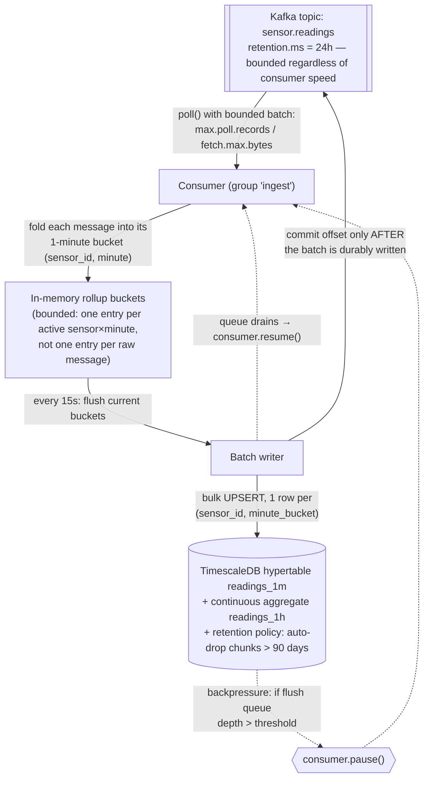

The two things doing the actual anti-bloat work in this diagram: **the buffer holds one entry per (sensor, minute), not one per raw message** — a sensor emitting every second collapses 60 raw readings into 1 row before it ever reaches the DB — and **the DB has a retention policy that drops old chunks automatically**, so storage growth flattens out instead of growing forever with topic volume.

**Consumer — bounded, paced, backpressured (TypeScript / `kafkajs`):**

> **A subtlety the earlier version of this example got wrong, worth calling out explicitly**: offsets must be committed **only after** a flush's data is durably written — never per-message as each one is folded into the in-memory buckets. If you resolve/commit the offset the instant a message is folded into memory (before the next 15-second flush actually persists it), a crash in that up-to-15-second window loses the data **permanently**: Kafka won't redeliver it (you already told the broker you were done with it), and it was never written to the DB. That defeats the entire point of "commit after durable write." The corrected version below tracks consumed-but-not-yet-flushed offsets separately and only commits them once `flush()` has confirmed the DB write succeeded — see the explanation of the remaining edge case right after the code.

```typescript
const consumer = kafka.consumer({ groupId: "ingest-sensor-readings" });
const buckets = new Map<string, { sum: number; count: number; min: number; max: number }>();
const pendingOffsets = new Map<number, string>(); // partition -> highest offset consumed since the last successful flush
let pendingFlushes = 0;
const MAX_PENDING_FLUSHES = 5; // backpressure threshold

async function flush() {
  if (buckets.size === 0) return;
  const rows = [...buckets.entries()];
  const offsetsToCommit = new Map(pendingOffsets); // snapshot exactly what this flush covers
  buckets.clear();
  pendingOffsets.clear();
  pendingFlushes++;
  try {
    // Rollup write + "applied up to this offset" marker, in ONE DB transaction — see SQL below.
    await upsertRollupBatchWithProgress(rows, offsetsToCommit);
    // Only NOW is it safe to tell Kafka these messages need never be redelivered.
    await consumer.commitOffsets(
      [...offsetsToCommit].map(([partition, offset]) => ({
        topic: "sensor.readings", partition, offset: (BigInt(offset) + 1n).toString(),
      })),
    );
  } finally {
    pendingFlushes--;
    if (pendingFlushes < MAX_PENDING_FLUSHES) {
      await consumer.resume([{ topic: "sensor.readings" }]);
    }
  }
}
setInterval(flush, 15_000); // pace: flush on a fixed cadence, not per-message

await consumer.subscribe({ topic: "sensor.readings" });
await consumer.run({
  autoCommit: false, // commits happen manually, from flush() only — never automatically, never per-message
  eachBatch: async ({ batch, heartbeat, isRunning, isStale }) => {
    for (const message of batch.messages) {
      if (!isRunning() || isStale()) break;
      const { sensorId, value, ts } = JSON.parse(message.value!.toString());
      const minute = new Date(Math.floor(new Date(ts).getTime() / 60_000) * 60_000).toISOString();
      const key = `${sensorId}:${minute}`;
      const b = buckets.get(key) ?? { sum: 0, count: 0, min: Infinity, max: -Infinity };
      b.sum += value; b.count++; b.min = Math.min(b.min, value); b.max = Math.max(b.max, value);
      buckets.set(key, b);
      pendingOffsets.set(batch.partition, message.offset); // remember it — do NOT commit yet
      await heartbeat();
    }
    if (pendingFlushes >= MAX_PENDING_FLUSHES) {
      await consumer.pause([{ topic: "sensor.readings" }]); // stop pulling until the DB catches up
    }
  },
});
```

The pacing mechanism has two parts: **`max.poll.records`/`fetch.max.bytes`** cap how much a single `poll()` can pull at once (bounding step 2's memory bloat above), and **`consumer.pause()`/`resume()`** stops pulling *at all* once too many flushes are in flight — this is the actual backpressure valve: it makes the consumer's pull rate track the database's write throughput instead of Kafka's produce rate, which is exactly what prevents an unbounded in-memory queue from forming when the DB is temporarily the bottleneck.

**Doesn't leaving message A uncommitted block the consumer from ever receiving message B?** No — and this is worth being precise about, because it's the detail that makes the whole delayed-commit design work at all. Kafka tracks **two separate positions** per partition, not one:

- **The fetch position** — purely in-memory, client-side, advances automatically every time `poll()`/`eachBatch` hands the consumer more messages. This is what determines "what do I get handed next" — and it has nothing to do with commits. Across the 15-second window between flushes, the consumer keeps calling `poll()` and receiving batch after batch (A, B, C, D, E, F, ...) continuously; none of that is gated on message A's offset ever being committed.
- **The committed offset** — durable, written to `__consumer_offsets` (§5.4), and only ever *read back* in one situation: **on (re)start or rebalance**, to answer "since I have no in-memory fetch position anymore, where should I resume?" It plays no role at all in the steady-state flow of messages while the consumer is up and running.

So in the corrected pipeline: over one 15-second window the consumer might poll and buffer thousands of messages, committing nothing until `flush()` finally succeeds and commits *once*, covering everything received in that window in one call. The commit is a **periodic checkpoint for crash recovery**, not a **per-message permission slip** — nothing before `flush()` runs is waiting on it.

This is a genuine point of contrast with RabbitMQ's model (§6.3): there, `prefetch` **does** cap how many *unacknowledged* messages a consumer may hold at once — cross that limit and the broker actually stops pushing more, tying delivery of new messages to acking old ones. Kafka has no equivalent coupling; the only thing that throttles how much a Kafka consumer pulls per round is `max.poll.records`/`fetch.max.bytes` (and, in this example, the explicit `pause()`/`resume()` backpressure), entirely independent of commit state.

**The remaining race, and why the fix isn't "just commit after the DB write."** Flipping the order (flush *then* commit, instead of commit *then* flush) removes the data-loss risk, but introduces the opposite, smaller risk: what if the DB write **succeeds** but the process crashes in the gap **before** `consumer.commitOffsets()` finishes? On restart, the consumer resumes from the last *committed* offset — which is now behind what was actually flushed — and Kafka **redelivers** messages that were already applied to the rollup table. That's at-least-once delivery working exactly as designed (§5.6), but it means `flush()` could run a second time over some already-counted readings. Given the SQL below uses an **accumulating** merge (`sample_count = old + new`) — necessary because a single minute's bucket is genuinely written to across several 15-second flushes as readings for that minute keep arriving — reprocessing the same messages a second time would double-count them, not just re-write the same value. Committing after the write narrows the unsafe window from "up to 15 seconds, guaranteed loss" down to "a few milliseconds, possible duplicate application," but it doesn't eliminate it — closing it the rest of the way needs the write itself to be **idempotent** with respect to redelivery, which is what the `ingest_progress` table below does.

**Database — a time-series store with a retention policy, e.g. TimescaleDB (Postgres extension):**

```sql
CREATE TABLE readings_1m (
  sensor_id    TEXT NOT NULL,
  bucket       TIMESTAMPTZ NOT NULL,
  avg_value    DOUBLE PRECISION NOT NULL,
  sample_count INT NOT NULL,
  PRIMARY KEY (sensor_id, bucket)
);
SELECT create_hypertable('readings_1m', 'bucket');       -- auto-partitions by time into "chunks"
SELECT add_retention_policy('readings_1m', INTERVAL '90 days'); -- drops whole old chunks automatically

-- Pre-aggregate further so a "last year" query reads hundreds of rows, not millions
CREATE MATERIALIZED VIEW readings_1h WITH (timescaledb.continuous) AS
SELECT sensor_id, time_bucket('1 hour', bucket) AS hour, avg(avg_value) AS avg_value, sum(sample_count) AS sample_count
FROM readings_1m GROUP BY sensor_id, hour;
SELECT add_retention_policy('readings_1h', INTERVAL '2 years');

-- Closes the redelivery race above: this table's row IS the durable, transactional
-- record of "how far this partition has actually been applied" — it doesn't rely on
-- Kafka's committed offset (a separate system) ever being perfectly in sync with it.
CREATE TABLE ingest_progress (
  partition   INT PRIMARY KEY,
  last_offset BIGINT NOT NULL
);
```

Each flush now writes the rollup **and** advances `ingest_progress` in the **same transaction** (the same atomicity guarantee the Outbox pattern leans on in [§8](#8-outbox-pattern), just applied on the consuming side instead of the producing side):

```sql
BEGIN;
  INSERT INTO readings_1m (sensor_id, bucket, avg_value, sample_count)
  SELECT * FROM UNNEST($1::text[], $2::timestamptz[], $3::float[], $4::int[])
  ON CONFLICT (sensor_id, bucket) DO UPDATE SET
    avg_value = (readings_1m.avg_value * readings_1m.sample_count + EXCLUDED.avg_value * EXCLUDED.sample_count)
                / (readings_1m.sample_count + EXCLUDED.sample_count),
    sample_count = readings_1m.sample_count + EXCLUDED.sample_count;

  INSERT INTO ingest_progress (partition, last_offset) VALUES ($partition, $offset)
  ON CONFLICT (partition) DO UPDATE SET last_offset = EXCLUDED.last_offset
  WHERE ingest_progress.last_offset < EXCLUDED.last_offset; -- never move backwards on a stale/duplicate flush
COMMIT;
```

With this in place, the consumer loads each owned partition's `last_offset` from `ingest_progress` once on startup/rebalance and **skips folding any message at or below it** into the buckets. That's what actually makes redelivery safe end to end: if the crash happens between the DB commit and `consumer.commitOffsets()` (the race described above), Kafka redelivers a few already-applied messages, but the consumer recognizes them as already-applied via `ingest_progress` and discards them instead of double-merging — Kafka's own committed offset is left as just a coarse "resume roughly here" checkpoint, while `ingest_progress` is the actual source of truth for "has this been applied," which is the standard **idempotent consumer** pattern ([§10.4](#104-idempotency--message-delivery-semantics)) applied concretely to this pipeline.

**Why a time-series store (TimescaleDB / ClickHouse / InfluxDB), not a plain relational table or a generic NoSQL store:**

| Requirement | Time-series store | Plain OLTP table / generic NoSQL |
|---|---|---|
| Sustained high-volume timestamped writes | Built for it — data is auto-partitioned by time (hypertable "chunks" / ClickHouse partitions). | A single unpartitioned table degrades as it grows — index bloat, vacuum/compaction pressure, slower writes over time. |
| **Storage that stays bounded over time** | Retention policies drop entire old time partitions in one metadata operation — cheap, fast, actually reclaims disk. | `DELETE WHERE ts < ...` on a huge table is slow, lock-heavy, and doesn't reclaim space without a separate, expensive maintenance step (e.g., `VACUUM FULL`). |
| "Give me the last 30/90/365 days aggregated" queries | Continuous aggregates / materialized rollups pre-compute this incrementally as data lands. | Aggregating raw rows on every query request gets slower as history accumulates. |
| Storage efficiency for numeric timestamped data | Columnar/time-series-aware compression (commonly 10–20x) — this is what actually makes storing the rollups cheap even at scale. | Row-store compression on a general-purpose table is far less effective for this specific data shape. |

The general principle to say in an interview: **don't fight storage growth by consuming faster — fight it by storing less per raw message (aggregate before you persist) and by picking a store that expires old data structurally (retention policies / TTL) rather than relying on someone remembering to run cleanup jobs.** Consumption *pace* (batch size + pause/resume backpressure) is what keeps the *consumer* healthy under load; it's the rollup + retention-policy combination that's what actually keeps the *database* from growing without bound.

#### 5.7.1 Extending the pipeline: real-time anomaly notification to clients

The rollup path above is deliberately **not** real-time — it flushes on a 15-second cadence, which is fine for "store history efficiently" but wrong for "tell someone immediately that sensor 42 just spiked." Anomaly detection needs to happen **per message, as it arrives**, on a separate path from the batched storage write — and delivering it to connected clients (a live dashboard) needs its own fan-out mechanism, because "push to whichever browsers are currently connected" is a completely different scaling problem than "append to a time-series table." The fix is to add a second, low-latency branch off the same consumer, decoupled from delivery via its own Kafka topic:

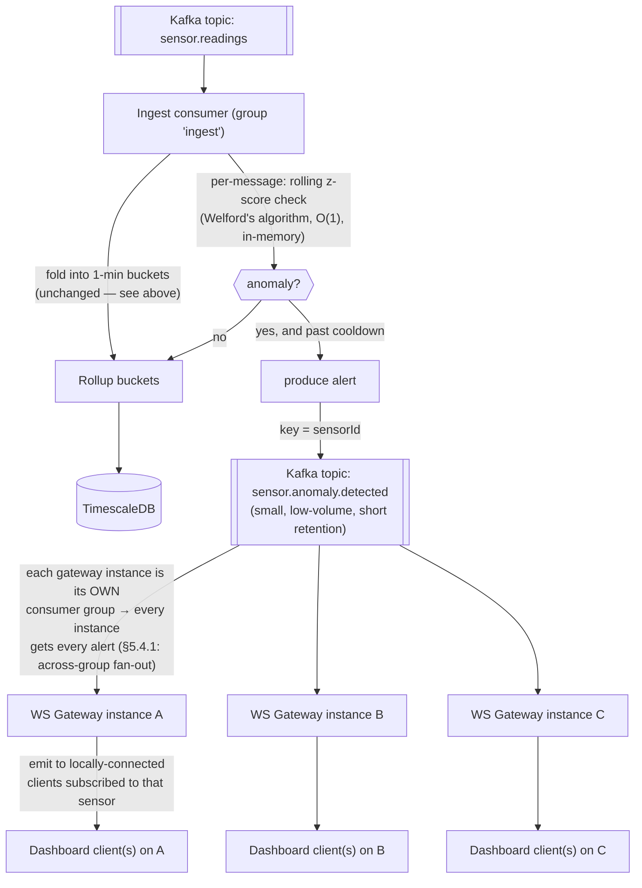

**Step 1 — detect, in the same consumer, without waiting for the flush cycle.** A rolling per-sensor baseline (mean/stddev via **Welford's online algorithm** — O(1) per message, no need to keep a history buffer) lets each incoming reading be scored the instant it's read, independent of the 15-second rollup cadence:

```typescript
// Rolling per-sensor anomaly detector — lives alongside the bucket-folding logic in eachBatch
const stats = new Map<string, { n: number; mean: number; m2: number }>();
const lastAlertAt = new Map<string, number>();
const ALERT_COOLDOWN_MS = 5 * 60_000; // one alert per sensor per 5 min while it stays anomalous
const Z_SCORE_THRESHOLD = 4;

function checkAnomaly(sensorId: string, value: number): number | null {
  const s = stats.get(sensorId) ?? { n: 0, mean: 0, m2: 0 };
  s.n++;
  const delta = value - s.mean;
  s.mean += delta / s.n;
  s.m2 += delta * (value - s.mean);
  stats.set(sensorId, s);

  if (s.n < 30) return null; // not enough history yet to trust the baseline
  const stddev = Math.sqrt(s.m2 / s.n);
  const zScore = stddev === 0 ? 0 : Math.abs(value - s.mean) / stddev;
  return zScore > Z_SCORE_THRESHOLD ? zScore : null;
}
```

Inside the existing `eachBatch` loop (§5.7), after folding the reading into its bucket, run the check and — **only on a state change past a cooldown, not on every anomalous reading** — publish an alert:

```typescript
const zScore = checkAnomaly(sensorId, value);
if (zScore !== null) {
  const last = lastAlertAt.get(sensorId) ?? 0;
  if (Date.now() - last > ALERT_COOLDOWN_MS) {
    lastAlertAt.set(sensorId, Date.now());
    await alertProducer.send({
      topic: "sensor.anomaly.detected",
      messages: [{ key: sensorId, value: JSON.stringify({ sensorId, value, zScore, ts, detectedAt: new Date().toISOString() }) }],
    });
  }
}
```

The cooldown matters as much as the detection: without it, a sensor stuck reading an anomalous value produces one alert **per message** (potentially hundreds a minute) instead of one alert per *episode* — the same alert-storm problem the [Notification System design (§2, priority topics)](01-notification-system.md) in this repo deals with more generally.

**Step 2 — why a separate Kafka topic instead of pushing to clients directly from the ingest consumer.** This is a deliberate decoupling, for the same reasons the [Bulkhead pattern (§10.9)](#109-bulkhead-pattern) argues for isolating unrelated failure domains:
- The ingest consumer's job is to keep up with the raw firehose (§5.7) — it shouldn't own WebSocket connection management, which has an entirely different scaling axis (number of *connected browsers*, not message throughput).
- `sensor.anomaly.detected` is itself just a Kafka topic, so it's durable, replayable, and — per [§5.4.1](#541-directly-answering-does-each-group-member-read-a-different-partition-and-different-data)'s **across-groups fan-out rule** — any number of independent consumers can subscribe to it for free: a WebSocket gateway for live dashboards, and separately, the actual [Notification System design](01-notification-system.md) in this repo for SMS/email/push escalation, an audit-log service, an on-call paging integration — none of them need to touch the ingest consumer or each other.

**Step 3 — fan out to connected clients using the exact mechanic from §5.4.1.** Each WebSocket gateway instance runs `sensor.anomaly.detected` consumption in **its own, uniquely-named consumer group** (e.g. `ws-gateway-${instanceId}`) rather than sharing one group across instances — which means every instance gets **every** alert (the "full duplication across groups" rule from §5.4.1), and can then simply check which of *its own* locally-connected clients care about that `sensorId` and emit to just those:

```typescript
const alertConsumer = kafka.consumer({
  groupId: `ws-gateway-${instanceId}`,       // unique per instance → every instance sees every alert
});
await alertConsumer.subscribe({ topic: "sensor.anomaly.detected", fromBeginning: false }); // only new alerts — no need to replay history into a freshly-started gateway

await alertConsumer.run({
  eachMessage: async ({ message }) => {
    const alert = JSON.parse(message.value!.toString());
    io.to(`sensor:${alert.sensorId}`).emit("anomaly", alert); // only clients subscribed to this sensor's room get it
  },
});
```

This sidesteps needing a cross-instance fan-out layer (e.g., a Redis pub/sub adapter for Socket.IO) entirely — Kafka's own per-group full-duplication *is* the fan-out mechanism, since every gateway instance is, by construction, its own group. `fromBeginning: false` is deliberate too: a newly (auto-)scaled-up gateway instance only needs alerts from *now on*, not a replay of historical anomalies nobody's watching for anymore.

**Why this stays "real-time" end to end**: nothing in this second path waits on the 15-second rollup flush or the database — detection is O(1) per message, the alert topic is small/low-volume so producer→consumer latency is milliseconds, and delivery is a direct in-memory WebSocket `emit()` once the gateway has the message. The storage path (§5.7) and the notification path (this section) share the same source topic and the same ingest consumer's read loop, but are otherwise fully independent — a slow TimescaleDB write can never delay an anomaly alert, and a burst of alerts can never stall the rollup flush.

### Q&A — Kafka

- **"What is a topic, really?"** A logical name for a stream of related messages; physically it's just a set of independently-ordered partition logs — the topic itself has no global ordering guarantee, only each partition does.
- **"How does Kafka handle millions of messages per second?"** Partitioning for parallelism, append-only sequential disk writes, OS page-cache reads, zero-copy transfer to consumers, and producer-side batching/compression — see §5.3.
- **"How do consumers know where they left off?"** Committed offsets stored in the internal, replicated, compacted `__consumer_offsets` topic, keyed by group/topic/partition — see §5.4.
- **"Can two consumers in the same group read the same partition?"** No — exactly one consumer per partition per group at a time; that's the whole parallelism model, and it caps a group's usable parallelism at the partition count.
- **"What happens if a consumer crashes mid-processing?"** Its partitions get reassigned to other group members in a rebalance; whoever picks them up resumes from the last *committed* offset, which is why uncommitted-but-processed messages can be reprocessed (at-least-once) unless you've set up transactional exactly-once processing.

---

## 6. RabbitMQ — Internals

### 6.1 The AMQP model

RabbitMQ implements **AMQP** (Advanced Message Queuing Protocol), whose core routing model has three pieces, and understanding this triangle is the key to everything else about RabbitMQ:

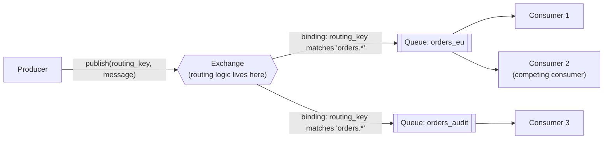

- **Producers never publish directly to a queue** — they publish to an **exchange** with a routing key; the exchange decides, based on its **bindings**, which queue(s) (zero, one, or many) actually receive a copy.
- A **queue** is where messages actually sit until a consumer pulls (well — is *pushed*, see §6.3) and acknowledges them.
- **Consumers** attach to queues; multiple consumers on one queue **compete** for messages (each message goes to exactly one of them, round-robin by default) — this is RabbitMQ's native load-balancing/worker-pool mechanism.

### 6.2 Exchange types

| Exchange type | Routing rule | Typical use |
|---|---|---|
| **Direct** | Routing key must **exactly match** the binding key. | Point-to-point task routing (`"send_email"` → the email-worker queue). |
| **Topic** | Routing key matched against a binding **pattern** with wildcards: `*` = exactly one word, `#` = zero or more words (e.g., `orders.*.created` matches `orders.eu.created`). | Flexible pub/sub where consumers want a *slice* of events (e.g., only `orders.eu.*`). |
| **Fanout** | Ignores the routing key entirely — broadcasts to **every** bound queue. | Broadcast notifications; "tell every interested service X happened." |
| **Headers** | Matches on message header attributes instead of the routing key. | Rare; used when routing logic doesn't fit naturally into a string key. |

### 6.3 Architecture diagram — push delivery & acknowledgement

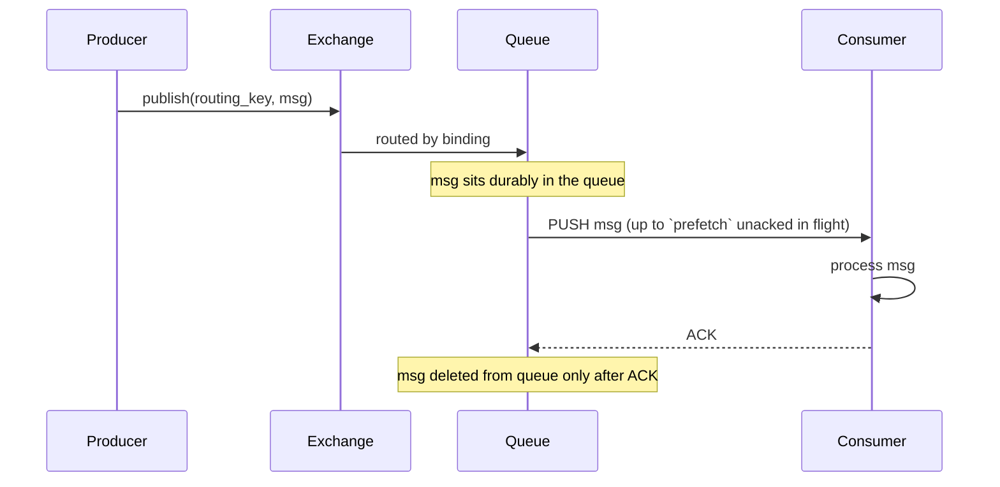

The crucial contrast with Kafka: RabbitMQ **pushes** messages to consumers (throttled by a **prefetch/QoS** limit — how many unacknowledged messages a consumer may have in flight at once, which is RabbitMQ's backpressure mechanism), whereas Kafka consumers **pull**. And once a RabbitMQ message is acknowledged, **it's gone** — deleted from the queue. There's no "replay from an earlier point" the way there is with a Kafka offset reset, because RabbitMQ isn't retaining a log — see the full comparison in [§7](#7-kafka-vs-rabbitmq).

### 6.4 Acknowledgement, durability, and high availability

- **Manual vs. auto ack**: manual ack (consumer explicitly acks after successful processing) is what makes RabbitMQ reliable — if the consumer crashes before acking, the message is **redelivered** (to it on reconnect, or to another consumer on the queue). Auto-ack trades this reliability for lower overhead.
- **Durability**: a message survives a broker restart only if *both* the queue is declared **durable** *and* the message is published as **persistent** — missing either one means an in-flight message is lost on broker restart.
- **Dead-letter exchanges (DLX)**: a queue can be configured so that rejected/expired/queue-full messages get republished to a designated DLX instead of being silently dropped — the standard way to build a retry/DLQ pipeline (used heavily in the [Optima channel-manager design](09-optima-channel-manager.md) for per-OTA-provider retry isolation).
- **High availability / clustering**: RabbitMQ nodes form a cluster; modern RabbitMQ uses **quorum queues** (Raft-consensus-replicated across a subset of cluster nodes) for HA, superseding the older "classic mirrored queues" approach — a queue's messages survive the loss of a minority of the nodes replicating it.
- **TTL, priority queues, delayed messages**: per-message or per-queue TTL, message priority ordering, and (via a plugin) delayed/scheduled delivery are all native or near-native RabbitMQ features that map directly onto common task-queue needs (retry backoff, urgent-job-first processing).

### Q&A — RabbitMQ

- **"Why can't a producer just publish straight to a queue?"** It can be made to *look* that way (the default exchange does a direct name-match to a same-named queue), but conceptually producers always publish to an exchange — this indirection is what lets routing logic (which queue(s) get a copy) change without touching producer code.
- **"How does RabbitMQ handle many consumers processing a backlog fast?"** Multiple consumers bound to the same queue **compete** for messages (round-robin dispatch), and `prefetch` tunes how many unacked messages each consumer holds at once — this is a worker-pool model, distinct from Kafka's partition-per-consumer model.
- **"What happens to a message after it's consumed?"** Once acknowledged, it's deleted from the queue — there's no retained log to replay later, unlike Kafka.

---

## 7. Kafka vs. RabbitMQ

| Dimension | Kafka | RabbitMQ |
|---|---|---|
| **Core abstraction** | A durable, partitioned, append-only **log**. | A **broker** with exchanges/queues/bindings implementing flexible message routing. |
| **Delivery model** | **Pull** — consumers request batches from an offset. | **Push** — broker pushes to consumers, throttled by prefetch. |
| **What happens after consumption** | Message **stays** in the log per the retention policy, regardless of whether it's been consumed — offset tracking is per-consumer-group, independent of the data. | Message is **deleted** once acknowledged — no built-in replay. |
| **Replay / reprocessing** | Native — reset a consumer group's offset and reprocess any retained history. | Not native — once acked and deleted, it's gone (you'd need to have never deleted it, e.g., separately archived). |
| **Ordering guarantee** | Strict order **within a partition**; no cross-partition ordering. | Order preserved **within a single queue** for a single consumer; order across multiple competing consumers on one queue is not preserved. |
| **Fan-out to independent readers** | Native — any number of independent consumer groups can read the same topic from their own position. | Requires binding **multiple queues** to the same exchange (e.g., a fanout exchange) — one queue per independent "reader." |
| **Routing complexity** | Simple — topic + partition key. No per-message conditional routing logic in the broker. | Rich — direct/topic/fanout/headers exchanges give you real routing logic (pattern matching, broadcast, conditional). |
| **Throughput ceiling** | Very high (designed for millions of msgs/sec) — see [§5.3](#53-how-kafka-handles-massive-throughput). | High, but generally lower than Kafka at extreme scale (comfortably tens of thousands to low hundreds of thousands of msgs/sec depending on setup) — perfectly sufficient for most task-queue-shaped workloads. |
| **Best-fit problem shape** | "Durable, replayable event stream" — event sourcing, stream processing, analytics pipelines, audit logs, systems where multiple independent consumers need their own view of history. | "Reliably deliver this work item, possibly with complex retry/routing rules" — task queues, RPC-style request/reply, per-recipient differentiated retry/backoff. |
| **Consumer scaling model** | Partition-per-consumer within a group — parallelism capped by partition count. | Competing consumers per queue — add consumers freely, no partition-count ceiling. |
| **Operational footprint** | Historically needed ZooKeeper for cluster metadata; modern Kafka (KRaft mode) is self-managed via a Raft quorum of controller brokers, removing the ZK dependency. | Simpler baseline operational model; HA via quorum queues (Raft-replicated) across cluster nodes. |

**How to decide in an interview**: ask "do I need to replay history, or do multiple independent systems need their own view of the same stream?" → Kafka. Ask "do I need sophisticated per-recipient routing/retry, and is this fundamentally a 'get this task done reliably' problem rather than a 'stream of facts' problem?" → RabbitMQ. See the [Optima channel-manager design](09-optima-channel-manager.md#3-component-by-component-what-it-does-and-why-that-technology) in this repo for a fully worked real-world justification of choosing RabbitMQ over Kafka for a task-distribution problem, and any of the [chat](02-whatsapp-chat-system.md), [timeline](03-twitter-timeline.md), or [price-feed](08-realtime-price-feed.md) designs for Kafka being the right call at genuinely large fan-out/replay scale.

---

## 8. Outbox Pattern

**Problem it solves — the dual-write problem**: a service that both (a) writes to its own database and (b) publishes an event/message about that write is making **two separate writes to two separate systems**. There is no shared transaction spanning a relational DB and a message broker, so one can succeed while the other fails — e.g., the DB commit succeeds but the process crashes before the broker publish goes out. The write is durably saved, but **nothing downstream ever hears about it**, silently.

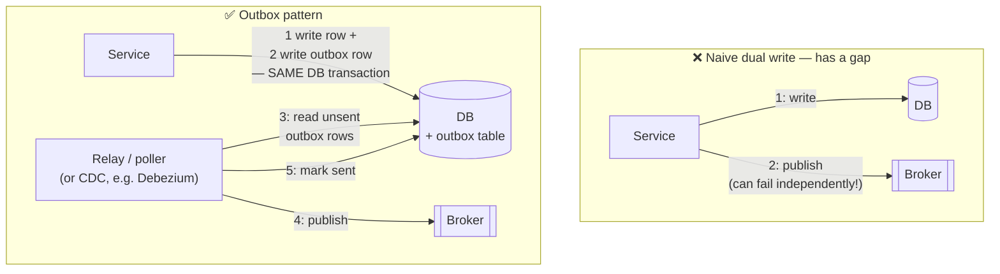

**How it works**:
1. When the service writes its actual state change (e.g., `INSERT INTO orders ...`), it **also** writes a row describing the event (`INSERT INTO outbox (event_type, payload, sent) VALUES ('order.created', ..., false)`) — in the **same local DB transaction**. Since this is now a single-database transaction, ordinary ACID atomicity ([§1](#1-atomicity-and-acid)) guarantees both rows exist or neither does.
2. A separate **relay** process reads unsent rows from the outbox table and publishes them to the message broker, then marks them sent (or deletes them).
3. Two implementations of the relay are common: a **polling publisher** (simplest — periodically `SELECT ... WHERE sent = false`), or **transaction log tailing / CDC** (e.g., Debezium reading the DB's write-ahead log directly) — no polling latency, and it doesn't add read load to the outbox table, at the cost of needing CDC infrastructure.
4. The relay's publish step must be **at-least-once** (it might publish and then crash before marking the row sent, causing a duplicate publish on restart) — so **downstream consumers must be idempotent** regardless of which relay style you use. This is the trade Outbox makes: it guarantees the event is published **if and only if** the DB write committed, but it can still publish more than once.

**When to use it**: any time a service does "persist state + notify the world" as two logically-one operation — this exact gap and fix is worked through concretely in the [Optima channel-manager design (§7)](09-optima-channel-manager.md#7-how-datasync-state-is-tracked--and-one-real-gap-worth-fixing) in this repo.

### Q&A — Outbox

- **"Why not just publish first, then write to the DB?"** Same problem, mirrored — now you can publish an event about a write that never actually commits (e.g., a later constraint check fails and the transaction rolls back), so downstream systems act on something that didn't happen. Outbox specifically ties publishing to the DB transaction succeeding, not the other way around.
- **"Doesn't the outbox table grow forever?"** No — sent rows are deleted or periodically archived/purged by the relay once confirmed published; the table is meant to hold a small backlog, not full history (that's what the broker's own retention, or the DB's write itself, is for).
- **"How is this different from 2PC?"** It avoids 2PC entirely by making the "transaction" a single-database, single-system operation (DB write + outbox row) and pushing the cross-system hop (outbox → broker) to an asynchronous, retry-safe, idempotent-consumer relay step instead of a blocking two-phase protocol.

---

## 9. Adapter Pattern

**Intent**: convert the interface of an existing class/system into another interface callers expect, so that classes with incompatible interfaces can work together **without modifying either side**.

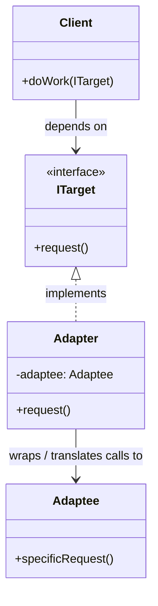

- **`Client`** only knows about `ITarget` — the interface it was written against.
- **`Adaptee`** is some existing class/system whose interface doesn't match `ITarget` (very often a third-party library or external API you don't control and can't change).
- **`Adapter`** implements `ITarget` and, internally, translates each call into the equivalent call(s) on `Adaptee` — it's a **translator sitting at the boundary**.

**Canonical real-world use case — multi-provider integrations**: this is exactly the shape of "integrate with N third-party APIs that all do conceptually the same thing but with different wire formats" — e.g., payment providers (Stripe vs. PayPal vs. Adyen), or OTA booking providers (Booking.com vs. Expedia vs. Agoda). Define one common interface (`IChannelEngine`, `IPaymentGateway`, ...) the rest of your system codes against, then write one adapter per provider that speaks that provider's actual API underneath.

```csharp
public interface IChannelEngine {
    Task PushRatesAsync(CanonicalRateUpdate update);
}

public class BookingEngine : IChannelEngine {
    public Task PushRatesAsync(CanonicalRateUpdate update) {
        var bookingComPayload = TranslateToBookingFormat(update); // adapter's job
        return _bookingComClient.SendRates(bookingComPayload);
    }
}
```

Adding a new provider means writing one new adapter class and registering it — **nothing in the rest of the system changes** (a direct application of the Open/Closed Principle). This exact pattern, including the registry that resolves which adapter to use at runtime, is worked through in full in the [Optima channel-manager design (§3.1, §6)](09-optima-channel-manager.md#31-how-the-external-engine-manager-actually-dispatches-to-a-provider) in this repo, where it's paired with a **registry/factory** (often called Adapter + Registry together) so the dispatch-to-the-right-adapter step is also decoupled from the calling code.

**Adapter vs. Strategy** (a natural follow-up given [§3](#3-command-pattern-vs-strategy-pattern)): they look almost identical structurally (an interface, multiple interchangeable implementations behind it), but the *intent* differs — **Strategy** is about choosing between multiple **valid algorithms** for one operation your own system defines; **Adapter** is about **bridging an interface mismatch** with an external/existing system you don't control. In practice, a set of provider adapters (Booking/Expedia/Agoda) is arguably *both*: each is an Adapter (translates to that provider's wire format) that the caller also selects between the way it would select a Strategy.

### Q&A — Adapter

- **"How is Adapter different from Facade?"** Facade simplifies/unifies a **complex** subsystem behind an easier interface (fewer methods, hides internal complexity); Adapter's job is purely **interface translation** so two already-compatible-in-purpose things can talk — it doesn't necessarily simplify anything, just makes shapes match.
- **"When would you NOT use Adapter?"** If you control both sides of the interface mismatch, it's usually cheaper to just fix the mismatch directly (change the interface) rather than add a translation layer — Adapter earns its keep specifically when one side is external/fixed (a third-party API) and you can't change it.

---

## 10. Bonus patterns worth knowing

Concepts adjacent to everything above that come up constantly in system-design interviews.

### 10.1 CAP theorem

In the presence of a **network Partition**, a distributed system must choose between **Consistency** (every read sees the latest write) and **Availability** (every request gets a non-error response) — you cannot have both during the partition. (You always get Partition tolerance in practice — real networks partition — so CAP is really "C vs. A when P happens," not a free choice of any 2 of 3.)

| Choice under partition | Example systems | Trade-off |
|---|---|---|
| **CP** (Consistency over Availability) | Configuration/coordination stores like ZooKeeper, etcd; a DB configured for synchronous quorum writes. | Some requests fail/block during a partition rather than risk returning stale data. |
| **AP** (Availability over Consistency) | DynamoDB-style stores, Cassandra (with eventual-consistency settings). | Requests keep succeeding during a partition, but different nodes may briefly disagree — resolved later (eventual consistency, see §10.7). |

### 10.2 Saga pattern

The practical replacement for cross-service 2PC ([§1.3](#13-atomicity-beyond-a-single-db--two-phase-commit)): a business transaction spanning multiple services is broken into a sequence of local transactions, each with a **compensating action** that undoes it if a later step fails.

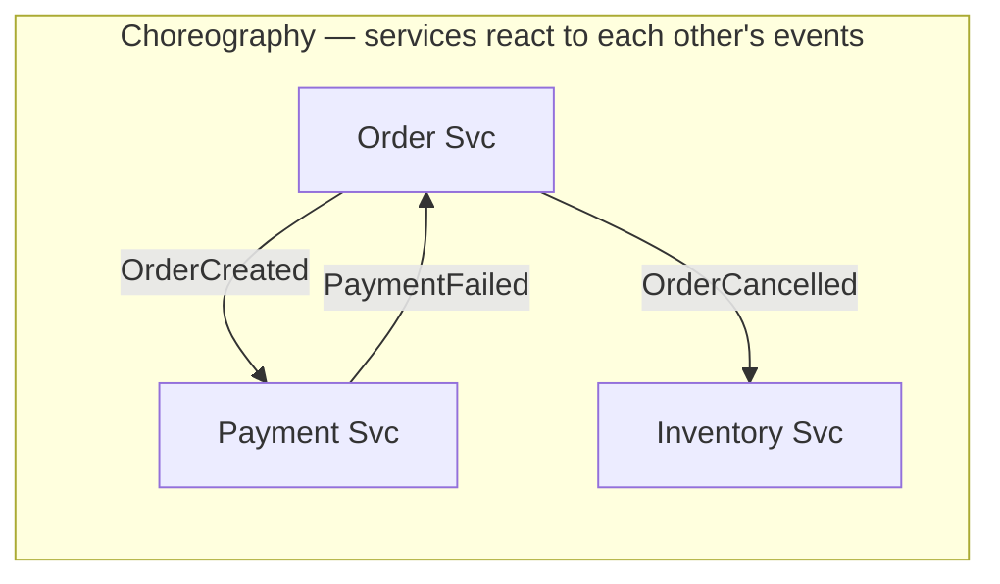
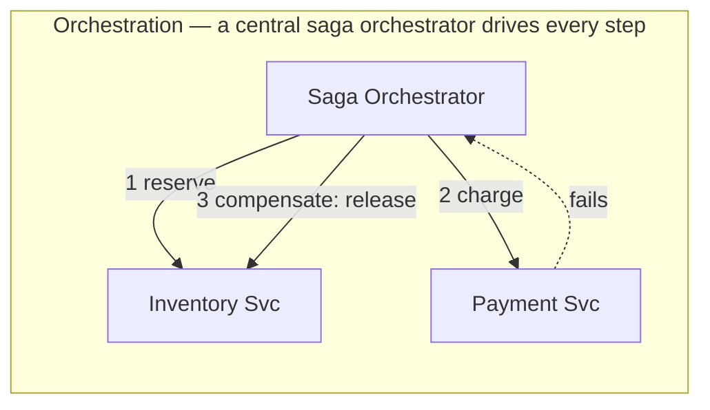

- **Choreography**: each service publishes events and reacts to others' events — no central coordinator, but the overall flow is implicit and harder to trace as steps grow.
- **Orchestration**: a central orchestrator explicitly calls each step and issues compensations on failure — flow is explicit/traceable, at the cost of a central component to build and own.
- Every step (forward and compensating) must be **idempotent** — a saga replays/retries under failure, same as any at-least-once system.

For more details, see [11-saga-pattern-in-depth.md](./11-saga-pattern-in-depth.md).

### 10.3 Circuit breaker

Protects a caller from repeatedly hammering a failing downstream dependency, and gives that dependency room to recover.

```mermaid
stateDiagram-v2
    [*] --> Closed
    Closed --> Open: failure rate exceeds threshold
    Open --> HalfOpen: after timeout, allow a trial request
    HalfOpen --> Closed: trial succeeds
    HalfOpen --> Open: trial fails
    Closed --> Closed: calls pass through, failures counted
    Open --> Open: calls fail fast, no call made downstream
```

- **Closed**: normal operation, calls pass through, failures are counted.
- **Open**: calls fail immediately (no network call made) once a failure threshold is crossed — protects both the caller (no waiting on a doomed call) and the struggling downstream (no pile-on load).
- **Half-Open**: after a cooldown, a trial request is let through to test recovery — success closes the circuit again, failure reopens it.
- Used exactly where the [Optima design's Gateway](09-optima-channel-manager.md) trips breakers **per OTA provider**, so one provider's outage doesn't degrade calls to the others.

### 10.4 Idempotency & message delivery semantics

| Semantic | Meaning | Cost/Trade-off |
|---|---|---|
| **At-most-once** | Message delivered 0 or 1 times — never duplicated, but can be silently lost. | Cheapest, least safe — fire-and-forget. |
| **At-least-once** | Message delivered 1 or more times — never lost, but can duplicate on retry/crash. | The common default for both Kafka and RabbitMQ; **requires idempotent consumers**. |
| **Exactly-once** | Delivered and processed exactly one time, no loss, no duplication. | Hardest/most expensive to guarantee end-to-end; usually means "effectively-once" via idempotency + at-least-once, or narrow-scope transactional guarantees (Kafka transactions, [§5.6](#56-delivery-semantics--exactly-once)) rather than a magic broker setting. |

**Idempotency** (a consumer/handler producing the same end result no matter how many times the same message is processed) is the practical tool that makes at-least-once delivery *safe* — typically implemented via a dedupe key (e.g., `event_id`, checked against a "already processed" store before acting) or naturally-idempotent operations (`SET status = 'shipped'` is idempotent; `balance += amount` is not, unless guarded by the same dedupe key check).

### 10.5 Consistent hashing

Solves "how do I shard data across N nodes such that adding/removing a node doesn't force nearly everything to move" — naive `hash(key) % N` remaps almost every key when `N` changes. Consistent hashing places both nodes and keys on a **hash ring**; a key belongs to the next node clockwise from it, so adding/removing one node only reshuffles the keys between it and its neighbor, not the whole keyspace.

```mermaid
flowchart TD
    Ring["Hash ring (0 → 2^32-1, wraps around)"]
    N1["Node A"] -.ring position.- Ring
    N2["Node B"] -.ring position.- Ring
    N3["Node C"] -.ring position.- Ring
    K1["key1 → next node clockwise → Node B"]
    K2["key2 → next node clockwise → Node C"]
```

Used for distributing partitions/shards across nodes with minimal churn on scale-out (Kafka's default key-based partition assignment uses key hashing, and many distributed caches/DBs — DynamoDB, Cassandra — use consistent hashing directly for this reason); often paired with **virtual nodes** (each physical node owns many points on the ring) to smooth out uneven load distribution.

### 10.6 Rate limiting algorithms

| Algorithm | How it works | Characteristic |
|---|---|---|
| **Token bucket** | Bucket refills at a fixed rate; each request consumes a token; empty bucket → reject/delay. | Allows bursts up to bucket size while enforcing an average rate — the most commonly used in practice. |
| **Leaky bucket** | Requests queue and are processed (leak out) at a fixed rate. | Smooths bursts into a constant output rate; excess requests queue or overflow/reject. |
| **Fixed window** | Count requests in a fixed time window (e.g., per minute); reset each window. | Simple, but allows up to 2x the limit right at a window boundary (burst at the edge of two windows). |
| **Sliding window (log or counter)** | Tracks requests over a rolling window rather than a fixed reset point. | Fixes the boundary-burst problem of fixed window, at higher bookkeeping cost. |

### 10.7 Strong vs. eventual consistency

- **Strong consistency**: any read immediately reflects the latest committed write, everywhere. Requires coordination (synchronous replication/quorum) — costs latency and availability under partition (see CAP, §10.1).
- **Eventual consistency**: after writes stop, all replicas *will* converge to the same value, but there's no bound on exactly when — reads shortly after a write may return stale data. This is precisely the trade CQRS's read model makes ([§2](#2-cqrs-command-query-responsibility-segregation)).
- **Read-your-writes** is a commonly-demanded middle ground: a specific user is guaranteed to see *their own* recent writes (routed to the primary/write path, or session-pinned), even if the system is eventually consistent for other users' view of the same data.

### 10.8 Sharding vs. replication

- **Sharding (partitioning)**: split data **horizontally** across multiple nodes so each holds a *subset* — scales write throughput and total storage, since no single node holds everything.
- **Replication**: copy the **same** data to multiple nodes — scales read throughput and provides durability/failover, since any replica can serve a read or be promoted on failure.
- Real systems combine both: e.g., Kafka partitions a topic (sharding, for parallelism) **and** replicates each partition (replication, for durability) — see [§5.5](#55-replication--durability).

### 10.9 Bulkhead pattern

Named after ship compartmentalization: isolate resource pools (thread pools, connection pools) **per dependency**, so that one slow/failing dependency exhausting its own pool can't starve calls to every *other* dependency sharing a common pool. Frequently paired with circuit breakers (§10.3) — the [Optima design's per-`(tenant, provider)` isolation](09-optima-channel-manager.md#8-scale--concurrency) (separate queues/rate limits per OTA provider) is a bulkhead applied at the message-queue level, not just the thread-pool level.

### 10.10 Single Source of Truth (SSOT)

**Definition**: for any given piece of data, exactly **one** system/service/store is designated the **authoritative owner** — the place whose value is definitive when copies disagree. Every other place that holds a copy of that data (a cache, a search index, a CQRS read model, a data-warehouse table, another service's local snapshot) is a **derived** copy: it can lag, it can be rebuilt, and it is never allowed to be the tie-breaker in a conflict. This sounds like a simple idea but it's one of the most load-bearing design decisions in a large distributed system, because the number of copies of "the same" data explodes fast (every cache layer, every read-optimized view, every service that denormalizes another service's data for its own convenience adds one more copy) — SSOT is the rule that keeps that explosion from turning into "which of these five values is actually correct?"

```mermaid
flowchart TD
    SSOT[("Order Service DB<br/>— SSOT for order state")]

    SSOT -->|"one-way sync<br/>(CDC / outbox / events)"| Cache["Redis cache<br/>(fast reads, can be stale)"]
    SSOT -->|"one-way sync"| Search["Elasticsearch index<br/>(search/filter UI)"]
    SSOT -->|"one-way sync"| ReadModel["CQRS read model<br/>(order summary view)"]
    SSOT -->|"one-way sync"| DW["Data warehouse<br/>(analytics, BI dashboards)"]

    Cache -.->|"❌ never writes back"| SSOT
    Search -.->|"❌ never writes back"| SSOT
    ReadModel -.->|"❌ never writes back"| SSOT
    DW -.->|"❌ never writes back"| SSOT
```

**The rule that makes this work**: data flows **one way**, out of the SSOT into every derived copy — never the reverse, and never copy-to-copy. If the cache and the search index ever disagree, the answer to "who's right" is always "go ask the SSOT," never "compare the two derived copies and guess." This is exactly the mechanism already covered elsewhere in this document, just named explicitly here:
- **CQRS** ([§2](#2-cqrs-command-query-responsibility-segregation)): the write DB is the SSOT; the read model is an explicitly-derived, eventually-consistent projection of it — CQRS is, in large part, "SSOT + one-way sync" formalized as a pattern.
- **Outbox pattern** ([§8](#8-outbox-pattern)): exists specifically to make the one-way sync out of the SSOT (DB → event) reliable, so derived copies don't silently miss an update.
- **Event sourcing** ([§2.3](#23-cqrs--event-sourcing)): reframes *which* thing is the SSOT — instead of current-state-in-a-table being authoritative, the **event log itself** is the SSOT, and current state (in any DB) becomes just another derived, rebuildable projection of it. Worth being able to name this distinction in an interview: "is the current-state table the SSOT and the log a notification about it, or is the log the SSOT and the table a projection of it?" — both are legitimate designs, but a system needs to have deliberately picked one, not left it ambiguous.

**Concrete large-system example**: in a ride-hailing platform, the **Trip Service's database** is the SSOT for a trip's current state (`requested` → `accepted` → `in_progress` → `completed`). The rider app's local state, the driver app's local state, the analytics warehouse's copy of trip records, and a support-tooling dashboard's cached view are all **derived** — each can be temporarily stale (the rider's phone hasn't received the latest push yet; the warehouse batch-loads hourly), but none of them is allowed to independently decide the trip is "completed" — that fact only becomes true when the Trip Service's SSOT says so, and every derived copy eventually converges to match it (the exact eventual-consistency trade-off from [§10.7](#107-strong-vs-eventual-consistency)). If the driver app and the analytics warehouse ever disagree about a trip's status, the resolution procedure is always "check the Trip Service," never "average the two" or "trust whichever updated more recently."

**The anti-pattern this rule prevents — the "shared mutable database"**: in a microservices system, if two independently-deployed services both write directly to the same table, there's no single owner left to call the SSOT — a conflict has no designated resolver, migrations become cross-team coordination nightmares, and one service's schema change can silently break another. The fix is the same principle as `EXT` in the [Optima design (§3)](09-optima-channel-manager.md#3-component-by-component-what-it-does-and-why-that-technology): **exactly one service owns a given data domain's writes** (and is its SSOT); every other service that needs that data either calls the owning service's API or consumes a derived copy synced out of it — it never writes to the owner's tables directly.

---

## 11. gRPC

### 11.1 What gRPC actually is

**gRPC** ("gRPC Remote Procedure Calls") is an RPC framework: it lets a client call a method on a remote server as if it were a local function call, with the network hop, serialization, and transport handled transparently by generated code. Three pieces make this work, and naming them precisely is what separates a vague answer from a solid one:

- **Protocol Buffers (protobuf)** — the interface definition language (IDL) *and* the binary wire format. You write a `.proto` file describing **services** (RPC methods) and **messages** (typed data structures); the `protoc` compiler generates client-stub and server-skeleton code in dozens of languages from that one file.
- **HTTP/2** — the transport gRPC is built on, and *mandatory*, not optional. This is a real departure from REST, which is nominally transport-agnostic but in practice mostly rides HTTP/1.1.
- **Generated stubs** — client-side code that makes a remote call look like `client.getUser(request)`, and server-side code that dispatches an incoming call to your handler implementation. Both are generated from the *same* `.proto`, so client and server can never drift out of sync about the contract the way a hand-maintained REST client and a hand-maintained REST server can.

### 11.2 Architecture

```mermaid
flowchart LR
    Proto[[".proto file<br/>service + message defs"]] -->|"protoc codegen"| ClientStub["Client stub<br/>(generated)"]
    Proto -->|"protoc codegen"| ServerSkel["Server skeleton<br/>(generated)"]

    App["Client app<br/>client.getUser(req)"] --> ClientStub
    ClientStub -->|"serialize to protobuf<br/>+ HTTP/2 frame"| Wire[["HTTP/2 over TCP<br/>(TLS by default)"]]
    Wire --> ServerSkel
    ServerSkel -->|"deserialize + dispatch"| Impl["Your service impl<br/>getUser(req) { ... }"]
    Impl -->|"response"| ServerSkel
    ServerSkel -->|"serialize"| Wire
    Wire -->|"deserialize"| ClientStub
    ClientStub -->|"typed response object"| App
```

### 11.3 The four RPC shapes

HTTP/2 streams are what make three of these four possible at all — plain request/response REST over HTTP/1.1 can't do bidirectional streaming without bolting on WebSockets/SSE separately.

| RPC type | Shape | Example |
|---|---|---|
| **Unary** | 1 request → 1 response | `GetUser(id) -> User` — the REST-equivalent default. |
| **Server streaming** | 1 request → stream of responses | `SubscribeToPriceUpdates(symbol) -> stream Price` — client opens one call, server pushes updates as they happen. |
| **Client streaming** | stream of requests → 1 response | `UploadChunks(stream Chunk) -> UploadSummary` — client streams a large file in pieces, server acks once at the end. |
| **Bidirectional streaming** | stream ↔ stream, independent | `Chat(stream Message) -> stream Message` — both sides send/receive on one long-lived connection, in any order/timing relative to each other. |

```mermaid
sequenceDiagram
    participant C as Client
    participant S as Server

    Note over C,S: Bidirectional streaming — one HTTP/2 stream, both sides read/write independently
    C->>S: open stream
    C->>S: message 1
    S->>C: message A
    C->>S: message 2
    S->>C: message B
    S->>C: message C
    C->>S: message 3
    Note over C,S: Either side can close its half independently
    C->>S: half-close (done sending)
    S->>C: final message + status
```

```protobuf
syntax = "proto3";

service UserService {
  rpc GetUser (GetUserRequest) returns (User);                     // unary
  rpc SubscribeToUpdates (Subscription) returns (stream Event);     // server streaming
  rpc UploadChunks (stream Chunk) returns (UploadSummary);          // client streaming
  rpc Chat (stream Message) returns (stream Message);               // bidirectional streaming
}

message GetUserRequest { string user_id = 1; }
message User { string user_id = 1; string name = 2; int32 age = 3; }
```

### 11.4 Protocol Buffers — wire format & schema evolution

- **Binary, not text** — each field is encoded as a `(field_number, wire_type)` tag plus a value, using **varints** for small integers (variable-length encoding, so small numbers take fewer bytes). There are no field *names* on the wire at all — this is exactly why protobuf payloads are smaller than the equivalent JSON (no repeated `"userId":` string per message), and it's why the field **number**, not the name, is a field's actual identity on the wire.
- Because the number is the wire identity, the evolution rules follow directly from that one fact:
  - **Adding a field is safe** — old clients that don't recognize a new tag just skip it.
  - **Renaming a field is safe** — the wire format never looks at the name.
  - **Never reuse a retired field number** — old serialized messages may still carry data tagged with it; mark it `reserved` so it can't be accidentally reassigned to something unrelated later.
- proto3 fields are optional-by-default (no `required` keyword) — a field simply absent on the wire is read back as its type's default value.

### 11.5 Why gRPC beats REST + JSON for internal service-to-service calls

The comparison interviewers are actually fishing for, almost always:

| Dimension | gRPC | REST over HTTP/1.1 + JSON |
|---|---|---|
| Payload format | Binary protobuf — compact, no field names on the wire | Text JSON — human-readable but verbose |
| Transport | HTTP/2 always — many streams multiplexed over one TCP connection | Usually HTTP/1.1 — effectively one request in flight per connection, so clients open several parallel connections per host to fake concurrency |
| Contract | Strongly-typed `.proto`, codegen'd client + server — compile-time safety | Usually a loose convention; OpenAPI/Swagger is optional and can drift from the real API |
| Streaming | Native, 4 shapes (§11.3) | Not native — needs SSE/WebSockets bolted on |
| Head-of-line blocking | Solved at the HTTP layer — concurrent RPCs share one connection without blocking each other's framing | HTTP/1.1 blocks per connection — the reason browsers open 6+ parallel connections per host |
| Deadlines/cancellation | Built into the protocol, propagates down a call chain (§11.7) | Not standardized — each hop typically applies its own unrelated timeout |
| Browser support | Needs grpc-web + a translating proxy (§11.10) | Native, first-class |
| Debuggability | Needs `grpcurl`/reflection — can't just eyeball it | `curl` + eyeball JSON — trivially debuggable |
| Best fit | Internal microservice-to-microservice calls, polyglot backends, low-latency/streaming paths | Public/external APIs, third-party integrations, anything where human-readability and universal tooling matter more than raw efficiency |

### 11.6 gRPC and TCP/IP — the layering, and the real advantages

Mirrors the HTTP/TCP trap from [§4.3](#43-where-http-fits--the-classic-interview-trap), worth stating precisely: **gRPC is not an alternative to TCP/IP — it's built on top of it** (gRPC → HTTP/2 → TCP → IP). So "gRPC's advantages over TCP/IP" really means "what do you get from gRPC instead of hand-rolling a protocol directly on raw TCP sockets" — a fair, common interview framing, just worth naming correctly rather than comparing across layers as if they were substitutes for each other.

If you built a service using nothing but raw TCP sockets, you'd have to build every one of the following yourself — gRPC gives you all of it for free:

| Concern | What raw TCP gives you | What gRPC adds |
|---|---|---|
| Message framing | Nothing — TCP is a byte *stream*, not a message stream; you must invent your own way to know where one message ends and the next begins | HTTP/2's binary framing layer does this natively |
| Serialization | Nothing — you choose and hand-roll your own format | Protobuf — schema-driven, compact, cross-language, with defined evolution rules (§11.4) |
| Multiplexing many calls on one connection | Nothing — one TCP connection is one ordered byte stream; concurrent logical requests need separate connections or your own multiplexing scheme | Native — many concurrent RPCs share one HTTP/2 connection as independent streams |
| Request/response correlation | Nothing — you'd invent your own request-ID scheme | Handled by HTTP/2 stream mechanics + the RPC call itself |
| Streaming | Nothing built-in — you'd design your own chunking/flow-control | Native, 4 shapes (§11.3) |
| Encryption | Nothing — TLS layered on manually | TLS on by default in gRPC's standard setup |
| Cross-language interop | Nothing — every client/server must agree byte-for-byte on your invented format | `.proto` → codegen in ~11 official languages, guaranteed to agree because they're generated from one schema |
| Errors, deadlines, metadata | Nothing — bytes are bytes; you define your own conventions | Standardized status codes (§11.8), deadline propagation (§11.7), a metadata/headers mechanism — consistent across every language binding |

**One-sentence interview answer**: "gRPC doesn't replace TCP/IP — it sits on top of it via HTTP/2. The real comparison is gRPC vs. hand-rolling your own protocol on raw sockets, and gRPC wins there because it gives you framing, multiplexing, typed serialization, streaming, TLS, and cross-language codegen for free instead of you inventing and maintaining all of that yourself."

### 11.7 Deadlines, cancellation, and interceptors

- **Deadlines** are first-class: the client sets "this call must complete within N ms," sent as metadata the server can check to abandon work early if the deadline's already blown. In a call chain (service A → B → C), a well-behaved server propagates the **remaining** budget to its own downstream calls, rather than each hop starting a fresh, unrelated timeout — a real, common gap in REST systems.
- **Cancellation**: either side can cancel an in-flight call; the other observes this and can stop work early (abort a DB query, say) instead of computing a result nobody will read.
- **Interceptors** are gRPC's middleware — client- and server-side hooks that wrap every call, used for auth token injection, logging, metrics, retries with backoff. Structurally the same idea as Express middleware, standardized as part of the framework on both ends of the call.

### 11.8 Error model

gRPC has its own status-code enum — richer and more RPC-specific than HTTP's generic codes, and identical across every language binding:

| Code | Meaning |
|---|---|
| `OK` | Success |
| `CANCELLED` | Caller cancelled the call |
| `DEADLINE_EXCEEDED` | Deadline (§11.7) expired before completion |
| `INVALID_ARGUMENT` | Client sent malformed/invalid input |
| `NOT_FOUND` | Requested entity doesn't exist |
| `ALREADY_EXISTS` | Entity the client tried to create already exists |
| `PERMISSION_DENIED` | Caller lacks authorization |
| `UNAUTHENTICATED` | Caller's identity couldn't be verified |
| `RESOURCE_EXHAUSTED` | Rate limit / quota hit |
| `UNAVAILABLE` | Transient failure — safe to retry |
| `INTERNAL` | Server-side bug/invariant violation |

An error also carries an optional message and structured **error details** (a protobuf message of your own choosing attached to the status) — a more expressive, standardized equivalent of a REST API's ad hoc JSON error body.

### 11.9 The load-balancing gotcha

A genuinely common gRPC-specific interview trap: **you can't naively put gRPC behind a standard L4 (TCP-level) load balancer the way you would a REST service.**

Why: gRPC's efficiency story depends on multiplexing many RPCs over one **long-lived** HTTP/2 connection. An L4 load balancer balances at the *connection* level — but a gRPC client opens one connection and keeps it open by design, so every RPC on that connection lands on the same backend forever. One busy client means one backend does all the work while its siblings sit idle — the opposite of load balancing.

Standard fixes:
- **Client-side load balancing** — the client resolves multiple backend addresses itself (DNS, or a service-mesh sidecar) and spreads calls/connections across them, rather than trusting a single L4 hop.
- **L7 (HTTP/2-aware) proxying** — an HTTP/2-aware proxy (Envoy is the standard choice) terminates the client's connection and distributes individual **streams**, not whole connections, across backend connections — the reason service meshes (Istio, Linkerd) are largely built around Envoy.

### 11.10 Browser support: grpc-web

Browsers can't speak raw gRPC — `fetch`/`XHR` don't expose the low-level HTTP/2 trailer and framing control gRPC needs. The standard workaround is **grpc-web**: a JS client speaking a gRPC-compatible, browser-friendly variant, talking to a translating proxy (again, commonly Envoy) that converts to real gRPC to reach backend services. This is why gRPC is overwhelmingly a **backend-to-backend** technology in practice — public browser-facing APIs still default to REST/JSON (or GraphQL) unless a team has explicitly invested in grpc-web + a proxy.

### 11.11 When to reach for gRPC — and when not to

| Reach for gRPC when... | Stick with REST/JSON (or GraphQL) when... |
|---|---|
| Internal service-to-service calls in a polyglot microservices system — codegen keeps every language's client/server in sync with one schema | The API is public-facing / third-party-consumed, where universal tooling (`curl`, Postman, any HTTP client) and human-readability matter more than raw efficiency |
| Low-latency, high-throughput, or high-call-volume paths, where JSON parse/payload-size cost is real | The consumer is a browser and grpc-web + a proxy isn't already set up |
| You need native streaming (live updates, chunked uploads, chat-shaped bidirectional traffic) without bolting on WebSockets/SSE | Simplicity and debuggability matter more than performance — a small, low-traffic CRUD service gains little from gRPC's added complexity |
| You want compile-time-checked, codegen'd contracts instead of a hand-maintained, driftable OpenAPI spec | The team/ecosystem doesn't already have protobuf tooling, and the codegen-as-a-build-step overhead isn't worth it for the workload |

**A confusion worth heading off**: "why not just use gRPC instead of Kafka/RabbitMQ?" — different problem shape entirely. gRPC is **synchronous RPC**: the caller is coupled to the callee being up, reachable, and responsive right now, with no buffering, replay, or fan-out. Kafka/RabbitMQ ([§5](#5-apache-kafka--internals)/[§6](#6-rabbitmq--internals)) are **asynchronous messaging**: producer and consumer are decoupled in time, the broker durably holds the message, and (especially with Kafka) many independent consumers can each process it on their own schedule. The choice is "does the caller need an answer right now from one specific service" (gRPC) vs. "does this fact need to durably reach one or many consumers, possibly later, possibly replayed" (a broker) — not a raw performance question.

### Q&A — gRPC

- **"Is gRPC faster than REST just because it's binary?"** Binary/compact payloads help, but the bigger factors are usually HTTP/2 multiplexing removing per-connection overhead and avoiding JSON parse/stringify cost on high-volume paths. For a low-traffic API the raw speed gap is often not the deciding factor — weigh it against gRPC's worse browser support and debuggability before choosing on speed alone.
- **"Why can't gRPC just run on HTTP/1.1?"** Its core mechanics — multiplexed streaming calls, and trailers used to carry the final status/metadata after a response — depend on HTTP/2 framing; HTTP/1.1 has no equivalent multiplexed-stream concept.
- **"Does gRPC replace TCP/IP?"** No — layering trap, see §11.6. gRPC sits on HTTP/2, which sits on TCP; the meaningful comparison is gRPC vs. hand-rolling a protocol on raw sockets, not gRPC vs. TCP as if they were alternatives at the same layer.
- **"What breaks if you put gRPC behind a naive round-robin TCP load balancer?"** Long-lived HTTP/2 connections mean every call from one client sticks to one backend — see §11.9; the fix is client-side load balancing or an HTTP/2-aware L7 proxy.
- **"How does gRPC handle schema changes without breaking existing clients?"** Protobuf's field-number-based wire format (§11.4) makes additive changes and field renames safe by default; the one real danger is reusing a retired field number, which is why removed fields get marked `reserved`.

---

## 12. Consolidated quick-fire question bank

A few extra rapid-fire prompts not already called out inline above, useful for a final self-drill pass:

1. **"Give a real example where atomicity alone isn't enough."** A bank transfer that's atomic but not isolated — under weak isolation, a concurrent read could see the debit committed but not yet the credit, observing money that's "temporarily missing" even though the transaction itself will finish correctly.
2. **"Why does CQRS pair naturally with Kafka?"** The write side publishes domain events; Kafka's durable, replayable log is an ideal transport for projectors to build (and *rebuild*, by replaying) read models from — see [§2.2](#22-diagram) and [§5](#5-apache-kafka--internals).
3. **"If you had to pick one broker for a system that must never lose an event and must let five unrelated teams independently replay the last 7 days of history, which and why?"** Kafka — replay and independent consumer groups are exactly its native strengths ([§7](#7-kafka-vs-rabbitmq)); RabbitMQ deletes on ack and isn't built for this.
4. **"If you had to pick one broker for per-recipient differentiated retry/backoff (e.g., notifying 5 third parties, each with their own rate limits and outage patterns) at moderate volume?"** RabbitMQ — see the full reasoning in the [Optima design](09-optima-channel-manager.md#3-component-by-component-what-it-does-and-why-that-technology).
5. **"What's the single biggest risk of the Outbox pattern if implemented carelessly?"** Forgetting the outbox insert must be in the *same DB transaction* as the state-changing write — split into two separate transactions, and you've just re-created the dual-write problem the pattern exists to solve.
6. **"Command pattern, Strategy pattern, or Adapter pattern — which fits 'plug in a new payment provider'?"** Arguably all three have a piece: Adapter (translate to the provider's API shape), Strategy (the caller picks which provider/algorithm to use for "pay"), and if payments are queued/logged/retryable work items, Command too — a good answer names the specific responsibility each pattern is covering rather than picking just one.
7. **"Is TCP reliable because IP is reliable?"** No — IP is unreliable/best-effort and stateless; TCP's reliability (retransmission, ordering, dedup) is built entirely at the TCP layer *on top of* an unreliable IP layer, using the connection state IP itself doesn't keep.
8. **"Two-Phase Commit vs. Saga — which would you defend in a real interview as the better default for microservices, and why?"** Saga — 2PC's blocking/coordinator-SPOF failure modes are a poor match for microservices' independent-failure, network-partition-prone reality; Saga trades strict atomicity for eventual consistency plus explicit, idempotent compensations, which fails gracefully instead of locking up.
9. **"Would gRPC or REST be the right call for a public API consumed by third-party developers?"** REST/JSON — universal HTTP tooling, human-readable payloads, and no need for the consumer to adopt protobuf/codegen outweigh gRPC's raw efficiency edge when the audience is external and heterogeneous ([§11.5](#115-why-grpc-beats-rest--json-for-internal-service-to-service-calls), [§11.11](#1111-when-to-reach-for-grpc--and-when-not-to)).
10. **"You've deployed gRPC services behind a plain TCP round-robin load balancer and traffic is landing unevenly — why?"** HTTP/2 connections are long-lived and multiplexed, so an L4 balancer pins each client's entire call stream to one backend; the fix is client-side load balancing or an HTTP/2-aware L7 proxy like Envoy ([§11.9](#119-the-load-balancing-gotcha)).
