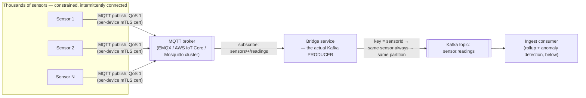
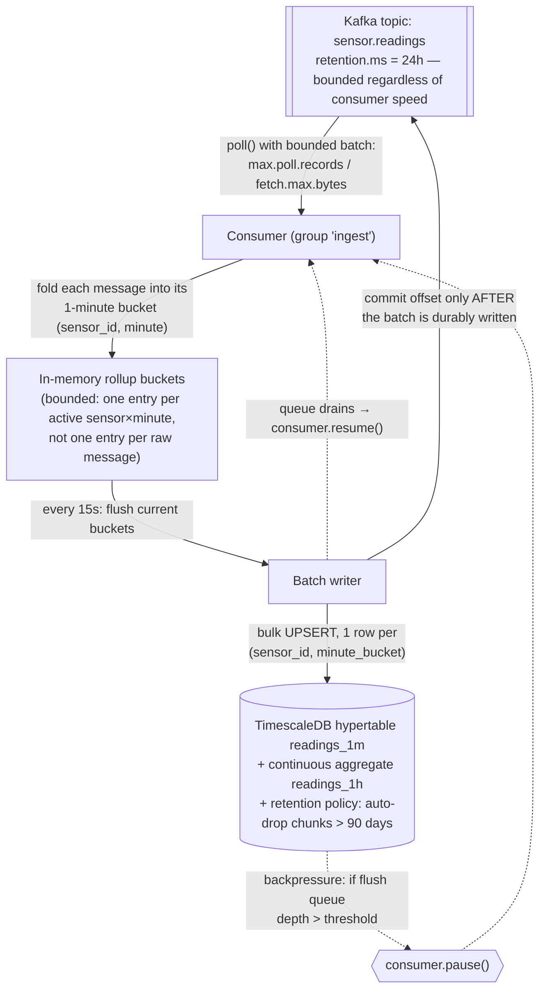
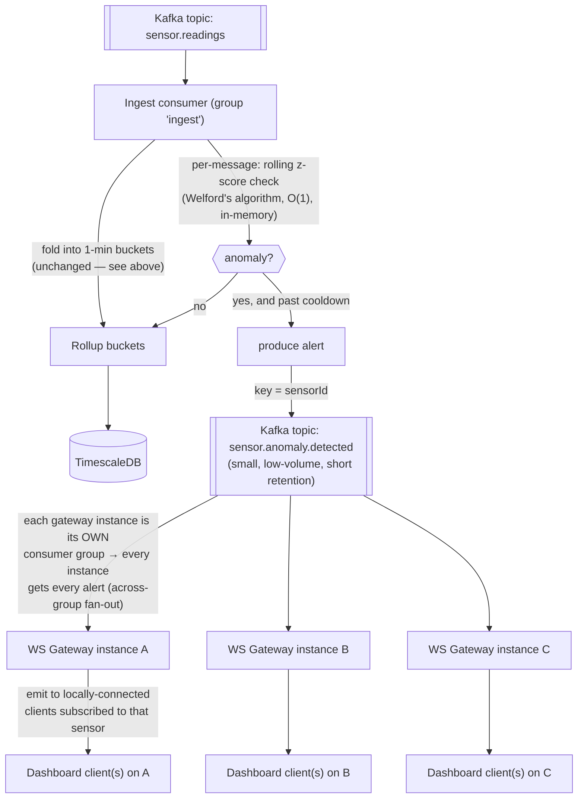

# Sensor-Readings Pipeline — a Worked Kafka Example

> A single worked example, extracted from the [Interview Concept Deep-Dives](10-interview-concepts-deep-dive.md) doc, that ties together edge ingestion (MQTT → Kafka bridge), bounded/paced/backpressured consumption, windowed rollups into a time-series store, real-time anomaly detection with a decoupled alert fan-out, and multi-tenant ownership/authorization. It leans throughout on Kafka internals covered in that doc's [§5](10-interview-concepts-deep-dive.md#5-apache-kafka--internals) (partitions/keys, consumer groups, offsets, delivery semantics) — read that section first if any of those mechanics are unfamiliar.

## Table of contents

1. [End to end: ingestion, rollup, and storage](#1-end-to-end-ingestion-rollup-and-storage)
2. [Extending the pipeline: real-time anomaly notification to clients](#2-extending-the-pipeline-real-time-anomaly-notification-to-clients)
3. [Sensor ownership: routing anomalies (and dashboard access) to the right customer](#3-sensor-ownership-routing-anomalies-and-dashboard-access-to-the-right-customer)
4. [Q&A](#4-qa)

---

## 1. End to end: ingestion, rollup, and storage

**First, the piece that comes before all of this: how does a reading from a physical sensor actually become a message in the `sensor.readings` topic?** Every example in the Kafka deep-dive starts from "a message arrives at the consumer" — worth closing the loop on where it came from.

**The sensor itself is (almost) never the Kafka producer.** Kafka's client protocol is a stateful, TCP-based binary protocol — it expects a persistent connection, awareness of cluster/partition metadata, retry and batching logic, and a non-trivial client library. That's a reasonable ask of a backend service; it's a poor fit for a battery-powered, intermittently-connected, resource-constrained IoT device. The standard real-world shape instead puts a **lightweight edge protocol** between the device and Kafka, with a small bridge component doing the actual producing:



Why this extra hop, rather than pointing devices straight at Kafka:

| Concern | Why the edge layer (MQTT broker + bridge) handles it better than the device itself |
|---|---|
| **Protocol weight** | MQTT is designed for exactly this class of device — tiny client footprint, works over flaky links, built-in QoS levels for at-least-once delivery from device to broker. A full Kafka producer client is much heavier to run on constrained hardware. |
| **Fleet-scale credential management** | Terminating auth (per-device mTLS certs or tokens) at the MQTT broker means only a handful of trusted bridge services ever hold real Kafka credentials — not every device in a fleet that could number in the thousands or millions. Fewer, tightly-controlled systems touching the Kafka cluster directly is a much smaller attack surface to secure and rotate credentials for. |
| **Offline buffering** | Devices on unreliable networks need to survive a dropped connection without losing readings. MQTT's persistent sessions + QoS 1/2 (and, at the broker, standard store-and-forward) give you this without reimplementing Kafka's own producer retry/idempotence machinery on constrained hardware. |
| **Efficient batching** | Thousands of low-throughput devices each opening their own Kafka producer connection is wasteful; funneling them through one bridge service lets that bridge do proper producer-side batching (`linger.ms`/`batch.size`) across many sensors' worth of traffic instead of one tiny request per device per reading. |

(Less constrained devices — an edge gateway aggregating many sensors on a factory floor, say, rather than the sensor itself — can reasonably skip the MQTT hop and run a real Kafka producer client directly; the MQTT bridge is the right default for genuinely small/battery-powered end devices, not a universal requirement.)

**The bridge — the actual Kafka producer (TypeScript / `kafkajs` + `mqtt`):**

```typescript
const mqttClient = mqtt.connect("mqtts://iot-broker:8883", { ca, cert, key }); // per-device mTLS terminates HERE, not at Kafka
const producer = kafka.producer();
await producer.connect();

mqttClient.subscribe("sensors/+/readings", { qos: 1 }); // MQTT's own at-least-once, device → broker

mqttClient.on("message", async (mqttTopic, payload) => {
  const sensorId = mqttTopic.split("/")[1]; // "sensors/{sensorId}/readings"
  const reading = JSON.parse(payload.toString());

  await producer.send({
    topic: "sensor.readings",
    messages: [{
      key: sensorId, // same key → same partition, every time → per-sensor ordering, which the anomaly detector (§2) depends on
      value: JSON.stringify(reading),
    }],
    acks: 1, // leader-ack is enough for routine telemetry; bump to acks=-1/all if a lost reading is unacceptable
  });
});
```

The `key: sensorId` choice isn't incidental — it's what guarantees every reading from one sensor lands in the same partition in the order it was produced, which both the rollup buckets and the rolling z-score anomaly detector (§2) silently depend on (per-sensor state that assumes it's seeing that sensor's readings in order, on one partition, never interleaved with a redelivered-out-of-order copy from elsewhere).

Three separate things can "bloat" in this picture, and it's worth untangling them before looking at the fix, since only one of them is actually about the database:

1. **The topic itself** — this is bounded by Kafka's own retention policy, **not** by how fast consumers read it. A slow consumer doesn't make the topic grow; it risks the opposite problem — if a consumer falls behind by more than the retention window, the broker deletes messages it hasn't read yet, and they're gone (a race between **consumer lag** and **retention**, worth monitoring explicitly via lag metrics).
2. **The consumer's own memory** — bloats if it pulls unbounded batches or queues messages faster than it can process them, with nothing capping how much sits in memory at once.
3. **The downstream database** — bloats if every raw message is written and kept forever, growing without limit as the topic produces indefinitely.

The pattern below (structurally identical to the ETL-into-rollup-tables approach used in this repo's [Real-Time Price Feed design](08-realtime-price-feed.md#5-fixes-applied-to-the-original-design)) addresses all three at once: **bounded, paced consumption** feeding a **windowed rollup** written to a **time-series-oriented store with an automatic retention policy**.



The two things doing the actual anti-bloat work in this diagram: **the buffer holds one entry per (sensor, minute), not one per raw message** — a sensor emitting every second collapses 60 raw readings into 1 row before it ever reaches the DB — and **the DB has a retention policy that drops old chunks automatically**, so storage growth flattens out instead of growing forever with topic volume.

**Consumer — bounded, paced, backpressured (TypeScript / `kafkajs`):**

> **A subtlety worth calling out explicitly**: offsets must be committed **only after** a flush's data is durably written — never per-message as each one is folded into the in-memory buckets. If you resolve/commit the offset the instant a message is folded into memory (before the next 15-second flush actually persists it), a crash in that up-to-15-second window loses the data **permanently**: Kafka won't redeliver it (you already told the broker you were done with it), and it was never written to the DB. That defeats the entire point of "commit after durable write." The version below tracks consumed-but-not-yet-flushed offsets separately and only commits them once `flush()` has confirmed the DB write succeeded — see the explanation of the remaining edge case right after the code.

```typescript
const consumer = kafka.consumer({ groupId: "ingest-sensor-readings" });
const buckets = new Map<string, { sum: number; count: number; min: number; max: number }>();
const pendingOffsets = new Map<number, string>(); // partition -> highest offset consumed since the last successful flush
let pendingFlushes = 0;
const MAX_PENDING_FLUSHES = 5; // backpressure threshold

async function flush() {
  if (buckets.size === 0) return;
  const rows = [...buckets.entries()];
  const offsetsToCommit = new Map(pendingOffsets); // snapshot exactly what this flush covers
  buckets.clear();
  pendingOffsets.clear();
  pendingFlushes++;
  try {
    // Rollup write + "applied up to this offset" marker, in ONE DB transaction — see SQL below.
    await upsertRollupBatchWithProgress(rows, offsetsToCommit);
    // Only NOW is it safe to tell Kafka these messages need never be redelivered.
    await consumer.commitOffsets(
      [...offsetsToCommit].map(([partition, offset]) => ({
        topic: "sensor.readings", partition, offset: (BigInt(offset) + 1n).toString(),
      })),
    );
  } finally {
    pendingFlushes--;
    if (pendingFlushes < MAX_PENDING_FLUSHES) {
      await consumer.resume([{ topic: "sensor.readings" }]);
    }
  }
}
setInterval(flush, 15_000); // pace: flush on a fixed cadence, not per-message

await consumer.subscribe({ topic: "sensor.readings" });
await consumer.run({
  autoCommit: false, // commits happen manually, from flush() only — never automatically, never per-message
  eachBatch: async ({ batch, heartbeat, isRunning, isStale }) => {
    for (const message of batch.messages) {
      if (!isRunning() || isStale()) break;
      const { sensorId, value, ts } = JSON.parse(message.value!.toString());
      const minute = new Date(Math.floor(new Date(ts).getTime() / 60_000) * 60_000).toISOString();
      const key = `${sensorId}:${minute}`;
      const b = buckets.get(key) ?? { sum: 0, count: 0, min: Infinity, max: -Infinity };
      b.sum += value; b.count++; b.min = Math.min(b.min, value); b.max = Math.max(b.max, value);
      buckets.set(key, b);
      pendingOffsets.set(batch.partition, message.offset); // remember it — do NOT commit yet
      await heartbeat();
    }
    if (pendingFlushes >= MAX_PENDING_FLUSHES) {
      await consumer.pause([{ topic: "sensor.readings" }]); // stop pulling until the DB catches up
    }
  },
});
```

The pacing mechanism has two parts: **`max.poll.records`/`fetch.max.bytes`** cap how much a single `poll()` can pull at once (bounding step 2's memory bloat above), and **`consumer.pause()`/`resume()`** stops pulling *at all* once too many flushes are in flight — this is the actual backpressure valve: it makes the consumer's pull rate track the database's write throughput instead of Kafka's produce rate, which is exactly what prevents an unbounded in-memory queue from forming when the DB is temporarily the bottleneck.

**Doesn't leaving message A uncommitted block the consumer from ever receiving message B?** No — and this is worth being precise about, because it's the detail that makes the whole delayed-commit design work at all. Kafka tracks **two separate positions** per partition, not one:

- **The fetch position** — purely in-memory, client-side, advances automatically every time `poll()`/`eachBatch` hands the consumer more messages. This is what determines "what do I get handed next" — and it has nothing to do with commits. Across the 15-second window between flushes, the consumer keeps calling `poll()` and receiving batch after batch (A, B, C, D, E, F, ...) continuously; none of that is gated on message A's offset ever being committed.
- **The committed offset** — durable, written to Kafka's internal `__consumer_offsets` topic, and only ever *read back* in one situation: **on (re)start or rebalance**, to answer "since I have no in-memory fetch position anymore, where should I resume?" It plays no role at all in the steady-state flow of messages while the consumer is up and running.

So in the corrected pipeline: over one 15-second window the consumer might poll and buffer thousands of messages, committing nothing until `flush()` finally succeeds and commits *once*, covering everything received in that window in one call. The commit is a **periodic checkpoint for crash recovery**, not a **per-message permission slip** — nothing before `flush()` runs is waiting on it.

This is a genuine point of contrast with RabbitMQ's model (see the [Interview Concept Deep-Dives, §6.3](10-interview-concepts-deep-dive.md#63-architecture-diagram--push-delivery--acknowledgement)): there, `prefetch` **does** cap how many *unacknowledged* messages a consumer may hold at once — cross that limit and the broker actually stops pushing more, tying delivery of new messages to acking old ones. Kafka has no equivalent coupling; the only thing that throttles how much a Kafka consumer pulls per round is `max.poll.records`/`fetch.max.bytes` (and, in this example, the explicit `pause()`/`resume()` backpressure), entirely independent of commit state.

**The remaining race, and why the fix isn't "just commit after the DB write."** Flipping the order (flush *then* commit, instead of commit *then* flush) removes the data-loss risk, but introduces the opposite, smaller risk: what if the DB write **succeeds** but the process crashes in the gap **before** `consumer.commitOffsets()` finishes? On restart, the consumer resumes from the last *committed* offset — which is now behind what was actually flushed — and Kafka **redelivers** messages that were already applied to the rollup table. That's at-least-once delivery working exactly as designed, but it means `flush()` could run a second time over some already-counted readings. Given the SQL below uses an **accumulating** merge (`sample_count = old + new`) — necessary because a single minute's bucket is genuinely written to across several 15-second flushes as readings for that minute keep arriving — reprocessing the same messages a second time would double-count them, not just re-write the same value. Committing after the write narrows the unsafe window from "up to 15 seconds, guaranteed loss" down to "a few milliseconds, possible duplicate application," but it doesn't eliminate it — closing it the rest of the way needs the write itself to be **idempotent** with respect to redelivery, which is what the `ingest_progress` table below does.

**Database — a time-series store with a retention policy, e.g. TimescaleDB (Postgres extension):**

```sql
CREATE TABLE readings_1m (
  sensor_id    TEXT NOT NULL,
  bucket       TIMESTAMPTZ NOT NULL,
  avg_value    DOUBLE PRECISION NOT NULL,
  sample_count INT NOT NULL,
  PRIMARY KEY (sensor_id, bucket)
);
SELECT create_hypertable('readings_1m', 'bucket');       -- auto-partitions by time into "chunks"
SELECT add_retention_policy('readings_1m', INTERVAL '90 days'); -- drops whole old chunks automatically

-- Pre-aggregate further so a "last year" query reads hundreds of rows, not millions
CREATE MATERIALIZED VIEW readings_1h WITH (timescaledb.continuous) AS
SELECT sensor_id, time_bucket('1 hour', bucket) AS hour, avg(avg_value) AS avg_value, sum(sample_count) AS sample_count
FROM readings_1m GROUP BY sensor_id, hour;
SELECT add_retention_policy('readings_1h', INTERVAL '2 years');

-- Closes the redelivery race above: this table's row IS the durable, transactional
-- record of "how far this partition has actually been applied" — it doesn't rely on
-- Kafka's committed offset (a separate system) ever being perfectly in sync with it.
CREATE TABLE ingest_progress (
  partition   INT PRIMARY KEY,
  last_offset BIGINT NOT NULL
);
```

Each flush now writes the rollup **and** advances `ingest_progress` in the **same transaction** (the same atomicity guarantee the Outbox pattern leans on — see the [Interview Concept Deep-Dives, §8](10-interview-concepts-deep-dive.md#8-outbox-pattern) — just applied on the consuming side instead of the producing side):

```sql
BEGIN;
  INSERT INTO readings_1m (sensor_id, bucket, avg_value, sample_count)
  SELECT * FROM UNNEST($1::text[], $2::timestamptz[], $3::float[], $4::int[])
  ON CONFLICT (sensor_id, bucket) DO UPDATE SET
    avg_value = (readings_1m.avg_value * readings_1m.sample_count + EXCLUDED.avg_value * EXCLUDED.sample_count)
                / (readings_1m.sample_count + EXCLUDED.sample_count),
    sample_count = readings_1m.sample_count + EXCLUDED.sample_count;

  INSERT INTO ingest_progress (partition, last_offset) VALUES ($partition, $offset)
  ON CONFLICT (partition) DO UPDATE SET last_offset = EXCLUDED.last_offset
  WHERE ingest_progress.last_offset < EXCLUDED.last_offset; -- never move backwards on a stale/duplicate flush
COMMIT;
```

With this in place, the consumer loads each owned partition's `last_offset` from `ingest_progress` once on startup/rebalance and **skips folding any message at or below it** into the buckets. That's what actually makes redelivery safe end to end: if the crash happens between the DB commit and `consumer.commitOffsets()` (the race described above), Kafka redelivers a few already-applied messages, but the consumer recognizes them as already-applied via `ingest_progress` and discards them instead of double-merging — Kafka's own committed offset is left as just a coarse "resume roughly here" checkpoint, while `ingest_progress` is the actual source of truth for "has this been applied," which is the standard **idempotent consumer** pattern (see the [Interview Concept Deep-Dives, §10.4](10-interview-concepts-deep-dive.md#104-idempotency--message-delivery-semantics)) applied concretely to this pipeline.

**Why a time-series store (TimescaleDB / ClickHouse / InfluxDB), not a plain relational table or a generic NoSQL store:**

| Requirement | Time-series store | Plain OLTP table / generic NoSQL |
|---|---|---|
| Sustained high-volume timestamped writes | Built for it — data is auto-partitioned by time (hypertable "chunks" / ClickHouse partitions). | A single unpartitioned table degrades as it grows — index bloat, vacuum/compaction pressure, slower writes over time. |
| **Storage that stays bounded over time** | Retention policies drop entire old time partitions in one metadata operation — cheap, fast, actually reclaims disk. | `DELETE WHERE ts < ...` on a huge table is slow, lock-heavy, and doesn't reclaim space without a separate, expensive maintenance step (e.g., `VACUUM FULL`). |
| "Give me the last 30/90/365 days aggregated" queries | Continuous aggregates / materialized rollups pre-compute this incrementally as data lands. | Aggregating raw rows on every query request gets slower as history accumulates. |
| Storage efficiency for numeric timestamped data | Columnar/time-series-aware compression (commonly 10–20x) — this is what actually makes storing the rollups cheap even at scale. | Row-store compression on a general-purpose table is far less effective for this specific data shape. |

The general principle to say in an interview: **don't fight storage growth by consuming faster — fight it by storing less per raw message (aggregate before you persist) and by picking a store that expires old data structurally (retention policies / TTL) rather than relying on someone remembering to run cleanup jobs.** Consumption *pace* (batch size + pause/resume backpressure) is what keeps the *consumer* healthy under load; it's the rollup + retention-policy combination that's what actually keeps the *database* from growing without bound.

---

## 2. Extending the pipeline: real-time anomaly notification to clients

The rollup path above is deliberately **not** real-time — it flushes on a 15-second cadence, which is fine for "store history efficiently" but wrong for "tell someone immediately that sensor 42 just spiked." Anomaly detection needs to happen **per message, as it arrives**, on a separate path from the batched storage write — and delivering it to connected clients (a live dashboard) needs its own fan-out mechanism, because "push to whichever browsers are currently connected" is a completely different scaling problem than "append to a time-series table." The fix is to add a second, low-latency branch off the same consumer, decoupled from delivery via its own Kafka topic:



**Step 1 — detect, in the same consumer, without waiting for the flush cycle.** A rolling per-sensor baseline (mean/stddev via **Welford's online algorithm** — O(1) per message, no need to keep a history buffer) lets each incoming reading be scored the instant it's read, independent of the 15-second rollup cadence:

```typescript
// Rolling per-sensor anomaly detector — lives alongside the bucket-folding logic in eachBatch
const stats = new Map<string, { n: number; mean: number; m2: number }>();
const lastAlertAt = new Map<string, number>();
const ALERT_COOLDOWN_MS = 5 * 60_000; // one alert per sensor per 5 min while it stays anomalous
const Z_SCORE_THRESHOLD = 4;

function checkAnomaly(sensorId: string, value: number): number | null {
  const s = stats.get(sensorId) ?? { n: 0, mean: 0, m2: 0 };
  s.n++;
  const delta = value - s.mean;
  s.mean += delta / s.n;
  s.m2 += delta * (value - s.mean);
  stats.set(sensorId, s);

  if (s.n < 30) return null; // not enough history yet to trust the baseline
  const stddev = Math.sqrt(s.m2 / s.n);
  const zScore = stddev === 0 ? 0 : Math.abs(value - s.mean) / stddev;
  return zScore > Z_SCORE_THRESHOLD ? zScore : null;
}
```

Inside the existing `eachBatch` loop (§1), after folding the reading into its bucket, run the check and — **only on a state change past a cooldown, not on every anomalous reading** — publish an alert:

```typescript
const zScore = checkAnomaly(sensorId, value);
if (zScore !== null) {
  const last = lastAlertAt.get(sensorId) ?? 0;
  if (Date.now() - last > ALERT_COOLDOWN_MS) {
    lastAlertAt.set(sensorId, Date.now());
    await alertProducer.send({
      topic: "sensor.anomaly.detected",
      messages: [{ key: sensorId, value: JSON.stringify({ sensorId, value, zScore, ts, detectedAt: new Date().toISOString() }) }],
    });
  }
}
```

The cooldown matters as much as the detection: without it, a sensor stuck reading an anomalous value produces one alert **per message** (potentially hundreds a minute) instead of one alert per *episode* — the same alert-storm problem the [Notification System design (§2, priority topics)](01-notification-system.md) in this repo deals with more generally.

**Step 2 — why a separate Kafka topic instead of pushing to clients directly from the ingest consumer.** This is a deliberate decoupling, for the same reasons the [Interview Concept Deep-Dives' Bulkhead pattern (§10.9)](10-interview-concepts-deep-dive.md#109-bulkhead-pattern) argues for isolating unrelated failure domains:
- The ingest consumer's job is to keep up with the raw firehose (§1) — it shouldn't own WebSocket connection management, which has an entirely different scaling axis (number of *connected browsers*, not message throughput).
- `sensor.anomaly.detected` is itself just a Kafka topic, so it's durable, replayable, and — per the Kafka deep-dive's [across-groups fan-out rule (§5.4.1)](10-interview-concepts-deep-dive.md#541-directly-answering-does-each-group-member-read-a-different-partition-and-different-data) — any number of independent consumers can subscribe to it for free: a WebSocket gateway for live dashboards, and separately, the actual [Notification System design](01-notification-system.md) in this repo for SMS/email/push escalation, an audit-log service, an on-call paging integration — none of them need to touch the ingest consumer or each other.

**Step 3 — fan out to connected clients using the exact mechanic from the Kafka deep-dive's §5.4.1.** Each WebSocket gateway instance runs `sensor.anomaly.detected` consumption in **its own, uniquely-named consumer group** (e.g. `ws-gateway-${instanceId}`) rather than sharing one group across instances — which means every instance gets **every** alert (the "full duplication across groups" rule), and can then simply check which of *its own* locally-connected clients care about that `sensorId` and emit to just those:

```typescript
const alertConsumer = kafka.consumer({
  groupId: `ws-gateway-${instanceId}`,       // unique per instance → every instance sees every alert
});
await alertConsumer.subscribe({ topic: "sensor.anomaly.detected", fromBeginning: false }); // only new alerts — no need to replay history into a freshly-started gateway

await alertConsumer.run({
  eachMessage: async ({ message }) => {
    const alert = JSON.parse(message.value!.toString());
    io.to(`sensor:${alert.sensorId}`).emit("anomaly", alert); // only clients subscribed to this sensor's room get it
  },
});
```

This sidesteps needing a cross-instance fan-out layer (e.g., a Redis pub/sub adapter for Socket.IO) entirely — Kafka's own per-group full-duplication *is* the fan-out mechanism, since every gateway instance is, by construction, its own group. `fromBeginning: false` is deliberate too: a newly (auto-)scaled-up gateway instance only needs alerts from *now on*, not a replay of historical anomalies nobody's watching for anymore.

**Why this stays "real-time" end to end**: nothing in this second path waits on the 15-second rollup flush or the database — detection is O(1) per message, the alert topic is small/low-volume so producer→consumer latency is milliseconds, and delivery is a direct in-memory WebSocket `emit()` once the gateway has the message. The storage path (§1) and the notification path (this section) share the same source topic and the same ingest consumer's read loop, but are otherwise fully independent — a slow TimescaleDB write can never delay an anomaly alert, and a burst of alerts can never stall the rollup flush.

---

## 3. Sensor ownership: routing anomalies (and dashboard access) to the right customer

Everything above treats "notify someone" and "let someone view this sensor" as if there's one undifferentiated audience. In a real multi-tenant deployment, sensors belong to customers — sensor 42's reading is only supposed to reach customer 7's dashboard and customer 7's on-call phone, not anyone else's. That requires a place that knows, authoritatively, `sensorId -> customerId`, and every path that touches a sensor's data — ingestion itself doesn't need it, but anomaly delivery and dashboard queries do — needs to consult it.

**The registry itself.** This is reference/config data: low write rate (a sensor is provisioned once and rarely reassigned), high read rate (every anomaly alert and every dashboard request needs the mapping) — the opposite access pattern from the readings themselves, so it doesn't belong in TimescaleDB next to the rollups. A small relational table is enough:

```sql
CREATE TABLE sensor_registry (
  sensor_id     TEXT PRIMARY KEY,
  customer_id   TEXT NOT NULL,
  registered_at TIMESTAMPTZ NOT NULL DEFAULT now()
);
CREATE INDEX idx_sensor_registry_customer ON sensor_registry (customer_id);
```

The primary key gives O(1) `sensorId -> customerId` (what the anomaly path needs); the index gives `customerId -> sensorId[]` (what "list my sensors" on a dashboard needs).

**Don't hit this table per message.** The anomaly detector runs per-message, in the hot path (§2) — a DB round-trip on every reading to resolve ownership would undo the whole point of doing detection in-process with an O(1) rolling z-score. Since registrations change rarely, keep an in-memory cache in every service that needs the mapping (the ingest consumer, the WS gateway), loaded on startup and refreshed periodically:

```typescript
const registryCache = new Map<string, string>(); // sensorId -> customerId

async function refreshRegistry() {
  const rows = await db.query("SELECT sensor_id, customer_id FROM sensor_registry");
  registryCache.clear();
  for (const r of rows) registryCache.set(r.sensor_id, r.customer_id);
}
await refreshRegistry();
setInterval(refreshRegistry, 60_000); // registrations change rarely — a minute of staleness is fine
```

If reassignment needs to propagate faster than a minute (e.g., revoking a decommissioned sensor's access immediately), swap the poll for the same pattern used elsewhere in this repo: an outbox row (see the [Interview Concept Deep-Dives, §8](10-interview-concepts-deep-dive.md#8-outbox-pattern)) written in the same transaction as the registry update, published to a small `sensor.registry.changed` topic, consumed by each cache-holder to invalidate just that one key instead of re-polling the whole table. Start with polling; only add the topic if staleness actually becomes a problem.

**Path 1 — scoping anomaly alerts to the owning customer.** §2's alert payload only carried `sensorId`; add the lookup at publish time so the alert is self-contained:

```typescript
const zScore = checkAnomaly(sensorId, value);
if (zScore !== null /* ...cooldown check as before... */) {
  const customerId = registryCache.get(sensorId);
  await alertProducer.send({
    topic: "sensor.anomaly.detected",
    messages: [{
      key: sensorId,
      value: JSON.stringify({ sensorId, customerId, value, zScore, ts, detectedAt: new Date().toISOString() }),
    }],
  });
}
```

This one field is what turns the rest of the fan-out customer-aware instead of merely sensor-aware:
- The **WS gateway** (§2) joins clients to a room keyed by customer, not by sensor — `customer:${customerId}` — so a client only ever receives alerts for sensors their own customer account owns, and emits using the `customerId` already on the alert instead of re-deriving it:
  ```typescript
  eachMessage: async ({ message }) => {
    const alert = JSON.parse(message.value!.toString());
    io.to(`customer:${alert.customerId}`).emit("anomaly", alert);
  }
  ```
- The **Notification System** ([01-notification-system.md](01-notification-system.md)) referenced in §2 for SMS/email/push escalation needs a `customerId` to look up *whose* registered contact channels to use — a bare `sensorId` isn't something that design's recipient lookup can act on, so this field is what actually lets that integration work rather than just being a plausible-sounding arrow in a diagram.

**Path 2 — authorizing dashboard access to a sensor's data.** The same registry answers "is this customer even allowed to see this sensor" for the read side (§1's rollup tables), which otherwise has no access control at all:

```sql
-- "give me sensor 42's last hour" — scoped to the requesting customer
SELECT r.*
FROM readings_1m r
JOIN sensor_registry s ON s.sensor_id = r.sensor_id
WHERE r.sensor_id = $1 AND s.customer_id = $2  -- $2 = authenticated customer, never client-supplied
ORDER BY r.bucket DESC LIMIT 60;

-- "what sensors does this customer even have" — populates the dashboard's sensor picker
SELECT sensor_id FROM sensor_registry WHERE customer_id = $1;
```

The same check applies to the **live** path: when a client asks the WS gateway to subscribe to one specific sensor's room (rather than just its customer-wide alert room), the gateway checks `registryCache.get(sensorId) === client.customerId` (from the client's auth token, never a value the client sends) before allowing the `socket.join` — otherwise one customer could subscribe to another's `sensor:${sensorId}` room by guessing or enumerating IDs. The customer-scoped room from Path 1 closes this gap for anomaly alerts; this check closes the equivalent gap for direct per-sensor subscriptions.

**Why the mapping lives in a registry rather than being carried on every raw reading.** It'd be simpler at first glance to just stamp `customerId` onto every message at the MQTT bridge (§1) and skip the registry lookup downstream entirely. Two reasons this doc doesn't do that:
- **Reassignment.** If a sensor moves to a different customer (device resold, site decommissioned), a `customerId` baked into the raw event stream is wrong for any consumer that trusts it from then on, with no single place to correct it short of distrusting the stream. A registry lookup at read/alert time always reflects *current* ownership; a value embedded at ingest time reflects ownership *at ingest*, forever.
- **Blast radius of a mistake.** The registry is the one place ownership can be audited, corrected, and secured independently of the high-volume telemetry pipeline — fixing a wrong `customer_id` is a one-row `UPDATE`, not a reprocessing job over a Kafka topic's retention window.

This is the same "resolve by lookup against current state, don't bake it into the event" logic that shows up anywhere an authorization decision has to stay correct as ownership changes.

---

## 4. Q&A

- **"Why not just point the sensor straight at Kafka?"** Kafka's client protocol is heavyweight for constrained IoT hardware (persistent TCP connection, cluster metadata awareness, retry/batching logic). A lightweight edge protocol (MQTT) plus a small bridge service that does the actual producing handles protocol weight, fleet-scale credential management, offline buffering, and batching far better than every device running its own Kafka producer — see §1.
- **"How do you keep the consumer from either losing data or ballooning memory?"** Bound the pull with `max.poll.records`/`fetch.max.bytes`, buffer into per-(sensor, minute) rollup entries instead of one entry per raw message, and gate further pulls with `consumer.pause()`/`resume()` once too many DB flushes are in flight — the pull rate ends up tracking DB write throughput, not Kafka's produce rate. See §1.
- **"Why commit the offset only after the DB flush, not as each message is processed?"** Committing early and then crashing before the next flush loses that data permanently — Kafka won't redeliver a message you already told it you were done with. Committing after the flush narrows the risk to a small window where a crash between the DB write and the commit causes redelivery of already-applied messages instead of data loss — closed the rest of the way by an idempotent write (`ingest_progress` table) rather than trying to make the commit itself perfectly atomic with the DB write. See §1.
- **"Why a time-series database instead of a normal table?"** Time-partitioned storage, retention policies that drop whole old partitions cheaply, pre-computed continuous aggregates, and time-series-aware compression — all of which a general-purpose OLTP table or generic NoSQL store either can't do or does much less efficiently at this write volume. See §1.
- **"Why a separate Kafka topic for anomaly alerts instead of pushing to clients directly from the ingest consumer?"** Bulkhead isolation — the ingest consumer's scaling axis is message throughput, a WebSocket gateway's is connected-browser count; keeping them as separate consumers of a shared topic means a slow DB write can never delay an alert, and an alert burst can never stall the rollup flush. It also gets independent consumers (notification service, audit log, paging integration) "for free" via Kafka's fan-out-across-groups behavior. See §2.
- **"Why not just put `customerId` on every `sensor.readings` message instead of a registry?"** Because ownership can change after a reading is produced — a value baked into the raw event reflects ownership at ingest time forever, while a registry lookup at alert/read time always reflects current ownership. See §3.
- **"How is one customer stopped from seeing another customer's sensor data or alerts?"** Two independent enforcement points, both driven by the same `sensor_registry` table: anomaly alerts are delivered to a customer-scoped room (`customer:${customerId}`) resolved from the registry at publish time rather than a sensor-scoped room anyone could join; and every dashboard read query joins against `sensor_registry` on the *authenticated* customer's ID, never one supplied by the client. See §3.
