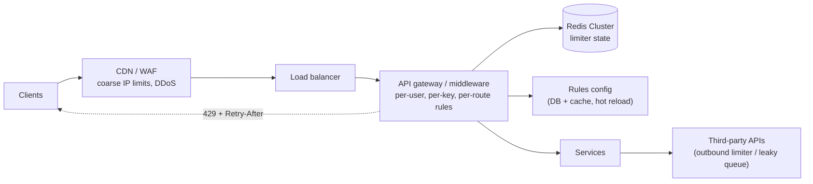
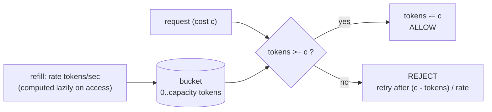
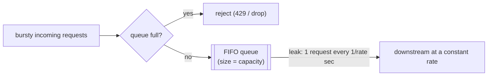
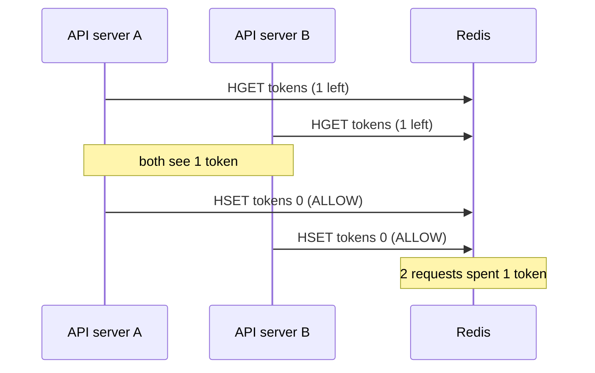
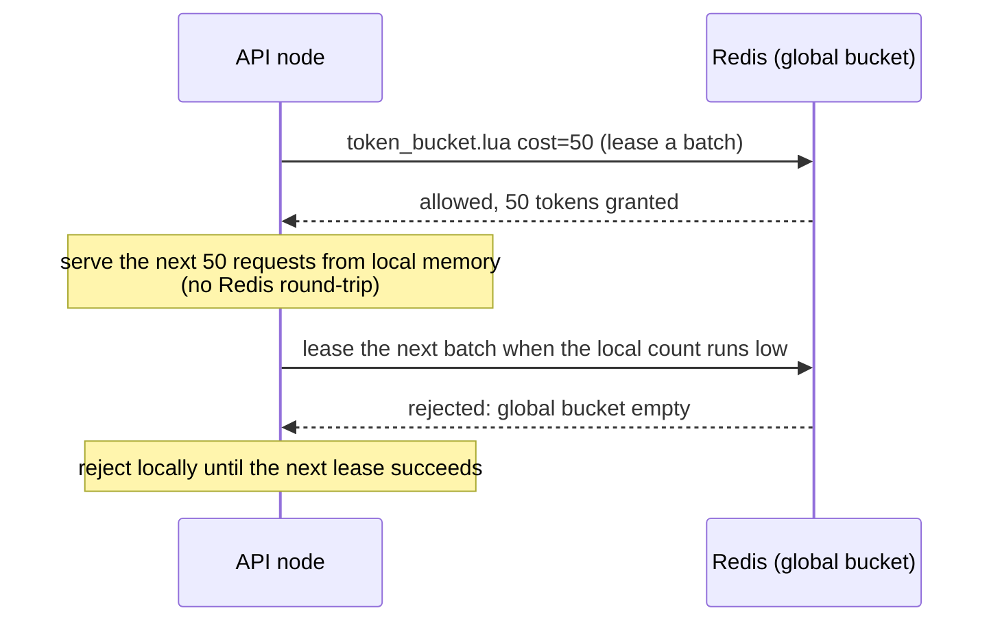
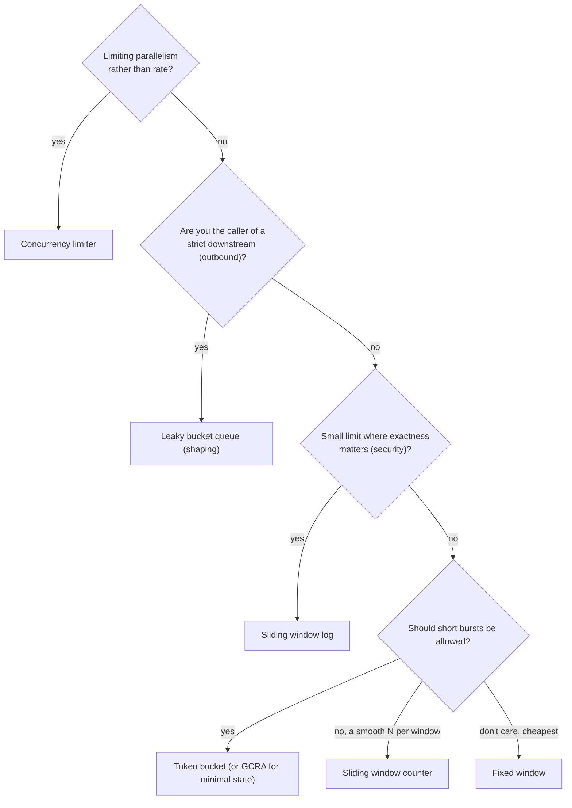

# Rate Limiter: System Design & Algorithm Deep-Dive

> **Scope:** what a rate limiter must do, where it sits, and **every major algorithm with the exact counting logic**: fixed window, sliding window log, sliding window counter, token bucket, leaky bucket (queue and meter), GCRA, and concurrency limiters. Each algorithm gets a single-process TypeScript version (to explain the math) and an **atomic Redis/Lua version** (to run it across a fleet). Then the distributed design: atomicity, clock skew, hot keys, Redis failure, multi-region, local+global hybrids, headers, and an interview Q&A bank.
>
> **Stack used:** Node.js 18+, TypeScript, Express, `redis` (node-redis v4+), Redis ≥ 5 (scripts can call `TIME` before writing).
>
> Related: [Redis deep-dive §8](../concepts/12-redis-nodejs-deep-dive.md) (shorter version of the Redis scripts) · [Redis §7](../concepts/12-redis-nodejs-deep-dive.md) (atomicity and Lua) · [Optima channel manager](09-optima-channel-manager-v2.md) (per-provider outbound limits) · [Interview concepts §10.6](../concepts/01-interview-concepts-deep-dive.md)

---

## 0. TL;DR (the 60-second interview answer)

1. A rate limiter answers one question per request: **"Has this key used more than its allowance in this time frame?"** Key = user, API key, IP, tenant, endpoint, or a combination of them. Rejected requests get **`429 Too Many Requests`** with **`Retry-After`**.
2. **Algorithms**, from simplest to smoothest:
   - **Fixed window:** one counter per window. O(1). Allows **2× bursts at window edges**.
   - **Sliding window log:** stores every timestamp. Exact, but **O(limit) memory** per key.
   - **Sliding window counter:** two counters weighted by overlap. O(1), **approximate but very close**. This is Cloudflare's choice.
   - **Token bucket:** `capacity` + `refill rate`, lazy refill on access. O(1). **Allows controlled bursts**, the most common choice (AWS API Gateway, Stripe).
   - **Leaky bucket:** as a **queue**, it smooths output to a constant rate (traffic shaping). As a **meter**, it's the mirror image of the token bucket.
   - **GCRA:** a token bucket stored as a **single timestamp** (theoretical arrival time). O(1), one key, exact `Retry-After`.
   - **Concurrency limiter:** caps **in-flight** requests, not the rate. Protects slow endpoints.
3. **Distributed:** the state lives in Redis and the **read-modify-write must be atomic**. Use a Lua script. Use **Redis's clock** (`TIME`), not the app servers'. One key per limit so Redis Cluster can route it.
4. **Hard parts:** latency on every request (aim for <1 ms, pipeline or lease tokens locally), **fail-open vs. fail-closed** when Redis is down, hot keys, multi-region consistency, and returning useful headers so well-behaved clients back off.

---

## 1. Requirements

### 1.1 Functional
- Limit requests per **key** (user ID, API key, IP, tenant) per **rule** (e.g. 100 req/min on `POST /orders`, 10 k req/day per API key).
- Support multiple rules per request (per-user **and** per-IP **and** global). The request is rejected if **any** rule rejects it.
- Support **weighted** requests (`cost`): an expensive search costs 10 tokens, a read costs 1.
- Return `429` + `Retry-After` + remaining-quota headers.
- Rules are configurable without a deploy (tiers: free / pro / enterprise).

### 1.2 Non-functional
- **Low latency:** limiter overhead < 1-2 ms p99, because it runs on every request.
- **Accuracy:** a small overshoot (a few %) is acceptable for API quotas. Exact limits are required for security rules (login attempts, OTP sends).
- **Highly available:** a limiter outage must not take the API down (usually **fail open**), except for abuse/security limits (**fail closed**).
- **Shared across the fleet:** 100 API servers must enforce **one** limit, not 100× the limit.
- **Memory-efficient:** millions of keys (every user × every rule).

### 1.3 Back-of-envelope
- 50 k req/s at the gateway, 3 rules per request → **150 k limiter checks/s**. A single Redis shard handles ~100 k+ simple Lua calls/s, so use a small Redis Cluster (3-6 primaries) or a local+global hybrid (§11.4).
- 10 M active keys:
  - Token bucket / GCRA / fixed window: ~60-120 bytes per key (key + small hash/string + expiry overhead) → **~1 GB**.
  - Sliding window **log** at limit = 100: ~100 sorted-set entries × ~60-80 bytes → ~7 KB per key → **~70 GB**. This is why the log is reserved for small limits or security rules.

---

## 2. Where the limiter sits



| Layer | What it limits | Typical algorithm |
|---|---|---|
| **CDN / WAF** | IP floods, bots, L7 DDoS | Fixed/sliding window per IP, at the edge |
| **API gateway / middleware** | Per user / API key / tenant / route quotas | Token bucket, GCRA, sliding window counter |
| **Inside a service** | Expensive operations (export, search), concurrency | Concurrency limiter, weighted token bucket |
| **Outbound (client side)** | Your calls to a third party with its own limits | Leaky bucket queue (shaping) |
| **Client SDK** | Be a good citizen: honour `Retry-After`, back off with jitter | Exponential backoff |

**Rate limiting vs. related concepts:** *throttling* usually means slowing down (queueing) rather than rejecting. *Quotas* are long windows (per day/month, often billing-related). *Load shedding* rejects based on **server health**, not per-client usage. *Circuit breakers* protect **you** from a failing dependency.

---

## 3. A common interface

All algorithms below implement the same contract, so the middleware (§10) doesn't care which one is used. Clocks are injected so the logic is deterministic in tests.

```ts
// limiter/types.ts
export interface Decision {
  allowed: boolean;
  remaining: number;    // whole units left after this request (0 when rejected)
  retryAfterMs: number; // 0 when allowed; otherwise the earliest time a retry can succeed
}

export interface RateLimiter {
  tryAcquire(key: string, cost?: number): Decision;
}

export type Clock = () => number; // ms since epoch; Date.now in production, a fake in tests
```

> In-memory versions keep state in a `Map`. In production you'd also **evict idle keys** (LRU with a max size, or a periodic sweep of keys whose state is "full"/expired), or the map grows forever.

---

## 4. Fixed window counter

**Idea:** split time into fixed windows (`[12:00:00, 12:01:00)`, …), count requests per (key, window), and reject once the count reaches the limit.

```text
limit = 5 / minute
window:   |---- 12:00 ----|---- 12:01 ----|
requests:   x x x x x  ✗    x x x x x ✗
count:      1 2 3 4 5  5    1 2 3 4 5 5      (reset to 0 at each boundary)
```

### 4.1 Core algorithm

> Step-by-step walkthrough of this code: [Fixed window rate limiter code flow](12-rate-limiter-fixed-window-rate-limiter-flow.md)

```ts
// limiter/fixedWindow.ts
export class FixedWindowLimiter implements RateLimiter {
  private state = new Map<string, { windowStart: number; count: number }>();

  constructor(private limit: number, private windowMs: number, private now: Clock = Date.now) {}

  tryAcquire(key: string, cost = 1): Decision {
    const now = this.now();
    const windowStart = now - (now % this.windowMs); // align to the window grid

    let s = this.state.get(key);
    if (!s || s.windowStart !== windowStart) {
      s = { windowStart, count: 0 }; // new window -> counter resets
      this.state.set(key, s);
    }

    const resetIn = windowStart + this.windowMs - now;
    if (s.count + cost > this.limit) {
      return { allowed: false, remaining: this.limit - s.count, retryAfterMs: resetIn };
    }
    s.count += cost; // count only accepted requests
    return { allowed: true, remaining: this.limit - s.count, retryAfterMs: 0 };
  }
}
```

### 4.2 Distributed version (Redis + Lua)

One hash per key holds `{start, count}`. The window is computed from **Redis's** clock, so app servers with skewed clocks can't disagree about which window they're in.

```lua
-- fixed_window.lua   KEYS[1]=rl:fw:<key>   ARGV: limit, window_ms, cost
local limit, window, cost = tonumber(ARGV[1]), tonumber(ARGV[2]), tonumber(ARGV[3])
local t = redis.call('TIME')
local now = t[1] * 1000 + math.floor(t[2] / 1000)
local start = now - (now % window)

local h = redis.call('HMGET', KEYS[1], 'start', 'count')
local count = 0
if tonumber(h[1]) == start then count = tonumber(h[2]) end   -- older window -> treat as 0

local reset_in = start + window - now
if count + cost > limit then
  return {0, limit - count, reset_in}
end

count = count + cost
redis.call('HSET', KEYS[1], 'start', start, 'count', count)
redis.call('PEXPIRE', KEYS[1], reset_in)                       -- key disappears with its window
return {1, limit - count, 0}
```

The common simpler variant is `INCR rl:<key>:<windowIndex>` + `EXPIRE NX` (see [Redis §8](../concepts/12-redis-nodejs-deep-dive.md)). It's one command, but it **counts rejected requests** too, and it relies on the app server's clock for the window index.

### 4.3 Properties
- **O(1)** time and memory. Cheapest possible.
- **Boundary burst:** up to **2 × limit** in a span of `window` (or even a few ms) around the edge:

```text
limit = 100/min
        12:00:00                12:01:00                12:02:00
           |----------------------|----------------------|
                       100 req ▲ ▲ 100 req
                     (12:00:59)   (12:01:00)
           -> 200 requests within ~1 second, both windows "within limit"
```

- **Synchronized thundering herd:** all clients that were rejected retry exactly at the window reset.
- **Use when:** coarse limits where a 2× edge burst is harmless (daily quotas, edge IP limits), or as the cheapest first line of defence.

---

## 5. Sliding window log

**Idea:** remember the **timestamp of every accepted request**. A new request is allowed if fewer than `limit` timestamps fall within `(now - window, now]`. It's exact: the window truly slides with each request.

```text
limit = 3 / 10s        now = 25s     window = (15s, 25s]
log: [12s, 14s, 17s, 21s]  -> drop 12s, 14s (outside) -> [17s, 21s] -> count 2 < 3 -> ALLOW, append 25s
```

### 5.1 Core algorithm: ring buffer (O(1) per request)

For `cost = 1`, you only ever need the **last `limit` accepted timestamps**. If the oldest of them is still inside the window, there are already `limit` requests in the window.

```ts
// limiter/slidingLog.ts
export class SlidingLogLimiter implements RateLimiter {
  private state = new Map<string, { ts: Float64Array; head: number }>();

  constructor(private limit: number, private windowMs: number, private now: Clock = Date.now) {}

  tryAcquire(key: string, cost = 1): Decision {
    if (cost !== 1) throw new Error("sliding log stores one timestamp per request: cost must be 1");
    const now = this.now();

    let s = this.state.get(key);
    if (!s) {
      s = { ts: new Float64Array(this.limit).fill(-Infinity), head: 0 }; // head = oldest slot
      this.state.set(key, s);
    }

    const oldest = s.ts[s.head]; // the accepted request made `limit` requests ago
    if (now - oldest < this.windowMs) {
      // `limit` requests already inside the window; retry when the oldest falls out
      return { allowed: false, remaining: 0, retryAfterMs: oldest + this.windowMs - now };
    }

    s.ts[s.head] = now; // overwrite the oldest with this request
    s.head = (s.head + 1) % this.limit;

    // remaining = free slots in the window (O(limit) scan; skip it if you don't need the header)
    let inWindow = 0;
    for (const t of s.ts) if (now - t < this.windowMs) inWindow++;
    return { allowed: true, remaining: this.limit - inWindow, retryAfterMs: 0 };
  }
}
```

The textbook version uses a deque: pop timestamps from the front while they're older than `now - window`, then compare the length to `limit`. That's the same result in amortized O(1), but needs a growable structure.

### 5.2 Distributed version (Redis sorted set)

Score = timestamp, member = **unique request ID**. Two requests in the same millisecond with member = timestamp would collapse into one entry, which is a classic bug.

```lua
-- sliding_log.lua   KEYS[1]=rl:log:<key>   ARGV: limit, window_ms, request_id
local limit, window, id = tonumber(ARGV[1]), tonumber(ARGV[2]), ARGV[3]
local t = redis.call('TIME')
local now = t[1] * 1000 + math.floor(t[2] / 1000)

redis.call('ZREMRANGEBYSCORE', KEYS[1], '-inf', now - window)   -- evict entries outside (now-window, now]
local count = redis.call('ZCARD', KEYS[1])

if count >= limit then
  local oldest = redis.call('ZRANGE', KEYS[1], 0, 0, 'WITHSCORES')
  return {0, 0, tonumber(oldest[2]) + window - now}
end

redis.call('ZADD', KEYS[1], now, id)
redis.call('PEXPIRE', KEYS[1], window)
return {1, limit - count - 1, 0}
```

```ts
await redis.eval(SLIDING_LOG, { keys: [`rl:log:${key}`], arguments: [String(limit), String(windowMs), crypto.randomUUID()] });
```

### 5.3 Properties
- **Exact:** never more than `limit` in any window-length span.
- **Memory O(limit) per key:** fine for "5 login attempts per 15 min", painful for "10 000 req/hour" × millions of keys.
- `ZREMRANGEBYSCORE` cost grows with the number of expired entries removed.
- Should rejected requests be logged too? If you add them, a client that keeps hammering stays blocked forever (a punitive variant). The standard choice is to log accepted requests only.
- **Use when:** low limits where exactness matters: login/OTP/password-reset attempts, "max 3 SMS per phone per hour".

---

## 6. Sliding window counter (weighted)

**Idea:** keep only **two fixed-window counters** (previous and current), and estimate the sliding count by assuming requests in the previous window were **evenly spread**:

```text
estimate = prev_count × (1 − elapsed / window) + curr_count
```

```text
limit = 100/min, now = 12:01:15 (25% into the current window)
prev window [12:00, 12:01): 84 requests
curr window [12:01, 12:02): 36 requests
the sliding window (12:00:15, 12:01:15] overlaps 75% of prev:
estimate = 84 × 0.75 + 36 = 63 + 36 = 99  -> 99 + 1 <= 100 -> ALLOW (estimate becomes 100)
```

### 6.1 Core algorithm

```ts
// limiter/slidingWindowCounter.ts
export class SlidingWindowCounterLimiter implements RateLimiter {
  private state = new Map<string, { start: number; curr: number; prev: number }>();

  constructor(private limit: number, private windowMs: number, private now: Clock = Date.now) {}

  tryAcquire(key: string, cost = 1): Decision {
    const now = this.now();
    const start = now - (now % this.windowMs);

    let s = this.state.get(key);
    if (!s) {
      s = { start, curr: 0, prev: 0 };
      this.state.set(key, s);
    } else if (s.start !== start) {
      // roll forward: if exactly one window passed, curr becomes prev; if more, both are 0
      s.prev = s.start === start - this.windowMs ? s.curr : 0;
      s.curr = 0;
      s.start = start;
    }

    const elapsed = now - start;
    const prevWeight = (this.windowMs - elapsed) / this.windowMs; // share of prev window still inside
    const estimate = s.prev * prevWeight + s.curr;

    if (estimate + cost > this.limit) {
      return { allowed: false, remaining: 0, retryAfterMs: this.retryAfter(s, cost, elapsed) };
    }
    s.curr += cost;
    return { allowed: true, remaining: Math.floor(this.limit - estimate - cost), retryAfterMs: 0 };
  }

  // Solve prev × (1 − f) + curr + cost <= limit for f, the fraction of the window that must elapse.
  private retryAfter(s: { curr: number; prev: number }, cost: number, elapsed: number): number {
    const room = this.limit - s.curr - cost;
    if (room >= 0 && s.prev > 0) {
      const f = 1 - room / s.prev; // weight of prev must drop to room/prev
      return Math.max(1, Math.ceil(f * this.windowMs - elapsed));
    }
    return this.windowMs - elapsed; // current window alone is full: wait for the roll (then re-check)
  }
}
```

### 6.2 Distributed version (Redis + Lua)

```lua
-- sliding_counter.lua   KEYS[1]=rl:swc:<key>   ARGV: limit, window_ms, cost
local limit, window, cost = tonumber(ARGV[1]), tonumber(ARGV[2]), tonumber(ARGV[3])
local t = redis.call('TIME')
local now = t[1] * 1000 + math.floor(t[2] / 1000)
local start = now - (now % window)

local h = redis.call('HMGET', KEYS[1], 'start', 'curr', 'prev')
local s, curr, prev = tonumber(h[1]), tonumber(h[2]) or 0, tonumber(h[3]) or 0
if s == nil then curr, prev = 0, 0
elseif s == start - window then prev, curr = curr, 0         -- exactly one window passed
elseif s ~= start then prev, curr = 0, 0 end                   -- two or more windows passed

local elapsed = now - start
local estimate = prev * (window - elapsed) / window + curr

if estimate + cost > limit then
  local room = limit - curr - cost
  local retry = window - elapsed
  if room >= 0 and prev > 0 then
    retry = math.max(1, math.ceil((1 - room / prev) * window - elapsed))
  end
  return {0, 0, retry}
end

curr = curr + cost
redis.call('HSET', KEYS[1], 'start', start, 'curr', curr, 'prev', prev)
redis.call('PEXPIRE', KEYS[1], 2 * window - elapsed)             -- keep until it can no longer be "prev"
return {1, math.floor(limit - estimate - cost), 0}
```

### 6.3 Properties
- **O(1)** memory (3 numbers) and time.
- **Approximate:** the even-spread assumption can let a few too many through, or block slightly early, when traffic in the previous window was concentrated at one end. Cloudflare measured **0.003 %** of requests wrongly allowed or limited across 400 M requests.
- No 2× boundary burst. The previous window fades out linearly.
- **Use when:** you want sliding-window behaviour at fixed-window cost. A great default for "N requests per window" API limits.

---

## 7. Token bucket

**Idea:** each key has a bucket holding up to **`capacity`** tokens, refilled at **`rate`** tokens/second. A request **spends `cost` tokens**. If there aren't enough, it's rejected. Two independent knobs: **`rate` = sustained throughput**, **`capacity` = maximum burst**.



**Lazy refill:** there is no background timer adding tokens to millions of buckets. Each request computes how many tokens accumulated since the last time the bucket was touched:

```text
tokens = min(capacity, tokens + (now − lastRefill) × rate)
```

```text
capacity = 10, rate = 2/s
t=0s   bucket 10  -> burst of 10 requests  -> 0
t=1s   0 + 1×2 = 2 -> 2 requests allowed   -> 0
t=6s   0 + 5×2 = 10 (capped)               -> full again
long-run average <= 2 req/s, instantaneous burst <= 10
```

### 7.1 Core algorithm

```ts
// limiter/tokenBucket.ts
const EPS = 1e-9; // absorbs float drift: repeated refills can leave 0.9999999999999992 instead of 1

export class TokenBucketLimiter implements RateLimiter {
  private state = new Map<string, { tokens: number; lastRefill: number }>();

  constructor(
    private capacity: number,      // max burst
    private ratePerSec: number,    // sustained rate
    private now: Clock = Date.now
  ) {}

  tryAcquire(key: string, cost = 1): Decision {
    if (cost > this.capacity) {
      // can never succeed: don't tell the client to retry
      return { allowed: false, remaining: 0, retryAfterMs: Infinity };
    }
    const now = this.now();
    const b = this.state.get(key) ?? { tokens: this.capacity, lastRefill: now }; // new key: full bucket

    // 1. lazy refill
    const elapsedMs = Math.max(0, now - b.lastRefill); // guard against a clock going backwards
    b.tokens = Math.min(this.capacity, b.tokens + (elapsedMs * this.ratePerSec) / 1000);
    b.lastRefill = now;
    this.state.set(key, b);

    // 2. spend
    if (b.tokens + EPS < cost) {
      const deficit = cost - b.tokens;
      return { allowed: false, remaining: Math.floor(b.tokens), retryAfterMs: Math.ceil((deficit * 1000) / this.ratePerSec) };
    }
    b.tokens = Math.max(0, b.tokens - cost);
    return { allowed: true, remaining: Math.floor(b.tokens), retryAfterMs: 0 };
  }
}
```

Floating-point note: tokens are fractional (0.4 s at 2/s = 0.8 tokens). After many refills, doubles drift: the bucket can hold `0.9999999999999992` where the exact value is `1`, and a plain `tokens >= cost` then **wrongly rejects**. Hence the `EPS` in the comparison. The alternatives are integer **micro-tokens**, or GCRA in integer microseconds (§9).

### 7.2 Distributed version (Redis + Lua)

```lua
-- token_bucket.lua   KEYS[1]=rl:tb:<key>   ARGV: capacity, rate_per_sec, cost
local capacity, rate, cost = tonumber(ARGV[1]), tonumber(ARGV[2]), tonumber(ARGV[3])
local t = redis.call('TIME')
local now = t[1] * 1000 + math.floor(t[2] / 1000)

local b = redis.call('HMGET', KEYS[1], 'tokens', 'ts')
local tokens = tonumber(b[1]) or capacity
local ts = tonumber(b[2]) or now

tokens = math.min(capacity, tokens + math.max(0, now - ts) * rate / 1000)   -- lazy refill

local allowed, retry = 0, 0
if tokens + 1e-9 >= cost then                                          -- epsilon: float drift (see note above)
  tokens = math.max(0, tokens - cost)
  allowed = 1
else
  retry = math.ceil((cost - tokens) * 1000 / rate)
end

redis.call('HSET', KEYS[1], 'tokens', tostring(tokens), 'ts', now)   -- tostring keeps the fraction
redis.call('PEXPIRE', KEYS[1], math.ceil(capacity * 1000 / rate))      -- a full bucket = no state needed
return {allowed, math.floor(tokens), retry}                            -- Lua->Redis truncates floats: floor explicitly
```

The `PEXPIRE` trick: after `capacity / rate` seconds of inactivity, the bucket is full again, which is exactly what a missing key means. Idle keys clean themselves up.

### 7.3 Properties
- **O(1)** memory (2 numbers) and time.
- **Bursts are a feature:** real clients are bursty (a page load fires 20 API calls). Capacity lets them through while `rate` caps the average.
- **Weighted costs** are natural (`cost = 10` for an expensive query).
- Two parameters to explain to customers ("100 requests/min with bursts up to 20") instead of one.
- **Use when:** the default for API rate limiting. AWS API Gateway (rate + burst), Stripe, and most cloud APIs use it.

---

## 8. Leaky bucket

Two different things share this name. Be explicit in an interview about which one you mean.

### 8.1 Leaky bucket as a **queue** (traffic shaping)

Requests enter a FIFO queue of size `capacity`. A worker **drains** ("leaks") them at a fixed rate. A full queue means reject. The output is perfectly smooth, at the cost of **added latency**.



```ts
// limiter/leakyQueue.ts. Shape OUTBOUND calls, e.g. a partner API allowing 10 req/s.
export class LeakyBucketQueue {
  private queue: Array<() => void> = [];
  private timer: NodeJS.Timeout;

  constructor(private capacity: number, ratePerSec: number) {
    this.timer = setInterval(() => this.leak(), 1000 / ratePerSec);
    this.timer.unref(); // don't keep the process alive just for this
  }

  schedule<T>(task: () => Promise<T>): Promise<T> {
    if (this.queue.length >= this.capacity) {
      return Promise.reject(new Error("rate limit queue full")); // overflow
    }
    return new Promise<T>((resolve, reject) => {
      this.queue.push(() => { task().then(resolve, reject); });
    });
  }

  private leak() {
    this.queue.shift()?.(); // start exactly one task per tick
  }

  stop() { clearInterval(this.timer); }
}

// usage
const partnerApi = new LeakyBucketQueue(500, 10);
const rates = await partnerApi.schedule(() => fetch("https://partner.example.com/rates").then((r) => r.json()));
```

- Rate-limits **starts**, not concurrency. Combine with a concurrency limiter if the downstream also caps parallel connections.
- Across multiple instances, use a **shared queue** (a RabbitMQ queue with consumers that throttle with a per-consumer `prefetch` / a Redis-backed scheduler like BullMQ's group rate limiter), or split the rate (`rate / N` per instance).
- **Use when:** you are the *client* of a strict third-party limit, or you feed a downstream that must see a constant rate (e.g. a legacy DB, SMS gateway).

### 8.2 Leaky bucket as a **meter** (policing)

No queue: track a "water level" that drains at `rate`. Each request adds `cost`. If it would overflow `capacity`, reject. It's the **mirror image of the token bucket** (level = capacity − tokens), and its behaviour is identical.

```ts
// limiter/leakyMeter.ts
export class LeakyBucketMeter implements RateLimiter {
  private state = new Map<string, { level: number; lastLeak: number }>();

  constructor(private capacity: number, private leakPerSec: number, private now: Clock = Date.now) {}

  tryAcquire(key: string, cost = 1): Decision {
    const now = this.now();
    const b = this.state.get(key) ?? { level: 0, lastLeak: now };

    b.level = Math.max(0, b.level - (Math.max(0, now - b.lastLeak) * this.leakPerSec) / 1000); // drain
    b.lastLeak = now;
    this.state.set(key, b);

    if (b.level + cost > this.capacity + 1e-9) { // same float-drift epsilon as the token bucket
      const overflow = b.level + cost - this.capacity;
      return { allowed: false, remaining: Math.floor(this.capacity - b.level), retryAfterMs: Math.ceil((overflow * 1000) / this.leakPerSec) };
    }
    b.level += cost;
    return { allowed: true, remaining: Math.floor(this.capacity - b.level), retryAfterMs: 0 };
  }
}
```

The Redis version is the token-bucket script with `level` instead of `tokens`. (Shopify's REST API describes its limit as a leaky bucket in this sense: a 40-request bucket leaking 2/s.)

---

## 9. GCRA: Generic Cell Rate Algorithm

**Idea:** a token bucket stored as **one timestamp**. Instead of "how many tokens are left", store the **TAT, the Theoretical Arrival Time**: the moment the bucket would be completely full again if no more requests arrived. It comes from ATM networks. `redis-cell`, `throttled` (Go) and Stripe-style limiters use it.

Definitions:
- `T = 1 / rate`: emission interval (time to earn 1 token).
- `B = burst capacity` (tokens). The bucket may run at most `B × T` "into the future".

```text
for a request of cost c at time now:
  tat     = max(stored TAT, now)        # a TAT in the past means the bucket is full
  new_tat = tat + c × T                 # spending c tokens pushes TAT forward
  if new_tat − now > B × T  -> REJECT   # would need more than B tokens of debt
                                          retry_after = (new_tat − now) − B × T
  else                       -> ALLOW, store new_tat
                                          remaining  = floor((B × T − (new_tat − now)) / T)
```

```text
rate = 1/s (T = 1000 ms), B = 3, all requests at t = 0
req 1: tat=0    new_tat=1000  ahead=1000 <= 3000 ALLOW  remaining 2
req 2: tat=1000 new_tat=2000  ahead=2000 <= 3000 ALLOW  remaining 1
req 3: tat=2000 new_tat=3000  ahead=3000 <= 3000 ALLOW  remaining 0
req 4: tat=3000 new_tat=4000  ahead=4000 >  3000 REJECT retry after 1000 ms
```

Why this equals a token bucket: tokens(now) = B − (TAT − now) / T. Requiring tokens ≥ c is the same as requiring `new_tat − now ≤ B × T`.

### 9.1 Core algorithm

Integer microseconds avoid floating-point drift (`1000 / 3` ms is not exactly representable, and the comparison `ahead > B × T` must be exact).

```ts
// limiter/gcra.ts
export class GcraLimiter implements RateLimiter {
  private tat = new Map<string, number>(); // key -> theoretical arrival time (µs)
  private readonly emissionUs: number;     // T
  private readonly horizonUs: number;      // B × T

  constructor(ratePerSec: number, private burst: number, private now: Clock = Date.now) {
    this.emissionUs = Math.round(1_000_000 / ratePerSec);
    this.horizonUs = burst * this.emissionUs;
  }

  tryAcquire(key: string, cost = 1): Decision {
    const nowUs = this.now() * 1000;
    const tat = Math.max(this.tat.get(key) ?? nowUs, nowUs);
    const newTat = tat + cost * this.emissionUs;
    const ahead = newTat - nowUs;

    if (ahead > this.horizonUs) {
      const retryAfterMs = Math.ceil((ahead - this.horizonUs) / 1000);
      const remaining = Math.max(0, Math.floor((this.horizonUs - (tat - nowUs)) / this.emissionUs));
      return { allowed: false, remaining, retryAfterMs };
    }
    this.tat.set(key, newTat);
    return { allowed: true, remaining: Math.floor((this.horizonUs - ahead) / this.emissionUs), retryAfterMs: 0 };
  }
}
```

### 9.2 Distributed version (Redis + Lua)

A **single string key** with a TTL equal to how far TAT is ahead of now. When it expires, the bucket is full, which is again exactly what a missing key means.

```lua
-- gcra.lua   KEYS[1]=rl:gcra:<key>   ARGV: emission_us, burst, cost
local T, burst, cost = tonumber(ARGV[1]), tonumber(ARGV[2]), tonumber(ARGV[3])
local t = redis.call('TIME')
local now = t[1] * 1000000 + t[2]                       -- µs (~1.8e15 fits exactly in a Lua double)

local tat = tonumber(redis.call('GET', KEYS[1])) or now
if tat < now then tat = now end

local new_tat = tat + cost * T
local ahead = new_tat - now
local horizon = burst * T

if ahead > horizon then
  return {0, math.max(0, math.floor((horizon - (tat - now)) / T)), math.ceil((ahead - horizon) / 1000)}
end

redis.call('SET', KEYS[1], string.format('%d', new_tat), 'PX', math.ceil(ahead / 1000))
return {1, math.floor((horizon - ahead) / T), 0}
```

`string.format('%d', …)` stops Lua from writing a large number in scientific notation (`1.7e+15`), which `tonumber` would still parse but is fragile.

### 9.3 Properties
- **Smallest state of any algorithm:** one integer per key, one `GET` + one `SET`.
- Exact `Retry-After` and `remaining`, with weighted costs.
- Same semantics as a token bucket, but harder to explain to a whiteboard audience. Present the token bucket first, then mention GCRA as the "compact implementation".

---

## 10. Concurrency limiter (in-flight requests)

All algorithms above limit **arrivals per unit time**. A slow endpoint (report export, 30 s each) can be overwhelmed at a "low" rate: 2 req/s × 30 s = 60 requests running at once. A **concurrency limiter** caps simultaneous in-flight requests per key. Stripe runs this alongside its rate limiter.

```lua
-- concurrency_acquire.lua   KEYS[1]=rl:conc:<key>   ARGV: max_in_flight, lease_ms, request_id
local max, lease, id = tonumber(ARGV[1]), tonumber(ARGV[2]), ARGV[3]
local t = redis.call('TIME')
local now = t[1] * 1000 + math.floor(t[2] / 1000)

redis.call('ZREMRANGEBYSCORE', KEYS[1], '-inf', now - lease)   -- reap leaked slots (crashed workers)
if redis.call('ZCARD', KEYS[1]) >= max then return 0 end
redis.call('ZADD', KEYS[1], now, id)
redis.call('PEXPIRE', KEYS[1], lease)
return 1
-- release (when the request finishes):  ZREM rl:conc:<key> <request_id>
```

```ts
// middleware/concurrency.ts
export function limitConcurrency(max: number, leaseMs = 60_000) {
  return async (req: Request, res: Response, next: NextFunction) => {
    const key = `rl:conc:${req.user.id}`;
    const id = crypto.randomUUID();
    const ok = await redis.eval(CONCURRENCY_ACQUIRE, { keys: [key], arguments: [String(max), String(leaseMs), id] });
    if (ok !== 1) return res.status(429).set("Retry-After", "1").json({ error: "too many concurrent requests" });

    let released = false;
    const release = () => { if (!released) { released = true; void redis.zRem(key, id); } };
    res.on("finish", release); // normal completion
    res.on("close", release);  // client disconnected
    next();
  };
}
```

- The **lease** (sorted-set score) means a crashed server's slots free themselves. The lease must exceed the longest legitimate request, or a slow request loses its slot while still running.
- Adaptive variants (Netflix `concurrency-limits`, TCP-Vegas/AIMD-style) adjust `max` automatically based on observed latency. That's **load shedding** rather than per-client fairness.

---

## 11. Distributed design concerns

### 11.1 Why the logic must be atomic

The naive "read → compute → write" across two round-trips races:



Options, from simplest:
- **Single atomic command** where the algorithm allows it (`INCR` for fixed window).
- **Lua script** (all versions in this doc): Redis runs it to completion on its single command thread, so no other command interleaves. Load scripts once with `SCRIPT LOAD` / node-redis `defineScript` and call by SHA (`EVALSHA`) to avoid resending the script body.
- `WATCH`/`MULTI` optimistic transactions: retries under contention, which is exactly when a limiter is busiest. Avoid.
- **Redis Cluster:** every script above touches **one key**, so it always routes to a single shard. If one check needs several keys (e.g. user + tenant in one script), put them in the same slot with a hash tag: `rl:{tenant42}:user7`, `rl:{tenant42}`.

### 11.2 Clocks
- All scripts use **`redis.call('TIME')`**: one clock per shard, so 100 app servers with ±200 ms NTP skew agree.
- In-memory limiters use the local clock. That's fine because state is local too.
- Guard against time going **backwards** (failover to a replica with a slightly different clock): `max(0, now − last)` in the refill math, as in the token-bucket code.

### 11.3 Latency on the hot path
- One Redis round-trip (~0.2-0.5 ms in the same AZ) per rule per request. With 3 rules, **pipeline** the three `EVALSHA`s or check all rules in one script (hash-tagged keys).
- Put a **timeout** on the limiter call (e.g. 20-50 ms) and treat a timeout as a Redis failure (§11.5). A slow limiter must not become your p99.

### 11.4 Local + global hybrid (token leasing)

For very high volume keys, each server **leases a batch of tokens** from Redis and spends them locally:



- Redis load drops by ×batch size. Latency for most requests is a memory lookup.
- Trade-off: up to `nodes × batch` tokens can be in limbo (leased but unused), so the effective limit is fuzzier. Size the batch relative to the limit (e.g. ≤ 1-5 % of capacity per node), or shrink it as the global bucket empties.
- Alternative: **sticky routing** by key (consistent hashing at the LB), so each key's limiter lives in exactly one node's memory. No Redis at all, but rebalancing resets state.

### 11.5 When Redis is down: fail open or fail closed?

| Rule type | On limiter failure | Why |
|---|---|---|
| API usage quotas, fairness | **Fail open** (allow) + alert | A limiter outage must not become an API outage |
| Login / OTP / password reset attempts | **Fail closed** (reject) | Otherwise brute force is unlimited during the outage |
| Paid quotas / billing | Fail open, reconcile later from logs | Customer impact over leakage |

A middle ground: fall back to a **local in-memory limiter** with `limit / N` per node (N = number of nodes). It's degraded, but still bounded.

### 11.6 Hot keys and multi-region
- **Hot key:** one huge tenant hammering one Redis key, on one shard. Mitigate with local pre-filtering (an in-memory limiter in front of the global one), token leasing, or splitting the bucket into K sub-buckets (`rl:{t42}:0..K-1`, each with `limit / K`, pick one randomly).
- **Multi-region:** a single global Redis adds cross-region latency to every request. Common choices:
  1. **Per-region limits** (`limit / regions`, or proportional to traffic). Simple and slightly unfair.
  2. Local enforcement with **asynchronous** cross-region count gossip. Eventually consistent, overshoot bounded by the sync interval.
  3. Pin each key to a **home region** (where the tenant lives) and enforce there.

  State the trade-off: **accuracy vs. latency**. Most companies choose approximate global limits.

### 11.7 Rules configuration

```yaml
# rules.yaml (loaded into memory, hot-reloaded from a config service)
- name: free-tier-api
  match: { plan: free }
  key: "user:{userId}"
  algorithm: token_bucket
  capacity: 20
  ratePerSec: 1.67        # ~100/min
- name: login-attempts
  match: { route: "POST /login" }
  key: "ip:{ip}|user:{username}"
  algorithm: sliding_log
  limit: 5
  windowMs: 900000        # 15 min
  failMode: closed
- name: export
  match: { route: "POST /reports/export" }
  key: "tenant:{tenantId}"
  algorithm: concurrency
  maxInFlight: 2
```

Key choice matters as much as the algorithm:
- **IP:** easy to bypass (rotating proxies, IPv6 /64 ranges, so limit by /64 prefix), and it punishes many users behind one NAT. Use it for unauthenticated endpoints.
- **User / API key:** the right default for authenticated APIs.
- **Tenant:** stops one customer's users from starving others (noisy neighbour).
- **Composite** (`ip + username` for login) blocks both credential stuffing across users and brute force on one user.

---

## 12. The middleware and the HTTP contract

```ts
// middleware/rateLimit.ts
import type { Request, Response, NextFunction } from "express";

interface AsyncLimiter {
  tryAcquire(key: string, cost: number): Promise<Decision>;
}

export function rateLimit(opts: {
  limiter: AsyncLimiter;
  limit: number;                      // for the header
  key: (req: Request) => string;
  cost?: (req: Request) => number;
  failMode?: "open" | "closed";
  timeoutMs?: number;
}) {
  return async (req: Request, res: Response, next: NextFunction) => {
    const cost = opts.cost?.(req) ?? 1;
    let d: Decision;
    try {
      d = await withTimeout(opts.limiter.tryAcquire(opts.key(req), cost), opts.timeoutMs ?? 50);
    } catch (err) {
      req.log?.warn({ err }, "rate limiter unavailable");
      return opts.failMode === "closed" ? res.status(503).end() : next();
    }

    res.set("X-RateLimit-Limit", String(opts.limit));
    res.set("X-RateLimit-Remaining", String(Math.max(0, d.remaining)));

    if (!d.allowed) {
      if (Number.isFinite(d.retryAfterMs)) res.set("Retry-After", String(Math.ceil(d.retryAfterMs / 1000))); // seconds
      return res.status(429).json({ error: "rate_limited", retryAfterMs: d.retryAfterMs });
    }
    next();
  };
}

function withTimeout<T>(p: Promise<T>, ms: number): Promise<T> {
  return Promise.race([p, new Promise<T>((_, reject) => setTimeout(() => reject(new Error("limiter timeout")), ms).unref())]);
}

// Redis-backed adapter for any of the scripts above (they all return {allowed, remaining, retryAfterMs})
export const redisLimiter = (script: string, keyPrefix: string, args: string[]): AsyncLimiter => ({
  async tryAcquire(key, cost) {
    const [allowed, remaining, retry] = (await redis.eval(script, {
      keys: [`${keyPrefix}:${key}`],
      arguments: [...args, String(cost)],
    })) as [number, number, number];
    return { allowed: allowed === 1, remaining, retryAfterMs: retry };
  },
});

// usage: 100 req/min with bursts of 20 per user
app.use(
  "/api",
  rateLimit({
    limiter: redisLimiter(TOKEN_BUCKET, "rl:tb", ["20", String(100 / 60)]),
    limit: 20,
    key: (req) => req.user?.id ?? `ip:${req.ip}`,
  })
);
```

HTTP contract:
- **`429 Too Many Requests`** (RFC 6585) with **`Retry-After`** (seconds or an HTTP date).
- Quota headers: the de facto `X-RateLimit-Limit` / `-Remaining` / `-Reset`, or the IETF draft's standardized **`RateLimit-Policy`** and **`RateLimit`** headers.
- **Clients** should honour `Retry-After` and use **exponential backoff with jitter**. Without jitter, all rejected clients retry in lockstep (especially with fixed windows).
- Rejected requests should be **cheap**: the limiter runs before auth-heavy or DB work, but after authentication if the key is a user ID (verifying a JWT is cheap, see the [OAuth doc](../concepts/14-oauth2-oidc-deep-dive.md)).

---

## 13. Algorithm comparison

| Algorithm | State per key | Time | Accuracy | Bursts | Weighted cost | Best for |
|---|---|---|---|---|---|---|
| Fixed window | 1 counter (+ window id) | O(1) | 2× at edges | Uncontrolled at edges | Yes | Coarse quotas, edge/IP limits |
| Sliding window log | `limit` timestamps | O(1) amortized (O(evicted) in Redis) | **Exact** | None beyond limit | No (1 entry per unit) | Low limits: login, OTP |
| Sliding window counter | 2 counters | O(1) | ~exact (even-spread assumption) | Smooth | Yes | General API limits |
| Token bucket | tokens + timestamp | O(1) | Exact | **Configurable** (`capacity`) | Yes | **Default** API limiting |
| Leaky bucket (queue) | queue of requests | O(1) | Exact output rate | **Absorbed** (queued, adds latency) | Possible | Outbound shaping, strict downstreams |
| Leaky bucket (meter) | level + timestamp | O(1) | Exact | Configurable | Yes | Same as token bucket |
| GCRA | **1 timestamp** | O(1) | Exact | Configurable | Yes | High-scale token bucket |
| Concurrency | in-flight set | O(1) amortized | Exact | N/A (limits parallelism) | No | Slow/expensive endpoints |



---

## 14. Testing the core algorithms

Because every limiter takes a `Clock`, tests are deterministic:

```ts
import { test } from "node:test";
import assert from "node:assert/strict";

test("token bucket: burst then sustained rate", () => {
  let now = 0;
  const tb = new TokenBucketLimiter(10, 2, () => now); // capacity 10, 2 tokens/s

  for (let i = 0; i < 10; i++) assert.equal(tb.tryAcquire("u").allowed, true); // full burst
  const denied = tb.tryAcquire("u");
  assert.equal(denied.allowed, false);
  assert.equal(denied.retryAfterMs, 500); // 1 token at 2/s

  now = 500;
  assert.equal(tb.tryAcquire("u").allowed, true);
  assert.equal(tb.tryAcquire("u").allowed, false);
});

test("fixed window allows 2x at the boundary (documenting the flaw)", () => {
  let now = 59_999;
  const fw = new FixedWindowLimiter(100, 60_000, () => now);
  let allowed = 0;
  for (let i = 0; i < 100; i++) allowed += Number(fw.tryAcquire("u").allowed);
  now = 60_000;
  for (let i = 0; i < 100; i++) allowed += Number(fw.tryAcquire("u").allowed);
  assert.equal(allowed, 200); // within 1 ms
});

test("GCRA and token bucket agree", () => {
  let now = 0;
  const g = new GcraLimiter(5, 10, () => now);
  const t = new TokenBucketLimiter(10, 5, () => now);
  for (let step = 0; step < 1000; step++) {
    now += Math.floor(Math.random() * 300);
    assert.equal(g.tryAcquire("k").allowed, t.tryAcquire("k").allowed);
  }
});
```

Property worth asserting for every algorithm: **over any span of length `window`, accepted ≤ limit (+ the algorithm's documented slack)**. For the Redis scripts, run the same tests against a real Redis (Testcontainers) with many concurrent callers, to prove atomicity.

---

## 15. Interview Q&A bank

**Q: Compare token bucket and leaky bucket.**
Token bucket *permits* bursts up to `capacity` and then enforces `rate`. Leaky bucket as a queue *absorbs* bursts into a queue and emits at a constant rate, so the output is smooth and the requests wait. Leaky bucket as a meter is mathematically the token bucket mirrored (level = capacity − tokens). Say which leaky bucket you mean.

**Q: What's wrong with a fixed window, and how do you fix it?**
Edges: `limit` requests at the end of one window plus `limit` at the start of the next is 2× in a moment. Fix with a sliding window log (exact, O(limit) memory), a sliding window counter (O(1), approximate), or a token bucket.

**Q: How does the sliding window counter estimate the count, and when is it wrong?**
`prev × (1 − elapsed/window) + curr`. It assumes the previous window's requests were evenly spread. If they were all at its very end, the estimate undercounts and lets some extra through; if all at the start, it overcounts and blocks early. In practice the error is tiny (Cloudflare: 0.003 %).

**Q: How do you implement a token bucket without a timer refilling millions of buckets?**
Lazy refill: store `tokens` and `lastRefill`, and on each request add `(now − lastRefill) × rate`, capped at `capacity`. A missing key means a full bucket, so set a TTL of `capacity / rate` and idle keys vanish.

**Q: What is GCRA and why use it?**
A token bucket stored as a single "theoretical arrival time". Allow if `max(TAT, now) + cost × T − now ≤ burst × T`. It needs one integer per key and a GET + SET, and gives exact `Retry-After`. It's equivalent to a token bucket with less state.

**Q: How do you make it work across 100 servers?**
Shared state in Redis, with the whole read-refill-decide-write sequence in a Lua script for atomicity, Redis `TIME` as the clock, and one key per limit (Cluster-friendly). For extreme volume: local token leasing, or sticky routing by key.

**Q: Why not `GET` then `SET` from Node?**
Two servers can read the same value between each other's read and write, and both allow it. It's the classic lost update. The decision must be atomic on the server (Lua, or a single command like `INCR`).

**Q: Redis is down. What happens?**
Decide per rule: fail open for usage limits (availability), fail closed for security limits (login/OTP). Have a short timeout, a circuit breaker around the limiter, alerts, and optionally a degraded local in-memory limiter with `limit / N` per node.

**Q: How do you limit globally across regions?**
Trade accuracy for latency: per-region shares of the limit, async count synchronization (bounded overshoot), or a home region per key. A synchronous global counter adds cross-region RTT to every request, which is rarely worth it.

**Q: What key would you rate-limit a login endpoint by?**
Both per account (stops brute force on one user, regardless of IP) and per IP or /64 prefix (stops credential stuffing across many users), with a sliding log (exact, small limits) and fail-closed. Avoid locking out the real user. Prefer progressive delays or a CAPTCHA over hard lockouts.

**Q: How do you handle requests of different cost?**
Pass `cost` to the token bucket, GCRA or window counter (`tokens -= cost`). Reject outright if `cost > capacity`, since it can never succeed. The sliding log doesn't support weights naturally.

**Q: Rate limiting vs. load shedding vs. circuit breaker?**
Rate limiting enforces per-client fairness and quotas regardless of server health. Load shedding rejects work when the *server* is overloaded (priority-based, adaptive concurrency). A circuit breaker stops *you* from calling a failing dependency.

**Q: How do clients know when to retry?**
`429` + `Retry-After`, plus remaining/reset headers. Clients use exponential backoff with jitter and respect `Retry-After`. Server-side, compute `Retry-After` exactly from the algorithm (token deficit / rate, oldest log entry + window, TAT overshoot).

---

## 16. Compact mental model

```text
Rate limiter
├── Question: has KEY used more than ALLOWANCE in TIME? -> 429 + Retry-After
├── Algorithms (core state -> decision)
│   ├── Fixed window      {start,count}         count+c <= L                    2x at edges
│   ├── Sliding log       timestamps (ZSET)     |ts in (now-W, now]| < L        exact, O(L) memory
│   ├── Sliding counter   {start,curr,prev}     prev*(1-e/W) + curr + c <= L    ~exact, O(1)
│   ├── Token bucket      {tokens,ts}           refill min(C, t+Δ*r), t >= c    bursts up to C
│   ├── Leaky queue       FIFO + drain timer    queue < C, emit at r            smooth output, adds latency
│   ├── Leaky meter       {level,ts}            drain, level+c <= C             = token bucket mirrored
│   ├── GCRA              TAT                   max(TAT,now)+c*T-now <= B*T     token bucket in 1 integer
│   └── Concurrency       in-flight ZSET        |in-flight| < N, lease reaping  parallelism, not rate
├── Distributed: Lua for atomicity | Redis TIME | 1 key per limit (hash tags) | EVALSHA | timeout
├── Scale: pipeline rules | token leasing | sticky routing | split hot keys
├── Failure: fail open (usage) vs fail closed (security) | local fallback limit/N
├── Multi-region: per-region share | async sync | home region (accuracy vs latency)
└── Keys: IP (unauth, /64) | user/API key | tenant | composite (login: ip + username)
```
